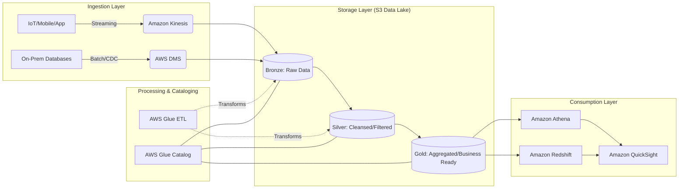

# Course Introduction

## Overview

In the modern era of cloud computing, the role of the Data Engineer has shifted from managing infrastructure and writing brittle ETL scripts to designing resilient, scalable, and automated data ecosystems. The fundamental problem we are solving is no longer "how do we store data," but "how do a thousand different data sources flow into a single source of truth with high integrity, low latency, and strict governance." 

The AWS Data Engineering ecosystem is not a single service, but a collection of highly integrated, decoupled components designed to handle the "Three Vs" of Big Data: Volume, Velocity, and Variety. As a Data Engineer on AWS, your job is to orchestrate these components into a cohesive pipeline. You are not just moving bytes; you are managing state, ensuring schema evolution, and implementing the "Medallion Architecture" (Bronze, Silver, Gold layers) to transform raw, messy telemetry into high-value, queryable business intelligence.

To pass the AWS Certified Data Engineer Associate (DEA-C01) exam, you must move beyond a superficial understanding of services like S3 or Glue. You must understand the *mechanics* of data movement. You need to know why a Kinesis Data Stream is the right choice for real-time fraud detection versus why an AWS Glue Crawler is necessary for discovering schema changes in an S3-based data lake. This course is designed to move you from "knowing the services" to "architecting the solution."

We will focus on the "Data Lakehouse" paradigm—the convergence of the flexibility of data lakes (S3) with the ACID transactions and performance of data warehouses (Redshift). We will treat data as a product, focusing on the reliability, security, and observability of the pipelines you build.

## Core Concepts

### The Data Lakehouse Paradigm
The cornerstone of modern AWS data engineering is the decoupling of storage and compute. Unlike traditional on-premises databases where storage and CPU are tightly coupled, AWS allows us to use S3 as a cost-effective, infinitely scalable storage layer, while spinning up compute (Glue, EMR, Athena) only when needed.

### Data Ingestion Patterns
*   **Batch Ingestion:** High-latency, high-throughput movement of data. Key services: AWS Glue, AWS Data Pipeline, Amazon AppFlow. Use this when data freshness is measured in hours or days.
*   **Streaming Ingestion:** Low-latency, continuous movement. Key services: Amazon Kinesis (Data Streams/Firehose), Amazon MSK (Managed Streaming for Kafka). Use this for real-time monitoring and alerting.

### Data Transformation (ETL vs. ELT)
*   **ETL (Extract, Transform, Load):** Transformations occur *before* the data reaches the target. Essential for PII masking and data cleansing before landing in a data lake.
*   **ELT (Extract, Load, Transform):** Raw data is loaded into the warehouse/lake, and transformations are performed using the power of the target engine (e.g., Redshift Spectrum or Athena). This is the modern standard for scalability.

### Schema Management and Evolution
In a distributed system, schemas change. A field might change from an `Integer` to a `Float`, or a new column might appear. You must understand how AWS Glue Data Catalog manages partitions and how to handle "schema drift" without breaking downstream Spark jobs or Athena queries.

### Data Partitioning and Formats
*   **Partitioning:** Organizing data in S3 using prefixes (e.s., `s3://my-bucket/year=2023/month=10/day=27/`). This is the single most important lever for performance.
*   **Columnar Formats:** Moving away from CSV/JSON to Parquet or Avro. These formats allow for "predicate pushdown"—the ability to read only the columns and rows required by a query, drastically reducing I/O and cost.

## Architecture / How It Works

The following diagram represents the standard "Medallion Architecture" we will master throughout this course. This is the blueprint for a production-grade AWS Data Pipeline.



## AWS Service Integrations

Successful data engineering relies on the "connective tissue" between services.

*   **Inbound (Data Sources to Pipeline):**
    *   **AWS DMS (Database Migration Service):** Moves data from RDS or On-prem Oracle/SQL Server into S3. It provides Change Data Capture (CDC) to keep S3 in sync with source databases.
    *   **Amazon Kinesis Data Firehose:** Acts as the "delivery stream," taking streaming data and automatically batching/compressing it into S3.
*   **Outbound (Pipeline to Consumers):**
    *   **Amazon Athena:** A serverless query engine that uses the Glue Data Catalog to run SQL directly against S3.
    *   **Amazon QuickSight:** The BI layer that consumes the "Gold" layer data for visualization.
*   **The Glue/Lake Formation Nexus:**
    *   **AWS Glue Data Catalog** is the central metadata repository.
    *   **AWS Lake Formation** sits on top of the Catalog to provide fine-grained access control (column-level and row-level security).
*   **IAM Trust Relationships:**
    *   A Glue ETL job requires an **IAM Execution Role** with `s3:GetObject`, `s3:PutObject`, and `glue:UpdateTable` permissions.
    *   Crucially, the role must have a **Trust Policy** allowing `glue.amazonaws.com` to assume the role.

## Security

Security in data engineering is not an afterthought; it is a foundational requirement.

*   **IAM and Resource-Based Policies:**
    *   **Identity-based:** Permissions attached to the User/Role (e.g., "Can this Glue job read S3?").
    *   **Resource-based:** Policies attached to the S3 bucket or KMS key (e.g., "Only this specific Role can access this bucket").
*   **Encryption at Rest:**
    *   **SSE-S3:** Managed by S3. Good for basic needs.
    *   **SSE-KMS:** Uses AWS KMS. Essential for auditing (you can see exactly *who* decrypted a file in CloudTrail). Use this for sensitive data.
    *   **SSE-C:** Customer-provided keys. Use only when regulatory requirements mandate you hold the keys.
*   **Encryption in Transit:** All data moving between services (e.g., Kinesis to S3) must use **TLS/SSL**.
*   **Network Isolation:**
    *   **VPC Endpoints (Interface & Gateway):** Ensure your data traffic stays within the AWS backbone and never traverses the public internet. This is a critical exam topic for "Secure Data Ingestion."
*   **Audit Logging:**
    *   **AWS CloudTrail:** Records every API call (e.g., `DeleteBucket`, `StartJobRun`).
    *   **S3 Access Logs/CloudWatch Logs:** Tracks the actual data access patterns.

## Performance Tuning

If you don't tune your pipeline, your AWS bill will grow exponentially with your data.

*   **The "Small File Problem":** Having millions of 1KB files in S3 kills performance. **Action:** Use Kinesis Firehose or Glue to coalesce small files into larger (128MB - 512MB) Parquet files.
*   **Partition Projection:** Instead of relying on heavy Glue Metadata lookups, use partition projection in Athena to compute partition values from the S3 path directly.
*   **Scaling Patterns:**
    *   **Vertical Scaling:** Increasing the `Worker Type` in Glue (e.g., moving from `G.1X` to `G.2X`) to handle larger memory-intensive joins.
    *   **Horizontal Scaling:** Increasing the number of DPUs (Data Processing Units) or Kinesis Shards to handle increased throughput.
*   **Data Formats:** Always prefer **Parquet** or **ORC** for analytical workloads. Use **Avro** for write-heavy, schema-evolution-intensive streaming workloads.
*   **Cost vs. Performance:** Using `S3 Intelligent-Tiering` is often more cost-effective than manually managing lifecycle policies for unpredictable access patterns.

## Important Metrics to Monitor

You cannot manage what you cannot measure. Monitor these in CloudWatch:

| Metric Name (Namespace: `AWS/Glue`) | What it Measures | Threshold to Alarm | Action to Take |
| :--- | :--- | :--- | :--- |
| `glue.driver.aggregate.elapsedTime` | Duration of the job. | > 2x historical average | Check for data skew or increased input volume. |
| `glue.driver.aggregate.memoryUtilization` | Memory pressure on the driver. | > 85% | Upgrade worker type (e.g., G.1X to G.2X). |
| `glue.executor.aggregate.memoryUtilization`| Memory pressure on executors. | > 90% | Check for "Large Object" processing or increase DPUs. |
| `AWS/Kinesis: GetRecords.IteratorAgeMilliseconds` | Latency of stream processing. | > 5000ms | Increase Kinesis Shards to improve throughput. |
| `AWS/S3: 4xxErrors` | Access denied or bad requests. | > 0 | Check IAM policies and Bucket Policies immediately. |
| `AWS/S3: BytesDownloaded` | Volume of data egress. | Sudden Spikes | Investigate potential data exfiltration or rogue process. |
| `AWS/Lambda: Errors` | Failure rate of transform functions. | > 1% | Check Dead Letter Queue (DLQ) and error logs. |

## Hands-On: Key Operations

In this course, we will use Python (`boto3`) as our primary tool for automation. Here is how you programmatically check the status of a Glue Job.

```python
import boto3
import time

# Initialize the Glue client
glue = botoly.client('glue', region_name='us-east-1')

def monitor_glue_job(job_name):
    """
    Fetches the status of a specific Glue job run.
    Crucial for orchestrating downstream dependencies.
    """
    try:
        # Get the most recent job run for the specified job
        response = glue.get_job_runs(JobName=job_name)
        
        # The first item in the list is the latest run
        latest_run = response['JobRuns'][0]
        run_id = latest_run['JobRunId']
        status = latest_run['JobRunState']
        
        print(f"Job: {job_name} | RunID: {run_id} | Status: {status}")
        
        # In a real pipeline, you would loop/wait here
        if status == 'SUCCEEDED':
            print("Pipeline proceeding to downstream transformation...")
        elif status == 'FAILED':
            print("ALERT: Pipeline failed. Triggering SNS Notification.")
            
    except Exception as e:
        print(f"Error retrieving Glue job status: {str(e)}")

# Usage
monitor_glue_job('my_daily_etl_job')
```

## Common FAQs and Misconceptions

**Q: Does AWS Glue run on EC2 instances?**
**A:** No. Glue is a serverless service. You do not manage the underlying instances; you manage the DPUs (Data Processing Units).

**Q: Can I use Athena to query CSV files?**
**A:** Yes, but it is highly inefficient. For production, you should always convert CSV to Parquet to leverage columnar reads.

**Q: Is S3 a database?**
**A:** No. S3 is an object store. It provides the *storage* for the data lake, but you need a metadata layer (Glue Catalog) and a query engine (Athena/Redshift) to interact with it like a database.

**Q: If I use Kinesis Firehose, do I still need an ETL tool?**
**A:** Firehose can perform basic transformations (via Lambda), but for complex joins, aggregations, and multi-source enrichment, you still need Glue or EMR.

**Q: What is the difference between a Security Group and a Network ACL?**
**A:** Security Groups are *stateful* (at the instance/ENI level); NACLs are *stateless* (at the subnet level). For Data Engineering, you primarily focus on Security Groups for your Glue/EMR clusters.

**Q: Can AWS Glue access data in a private VPC?**
**A:** Yes, but only if you configure a "Glue Connection" with the appropriate VPC, Subnet, and Security Group settings.

**Q: Does S3 provide ACID transactions?**
**A:** S3 provides strong read-after-write consistency, but it does *not* natively support multi-object ACID transactions. To achieve ACID, you must use frameworks like **Apache Iceberg** or **AWS Glue Data Quality**.

**Q: Is it cheaper to use Kinesis Data Streams or Kinesis Data Firehose?**
**A:** Streams is more expensive because you pay for shard-hour and data volume, but it offers lower latency. Firehose is cheaper for high-volume, near-real-time delivery where 1-5 minute latency is acceptable.

## Exam Focus Areas

To pass the DEA-C01, master these domains:

*   **Domain 1: Ingestion & Transformation**
    *   Selecting between Batch (Glue/DMS) vs. Streaming (Kinesis/MSK).
    *   Implementing CDC (Change Data Capture) via DMS.
    *   Applying Lambda transforms in Kinesis Firehose.
*   **Domain 2: Store & Manage**
    *   Designing S3 bucket structures (Partitioning/Prefixes).
    *   Managing the AWS Glue Data Catalog and Schema Evolution.
    *   Implementing fine-grained access control via AWS Lake Formation.
*   **Domain 3: Operate & Support**
    *   Monitoring pipeline health using CloudWatch Metrics.
    *   Troubleshooting Glue Job failures and Kinesis shard throttling.
    *   Implementing error handling via Dead Letter Queues (DLQs).
*   **Domain 4: Design & Create Data Models**
    *   Choosing between Row-based (Avro) and Columnar (Parquet) formats.
    *   Designing Medallion Architectures (Bronze/Silver/Gold).

## Quick Recap

*   **Decouple Everything:** Always separate storage (S3) from compute (Glue/Athena).
*   **Partitioning is King:** Use S3 prefixes to minimize data scanned and reduce costs.
*   **Prefer Columnar:** Use Parquet for analytical queries to leverage predicate pushdown.
*   **Security is Layered:** Combine IAM, KMS, and VPC Endpoints for a "Defense in Depth" strategy.
*   **Monitor Latency:** Watch `IteratorAge` in Kinesis to detect pipeline bottlenecks.
*   **Automate Everything:** Use Boto3 and CloudFormation to manage your infrastructure and job orchestrations.

## Blog & Reference Implementations

*   **AWS Big Data Blog:** The "Bible" for staying updated on new features in Glue, EMR, and Athena.
*   **AWS re:Invent Deep Dives:** Search for "Deep Dive: AWS Glue" to see real-world large-scale implementations.
*   **AWS Workshop Studio:** Hands-on labs for "Amazon Athena" and "AWS Glue."
*   **AWS Well-Architected Tool:** Specifically the "Data Analytics Lens" for architectural reviews.
*   **aws-samples GitHub:** Search for `aws-glue-samples` to see production-grade Python/PySpark ETL templates.