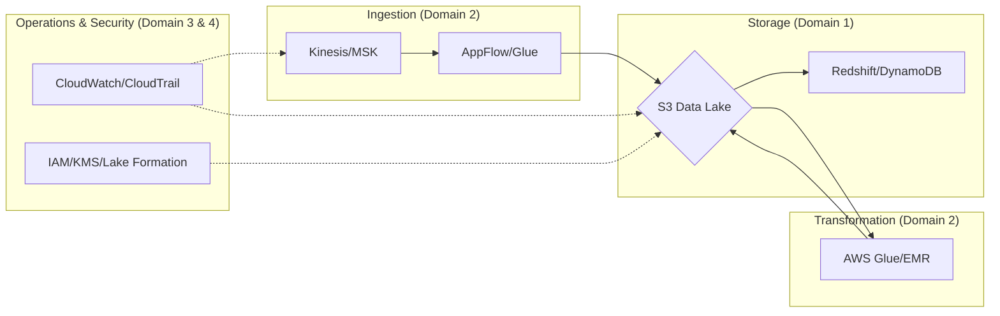

# Exam Overview and Strategy

## Overview

The AWS Certified Data Engineer – Associate (DEA-C01) is not a vocabulary test; it is a validation of your ability to architect, deploy, and manage data pipelines within the AWS ecosystem. Unlike the Cloud Practitioner exam, which focuses on high-level "what" questions, the DEA-C01 focuses on the "how" and the "why." It is designed to certify that you can handle the complexities of data ingestion, transformation, storage, and orchestration while maintaining the rigorous standards of security and cost-optimization required in production environments.

The fundamental problem this exam solves is the "skill gap" in the modern data stack. As organizations move away from monolithic on-premise ETL tools toward decoupled, distributed cloud architectures, the role of the Data Engineer has shifted. You are no longer just writing SQL; you are managing state in Kinesis, managing partitions in S3, and managing compute in Glue. This exam tests your ability to navigate this decoupled architecture, ensuring you can pick the right tool for the right throughput, latency, and cost profile.

In the broader AWS ecosystem, this certification acts as a bridge. It sits between the "Developer" (who writes the code) and the the "Architect" (who designs the infrastructure). For a Data Engineer, the exam validates that you understand the "data gravity" within AWS—how data flows from edge locations into S3, how it is processed by Spark-based engines, and how it eventually serves downstream analytics via Athena or Redshift.

## Core Concepts

To master this exam, you must understand the four pillars of the DEA-C01 blueprint. Think of these as the "operating constraints" of your study plan.

### The Four Domains (The Weightage)
The exam is structured around four domains. You cannot afford to neglect any of them, but you must allocate your study time based on their relative weight:
1.  **Domain 1: Design Data Stores and Architectures (26%)**: Focuses on choosing between S3, Redshift, and DynamoDB based on schema requirements (structured vs. unstructured) and access patterns.
2.  **Domain 2: Ingest and Transform Data (28%)**: The "heart" of the exam. Focuses on Kinesis, MSK, Glue, and AppFlow. You must understand the difference between batch and stream processing.
3.  **Domain 3: Operate and Support Data Pipelines (26%)**: Focuses on monitoring, logging, and the "Day 2" operations—orchestration with Step Functions or MWAA and error handling.
4.  **Domain 4: Secure and Manage Data in AWS (20%)**: Focuses on IAM, KMS, and Lake Formation.

### Question Modalities
The exam utilizes two primary question types:
*   **Multiple Choice**: One correct answer. Usually tests your ability to pick the "most cost-effective" or "most performant" solution.
*   **Multiple Response**: You must select two or more correct answers. These are the "trap" questions. If you miss one required component, the entire answer is wrong.

### The "Threshold" Concept
The passing score is not explicitly disclosed, but you should aim for an **85% consistency rate** in practice exams. In the world of AWS Data Engineering, "almost correct" is a production outage. If a solution is functionally correct but uses an expensive instance type when a Spot instance would work, it is a **wrong** answer for the exam.

## Architecture / How It Works

The following diagram illustrates the mental model you should use when approaching any exam question. Every question is essentially a request to complete this pipeline.



## AWS Service Integrations

In the context of the exam, "Integration" refers to how different services interact to form a cohesive pipeline. You must understand the "handshake" between services.

*   **Ingestion to Storage**: How does Kinesis Data Firehose deliver to S3? (Key concept: Buffering hints—Buffer Size and Buffer Interval).

*   **Transformation to Storage**: How does AWS Glue interact with the Glue Data Catalog to make S3 data queryable via Athena?
*   **Security Integration**: How does AWS Lake Formation provide fine-grained access control (cell-level security) on top of S3?
*   **IAM Trust Relationships**: You must understand that a Glue Service Role needs `s3:GetObject` permissions *and* `kms:Decrypt` permissions if the data is encrypted with a CMK. If you forget the KMS permission, the pipeline fails.
*   **Common Exam Pattern**: The "Serverless ETL Pattern." (S3 Event $\rightarrow$ Lambda $\rightarrow$ Glue $\rightarrow$ S3 $\rightarrow$ Athena).

## Security

Security is the most common area where engineers lose points. The exam treats security as a non-negotiable constraint.

*   **Identity and Access Management (IAM)**: Understand the difference between **Identity-based policies** (attached to a user/role) and **Resource-based policies** (attached to an S3 bucket). You must know when an S3 Bucket Policy is required to allow cross-account access.
*   **Encryption at Rest**: 
    *   **SSE-S3**: AWS manages the keys.
    *   **SSE-KMS**: You manage the keys (provides audit trails in CloudTrail).
    *   **SSE-C**: You provide the keys (rarely the "correct" answer in an AWS-native exam scenario).
*   **Encryption in Transit**: Always assume TLS (HTTPS) is required. Understand that VPC Endpoints (Interface vs. Gateway) are used to keep traffic within the AWS network, avoiding the public internet.
*   **Network Isolation**: Know how to use **S3 VPC Gateway Endpoints** to allow an EC2 instance in a private subnet to reach S3 without an Internet Gateway.
*   **Auditability**: CloudTrail is your source of truth for "Who did what." CloudWatch Logs is your source for "What happened inside the application."

## Performance Tuning

To pass the exam, you must learn to "tune" your study and your technical answers.

*   **Configuration Knobs (The "Correct" Answer Search)**:
    *   **Kinesis**: Tune `Shard Count` for throughput.
    *   **Glue**: Tune `Worker Type` (G.1X, G.2X) based on memory requirements.
    *   **S3**: Use `Partition Projection` in Athena to avoid expensive S3 `LIST` operations.
*   **Scaling Patterns**:
    *   **Horizontal**: Adding shards to Kinesis or nodes to EMR.
    *   **Vertical**: Increasing the instance size of a Redshift cluster.
*   **Data Format Optimization**: The exam loves **Parquet** and **ORC**. Why? Because they are columnar and support "predicate pushdown," which reduces the amount of data scanned (and thus reduces cost).
*   **Cost vs. Performance Trade-off**: This is the most important "tuning" skill. If a question asks for the *cheapest* way to run a job, and you pick a multi-node EMR cluster when a Glue job would suffice, you have failed the question.

## Important Metrics to Monitor

Use these metrics to monitor your **Exam Readiness**.

| Metric Name | Namespace | What it Measures | Threshold to Alarm | Action to Take |
| :--- | :--- | :--- | :--- | :--- |
| `Practice_Exam_Score` | `Study_Progress` | Your accuracy in mock tests. | `< 80%` | Re-study the specific Domain. |
| `Domain_Error_Rate` | `Study_Progress` | Which domain has the most misses. | `> 25%` | Deep dive into AWS Whitepapers for that domain. |
| `Concept_Retention` | `Memory` | Ability to recall service limits. | `Low` | Implement Spaced Repetition (Anki). |
| `HandsOn_Lab_Completion`| `Lab_Status` | Percentage of labs finished. | `< 100%` | Complete the remaining lab modules. |
| `Time_Per_Question` | `Exam_Simulation` | Speed of answering. | `> 2 mins` | Practice "skimming" and keyword identification. |

## Hands-On: Key Operations

You cannot pass this exam by reading; you must be able to manipulate the AWS environment.

### Operation 1: Inspecting S3 Metadata (The "Discovery" phase)
You need to know how to verify if a file is encrypted and what its format is.
```bash
# Check the encryption and metadata of an object
# This is critical for verifying KMS integration
aws s3api head-object --bucket my-data-lake --key raw/data_part_01.parquet
```

### Operation 2: Checking Glue Crawler Logs
When a pipeline fails, the first thing you do is check the logs.
```python
import boto3

# Using boto3 to identify the most recent error in CloudWatch Logs
# This simulates how you would debug a failed Glue Job in a real scenario
client = boto3less('logs')
response = client.describe_log_streams(
    logGroupName='/aws-glue/jobs/error',
    orderBy='LastEventTime',
    descending=True,
    limit=1
)
print(f"Latest Error Stream: {response['logStreams'][0]['logStreamName']}")
```

## Common FAQs and Misconceptions

**Q: I'm an expert in Python/Spark. Is this exam easy?**
**A:** No. This exam tests AWS-specific orchestration and integration (IAM, KMS, S3) as much as it tests coding logic.

**Q: Does "Serverless" always mean "Cheapest"?**
**A:** Not necessarily. For constant, high-throughput workloads, a provisioned Kinesis stream or EMR cluster might be more cost-effective than Lambda or Glue.

**Q: Is S3 Glacier the right place for all old data?**
**A:** Not if you need immediate access. You must distinguish between Glacier Instant Retrieval, Flexible Retrieval, and Deep Archive based on the "Retrieval Time" requirement in the prompt.

**Q: Can I use a single IAM user for my entire pipeline?**
**A:** In the exam, the answer is almost always **No**. You must use IAM Roles with the principle of Least Privilege.

**Q: Is Athena a database?**
**A:** No, it is an interactive query service. The "database" is the Glue Data Catalog.

**Q: What is the difference between Kinesis Data Streams and Firehose?**
**A:** Streams is for real-time, custom processing (requires manual scaling); Firehose is for near-real-time, "load and forget" delivery to S3/Redshift (fully managed).

**Q: Will knowing SQL help me?**
**A:** Immensely. Many questions revolve around Athena, Redshift, and Glue ETL logic.

**Q: If a question mentions "lowest latency," should I pick DynamoDB or Redshift?**
**A:** DynamoDB. Redshift is for analytical (OLAP) workloads; DynamoDB is for transactional (OLTP) low-latency workloads.

## Exam Focus Areas

*   **Ingestion & Transformation (Domain 2)**: Identifying the correct tool (Kinesis vs. MSK vs. AppFlow) based on source and frequency.
*   **Store & Manage (Domain 1)**: Partitioning strategies in S3 and choosing between Parquet and CSV.
*   **Operate & Support (Domain 3)**: Debugging Glue/EMR failures using CloudWatch and managing orchestration with Step Functions.
*   **Design & Create Data Models (Domain 4)**: Implementing Lake Formation permissions and KMS encryption policies.

## Quick Recap

*   **Think in Pipelines**: Every service is a link in a chain; identify where the break is.
*   **Cost is a Constraint**: Always look for the "most cost-effective" keyword.
*   **Security is Primary**: If the IAM/KMS part of the solution is missing, the solution is wrong.
*   **Format Matters**: Parquet and ORC are your best friends for performance.
*   **Decouple Everything**: Understand how S3 acts as the central "source of truth" for all services.
*   **Practice the "Why"**: Don't just learn what a service does; learn why you would choose it over another.

## Blog & Reference Implementations

*   [AWS Big Data Blog](https://aws.amazon.com/blogs/big-data/) - The definitive source for architectural patterns.
*   [AWS re:Invent Deep Dives](https://www.youtube.com/user/AWSreInvent) - Watch sessions on Glue and Redshift to see real-world scale.
*   [AWS Workshop Studio](https://workshops.aws/) - Search for "Data Engineering" to find hands-on labs.
*   [AWS Well-Architected Framework (Data Analytics Lens)](https://aws.amazon.com/architecture/well-architected/) - The "Bible" for designing reliable pipelines.
*   [AWS Samples GitHub](https://github.com/aws-samples) - Reference architectures for complex data ingestion patterns.