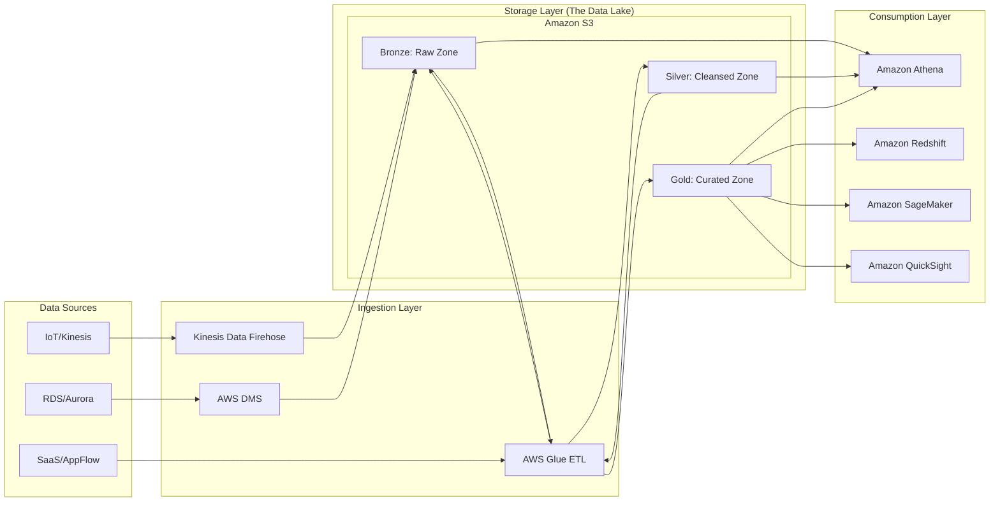

# AWS Data Architecture Foundations

## Overview

In the traditional on-premises world, data architecture was defined by "monolithic" scaling. If you needed more processing power for your ETL jobs, you had to buy more disks to expand your database. This tight coupling of compute and storage created a fundamental ceiling: you were always over-provisioning storage just to get the CPU cycles you needed, or over-provisioning compute and leaving expensive disks idle.

The "AWS Data Architecture Foundation" is built on a single, revolutionary principle: **The decoupling of compute and storage.** 

In a modern AWS data architecture, we treat storage (Amazon S3) as a highly durable, infinitely scalable, and low-cost "Single Source of Truth." We then attach compute resources (AWS Glue, Amazon EMR, Amazon Athena, or Amazon Redshift Spectrum) to that storage only when needed. This allows a data engineer to scale a processing cluster to 100 nodes to handle a heavy morning transformation and then spin it down to zero, while the data remains safely and cheaply stored in S3.

This section covers the architectural blueprint that powers almost every successful data pipeline on AWS. We will move away from the idea of a "database-centric" view toward a "data-lake-centric" view. You will learn why the "Medallion Architecture" (Bronze, Silver, Gold layers) is the industry standard for managing data quality and how to design systems that are not just functional, but cost-optimized and resilient to the "small file problem."

---

## Core Concepts

### Decoupling Compute and Storage
The fundamental pillar of AWS data engineering. By using Amazon S3 as the storage layer, you separate the cost of keeping data from the cost of processing it. 
*   **Impact:** You can run an Athena query (Serverless Compute) against petabytes of data without ever managing a single server.

### Schema-on-Write vs. Schema-on-Read
*   **Schema-on-Write (Traditional/Redshift):** Data must be structured and validated against a predefined schema *before* it can be loaded. This ensures high data quality but makes ingestion slow and brittle to upstream changes.
*   **Schema-on-Read (Modern/S3/Athena):** Data is loaded in its raw form (JSON, CSV, Parquet). The structure is applied by the compute engine *at the moment of the query*. This provides massive agility for ingestion but requires much more discipline in the "Transformation" layer to avoid a "Data Swamp."

### The Medallion Architecture (Data Lake Layers)
To prevent a Data Lake from becoming a Data Swamp, we implement logical layers:
1.  **Bronze (Raw):** The landing zone. Data is ingested exactly as it is from the source (immutable). No transformations allowed here.
2.  **Silver (Cleansed/Transformed):** Data is filtered, joined, and standardized. This is where we enforce types and handle nulls.
3.  **Gold (Curated/Business):** Aggregated, highly optimized data ready for consumption by BI tools like QuickSight or ML models in SageMaker.

### Columnar vs. Row-Based Storage
*   **Row-Based (CSV, JSON, Avro):** Great for transactional workloads (OLTP). Good when you need to read every field in a record.

*   **Columnar (Parquet, ORC):** The gold standard for Data Engineering (OLAP). Great for analytical queries. If your query only asks for `SUM(sales_amount)`, the engine only reads the `sales_amount` column, drastically reducing I/O and cost.

---

## Architecture / How It Works

The following diagram illustrates the standard "Decoupled Data Pipeline" pattern used in most enterprise AWS environments.



---

## AWS Service Integrations

A data engineer's job is essentially managing the "glue" between these services.

### Inbound (Data Ingestion)
*   **AWS DMS (Database Migration Service):** Moves data from on-prem or RDS into S3. It uses Change Data Capture (CDC) to stream updates.
*   **Amazon Kinesis Data Firehose:** The primary service for "streaming to S3." It handles buffering, compression, and format conversion (e.g., JSON to Parquet) automatically.
*   **Amazon AppFlow:** Connects SaaS platforms (Salesforce, Zendesk) directly to S3.

### Outbound (Data Consumption)
*   **Amazon Athena:** An interactive query service that uses standard SQL to analyze data directly in S3. It is the primary tool for the "Silver" and "Gold" layers.
*   **Amazon Redshift Spectrum:** Allows Redshift (your warehouse) to query data residing in S3 (your lake), enabling a "Lakehouse" architecture.
*   **Amazon QuickSight:** The BI layer that visualizes the "Gold" layer data.

### Integration Patterns & IAM
*   **The Service-Linked Role Pattern:** When Glue runs a job, it needs an IAM Role with `s3:GetObject`, `s3:PutObject`, and `glue:CreateDatabase` permissions.
*   **The Trust Relationship:** You must ensure that the Glue service principal (`glue.amazonaws.com`) is allowed to assume the role you've created.
*   **Cross-Account Pattern:** In production, Ingestion often happens in a "Producer Account," while Transformation/Analytics happens in a "Consumer Account." This requires S3 Bucket Policies that explicitly allow the Consumer Account's IAM Roles to access the Producer's S3 buckets.

---

## Security

Security in data engineering is not an afterthought; it is the foundation.

*   **IAM & Fine-Grained Access:** Do not use `s3:*`. Use specific permissions for specific prefixes. Use **AWS Lake Formation** to implement cell-level and column-level security (e.g., "Accountants can see the `salary` column, but Analysts cannot").
*   **Encryption at Rest:**
    *   **SSE-S3:** AWS manages the keys. Good for non-sensitive logs.
  	*   **SSE-KMS:** You manage the keys via AWS KMS. **Mandatory** for production. Allows for audit trails via CloudTrail (who used the key to decrypt this data?).
*   **Encryption in Transit:** Always use TLS (HTTPS) for all data movement. When working within a VPC, use **VPC Endpoints (PrivateLink)** for S3 and Glue so that data never traverses the public internet.
*   **Network Isolation:** Data pipelines should reside in private subnets. Use Security Groups to ensure that only your Glue/EMR clusters can talk to your RDS instances.
*   **Audit Logging:** 
    *   **AWS CloudTrail:** Logs every API call (who deleted the S3 bucket?).
    *   **S3 Access Logs:** Logs every object-level request (who downloaded the sensitive CSV?).

---

## Performance Tuning

If you don't tune your architecture, you will fail the "Cost Optimization" portion of the exam.

1.  **The "Small File Problem":** Having millions of 1KB files in S3 will destroy Athena/Glue performance. The overhead of opening each file exceeds the time spent reading data. 
    *   **Fix:** Use Kinesis Firehose to buffer data or use Glue to "compact" small files into larger ~128MB to 512MB files.
2.  **Partitioning:** This is the #1 performance lever. Instead of `s3://my-bucket/data.parquet`, use `s3://my-bucket/year=2023/month=10/day=27/data.parquet`. 
    *   **Why:** Athena will "prune" partitions, skipping entire folders that don't match your `WHERE` clause.
3.  **Columnar Format (Parquet):** Always convert CSV/JSON to Parquet in your Silver layer. It reduces the amount of data scanned, which directly reduces your Athena bill.
4.  **S3 Partition Projection:** For high-cardinality partitions (like many days/hours), don't rely on Glue Crawlers to find partitions. Use Partition Projection in your Athena table properties to calculate partition locations mathematically.
5.  **Compression:** Use **Snappy** compression with Parquet. It provides a great balance between compression ratio and CPU overhead for decompression.

---

## Important Metrics to Monitor

| Metric Name (Namespace: Metric) | What it Measures | Threshold to Alarm | Action to Take |
| :--- | :--- | :--- | :--- |
| `Kinesis/GetRecords.IteratorAgeMilliseconds` | The delay between data arriving in the stream and your application processing it. | > 60,000 (1 min) | Scale up your consumers (Lambda or KCL). |
| `Glue/glue.driver.aggregate.numCompletedStages` | Whether your Glue ETL jobs are progressing or stuck. | 0 (for an active job) | Check logs for OOM (Out of Memory) or infinite loops. |
| `S3/AllRequests` (S3 Namespace) | Sudden spikes in request volume. | 2x baseline | Check for a "runaway" Lambda function or a security breach. |
| `S3/4xxErrors` | Client-side errors (e.g., Access Denied or NoSuchKey). | > 5 in 5 mins | Inspect IAM policies or check for broken file paths in code. |
| `Glue/glue.executor.jvm.heap.usage` | Memory pressure on your Glue workers. | > 85% | Increase the Worker Type (e.g., from `G.1X` to `G.2X`). |
| `CloudWatch/Lambda/Duration` | Time taken to run your ingestion Lambda. | Approaching 9 mins | Refactor code or move to a more robust service like Glue. |

---

## Hands-On: Key Operations

### Task 1: Automating S3 Partitioning (Python/Boto3)
In production, we often need to move files from a "Landing" zone to a "Processed" zone while applying a partition structure.

```python
import boto3

def move_to_partitioned_zone(src_bucket, dest_bucket, file_key, year, month, day):
    s3 = boto3.client('s3')
    
    # Define the new partitioned path (The 'Silver' Layer pattern)
    new_key = f"silver/year={year}/month={month}/day={day}/{file_key.split('/')[-1]}"
    
    # Copy the object to the new partitioned location
    # We use copy_object because it's an atomic metadata operation in S3
    copy_source = {'Bucket': src_bucket, 'Key': file_key}
    
    try:
        s3.copy_object(Bucket=dest_bucket, CopySource=copy_source, Key=new_key)
        print(f"Successfully moved {file_key} to {new_key}")
        
        # Cleanup: Delete the raw file from the Bronze zone
        s3.delete_object(Bucket=src_bucket, Key=file_key)
    except Exception as e:
        print(f"Error moving file: {str(e)}")

# Usage: Moving a raw JSON file to a structured Silver zone
move_to_partitioned_zone('my-bronze-bucket', 'my-silver-bucket', 'uploads/data_123.json', '2023', '10', '27')
```

### Task 2: Creating an Athena Table with Partition Projection (SQL)
Avoid the "Glue Crawler overhead" by defining your partitions manually in the DDL.

```sql
CREATE EXTERNAL TABLE IF NOT EXISTS my_database.processed_sales (
  order_id string,
  amount double,
  customer_id string
)
PARTITIONED BY (year string, month string, day string)
STORED AS PARQUET
LOCATION 's3://my-silver-bucket/sales/'
TBLPROPERTIES (
  'projection.enabled' = 'true',
  'projection.year.type' = 'integer',
  'projection.year.range' = '2020,2025',
  'projection.month.type' = 'integer',
  'projection.month.range' = '1,12',
  'projection.month.digits' = '2',
  'projection.day.type' = 'integer',
  'projection.day.range' = '1,31',
  'projection.day.digits' = '2'
);
-- This allows Athena to 'calculate' where the data is without needing a Glue Crawler.
```

---

## Common FAQs and Misconceptions

**Q: I have a small amount of data. Why shouldn't I just use Amazon RDS?**
**A:** RDS is for OLTP (transactions). If you start performing heavy analytical aggregations (e.g., `SUM`, `GROUP BY` over millions of rows), you will lock your tables and crash your application. Use S3/Athena for analytics.

**Q: Does a Glue Crawler create the data in S3?**
**A:** No. A Crawler *discovers* metadata. It reads the existing files in S3 and updates the AWS Glue Data Catalog so Athena can query them.

**Q: Is S3 "Schema-on-Read" or "Schema-on-Write"?**
**A:** S3 is just storage. The *architecture* is Schema-on-Read. S3 doesn't care about your schema; the compute engine (Athena/Glue) applies it.

**Q: Can I use Glue to transform JSON directly into Parquet?**
**A:** Yes, this is the standard pattern for the "Bronze to Silver" transition.

**Q: What is the "Small File Problem" and how does it affect cost?**
**A:** Many small files cause high S3 `GET` request costs and high Athena "data scanned" costs due to metadata overhead. Always compact small files.

**Q: If I use SSE-KMS, does it make my queries slower?**
**A:** The latency impact is negligible, but you must ensure your IAM roles have `kms:Decrypt` permissions, otherwise, your queries will fail with "Access Denied."

**Q: Is it cheaper to use CSV or Parquet in S3?**
**A:** Parquet is more expensive to *compute* (due to CPU for compression) but significantly cheaper to *query* (due to reduced data scanning). For any analytical workload, Parquet wins.

**Q: Can Athena query data across different AWS accounts?**
**A:** Yes, but you must explicitly grant the Athena IAM role from Account A permission to access the S3 bucket in Account B via a Bucket Policy.

---

_Note: This concludes Section 3. In the next section, we will dive deep into Amazon S3: The Foundation of the Data Lake._

---

## Exam Focus Areas

**Domain: Design & Create Data Models**
*   Selecting between Columnar (Parquet) and Row-based (JSON) formats based on use case.
*   Designing Partitioning strategies to optimize query performance.
*   Implementing the Medallion (Bronze/Silver/Gold) architecture.

**Domain: Ingestion & Transformation**
*   Choosing between Kinesis Firehose (Streaming) and Glue/DMS (Batch/CDC).
*   Understanding how to use Glue for schema evolution and format conversion.

**Domain: Store & Manage**
*   Implementing S3 lifecycle policies (Transitioning to Glacier).
*   Implementing fine-grained access control using AWS Lake Formation.

**Domain: Operate & Support**
*   Identifying "Small File" bottlenecks using CloudWatch.
*   Monitoring Kinesis `IteratorAge` to detect ingestion lag.

---

## Quick Recap
*   **Decoupling is King:** Always separate compute (Glue/Athena) from storage (S3).
*   **Format Matters:** Use Parquet/Snappy for analytics to reduce cost and increase speed.
*   **Partition Strategically:** Use partitions (Year/Month/Day) to enable partition pruning.
*   **Avoid Small Files:** Compact small files into larger chunks to prevent performance degradation.
*   **Security is Multi-layered:** Use IAM for identity, KMS for encryption, and Lake Formation for fine-grained access.
*   **Schema-on-Read is Flexible:** Use it for agility, but use Glue/Athena to enforce structure in your Silver layer.

---

## Blog & Reference Implementations
*   **AWS Big Data Blog:** [Best practices for Amazon S3 partitioning](https://aws.amazon.com/blogs/big-data/)
*   **AWS re:Invent Session:** ["Building a Data Lake on AWS" (Deep Dive)](https://www.youtube.com/user/AWSOnlineTech)
*   **AWS Workshop Studio:** [Serverless Data Lake Workshop](https://catalog.us-east-1. workshops.aws/)
*   **AWS Well-Architected:** [Data Lake Design Patterns](https://aws.amazon.com/architecture/well-architected/)
*   **AWS Samples GitHub:** [AWS Glue ETL Patterns and Templates](https://github.com/aws-samples)