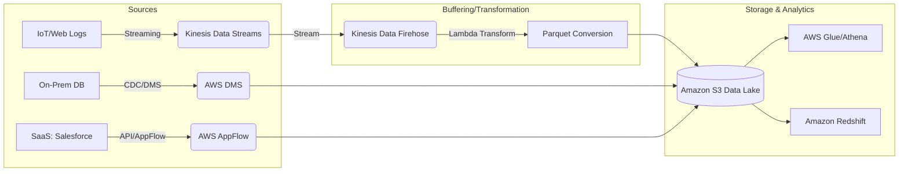

# Section 4: Data Ingestion

## Data Ingestion

### Overview
Data ingestion is the foundational stage of any data pipeline. In the AWS ecosystem, ingestion is not a single action but a spectrum of patterns ranging from **Real-time Streaming** (low latency, high velocity) to **Batch Processing** (high volume, high latency) and **Change Data Capture (CDC)** (synchronizing state). The primary challenge you will face as a Data Engineer is not just moving bits from point A to point/B, but managing the "impedance mismatch" between producers and consumers.

The core problem ingestion solves is **decoupling**. Producers (IoT devices, web servers, SaaS applications) operate on their own schedules and scales. Consumers (S3, Redshift, Athena, OpenSearch) have their own processing constraints. Without a robust ingestion layer, a spike in web traffic could overwhelm your downstream analytics engine, leading to data loss or system failure.

In the context of the AWS Certified Data Engineer Associate exam, you must view ingestion through the lens of **Latency vs. Cost vs. Complexity**. You will choose Kinesis for sub-second requirements, AWS DMS for database replication, AppFlow for third-party SaaS integration, and AWS Glue for scheduled batch movement. Choosing the wrong pattern isn't just a performance issue; it's a massive architectural cost error.

### Core Concepts

#### 1. Streaming Ingestion (Kinesis Data Streams & MSK)
*   **Shards (Kinesis):** The fundamental unit of throughput. A shard provides a fixed capacity (1MB/s ingress, 2MB/s egress). **Crucial Exam Note:** Scaling Kinesis is *manual* (resharding) unless you use Kinesis Data Streams On-Demand, which manages capacity for you but at a higher base cost.
*   **Partitions & Partition Keys:** This is how data is distributed across shards. A poor partition key (e.g., a constant value like `user_id=1`) leads to a **"Hot Shard"**—where one shard is overwhelmed while others are idle.
*   **Retention Period:** Default is 24 hours, but can be extended up and to 365 days. Increasing retention increases cost.

#### 2. Delivery/Buffered Ingestion (Kinesis Data Firehose)
*   **Buffer Hints:** Firehose doesn't send data immediately. It buffers based on **Size** (e.g., 5MB) or **Time** (e.g., 60 seconds). This is the "knob" you turn to balance latency vs. file count in S3.
*   **Transformation:** Firehose can trigger an AWS Lambda function to transform raw JSON into Parquet or Avro *in-flight* before it hits S3.

#### 3. Database/Change Data Capture (AWS DMS)
*   **Full Load vs. CDC:** Full Load moves the existing dataset; CDC captures only the changes (Inserts, Updates, Deletes) by reading the database transaction logs (e.g., Binlog in MySQL).
*   **Replication Instance:** The compute resource that performs the heavy lifting. If this instance is undersized, your CDC latency will spike.

#### 4. Managed SaaS Ingestion (AWS AppFlow)
*   **Zero-ETL/No-Code:** AppFlow is a "Pull" mechanism. It connects to SaaS (Salesforce, Zend/Zendesk, Slack) and moves data to AWS targets. It is specifically designed for when you don't want to manage complex API integrations.

### Architecture / How It Works

The following diagram illustrates the three primary ingestion patterns used in production-grade AWS architectures.



### AWS Service Integrations

*   **Inbound Integrations:**
    *   **AWS IoT Core:** Publishes messages directly to Kinesis Data Streams.
    *   **CloudWatch Logs:** Can be streamed via Kinesis Data Firehose for real-time log analysis.
    *   **On-Premise Databases:** Connected via AWS Site-to-Site VPN or Direct Connect to facilitate DMS replication.
*   **Outbound Integrations:**
    *   **S3 (The "Landing Zone"):** The universal destination for almost all ingestion services.
    *   **Amazon Redshift:** Via Firehose (streaming) or DMS (batch/CDC).
    *   **Amazon OpenSearch:** Via Firehose for real-time log indexing.
*   **IAM & Trust Relationships:**
    *   **Service-Linked Roles:** Kinesis Firehose requires an IAM role that allows it to `s3:PutObject` and `lambda:InvokeFunction`.
    *   **DMS Resource Access:** The DMS replication instance must have an IAM role with permissions to access the source (e.g., S3 for logs) and the target (e.g., Redshift).
*   **Multi-Service Pattern (The "Lambda Architecture"):**
    *   *Pattern:* Kinesis Data Streams (Real-time) $\rightarrow$ Kinesis Data Analytics (Flink) $\rightarrow$ OpenSearch.
    *   *Pattern:* Kinesis Data Streams $\rightarrow$ Kinesis Firehose $\rightarrow$ S3 $\rightarrow$ Glue $\rightarrow$ Athena (Batch/Historical).

### Security

*   **Encryption at Rest:**
    *   **Kinesis/MSK/S3:** Use **AWS KMS (SSE-KMS)**. For high-compliance workloads, use Customer Managed Keys (CMK) to maintain control over rotation policies.
    able to avoid `SSE-S3` for sensitive data to ensure auditability via CloudTrail.
*   **Encryption in Transit:**
    *   All ingestion-related APIs must use **TLS 1.2+**.
    *   When moving data from On-Prem to AWS (DMS), use **AWS Direct Connect** or **VPN** to ensure data never traverses the public internet.
*   **Network Isolation:**
    *   **VPC Endpoints (Interface Endpoints/PrivateLink):** Critical for security. Ensure your Kinesis/S3 traffic stays within the AWS network backbone, avoiding the public internet.
    *   **Security Groups:** Applied to DMS Replication Instances and MSK brokers to restrict ingress to known application CIDRs.
*   **Audit & Compliance:**
    *   **AWS CloudTrail:** Every `CreateStream`, `DeleteTable`, or `StartReplicationTask` event is logged.
    *   **S3 Block Public Access:** Always enabled on the ingestion landing zone.

### Performance Tuning

*   **Kinesis Data Streams:**
    *   **Avoid Hot Shards:** Use high-cardinality partition keys (e.g., `UUID` or `transaction_id`) instead of `region_id`.
    *   **Scaling:** Use **Kinesis On-Demand** if your traffic is unpredictable; use **Provisioned Mode** if you have a steady, predictable stream to save ~30% in costs.

*   **Kinesis Data Firehose:**
    *   **Buffer Tuning:** If you have many small files in S3, increase the buffer size (up to 128MB) or time (up to 900s). This reduces S3 `PUT` costs and improves Athena query performance (fewer, larger files).
*   **AWS DMS:**
    *   **Instance Sizing:** Monitor `CPUUtilization` and `FreeableMemory` on the replication instance.
    *   **Multi-AZ:** Always use Multi-AZ for production CDC tasks to prevent downtime during an AWS availability zone failure.
*   **Data Format:**
    *   **Always convert to Columnar (Parquet/ORC):** Perform this during the Firehose transformation stage or via Glue. This drastically reduces the amount of data scanned by Athena/Redshift.

### Important Metrics to Monitor

| Metric Name (Namespace: Kinesis/DMS/etc) | What it Measures | Threshold to Alarm | Action to Take |
| :--- | :--- | :--- | :--- |
| `GetRecords.IteratorAgeMilliseconds` (Kinesis) | Delay between data production and consumption. | > 60,000ms (1 min) | Scale up shards or check consumer Lambda performance. |
| `IncomingBytes` (Kinesis) | Throughput volume entering the stream. | Near Shard Limit (1MB/s) | Initiate shard splitting (resharding). |
| `WriteProvisionedThroughputExceeded` (Kinesis) | Throttling events due to shard capacity limits. | $> 0$ | Increase shards or check for hot shards. |
| `CDCLatency` (DMS) | Delay in applying changes from source to target. | $> 5$ minutes | Scale up DMS Replication Instance size. |
| `CPUUtilization` (DMS) | Compute load on the replication instance. | $> 80\%$ | Upgrade instance class (Vertical Scaling). |
| `S3.PutRequests` (S3) | Frequency of write operations to the landing zone. | Sudden spikes | Review Firehose buffer settings to batch more data. |

### Hands-On: Key Operations

#### 1. Creating a Kinesis Data Stream (Boto3)
```python
import boto3

client = boto3.client('kinesis', region_name='us-east-1')

# We use 'on_demand' for the exam-ready, scalable architecture 
# to avoid manual shard management in unpredictable workloads.
def create_stream(stream_name):
    try:
        response = client.create_stream(
            StreamName=stream_name,
            StreamModeDetails={'StreamMode': 'ON_DEMAND'}
        )
        print(f"Successfully created stream: {stream_name}")
        return response
    except Exception as e:
        print(f"Error: {e}")

create_stream('production-telemetry-stream')
```

#### 2. Checking Consumer Lag (Python/Boto3)
```python
import boto3

client = boto3.client('cloudwatch')

def check_iterator_age(stream_name):
    # High IteratorAge is the #1 cause of data loss in streaming pipelines.
    # It means your application is too slow to keep up with the stream.
    response = client.get_metric_statistics(
        Namespace='AWS/Kinesis',
        MetricName='GetRecords.IteratorAgeMilliseconds',
        Dimensions=[{'Name': 'StreamName', 'Value': stream_name}],
        StartTime='2023-10-01T00:00:00Z', # Use actual time window
        EndTime='2023-10-01T01:00:00Z',
        Period=300,
        Statistics=['Maximum']
    )
    return response['Datapoints']

print(check_iter_age('production-telemetry-stream'))
```

### Common FAQs and Misconceptions

**Q: Does Kinesis Data Firehose support real-time sub-second latency?**
**A:** No. Firehose is a buffered service. It has a minimum buffer interval of 60 seconds. For sub-second, use Kinesis Data Streams.

**Q: If I increase the number of shards in Kinesis, does the data automatically rebalance?**
**A:** Only if you perform a "split" operation on specific shards. Adding shards doesn't automatically move existing data; you must manage the repartitioning logic for the keys.

**Q: Can AWS DMS perform complex SQL transformations during ingestion?**
**A:** No. DMS is for movement and minimal mapping. For complex transformations, use AWS Glue or Kinesis Data Analytics (Flink).

**Q: Is Kinesis Data Streams cheaper than Kinesis Data Firehose for simple S3 dumps?**
**A:** Generally, no. Firehose is a managed service that handles the heavy lifting (buffering, S3 writes, Parquet conversion). Streams requires you to manage the consumers (Lambda/EC2).

**Q: What happens if my Kinesis stream reaches its capacity?**
**A:** You will see `ProvisionedThroughputExceeded` errors, and producers will be throttled (data may be dropped if not retried).

**Q: Can AppFlow be used to ingest data from an S3 bucket into Redshift?**
**A:** No. AppFlow is specifically for SaaS-to-AWS. For S3-to-Redshift, use `COPY` commands, Glue, or Redshift Spectrum.

**Q: Does DMS require a connection to the internet?**
**A:** No. In a production environment, you should use VPC Endpoints and private subnets so DMS communicates with your RDS/Aurora instances over the private AWS network.

**Q: Why is "Hot Sharding" a problem in Kinesis?**
**A:** It creates a bottleneck. Even if you have 100 shards, if all your data has the same partition key, only 1 shard is doing work, and you are still limited to 1MB/s.

### Exam Focus Areas

*   **Ingestion & Transformation (Domain 1):** Choosing between Streams (Real-time) vs. Firehose (Buffered) vs. DMS (CDC). Identifying the impact of partition keys on throughput.
*   **Store & Manage (Domain 2):** Configuring S3 bucket policies and KMS for incoming data. Managing partition hierarchies in S3 (e.g., `year=2023/month=10/`).
*   **Operate & Support (Domain 4):** Monitoring `IteratorAge` and `CPUUtilization`. Troubleshooting DMS replication lag and Kinesis throttling.
*   **Design & Create Data Models (Domain 3):** Designing partition keys to avoid hot shards. Designing Parquet/Avro schemas for efficient downstream consumption.

### Quick Recap
- [ ] **Decouple** producers and consumers using Kinesis or MSK.
- [ ] **Choose Firehose** for low-maintenance, buffered delivery to S3/Redshift.
- [ ] **Avoid Hot Shards** by using high-cardinality partition keys in Kinesis.
- [ ] **Monitor IteratorAge** to detect when your consumers are falling behind.
- [ ] **Use DMS** specifically for database replication and Change Data Capture (CDC).
- [ ] **Transform to Parquet** during ingestion to optimize downstream costs and performance.

### Blog & Reference Implementations
*   [AWS Big Data Blog](https://aws.amazon.com/blogs/big-data/): Best for architectural patterns (e.g., "Real-time analytics with Kinesis").
*   [AWS re:Invent - Kinesis Deep Dive](https://www.youtube.com/user/AWSFTW): Essential for understanding shard internals.
*   [AWS Workshop Studio - Data Engineering](https://workshop.aws/): Hands-on labs for setting up Kinesis/Glue pipelines.
*   [AWS Well-Architected Framework - Data Analytics Lens](https://docs.aws.amazon.com/wellarchitected/latest/data-analytics-lens/data-analytics-lens.html): The gold standard for designing resilient pipelines.
*   [AWS Samples GitHub](https://github.com/aws-samples): Search for "Kinesis-Firehose-Lambda-Transformation" for production-ready code.