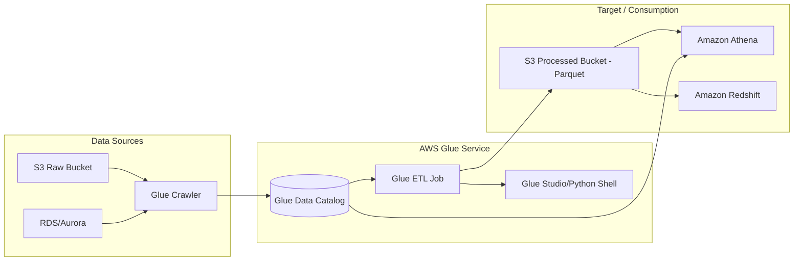

# AWS Glue Deep Dive

## Overview

In the modern data engineering landscape, the primary challenge isn't just moving data; it's managing the metadata and the scale of transformation. AWS Glue is the foundational serverless ETL (Extract, Transform, Load) service that provides the "connective tissue" for the AWS Data Ecosystem. While services like Kinesis handle data in motion and S3 handles data at rest, Glue provides the intelligence to understand what that data actually is and how to transform it into a queryable, high-performance format.

The fundamental problem Glue solves is the "Schema Drift" and "Data Silo" problem. In a large enterprise, data arrives in various formats (JSON, CSV, Parquet, Avro) from various sources (RDS, S3, MongoDB). Without a centralized way to track schemas, downstream consumers like Amazon Athena or Amazon Redshift Spectrum are blind. Glue's Data Catalog acts as a persistent, centralized metadata repository, allowing you to treat your S3-based data lake as if it were a structured relational database.

From an architectural standpoint, you should view Glue not as a single service, running a single script, but as a suite of capabilities: **Crawlers** for discovery, **Data Catalog** for metadata management, **ETL Jobs** (Spark, Python, and Ray) for heavy lifting, and **Glue Studio/DataBrew** for low-code/no-code transformation. When designing pipelines for the DEA-C01 exam, remember that Glue is the "intelligence layer" that sits between your raw ingestion layer and your analytical consumption layer.

---

## Core Concepts

### The Glue Data Catalog
The heart of the service. It is a Hive-metastore-compatible repository.
*   **Databases:** Logical groupings of tables.
*   **Tables:** Metadata definitions (schema, partition keys, storage descriptors).
*   **Partitions:** A critical optimization. Partitions allow engines like Athena to skip scanning irrelevant S3 prefixes. 
*   **Note:** The Catalog does *not* store the actual data; it only stores the metadata (the "map" to the data).

### AWS Glue Crawlers
Automated processes that connect to a data store, determine the schema, and populate the Data Catalog.
*   **Behavior:** Crawlers use classifiers to infer schema. If a new column appears in your JSON, the crawler detects it and updates the table definition.

*   **The Trap:** Running crawlers too frequently on large S3 buckets is a common cost-sink and can lead to "partition bloat" if not configured to respect existing partitions.

### AWS Glue ETL Jobs
The compute engine. You have three main flavors:
1.  **Spark Jobs (PySpark/Scala):** Distributed processing for massive datasets. Uses **DPUs (Data Processing Units)**.
2.  **Python Shell Jobs:** For small-scale ETL. It uses a single-node architecture. It is significantly cheaper than Spark for tasks that don't require distributed computing (e.g., moving small CSVs to Parquet).
3.  **Ray Jobs:** A newer, high-performance distributed framework for Python, optimized for much faster scaling of Python-heavy workloads compared to Spark.

### Glue Dynamic Frames
This is a "Glue-specific" concept you **must** know. While Spark uses `DataFrames`, Glue uses `DynamicFrames`.
*   **Why it exists:** Standard Spark DataFrames require a fixed schema. If a single record in a million has a string where an integer should be, Spark might fail or nullify the data. 
*   **The Advantage:** `DynamicFrames` handle "schema evolution" and semi-structured data natively by allowing each record to have its own schema. They are designed to handle "dirty" data without crashing the job.

### Computing Units: DPUs
AWS Glue scales using **DPUs (Data Processing Units)**. 
*   1 DPU = 4 vCPUs and 16 GB of RAM.
*   **Limit/Quota:** You are subject to service quotas on the number of concurrent DPUs in a region. If your job requests 100 DPEX but your quota is 50, the job will fail to start.

---

## Architecture / How It Works

The following diagram illustrates the lifecycle of a standard Data Lake ingestion pattern:



---

## AWS Service Integrations

### Data Inflow (Sources)
*   **Amazon S3:** The primary source for all Glue operations.
*   **Amazon RDS/Aurora:** Glue uses JDBC connectors to crawl and extract structured data.
*   **Amazon Kinesis/MSK:** Glue **Streaming** jobs can consume real-time data from Kinesis Data Streams or Managed Streaming for Kafka, allowing for real-time ETL.

### Data Outflow (Sinks)
*   **Amazon Athena:** Queries the Glue Data Catalog directly.
*   **Amazon Redshift:** Glue can load data into Redshift via the `COPY` command or use Redshift Spectrum to query S3 via the Glue Catalog.
*   **Amazon OpenSearch:** Glue can transform and index data for search workloads.

### IAM & Trust Relationships
*   **Glue Service Role:** The Glue Job/Crawler requires an IAM Role. 
*   **Required Permissions:** 
    *   `s3:GetObject` and `s3:PutObject` for the data buckets.
    *   `glue:GetTable`, `glue:CreateTable` for the Catalog.
    *   **Trust Policy:** The role must have a trust relationship allowing `glue.amazonaws.com` to assume the role.

### Common Pipeline Pattern (The Exam Favorite)
**Pattern:** *S3 (JSON) $\rightarrow$ Glue Crawler $\rightarrow$ Glue Catalog $\rightarrow$ Glue ETL (Transform to Parquet) $\rightarrow$ S3 (Parquet) $\rightarrow$ Athena.*
This pattern optimizes for cost (Parquet is cheaper to query) and performance (Partitioning).

---

## Security

### Identity and Access Management (IAM)
*   **Fine-Grained Access Control:** You can use **AWS Lake Formation** (which sits on top of Glue) to provide cell-level or row-level security. Standard IAM can only restrict access to the entire database or table.
*   **Resource-based Policies:** Ensure your S3 bucket policies allow the Glue Service Role access.

### Encryption
*   **At Rest:**
    *   **Data Catalog:** Use **AWS KMS** to encrypt the metadata (column names, types).
    *   **S3 Data:** Use **SSE-KMS** or **SSE-S3**. If your Glue job reads encrypted S3 data, the Glue IAM role must have `kms:Decrypt` permissions.
*   **In Transit:** All data movement within Glue is encrypted via **TLS**.

### Network Isolation (The "Production" Way)
*   **VPC Endpoints:** In a secure environment, your Glue jobs should not traverse the public internet. Use **Interface VPC Endpoints (PrivateLink)** to connect to the Glue service and **Gateway Endpoints** for S3.
*   **Security Groups:** When running Glue in a VPC (to access an RDS instance, for example), you must assign a Security Group to the Glue connection that allows inbound/outbound traffic to your database.

---

## Performance Tuning

### 1. The "Small File Problem"
*   **Problem:** Thousands of 1KB files cause massive overhead in Spark (high metadata latency and S3 LIST calls).
*   **Solution:** Use the `groupFiles` parameter in Glue ETL. This tells Glue to coalesce small files into larger tasks within a single DPU.

### 2. Partition Pruning
*   **Problem:** A query scanning 10,000 partitions is slow and expensive.
*   **Solution:** Always partition your data by a high-cardinality, frequently queried column (e.g., `year/month/day`). Ensure your Glue Job writes data in a partitioned structure.

### 3. Worker Type Selection
*   **G.1X:** Good for standard workloads.
*   **G.2X:** Use this if you encounter `OutofMemory (OOM)` errors. It provides more RAM per executor, ideal for complex joins or large shuffles.

### 4. Auto-Scaling
*   **Recommendation:** Enable **Glue Auto Scaling**. Instead of over-provisioning DPUs (and wasting money) to handle peaks, Glue will dynamically add/remove workers based on the actual backlog of Spark tasks.

---

## Important Metrics to Monitor

| Metric Name (Namespace: `AWS/Glue`) | What it Measures | Threshold to Alarm | Action to Take |
| :--- ability to handle load | | | |
| `glue.driver.aggregate.numCompletedStages` | Progress of the Spark Job. | If 0 after $X$ minutes. | Check if the job is stuck in "Starting" or if there is a resource deadlock. |
| `glue.executor.jvm.heap.usage` | Memory pressure on executors. | $> 85\%$ | Increase Worker Type from G.1X to G.2X or check for data skew. |
| `glue.driver.aggregate.numFailedTasks` | Number of failed Spark tasks. | $> 0$ | Inspect CloudWatch Logs for `ExecutorLost` or `OOM` errors. |
| `glue.driver.aggregate.elapsedTime` | Total execution duration. | $> 2 \times$ baseline. | Check for "Small File Problem" or increased data volume in source. |
| `glue.executor.jvm.gc.time` | Time spent in Garbage Collection. | High/Increasing | Indicates high memory pressure; implement partitioning or increase RAM. |

---

## Hands-On: Key Operations

### Operation 1: Starting a Glue Job via Boto3 (Python)
Use this when you want to trigger an ETL job from a Lambda function after an S3 upload.

```python
import boto3

def trigger_glue_job(job_name):
    client = botole3.client('glue')
    
    try:
        # Start the job run
        response = client.start_job_run(JobName=job_name)
        
        # Print the JobRunId for tracking
        print(f"Started Job: {job_name}. RunID: {response['JobRunId']}")
    except Exception as e:
        print(f"Error starting job: {str(e)}")

# Usage
trigger_glue_job('my_production_etl_job')
```

### Operation 2: Creating a Glue Table via AWS CLI
This is useful for automating environment setup in CI/CD pipelines.

```bash
# Create a table definition in the Glue Catalog
aws glue create-table \
    --database-name 'my_data_lake_db' \
    --table-input '{
        "Name": "users_table",
        "StorageDescriptor": {
            "Columns": [
                {"Name": "user_id", "Type": "int"},
                {"Name": "user_name", "Type": "string"},
                {"Name": "signup_date", "Type": "string"}
            ],
            "Location": "s3://my-data-bucket/processed/users/",
            "InputFormat": "org.apache.hadoop.hive.ql.io.parquet.MapredParquetInputFormat",
            "OutputFormat": "org.apache.hadoop.hive.ql.io.parquet.MapredParquetOutputFormat",
            "SerdeInfo": {
                "SerializationLib": "org.apache.hadoop.hive.ql.io.parquet.serde.ParquetHiveSerDe"
            }
        },
        "PartitionKeys": [
            {"Name": "signup_date", "Type": "string"}
        ]
    }'
```

---

## Common FAQs and Misconceptions

**Q: Does Glue compute happen in my VPC?**
**A:** By default, Glue runs in a service-managed VPC. If you need to access private resources (like an RDS instance), you must configure Glue to connect to *your* VPC.

**Q: Is Glue cheaper than Python Shell for all tasks?**
**A:** No. For small datasets (under a few GBs), Python Shell is much more cost-effective because it uses fewer DPUs and doesn't have the Spark startup overhead.

**Q: Can I use Glue to query RDS directly without an ETL job?**
**A:** You can use a Glue Crawler to catalog the RDS schema, but to *move* or *transform* the data, you still need a Job (Spark or Python Shell).

**Q: What is the difference between a Crawler and a Job?**
**A:** A Crawler is for *discovery* (metadata only). A Job is for *computation* (data transformation).

**Q: Does Glue support streaming?**
**A:** Yes, via Glue Streaming ETL, which uses Spark Structured Streaming under the hood.

**Q: If I delete an S3 bucket, does the Glue Table disappear?**
**A:** No. The metadata remains in the Data Catalog. This results in "orphaned" metadata, which can cause errors in Athena.

**Q: Can Glue handle schema evolution?**
**A:** Yes, specifically through `DynamicFrames` and by configuring Crawlers to "Update the table definition."

**Q: Is Glue a replacement for AWS Lambda?**
**A:** No. Lambda is for short-lived, event-driven microservices. Glue is for long-running, data-intensive ETL workloads.

---

s## Exam Focus Areas

*   **Ingestion & Transformation (Domain 1):**
    *   Choosing between Spark, Python Shell, and Ray based on data size and cost.
    *   Converting file formats (CSV/JSON to Parquet) for performance.
    *   Implementing "Small File" fixes using `groupFiles`.
*   **Store & Manage (Domain 2):**
    *   Managing the Glue Data Catalog.
    *   Implementing partitioning strategies.
    *   Using AWS Lake Formation for fine-grained access control.
*   **Operate & Support (Domain 4):**
    *   Monitoring Glue job failures via CloudWatch.
    *   Debugging OOM errors by adjusting worker types.
    *   Configuring VPC Endpoints for secure, private data processing.

---

## Quick Recap

*   **Glue is the Metadata Layer:** The Data Catalog is the single source of truth for your data lake.
*   **Choose the Right Engine:** Use Spark for massive scale, Python Shell for lightweight/cheap tasks, and Ray for Python-centric distributed tasks.
*   **Dynamic Frames are Key:** They are Glue’s specialized version of DataFrames, built to handle messy, evolving schemas.
*   **Optimize with Partitioning:** Always partition your S3 data to prevent expensive, full-bucket scans in Athena.
*   **Security is Multi-layered:** Use IAM for service access, KMS for encryption, and Lake Formation for row/column-level security.
*   **Watch your DPUs:** Scaling with Auto-scaling is the best way to balance performance and cost.

---

## Blog & Reference Implementations

*   **AWS Big Data Blog:** [aws.amazon.com/blogs/big-data/](https://aws.amazon.com/blogs/big-data/) (The go-to for architectural patterns).
*   **AWS re:Invent - Deep Dive into AWS Glue:** Search for sessions from 2022/2023 on YouTube for the latest Ray/Streaming updates.
*   **AWS Workshop Studio:** Look for the "AWS Glue Workshop" for hands-on lab environments.
*   **AWS Well-Architected Tool:** Specifically review the "Data Analytics Lens" for Glue-based architectures.
*   **AWS Samples (GitHub):** Search `aws-samples/aws-glue-examples` for production-grade PySpark scripts.