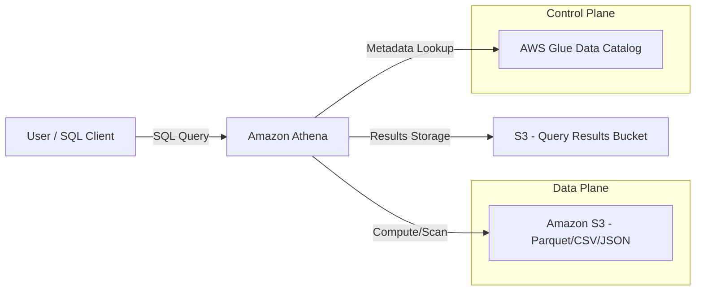

# Amazon Athena

## Overview

Amazon Athena is a serverless, interactive query service that allows you to analyze data stored in Amazon S3 using standard SQL. If you have ever spent hours writing complex ETL pipelines just to move data from a landing zone into a data warehouse like Redshift, Athena is the service designed to disrupt that pattern. It implements the **"Schema-on-Read"** paradigm, meaning you don't need to load data into a proprietary database format before querying it; you simply point Athena at your S3 buckets, define a schema, and start running SQL.

In the AWS data engineering ecosystem, Athena sits as the "Ad-hoc Analysis" layer. While Amazon Redshift is your heavy-duty, high-performance data warehouse for complex joins and massive aggregations, Athena is your "Swiss Army Knife." It is the go-to service for quick investigations, log analysis (e.g., VPC Flow Logs, CloudTrail), and exploring new datasets before you commit to the cost of permanent storage in a warehouse.

The fundamental value proposition of Athena is the total decoupling of compute and storage. Because the compute is serverless, you don't manage clusters, you don't scale nodes, and you don't pay for idle time. You pay strictly for the amount of data scanned by your queries. This makes it incredibly cost-effective for intermittent workloads, but it also introduces a significant "architectural responsibility": if you write a poorly optimized query that performs a full table scan on a multi-terabyte dataset, you will receive a very expensive bill.

---

## Core Concepts

### Schema-on-Read
Unlike traditional RDBMS where you define a schema and then `INSERT` data, Athena uses schema-on-read. The structure is applied to the raw data at the moment the query is executed. This provides immense flexibility for semi-structured data (JSON, CSV, Parovet) but places the burden of data quality on the engineer.

### AWS Glue Data Catalog
Athena is "stateless." It has no inherent knowledge of your data's structure. It relies entirely on the **AWS Glue Data Catalog** to act as the central metadata repository. The Catalog stores table definitions, partitions, and schema information. Without a properly configured Glue Catalog, Athena is just a SQL engine looking at a pile of unorganized files.

### Workgroups
In a production environment, you never run queries in the "Default" workgroup. **Workgroups** allow you to isolate queries for different teams, set specific query limits, and—most importantly—enforce cost controls. You can use workgroups to prevent a junior analyst from accidentally running a query that scans a petabyte of data by setting a "Data Scanned" limit.

### Partitioning
Partitioning is the single most important concept in Athena. By organizing your S3 data into a folder hierarchy (e.g., `s3://my-bucket/logs/year=2023/month=10/day=01/`), Athena can skip entire directories that don't match your `WHERE` clause. This is the difference between a query taking 30 seconds and 30 minutes.

### Query Limits and Quotas
*   **Concurrent Queries:** Athena has a limit on how many queries can run simultaneously per account/region.
*    **Query Timeout:** By default, Athena queries will run for up to 30 minutes before being killed.
* **Data Scanned Limit:** You can configure workgroups to cancel queries that exceed a certain amount of data scanned.

---

## Architecture / How It Works

Athena follows a distributed query execution model based on Presto (and more recently, Trino). When you submit a SQL statement, Athena orchestrates the execution across a massive, hidden cluster of compute resources.



1.  **The Request:** A user or application submits a SQL query via the Console, CLI, or API.
2.  **Metadata Retrieval:** Athena queries the AWS Glue Data Catalog to understand the schema and where the files are located in S3.
3.  **Plan Execution:** Athena breaks the query into stages and distributes them across its internal compute fleet.
4.  **Data Scanning:** The compute nodes pull only the necessary data blocks from S3 (leveraging S3's high throughput).
5.  **Result Delivery:** The final result set is written back to a designated S3 bucket (the "Query Result Location") and presented to the user.

---

## AWS Service Integrations

### Inbound Data (The "Feeders")
*   **Amazon Kinesis Data Firehose:** The most common pattern. Firehose consumes streaming data, transforms it (via Lambda), converts it to **Parquet**, and drops it into S3. Athena then queries this "near real-time" data.
*   **AWS Glue ETL:** Periodically runs jobs to compact small files into larger, optimized Parquet files and updates the Glue Catalog.
*   **AWS DMS (Database Migration Service):** Moves data from on-premise RDBMS to S3, making it immediately queryable via Athena.

### Outbound Data (The "Consumers")
*   **Amazon QuickSight:** The primary BI tool for Athena. QuickSight uses Athena as the engine to generate visualizations.
able
*   **Amazon SageMaker:** Data scientists use Athena to explore datasets via SQL before feeding them into Machine Learning training pipelines.
*   **AWS Lambda:** Used to trigger downstream workflows or automated alerts based on query results.

### IAM and Trust Relationships
Athena requires a "Service-Linked Role" to access your S3 buckets and Glue Catalog. From an engineering perspective, you must ensure the **IAM Role/User executing the query** has:
1.  `s3:GetObject` and `s3:ListBucket` on the raw data buckets.
2.  `s3:PutObject` on the Athena Query Result bucket.
3.  `glue:GetTable` and `glue:GetPartitions` on the Glue Catalog.

---

## Security

### IAM and Access Control
Security in Athena is a multi-layered approach. 
*   **Fine-Grained Access Control (FGAC):** Using **AWS Lake Formation**, you can implement cell-level or column-level security. This allows you to permit a user to see the `orders` table but redact the `credit_card_number` column.
*   **Resource-based Policies:** Ensure your S3 bucket policies do not allow unauthorized access, even if the IAM user has Athena permissions.

### Encryption
*   **Encryption at Rest:** Athena integrates with **AWS KMS**. Your data in S3 should be encrypted using **SSE-KMS**. When Athena reads the data, it uses its service-linked role to decrypt the objects.
*   **Encryption in Transit:** All communications between Athena, S3, and Glue are encrypted via **TLS 1.2+**.
*   **Encryption of Results:** Always ensure your Athena Query Result bucket is configured with encryption to prevent sensitive query outputs from being readable in plain text.

### Network Isolation
For highly regulated industries (FinTech/Healthcare), you should use **VPC Endpoints (AWS PrivateLink)**. This ensures that the traffic between your VPC (where your application lives) and Athena/S3 never traverses the public internet, significantly reducing the attack surface.

### Audit and Compliance
*   **AWS CloudTrail:** Every `StartQueryExecution` API call is logged in CloudTrail. This is your audit trail for "who queried what and when."
*   **S3 Access Logs:** Use these to track the underlying data access patterns.

---

## Performance Tuning

If you don't tune Athena, you are essentially burning money. Follow these "Golden Rules."

### 1. The Format Rule: Use Columnar Formats
**Never use CSV for large-scale production Athena queries.** Use **Apache Parquet** or **Apache ORC**. 
*   **Why:** These are columnar formats. If you query `SELECT user_id FROM table`, Athena only reads the bytes associated with the `user_id` column, rather than the entire row.

### 2. The Partitioning Rule: Prune your Scans
Always partition by high-cardinality, frequently filtered columns (e.g., `date`, `region`, `event_type`).
*   **Anti-pattern:** Partitioning by `user_id` (too many partitions will kill the Glue Catalog performance).
*   **Best Practice:** Use `year/month/day` or `region`.

### 3. The File Size Rule: Avoid the "Small File Problem"
Athena performs poorly when reading millions of 1KB files. Each file requires an S3 `GET` request and metadata overhead.
*   **Target Size:** Aim for file sizes between **128MB and 510MB**.
*   **Solution:** Use AWS Glue ETL to "compact" small files into larger Parquet files.

### 4. The Compression Rule
Always use compression like **Snappy** (for Parquet). It reduces the amount of data scanned (lowering cost) and improves I/O throughput.

### Summary Table: Cost vs. Performance
| Feature | Low Cost / High Perf | High Cost / Low Perf |
| :--- | :--- | :--- |
| **File Format** | Parquet / ORC | CSV / JSON |
| **Partitioning** | Deeply Partitioned | No Partitioning (Full Scan) |
| **File Size** | 128MB - 512MB | Thousands of 10KB files |
| **Compression** | Snappy / Zlib | Uncompressed |

---

## Important Metrics to Monitor

| Metric Name (Namespace: `Athena`) | What it Measures | Threshold to Alarm | Action to Take |
| :--- | :--- | :--- | :--- |
| `QueryExecutionTime` | Duration of queries | > 10 mins (context dependent) | Check for missing partitions or large scans. |
| `QueryFailed` | Number of failed queries | > 1 | Investigate CloudWatch logs for SQL syntax or permission errors. |

| `S3:BytesDownloaded` (Namespace: `S3`) | Volume of data retrieved | Unexpected Spikes | Identify the user/query causing the massive scan. |
| `Glue:GetTable` (Namespace: `Glue`) | Catalog metadata latency | High latency | Check for "Partition Explosion" (too many partitions). |
| `Athena:DataScanned` (Custom/Workgroup) | Data volume per workgroup | Exceeding budget/quota | Implement stricter Workgroup limits or partition the data. |

---

## Hands-On: Key Operations

### Operation 1: Creating an External Table (SQL)
This is how you define the schema for your S3 data.

```sql
-- Step: Create an external table pointing to S3 Parquet data
-- Why: This tells Athena how to interpret the raw bytes in S3
CREATE EXTERNAL TABLE IF NOT EXISTS default.user_logs (
  user_id string,
  event_type string,
  event_timestamp timestamp
)
PARTITIONED BY (year string, month string) -- Crucial for performance
STORED AS PARQUET
LOCATION 's3://my-data-lake-bucket/logs/'
TBLPROPERTIES ("parquet.compress"="SNAPPY");
```

### Operation 2: Registering New Partitions (SQL)
If you add new data to S3 in a new folder, Athena won't see it until you update the metadata.

```sql
-- Step: Manually repair partitions
-- Why: Athena won't "scan" the whole S3 bucket looking for new folders; 
-- it only looks at the partitions registered in the Glue Catalog.
MSCK REPAIR TABLE default.user_logs;
```

### Operation 3: Running a Query via Python (Boto3)
Automating data analysis or triggering alerts based on query results.

```python
import boto3
import time

client = boto3.client('athena')

def run_athena_query(query, database, s3_output):
    # Step: Submit the query to the Athena engine
    response = client.start_query_execution(
        QueryString=query,
        QueryExecutionContext={'Database': database},
        ResultConfiguration={'OutputLocation': s3_output}
    )
    
    query_execution_id = response['QueryExecutionId']
    print(f"Query Started. ID: {query_execution_id}")
    
    # Step: Poll for completion
    # Why: Athena is asynchronous. You must wait for the status to be 'SUCCEEDED'
    while True:
        status = client.get_query_execution(QueryExecutionId=query_execution_id)
        state = status['QueryExecution']['Status']['State']
        
        if state in ['SUCCEEDED', 'FAILED', 'CANCELLED']:
            print(f"Query finished with state: {state}")
            break
        time.sleep(2)

# Usage
run_athena_query(
    "SELECT count(*) FROM user_logs WHERE year='2023'",
    "my_database",
    "s3://my-athena-results-bucket/results/"
)
```

---

## Common FAQs and Misconceptions

**Q: Is Athena a database like Amazon RDS?**
**A:** No. Athena is a *query engine*. It has no persistent storage of its own. It queries data that lives in S3.

**Q: If I delete my data in S3, will the Athena table still exist?**
**A:** The *metadata* (the table definition) will still exist in the Glue Catalog, but the query will fail because the underlying data source is gone.

** 
**Q: Does Athena support `INSERT INTO` or `UPDATE` statements?**
**A:** No. Athena is for OLAP (Analytical) workloads. It is essentially read-only for the data in S3. To "update" data, you must rewrite the files in S3 using a service like Glue or EMR.

**Q: Why is my query cost much higher than expected?**
**A:** You are likely performing a "Full Table Scan." This happens if you do not use a `WHERE` clause on your partition columns, forcing Athena to read every single file in the bucket.

**Q: Can I use Athena to query real-time streaming data?**
**A:** Not directly. There is a delay while data lands in S3. For true real-time, use Kinesis Data Analytics (Flink). For "near real-time" (minutes), use Athena with Kinesis Firehose.

**Q: Does Athena support Joins?**
**A:** Yes, it supports standard SQL joins, but be careful. Joining two massive, unpartitioned datasets will likely hit memory limits and fail.

**Q: Is Athena's performance comparable to Amazon Redshift?**
**A:** No. Redshift is optimized for high-performance, complex, multi-way joins on structured data. Athena is optimized for cost-effective, ad-hoc exploration of diverse datasets.

**Q: How does Athena handle JSON data?**
**A:** You can define a schema using the `JSON` SerDe (Serializer/Deserializer). It works well, but Parquet is much faster and cheaper.

---

**Exam Focus Areas**

*   **Store & Manage (Domain 2):** Optimizing S3 data formats (Parquet/ORC) and partitioning strategies to reduce costs.
*   **Ingestion & Transformation (Domain 1):** Using Kinesis Firehose to prepare data for Athena querying.
*   **Operate & Support (Domain 3):** Using Workgroups to control costs and monitoring query failures via CloudWatch.
*   **Design & Create Data Models (Domain 4):** Defining schemas in the Glue Data Catalog for Athena consumption.

---

## Quick Recap

*   **Athena is Serverless:** No clusters to manage; pay only for data scanned.
*   **Decoupled Architecture:** Uses S3 for storage and Glue for metadata.
*   **Format Matters:** Always use **Parquet** or **ORC** for cost and performance.
*   **Partitioning is King:** Use partition keys in your `WHERE` clause to avoid expensive full scans.
*   **Workgroups for Control:** Use them to isolate users and prevent runaway costs.
*   **Schema-on-Read:** The schema is applied at query time, providing flexibility but requiring data quality discipline.

---

## Blog & Reference Implementations

*   **AWS Big Data Blog:** [Optimizing Athena Queries](https://aws.amazon.com/blogs/big-data/) - Deep dives into partitioning and file formats.
*   **AWS re:Invent Sessions:** Search for "Amazon Athena" on YouTube to find sessions on "Serverless Data Lake Architectures."
*   **AWS Workshop Studio:** [Serverless Data Lake Workshop](https://catalog.us-east-1.prod.compute-engine.appspot.com/) - Hands-on labs for setting up Athena/Glue/S3.
*   **AWS Well-Architected Framework:** Review the "Cost Optimization Pillar" regarding Athena scan costs.
*   **AWS Samples GitHub:** [Amazon Athena Query Examples](https://github.com/awssamples) - Reference SQL patterns for complex datasets.