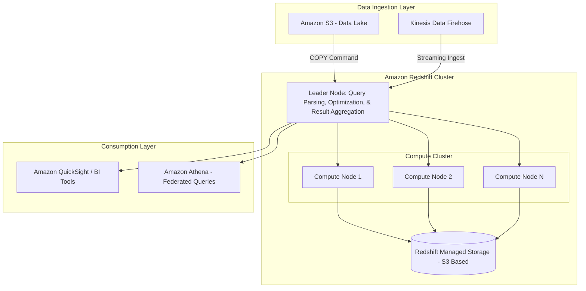

# Amazon Redshift

## Overview

If you are coming from a traditional RDBMS background like MySQL or PostgreSQL, your first instinct when facing massive datasets is to "just spin up a larger RDS instance." Stop right there. That is the fastest way to blow your budget and kill your query performance. Amazon Redshift is not an OLTP (Online Transactional Processing) database; it is an **OLAP (Online Analytical Processing)** data warehouse. 

The fundamental problem Redshift solves is the "analytical bottleneck." In a standard transactional database, data is stored in rows to make single-record lookups and updates fast. However, when you want to calculate the "average margin per region over the last three years," a row-based engine must scan every single column in every single row, wasting massive amounts of I/O. Redshift utilizes **columnar storage**, meaning it only reads the specific columns required for your query. This, combined with **Massively Parallel Processing (MPP)**, allows it to aggregate petabytes of data in seconds.

In the AWS Data Engineering ecosystem, Redshift serves as the "Single Source of Truth" for your analytical workloads. While S3 acts as your "Data Lake" (cheap, raw, unstructured), Redshift is your "Data Warehouse" (structured, high-performance, curated). It is the destination for transformed, high-value data that powers BI tools like Amazon QuickSight, Tableau, or Looker.

## Core Concepts

### Columnar Storage
Unlike RDS, Redshift stores data column-by-column rather than row-by-row. 
*   **The Benefit:** Significant reduction in I/O. If a table has 100 columns but your query only needs 3, Redshift physically ignores the other 97.
*   **The Trade-off:** Redshift is terrible at `UPDATE` and `DELETE` operations. Frequent single-row updates cause "fragmentation" and require heavy maintenance. Use Redshift for bulk loads, not transactional updates.

### Massively Parallel Processing (MPP)
Redshift distributes data and query execution across multiple nodes. When a query is issued, the **Leader Node** parses it, creates an execution plan, and distributes the workload across all **Compute Nodes**. Each node works on its slice of the data simultaneously.

### RA3 Instances and Managed Storage
In older Redshift generations (DC2), compute and storage were coupled. If you needed more disk space, you had to buy more compute, even if you didn't need the CPU. **RA3 instances** changed the game. They use **Managed Storage**, which allows you to scale compute and storage independently. Hot data resides on local SSDs for performance, while "cold" data is automatically moved to S3 (transparently to the user).

### Redshift Spectrum
This is a critical exam topic. Spectrum allows you to run SQL queries directly against data residing in **Amazon S3** without loading it into RedSQL. This enables a "Lake House" architecture: you keep your massive, raw datasets in S3 (Parquet/ORC format) and only load the aggregated, high-frequency data into Redshift local storage.

### Distribution Styles (The "Secret Sauce" of Performance)
How data is spread across nodes determines if your joins will be fast or a network nightmare.
*   **AUTO:** Redshift decides based on table size.
*   **EVEN:** Round-robin distribution. Good for tables that don't participate in joins.
*   **KEY:** Data is distributed based on a specific column's value. Use this for columns frequently used in `JOIN` clauses to ensure matching keys reside on the same node (collocation).
*   **ALL:** A full copy of the table is placed on every node. Use this **only** for small dimension tables (e.g., a `date_dimension` or `country_codes` table).

### Sort Keys
Sort keys determine the physical order of data on disk.
*   **Compound Sort Key:** Primarily optimizes the columns listed first. Best for queries with specific filters (e.., `WHERE timestamp > '2023-01-01'`).
*   **Interleaved Sort Key:** Gives equal weight to all columns in the key. Harder to maintain and more expensive to build, but great for multi-dimensional filtering.

## Architecture / How It Works



## AWS Service Integrations

### Data Inbound (The "Load" Phase)
*   **Amazon S3 $\rightarrow$ Redshift:** The primary pattern. Use the `COPY` command. **Never** use `INSERT` statements for large datasets; it is computationally expensive and creates massive transaction logs.
*   **Amazon Kinesis Data Firehose $\rightarrow$ Redshift:** Firehose can buffer streaming data and execute a `COPY` command into Redshift automatically.
*   **AWS Glue $\rightarrow$ Redshift:** Glue ETL jobs transform data in S3 and then trigger Redshift load processes.

### Data Outbound (The "Export" Phase)
*   **Redshift $\rightarrow$ Amazon S3:** Use the `UNLOAD` command to export query results to S3 in Parquet or CSV format. This is a common pattern for downstream data science workloads.
*   **Redshift Spectrum $\rightarrow$ S3:** Allows Redshift to act as a query engine for the S3 Data Lake.

### Identity & Access
*   **IAM Roles:** Redshift requires an IAM Role attached to the **Cluster**, not just the user. This role must have `s3:GetObject` and `s3:ListBucket` permissions so the cluster can "reach out" and grab data from S3 during a `COPY` operation.

## Security

### Network Isolation
*   **VPC Placement:** Redshift clusters should always reside in a Private Subnet. 
*   **Security Groups:** Control inbound traffic to the Redshift port (default 5439). Only allow traffic from your Application Tier or your Bastion Host.
*   **VPC Endpoints (PrivateLink):** Use VPC Endpoints to ensure traffic between your VPC and Redshift (or S3) never traverses the public internet.

### Encryption
*   **At Rest:** Use **AWS KMS** (SSE-KMS) to encrypt the underlying storage. This is mandatory for compliance (HIPAA/PCI).
*   **In Transit:** All communication between the client and the cluster, and between nodes, is encrypted using **TLS/SSL**.

### Audit and Compliance
*   **CloudTrail:** Tracks all API calls (e.g., `CreateCluster`, `ModifyCluster`).
*   **Redshift Audit Logging:** You must explicitly enable this to track SQL queries, user logins, and even the specific data accessed. Logs are typically exported to an S3 bucket.

## Performance Tuning

### The "Golden Rules" of Redshift Tuning
1.  **Minimize Data Shuffling:** If two large tables are joined on `customer_id`, ensure both use `DISTSTYLE KEY (customer_id)`. This prevents data from moving across the network during the join.
2.  **Avoid Small Inserts:** Batch your data. One `COPY` of 100MB is significantly faster than 1,000 `INSERT` statements of 100KB.
3.  **Use Compression Encodings:** Redshift uses different encoding types (LZO, ZSTD, Delta, etc.) per column. Use the `ANALYZE COMPRESSION` command to find the best settings. Proper compression reduces I/O and storage costs.
4.  **Monitor WLM (Workload Management):** Use **Auto WLM**. It uses machine learning to manage query queues, preventing a single "rogue" heavy query from starving your dashboard users of resources.

### Scaling Patterns
*   **Vertical Scaling:** Changing instance types (e.g., moving from `ra3.xlplus` to `ra3.4xlarge`). This involves downtime as the cluster is replaced.
*   **Horizontal Scaling:** Adding more nodes to the cluster.
*   **Concurrency Scaling:** A feature that automatically adds transient capacity to handle bursts in query volume. This is a "pay-per-use" feature that is vital for preventing query queues during peak business hours.

## Important Metrics to Monitor

| Metric Name (Namespace: `AWS/Redshift`) | What it Measures | Threshold/Alarm | Action to Take |
| :--- | :--- | :--- | :--- |
| `CPUUtilization` | Percentage of cluster CPU used. | `> 80%` for sustained periods. | Scale up instance type or check for unoptimized queries. |
| `WLMQueueLength` | Number of queries waiting in queue. | `> 0` for long durations. | Enable Concurrency Scaling or optimize heavy queries. |
| `HealthStatus` | Whether the cluster is in a healthy state. | `Status != 'available'` | Investigate node failures or cluster updates. |
| `DatabaseConnections` | Number of active connections. | Approaching your limit. | Check for connection leaks in application code. |
| `Read/Write Throughput` | Disk I/O activity. | Spikes causing high latency. | Evaluate if you need more RA3 nodes or better distribution keys. |

## Hands-On: Key Operations

### 1. Loading Data from S3 (The Most Important Skill)
```sql
-- Assume an IAM Role 'arn:aws:iam::123456789012:role/RedshiftS3Role' 
-- is already attached to the cluster.

COPY schema_name.target_table
FROM 's3://my-data-bucket/raw-data/users_export.csv'
IAM_ROLE 'arn:aws:iam::123456789012:role/RedshiftS3Role'
FORMAT AS CSV
IGNOREHEADER 1
REGION 'us-east-1';
-- Why: Using COPY is the only performant way to ingest large datasets.
-- It leverages the MPP architecture to load data in parallel across all nodes.
```

### 2. Exporting Data to S3 (Unloading)
```sql
-- Exporting a subset of data to S3 for use in SageMaker/Athena
UNLOAD ('SELECT user_id, signup_date FROM schema_name.target_table WHERE signup_date > \'2023-01-01\'')
TO 's3://my-data-bucket/exports/users_subset_'
IAM_ROLE 'arn:aws:iam::123456789012:role/RedshiftS3Role'
FORMAT AS PARQUET
PARALLEL ON;
-- Why: UNLOAD is much faster than standard SELECTs for large volumes.
-- Using PARQUET and PARALLEL ON creates multiple files, which is optimal for S3.
```

## Common FAQs and Misconceptions

**Q: Can I use Redshift as my primary application database for a web app?**
**A:** No. Redshift is an OLAP engine. The overhead of its columnar architecture and the latency of its distributed query execution make it unsuitable for high-frequency, single-row `INSERT/UPDATE/DELETE` workloads. Use RDS/Aurora for that.

**Q: Is Redshift Spectrum more expensive than loading data into Redshift?**
**A:** It depends. You pay per terabyte of data scanned by Spectrum. If you query a massive, unstructured dataset once, Spectrum is cheaper. If you query the same dataset every 5 minutes, loading it into Redshift local storage is more cost-effective.

**Q: Does the `COPY` command automatically handle schema changes?**
**A:** No. If your S3 file adds a new column, the `COPY` command will fail unless you use specific error-handling parameters or update your table schema first.

**Q: What is the difference between a "Cluster" and "Serverless"?**
**A:** Redshift Provisioned (Cluster) requires you to choose instance types and manage scaling. Redshift Serverless automatically scales capacity up and down based on your workload, making it ideal for unpredictable or intermittent workloads.

**Q: Can I use Redshift to query data in DynamoDB?**
**A:** Not directly via a command, but you can use **Amazon Athena Federated Query** or an ETL process (Glue) to move DynamoDB data to S3, which Redshift can then query via Spectrum.

**Q: Do I need to run `VACUUM` every day?**
**A:** Modern Redshift handles much of this automatically (Auto-Vacuum). However, you should still monitor for "ghost rows" (deleted rows not yet cleared) if you perform significant batch deletes.

## Exam Focus Areas

*   **Store & Manage (Domain 2):** Choosing between Redshift Provisioned vs. Serverless; managing S3 integration via `COPY`/`UNLOAD`; implementing RA3 scaling.
*   **Ingestion & Transformation (Domain 1):** Designing pipelines using Kinesis Firehose to Redshift; using Glue for schema evolution before Redshift ingestion.
*   **Design & Create Data Models (Domain 4):** Implementing optimal `DISTSTYLE` (Key, All, Even) and `SORTKEY` (Compound, Interleaved) to minimize data shuffling and I/O.
*   **Operate & Support (Domain 3):** Monitoring `WLMQueueLength`; troubleshooting `COPY` failures using `STL_LOAD_ERRORS`; managing encryption via KMS.

## Quick Recap
- [ ] **OLAP, not OLTP:** Redshift is for analytics, not transactions.
- [ ] **Columnar is King:** It reduces I/O by only reading necessary columns.
- [ ] **COPY is Mandatory:** Never use `INSERT` for bulk data.
- [ ] **Distribution Matters:** Use `KEY` for joins and `ALL` for small tables to prevent network bottlenecks.
- [ ] **RA3 = Freedom:** Decouples compute from storage, allowing independent scaling.
- [ ] **Spectrum = The Bridge:** Enables querying S3 data directly, creating a true "Lake House."

## Blog & Reference Implementations
*   **AWS Big Data Blog:** Deep dives into Redshift performance tuning and query optimization.
*   **AWS re:Invent - Amazon Redshift Deep Dive:** Essential viewing for understanding the internal engine architecture.
*   **AWS Workshop Studio:** "Amazon Redshift Workshop" - Hands-on labs for building your first warehouse.
*   **AWS Well-Architected Tool:** Check the "Data Analytics" lens for Redshift best practices.
*   **aws-samples (GitHub):** Search for "Redshift ETL patterns" to find production-ready Python/Glue code.