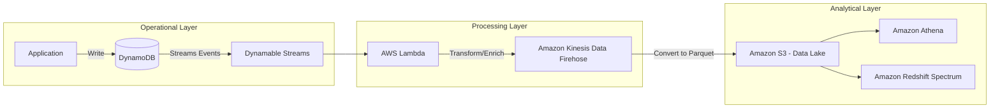

# NoSQL and Purpose-Built Databases

## Overview

In the era of monolithic architectures, the "one-size-fits-all" relational database was king. However, as data engineers, we have moved into the era of **polyglot persistence**. The fundamental principle you must internalize for the DEA-C01 exam is this: **Do not use a relational database for a workload it wasn't designed for.** If you try to force highly connected graph data into DynamoDB, or massive time-series telemetry into RDS, you aren't just being inefficient—you are building a technical debt bomb that will explode under scale.

The "Purpose-Built" philosophy in AWS is about selecting a database based on the **access pattern**, not just the data format. AWS provides a spectrum of specialized engines: **DynamoDB** for ultra-low latency key-value/document access at any scale; **Amazon DocumentDB** for MongoDB-compatible workloads; **Amazon Neptune** for complex relationship mapping (Graph); and **Amazon Timestream** for massive-scale IoT/operational telemetry.

As a data engineer, your job isn't just to move data; it's to architect the storage layer so that downstream analytics (Athena, Redshift, Glue) can function without hitting bottlenecks. Understanding when to use a "Scale-out" (NoSQL) vs. a "Scale-up" (Relational) approach is the difference between a production-ready pipeline and a costly failure.

---

## Core Concepts

### 1. DynamoDB (Key-Value & Document)
*   **Partition Key (PK):** The fundamental input for the hash function that determines which partition the data resides on. **Crucial:** A poor PK choice leads to "Hot Partitions."
*   **Sort Key (SK):** Allows you to store multiple items under the same PK and provides ordered retrieval. This enables complex queries using operators like `begins_with`, `between`, and `>`.
*   **Global Secondary Index (GSI):** An index with a different PK and SK. GSIs are **asynchronous**; there is a replication lag between the base table and the GSI.
*   **Local Secondary Index (LSI):** Uses the same PK as the table but a different SK. **Engineer's Note:** Avoid LSIs in new designs. They impose a 10GB limit on the item collection and can only be created at table creation time.
*   **TTL (Time to Live):** Automatically expires items at no extra cost. This is a primary mechanism for managing data lifecycle and reducing storage costs.

### 2. Amazon Neptune (Graph)
*   **Vertices and Edges:** Data is stored as nodes (entities) and connections (relationships).
*   **Properties:** Both vertices and edges can hold metadata (key-value pairs).
*   **Query Languages:** Supports Gremlin (imperative) and SPARQL (declarative).

### 3. Amazon Timestream (Time-Series)
*   **Memory Store:** For high-throughput ingestion and low-latency queries on recent data.
*   **Magnetic Store:** For cost-effective long-term storage of historical data.
*   **Automated Tiering:** Data moves from memory to magnetic based on retention policies you define.

---

## Architecture / How It Works

The following diagram illustrates a common **Change Data Capture (CDC)** pattern used in modern data engineering to move data from a NoSQL operational store to an analytical data lake.



---

## AWS Service Integrations

### Data Ingestion (Into NoSQL)
*   **AWS Lambda:** The primary driver for "Event-Driven" ingestion. Lambda functions triggered by API Gateway or Kinesis write directly to DynamoDB.
*   **AWS DMS (Database Migration Service):** Used to migrate on-premise MySQL/PostgreSQL workloads into DynamoDB or DocumentDB.

*   **Amazon Kinesis:** High-frequency streaming data can be buffered and written to DynamoDB via Lambda to handle spikes in write volume.

### Data Egress (Out of NoSQL)
*   **DynamoDB Streams $\rightarrow$ S3/OpenSearch:** The "Gold Standard" for downstream analytics. Streams capture every `INSERT`, `MODIFY`, and `REMOVE` event.
*   **AWS Glue:** Uses specialized connectors to crawl DynamoDB tables, infer schemas, and catalog them in the Glue Data Catalog for Athena querying.
*   **Amazon Athena:** While you can't query DynamoDB *directly* with Athena, you use Glue to export DynamoDB data to S3 (Parquet) so Athena can perform SQL-based analytics on NoSQL data.

### IAM and Permissions
*   **Service-Linked Roles:** Required for services like DynamoDB to interact with other AWS resources (e.g., for automated backups).
*   **Fine-Grained Access Control (FGAC):** Using IAM `Condition` keys (like `dynamodb:LeadingKeys`), you can restrict a user to only access items where the Partition Key matches their UserID.

---

## Security

*   **Encryption at Rest:**
    *   **AWS Owned Key:** Default, no configuration needed.
    *   **AWS Managed Key (KMS):** Provides more visibility in CloudTrail.
    *   **Customer Managed Key (CMK):** Necessary for strict compliance (e.g., rotating keys manually or managing cross-account access).
*   **Encryption in Transit:** All APIs for DynamoDB and Neptune use **TLS (HTTPS)** by default.
*   **Network Isolation:**
    *   **VPC Endpoints (Interface Endpoints):** Critical for security. Use AWS PrivateLink to ensure your data traffic between your VPC and DynamoDB never traverses the public internet.
    
*   **Audit Logging:**
    *   **AWS CloudTrail:** Logs all "Management Events" (e.g., `CreateTable`, `DeleteTable`).
    *   **CloudWatch Logs:** Used to capture application-level logs or DynamoDB Stream processing errors.

---

## Performance Tuning

### 1. The "No-Scan" Rule
**Never use `Scan` in a production environment unless the table is tiny.** A `Scan` reads every single item in the table, consuming massive amounts of Read Capacity Units (RCUs) and increasing latency. Always use `Query` with a specific Partition Key.

### 2. Scaling Patterns
*   **Provisioned Capacity:** You specify RCU/WCU. Use this for predictable workloads. It's cheaper but requires Auto Scaling configuration to handle spikes.
*   **On-Demand Capacity:** You pay per request. Use this for "spiky" or unpredictable workloads (e.S., a new microservice launch). It is more expensive per request but eliminates the management overhead of scaling.

### 3. Avoiding Hot Partitions
If you use `Date` as a Partition Key, all writes for "today" will hit a single partition. This creates a bottleneck. **Solution:** Use a "Synthetic Shard Key" (e.g., `Date + RandomSuffix`) to distribute writes across the keyspace.

### 4. Data Format
For downstream integration, always prefer **Parquet or Avro** over JSON when exporting from DynamoDB to S3. The columnar nature of Parquet significantly reduces the amount of data Athena has to scan, directly lowering your costs.

---

## Important Metrics to Monitor

| Metric Name (Namespace: `AWS/DynamoDB`) | What it Measures | Threshold to Alarm | Action to Take |
| :--- | :--- | :--- | :--- |
| `ConsumedReadCapacityUnits` | Actual usage of RCU | 80% of Provisioned | Increase Provisioned Capacity or switch to On-Demand. |
| `ThrottledRequests` | Requests rejected due to capacity limits | $> 0$ | Investigate "Hot Keys" or increase WCU/RCU. |
| `SystemErrors` | Internal DynamoDB service errors | $> 0$ | Check AWS Service Health Dashboard; implement exponential backoff in code. |
| `ReplicationLatency` | Delay in Global Tables replication | $> 1$ second | Check network congestion or heavy write volume in the source region. |
| `UserErrors` | Requests failed due to client-side issues (e.g., 400s) | Sudden Spikes | Check application logs for malformed queries or unauthorized access attempts. |

---

## Hands-On: Key Operations (Python/Boto3)

### 1. Writing Data with Error Handling
```python
import boto3
from botocore.exceptions import ClientError

dynamodb = boto3.resource('dynamodb')
table = dynamodb.Table('OrdersTable')

def put_order(order_id, customer_id, amount):
    try:
        # Use put_item to insert data. 
        # Always include a unique PK to avoid accidental overwrites.
        table.put_item(
            Item={
                'OrderID': order_id,    # Partition Key
                'CustomerID': customer_id,
                'Amount': amount,
                'Status': 'PENDING'
            }
        )
        print("Order inserted successfully.")
    except ClientError as e:
        # Essential for production: Log the specific error (e.g., ProvisionedThroughputExceededException)
        print(f"Error inserting item: {e.response['Error']['Message']}")

put_order('ORD-123', 'USER-456', 99.99)
```

### 2. Efficient Querying (The "Query" vs "Scan" Demo)
```python
# INCORRECT: This is a SCAN (Expensive and slow)
# response = table.scan(FilterExpression=Key('CustomerID').eq('USER-456'))

# CORRECT: This is a QUERY (Efficient and targeted)
def get_customer_orders(customer_id):
    # We use the Partition Key directly. This hits only one partition.
    response = table.query(
        KeyConditionExpression=boto3.dynamodb.conditions.Key('CustomerID').eq(customer_id)
    )
    return response['Items']

orders = get_customer_orders('USER-456')
print(f"Found {len(orders)} orders.")
```

---

## Common FAQs and Misconceptions

**Q: If I use On-Demand mode, can I still experience throttling?**
**A:** Yes. While On-Demand scales rapidly, it is not infinite. If you suddenly burst 10x your previous peak, you may still see throttled requests until the partition splits occur.

**Q: Is a Global Secondary Index (GSI) free to maintain?**
**A:** No. You pay for the WCU required to replicate writes from the base table to the GSI.

**Q: Can I use an LSI to bypass the 10GB partition limit?**
**A:** No. LSIs actually *enforce* the 10GB limit on the entire item collection (all items with the same PK). Only GSIs allow you to scale beyond that.

**Q: Does DynamoDB Streams support deleting data?**
**A:** Yes. It captures `REMOVE` events, which is critical for downstream "hard delete" synchronization in your Data Lake.

**Q: Is DocumentDB a relational database?**
**A:** No. It is a non-relational, document-oriented database engine compatible with MongoDB.

**Q: How do I handle "Hot Keys" in DynamoDB?**
**A:** Use a more granular Partition Key or implement "Write Sharding" by appending a random suffix to the PK.

**Q: Can I use SQL to query DynamoDB directly?**
**A:** Not natively. You must use a bridge like AWS Glue/Athena (via S3) or a third-party tool.

**Q: Does TTL delete data immediately?**
**A:** No. DynamoDB typically deletes expired items within 48 hours of their expiration time. Do not rely on TTL for real-time logic.

---

## Exam Focus Areas

*   **Design & Create Data Models (Domain 1):**
    *   Choosing between Key-Value (DynamoDB), Graph (Neptune), and Time-series (Timestream).
    *   Designing Partition Keys to avoid hot partitions.
    *   Using GSIs vs. LSIs for different access patterns.
*   **Store & Manage (Domain 2):**
    *   Implementing lifecycle policies using DynamoDB TTL.
    *   Configuring encryption (KMS) and network isolation (VPC Endpoints).
    *   Managing capacity modes (On-Demand vs. Provisioned).
*   **Ingestion & Transformation (Domain 3):**
    *   Using DynamoDB Streams for CDC (Change Data Capture) pipelines.
    *   Integrating Lambda for real-time transformation of NoSQL data.
*   **Operate & Support (Domain 4):**
    *   Monitoring throttled requests and scaling throughput.
    *   Identifying and resolving high-latency/hot-partition issues.

---

## Quick Recap

*   **Choose the right tool:** Don't use DynamoDB for complex joins; don't use RDS for massive-scale telemetry.
*   **Query, don't Scan:** Scans are the #1 cause of performance degradation and cost overruns in NoSQL.
*   **GSIs are your friend, LSIs are technical debt:** Use GSIs for flexible access patterns; avoid LSIs due to size constraints.
*   **Use TTL for hygiene:** Automate data expiration to keep your storage costs low and your partitions healthy.
*   **Security is multi-layered:** Use IAM for fine-grained access and VPC Endpoints to keep traffic off the public internet.
*   **Monitor Throttling:** `ThrottledRequests` is your most important metric for scaling decisions.

---

## Blog & Reference Implementations

*   [AWS Big Data Blog](https://aws.amazon.com/blogs/big-data/): Essential for following recent patterns in DynamoDB/Athena integration.
*   [AWS re:Invent: Deep Dive into DynamoDB](https://www.youtube.com/user/AWSVideo): Search for "DynamoDB" to see architecture deep-dives from the engineers who built it.
*   [AWS Workshop Studio: DynamoDB Workshops](https://workshop.aws/): Practical, hands-on labs for building NoSQL patterns.
*   [AWS Well-Architected Framework - Performance Efficiency Pillar](https://aws.amazon.com/architecture/well-architected/): Guidance on selecting the right database for your workload.
*   [AWS Samples: DynamoDB Streams to S3 Pattern](https://github.com/aws-samples): Reference code for building CDC pipelines.