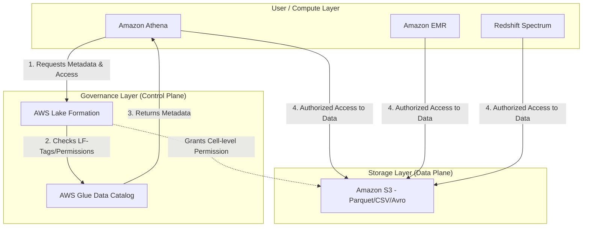

# AWS Lake Formation and Data Governance

## Overview

In the early days of building a data lake on AWS, engineers relied on a brittle combination of S3 bucket policies and complex IAM roles to manage access. While this works for a handful of datasets, it becomes an operational nightmare as you scale to thousands of tables and hundreds of users. You end up with "Policy Bloat," where a single IAM policy becomes too large to manage, and "Permission Drift," where it's impossible to audit who has access to which specific column in a Parquet file.

AWS Lake Formation was engineered to solve this specific problem of **Centralized Data Governance**. It acts as a security and governance layer sitting *on top* of your S3 data lake and the AWS Glue Data Catalog. Instead of managing access at the S3 object level (which is coarse-grained), Lake Formation allows you to define permissions at the database, table, column, and even row/cell level.

Think of Lake Formation as the "Policy Engine" for your data lake. It decouples the **storage** (S3) from the **metadata** (Glue) and the **authorization** (Lake Formation). When a user runs a query in Athena, Athena doesn't just look at S3; it asks Lake Formation, "Does this user have permission to see these specific columns in this table?" This transition from "Identity-based" security to "Resource-level" governance is the core evolution of a mature data engineering architecture.

In the context of the DEA-C01 exam, you must understand that Lake Formation does not store your data. It manages the *permissions* to that data. If you are designing a multi-account, multi-tenant data platform, Lake Formation is your primary tool for ensuring that a Data Scientist in the Marketing department cannot accidentally see PII (Personally Identifiable Information) in the Finance department's datasets.

---

## Core Concepts

### The Data Catalog & Metadata
Lake Formation leverages the **AWS Glue Data Catalog** as its underlying metadata store. Every table, partition, and schema defined in Glue is managed by Lake Formation. When you grant permissions in Lake Formation, you are essentially adding an authorization layer to the existing Glue metadata.

### Fine-Grained Access Control (FGAC)
This is the "killer feature." Traditional IAM allows you to grant access to an S3 prefix (e.g., `s3://my-bucket/logs/*`). Lake Formation allows you to go deeper:
*   **Column-level security:** Mask or hide specific columns (e.g., `social_security_number`) from certain users.
*   **Row-level security:** Filter rows based on a condition (e.g., `WHERE region = 'US'`).
*   **Cell-level security:** The intersection of column and row filtering.

### LF-Tags (Attribute-Based Access Control - ABAC)
The old way was to manage permissions per-table. This doesn't scale. The modern way—and the way you should design for the exam—is using **LF-Tags**. 
*   You attach tags to resources (e.arg., `Classification=Sensitive` or `Department=Finance`).
*   You grant users permissions based on those tags.
*   **Why it matters:** If a new table is created and tagged as `Classification=Sensitive`, the permissions are applied *automatically*. You don't have to update a single IAM policy.

### The "Lake Formation Admin" vs. IAM Admin
A common pitfall is confusing the two. A standard IAM Admin can manage the AWS account, but they cannot necessarily grant data access within Lake Formation unless they are explicitly designated as a **Lake Formation Administrator**. This separation of duties is critical for production-grade governance.

### Default Behavior Warning
When you use Lake Formation, it can "take over" the catalog. By default, if Lake Formation is enabled, the permissions defined in IAM are superseded by the permissions defined in Lake Granular Access Control. If you forget to grant a user permission in Lake Formation, even if they have `S3:GetObject` and `Glue:GetTable` in their IAM policy, **the query will fail.**

---

## Architecture / How It Works

The following diagram illustrates the decoupling of the compute, the control plane (governance), and the storage plane.



**The Data Flow Logic:**
1.  **The Request:** A user submits a query (e.g., via Athena).
2.  **The Authorization Check:** Athena contacts Lake Formation to ask if the user has permission to access the specific tables/columns requested.
3.**The Metadata Retrieval:** Lake Formation verifies the LF-Tags or explicit grants and then fetches the schema from the Glue Data Catalog.
4.  **The Data Access:** Once authorized, the compute engine (Athena/EMR) retrieves the actual data files from S3.

---

## AWS Service Integrations

### Data Ingestion (Into Lake Formation)
*   **AWS Glue Crawlers:** These are the primary engines. As crawlers discover new data in S3, they update the Glue Catalog. If Lake Formation is configured, these crawlers can also automatically apply LF-Tags to new tables.
*   **AWS Glue ETL:** Jobs that transform data can use Lake Formation to ensure that the transformed output is written with the correct security tags.

### Data Consumption (From Lake Formation)
*   **Amazon Athena:** The most common consumer. Athena integrates natively with Lake Formation to enforce column and row-level security.
*   **Amazon EMR:** Using the Lake Formation connector, EMR clusters can respect the fine-grained permissions defined in the catalog.
*   **Amazon Redshift Spectrum:** Allows Redshift to query S3 data while respecting Lake Formation security policies.

### IAM and Cross-Account Patterns
*   **Trust Relationships:** For cross-account data sharing, Lake Formation uses **Resource Links**. You don't just copy data; you share the metadata from Account A to Account B. Account B creates a "Resource Link" in its own catalog that points to the shared catalog in Account A.
*   **The Pattern:** **Centralized Data Lake (Account A) $\rightarrow$ Shared Catalog $\rightarrow$ Consumer Account (Account B)**. This is the gold standard for enterprise architecture.

---

## Security

### IAM Roles and Resource-Based Policies
To use Lake Formation, your compute service (like Athena) needs an IAM role that has permission to `lakeformation:GetDataAccess`. Without this, the service cannot "assume" the permissions granted by the Lake Formation admin.

### Encryption
*   **At Rest:** Lake Formation integrates with **AWS KMS**. You must ensure that the IAM roles used by your compute engines have `kms:Decrypt` permissions for the keys protecting the S3 objects.
*   **In Transit:** All communication between services (Athena to Lake Formation, or Athena to S3) is encrypted via **TLS**.

### Network Isolation
For high-security environments, use **VPC Endpoints (AWS PrivateLink)** for Glue and S3. This ensures that your data metadata requests and your actual data movement never traverse the public internet.

### Audit Logging
*   **AWS CloudTrail:** This is your single source of truth. Every `Grant`, `Revoke`, and `CreateTable` operation in Lake Formation is logged in CloudTrail. If an auditor asks, "Who granted access to the SSN column?", CloudTrail provides the answer.

---

## Performance Tuning

### Metadata Scaling
*   **Avoid "Small Table Syndrome":** While Lake Formation handles large catalogs well, having millions of tiny tables can slow down metadata retrieval. Use Glue Crawlers to consolidate metadata where possible.
*   **LF-Tag Complexity:** While ABAC (LF-Tags) is scalable, avoid deeply nested or overly complex tag logic that requires the engine to evaluate hundreds of tags per request.

### Data Partitioning
*   **The Golden Rule:** Lake Formation security is applied to the metadata. If your data is poorly partitioned in S3, Athena will scan more data than necessary, regardless of your Lake Formation settings. **Always partition by high-cardinality fields like `date` or `region`.**

### Cost vs. Performance
*   **Cell-Level Filtering Overhead:** Implementing complex row-level filtering (e.g., regex-based filtering on a large dataset) can introduce compute overhead in Athena. If you find query performance dropping, consider creating a "pre-filtered" materialized view or a separate table for that specific user group.

---

## Important Metrics to Monitor

| Metric Name (Namespace: `AWS/LakeFormation`) | What it Measures | Threshold to Alarm | Action to Take |
| :--- | :--- | :--- | :--- |
| `CatalogRequestLatency` | Time taken to process metadata requests. | > 500ms (context dependent) | Check for overly complex LF-Tags or massive table metadata. |
| `NumberOfTablesCreated` (via CloudTrail/Custom) | Rate of schema changes in the catalog. | Sudden spike (e.g., 100% increase) | Check for runaway Glue Crawlers or unauthorized automation. |
| `AccessDeniedErrors` (via CloudTrail/Custom) | Frequency of unauthorized access attempts. | Any significant increase | Investigate potential security breach or broken ETL pipelines. |
| `GlueCatalogServiceErrors` | Errors in the underlying Glue metadata service. | > 1% of total requests | Check AWS Service Health Dashboard; contact AWS Support. |

*Note: Many Lake Formation-specific metrics are actually observed through CloudTrail logs and converted into CloudWatch Metrics via Metric Filters.*

---

## Hands-On: Key Operations

### 1. Creating an LF-Tag (AWS CLI)
Before you can secure data, you must define your governance labels.

```bash
# Create a tag named 'Classification' with the value 'Confidential'
aws lakeformation create-lf-tag \
    --lf-tag-key Classification \
    --lf-tag-values Confidential
```

### 2. Granting Permissions via Boto3 (Python)
This is how you automate security in a CI/CD pipeline.

```python
import boto3

client = boto3.client('lakeformation')

def grant_table_access(database, table, principal, tag_key, tag_value):
    """
    Grants permissions to a principal based on an LF-Tag.
    This is much more scalable than granting permission to a specific table name.
    """
    try:
        response = client.grant_permissions(
            Principal={'User': principal},
able_resources={
                'TableWithLftags': {
                    'Database': database,
                    'Lftags': [{
                        'TagKey': tag_key,
                        'TagValues': [tag_value]
                    }]
                }
            },
            Permissions=['SELECT', 'DESCRIBE']
        )
        print(f"Successfully granted access to {principal}")
    except Exception as e:
        print(f"Error: {e}")

# usage: Grant 'analyst_user' SELECT access to any table tagged 'Classification=Confidential'
grant_table_access('sales_db', 'orders_table', 'analyst_user', 'Classification', 'Confidential')
```

---

## Common FAQs and Misconceptions

**Q: If I have S3 `GetObject` permissions in IAM, can I see the data in Lake Formation?**
**A:** No. If Lake Formation is managing the catalog, you must also have explicit permissions in Lake Formation. IAM is the "outer gate," but Lake Formation is the "inner gate."

**Q: Does Lake Formation move my data to a different S3 bucket?**
**A:** No. It is a metadata-only service. The data stays exactly where it was.

** Or: Does LF-Tags work for S3 objects?**
**A:** No. LF-Tags are applied to Glue Catalog resources (Databases, Tables, Columns). They are not S3 Object Tags.

**Q: Is Lake Formation more expensive than just using IAM?**
**A:** There is no direct "per-request" cost for Lake Formation itself, but you pay for the underlying Glue and Athena usage. The "cost" is the operational complexity you *avoid*.

**Q: Can I use Lake Formation with an on-premise Hadoop cluster?**
**A:** Not directly. You would need a bridge, such as an AWS Glue connector or an EMR cluster, to translate Lake Formation permissions into something the Hadoop ecosystem understands.

**Q: Does Lake Formation support schema evolution?**
**A:** Yes, as long as the Glue Crawler or ETL job is configured to update the catalog.

**Q: Can I grant access to a single column?**
**A:** Yes, this is one of its primary use cases (Column-level security).

**Q: Can I use Lake Formation to mask data?**
**A:** Yes, you can use it to restrict access to specific columns, effectively "masking" them from unauthorized users.

---

## Exam Focus Areas

*   **Domain: Design & Create Data Models**
    *   Implementing ABAC using LF-Tags for scalable security.
    *   Designing multi-account architectures using Resource Links.
*   **Domain: Store & Manage**
    *   Using Lake Formation for fine-grained access control (Column/Row level).
    *   Managing the Glue Data Catalog as the central metadata repository.
*   **Domain: Security (High Priority)**
    *   Distinguishing between IAM-based access and Lake Formation-based access.
    *   Implementing the principle of least privilege using cell-level security.
    *   Auditing data access using AWS CloudTrail.

---

## Quick Recap

*   **Lake Formation is a governance layer**, not a storage service.
*   **It enables Fine-Grained Access Control (FGAC)** at the column, row, and cell levels.
*   **LF-Tags enable ABAC**, allowing permissions to scale automatically with new data.
*   **It decouples identity from data**, allowing for complex, multi-account sharing via Resource Links.
*   **Permissions are additive:** You need both IAM and Lake Formation permissions for successful data access.
*   **Auditability is built-in** through integration with AWS CloudTrail.

---

able: Reference Implementations

*   **[AWS Big Data Blog](https://aws.amazon.com/blogs/big-data/):** Search for "Lake Formation" to find architectural deep-dives.
*   **[AWS re:Invent Sessions](https://www.youtube.com/user/AWSOnlineTech):** Look for "Securing your Data Lake with Lake Formation."
*   **[AWS Workshop Studio](https://workshop.aws/):** Search for "Lake Formation Workshop" for hands-on labs.
*   **[AWS Well-Architected Framework](https://aws.amazon.com/architecture/well-architected/):** Review the "Security Pillar" for data lake best practices.
*   **[AWS Samples GitHub](https://github.com/awssamples):** Search for "Lake Formation" for terraform and cloudformation templates.