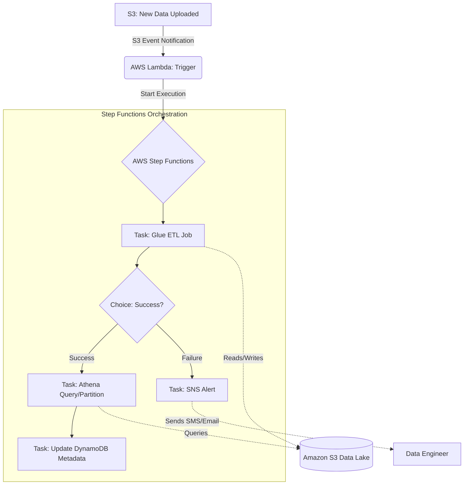

# Data Orchestration and Pipelines

## Overview

In a distributed data architecture, services like AWS Glue, Amazon EMR, and AWS Lambda operate in isolation. While these services are powerful, they are "stateless" in the context of a larger business process. If your Glue ETL job finishes, how does your Athena table get refreshed? How do you notify the downstream BI dashboard if the ingestion failed? This is the problem of **Data Orchestration**.

Data Orchestration is the management of complex, multi-step workflows where the output of one task serves as the input for another. It involves managing dependencies, handling retries, implementing error logic (try/catch/finally), and maintaining the "state" of a pipeline. Without orchestration, you are not building a pipeline; you are building a collection of disconnected scripts that will inevitably fail in production due to unhandled edge cases.

In the AWS ecosystem, orchestration is primarily handled by **AWS Step Functions** (for stateful, logic-heavy workflows), **AWS Glue Workflows** (for simple, ETL-centric dependencies), and **Amazon Managed Workflows for Apache Airflow (MWAA)** (for complex, code-centric, and highly customized data science pipelines). As a Data Engineer, your job isn't just to write the code that transforms data, but to design the "brain" that knows when to run that code, when to retry it, and when to sound the alarm.

## Core Concepts

### AWS Step Functions: The State Machine
The heart of AWS orchestration is the **State Machine**. A state machine is a collection of states (steps) and the transitions between them.

*   **Standard Workflows:** Designed for long-running, mission-critical processes. They provide **exactly-once execution** and maintain a complete execution history for up to one year. Use these when you need to audit every single step of a financial processing pipeline.
*   **Express Workflows:** Designed for high-volume, short-duration tasks (less than 5 minutes). They are much cheaper and scale higher but offer **at-least-once execution** and do not provide a visual execution history in the console for long-term auditing. Use these for high-frequency IoT data ingestion triggers.

### Key State Types
*   **Task State:** The fundamental unit. It performs work by calling an AWS service (e.g., triggering a Glue Job).
*   **Choice State:** The `if-then-else` of your pipeline. It inspects the data payload and routes the workflow to different paths based on conditions.
*   **Map State:** This is your "loop." It allows you to iterate over a collection (like a list of S3 keys) and run a task for each item. This is the engine of parallel processing in orchestration.
*   **Parallel State:** Runs multiple branches of execution simultaneously. Use this when you need to run an EMR cluster setup and a Lambda function at the same time to save total execution time.
*   **Wait State:** Pauses the execution for a specific duration or until a specific timestamp.

### The "Payload" Trap (Critical Limit)
A common mistake engineers make is trying to pass large datasets through Step Functions. **The maximum payload size for a state machine transition is 256 KB.** If you attempt to pass a massive JSON array of records from one step to another, your pipeline will crash. 
*   **The Solution:** Use the **"Claim Check" pattern**. Store the large data in Amazon S3 and pass only the S3 URI (the "pointer") through the Step Function states.

## Architecture / How It Works

The following diagram illustrates a standard production-grade ETL orchestration pattern using Step Functions.



## AWS Service Integrations

### Inbound (Triggers)
*   **Amazon S3:** Using S3 Event Notifications to trigger a Lambda function, which then calls `StartExecution` on a Step Function.
*     **Amazon EventBridge:** The primary way to schedule pipelines (cron-like) or react to changes in AWS resource state.
*   **AWS IoT Core:** For streaming-heavy orchestration where device state changes trigger downstream processing.

### Outbound (Actions)
*   **AWS Glue:** The most common "Task" in a data pipeline. The Step Function triggers `StartJobRun`.
*   **AWS Lambda:** Used for lightweight transformations, API calls, or "glue code" between heavy lifting tasks.
*   **Amazon Athena:** To trigger queries and manage partitions after an ETL job completes.
*   **Amazon SNS/SQS:** To notify downstream consumers or decouple the pipeline from alerting systems.

### IAM Trust Relationships
For orchestration to work, the **Step Functions Execution Role** must have:
1.  `sts:AssumeRole` permission for `states.amazonaws.com`.
2.  Specific `Allow` permissions for the target services (e.g., `glue:StartJobRun`, `lambda:InvokeFunction`, `s3:GetObject`).
3.  **Crucial:** If Step Functions needs to write to CloudWatch Logs, the role must also have `logs:CreateLogGroup`, `logs:CreateLogStream`, and `logs:PutLogEvents`.

## Security

### Identity and Access Management (IAM)
Orchestration requires a "Least Privilege" approach. Do not use a single "Admin" role for your Step Function. Create a specific role that only has permissions for the specific Glue jobs and S3 buckets involved in that *specific* pipeline.

### Encryption
*   **Encryption at Rest:** Step Function execution history and any data passed in the payload are encrypted at rest using AWS managed keys or your own **KMS CMK (Customer Managed Key)**. If your pipeline handles PII, you **must** use a CMK to maintain control over the rotation and access policies.
*   **Encryption in Transit:** All communication between Step Functions and the integrated services (Lambda, Glue, etc.) is encrypted via **TLS 1.2/1.3**.

### Network Isolation
For highly sensitive environments, run your orchestration logic within a VPC. Use **Interface VPC Endpoints (AWS PrivateLink)** for Step Functions and Glue. This ensures that your data traffic never traverses the public internet, reducing the attack surface.

### Audit and Compliance
*   **AWS CloudTrail:** Every `StartExecution` and `StopExecution` call is logged in CloudTrail. This is your "Audit Trail" for compliance (SOC2/HIPutable/HIPAA).
*   **CloudWatch Logs:** Step Functions logs the input and output of every state. **Warning:** Be careful not to log sensitive PII in your state payloads, as this will persist in CloudWatch Logs.

## Performance Tuning

### Scaling Patterns
*   **Standard vs. Express:** Use **Express Workflows** for high-frequency, sub-minute tasks (like processing thousands of small files). Use **Standard Workflows** for long-running processes that need a visual history.
*   **The Map State Concurrency:** When using the `Map` state to process S3 files, do not leave the concurrency unlimited. If you trigger 10,000 Glue jobs at once, you will hit AWS service quotas and potentially crash your downstream database. Use the `MaxConcurrency` setting to throttle the load.

### Bottlenecks and Identification
*   **The "Lambda Warmup" Delay:** If your Step Function triggers a Lambda, and that Lambda is the first one called in a while, "cold start" latency can add seconds to your pipeline.
*   **Glue Job Startup Time:** The biggest bottleneck is often the 1-2 minute overhead of Glue provisioning the YARN containers. Do not use Lambda for heavy computation; use it only to *trigger* Glue.

### Cost vs. Performance
*   **State Transitions:** You are charged per state transition in Standard Workflows. A "chatty" state machine with 100 small steps is significantly more expensive than a streamlined one with 10 robust steps.
*   **Express Workflow Savings:** For high-volume, short-lived tasks, Express Workflows are significantly cheaper because they are billed based on execution duration and memory consumed, rather than per-transition.

## Important Metrics to Monitor

| Metric Name (Namespace: `AWS/States`) | What it Measures | Threshold to Alarm | Action to Take |
| :--- | :--- | :--- | :--- |
| `ExecutionsFailed` | Number of pipeline failures. | `> 0` (Immediate) | Investigate CloudWatch Logs and S3/Glue logs. |
| `ExecutionsTimedOut` | Pipeline running longer than expected. | Based on SLA (e.g., 2 hrs) | Check for deadlocks or resource exhaustion in Glue/EMR. |
| `ExecutionsAborted` | Manual or system-driven cancellations. | `> 0` | Check if a deployment or an automated script is killing jobs. |
| `ExecutionDuration` | How long the entire pipeline takes. | Deviation from baseline (e.g., +20%) | Check for data volume spikes or downstream service latency. |
| `LambdaFunctionError` | Errors in the Lambda logic within the state. | `> 0` | Check Lambda CloudWatch Logs for code exceptions. |

## Hands-On: Key Operations

### 1. Starting an Execution (Python/Boto3)
This is how your ingestion engine (like a Lambda or an EC2 instance) triggers the orchestration.

```python
import boto3

# Initialize the Step Functions client
sfn_client = boto3.client('stepfunctions')

def trigger_pipeline(execution_name, s3_input_path):
    """
    Triggers a Step Function execution with a specific S3 path.
    We pass the S3 path as input to avoid the 256KB payload limit.
    """
    response = sfn_client.start_execution(
        stateMachineArn='arn:aws:states:us-encrypt-1:123456789012:stateMachine:MyDataPipeline',
        name=execution_name,
        input=f'{{"s3_path": "{s3_input_path}"}}' # The 'Claim Check' pattern
    )
    print(f"Execution Started: {response['executionArn']}")

# Usage
trigger_pipeline("Daily_Ingestion_2023_10_27", "s3://my-data-lake/raw/2023/10/27/")
```

### 2. Checking Execution Status (AWS CLI)
Crucial for debugging and verifying if a pipeline completed successfully in a CI/CD pipeline.

```bash
# Describe the execution to check the status
aws stepfunctions describe-execution \
    --state-machine-arn arn:aws:states:us-east-1:123456789012:stateMachine:MyDataPipeline \
    --execution-arn arn:aws:states:us-east-1:123456789012:execution:MyDataPipeline:Daily_Ingestion_2023_10_27
```

## Common FAQs and Misconceptions

**Q: Can I use Step Functions to process 1GB of data directly in the state machine?**
**A: No.** The payload limit is 256KB. You must pass an S3 URI and have the next step (like Glue) read the data from S3.

**Q: What is the difference between AWS Glue Workflows and AWS Step Functions?**
**A: Scope.** Glue Workflows are specialized for ETL-only dependencies (e.g., "Run Job B after Job A"). Step Functions are general-purpose orchestrators that can coordinate Lambda, ECS, EMR, and even third-party APIs.

**Q: If my Glue job fails, does the Step Function automatically retry?**
**A: No.** You must explicitly define a `Retry` block in your Amazon States Language (ASL) definition to handle specific error codes like `Glue.InternalServiceException`.

**HT: Is Amazon MWAA just a managed version of Airflow?**
**A: Yes.** But the key difference for the exam is *usage*. Use MWAA when you need Python-based, complex, DAG-heavy data science workloads. Use Step Functions for event-driven, AWS-native, serverless architectures.

**Q: Does using Express Workflows mean I can't use a Choice state?**
**A: No.** You can use all standard state types in Express Workflows, but you lose the visual execution history in the AWS Console.

**Q: How do I handle "at-least-once" delivery in Express Workflows?**
**A: Idempotency.** Since a task might run twice, your downstream tasks (like Lambda or Glue) must be designed to be idempotent (running them multiple times with the same input yields the same result).

## Exam Focus Areas

*   **Ingestion & Transformation (Domain 1):** Choosing between Step Functions, Glue Workflows, and MWAA based on complexity and cost.
*   **Operate & Support (Domain 3):** Implementing error handling (Retry/Catch) and monitoring pipeline health via CloudWatch.
*   **Design & Create (Domain 4):** Implementing the "Claim Check" pattern to handle large data payloads within orchestrators.
*   **Security (Domain 2):** Configuring IAM roles for service-to-service communication and encrypting state machine inputs/outputs using KMS.

## Quick Recap

*   **Orchestration** is the "brain" that manages dependencies, retries, and state.
*   **Step Functions (Standard)** is for long-running, auditable, exactly-once tasks.
*   **Step Functions (Express)** is for high-volume, short-lived, at-least-once tasks.
*   **The 256KB Limit** is a hard ceiling; always use the **S3 Claim Check pattern** for large data.
*   **Error Handling** must be explicitly defined using `Retry` and `Catch` blocks in the ASL.
*   **Security** relies on the Step Function Execution Role having specific permissions for downstream services.

## Blog & Reference Implementations

*   **AWS Big Data Blog:** [Architecting Data Pipelines with AWS Step Functions](https://aws.amazon.com/blogs/big-data/) - Deep dives into pattern implementations.
*   **AWS re:Invent Session:** "Build Serverless Data Pipelines with AWS Step Functions" - Great for visual learners.
*   **AWS Workshop Studio:** [Serverless Data Engineering Workshop](https://workshop.aws/) - Hands-on labs for building end-to-end pipelines.
*   **AWS Well-Architected Framework:** [Data Engineering Lens](https://aws.amazon.com/architecture/well-architected/) - Guidance on reliability and cost-optimization.
*   **AWS Samples GitHub:** [Serverless Data Pipeline Patterns](https://github.com/aws-samples) - Production-ready CloudFormation and CDK templates.