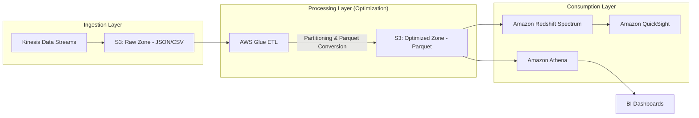

# Performance, Cost Optimization, and Monitoring

## Overview

In the world of professional data engineering, writing code that works is only 20% of the job. The remaining 80% is ensuring that code doesn't bankrupt your company and that it scales when the data volume triples overnight. This section focuses on the "Operational Excellence" pillar of the AWS Well-Architected Framework, specifically applied to data pipelines.

When we talk about performance in a data context, we are primarily discussing **throughput** and **latency**. In an S3-centric data lake architecture, performance is a function of how efficiently you can prune data. If your Athena queries are scanning 1TB of data to find 1MB of results, you aren't just being slow; you are wasting compute resources and money. 

The core challenge of a Data Engineer is managing the "Data Engineering Trilemma": **Performance, Cost, and Complexity**. You can have a lightning-fast pipeline, but if it costs \$10,000 a day, it’s a failure. You can have a cheap pipeline, but if the data arrives 24 hours late, it’s useless. We will focus on how to use architectural patterns—like partitioning, columnar formats, and lifecycle policies—to navigate these trade-offs.

Finally, monitoring is our "early warning system." In distributed systems like AWS Glue or Amazon EMR, failures are rarely "hard" crashes; they are more often "silent" failures—data drift, late-arriving data, or creeping costs. We will learn how to move from reactive debugging to proactive observability using CloudWatch and AWS CloudTrail.

---

## Core Concepts

### 1. Data Partitioning and Pruning
Partitioning is the act of organizing your data into a hierarchical folder structure in S3 (e.g., `s3://my-bucket/sales/year=2023/month=10/day=27/`). 
*   **The Goal:** To allow query engines (Athena, Glue, EMR) to skip entire directories of data that do not match the `WHERE` clause.
*   **The Trap:** "Over-partitioning." If you partition by `timestamp` (down to the second), you create millions of tiny files. This leads to massive metadata overhead and kills performance.

### 2. Columnar Storage Formats (Parquet/ORC)
Unlike CSV or JSON (row-based), formats like Apache Parquet are columnar.
*   **Why it matters:** If a table has 100 columns but your query only needs 2, a columnar engine only reads the data for those 2 columns from disk.
*   **Compression:** Columnar formats allow for highly efficient encoding (RLE, Dictionary encoding). This reduces S3 storage costs and increases I/O throughput.

### 3. S3 Storage Classes and Lifecycle Management
Not all data is equal. 
*   **S3 Standard:** For active, frequently accessed data.
*   **S3 Intelligent-Tiering:** The "set it and forget it" choice for data with unknown access patterns. It automatically moves objects between frequent and infrequent access tiers.
*   **S3 Glacier Instant Retrieval:** For data you rarely touch but need in milliseconds when you do.

### 4. Amazon Athena Workgroups
A Workgroup is a logical separation of queries. 
*   **Use Case:** You can create a `dev_workgroup` with a per-query limit of 10MB and a `prod_workance` with higher limits. This prevents a junior engineer's "bad" query from consuming the entire department's budget.

---

## Architecture / How It Works

The following diagram illustrates the "Optimized Data Lakehouse" pattern. Note how the transformation layer (Glue) converts raw, expensive-to-process JSON into optimized, partitioned Parquet.



---

## AWS Service Integrations

*   **Data Inflow (The Producers):**
    *   **Amazon Kinesis/MSK:** Streams high-velocity data into S3 via Kinesis Data Firehose.
    *   **AWS Glue Crawlers:** Automatically scan S3 prefixes to populate the **AWS Glue Data Catalog**, which provides the schema metadata for Athena.
*   **Data Outflow (The Consumers):**
    *   **Amazon Athena:** Uses the Glue Catalog to query S3 directly.
    *   **Amazon QuickSight:** Pulls data from Athena to visualize trends.
    *   **Amazon Redshift Spectrum:** Allows Redshift to query S3 data without loading it into local disks, enabling a "Lakehouse" architecture.
*   **The Glue: IAM & Monitoring:**
    *   **IAM Roles:** Glue jobs require an execution role with `s3:GetObject`, `s3:PutObject`, and `glue:UpdateTable` permissions.
    *   **CloudWatch:** Every service logs metrics (e.g., `Glue Job Failed`) and logs (stdout/stderr) to CloudWatch.

---

## Security

### 1. Identity and Access Management (IAM)
*   **Princance of Least Privilege:** Never use `Resource: "*"`. For S3, specify the exact bucket and prefix. 
*   **Resource-Based Policies:** Use S3 Bucket Policies to restrict access to specific VPC endpoints or specific IAM roles, even if a user has administrative access elsewhere.

### 2. Encryption
*   **At Rest:** 
    *   **SSE-S3:** Managed by S3 (easiest).
    *   **SSE-KMS:** Uses AWS Key Management Service. **Crucial for exams:** This provides an audit trail in CloudTrail (who used the key to decrypt the data?).
*   **In Transit:** Always enforce `aws:SecureTransport: true` in your S3 bucket policies to mandate TLS 1.2+.

### 3. Network Isolation
*   **VPC Endpoints (S3 Gateway):** Use these to ensure data traffic between your VPC (where Glue/EMR lives) and S3 never leaves the Amazon network. It's more secure and avoids NAT Gateway costs.
*   **S3 Interface Endpoints (PrivateLink):** Use these when you need to access S3 from an on-premises network via Direct Connect or VPN.

---

## Performance Tuning

### The "Golden Rules" of Data Engineering Tuning

| Feature | Actionable Recommendation | The "Why" |
| :--- | :--- | :--- |
| **File Sizing** | Aim for 128MB - 512MB files. | Avoid "The Small File Problem." Thousands of 1KB files cause massive metadata overhead in Glue/Athena. |
| **Partitioning** | Partition by `date`, `region`, or `category`. | Enables "Partition Pruning." Reduces the `Data Scanned` metric. |
| **File Format** | Convert everything to **Apache Parquet**. | Columnar storage allows the engine to skip unnecessary columns and improves compression. |
| **Compression** | Use **Snappy** for Parquet. | Snappy provides a great balance between CPU decompression speed and compression ratio. |
| **Glue Scaling** | Use `WorkerType: G.1X` or `G.2X` for memory-intensive jobs. | Vertical scaling prevents `OutOfMemory` (OOM) errors in Spark executors. |

---

## Important Metrics to Monitor

| Metric Name | Namespace | What it measures | Threshold | Action |
| :--- | :--- | :--- | :--- | :--- |
| `Records Scanned` | `Athena` | Amount of data read by a query. | Sudden Spikes | Investigate if partitioning is being ignored in new queries. |
| `BytesScanned` | `Athena` | Total volume of data processed. | High cost/month | Audit the `WHERE` clauses in your most expensive queries. |
| `Glue Job Failed` | `Glue` | Number of ETL job failures. | `> 0` | Check CloudWatch Logs for Python/Spark exceptions. |
| `S3: 4xx Errors` | `S3` | Unauthorized or "Not Found" requests. | Increasing trend | Check for broken IAM policies or drifting partition logic. |
| `CPUUtilization` | `EMR` | Core node pressure. | `> 85%` | Scale the cluster horizontally (add more nodes). |
| `Throttling` | `Kinesis` | `ReadProvisionedThroughputExceeded` | `> 0` | Increase the number of Shards in your Kinesis Stream. |

---

## Hands-On: Key Operations

### Operation 1: Checking S3 Object Sizes (Python/Boto3)
*Why: To identify the "Small File Problem" before it breaks your Athena queries.*

```python
import boto3

s3 = boto3.client('s3')
bucket_name = 'my-data-lake-bucket'
prefix = 'sales/year=2023/'

# List objects in the partition
paginator = s3.get_paginator('list_objects_v2')
for page in paginator.paginate(Bucket=bucket_name, Prefix=prefix):
    for obj in page.get('Contents', []):
        size_mb = obj['Size'] / (1024 * 1024)
        # Alert if file is smaller than 10MB (Sub-optimal for Athena)
        if size_mb < 10:
            print(f"WARNING: Small file detected: {obj['Key']} ({size_mb:.2f} MB)")
```

### Operation 2: Creating a Partition in Glue Catalog (AWS CLI)
*Why: If you add data to S3 but don't update the Catalog, Athena won't see it.*

```bash
# Add a new partition to the 'sales' table
aws glue create-partition \
    --database-name sales_db \
    --table-name sales_table \
    --partition-input '{"values": ["2023", "10", "28"], "storage_descriptor": [{"location": "s3://my-data-lake-bucket/sales/year=2023/month=10/day=28/", "input_format": "...", "output_format": "...", "ser_de_info": {...}}]}'

# Note: In a real production pipeline, you would use Glue Crawlers 
# or 'MSCK REPAIR TABLE' in Athena to automate this.
```

---

## Common FAQs and Misconceptions

**Q: I have millions of small files in S3. Will it affect my Athena costs?**
**A:** Yes, significantly. Athena charges per TB scanned. While the total *data* size might be small, the overhead of opening and reading millions of metadata headers increases the time and resources required, often leading to longer-running, more expensive queries.

**Q: Is S3 Standard the cheapest storage class?**
**A:** No. S3 Standard is the most expensive for long-term storage. S3 Glacier Deep Archive is the cheapest. You must use Lifecycle Policies to move data down.

**Q: Does partitioning data in S3 improve write performance?**
**A:** No. Partitioning actually adds a slight overhead to writes because the system must determine the destination prefix. The benefit is strictly for **read** performance.

**Q: Can I use a VPC Endpoint to save money on S3?**
**A:** Yes. If you are transferring TBs of data from EC2/EMR to S3, using a **Gateway VPC Endpoint** is free and avoids the high costs of NAT Gateway data processing charges.

**Q: If I use Parquet, do I still need to partition?**
**A:** Yes. Parquet optimizes *columns* (vertical pruning), but Partitioning optimizes *rows/folders* (horizontal pruning). You need both for a high-performance architecture.

**Q: Does AWS Glue respect IAM roles assigned to the S3 bucket?**
**A:** Yes. Glue needs both an IAM Role (to run the job) and the S3 Bucket Policy must permit that Role to access the data.

**Q: What is the "Small File Problem"?**
**A:** It is the phenomenon where a high number of tiny files (KBs) causes massive latency in distributed engines (Athena/Glue) due to the overhead of file listing and metadata processing.

**Q: Does Athena have a way to limit costs per user?**
**A:** Yes, via **Athena Workgroups**. You can set a "Data Scanned per Query" limit to prevent runaway costs.

---

## Exam Focus Areas

*   **Domain: Ingestion & Transformation (Transform)**
    *   Identifying when to use Parquet vs. CSV.
    *   Understanding how Glue ETL handles partitioning.
*   **Domain: Store & Manage (Store)**
    *   Choosing the correct S3 Storage Class based on access frequency.
    *   Implementing S3 Lifecycle policies for cost optimization.
*   **Domain: Operate & Support (Operate)**
    *   Monitoring Glue/Athena using CloudWatch metrics.
    *   Using VPC Endpoints for secure and cost-effective data transfer.
    *   Troubleshooting S3 403 (Permission) and 503 (Throttling) errors.

---

## Quick Recap

*   **Partitioning is for Pruning:** Always organize data by high-cardinality columns used in `WHERE` clauses.
*   **Format Matters:** Use Parquet/ORC to minimize the amount of data scanned by Athena/Redshift.
*   **Watch the Files:** Avoid the "Small File Problem"; aim for larger, compressed files.
*   **Cost is a Feature:** Use S3 Intelligent-Tiering and Lifecycle policies to automate cost savings.
*   **Security is Layered:** Combine IAM Roles, S3 Bucket Policies, and KMS encryption for a "Defense in Depth" strategy.
*   **Observe or Die:** Use CloudWatch metrics to monitor `BytesScanned` and `Job Failures` to maintain pipeline health.

---

## Blog & Reference Implementations

*   **[AWS Big Data Blog](https://aws.amazon.com/blogs/big-data/):** The gold standard for architectural patterns and new feature deep-dives.
*   **[AWS re:Invent - Optimizing Athena Queries](https://www.youtube.com/results?search_query=aws+reinvent+athena+optimization):** Search for recent sessions to see real-world performance benchmarks.
*   **[AWS Workshop Studio: Data Engineering](https://workshop.aws/):** Hands-on labs for setting up Glue, Athena, and S3 pipelines.
*   **[AWS Well-Architected Framework - Data Analytics Lens](https://docs.aws.amazon.com/wellarchitected/latest/data-analytics-lens/data-analytics-lens.html):** The official guide to building robust data architectures.
*   **[AWS Samples GitHub](https://github.com/aws-samples):** Search for "Data Lake" or "Glue ETL" to find production-ready Python/Spark code.