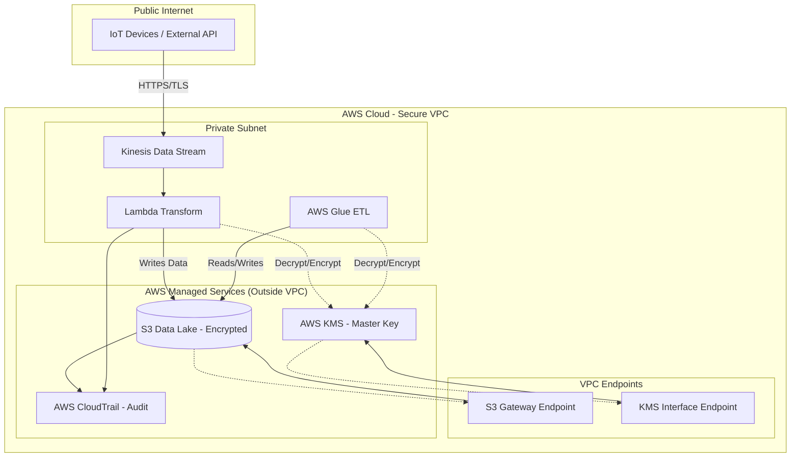

## Security, Compliance, and Networking

### Overview
In the world of data engineering, a pipeline is only as good as its security posture. You can build the most sophisticated, high-throughput ETL pipeline using Glue, Spark, and Kinesis, but if you cannot prove the integrity of your data or if you leak sensitive PII (Personally Encrypted Information) due to a misconfigured S3 bucket, you have failed as an engineer. Security in AWS data engineering is not a "layer" you add at the end; it is the foundation upon which the entire architecture is built.

The core problem we are solving here is the **Principle of Least Privilege** and the **Reduction of the Attack Surface**. In a traditional on-premise environment, you relied on physical firewalls and "perimeter security." In AWS, the perimeter is identity-based. We use IAM to define *who* can touch the data, VPC Endpoints to ensure data *never* touches the public internet, and KMS to ensure that even if a malicious actor steals the raw bits, they are mathematically useless without the decryption keys.

As a data engineer, your job is to navigate the tension between **accessibility** (getting data to the analysts) and **security** (keeping unauthorized users out). This section focuses on the "plumbing" of security: how to configure IAM roles for Glue, how to set up VPC Endpoints for S3 and Athena, and how to manage KMS keys so that your downstream Spark jobs don't crash due to `AccessDenied` errors.

### Core Concepts

#### 1. Identity and Access Management (IAM)
*   **IAM Roles vs. Users:** In data pipelines, we almost never use IAM Users. We use **IAM Roles**. A Glue ETL job or a Lambda function "assumes" a role. This role provides temporary credentials, which is significantly more secure than hardcoding long-handed access keys.
*   **Identity-Based Policies:** Attached to the Role (e.g., "This Glue job can read from S3").
*   **Resource-Based Policies:** Attached to the Resource (e.g., "Only this specific Glue Role can access this S3 bucket").
*   **The "Intersection" Rule:** For a request to succeed, both the Identity-based policy AND the Resource-based policy must allow it. If the IAM Role says "Allow" but the S3 Bucket Policy says "Deny," the result is a **Deny**.

#### 2. Networking: The VPC Perimeter
*   **Public vs. Private Subnets:** Data processing engines (like Glue or EMR) should reside in **Private Subnets** with no direct route to the Internet Gateway.
*   **VPC Endpoints (The Data Engineer's Best Friend):**
    *   **Gateway Endpoints:** Specifically for **S3** and **DynamoDB**. They are free and provide a route from your VPC to the service without leaving the AWS network.
       *   *Engineer's Note:* If you are running Glue in a VPC, you **must** have an S3 Gateway Endpoint, or your job will time out trying to reach S3 via the public internet.
    *   **Interface Endpoints (AWS PrivateLink):** Used for most other services (Kinesis, KMS, Secrets Manager). These use an ENI (Elastic Network Interface) inside your subnet. They cost money per hour/GB, so use them judiciously.
*   **NAT Gateways:** Used when your private resources need to reach the internet (e.g., to download a Python library from PyPI). These are expensive and can become throughput bottlenecks.

#### 3. Encryption and Key Management (KMS)
*   **Encryption at Rest:**
    *   **SSE-S3:** AWS manages the keys. Easy, but provides less control.
    *   **SSE-KMS:** You manage the keys via AWS KMS. This provides an audit trail in CloudTrail (you can see *who* decrypted the data). **This is the standard for production data lakes.**
*   **Encryption in Transit:** Always use **TLS 1.2+**. When moving data between services (e.g., Kinesis to S3), AWS handles this, but you must ensure your VPC Endpoints are configured to support it.
*   **Envelope Encryption:** The practice of encrypting data with a Data Key (DK), and then encrypting that DK with a Master Key (KMS CMK). This is how AWS handles massive datasets without the latency of sending large files to the KMS service.

### Architecture / How It Works

The following diagram illustrates a secure, production-grade data ingestion pattern. Notice how the data flows through VPC Endpoints, avoiding the public internet entirely.



### AWS Service Integrations

*   **Inbound (Ingestion):**
    *   **AWS IoT Core / Kinesis:** Feeds data into the pipeline. Requires IAM permissions for the device/producer to `kinesis:PutRecord`.
    *   **AWS AppFlow:** Moves data from SaaS (Salesforce/Zendesk) to S3. Requires a service-linked role to access the source and destination.
*   **Outbound (Transformation & Storage):**
    *   **AWS Glue to S3:** The most common pattern. Requires `s3:GetObject` and `s3:PutObject`, plus `kms:Decrypt/GenerateDataKey` if using SSE-KMS.
    *   **Athena to S3:** Athena queries S3. The Athena service role must have permission to access the S3 bucket and the KMS key used for encryption.
*   **The "Trust" Relationship:**
    *   When a service like Glue needs to access a resource, you must define a **Trust Policy** on the IAM Role that allows the service principal (e.g., `glue.amazonaws.com`) to assume that role. Without this, the role is useless.

### Security

*   **IAM Roles & Policies:**
    *   **Permission Boundary:** A managed policy that sets the maximum permissions an identity-based policy can grant. Use this to prevent developers from escalating their own privileges.
    *   **Service-Linked Roles (SLRs):** These are predefined roles created by AWS services. You don't manage them, but you must be aware of them when troubleshooting "Access Denentially" in services like Auto Scaling or Kinesis.
*   **Encryption at Rest:**
    *   **SSE-KMS:** Always use this for sensitive data. It allows for **Key Rotation**, which is a compliance requirement for SOC2/HIPAA.
    *   **Cross-Account Access:** If your Data Lake is in Account A and your Glue Job is in Account B, you must update the **KMS Key Policy** in Account A to allow Account B to use the key. *This is a frequent exam trap.*
*   **Encryption in Transit:**
    *   **VPC Endpoints:** Use Interface Endpoints (PrivateLink) to ensure traffic between your VPC and services like Lambda or Glue stays within the AWS backbone.
    *   **TLS:** Ensure all API calls to S3 or Kinesis use HTTPS.
*   **Audit Logging:**
    *   **AWS CloudTrail:** The "Black Box" recorder. Every API call (e.g., `DeleteBucket`, `GetSecretValue`) is logged. For Data Engineers, CloudTrail is the primary tool for debugging "Why did my job fail with Access Denied?"
    *   **S3 Access Logs:** Tracks every request made to an S3 bucket. Essential for compliance audits.
*   **Compliance:**
    *   **Data Residency:** Use AWS Regions to ensure data stays within specific geographic boundaries (e.g., GDPR requirements).
    *   **FIPS Endpoints:** For highly regulated industries, use FIPS-validated endpoints for AWS services.

### Performance Tuning

*   **KMS Throttling (The "Silent Killer"):**
    *   **Problem:** If you have a massive Glue job processing thousands of small files, each file requires a `kms:Decrypt` call. You will hit KMS API rate limits.
    *   **Tuning:** Use larger file sizes (Parquet/Avro) to reduce the number of calls. Implement **Envelope Encryption** correctly so you only call KMS for the Data Key, not for every single record.
*   **NAT Gateway Bottlenecks:**
    *   **Problem:** If your Glue job downloads a large library or connects to an external API via a NAT Gateway, you may hit bandwidth limits or incur massive costs.
    *   **Tuning:** Use **VPC Endpoints** for S3 and other AWS services to bypass the NAT Gateway.
*   **S3 Partitioning & Prefix Scaling:**
    *   **Problem:** While S3 scales massively, extreme request rates to a single "prefix" (folder) can cause 503 Slow Down errors.
    *   **Tuning:** Use a high-entropy prefix strategy (e.g., `s3://bucket/year/month/day/hour/`) to distribute requests across S3 partitions.
*   **Cost vs. Performance:**
    *   **Interface Endpoints vs. Gateway Endpoints:** Always use Gateway Endpoints for S3/DynamoDB because they are **free**. Only use Interface Endpoints when a Gateway Endpoint is not available.

### Important Metrics to Monitor

| Metric Name (Namespace) | What it Measures | Threshold to Alarm | Action to Take |
| :--- | :--- | :--- | :--- |
| `KMS: ThrottlingException` (KMS) | Rate of rejected KMS API calls. | > 5 in 1 min | Check if Glue job is processing too many small files; implement batching. |
| `NATGateway: ErrorPortAllocation` (NATGateway) | Exhaustion of available ports for outbound connections. | > 0 | Increase NAT Gateway scale or move traffic to VPC Endpoints. |
   | `S3: 403 Forbidden` (S3) | Rate of unauthorized access attempts. | Investigate IAM policy changes or compromised credentials. |
| `Glue: Job Run Failed` (Glue) | Frequency of ETL job failures. | > 1 | Check CloudWatch Logs and CloudTrail for `AccessDenied` or `Network Unreachable`. |
| `VPC: BytesOut` (VPC) | Volume of data leaving your VPC. | Unexpected spikes | Check for data exfiltration or misconfigured data replication. |
| `Kinesis: ReadProvisionedThroughputExceeded` (Kinesis) | Kinesis shard is being overwhelmed by reads. | > 0 | Increase the number of shards in the stream (resharding). |

### Hands-On: Key Operations

#### 1. Creating an S3 Bucket with Mandatory Encryption (Python/Boto3)
As a data engineer, never create a bucket without enforcing encryption.

```python
import boto3

s3 = boto3                    # Initialize S3 client
bucket_name = 'my-secure-data-lake-12345'

# Create the bucket
s3.create_bucket(Bucket=bucket_name)

# Enforce AES256 encryption at the bucket level
# This ensures every object uploaded is encrypted at rest
s3.put_bucket_encryption(
    Bucket=bucket_name,
    ServerSideEncryptionConfiguration={
        'Rules': [
            {
                'ApplyServerSideEncryptionByDefault': {
                    'SSEAlgorithm': 'AES256'
                }
            }
        ]
    }
)
print(f"Bucket {bucket_name} created with default SSE-S3 encryption.")
```

#### 2. Attaching a Bucket Policy to Restrict Access to a Specific VPC (AWS CLI)
This is how you ensure that your data can *only* be accessed from within your corporate network.

```bash
# Create a policy file named policy.json
cat <<EOF > policy.json
{
    "Version": "2012-10-17",
    "Statement": [
        {
            "Sid": "DenyIfNotInVPC",
            "Effect": "Deny",
            "Principal": "*",
            "Action": "s3:*",
            "Resource": [
                "arn:aws:s3:::my-secure-data-lake-12345",
                "arn:aws:s3:::my-secure-data-lake-12345/*"
            ],
            "Condition": {
                "StringNotEquals": {
                    "aws:SourceVpc": "vpc-0a1b2c3d4e5f6g7h8"
                }
            }
        }
    ]
}
EOF

# Apply the policy to the bucket
aws s3api put-bucket-policy --bucket my-secure-data-lake-12345 --policy file://policy.json
```

### Common FAQs and Misconceptions

**Q: I gave my Glue Role `AmazonS3FullAccess`. Why am I getting `Access Denied` when reading encrypted files?**
**A:** You likely forgot the KMS permissions. To read SSE-KMS encrypted files, the role needs `kms:Decrypt` on the specific KMS key used to encrypt the data.

**Q: Is a VPC Gateway Endpoint the same as an Interface Endpoint?**
**A:** No. Gateway Endpoints are for S3 and DynamoDB and are free. Interface Endpoints use PrivateLink, use an ENI, and incur an hourly/data processing cost.

**Q: If I use S3 SSE-S3, does it protect me from an AWS Administrator?**
**A:** No. SSE-S3 manages keys automatically. An administrator with sufficient IAM permissions can still access the data. For higher security, use SSE-KMS with strict Key Policies.

**Q: Does creating a NAT Gateway make my VPC "Public"?**
**A:** No. The resources in your private subnet are still private. The NAT Gateway simply allows them to initiate outbound requests to the internet (e.g., for updates) without allowing the internet to initiate connections to them.

**Q: Can I use a VPC Endpoint to allow my on-premise server to talk to S3?**
**A:** No. VPC Endpoints are for resources *inside* your VPC. For on-premise access, you would use a Site-to-Site VPN or Direct Connect.

**A: Does CloudTrail log every single S3 `GetObject` request by default?**
**A:** No. CloudTrail logs management events (like `CreateBucket`) by default. To log data events (like `GetObject`), you must explicitly enable **S3 Data Events** in your Trail configuration, which increases cost.

**Q: If I delete a KMS key, what happens to the data encrypted with it?**
**A:** The data becomes permanently unrecoverable. This is a "digital shredding" mechanism, but it can be catastrophic if done accidentally.

**Q: Can an IAM Policy override a Bucket Policy?**
**A:** Only if the Bucket Policy is an explicit `Deny`. In AWS, an explicit `Deny` in *any* applicable policy always wins.

### Exam Focus Areas

*   **Ingestion & Transformation (Domain: Ingestion):**
    *   Configuring IAM roles for Kinesis and Glue.
    *   Setting up VPC Endpoints to ensure secure data flow from Kinesis to S3.
*   **Store & Manage (Domain: Storage):**
    *   Implementing S3 Bucket Policies to restrict access via VPC or IP range.
    *   Enforcing encryption at rest using SSE-KMS.
*   **Operate & Support (Domain: Security/Compliance):**
    *   Using CloudTrail for auditing data access.
    *   Troubleshooting `AccessDenied` errors by analyzing the intersection of IAM and Resource-based policies.
*   **Design & Create (Domain: Networking):**
    *   Choosing between Gateway Endpoints (S3/DynamoDB) and Interface Endpoints (KMS/Lambda).
    *   Designing multi-account architectures using KMS Key Policies for cross-account data sharing.

### Quick Recap
*   **Identity is the new Perimeter:** Use IAM Roles and Least Privilege.
*   **Encryption is non-negotiable:** Use SSE-KMS for production-grade auditability.
*   **Avoid the Internet:** Use VPC Gateway Endpoints for S3 to save money and increase security.
*   **The Deny Wins Rule:** An explicit `Deny` in a Bucket Policy or SCP overrides any `Allow` in an IAM Role.
*   **KMS is a bottleneck:** Be careful with high-frequency small-file processing to avoid KMS throttling.
*   **Audit everything:** Use CloudTrail to track who is accessing your data and when.

### Blog & Reference Implementations
*   **AWS Big Data Blog:** [Securing your Data Lake with AWS](https://aws.amazon.com/blogs/big-data/) - Best practices for S3 and Glue security.
*   **AWS re:Invent 2023:** [Deep Dive into AWS KMS](https://www.youtube.com/user/AWS) - Understanding envelope encryption at scale.
*   **AWS Workshop Studio:** [Security Workshop for Data Engineers](https://workshop.aws/) - Hands-on labs for VPC and IAM configuration.
*   **AWS Well-Architected Tool:** [Security Pillar Guidance](https://aws.amazon.com/architecture/well-architected/) - Check your architecture against industry standards.
*   **AWS Samples GitHub:** [Data Engineering Patterns](https://github.com/aws-samples) - Reference CloudFormation templates for secure VPC/S3 setups.