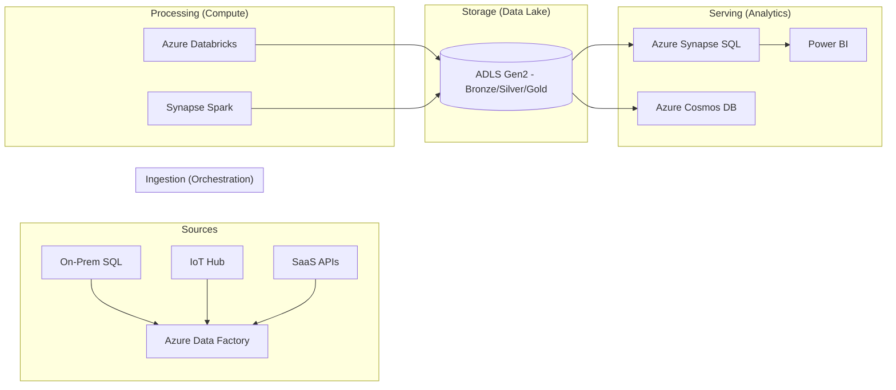

## Course Introduction and DP-203 Exam Overview

### Section at a Glance
**What you'll learn:**
- The core responsibilities of an Azure Data Engineer in a modern enterprise.
- A deep dive into the four functional domains of the DP-203 certification exam.
- The fundamental components of the Azure Data Ecosystem (ADF, Synapse, Databricks, ADLS Gen2).
- How to map business requirements to specific Azure data services.
- A strategic roadmap for preparing for and passing the DP-203 exam.

**Key terms:** `ETL/ELT` · `Data Lakehouse` · `Orchestration` · `Compute` · `Partitioning` · `Schema-on-read`

**TL;DR:** This section provides the architectural blueprint for the entire course and the DP-203 exam, defining the scope of your role as a data engineer and the specific Azure services you must master to build scalable, secure, and cost-effective data pipelines.

---

### Overview
In the modern enterprise, data is often described as "the new oil," but raw, unrefined data is a significant liability. Organizations face the "Data Swamp" problem: massive volumes of fragmented, inconsistent, and inaccessible data sitting in disconnected silos. This creates immense business friction, leading to poor decision-making, increased operational risk, and missed market opportunities.

The role of the Azure Data Engineer is to solve this by building the "refinery." You are responsible for designing and implementing the pipelines that ingest, transform, and serve data. This course isn't just about learning tools; it is about mastering the patterns of **Data Integration, Data Storage, and Data Processing.**

This section serves as your orientation. We will move beyond simple SQL queries to understand how to orchestrate complex, multi-stage workflows that move data from disparate sources (like IoT sensors, ERP systems, and SaaS APIs) into a centralized, high-performance analytics environment. By the end of this section, you will understand not just *what* you are learning, but *why* each service is critical to a company's ability to derive value from its data assets.

---

### Core Concepts

#### The Data Engineer's Mandate
A Data Engineer sits between the raw data source and the data consumer (Analyst/Scientist). Your primary goal is **Data Reliability and Availability.** 

> 📌 **Must Know:** The DP-203 exam focuses heavily on "Data Integration" and "Data Processing." You are not being tested on how to build a Power BI dashboard; you are being tested on how to ensure the data *underneath* that dashboard is accurate, timely, and secure.

#### The Four Pillars of the DP-203 Exam
The exam is structured around four specific domains. You must be able to architect solutions within each:

1.  **Design and implement data storage (25–30%):** This involves selecting between Relational (Azure SQL), NoSQL (Cosmos DB), and Object Storage (ADLS Gen2). 
    *   ⚠️ **Warning:** A common failure point in the exam is choosing a Relational database for unstructured log data. You must understand when to use "Schema-on-write" vs. "Schema-on-read."
2.  **Design and implement data processing (25–30%):** This covers the "heavy lifting"—using Azure Databricks or Azure Synapse Spark to transform raw data into structured formats (like Parquet or Delta).
3.  **Design and implement data integration (25–30%):** This is the "orchestration" layer. You must master Azure Data Factory (ADF) to move data from Point A to Point B, handling retries, dependencies, and error logging.
4.  **Design and implement data security (15–20%):** Implementing Managed Identities, Role-Based Access Control (RBAC), and network isolation (Private Endpoints) to ensure data is only accessible to authorized users.

#### The Modern Data Warehouse (MDW) Pattern
The course follows the **Medallion Architecture** (Bronze/Silver/Gold) pattern, which is the industry standard for building Lakehouses.
*   **Bronze (Raw):** Landing zone for raw data.
*   **Silver (Cleansed):** Filtered, joined, and standardized data.
*   **Gold (Curated):** Aggregated, business-ready data for reporting.

> 💡 **Tip:** When designing pipelines, always aim for "idempotency"—the ability to run the same pipeline multiple times with the same input and achieve the same result without duplicating data.

---

### Architecture / How It Works

The following diagram illustrates the high-level data flow that we will build throughout this course.



1.  **Sources:** The disparate origins of raw data.
2.  **Azure Data Factory (ADF):** The "conductor" that triggers and manages the movement of data.
3.  **ADLS Gen2:** The central repository (Data Lake) where data is stored in various stages of refinement.
4.  **Compute (Databricks/Synapse):** The engines that perform the complex transformations and cleaning.
5.  **Serving Layer:** The final, high-performance layer where structured data is presented to end-users and BI tools.

---

### Comparison: When to Use What

| Option | Best For | Trade-offs | Approx. Cost Signal |
| :--- | :--- | :--- | :--- |
| **Azure Data Factory** | Orchestration and simple ETL/ELT movements. | Not a "processing" engine; you can't run complex Python logic *inside* a copy activity. | Low (Pay per activity/run) |
| **Azure Databricks** | Complex, large-scale Spark transformations and ML. | Requires managing clusters and Spark configuration expertise. | High (Compute-intensive) |
| **Azure Synapse Analytics** | Unified experience (SQL, Spark, Integration) in one workspace. | Can become complex to manage; "all-in-one" can lead to sprawl if not governed. | Moderate to High |
| **Azure SQL Database** | Highly structured, relational workloads with ACID requirements. | Not suitable for unstructured/semi-structured "big data" processing. | Moderate (Provisioned/Serverless) |

**How to choose:** If your workload is purely "move data from A to B," use **ADF**. If you need to perform deep feature engineering or heavy data science, use **Databricks**. If you want a single, integrated environment for your entire data estate, use **Synapse**.

---

### Cost Cheat Sheet

| Scenario | Recommended Option | Key Cost Driver | Watch Out For |
| :--- | :--- | :--- | :--- |
| **Periodic Batch Ingestion** | ADF + ADLS Gen2 | Number of activities and data volume moved. | 💰 **The "Always-On" Trap:** Leaving Data Factory integration runtimes or Databricks clusters idling. |
| **Real-time IoT Stream** | Stream Analytics + Cosmos DB | Throughting Units (TUs) or Request Units (RUs) per second. | High latency caused by over-partitioning. |

| **Large Scale Transformation** | Azure Databricks (Auto-scaling) | Cluster uptime and instance type (VM size). | ⚠️ Unmanaged "Auto-scaling" that scales up but fails to scale down promptly. |
| **Long-term Archiving** | ADLS Gen2 (Archive Tier) | Data storage volume and retrieval fees. | High costs when "rehydrating" data from Archive to Hot tier. |

> 💰 **Cost Note:** The single biggest cost mistake is failing to implement **Auto-termination** on compute clusters (Databricks/Synapse Spark). A cluster left running overnight can cost hundreds of dollars for zero business value.

---

### Service & Tool Integrations

1.  **The Ingestion Pattern:**
    *   Use **ADF** to pull data from an on-premises SQL Server via a Self-Hosted Integration Runtime.
    *   Store the raw output in **ADLS Gen2 (Bronze Layer)**.
2.  **The Transformation Pattern:**
    *   Trigger an **Azure Databricks** notebook via an **ADF** pipeline.
    *   The notebook reads the Bronze Parquet files, cleans them, and writes them back to **ADLS Gen2 (Silver Layer)**.
3.  **The Serving Pattern:**
    *   Use **Synapse SQL Pool** to create a relational view over the Silver/Gold Parquet files (using Serverless SQL).
    *   Connect **Power BI** to that Synapse endpoint for real-time reporting.

---

### Security Considerations

Security in Azure Data Engineering is a multi-layered approach, moving from the perimeter to the individual file.

| Control | Default State | How to Enable / Strengthen |
| :--- | :--- | :--- |
| **Authentication** | Managed Identities (best practice) | Use **Azure Managed Identities** to allow ADF to access ADLS without storing passwords in code. |
| **Authorization** | RBAC (Role-Based Access Control) | Implement **Fine-grained access control** via ACLs (Access Control Lists) on specific folders in ADLS Gen2. |
| **Encryption** | Encryption at Rest (Enabled) | Use **Customer-Managed Keys (CMK)** in Azure Key Vault for sensitive regulatory compliance. |
| **Network Security** | Public Endpoint (Unsecured) | Use **Private Endpoints** and **Virtual Networks (VNETs)** to ensure data never traverses the public internet. |

---

### Performance & Cost

Performance tuning in the Azure Data ecosystem is almost always a trade-off with cost.

**The Partitioning Trade-off:**
If you partition your data in ADLS Gen2 by `Year/Month/Day`, queries looking for a specific date will be lightning-fast because they skip irrelevant files. However, if you create *too many* small partitions (the "Small File Problem"), the metadata overhead will actually slow down your Spark jobs and increase costs.

**Example Cost Scenario:**
*   **Scenario:** Processing 1TB of daily logs.
*   **Unoptimized:** Using a single large CSV file. Result: Spark struggles to parallelize; job takes 4 hours; requires a massive, expensive cluster.
*   **Optimized:** Using Partitioned Parquet files (approx. 128MB each). Result: Spark processes files in parallel; job takes 20 minutes; can run on a much smaller, cheaper cluster.
*   **Outcome:** The optimized approach can reduce compute costs by upwards of 60-70%.

---

### Hands-On: Key Operations

The following steps demonstrate how to initiate a basic data movement pipeline using the Azure CLI.

**1. Create a Resource Group to house your data estate.**
```bash
az group create --name DataEngineerCourse-RG --location eastus
```

**2. Create an Azure Data Lake Storage Gen2 account.**
```bash
az storage account create \
    --name datalakestorage001 \
    --resource-group DataEngineerCourse-RG \
    --location eastus \
    --sku Standard_GRS \
    --hierarchical-namespace true
```
> 💡 **Tip:** The `--hierarchical-namespace true` flag is what actually turns a standard Blob storage account into a "Data Lake Gen2" by enabling folder-level security (ACLs).

**3. Create a Container (Filesystem) for our Raw data.**
```bash
az storage container create \
    --name bronze-raw \
    --account-name datalakestorage001
```

---

### Customer Conversation Angles

**Q: "We already have a SQL Server on-prem. Why do we need Azure Data Factory?"**
**A:** "Think of ADF as the automated logistics network. While your SQL Server holds your structured data, ADF can reach out to your IoT sensors, cloud apps, and web APIs, bringing all that data into a single environment where it can be unified with your SQL data."

**Q: "Will moving to the cloud significantly increase our monthly spend?"**
**A:** "It changes your spend from a fixed Capital Expense (CapEx) to a variable Operating Expense (OpEx). While costs can rise if unmanaged, we use features like Auto-scaling and Serverless SQL to ensure you only pay for the compute you actually use."

**Q: "How do we know the data in our new Lakehouse is actually accurate?"**
**A:** "We implement 'Data Quality Gates' within our pipelines. We use tools like Databricks or Synapse to run validation checks—such as null checks or schema validation—at the Silver layer, so errors are caught before they ever reach your reports."

**Q: "Is our data safe from hackers in a public cloud?"**
**A:** "Azure provides more robust security tools than most on-prem environments. By using Private Endpoints and Managed Identities, we can ensure that your data is invisible to the public internet and that no human ever needs to handle a database password."

**Q: "Can we use our existing Python/SQL skills, or do we need to learn a new language?"**
**A:** "The great thing about Azure is that it's polyglot. You can use T-SQL for structured analysis, Python/PySpark for heavy engineering, and Scala for high-performance processing—all within the same ecosystem."

---

### Common FAQs and Misconceptions

**Q: Is Azure Data Factory a replacement for Spark?**
**A:** No. ADF is an *orchestrator*. It tells the engine when to start, but it doesn't do the heavy data crunching itself. 
> ⚠️ **Warning:** Never attempt to perform complex data transformations *inside* an ADF Copy Activity; you will hit performance bottlenecks and high costs.

** 1. Does 'Cloud Data Engineering' mean I don't need to know SQL?**
**A:** Absolutely not. SQL remains the foundational language for data querying and transformation in almost every Azure service.

**Q: Is Azure Databricks the same as Azure Synapse?**
**A:** They are different. Databricks is a managed Spark platform; Synapse is a unified analytics service that *includes* Spark capabilities but also includes SQL and Integration features.

**Q: Can I use ADLS Gen2 for small, transactional database workloads?**
**A:** No. ADLS Gen2 is optimized for high-throughput, large-scale analytical processing (OLAP), not for the low-latency, row-level transactions (OLTP) required by an app.

**Q: Do I need to migrate all my data to the cloud at once?**
**A:** No. Most successful migrations follow a "Hybrid" approach, using ADF to bridge your on-premises data with your new Azure environment incrementally.

**Q: Does using 'Serverless' mean it's always free?**
**A:** No. 'Serverless' means you don't pay for an idle server, but you *do* pay for every query executed and every byte of data processed.

---

### Exam & Certification Focus

*   **Domain: Design and Implement Data Storage (25–30%)**
    *   Choosing between Blob, ADLS Gen2, and SQL.
    *   Implementing Hierarchical Namespace (HNS).
    *   📌 **High Frequency:** Understanding the difference between Hot, Cool, and Archive storage tiers.
*   **Domain: Design and Implement Data Processing (25–30%)**
    *   Writing Spark transformations (PySpark/SQL).
    *   Managing Delta Lake features (Upserts/Vacuum/Optimize).
    *   📌 **High Frequency:** Implementing the Medallion Architecture (Bronze $\to$ Silver $\to$ Gold).
*   **Domain: Design and Implement Data Integration (25–30%)**
    *   Creating ADF Pipelines, Datasets, and Linked Services.
    *   Handling error handling and retry logic in pipelines.
*   **Domain: Design and Implement Data Security (15–20%)**
    *   Implementing RBAC and ACLs.
    *   📌 **High Frequency:** Using Managed Identities for passwordless authentication.

---

### Quick Recap
- The Data Engineer builds the "refinery" to turn raw data into business value.
- The DP-203 exam tests four pillars: Storage, Processing, Integration, and Security.
- Azure Data Factory is the orchestrator; Databricks/Synapse are the engines; ADLS Gen2 is the warehouse.
- Security is best handled through Managed Identities and Private Endpoints.
- Success in the cloud requires a focus on "Cost-Aware Engineering"—minimizing idle compute and optimizing file formats.

---

### Further Reading
**Microsoft Learn** — The official study guide and sandbox environment for DP-203.
**Azure Architecture Center** — Reference architectures for the Modern Data Warehouse.
**Azure Data Factory Documentation** — Deep dive into connectors and integration runtimes.
**Azure Databricks Whitepaper** — Understanding the Lakehouse architecture and Delta Lake.
**Azure Security Documentation** — Best practices for securing data at rest and in transit.