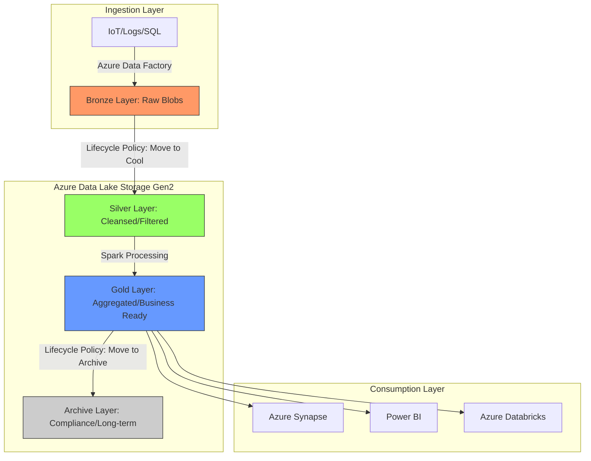

## Designing and Implementing Azure Storage Solutions

### Section at a Glance
**What you'll learn:**
- Architecting scalable storage using Azure Blob, Files, and Disk.
- Optimizing data lifecycle management to balance performance and cost.
- Implementing robust security models using RBAC, SAS, and Networking.
- Choosing between Redundancy levels (LRS, GRS, ZRS) based on RPO/RTO requirements.
- Integrating Azure Storage with Data Factory, Synapse, and Databricks.

**Key terms:** `Blob Storage` · `Access Tiers` · `Redundancy (LRS/GRS/ZRS)` · `Lifecycle Management` · `Shared Access Signature (SAS)` · `Hierarchical Namespace (HNS)`

**TL;DR:** Mastering Azure Storage is about aligning data durability and availability requirements with cost-efficient access patterns to create a reliable foundation for all downstream data engineering pipelines.

---

### Overview
In the modern enterprise, "data gravity" is a real architectural constraint. Organizations no longer struggle with *how* to store data, but with the complexity of *where* and *how* to store it to ensure it is accessible, secure, and cost-effective. For a Data Engineer, storage is the bedrock. If your storage architecture is flawed—either too expensive due to over-provisioning or too fragile due to poor redundancy—the entire data platform (Synapse, Databricks, Fabric) inherits those failures.

The fundamental problem this section addresses is the "Storage Paradox": the business wants infinite scale and instant availability, but the CFO wants the lowest possible monthly bill. A well-designed storage solution solves this by implementing tiered storage, automated lifecycle policies, and precise access controls.

In the context of the DP-203 exam and professional practice, this section moves you beyond simply "uploading files" to "engineering data lakes." We will focus on the transition from unstructured blobs to organized, high-performance Data Lakes via the Hierarchical Namespace, and how to ensure that a single misconfigured access key doesn't lead to a catastrophic data breach.

---

### Core Concepts

#### 1. Azure Blob Storage & Access Tiers
Blob storage is designed for massive amounts of unstructured data. The most critical decision a Data Engineer makes is selecting the correct **Access Tier**.

*   **Hot Tier:** Optimized for frequent access. High storage cost, but low access cost.
*   ingly **Cool Tier:** Optimized for data that is stored for at least 30 days. Lower storage cost, but higher access cost.
*   **Archive Tier:** For data rarely accessed (stored for at least 180 days). Lowest storage cost, but highest latency (retrieval requires "rehydration").

> ⚠️ **Warning:** Moving data from Archive to Hot is not instant. You must "rehydrate" the blob, which can take hours depending on the priority level selected. Never build a real-time pipeline that expects Archive-tier data to be instantly available.

#### 2. Redundancy and Availability
Redundancy defines your disaster recovery posture.
*   **LRS (Locally Redundant Storage):** Replicates 3 times within a single data center. Protects against disk/server failure, but not a data center outage.
*   **ZRS (Zone Redundant Storage):** Replicates across three availability zones in a single region. Protects against a data center failure.
*   **GRS (Geo-Redundant Storage):** Replicates to a secondary region hundreds of miles away. 📌 **Must Know:** This is your primary tool for meeting high RPO (Recovery Point Objective) requirements.

#### 3. Azure Data Lake Storage (ADLS) Gen2
This is not a separate service, but a feature enabled on a standard Blob account called **Hierarchical Namespace (HNS)**.
*   Standard Blob uses a "flat" namespace (folders are just part of the file name string).
*   ADLS Gen2 uses a true file system structure (real directories).
*   **Impact:** HNS allows for atomic directory renames and efficient permission inheritance, which is critical for large-scale Spark/Databricks workloads.

> 💡 **Tip:** If you are building a Data Lake for Spark-based analytics, you **must** enable Hierarchical Namespace. Without it, directory operations in Spark become incredibly slow because the system has to "walk" the entire flat namespace to rename a folder.

---

### Architecture / How It Works

The following diagram illustrates a typical Medallion Architecture (Bronze/Silver/Gold) utilizing Azure Storage features.



1.  **Ingestion Layer:** Uses tools like ADF to land raw data into the Bronze zone.
2.  **Bronze Layer:** Uses **Hot Tier** for immediate processing; HNS enabled.
3.  **Silver/Gold Layers:** Transitioned via **Lifecycle Management** to **Cool Tier** as data ages.
4.  **Archive Layer:** Holds data for regulatory compliance using the **Archive Tier**.
5.  **Consumption Layer:** High-performance compute engines querying the Gold layer.

---

### Comparison: When to Use What

| Option | Best For | Trade-offs | Approx. Cost Signal |
| :--- | :--- | :--- | :--- |
| **Blob (Hot)** | Active, frequently queried data. | High storage cost per GB. | Highest |
| **Blob (Cool)** | Backups, logs, monthly reports. | Higher cost for data retrieval/reads. | Medium |

| **Blob (Archive)**| Long-term compliance, legal holds. | High latency (hours to retrieve). | Lowest |
| **Azure Files** | Lift-and-shift of legacy Windows apps. | Less scalable for Big Data analytics. | High (Premium) |

**How to choose:** Evaluate your **Access Frequency** and **Latency Tolerance**. If you need millisecond access for a Spark job, use Hot/Cool. If you only need the data once a year for an audit, use Archive.

---

### Cost Cheat Sheet

| Scenario | Recommended Option | Key Cost Driver | Watch Out For |
| :--- | :--- | :--- | :--- |
| **Raw Ingestion** | Hot Tier + LRS | Storage Volume (GB) | High egress/transfer costs |
| **Historical Audits** | Archive Tier + GRS | Rehydration Latency | 💰 **Cost Note:** Rehydrating large datasets can spike your "Access" costs unexpectedly. |
| **Large Scale Analytics**| ADLS Gen2 (HNS) | Transaction Volume (Read/Write) | High number of small files |
| **Shared Enterprise Files**| Azure Files (Premium)| Provisioned Capacity | Over-provisioning unused space |

> 💰 **Cost Note:** The single biggest mistake in Azure Storage is failing to implement **Lifecycle Management**. Leaving "Raw" data in the Hot tier indefinitely as it grows into petabytes will eventually become the largest line item on your Azure bill.

---

### Service & Integrations

1.  **Azure Data Factory (ADF):**
    *   Uses Managed Identities to read/write to Storage.
    *   Pattern: Landing (Raw) $\rightarrow$ Transformation (Curated) $\rightarrow$ Archival.
2.  **Azure Databricks / Synapse Spark:**
    *   Relies on **ADLS Gen2 (HNS)** for high-performance file system operations.
    
3.  **Azure Backup / Site Recovery:**
    *   Integrates with GRS/RA-GRS to ensure cross-region recovery.

---

### Security Considerations

Security in storage is multi-layered. You must secure the **Network**, the **Identity**, and the **Data** itself.

| Control | Default State | How to Enable / Strengthen |
| :--- | :--- | :--- |
| **Network Isolation** | Public Access Enabled | Use **Private Endpoints** (Private Link) to keep traffic off the internet. |
| **Authentication** | Account Key (Strong) | Use **Azure AD (Entra ID) RBAC**; avoid sharing Account Keys. |
| **Fine-grained Access**| All or Nothing | Use **Shared Access Signatures (SAS)** with short expiration times. |
| **Encryption** | Service-Managed Key | Use **Customer-Managed Keys (CMK)** in Key Vault for higher compliance. |

---

### Performance & Cost

**The "Small File" Problem:**
In Data Engineering, performance is often bottlenecked by the *number* of files, not the *size*. In ADLS Gen2, having millions of 1KB files will cause massive metadata overhead and slow down Spark drivers.

**Example Cost/Performance Scenario:**
*   **Scenario A:** 1,000 files of 100MB each (100GB total).
*   **Scenario B:** 1,000,000 files of 100KB each (100GB total).
*   **Result:** Scenario B will be significantly more expensive due to **Transaction Costs** (PUT/LIST operations) and much slower to process in a Spark cluster.

> 💡 **Tip:** Always implement a "Compaction" step in your pipeline to coalesce small files into larger (128MB - 512MB) Parquet files.

---

### Hands-On: Key Operations

**1. Enable Hierarchical Namespace (via Azure CLI)**
This converts a standard storage account into ADLS Gen2.
```bash
az storage account update --name mystorageaccount --resource-group myrg --enable-hierarchical-namespace true
```
> 💡 **Tip:** This can only be done during account creation or via specific migration paths; you cannot simply "flip a switch" on an existing non-HNS account without complex workarounds.

**2. Creating a Lifecycle Management Policy (JSON)**
This policy automatically moves blobs to 'Cool' storage if they haven't been modified in 30 days.
```json
{
  "rules": [
    {
      "name": "MoveToCool",
      "enabled": true,
      "type": "Lifecycle",
      "definition": {
        "actions": {
          "baseBlob": { "tierToCool": { "daysAfterModificationGreaterThan": 30 } }
        },
        "filters": { "blobTypes": [ "blockBlob" ] }
      }
    }
  ]
}
```

---

### Customer Conversation Angles

**Q: We have a strict requirement that our data must survive the loss of an entire Azure region. What should we use?**
**A:** You should implement Geo-Redundant Storage (GRS). This replicates your data to a secondary region, ensuring availability even during a regional catastrophe.

**Q: Our developers keep using the Storage Account Access Keys in their code. Is this a risk?**
**A:** Yes, it's a significant risk. If a key is leaked, the attacker has full control. We should move to Azure AD-based authentication and use Managed Identities for your compute resources.

**Q: We are seeing a spike in our monthly Azure bill related to storage. Where should we look first?**
**A:** First, check your transaction costs and access tiers. You might be storing "cold" data in the "Hot" tier, or your ingestion process might be creating millions of tiny files, driving up transaction fees.

**Q: Can we use the same storage account for our web application and our Big Data Lake?**
**A:** Technically yes, but architecturally, I wouldn't recommend it. The security requirements and access patterns for a web app (latency-sensitive) and a Data Lake (throughput-sensitive) are very different.

**Q: How long does it take to get my data back from the Archive tier if a user requests a report?**
**A:** It depends on the priority you choose. "Standard" priority can take several hours. If you need it faster, you can use "High" priority, but it comes at a higher cost.

---

### Common FAQs and Misconceptions

**Q: Is ADLS Gen2 a different service from Azure Blob Storage?**
**A:** No. It is Blob Storage with the Hierarchical Namespace feature enabled.

**Q: If I use GRS, is my data instantly available in the secondary region?**
**A:** No. The secondary region is updated asynchronously. ⚠️ **Warning:** There is a potential for minor data loss (RPO) during a regional failover.

**Q: Can I use SAS tokens for permanent access?**
**A:** Never. ⚠️ **Warning:** SAS tokens should always have an expiration date. For permanent access, use Azure AD RBAC.

**Q: Does enabling Hierarchical Namespace increase my storage cost?**
**A:** There is a slight increase in the cost of metadata operations (like listing files), but the performance benefits for analytics usually far outweigh this.

**Q: Can I move data from Cool to Archive directly?**
**A:** Yes, via Lifecycle Management policies.

**Q: Does encryption at rest protect me from someone with the Account Key?**
**A:** No. Encryption at rest protects against physical theft of disks from the data center. If someone has your Account Key, they can decrypt the data via the API.

---

### Exam & Certification Focus
*   **Identify Redundancy Levels (Domain: Design Data Storage):** Know the difference between LRS, ZRS, and GRS. 📌 **Must Know**
*   **Lifecycle Management (Domain: Implement Data Processing):** Understand the triggers (days since modification) and actions (tier to cool/archive).
*   **Security Implementation (Domain: Secure Data Assets):** Difference between Access Keys, SAS, and Azure AD/RBAC. 📌 **High Frequency**
*   **ADLS Gen2 Features (Domain: Design Data Storage):** Understanding the impact of Hierarchical Namespace on performance.

---

### Quick Recap
- **Tiering is key:** Use Hot for active, Cool for infrequent, and Archive for long-term/compliance.
- **HNS is mandatory for Data Lakes:** Without Hierarchical Namespace, Spark performance will degrade due to flat namespace limitations.
- **Redundancy defines DR:** Choose GRS for regional resilience; use LRS for cost-effective local protection.
- **Security must be Identity-centric:** Move away from Account Keys toward Azure AD and Managed Identities.
- **Manage your files:** Avoid the "small file problem" to control both performance and transaction costs.

---

### Further Reading
**Azure Storage Documentation** — Deep dive into all storage types (Blob, File, Queue, Table).
**Azure Storage Security Best Practices** — Official guide on securing data with networking and identity.
**Azure Storage Redundancy Overview** — Detailed breakdown of LRS, ZRS, GRS, and RA-GRS.
**ADLS Gen2 Architecture Whitepaper** — Understanding the performance benefits of HNS for Big Data.
**Azure Cost Management for Storage** — How to monitor and optimize storage-related expenditures.