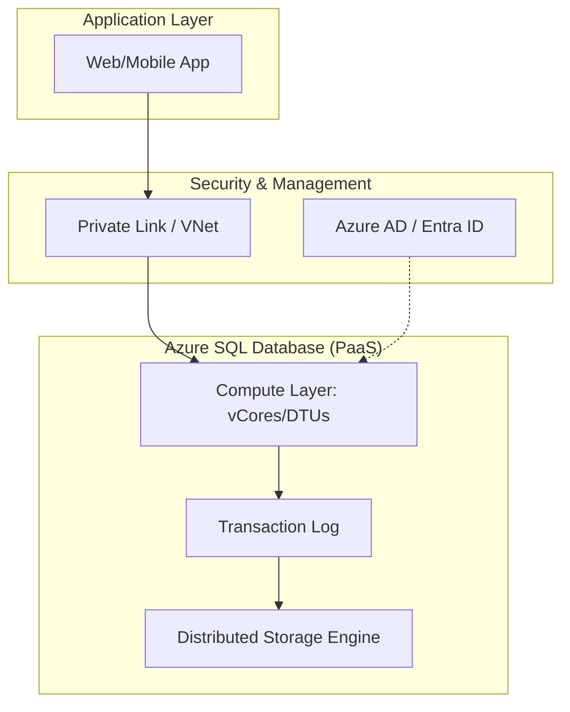

## Implementing Relational Data Stores with Azure SQL

### Section at a Glance
**What you'll learn:**
- Differentiating between Azure SQL Database, Managed Instance, and SQL Server on VM.
- Configuring compute and storage scaling strategies for varying workloads.
- Implementing security through network isolation and identity management.
- Designing high availability and disaster recovery (HADR) architectures.
- Optimizing performance using Intelligent Query Processing and indexing.

**Key terms:** `DTU` · `vCore` · `Serverless` · `Hyperscale` · `Failover Group` · `Private Link`

**TL;R:** Choosing the right Azure SQL deployment model is about balancing the operational overhead of managing infrastructure against the need for fine-grained control over the database engine and underlying OS.

---

### Overview
In the modern enterprise, data is often trapped in silos or locked in rigid, legacy on-premises SQL Servers. For a business, this leads to "maintenance debt"—the high cost of patching, upgrading, and managing hardware rather than delivering insights. Azure SQL services solve this by offering Platform-as-a-Service (PaaS) models that abstract the "undifferentiated heavy lifting" of database administration.

As a Data Engineer, your primary goal isn't just to move data, but to ensure its availability, integrity, and performance. The challenge is that a "one size fits all" approach fails in the cloud. A mission-critical transaction system requires different availability guarantees than a seasonal reporting warehouse. 

This section covers the spectrum of Azure SQL offerings. We will move from the fully managed, "set it and forget it" Azure SQL Database to the more heavy-duty Azure SQL Managed Instance, and finally to the Infrastructure-as-a-Service (IaaS) model of SQL Server on Azure VMs. Understanding these distinctions is critical for designing architectures that are both cost-effective and resilient.

---

### Core Concepts

#### 1. Deployment Models: The Spectrum of Control
The fundamental decision in Azure SQL is where you want your responsibility to end and Microsoft's to begin.

*   **Azure SQL Database:** A single, intelligent database in the cloud. It is the ultimate PaaS.
    *   **Best for:** Modern cloud-native applications.
    • 📌 **Must Know:** It is a "singleton" resource. While you can scale it, you don't manage the "Server" object in the same way you do on-premises; you manage the database itself.
*   **Azure SQL Managed Instance (SQL MI):** Provides nearly 100% compatibility with the latest SQL Server (Enterprise Edition) engine.
    *   **Best for:** "Lift and shift" migrations from on-premises.
    • ⚠️ **Warning:** While highly managed, you still deal with instance-level features like SQL Agent jobs and Cross-database queries, which behave differently than a single-database model.
*   **SQL Server on Azure VMs (IaaS):** You manage the OS, the SQL installation, and the patching.
    • 📌 **Must Know:** This is the only option if you require access to the underlying Operating System or specific third-party software installed on the host.

#### 2. Compute Tiers: DTU vs. vCore
Azure SQL uses two distinct models to measure the "power" of your database.

*   **DTU (Database Transaction Unit):** A bundled measure of CPU, Memory, and I/O. 
    • 💰 **Cost Note:** DTU is easier to understand for small, predictable workloads but offers less granular control.
*    **vCore:** Provides more flexibility. You choose the number of virtual cores and the amount of memory.
    *   **Provisioned:** You pay for a set amount of capacity 24/7.
    *   **Serverless:** Automatically scales compute based on workload demand and pauses during inactivity.
    • 💡 **Tip:** Use Serverless for intermittent, "bursty" workloads (like Dev/Test environments) to save significant costs during idle periods.

#### 3. Scalability & The Hyperscale Tier
Traditional databases hit a "ceiling" when data volumes explode. **Azure SQL Hyperscale** breaks this ceiling by decoupling compute from storage.
*   **Rapid Scaling:** Scales up to 100TB+.
*   **Architectural Shift:** Uses a multi-tier architecture where the storage layer is a distributed, cloud-native fleet.

---

### Architecture / How It Works



1.  **Application Layer:** The consumer of the data, interacting via standard SQL drivers.
2.  **Compute Layer:** Processes queries, manages locks, and executes transactions.
    3.  **Transaction Log:** The source of truth for durability; every change is recorded here first.
    4.  **Storage Engine:** In Hyperscale, this is a distributed fleet that allows near-instantaneous scaling and snapshots.
    5.  **Security/Management:** The perimeter that controls who can connect (Networking) and who can execute (Identity).

---

### Comparison: When to Use What

| Option | Best For | Trade-offs | Approx. Cost Signal |
| :--- | :--- | :--- | :--- |
| **Azure SQL Database (Single)** | New, cloud-native apps; microservices. | Limited instance-level features (e.g., no SQL Agent). | Low to Moderate |
| **Azure SQL Managed Instance** | Migrating legacy apps with heavy SQL dependency. | Higher management overhead than Single DB; more expensive. | High |
| **SQL Server on Azure VM** | Apps requiring OS-level access or specific SQL extensions. | You are responsible for patching, backups, and HA. | Variable (High OpEx) |
| **Azure SQL Hyperscale** | Massive datasets (10TB+) and rapid scaling needs. | More complex architecture; specialized storage costs. | Moderate to High |

**How to choose:** Start with **Azure SQL Database** if you are building fresh. Move to **Managed Instance** if you have an existing SQL Server script or agent job you cannot rewrite. Use **VMs** only as a last resort for legacy "must-have" OS dependencies.

---

### Cost Cheat Sheet

| Scenario | Recommended Option | Key Cost Driver | Watch Out For |
| :--- | :--- | :--- | :--- |
| **Dev/Test (Intermittent)** | SQL DB (Serverless) | Compute Autoscale | High-frequency "wake up" costs. |
| **Predictable Web App** | SQL DB (Provisioned) | vCore/DTU Allocation | Over-provisioning for peak loads. |
 💰 **Cost Note:** The biggest cost killer is **over-provisioning storage** in the DTU model. In vCore, monitor your "Storage IOPS" as high-performance storage tiers carry a premium. |
| **Large Scale Analytics** | SQL DB (Hyperscale) | Data Volume (TB) | Egress costs if moving data out of the region. |
| **Legacy Enterprise App** | SQL Managed Instance | Instance Size & vCores | 24/7 running cost of the instance. |

---

### Service & Integrations

1.  **Azure Data Factory (ADF):** The primary ingestion engine.
    *   Pattern: Use the Copy Activity with the Azure SQL connector to ingest data from On-Prem/SaaS into Azure SQL.
2.  **Azure Synapse Analytics:** The analytical partner.
    *   Pattern: Use PolyBase or the `COPY` statement to move processed data from Azure SQL to Synapse for massive-scale OLAP.
3.  **Azure Key Vault:** The security backbone.
    *   Pattern: Store connection strings and encryption keys in Key Vault; reference them in your ADF pipelines or App Service configurations.

---

### Security Considerations

| Control | Default State | How to Enable / Strengthen |
| :--- | :--- | :--- |
| **Authentication** | SQL Authentication (Username/Password) | Transition to **Azure AD (Entra ID) Authentication** to eliminate password management. |
| **Encryption at Rest** | Enabled (TDE) | Use **Customer-Managed Keys (CMK)** via Azure Key Vault for higher compliance. |

| **Network Isolation** | Public Endpoint Allowed | Implement **Azure Private Link** to ensure data never traverses the public internet. |
| **Audit Logging** | Disabled/Basic | Enable **Azure SQL Auditing** and stream logs to a Log Analytics Workspace. |

---

### Performance & Cost

**The Balancing Act:**
Performance in Azure SQL is tied to the "throughput" of your tier. If you see `LOG_RATE_GOVERNOR` waits, you have hit the transaction log limit of your current tier.

**Concrete Scenario:**
*   **Workload A (Small):** 50GB DB, 5 users/day.
    *   *Choice:* SQL DB Serverless. 
    *   *Result:* Database auto-pauses at night. Cost: ~$15/month.
*   **Workload B (Enterprise):** 2TB DB, 500 concurrent users.
    *   *Choice:* SQL DB Provisioned (vCore) or Hyperscale. 
    *   *Result:* High IOPS, sustained performance. Cost: ~$500+/month.

⚠️ **Warning:** Scaling up a database is easy; scaling *down* can sometimes lead to temporary performance degradation as the engine re-balances resources.

---

### Hands-On: Key Operations

**1. Create an Azure SQL Database (via Azure CLI)**
Run this to provision a new, single database with a specific compute tier.
```bash
az sql db create \
    --resource-group myResourceGroup \
    --server myServerName \
    --name myNewDatabase \
    --service-objective S0
```
> 💡 **Tip:** Always use a resource group that follows your company's tagging policy to ensure cost tracking is accurate.

**2. Scaling a Database (SQL Command)**
Use this to increase capacity without downtime (though a brief connection blip may occur).
```sql
-- Altering the service tier to a higher DTU level
ALTER DATABASE [myNewDatabase] 
MODIFY (SERVICE_OBJECTIVE = 'S3');
```

**3. Creating a Firewall Rule (Security)**
Allow a specific IP address to access your database.
```bash
az sql server firewall-rule create \
    --resource-group myResourceGroup \
    --server myServerName \
    --name AllowSpecificIP \
    --start-ip-address 203.0.113.5 \
    --end-ip-address 203.0.113.5
```

---

### Customer Conversation Angles

**Q: We have an old application that uses SQL Agent Jobs and Linked Servers. Can we move to Azure SQL Database?**
**A:** Not easily. Azure SQL Database is a singleton service and doesn't support those specific instance-level features; however, Azure SQL Managed Instance is designed exactly for that purpose.

**Q: How do I know if I'm paying too much for my database?**
**A:** I recommend monitoring the `dtu_consumption_percent` or `cpu_percent` metrics in Azure Monitor. If you are consistently below 10% utilization, we should look at moving to a Serverless tier.

** 📌 **Must Know: How do we ensure our data is safe if an entire Azure Region goes down?**
**A:** We should implement an **Auto-Failover Group**, which replicates your databases to a secondary region and provides a single listener endpoint for seamless failover.

**Q: Can we use our existing Active Directory credentials to log in?**
**A:** Yes, by enabling Azure AD (Entra ID) authentication, we can use your existing corporate identities, which is much more secure than managing separate SQL passwords.

**Q: Is the data encrypted?**
**A:** Yes, by default, Transparent Data Encryption (TDE) is enabled, meaning your data is encrypted at rest using industry-standard algorithms.

---

### Common FAQs and Misconceptions

**Q: Does 'Serverless' mean I don't have to manage anything?**
**A:** You still manage the schema and the queries, but Azure handles the scaling of compute resources based on demand.

**Q: Can I use Azure SQL Database for a Data Warehouse?**
**A:** You can, but for massive-scale analytical workloads, **Azure Synapse** or **Azure SQL Hypersscale** are much better architectural fits.
⚠️ **Warning:** Using a standard Single Database for heavy OLAP workloads can lead to extreme resource contention and "throttling."

**Q: Does scaling the database delete my data?**
**A:** No. Scaling is an in-place operation that modifies the underlying hardware allocation; your data and schema remain intact.

**Q: Is Azure SQL the same as SQL Server on a VM?**
**A:** No. SQL Server on a VM is IaaS (you manage the OS); Azure SQL is PaaS (Microsoft manages the OS and engine patching).

**Q: If I use Private Link, can I still access the DB from the internet?**
**A:** No. Once Private Link is configured, the public endpoint is effectively bypassed, and traffic must flow through your private virtual network.

---

### Exam & Certification Focus (DP-203)

*   **Identify appropriate service levels:** Knowing when to choose SQL DB vs. Managed Instance (Domain: Design and implement data storage). 📌 **High Frequency.**
*   **Configure Scaling and Performance:** Understanding DTU vs. vCore and Serverless (Domain: Implement and manage data integration).
*   **Implement Security:** Configuring Firewalls, Private Link, and Entra ID (Domain: Implement and manage data security). 📌 **High Frequency.**
*   **Design for Availability:** Configuring Failover Groups and Geo-Replication (Domain: Design and implement data storage).

---

### Quick Recap
- **Azure SQL Database** is for cloud-native; **Managed Instance** is for migrations.
- **Serverless** saves money on intermittent workloads via auto-pausing.
- **Hypersscale** is the go-to for datasets exceeding 10TB.
- **Security** should move toward **Entra ID** and **Private Link** to minimize the attack surface.
- **Scaling** is a key lever for managing both performance and cost.

---

### Further Reading
**Microsoft Learn** — Comprehensive guide to all Azure SQL deployment options.
**Azure Architecture Center** — Reference architectures for SQL Database migrations.
**Azure SQL Documentation** — Deep dive into engine-specific features and T-SQL compatibility.
**Azure Pricing Calculator** — Tool for modeling the cost of vCore and DTU tiers.
**Azure Security Benchmark** — Best practices for hardening PaaS services.