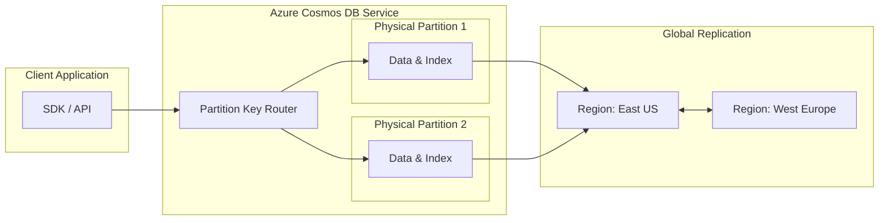

## Implementing NoSQL Solutions with Azure Cosmos DB

### Section at a Glance
**What you'll learn:**
- Understanding the multi-model nature of Azure Cosmos DB and its global distribution capabilities.
- Mastering Request Units (RUs) and how they drive both performance and cost.
- Designing effective Partition Keys to prevent "hot partitions" and ensure scalability.
- Implementing consistency models to balance latency against data accuracy.
- Configuring indexing policies and Change Feed for event-driven architectures.

**Key terms:** `Request Units (RUs)` · `Partition Key` · `Consistency Levels` · `Change Feed` · `Multi-region Writes` · `Throughput (Autoscale vs. Manual)`

**TL;DR:** Azure Cosmos DB is a globally distributed, multi-model database service designed for high-availability and low-latency applications, where performance is managed through a predictable, abstracted unit of throughput called Request Units.

---

### Overview
In the modern enterprise, the "one size fits all" approach to databases is a relic of the past. As businesses scale globally, they face the "Data Gravity" problem: if your application is in Singapore but your database is in East US, the latency makes the user experience unusable. Furthermore, the rigid schema requirements of relational databases often stifle the rapid iteration required by DevOps teams.

Azure Cosmos DB solves these challenges by providing a managed, "serverless-first" experience for NoSQL workloads. It allows developers to build applications that respond in milliseconds, regardless of scale, by decoupling storage from compute and automating the heavy lifting of sharding and replication.

For a Data Engineer, Cosmos DB isn't just a place to store JSON; it is the backbone of real-time, event-driven pipelines. Whether you are capturing IoT telemetry, managing user sessions for a global gaming platform, or feeding a real-time dashboard via the Change Feed, Cosmos DB provides the predictable performance required to ensure downstream analytics (like Azure Synapse or Databricks) receive high-quality, low-latency data.

---

### Core Concepts

#### 1. Request Units (RUs)
The fundamental currency of Cosmos DB is the **Request Unit (RU)**. Instead of managing CPU, RAM, or IOPS, you manage RUs. One RU is roughly the cost of a 1 KB read of a single document. 

> 📌 **Must Know:** Throughput can be provisioned at the **Database level** (shared across all containers) or the **Container level** (dedicated to one container). Choosing the wrong level can lead to "noisy neighbor" issues where one heavy container starver the others.

#### 2. Partitioning and the Partition Key
Scalability in Cosmos DB is achieved through horizontal partitioning. The **Partition Key (PK)** is the most critical design decision you will make. Cosmos DB uses the PK to distribute data across physical partitions.
*   **Good PK:** High cardinality (many unique values, e.g., `UserId`, `DeviceId`).
*   **Bad PK:** Low cardinality (few unique values, e.g., `Gender`, `Country`), which leads to "Hot Partitions."

> ⚠️ **Warning:** A "Hot Partition" occurs when a disproportionate amount of traffic hits a single partition key. This causes `429 Too Many Requests` errors, even if your total database throughput is under-utilized.

#### 3. Consistency Models
Unlike the traditional ACID (Strong) or BASE (Eventual) dichotomy, Cosmos DB offers five well-defined consistency levels. This allows you to trade off between **Latency/Availability** and **Data Freshness**.
*   **Strong:** Linearizability; reads are guaranteed to return the most recent version. (Highest latency).
*   **Bounded Staleness:** Reads may lag behind writes by a specific time window or number of versions.
*   **Session (Default):** Provides "read-your-own-writes" within a single client session. This is the most popular for web apps.
*   **Consistent Prefix:** Ensures reads never see out-of-order writes.
*   **Eventual:** No ordering guarantee; lowest latency.

#### 4. The Change Feed
The Change Feed is a persistent record of changes to a container. It acts as a transaction log, allowing you to trigger Azure Functions or move data to Azure Data Lake.

> 💡 **Tip:** Think of the Change Feed as the "glue" for your architecture. Use it to transform data in real/near-real-time as it arrives in your NoSQL store.

---

### Architecture / How It Works



1.  **Client Application:** Uses the Cosmos DB SDK (SQL, MongoDB, Cassandra, etc.) to send requests.
2.  **Partition Key Router:** The service layer that examines the PK in the request to determine which physical partition holds the data.
3.  **Physical Partition:** The underlying storage unit where data is sharded and indexed.
4.  **Global Replication:** The mechanism that asynchronously (or synchronously, depending on consistency) pushes updates to secondary regions.

---

### Comparison: When to Use What

| Option | Best For | Trade-offs | Approx. Cost Signal |
| :--- | :--- | :--- | :--- |
| **Provisioned Throughput (Manual)** | Predictable, steady-state workloads. | Hard to scale instantly; requires manual intervention for spikes. | Most cost-effective for stable traffic. |
| **Provisioned Throughput (Autoscale)** | Highly variable workloads (e.g., e-commerce). | Higher "per-unit" cost; scales within a defined range. | Expensive if the "floor" is set too high. |
 	| **Serverless** | Small, infrequent, or "bursty" workloads. | Pay-per-request; no base cost. | **Zero** cost when idle, but subject to RU limits. |

**How to choose:** Start with **Serverless** for development or small apps. Move to **Autoscale** for production applications with unpredictable traffic. Only use **Manual Provisioned** for mature, predictable enterprise workloads where you can accurately forecast usage.

---

### Cost Cheat Sheet

| Scenario | Recommended Option | Key Cost Driver | Watch Out For |
| :--- | :--- | :--- | :--- |
| **Dev/Test Environment** | Serverless | Number of Requests | High volume of small writes can exceed throughput limits. |
| **High-Traffic Web App** | Autoscale | Max RU/s setting | Setting the max RU too high will spike costs during bursts. |
| **Large-Scale Analytics** | Manual Provisioned | Total RUs provisioned | Paying for unused capacity during low-traffic hours. |
| **Global Multi-Region** | Multi-region Writes | Number of Regions | Each additional region effectively doubles/triples your cost. |

> 💰 **Cost Note:** The single biggest cost driver in Cosmos DB is **unoptimized indexing**. By default, Cosmos DB indexes *every* property in your JSON. If you have large documents with many fields you never query, you are paying RUs for every write just to update indexes you don't use.

---

### Service & Integrations

1.  **Azure Functions + Change Feed:**
    *   Trigger a function whenever a new document is inserted.
    *   Use case: Real-time data enrichment or sending notifications.
2.  **Azure Data Factory (ADF):**
    *   Copy data from Cosmos DB (SQL API) to Azure Data Lake Storage (ADLS Gen2).
    *   Use case: Building a Medallion architecture (Bronze/Silver/Gold) for analytics.
3.  **Azure Stream Analytics:**
    *   Ingest streaming data from IoT Hub directly into Cosmos DB.
    *   Use case: Real-time operational dashboards.

---

### Security Considerations

| Control | Default State | How to Enable / Strengthen |
| :--- | :--- | :--- |
| **Authentication** | Primary/Secondary Keys | Use **Azure AD (RBAC)** for fine-grained, identity-based access. |
| **Encryption at Rest** | Enabled (Service Managed) | Use **Customer-Managed Keys (CMK)** via Azure Key Vault for higher compliance. |
| **Network Isolation** | Public Endpoint enabled | Use **Virtual Network (VNet) Service Endpoints** or **Private Links**. |
| **Data in Transit** | TLS 1.2 enabled | Enforce minimum TLS versions via policy. |

---

### Performance & Cost

Tuning Cosmos DB is a balancing act between **latency** and **throughput**. 

**Example Scenario:**
You have a retail application processing 1,000 orders per hour.
*   **Option A (Manual):** Provisioning 400 RU/s fixed. Cost is roughly \$24/month.
*   **Option B (Autoscale):** Setting range 400–4,000 RU/s. Cost scales with traffic.
*   **The Bottleneck:** If a marketing campaign hits, and you are on Option A, your users will see `429` errors. If you are on Option B, your cost might jump to \$100+ for that month, but the business stays online.

**Optimization Strategy:**
1.  **Minimize Document Size:** RUs are consumed based on payload size.
2.  **Optimize Indexing:** Exclude large strings or unnecessary properties from the index.
3.  **Use Point Reads:** A `ReadItem` by ID and Partition Key is significantly cheaper than a `Query` using a `WHERE` clause.

---

### Hands-On: Key Operations

**Step 1: Create a Container via Azure CLI**
This command creates a new container with a specific partition key.
```bash
az cosmosdb sql container create \
    --account-name my-cosmos-db \
    --resource-group my-rg \
    --database-name my-db \
    --name my-container \
    --partition-key-path "/userId" \
    --throughput 400
```
> 💡 **Tip:** Always define your partition key at creation; changing it later requires a complete data migration.

**Step 2: Upsert a document using Python SDK**
This script demonstrates how to insert or update a JSON document.
```python
from azure.cosmos import CosmosClient

# Initialize client
client = CosmosClient(endpoint, key)
database = client.get_database_container("my-db", "my-container")

# The document to insert
new_item = { "id": "123", "userId": "user_A", "data": "sample" }

# Upsert operation
database.upsert_item(new_item)
```

---

### Customer Conversation Angles

**Q: "We are moving from SQL Server. Can we just use the same schema and queries?"**
**A:** While you can use the SQL API, you shouldn't just "lift and shift" your schema; you need to redesign your data model around partition keys to ensure horizontal scalability.

**Q: "How do I know if I'm overpaying for throughput?"**
**A:** Monitor the `Provisioned Throughput` vs. `Consumed Throughput` metrics in Azure Monitor; if your usage is consistently below 20% of your provisioned RUs, we should look at Autoscale or reducing the floor.

**Q: "Will our global users experience lag?"**
**A:** No, by enabling multi-region replication, we can place data in regions physically close to your users, reducing latency to single-digit milliseconds.

**Q: "Is my data safe from hackers accessing the database directly?"**
**A:** We can implement Azure Private Link, which ensures the database is not even visible on the public internet and is only accessible from your specific virtual network.

**Q: "What happens if we have a massive spike in traffic, like Black Friday?"**
**A:** If we use the Autoscale tier, Cosmos DB will instantly scale your throughput up to your defined maximum to handle the burst and scale back down when the rush ends.

---

### Common FAQs and Misconceptions

**Q: Is Cosmos DB a replacement for Azure SQL Database?**
**A:** Not necessarily. Cosmos DB is for unstructured/semi-structured data and massive scale; Azure SQL is better for complex relational joins and strict ACID-heavy transactional integrity.

**Q: Does 'Eventual Consistency' mean my data might be lost?**
**A:** No, it only means a read might return an older version of the data for a brief window. The data is still durably stored and will eventually be consistent across all replicas.

⚠️ **Q: Can I change my Partition Key after the database is live?**
**A:** No. This is a common mistake. Once a container is created, the PK is immutable. To change it, you must create a new container and migrate the data.

**Q: Does every write cost the same amount of RUs?**
**A:** No. Larger documents and documents with more indexed properties cost more RUs to write.

**Q: Is the Change Feed available for all API types?**
**A:** No, it is a core feature of the NoSQL (SQL) API. Other APIs like MongoDB have different mechanisms for change tracking.

---

### Exam & Certification Focus (DP-203)

*   **Design Partition Keys (Domain: Design and implement data storage):** Expect questions on identifying high-cardinality keys to avoid hot partitions. 📌 **High Frequency.**
*   **Select Consistency Levels (Domain: Implement and manage data processing):** You will likely be given a scenario (e.g., "a global retail app needs low latency but can tolerate slight lag") and asked to pick the correct level. 📌 **High Frequency.**
*   **Implement Change Feed (Domain: Implement and manage data processing):** Understanding how to use Change Feed to trigger downstream logic is critical.
*   **Configure Throughput (Domain: Design and implement data storage):** Distinguishing between Manual, Autoscale, and Serverless.

---

### Quick Recap
- **Partition Keys** are the foundation of scalability; choose them based on cardinality.
- **Request Units (RUs)** represent the abstracted cost of all database operations.
- **Consistency** is a spectrum; choose the level that balances latency against data freshness.
- **Autoscale** is the best middle ground for unpredictable production workloads.
- **The Change Feed** enables powerful, event-driven data architectures.

---

### Further Reading
**Azure Cosmos DB Documentation** — The definitive guide for all API-specific features and configurations.
**Azure Cosmos DB Consistency Levels Whitepaper** — Deep dive into the mathematical and logical implications of each level.
**Cosmos DB Partitioning Best Practices** — Essential reading for avoiding the dreaded "Hot Partition" scenario.
**Azure Architecture Center: NoSQL Patterns** — Reference architectures for building global-scale applications.
**Azure Monitor for Cosmos DB** — How to track RUs, throttled requests, and latency metrics.