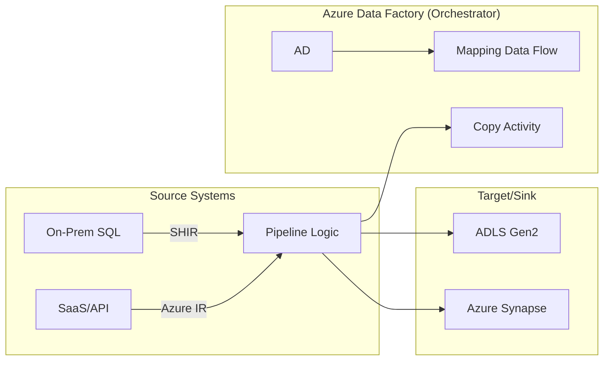

## Data Integration and Orchestration with Azure Data Factory

### Section at a Glance
**What you'll learn:**
- Architecting end-to-end ETL/ELT pipelines using Azure Data Factory (ADF).
- Distinguishing between Control Flow and Data Flow activities.
- Implementing scalable data movement using Copy Activities and Self-Hosted Integration Runtimes.
- Orchestrating complex workflows with dependencies, loops, and conditional logic.
- Securing data movement with Managed Virtual Networks and Key Vault integration.

**Key terms:** `Pipeline` · `Dataset` · `Linked Service` · `Integration Runtime (IR)` · `Copy Activity` · `Mapping Data Flow`

**TL;D;R:** Azure Data Factory is the cloud-native orchestration engine used to automate the movement and transformation of data from disparate sources to a centralized warehouse or lake, acting as the "glue" of the modern data estate.

---

### Overview
In the modern enterprise, data is rarely found in one place. It is scattered across on-premises SQL servers, SaaS applications like Salesforce, and cloud storage like Azure Data Lake Storage (ADLS) Gen2. For a business, the primary pain point is "data latency"—the delay between an event occurring in a source system and that data being available for decision-making in a dashboard. Without automated orchestration, data engineers spend 80% of their time building manual, fragile scripts to move files, leading to "data silos" and inconsistent reporting.

Azure Data Factory (ADF) solves this by providing a serverless, managed orchestration service. It allows you to build complex "pipelines" that move data (Data Integration) and then trigger transformations (Orchestration). Unlike traditional ETL tools that require managing servers, ADF scales elastically. It shifts the focus from *how* to move the bytes to *what* the business logic should be.

Within the context of the DP-203 exam and a real-world Data Engineer's role, ADF is the "orchestrator" of the ecosystem. While Azure Databricks or Synapse Spark pools perform the heavy computational lifting (the "transformation"), ADF is the brain that decides *when* those computations start, *what* happens if they fail, and *where* the results are moved next.

---

### Core Concepts

To master ADF, you must understand the hierarchy of its components. It is a layered abstraction model.

#### 1. The Connection Layer: Linked Services & Datasets
*   **Linked Service:** Think of this as your **connection string**. It defines the information needed to connect to an external resource (e.g., a server name, a database name, and credentials). 
    > ⚠️ **Warning:** Never hardcode credentials in a Linked Service. Always reference Azure Key Vault to retrieve secrets dynamically.
*   **Dataset:** This represents the **structure of the data** within the Linked Service. If the Linked Service is the "connection to the Excel file," the Dataset is the "specific sheet and range" within that file.

#### 2. The Execution Layer: Integration Runtime (IR)
The IR is the "compute engine" that actually performs the work. It is the most critical component for connectivity.
*   **Azure IR:** The default, serverless compute used for moving data between cloud data stores.
*   **Self-Hosted IR (SHIR):** Required when you need to reach into an **on-premises network** (e.g., a local SQL Server behind a firewall).
*   **Azure-SSIS IR:** Specifically used to lift-and-shift existing SQL Server Integration Services packages to the cloud without rewriting them.

#### 3. The Logic Layer: Activities and Pipelines
*   **Activities:** The individual steps in a process. 
    *   **Copy Activity:** Moves data from source to sink.
    *   **Lookup Activity:** Retrieves a value (like a configuration setting) from a dataset.
    *   **ForEach Activity:** Iterates through a collection (e.g., looping through a list of table names).
*   **Pipelines:** A logical grouping of activities that together perform a task.
    > 📌 **Must Know:** A Pipeline is not just a sequence; it is a unit of deployment and monitoring. You monitor execution at the pipeline level.

####  4. The Transformation Layer: Mapping Data Flows
While the Copy Activity is for "data movement" (low compute), **Mapping Data Flows** are for "data transformation" (high compute). They allow you to design visually-driven, code-free transformations that execute on underlying Apache Spark clusters.
> 💡 **Tip:** Use Copy Activity for simple ingestion (Bronze layer) and Mapping Data Flows or Databricks for complex business logic (Silver/Gold layers) to optimize costs.

---

### Architecture / How It Works



1.  **Source Systems:** The origin of your raw data, ranging from legacy on-prem databases to modern cloud APIs.
2.  **Self-Hosted IR (SHIR):** An agent installed on a local machine that acts as a bridge, securely tunneling data from the private network to the cloud.
3.  **Azure IR:** The managed compute resource that handles cloud-to-cloud data movement and triggers Spark clusters.
4.  **Pipeline Logic:** The sequence of activities, including error handling, loops, and conditional branching (If/Else).
5.  **Copy Activity:** The engine that pulls data from source and pushes it to a sink.
6.  **Mapping Data Flow:** The Spark-based engine that performs joins, aggregates, and pivots on the data.
7.  **Sink/Target:** The final destination (Data Lake, Warehouse, or SQL DB) where the processed data resides.

---

### Comparison: When to Use What

| Option | Best For | Trade-offs | Approx. Cost Signal |
| :--- | :--- | :--- | :--- |
| **Copy Activity** | Simple movement (ELT) | No complex transformations | Low (based on DIU usage) |
    | **Mapping Data Flow** | Complex, code-free ETL | Higher startup latency (Spark spin-up) | Medium/High (cluster-based) |
    | **Azure Databricks/Synapse Spark** | Extreme scale, heavy Python/Scala logic | Requires coding expertise | High (managed compute cost) |
    | **Self-Hosted IR** | On-premises connectivity | Requires manual VM management/patching | Low (cost of the VM) |

**How to choose:** Start with the **Copy Activity** for all ingestion tasks. Only move to **Mapping Data Flows** if you need visual transformations, and move to **Databricks/Spark** if your transformation logic is too complex for visual tools or requires advanced Machine Learning libraries.

---

### Cost Cheat Sheet

| Scenario | Recommended Option | Key Cost Driver | Watch Out For |
| :--- | :--- | :--- | :--- |
| **Ingesting 100+ Tables** | Copy Activity + ForEach | Data Integration Units (DIU) per hour | Over-provisioning DIUs for small files |
| **Daily Aggregations** | Mapping Data Flow | Cluster uptime and vCore count | "Cluster warm-up" time and idle time |
| **On-Prem to Cloud** | Self-Hosted IR | Data egress/ingress and VM size | Not monitoring the SHIR machine's CPU/RAM |
    | **Scheduled Cleanup** | Azure Functions/Logic Apps | Execution count | Using ADF for simple "if-this-then-that" logic |

> 💰 **Cost Note:** The single biggest cost mistake in ADF is leaving **Mapping Data Flow clusters running** or over-configuring "Time to Live" (TTL). If your pipeline runs for 5 minutes but your cluster stays warm for 30 minutes to "save start-up time," you are paying for 25 minutes of idle compute.

---

### Service & Tool Integrations

1.  **Azure Key Vault:**
    *   Used to store secrets (passwords, connection strings).
    *   ADF retrieves these at runtime to authenticate Linked Services.
2.  **Azure Data Lake Storage (ADLS) Gen2:**
    *   Acts as the primary "Sink" for raw data.
    *   Often used as a "staging" area for PolyBase/Copy Command in Synapse.
3.    **Azure Monitor & Log Analytics:**
    *   Used to capture pipeline execution logs.
    *   Essential for setting up alerts (e.g., "Email me if the Daily Sales pipeline fails").
4.  **Azure DevOps / Git:**
    *   ADF integrates with Git (Azure Repos) to allow for CI/CD.
    *   Enables version control, pull requests, and automated deployment of pipelines across environments (Dev $\rightarrow$ Test $\rightarrow$ Prod).

---

### Security Considerations

Security in ADF is multi-layered, focusing on protecting the credentials and the data path.

| Control | Default State | How to Enable / Strengthen |
| :--- | :--- | :--- |
| **Authentication** | Managed Identity (MSI) | Use **System-Assigned Managed Identity** for service-to-service auth (no passwords). |
| **Credential Storage** | Stored in ADF (Bad Practice) | Use **Azure Key Vault** references in Linked Services. |
| **Network Isolation** | Public Endpoint | Use **Managed Virtual Network (Managed VNet)** to ensure data never traverses the public internet. |
| **Data Encryption** | Encrypted in Transit (TLS) | Ensure all sources/sinks support TLS 1.2+; use **Always Encrypted** for SQL sources. |
| **Audit Logging** | Basic Pipeline Logs | Route all `ADFActivityRun` logs to a **Log Analytics Workspace**. |

---

### Performance & Cost

**Tuning Guidance:**
*   **Parallelism:** Use the `parallelCopies` property in the Copy Activity to increase throughput.
*   **DIU Scaling:** For large data volumes, increase **Data Integration Units (DIU)**. Think of DIUs as the "horsepower" of your copy operation.
*   **Partitioning:** When reading from a database, use partition discovery to allow the IR to read multiple chunks of data simultaneously.

**Example Cost Scenario:**
Imagine you are moving 1TB of data from an on-prem SQL Server to ADLS Gen2.
*   **Scenario A (Low DIU):** Using 4 DIUs, the job takes 10 hours. Total cost is primarily the SHIR VM and the 10-hour window of Azure DIU usage.
*   **Scenario B (High DIU):** Using 32 DIUs, the job takes 1.5 hours. While the *hourly* rate of DIUs is higher, the *total* duration is significantly lower. 
*   **The Goal:** Find the "sweet spot" where the cost of the increased DIU rate is offset by the reduction in total execution time.

---

### Hands-On: Key Operations

**1. Creating a Pipeline with a Lookup and Copy Activity (JSON snippet)**
This snippet demonstrates a pattern where we look up a list of files and then copy them.

```json
{
    "name": "IngestFilesFromBlob",
    "properties": {
        "activities": [
            {
                "name": "GetFileList",
                "type": "Lookup",
                "typeProperties": {
                    "source": { "type": "BlobDl" },
                    "dataset": { "referenceName": "FileListDataset", "type": "DatasetReference" }
                }
            },
            {
                "name": "ForEachFile",
                "type": "ForEach",
                "dependsOn": [ { "activity": "GetFileList", "dependencyConditions": ["Succeeded"] } ],
                "typeProperties": {
                    "items": { "value": "@activity('GetFileList').output.value", "type": "Expression" },
                    "activities": [
                        {
                            "name": "CopySingleFile",
                            "type": "Copy",
                            "typeProperties": { "inputs": [...], "outputs": [...] }
                        }
                    ]
                }
            }
        ]
    }
}
```
> 💡 **Tip:** The `Lookup` activity has a limit of 5,000 rows. If you are iterating over a massive list of files, use a `Get Metadata` activity instead.

---

### Customer Conversation Angles

**Q: We have a massive amount of data in our local data center. Can ADF reach it without us opening a hole in our firewall?**
**A:** Yes, we can deploy a Self-Hosted Integration Runtime on a machine within your local network. It initiates an outbound connection to Azure, meaning you don't need to open any inbound ports on your firewall.

**Q: Is ADF a replacement for our existing SSIS packages?**
**A:** Not necessarily. ADF can actually host your existing SSIS packages via an Azure-SSIS Integration Runtime, allowing you to move to the cloud without rewriting your entire ETL logic.

**Q: How much does it cost? Is it a flat monthly fee?**
**A:** It is purely consumption-based. You only pay for the activity runs, the data movement (DIUs), and the compute time for Data Flows. If no pipelines run, you aren't paying for compute.

**Q: We use Databricks for our heavy transformations. Does ADF replace Databricks?**
**A:** No, they are complementary. ADF acts as the orchestrator that triggers your Databricks notebooks, manages the dependencies, and handles the movement of data before and after the transformation.

**Q: Can I use ADF to create real-time dashboards?**
**A:** ADF is a batch-oriented orchestration tool. While it can run very frequently (e.g., every minute), for true sub-second real-time streaming, you should look at Azure Stream Analytics or Azure Event Hubs.

---

### Common FAQs and Misconceptions

**Q: Can I use ADF to run SQL queries?**
**A:** Yes, using the `Lookup` or `Script` activity, but remember: ADF is an *orchestrator*, not a *database*. Don't use it to perform heavy computations that should be happening inside your SQL engine.

**Q: Does ADF store my data?**
**A:** No. ADF is a compute and orchestration engine. Data passes *through* the Integration Runtime, but it is not persisted in the ADF service itself.
> ⚠️ **Warning:** Never assume data is "safe" just because it's in a pipeline. Always ensure your Sink (destination) has appropriate redundancy and backup enabled.

**Q: Is Mapping Data Flow the same as a Spark job?**
**A:** It is a Spark job, but you don't write Spark code. It translates your visual transformations into Scala/Python code that runs on a managed Spark cluster.

**Q: Can I run pipelines on a schedule?**
**A:** Yes, using "Triggers." You can use Schedule triggers, Tumbling Window triggers (for dependency tracking), or Storage Event triggers (when a file arrives).

**Q: What happens if a pipeline fails halfway through?**
**A:** ADF allows you to define "Failure" paths. You can configure a specific activity to run *only* if a previous one fails, which is perfect for sending error alerts via Logic Apps.

**Q: Does ADF support Docker containers?**
**A:** Not directly. ADF orchestrates services. If you have a containerized workload, you would use ADF to trigger an **Azure Container Instance** or **Azure Kubernetes Service (AKS)** job.

---

### Exam & Certification Focus (DP-203)

*   **Data Movement (Domain 1: Design and implement data integration):** Focus on choosing between Copy Activity and Mapping Data Flow. 📌 **High Frequency:** Knowing when to use Self-Hosted IR vs. Azure IR.
*   **Control Flow (Domain 1):** Understand how `ForEach`, `Until`, `If Condition`, and `Wait` activities function. 📌 **High Frequency:** Understanding the dependency between activities (Success, Failure, Completion).
*   **Security (Domain 2: Implement and manage data security):** Focus on Managed Identity and Azure Key Vault integration.
*   **Monitoring (Domain 3: Plan and implement data storage):** Focus on using Log Analytics to monitor pipeline failures and performance.

---

### Quick Recap
- **ADF is the Orchestrator:** It connects, moves, and triggers.
- **Linked Services = Connections; Datasets = Structures.**
- **Integration Runtime (IR) is the compute engine:** Use SHIR for on-prem.
- **Cost follows usage:** Pay for DIUs and Spark cluster uptime.
- **Security is paramount:** Always use Managed Identities and Key Vault.

---

### Further Reading
**Microsoft Learn** — Comprehensive documentation on all ADF activities and features.
**Azure Architecture Center** — Reference architectures for modern data warehouses using ADF.
**Azure Data Factory Documentation** — Deep dive into Integration Runtime configuration and setup.
**Azure Monitor Documentation** — Best practices for logging and alerting on data pipelines.
**Azure Data Lake Storage Gen2 Docs** — Understanding the primary sink for most ADF pipelines.