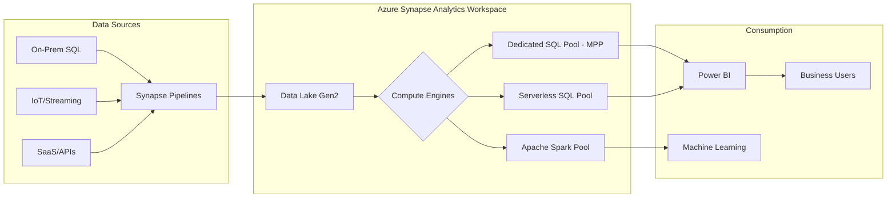

## Large-Scale Data Processing with Azure Synapse Analytics

### Section at a Glance
**What you'll learn:**
- Differentiating between Dedicated SQL Pools, Serverless SQL Pools, and Apache Spark pools.
- Implementing Massively Parallel Processing (MPP) architectures for high-performance queries.
- Optimizing data distribution strategies (Hash, Round Robin, Replicated) to prevent data skew.
- Executing high-speed data ingestion using the `COPY` statement and PolyBase.
- Architecting a unified analytics workspace using Synapse Pipelines and Link.

**Key terms:** `MPP (Massively Parallel Processing)` · `Data Warehouse Units (DWU)` · `Distribution Strategy` · `Data Skew` · `Serverless SQL` · `PolyBase`

**TL;DR:** Azure Synapse Analytics is a unified analytics service that combines big data and data warehousing. It allows you to ingest, prepare, manage, and serve data using SQL, Spark, and Data Integration within a single, scalable environment.

---

### Overview
In the modern enterprise, the "data bottleneck" is a common business killer. Organizations often find themselves trapped between two extremes: a traditional Data Warehouse that is too rigid and expensive to scale, and a Data Lake that is too unstructured and difficult to query for business intelligence. This friction leads to high latency in decision-making and increased operational costs.

Azure Synapse Analytics was engineered to bridge this gap. It provides a single "pane of glass" for both structured and unstructured data. For a Data Engineer, this means you no longer need to manage separate orchestration engines, separate compute clusters, and separate security models for your SQL and Spark workloads.

From a business perspective, Synapse addresses the need for **converged analytics**. It allows a company to run high-performance, predictable reporting (via Dedicated SQL Pools) alongside exploratory, ad-hoc data science workloads (via Spark and Serverless SQL) on the same underlying data stored in Azure Data Lake Storage (ADLS) Gen2. This unification reduces the Total Cost of Ownership (TCO) by streamlining the data pipeline and reducing data movement.

---

### Core Concepts

#### 1. The Three Compute Engines
To master Synapse, you must understand which engine to use for which workload.
*   **Dedicated SQL Pools:** These are the heart of the "Data Warehouse" experience. They use an **MPP (Massively Parallel Processing)** architecture. You provision specific capacity, measured in **DWUs (Data Warehouse Units)**. 
    *   📌 **Must Know:** Dedicated pools are designed for high-performance, predictable, and complex analytical queries on large, structured datasets.
*   **Serverless SQL Pools:** This is "pay-per-query" compute. There is no infrastructure to manage. You use T-SQL to query files directly in your Data Lake (Parquet, CSV, JSON).
    *   💡 **Tip:** Use Serverless SQL for data discovery, transforming "bronze" data to "silver" data, and creating views over the Data Lake without moving data into a database.
*   **Apache Spark Pools:** Managed Spark clusters for big data processing. Ideal for machine learning, Python/Scala workloads, and complex ETL transformations that are difficult to express in SQL.

#### able 2. MPP Architecture and Data Distribution
In a Dedicated SQL Pool, a **Control Node** receives queries, and **Compute Nodes** execute them. The efficiency of this execution depends entirely on how data is distributed across the compute nodes.
*   **Round Robin:** Data is distributed evenly across all distributions. 
    *   ⚠️ **Warning:** While great for staging tables, Round Robin can cause significant "data shuffling" during joins, which destroys query performance.
*   **Hash Distribution:** A single column (the distribution key) is used to hash rows into specific distributions. 
    *   📌 **Must Know:** Choose a column with high cardinality (many unique values) to ensure even distribution.
    *   ⚠️ **Warning:** If you choose a column with low cardinality (e.g., `Gender`), you will create **Data Skew**, where one compute node does all the work while others sit idle.
*   **Replicated Distribution:** A full copy of the table is placed on every compute node.
    *   💡 **Tip:** Use this for small dimension tables (e.g., `DateDimension` or `StoreLocation`) to eliminate the need for data movement during joins with large fact tables.

#### 3. Data Ingestion: The `COPY` Statement
The `COPY` statement is the modern, preferred method for loading data into Synapse Dedicated SQL Pools. It is faster and simpler than the older PolyBase method.
*   It supports high-performance loading from Azure Blob Storage or ADLS Gen/2.
*   It handles complex file formats and schema inference more gracefully than manual `INSERT` statements.

---

### Architecture / How It Works



1.  **Synapse Pipelines:** The orchestration engine (derived from Azure Data Factory) that moves and transforms data.
2.  **Data Lake Gen2 (ADLS):** The centralized, highly scalable storage layer acting as the single source of truth.
3.  **Compute Engines:** The specialized processing units (SQL/Spark) that execute logic on the data.
4.  **Consumption Layer:** The final presentation layer where users interact with insights via BI tools or ML models.

---

### Comparison: When to Use What

| Option | Best For | Trade-offs | Approx. Cost Signal |
| :--- | :--- | :--- | :--- |
| **Dedicated SQL Pool** | Enterprise Data Warehousing; predictable, high-concurrency reporting. | Requires manual scaling/resizing; costs incurred even when idle. | High (DWU-based) |
| **Serverless SQL Pool** | Ad-hoc discovery; querying files in the Data Lake; lightweight ETL. | Performance is not guaranteed for massive, complex joins. | Low (Pay-per-TB processed) |
| **Apache Spark Pool** | Data Science; unstructured data; complex Python/Scala transformations. | Requires managing cluster start-up times; complexity in tuning. | Medium (VCore/Node-based) |

**How to choose:** Start with **Serverless** for exploration and small-scale transformations. Move to **Dedicated** when you need a structured, high-performance "Gold" layer for company-wide reporting. Use **Spark** when your logic exceeds the capabilities of T-SQL.

---

  ### Cost Cheat Sheet

| Scenario | Recommended Option | Key Cost Driver | Watch Out For |
| :--- | :--- | :--- | :--- |
| **Daily Batch ETL** | Synapse Pipelines + Spark | Cluster uptime (Node count $\times$ duration) | Leaving clusters running after job completion. |
| **Ad-hoc Data Discovery** | Serverless SQL Pool | Data Volume Scanned (GB/TB processed) | "Select *" on massive, unpartitioned Parquet files. |
  | **24/7 Dashboarding** | Dedicated SQL Pool | DWU (Data Warehouse Units) | Forgetting to pause the pool during non-business hours. |
  | **Large Scale Ingestion** | `COPY` Statement | Data Transfer/Storage | Inefficient file sizes (too many tiny files increase overhead). |

💰 **Cost Note:** The single biggest cost mistake in Synapse is leaving a **Dedicated SQL Pool** running at a high DWU level during periods of no activity. Always automate the `PAUSE` and `RESUME` operations via Azure Functions or Pipelines.

---

### Service & Tool Integrations

1.  **Azure Data Lake Storage (ADLS) Gen2:** The fundamental storage foundation. Synapse "links" to ADLS to provide the data lake capabilities.
2.  **Azure Key Vault:** Critical for securing connection strings, service principal keys, and credentials used in Synapse Pipelines.
3.  **Azure Monitor / Log Analytics:** Used to track query performance, monitor pipeline failures, and audit workspace activity.
4.  **Microsoft Entra ID (formerly Azure AD):** The primary mechanism for managing identity, authentication, and fine-grained access control across all Synapse engines.

---

### Security Considerations

Security in Synapse must be applied in layers: at the Workspace level, the Pool level, and the Data level.

| Control | Default State | How to Enable / Strengthen |
| :--- | :--- | :--- |
| **Network Isolation** | Public Endpoint enabled | Use **Managed Virtual Networks** and **Private Endpoints** to ensure traffic never hits the public internet. |
| **Authentication** | Microsoft Entra ID | Always use **Managed Identities** for service-to-service auth; avoid hardcoded SQL passwords. |
| **Data Encryption** | Encryption at Rest (Service Managed) | For highly sensitive data, implement **Customer-Managed Keys (CMK)** via Azure Key Vault. |
| **Fine-Grained Access** | Workspace-level RBAC | Implement **Row-Level Security (RLS)** and **Column-Level Security (CLS)** within the SQL pools. |

---

### Performance & Cost

**Tuning Guidance:**
To achieve optimal performance in a Dedicated SQL Pool, you must minimize **Data Movement**. This means:
1.  **Minimize Shuffling:** Ensure large tables are joined on their distribution keys.
2.  **Optimize File Formats:** Store data in **Parquet** or **ORC** in the Data Lake. These columnar formats allow the engine to skip unnecessary data.
3.  **Statistics:** Regularly update statistics on all distributed columns. The optimizer cannot make good decisions without them.

**Example Cost Scenario:**
A company processes 10TB of raw logs daily.
*   **Approach A (Inefficient):** Use a Dedicated SQL Pool (DW1000c) 24/7 to ingest and store everything.
    *   *Cost:* ~$15,000+/month (highly expensive due to constant DWU usage).
*   **Approach B (Optimized):** Use **Synapse Pipelines** to ingest to ADLS $\to$ **Serverless SQL** to clean/aggregate $\to$ **Dedicated SQL Pool** (DW100c) only for the final, summarized "Gold" dataset.
    *   *Cost:* ~$2,000/month (significant savings by utilizing Serverless for the "heavy lifting" and scaling down the Dedicated pool).

---

### Hands-On: Key Operations

**Step 1: Create a distributed table with a Hash strategy.**
This command creates a fact table distributed by `ProductID` to ensure efficient joins with the product dimension.
```sql
CREATE TABLE FactSales (
    SalesID INT NOT NULL,
    ProductID INT NOT NULL,
    SalesAmount DECIMAL(18,2)
)
WITH (
    DISTRIBUTION = HASH(ProductID),
    CLUSTERED COLUMNSTORE INDEX
);
```
💡 **Tip:** Always use `CLUSTERED COLUMNSTORE INDEX` for large fact tables; it provides massive compression and scan performance.

**Step arg 2: Using the `COPY` statement for high-speed ingestion.**
This command pulls data from an external Parquet file into your newly created table.
```sql
COPY INTO FactSales
FROM 'https://mystorageaccount.dfs.core.windows.net/container/sales_data.parquet'
WITH (
    FILE_TYPE = 'PARQUET',
    CREDENTIAL = (IDENTITY = 'Managed Identity')
);
```

---

### Customer Conversation Angles

**Q: We already have a SQL Server. Why should we move to Azure Synapse?**
**A:** While SQL Server is excellent for OLTP (transactional) workloads, Synapse is built for OLAP (analytical) workloads using MPP architecture, allowing you to query petabytes of data in seconds—something a single-node SQL Server cannot do.

**Q: Is it more expensive to run both Serverless and Dedicated pools?**
**A:** Not necessarily. By using Serverless for your heavy, unpredictable data exploration, you can keep your Dedicated pool small and inexpensive, only scaling it up when you need high-performance reporting.

**Q: How do we ensure our data scientists aren't seeing sensitive HR data?**
**A:** We implement a multi-layered security model using Microsoft Entra ID and Row-Level Security, ensuring that even though the data lives in the same workspace, users only see the rows and columns they are authorized to access.

**Q: Can we use Synapse to replace our existing ETL tools like SSIS?**
**A:** Yes. Synapse Pipelines offers the same orchestration capabilities as SSIS but with the advantage of being a cloud-native, serverless service that scales automatically with your data volume.

**Q: Does moving to Synapse require us to rewrite all our SQL queries?**
**A:** Most standard T-SQL will work seamlessly. The main effort will be in optimizing your table distributions and storage formats to take advantage of the MPP architecture.

---

### Common FAQs and Misconceptions

**Q: Can I use the `COPY` statement with any file type?**
**A:** It primarily supports CSV, Parquet, and Avro. ⚠️ **Warning:** Trying to use unsupported formats or incorrectly configured delimiters will cause the entire ingestion job to fail without a detailed error log in the first attempt.

**Q: Is a Serverless SQL Pool just a cheaper version of Dedicated SQL?**
**A:** No. They are different architectures. Serverless is for "schema-on-read" and ad-hoc queries; Dedicated is for "schema-on-write" and high-performance, structured warehousing.

**Q: If I use Hash Distribution, can I use any column as the key?**
**A:** You *can*, but you shouldn't. ⚠️ **Warning:** Selecting a column with low cardinality (like `Year`) will cause certain nodes to become "hot," creating a bottleneck that negates the benefits of MPP.

**Q: Does Synapse integrate with Power BI?**
**A:** Yes, it is the primary consumption engine for Power BI, providing extremely fast query responses via DirectQuery or Import modes.

**Q: Can I run Python code directly in a SQL query?**
**A:** Not in a SQL Pool, but you can use a Synapse Spark Pool to run PySpark code and then save the results as a table that the SQL Pool can query.

**Q: Is all data in Synapse encrypted?**
**A:** Yes, data is encrypted at rest and in transit by default.

---

### Exam & Certification Focus
*Mapping to DP-203 Domains*

*   **Design and implement data storage (Domain 1):** Understanding the difference between file formats (Parquet vs. CSV) and how they impact Serverless SQL performance. 📌 **Must Know:** Data distribution strategies.
*   **Implement data processing (Domain 2):** Mastering the `COPY` statement and the logic behind choosing between Spark and SQL pools.
*   **Implement data security (Domain 3):** Implementing Row-Level Security (RLS) and managing access via Managed Identities. 📌 **Must Know:** Network isolation via Private Endpoints.
*   **Monitor and optimize (Domain 4):** Identifying data skew and using statistics to optimize query performance.

---

### Quick Recap
- **Synapse is Unified:** It combines SQL, Spark, and Pipelines into one workspace.
- **Choose your Engine:** Dedicated for warehousing; Serverless for discovery; Spark for data science.
- **Optimize Distribution:** Avoid data skew by using high-cardinality Hash keys.
- **Scale Smartly:** Use Serverless for ETL/discovery to save costs; pause Dedicated pools when not in use.
- **Security is Layered:** Use Entra ID, Managed Identities, and Private Endpoints for a robust posture.

---

### Further Reading
**Microsoft Docs: Azure Synapse Analytics Overview** — A foundational deep dive into the service capabilities.
**Microsoft Docs: Dedicated SQL Pool Architecture** — Detailed technical breakdown of MPP and compute nodes.
**Microsoft Docs: Data Distribution in Synapse** — The definitive guide on Hash, Round Robin, and Replicated strategies.
**Azure Architecture Center: Modern Data Warehouse** — A reference architecture for building end-to-end pipelines.
**Microsoft Docs: Using the COPY statement** — Practical documentation on high-speed data ingestion.