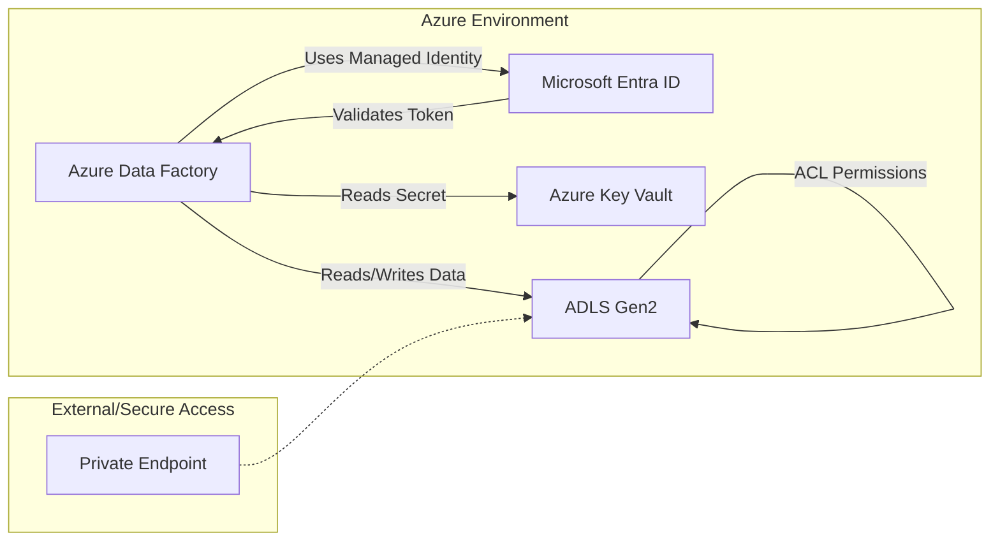

## Implementing Security, Identity, and Access Control

### Section at a Glance
**What you'll learn:**
- Implementing the principle of least privilege using Azure Role-Based Access Control (RBAC).
- Leveraging Microsoft Entra ID (formerly Azure AD) and Managed Identities to eliminate credential leakage.
- Configuring fine-grained access control for Data Lake Storage Gen2 using Access Control Lists (ACLs).
- Securing data in transit and at rest through encryption and private networking.
- Auditing and monitoring data access patterns for compliance and forensics.

**Key terms:** `Microsoft Entra ID` · `Managed Identity` · `RBAC` · `ACL` · `Private Link` · `Service Principal`

**TL;DR:** Modern data engineering requires moving away from static passwords toward "Zero Trust" architectures where identity is verified via Managed Identities, and access is restricted through a combination of Azure RBAC (for resources) and POSIX-style ACLs (for data).

---

### Overview
In the modern enterprise, data is the most valuable—and most vulnerable—asset. For a Data Engineer, security is not an "add-on" feature; it is a fundamental requirement of the data pipeline architecture. The primary business driver for the concepts in this section is **risk mitigation**. A single leaked connection string in a GitHub repository can lead to a catastrophic data breach, resulting in regulatory fines (GDPR/CCPA), loss of customer trust, and massive recovery costs.

This section addresses the "Credential Management Nightmare"—the operational burden and security risk of rotating passwords and managing secret keys across hundreds of pipelines. We will move from the traditional model of "Shared Keys" to an identity-centric model. By implementing robust identity and access controls, you ensure that even if a component of your architecture is compromised, the blast radius is strictly limited. This content fits into the broader DP-203 curriculum as the "Protective Layer" that wraps around your ingestion, transformation, and serving layers.

---

### Core Concepts

#### 1. Identity and Authentication (AuthN)
Authentication is the process of verifying *who* a user or service is. In Azure, this is centralized in **Microsoft Entra ID**.
- **Managed Identities (MI):** The gold standard for data engineers. It allows an Azure resource (like Azure Data Factory or Synapse) to authenticate to another resource (like Key Vault or SQL) without any developer ever seeing a password.
    - **System-assigned:** Tied directly to the lifecycle of the resource. If you delete the Data Factory, the identity vanishes.
 ⚠️ **Warning:** Avoid using Service Principals with client secrets for internal Azure-to-Azure communication. Managing the rotation of these secrets is a massive operational overhead and a primary cause of pipeline failures when certificates expire.
- **Service Principals:** An identity created for use by applications. 📌 **Must Know:** While similar to Managed Identities, Service Principals require you to manage credentials (secrets or certificates) manually.

#### 2. Authorization (AuthZ)
Authorization is the process of verifying *what* an identity is allowed to do.
- **Azure RBAC (Control Plane):** Manages access to the Azure Resource Manager (ARM). It answers: "Can this user delete the Data Lake account?" It does **not** necessarily answer: "Can this user read a specific CSV file inside a container."
- **Data Plane Access (ACLs):** For Azure Data Lake Storage (ADLS) Gen2, you use Access Control Lists. These are fine-grained permissions applied at the folder and file level, similar to Linux/POSIX permissions. 📌 **Must Know:** A common exam trap is assuming that having the `Storage Blob Data Contributor` RBAC role is the only thing needed. For complex folder hierarchies, you must understand how ACLs override or complement RBAC.

#### 3. Network Security
Securing the "pipes" through which data flows.
- **Public Endpoints:** Accessible via the internet (restricted by firewalls).
- **Private Link / Private Endpoints:** Brings your Azure services (like SQL or Storage) into your private Virtual Network (VNet). This ensures data never traverses the public internet. 💰 **Cost Note:** Private Endpoints incur an hourly charge plus a data processing fee; do not over-provision them for non-sensitive dev/test workloads.

---

### Architecture / How It Works

The following diagram illustrates a secure, identity-centric data ingestion pattern.



1. **Azure Data Factory (ADF):** Acts as the compute engine, utilizing its System-Assigned Managed Identity to request tokens.
2. **Microsoft Entra ID:** The central authority that validates the ADF identity and issues an OAuth2 token.
3. **Azure Key Vault:** Stores sensitive configuration (like connection strings for non-Azure sources) which ADF retrieves using its identity.
4. **ADLS Gen2:** The target storage, which checks both the RBAC role and the specific File-level ACLs before permitting the write operation.
5. **Private Endpoint:** Ensures the communication between ADF and ADLS stays within the private Azure backbone, bypassing the public internet.

---

### Comparison: When to Use What

| Option | Best For | Trade-offs | Approx. Cost Signal |
| :--- | :--- | :--- | :--- |
| **Managed Identity** | Azure-to-Azure communication (e.g., ADF to ADLS). | No manual secret management; highly secure. | Low (included in service). |
| **Service Principal** | Third-party apps or cross-tenant access. | Requires manual secret/cert rotation. | Low. |
| **SQL Authentication** | Legacy applications or non-Azure clients. | High risk of credential leakage; harder to audit. | Low. |
| **Azure RBAC** | Managing infrastructure (e.g., creating/deleting resources). | Coarse-grained; cannot control specific files. | Included in Azure. |
| **ADLS Gen2 ACLs** | Fine-grained data access (folder/file level). | High management complexity in large hierarchies. | Included in Storage. |

**How to choose:** Always start with **Managed Identity** for any service running within Azure. Only move to Service Principals if you are integrating with an external ecosystem. Use RBAC for resource management and ACLs strictly for data-level security.

---

### Cost Cheat Sheet

| Scenario | Recommended Option | Key Cost Driver | Watch Out For |
| :--- | :--- | :--- | :--- |
| **Cross-Service Auth** | Managed Identity | None | Not available for all 3rd party services. |
| **Multi-Region Data Access** | Private Link | Data Processing Fees | High egress costs if crossing regions. |
/ **Secrets Management** | Azure Key Vault | Secret/Key operations count | High volume of API calls can add up. |
| **Granular Data Access** | ADLS Gen2 ACLs | Metadata operations | Deep folder structures increase latency. |

💰 **Cost Note:** The single biggest cost mistake in security implementation is the "Over-Engineering of Networking." Deploying Private Endpoints for every single small, non-sensitive storage account in a Dev/Test environment can lead to a significant, unnecessary monthly "tax" on your cloud budget.

---

### Service & Tool Integrations

1. **Azure Data Factory & Key Vault:**
   - Pattern: ADF uses its Managed Identity to "Get Secret" from Key Vault at the start of a pipeline.
   - Benefit: Connection strings for on-prem SQL servers are never visible in the ADF JSON code.

2. **Azure Databricks & Microsoft Entra ID:**
   - Pattern: Using Unity Catalog to map Entra ID users to specific data assets.
   - Benefit: Unified governance across workspace-level access and fine-grained table-level access.

3. **Azure Synapse & ADLS Gen2:**
   - Pattern: Using "Shared Access Signatures" (SAS) or Managed Identity for PolyBase/Copy Command.
   - Benefit: High-performance ingestion without the overhead of managing user-specific credentials.

---

### Security Considerations

| Control | Default State | How to Enable / Strengthen |
| :--- | :--- | :--- |
| **Authentication** | Often supports multiple methods. | Disable SQL Auth; enforce Entra ID-only authentication. |
| **Encryption (At Rest)** | Enabled (Microsoft Managed). | Use Customer-Managed Keys (CMK) via Key Vault for higher compliance. |
  | **Encryption (In Transit)** | Enabled (TLS). | Enforce `Secure Transfer Required` on Storage Accounts. |
| **Network Isolation** | Publicly accessible (with Firewall). | Implement Private Endpoints and disable "Allow all networks." |
| **Audit Logging** | Minimal/Basic. | Enable Diagnostic Settings to stream logs to a Log Analytics Workspace. |

---

### Performance & Cost

**Tuning Guidance:** 
While fine-grained ACLs provide excellent security, applying thousands of ACLs to millions of small files can impact the performance of metadata operations (like `ls` or `rename` in Spark).
**Scaling Pattern:** 
For massive-scale data lakes, prefer a "Folder-Level Security" pattern. Use RBAC to grant access to a top-level "Raw" container, and use ACLs only for specific "Sensitive" sub-folders to keep the metadata overhead low.

**Concrete Cost Example:**
Imagine an enterprise with 100 storage accounts.
- **Scenario A (Public):** 100 accounts with public endpoints. Cost: \$0 (for networking).
- **Scenario B (Private):** 100 accounts with Private Endpoints. Cost: ~\$0.12/hour per endpoint $\times$ 24 hours $\times$ 30 days $\times$ 100 accounts $\approx$ **\$8,640/month** in additional networking costs alone.
*Always evaluate if the sensitivity of the data justifies the private networking cost.*

---

### Hands-On: Key Operations

**Assigning a Managed Identity to an Azure Data Factory instance via Azure CLI:**
This ensures the ADF can act as its own identity for downstream tasks.
```bash
# Enable System Assigned Identity
az resource update --name <adf-name> --resource-group <rg-name> --resource-type Microsoft.DataFactory/factories --set identity.type=SystemAssigned
```
> 💡 **Tip:** After running this, you must manually grant this identity permissions (e.g., "Storage Blob Data Contributor") on the target storage account.

**Granting an ADF Managed Identity access to a Key Vault Secret:**
This allows the pipeline to retrieve a database password securely.
```bash
# Grant 'Get' permission for secrets to the ADF identity
az keyvault set-policy --name <kv-name> --spn <adf-identity-principal-id> --secret-permissions get
```

**Setting an ACL on an ADLS Gen2 folder using Python (Azure SDK):**
This automates the process of providing a specific data science team access to a specific folder.
```python
from azure.storage.filedatalake import DataLakeServiceClient

# Define the client and the path
service_client = DataLakeServiceClient.from_connection_string("your_conn_string")
file_system_client = service_client.get_file_system_client("my-container")
directory_client = file_system_client.get_directory_client("sensitive-data")

# Set ACL: Grant 'Read' and 'Execute' to a specific user
directory_client.set_access_control_list(acl=[{
    'type': 'user',
    'id': 'user_principal_id_here',
    'permissions': 'r-x'
}])
```
> 💡 **Tip:** In ADLS Gen2, `Execute` permission is required on a folder for a user to "traverse" it to reach sub-folders. Without `x`, the user cannot enter the directory.

---

### Customer Conversation Angles

**Q: "We currently use connection strings in our code. How much work is it to move to Managed Identities?"**
**A:** "The architectural shift is small, but the implementation requires updating your resource providers. The benefit is that you will never have to manage a password rotation schedule again, which drastically reduces your operational risk."

** ⚠️ **Q: "If we use RBAC to give a user access to the Storage Account, can they see all the files?"**
**A:** "Yes. RBAC is a coarse-grained tool. If you need to restrict them to only the 'Finance' folder, we must complement RBAC with fine-grained ACLs on that specific directory."

**Q: "Is it expensive to set up Private Endpoints for all our data services?"**
**A:** "It does introduce a predictable hourly cost and data processing fees. We recommend a tiered approach: use Private Endpoints for PII and production data, and use standard authenticated endpoints for non-sensitive dev workloads."

**Q: "Can we use our existing On-Premises Active Directory for Azure access?"**
**A:** "Absolutely. By syncing your on-prem AD with Microsoft Entra ID, your users can use their existing corporate credentials to access Azure Data Lake and Synapse seamlessly."

**Q: "How do we know if a developer has accessed sensitive data?"**
**A:** "We enable Azure Diagnostic Settings to stream all storage access logs to a Log Analytics workspace, allowing us to create real-time alerts for unauthorized access attempts."

---

### Common FAQs and Misconceptions

**Q: "Does giving a user 'Owner' on the Subscription allow them to read all data in every Storage Account?"**
**A:** No, but it's dangerously close. While 'Owner' handles the Control Plane, you still need to ensure the Data Plane (the actual data access) is correctly configured. ⚠️ **Warning:** Never grant 'Owner' or 'Contributor' to users for daily data engineering tasks.

**Q: "Is Managed Identity free?"**
**A:** The identity itself is free, but the ability for that identity to communicate via Private Link or to call Key Vault incurs standard service costs.

**Q: "If I delete a Service Principal, does it automatically clean up all its permissions?"**
**A:** No. The identity disappears, but the 'orphaned' permission entries might remain in your RBAC assignments or ACLs, which can make auditing confusing.

**Q: "Can I use a single Access Key for all my pipelines to keep it simple?"**
**A:** ⚠️ **Warning:** This is a massive security anti-pattern. If that one key is compromised, your entire data estate is exposed. Always use Managed Identities for pipeline-to-service authentication.

**Q: "Does Encryption at Rest protect me from a rogue Azure Administrator?"**
**A:** It protects the physical disks, but if the administrator has 'Contributor' access to the resource, they could potentially reset keys or access the data. This is why we use Customer-Managed Keys (CMK).

**Q: "Are ACLs and RBAC the same thing?"**
**A:** No. RBAC manages the *resource* (the container/account); ACLs manage the *data* (the files/folders).

---

### Exam & Certification Focus
*Focusing on the DP-203 Exam Domains:*

- **Design and implement data storage (Domain 1):**
    - Implementing fine-grained access using **ACLs** on ADLS Gen2. 📌 **Must Know**
    - Configuring **Private Endpoints** for network isolation.
- **Design and implement data security and access (Domain 2):**
    - Implementing **Managed Identities** for secure authentication. 📌 **High Frequency**
    - Configuring **Azure Key Vault** for secret management.
    - Implementing **Azure RBAC** roles (Owner, Contributor, Reader, etc.).
    - Setting up **Audit Logging** via Azure Monitor/Log Analytics.

---

### Quick Recap
- **Identity over Credentials:** Always prefer Managed Identities over Service Principals or Keys.
- **Layered Defense:** Use RBAC for infrastructure and ACLs for the data itself.
- **Zero Trust Networking:** Use Private Link to keep sensitive data off the public internet.
- **Centralized Secrets:** Use Azure Key Vault to decouple credentials from your code.
- **Audit Everything:** Use Diagnostic Settings to ensure every access event is logged.

---

### Further Reading
**Microsoft Entra ID Documentation** — Deep dive into identity management and authentication flows.
**Azure Storage Security Best Practices** — The definitive guide to securing blobs, files, and queues.
**Azure Data Factory Security Whitepaper** — Detailed patterns for secure pipeline orchestration.
**Azure Networking Fundamentals** — Understanding VNets, Subnets, and Private Links.
**Azure Monitor & Log Analytics** — How to build observability and auditing for your data estate.