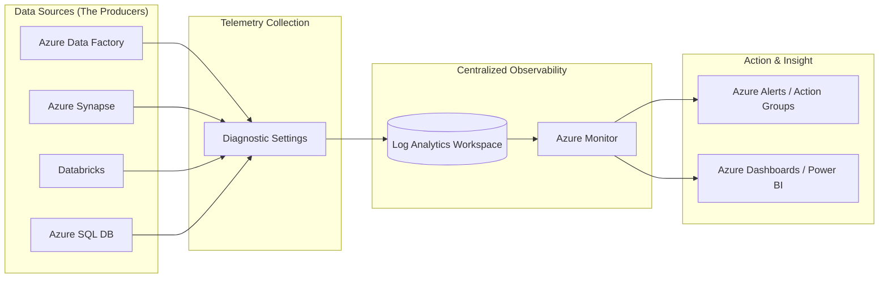

## Monitoring, Logging, and Operations for Data Pipelines

### Section at a Glance
**What you'll learn:**
- Designing an end-to-end observability strategy for Azure Data Factory, Synapse, and Databricks.
- Implementing and querying logs using Kusto Query Language (KQL) in Azure Monitor.
- Configuring Diagnostic Settings to centralize telemetry across the data estate.
- Creating automated alerting mechanisms using Azure Monitor Action Groups.
- Optimizing the cost-to-value ratio of log retention and ingestion.

**Key terms:** `Azure Monitor` · `Log Analytics Workspace` · `Kusto Query Language (KQL)` · `Diagnostic Settings` · `Telemetry` · `Action Groups`

**TL;DR:** Monitoring and logging transform "black box" data pipelines into transparent, observable systems by centralizing telemetry, enabling proactive error detection, and providing the audit trails necessary for compliance and debugging.

---

### Overview
In a production data environment, the greatest risk is not a failure, but a **silent failure**. A pipeline that fails to run is obvious; a pipeline that runs successfully but produces empty or corrupted datasets is a catastrophic business event. This section addresses the operational "blind spot" that occurs when data engineers focus solely on throughput and transformation logic while neglecting observability.

From a business perspective, effective monitoring is about **MTTR (Mean Time To Recovery)**. When a downstream dashboard shows incorrect numbers, the business demands an answer. Without a robust logging architecture, engineers spend hours manually inspecting logs across disparate services (ADF, Datolog Analytics, Databricks). This leads to high operational overhead, eroded trust in data, and potential SLA breaches.

This module moves you from a "reactive" posture (fixing things when users complain) to a "proactive" posture (detecting anomalies via alerts before they impact the business). We will treat monitoring not as an "add-on" feature, but as a core architectural component of the data engineering lifecycle.

---

### Core Concepts

#### 1. The Observability Triad: Metrics, Logs, and Traces
To understand the health of a pipeline, you must distinguish between these three types of telemetry:
*   **Metrics:** Numerical values measured over time (e.g., CPU usage of a Spark cluster, number of rows processed). Metrics are lightweight and excellent for real-time alerting.
*   **Logs:** Records of discrete events (e.g., "Pipeline X failed at 10:01 AM due to Auth error"). Logs provide the *context* that metrics lack.
*   **Traces:** The journey of a single request or data packet through multiple services (e.g., tracking a specific file from Blob Storage through ADF to Synapse).

#### 2. Azure Monitor & Log Analytics Workspace
**Azure Monitor** is the central nervous system for all telemetry in Azure. The **Log Analytics Workspace (LAW)** is the specialized storage container where your log data resides.
> 📌 **Must Know:** You do not "send logs to Azure Monitor" directly; you configure services to send logs to a *Log Analytics Workspace*, and Azure Monitor provides the interface to query that workspace.

#### ly 3. Diagnostic Settings: The Data Bridge
Every Azure service (ADF, Synapse, SQL DB, Key Vault) has a **Diagnostic Settings** configuration. This is the "on/off" switch for telemetry. If you do not explicitly enable Diagnostic Settings for a resource, its internal operational logs will not appear in your Log Analytics Workspace.
⚠️ **Warning:** Enabling "All Logs" for high-throughput services like Azure SQL or Synapse can lead to massive, unexpected ingestion costs. Always select only the categories (e.le., `QueryStoreRuntimeStatistics`) that are critical for your operational needs.

#### 4. Kusto Query Language (KQL)
KQL is the language of observability in Azure. It is a schema-on-read, functional language designed for high-speed log analysis. Unlike SQL, which is optimized for relational integrity, KQL is optimized for scanning billions of rows of unstructured text to find patterns.

---

### Architecture / How It Works



1.  **Data Sources:** The compute and integration services generating telemetry.
2.  **Diagnostic Settings:** The configuration layer that defines which logs/metrics are exported and to which destination.
3.  **Log Analytics Workspace:** The centralized repository where logs are ingested, indexed, and stored.
4.  **Azure Monitor:** The management layer used to run KQL queries and define alert logic.
5.  **Action & Insight:** The final output, where alerts trigger emails/SMS (Action Groups) or metrics are visualized for stakeholders.

---

### Comparison: When to Use What

| Option | Best For | Trade-offs | Approx. Cost Signal |
| :--- | :--- | :--- | :--- |
| **Azure Monitor Metrics** | Real-time threshold alerts (e.g., "CPU > 90%"). | Low granularity; no deep context or "why" behind the number. | Very Low (Standard) |
/| **Log Analytics (KQL)** | Deep debugging, forensic analysis, and trend auditing. | High ingestion cost if volume is uncontrolled. | Moderate to High (per GB) |
| **Application Insights** | Tracking application-level code errors and distributed tracing. | Requires instrumentation within the application code. | Moderate |
| **Azure Storage (Archive)** | Long-term compliance/audit logs (years of data). | High latency; logs are not "live" for querying. | Very Low |

**How to choose:** Use **Metrics** for immediate, high-level operational "heartbeat" monitoring. Use **Log Analytics** for investigative work and complex pattern detection. Use **Storage** for regulatory retention where you only need the data if a legal audit occurs.

---

### Cost Cheat Sheet

| Scenario | Recommended Option | Key Cost Driver | Watch Out For |
| :--- | :--- | :--- | :--- |
| **Daily Pipeline Success/Failure** | Log Analytics (Filtered) | Ingestion Volume | Logging "Every Row" instead of "Every Run." |
| **Long-term Compliance (7 years)** | Azure Blob (Archive Tier) | Storage Volume | Data retrieval/egress costs if you need to read it. |

| **Real-time System Health** | Azure Monitor Metrics | Number of Custom Metrics | High-frequency polling/custom metric count. |
| **Deep Debugging (Intensive)** | Log Analytics (Short Retention) | Data Ingestion + Retention | Leaving a 365-day retention on high-volume debug logs. |

> 💰 **Cost Note:** The single biggest driver of Azure Monitor bills is **Log Ingestion**. A single misconfigured loop in a Databricks notebook that prints a log line every second can result in a thousand-dollar bill overnight. Always implement "Log Level" controls (e.g., INFO vs. ERROR) in your code.

---

### Service & Tool Integrations

1.  **Azure Data Factory $\rightarrow$ Log Analytics:**
    *   Configure Diagnostic Settings in ADF.
    *   Use KQL to query `ADFPipelineRun` table to find durations and failures.
2.  **Azure Databricks $\rightarrow$ Azure Monitor:**
    *   Use the *Azure Monitor Log Analytics* library within Spark clusters.
    *   Stream cluster logs and driver logs to the workspace for centralized viewing.
3.  **Azure SQL $\rightarrow$ Azure Monitor:**
    *   Enable SQL Audit logs to capture who accessed what data (crucial for security).
    *   Stream these to the same LAW used by your pipelines for a "single pane of glass."

---

### Security Considerations

Monitoring data itself contains sensitive information (e.g., error messages might inadvertently leak parameter values or connection strings).

| Control | Default State | How to Enable / Strengthen |
| :--- | :--- | :--- |
| **RBAC (Access Control)** | Highly Permissive (if using Owner) | Use the "Log Analytics Reader" role for auditors/developers. |
| **Data Masking** | No Masking | Implement KQL functions to redact sensitive patterns in logs. |
| **Network Isolation** | Public Endpoint | Use Private Links for Log Analytics Workspace ingestion. |
| **Audit Logging** | Enabled (for Azure Resource Manager) | Monitor the "Admin" logs of the Workspace itself to see who deleted logs. |

---

### Performance & Cost

When designing monitoring, you face a trade-off between **Granularity** and **Cost**.

**The Bottleneck:** High-volume log ingestion can lead to "Ingestion Lag," where there is a delay between an event occurring and it appearing in your KQL query results.

**Concrete Example:**
*   **Scenario A (Bad):** You log every single row processed by a Spark job (10 million rows). At \$2.30 per GB ingested, your log bill exceeds your compute bill.
*   **Scenario B (Good):** You log only the *summary* of the job (Start time, End time, Row Count, Status). This uses kilobytes instead of gigabytes, keeping costs near zero while providing 100% of the necessary operational visibility.

---

### Hands-On: Key Operations

**Step 1: Querying Pipeline Failures with KQL**
Run this in the Log Analytics Query window to identify which ADF pipelines failed in the last 24 hours.
```kql
// Query to find failed ADF pipeline runs
ADFPipelineRun
| where Status == "Failed"
| where TimeGenerated > ago(24h)
| project TimeGenerated, PipelineName, RunId, Parameters
| order by TimeGenerated desc
```
> 💡 **Tip:** Using `project` is a best practice. It reduces the amount of data the UI has to render, making your queries faster.

**'Step 2: Creating an Alert Rule via Azure CLI**
This command creates a metric alert that triggers if a specific metric exceeds a threshold.
```bash
# Create an alert rule for high CPU usage
az monitor metrics alert create \
    --name "HighCPUAlert" \
    --resource-group "DataOps-RG" \
    --scopes "/subscriptions/xxx/resourceGroups/xxx/providers/Microsoft.Compute/virtualMachines/SparkNode" \
    --condition "avg CPUUsage > 80" \
    --description "Alert when Spark Node CPU is high"
```

---

### Customer Conversation Angles

**Q: "How will I know if our daily ETL failed before our business users see empty reports?"**
**A:** "We will implement automated Azure Monitor alerts tied to your ADF pipeline status. If a failure occurs, your engineering team will receive an immediate notification via Email or SMS via an Action Group, often before the downstream reports even refresh."

**Q: "If we log everything, won't our Azure bill skyrocket?"**
**A:** "It can if not managed correctly. Our strategy is to use 'Tiered Observability': we use lightweight metrics for real-time alerts and only ingest high-detail logs for critical error events and audit compliance, ensuring we optimize for cost without losing visibility."

**Q: "Can we use our existing SQL skills to analyze these logs?"**
**A:** "Yes. While the language is KQL, the logic is very similar to SQL. Concepts like `where`, `join`, `summarize` (the KQL version of `group by`), and `project` (the version of `select`) will feel very familiar to you."

**Q: "How do we handle logs for compliance/auditing?"**
**A:** "We will configure Diagnostic Settings to stream all access and audit logs to a locked-down Log Analytics Workspace with a long-term retention policy, ensuring you have an immutable record for auditors."

**Q: "If a developer accidentally logs a password, how do we fix it?"**
**A:** "First, we'll rotate the credential immediately. Second, we'll implement KQL-based data masking or use Azure Key Vault integration to ensure sensitive strings are never passed into the logging stream in the first place."

---

### Common FAQs and Misconceptions

**Q: Does enabling Diagnostic Settings automatically make logs searchable in KQL?**
**A:** No. You must enable the settings *and* point them to a Log Analytics Workspace. ⚠️ **Warning:** Simply turning on logging in the resource doesn't mean the data is being sent anywhere.

**Q: Is KQL just a version of SQL for Azure?**
**A:** Not exactly. While they share logic, KQL is pipe-based (`|`) and optimized for unstructured data, whereas SQL is declarative and optimized for structured relations.

**Q: Can I use Power BI to visualize my pipeline logs?**
**A:** Yes, you can connect Power BI directly to a Log Analytics Workspace to create operational dashboards for stakeholders.

**Q: Does Log Analytics storage cost include the ingestion cost?**
**A:** No. You are billed for **Ingestion** (the process of bringing data in) and **Retention** (the cost of keeping that data in the workspace).

**Q: Can I delete logs to save money?**
**A:** You can set retention policies to automatically purge old data, but manually deleting specific rows from a Log Analytics Workspace is intentionally difficult to ensure audit integrity.

**Q: If a pipeline is 'Running', does that mean the logs are up to date?**
**A:** Not necessarily. There can be an "Ingestion Latency" of a few minutes between the event occurring and the log appearing in your query results.

---

### Exam & Certification Focus
*   **Domain: Monitor and Integrate Azure Data Solutions**
*   **Diagnostic Settings:** Know how to enable them for ADF and Synapse (High Frequency).
*   **KQL Syntax:** Be able to interpret basic `where`, `summarize`, and `project` statements.
*   **Alerting:** Understand the relationship between Metrics, Alert Rules, and Action Groups.
*   **Log Analytics Workspace:** Understand its role as the central repository for telemetry. 📌 **Must Know:** The distinction between Metrics (numbers) and Logs (events).

---

### Quick Recap
- **Observability requires three pillars:** Metrics, Logs, and Traces.
- **Azure Monitor** is the central hub; **Log Analytics** is the storage.
- **Diagnostic Settings** must be explicitly configured per resource.
- **KQL** is the essential language for querying and analyzing logs.
- **Cost Management** is critical; prioritize ingestion of errors over successful routine data.

---

### Further Reading
**Azure Monitor Documentation** — Comprehensive guide to all monitoring features.
**Kusto Query Language (KQL) Reference** — Essential syntax for log analysis.
**Azure Data Factory Monitoring** — Specifics on monitoring pipeline runs and activities.
**Azure Architecture Center: Monitoring Strategy** — Best practices for enterprise-scale observability.
**Azure Cost Management** — Understanding how ingestion and retention impact your monthly spend.