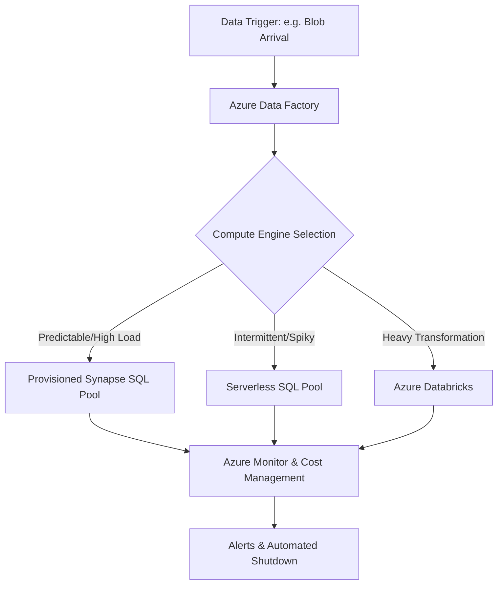

## Managing Cost, Performance, and Billing for Azure Data Services

### Section at a Glance
**What you'll learn:**
- Architecting for cost-efficiency using compute decoupling and serverless models.
- Implementing scaling strategies (Vertical vs. Horizontal) for Azure SQL and Synapse.
- Managing DTUs vs. vCore models and understanding the billing implications.
- Optimizing Data Factory and Databricks costs through cluster management.
- Setting up monitoring and alerting to prevent "billing shock."

**Key terms:** `Serverless` · `DTU` · `vCore` · `Autoscale` · `Reserved Instances` · `Data Factory Pipeline Monitoring`

**TL;TR:** Mastering the balance between performance and cost requires moving from a "provision for peak" mindset to an "elastic, consumption-based" architecture where compute scales with demand.

---

### Overview
In the era of on-premises data warehousing, organizations faced a "provision for peak" dilemma: you had to buy enough hardware to handle your heaviest January load, even if that hardware sat idle for the other eleven months of the year. This resulted in massive capital expenditure (CapEx) and wasted capacity.

Azure Data Services solve this by decoupling storage from compute, but they introduce a new challenge: **operational OpEx volatility.** Without proper governance, a single poorly written recursive loop in Azure Data Factory or an oversized Synapse Spark pool can deplete a monthly budget in hours.

For the Data Engineer, managing these services isn't just about making queries run faster; it is about ensuring that the business value derived from the data exceeds the cost of the infrastructure required to process it. This section provides the framework to navigate the trade-offs between performance, availability, and cost.

---

### Core Concepts

#### 1. The Compute Models: DTU vs. vCore
Azure SQL Database offers two primary resource models. Understanding the distinction is critical for both performance tuning and budget predictability.

*   **DTU (Database Transaction Unit):** A bundled measure of CPU, Memory, and I/O. 
    *   **Best for:** Simple, predictable workloads where you don't want to manage individual resource allocations.
    *    ⚠️ **Warning:** DTUs are a "black box." If you hit a performance ceiling, you cannot simply add more RAM; you must upgrade the entire DTU tier, which can lead to significant price jumps.
*   **vCore:** Provides granular control over the number of virtual cores and amount of memory.
    *   **Best for:** Complex, scalable workloads and predictable enterprise applications.
    *   📌 **Must Know:** The vCore model allows for **Azure Hybrid Benefit**, which can drastically reduce costs if you already own SQL Server licenses.

#### 2. Scaling Dimensions: Vertical vs. Horizontal
*   **Vertical Scaling (Scaling Up/Down):** Increasing the power of a single instance (e.g., moving from 4 vCores to 8 vCores). This is easy but has a hard ceiling.
*   **Horizontal Scaling (Scaling Out/In):** Adding more nodes to a cluster (e.g., increasing Synapse SQL Pool DWUs or Databricks worker nodes).
    *   💡 **Tip:** Always prefer horizontal scaling for large-scale data processing (ETL) to avoid the "big box" cost bottleneck.

#### 3. Serverless vs. Provisioned
*   **Serverless:** Resources are allocated dynamically based on workload. You pay only for the seconds of compute used.
    *   💰 **Cost Note:** Serverless is incredibly cheap for intermittent tasks (e.g., a job that runs once a day), but if you have a constant, 24/ 7 high-load stream, a provisioned instance is almost always cheaper.
*   **Provisioned:** You pay for a fixed capacity regardless of usage. This provides the most predictable billing and the lowest latency for "always-on" applications.

---

### Architecture / How It Works

The following diagram illustrates the relationship between a workload trigger, the compute engine, and the cost-control mechanism.



1.  **Azure Data Factory:** Acts as the orchestrator, triggering the compute resources.
2.  **Compute Engine (Provisioned/Serverless):** The execution layer where the actual data processing occurs.
3.  **Azure Monitor & Cost Management:** The governance layer that tracks consumption and evaluates it against budgets.
4.  **Automated Shutdown:** A logic-driven response to prevent cost overruns (e.g., stopping a Databricks cluster if no jobs are in the queue).

---

### Comparison: When to Use What

| Option | Best For | Trade-offs | Approx. Cost Signal |
| :--- ability | :--- | :--- | :--- |
| **Azure SQL (DTU)** | Small, predictable web apps | No granular control; hard to scale specific resources | Low/Fixed |
| **Azure SQL (vCore Serverless)** | Intermittent queries/Ad-hoc analysis | "Cold start" latency when waking up from pause | Low (Pay-per-second) |
| **Synapse Dedicated SQL Pool** | Enterprise Data Warehousing (High performance) | High cost if left running; requires manual scaling | High (Hourly/Provisioned) |
| **Synapse Serverless SQL** | Data Lake exploration (SQL on Files) | No indexing; performance depends on file structure | Very Low (Per TB scanned) |

**How to choose:** Start with the **Serverless** model to validate your data patterns. Once you identify a consistent, 24/7 workload pattern, migrate to **Provisioned** resources and apply **Reserved Instances** to lock in lower rates.

---

### Cost Cheat Sheet

| Scenario | Recommended Option | Key Cost Driver | Watch Out For |
| :--- | :--- | :--- | :--- |
| **Daily ETL Batch Job** | ADF + Databricks (Autoscaling) | Cluster uptime & Instance Type | Leaving clusters running after job completion |
| **Ad-hoc Data Discovery** | Synapse Serverless SQL | **Data Scanned (TB)** | Using `SELECT *` on massive, unpartitioned files |
| **Production Web App** | Azure SQL (vCore) | vCore count & Storage size | Forgetting to use Azure Hybrid Benefit |
| **Long-term Data Archiving** | Azure Data Lake (Archive Tier) | Storage volume & Data Retrieval | High costs when "rehydrating" data for analysis |

> 💰 **Cost Note:** The single biggest cost mistake is **"The Zombie Cluster"**—provisioning a high-performance Spark or SQL pool for a project and forgetting to scale it down or shut it down after the development phase is complete.

---

### Service & Tool Integrations

1.  **Azure Monitor + Azure Data Factory:**
    *   Use Log Analytics to track pipeline duration.
    *   Set alerts for "Long Running Pipeline" to catch loops that are draining your budget.
2.  **Azure Key Vault + Data Factory:**
    *   Securely manage connection strings to ensure that cost-sensitive service principals cannot be used to spin up unauthorized resources.
3.  **Azure Purview + Synapse:**
    *   Use lineage to understand which datasets are "hot" (frequently accessed/expensive) and which are "cold" (candidates for cheaper storage tiers).

---

### Security Considerations

Security and Cost are often linked; an unsecured service can be used by attackers to mine cryptocurrency or run massive queries, resulting in massive bills.

| Control | Default State | How to Enable / Strengthen |
| :--- | :--- | :--- |
| **Network Isolation** | Public Endpoint enabled | Use **Private Links** to keep traffic off the public internet |
| **Authentication** | SQL Auth allowed | Enforce **Microsoft Entra ID (Azure AD)** only |
  | **Encryption at Rest** | Enabled (TDE) | Manage keys via **Azure Key Vault** for higher control |
| **Resource Throttling** | None | Implement **Azure API Management** or Resource Quotas |

---

### Performance & Cost

**The Golden Rule:** Performance and Cost are usually inversely proportional in a consumption-based model.

**Example Scenario:**
You have a 100GB dataset in a Synapse Dedicated SQL Pool.
*   **Scenario A (Low Cost/Low Perf):** You use a DW100c tier. The query takes 20 minutes. You pay ~$1.20/hour.
*   **Scenario B (High Cost/High Perf):** You scale to DW1000c. The query takes 2 minutes. You pay ~$12.00/hour.

**The Decision Logic:** If the 18-minute time difference doesn't impact the business's downstream reporting SLA, **Scenario A is the superior engineering choice.** Always optimize for the *minimum* performance required to meet the business SLA.

---

### Hands-On: Key Operations

**Step 1: Scale up an Azure SQL Database using Azure CLI.**
This command increases the vCore count to handle a period of heavy end-of-month processing.
```bash
az sql db update \
    --resource-group MyResourceGroup \
    --server MyServer \
    --name MyDatabase \
    --capacity 8
```
> 💡 **Tip:** Always run a "Scale Down" script or automation as part of your post-processing workflow to revert to standard capacity.

**Step 2: Set up a budget alert in Azure CLI.**
This ensures you receive an email when your monthly spend reaches 80% of your budget.
```bash
az consumption budget create \
    --name MonthlyDataBudget \
    --category AzureDataServices \
    --amount 500 \
    --time-period Month \
    --notification-email "admin@company.com"
```

---

### Customer Conversation Angles

**Q: "We have huge spikes in data every Monday. Should we just buy a massive server?"**
**A:** "Instead of a massive server that sits idle most of the week, we should implement an auto-scaling architecture using Azure Synapse or Databricks that expands on Monday and shrinks on Tuesday, saving you roughly 60% on idle capacity."

**Q: "How can we be sure our developers won't run up a massive bill with unoptimized queries?"**
**A:** "We can implement Azure Policy to restrict certain expensive SKU types and set up Azure Monitor alerts that notify us the moment spend exceeds a predefined threshold."

**Q: "Is Serverless SQL truly 'free' if we don't run queries?"**
**A:** "There is no cost for the compute when it's idle, but you are still paying for the storage of the underlying data in your Data Lake."

**Q: "Can we use our existing SQL Server licenses to save money on Azure?"**
**A:** "Yes, by using the Azure Hybrid Benefit, you can repurpose your existing on-premises licenses to significantly reduce the hourly vCore rate in Azure."

**Q: "What happens if a Data Factory pipeline fails in the middle of a large loop?"**
**A:** "We design 'Idempotent' pipelines—meaning if a failure occurs, the retry logic will not duplicate data or incur unnecessary redundant processing costs."

---

### Common FAQs and Misconceptions

**Q: Does 'Serverless' mean I don't have to manage any infrastructure?**
**A:** Yes, for the compute aspect, but you are still responsible for managing the data architecture and access permissions.

**Q: If I pause my SQL Database, will I still be charged?**
**A:** You stop paying for *compute*, but you continue to pay for the *storage* of the database files.
> ⚠️ **Warning:** Never assume "Paused" means "Zero Cost."

**Q: Does more DTUs always mean faster queries?**
**A:** No. If your query is poorly written (e.g., lacks an index), adding more DTUs will only make the "bad" query run more expensively.

**Q: Is it cheaper to use a single large VM for processing instead of Azure Databricks?**
**A:** Usually no. Databricks' ability to scale out and shut down nodes automatically provides a much better cost-to-performance ratio for large-scale ETL.

**Q: Can I see exactly which SQL query cost me the most money?**
**A:** Not directly via a single 'price per query' metric, but by using Azure Monitor to correlate query duration and DTU/vCore consumption, we can identify the 'expensive' culprits.

---

### Exam & Certification Focus
*   **Identify Scaling Methods:** Distinguish between scaling up (vCore/DTU) and scaling out (Synapse/Databricks) [Domain: Design for Security & Performance].
*   **Cost Optimization Models:** Know when to recommend Serverless vs. Provisioned [Domain: Implement Data Processing].
*   **Licensing Benefits:** Understand the impact of Azure Hybrid Benefit on vCore pricing [Domain: Optimize Cost].
*   **Monitoring & Governance:** Knowledge of Azure Monitor and Cost Management for alerting [Domain: Monitor and Optimize Data Solutions].
*   📌 **Must Know:** The concept of "Decoupled Storage and Compute" as a driver for cost efficiency.

---

### Quick Recap
- **Decouple Compute and Storage** to avoid paying for idle resources.
- **Serverless is for spikes; Provisioned is for steady state.**
- **Horizontal scaling** is the key to handling massive, distributed datasets.
- **Governance is mandatory:** Use Budgets, Alerts, and Azure Policy to prevent cost overruns.
- **Optimize the code first, then the infrastructure.** An unoptimized query is an expensive query.

---

### Further Reading
**Azure Cost Management Documentation** — Comprehensive guide on setting budgets and managing cloud spend.
**Azure SQL Database Scaling Documentation** — Detailed breakdown of DTU vs. vCore scaling mechanics.
**Azure Synapse Analytics Pricing** — Deep dive into how DWU and Serverless SQL units are billed.
**Azure Data Factory Monitoring Guide** — How to track pipeline execution and resource consumption.
**Azure Architecture Center: Cost Optimization** — Reference architectures for cost-effective data ingestion.