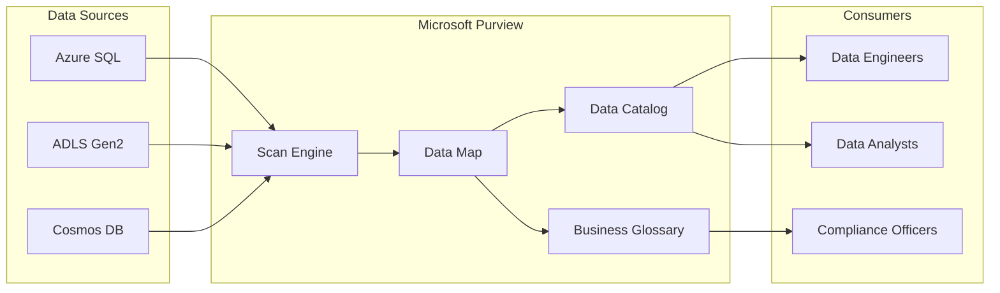

## Data Governance and Metadata Management with Azure Purview

### Section at a Glance
**What you'll learn:**
- The fundamental components of the Microsoft Purview (formerly Azure Purview) ecosystem.
- How to implement automated data discovery through scanning and classification.
- Implementing end-to-end data lineage to track transformation logic.
- Managing a business glossary to bridge the gap between IT and business stakeholders.
- Configuring security and access controls for metadata visibility.

**Key terms:** `Data Map` · `Data Catalog` · `Lineage` · `Classification` · `Glossary` · `Scanning`

**TL;DR:** Microsoft Purview is a unified data governance service that provides a searchable map of your entire data estate, allowing you to discover, understand, and manage your data assets and their origins.

---

### Overview
In modern enterprise environments, the primary challenge isn't a lack of data, but the "Data Swamp" phenomenon. Organizations accumulate massive amounts of data across Azure Data Lake, SQL Databases, and even non-Azure sources, but without governance, this data becomes unsearchable, untrusted, and non-compliant. For a Data Engineer, this creates a massive "discovery tax"—spending 80% of your time finding and verifying data rather than building pipelines.

Microsoft Purview solves this by providing a unified governance layer. It acts as a single pane of glass that crawls your data sources to create a **Data Map**. This map doesn't just list files; it understands the schema, identifies sensitive information (like credit card numbers), and tracks how data moves from a raw landing zone through a Synapse pipeline into a final Gold-layer table.

For the DP-203 exam and for your professional practice, think of Purview not as a storage service, or a movement service, but as the **intelligence layer** that sits atop your data architecture. It provides the "metadata" (data about your data) that makes your entire data estate manageable, auditable, and compliant with regulations like GDPR or CCPA.

---

### Core Concepts

#### 1. The Data Map
The Data Map is the foundational capability of Purview. It is a unified, automated map of your data landscape. It stores the metadata captured during scans.
*   **Automated Discovery:** Purview uses "scans" to ingest metadata from registered sources.
*   **Hierarchy:** It organizes data into Assets, Collections, and Attributes.

#### 2. The Data Catalog
The Catalog is the "Google-like" interface for your data. It allows users (Data Scientists, Analysts, Engineers) to search for specific datasets using keywords, tags, or classifications.
*   **Searchability:** Users can filter by owner, source, or sensitivity.
*   **Discovery:** It empowers self-service BI by allowing analysts to find "the single source of truth" without asking an engineer.

#### 3. Data Lineage
Lineage provides the "biography" of a dataset. It shows the path data took from source to destination.
*   **Transformation Tracking:** When using Azure Data Factory (ADF) or Synapse, Purview can automatically capture the lineage of how a Copy Activity or Mapping Data Flow changed the data.
*   **Impact Analysis:** 📌 **Must Know:** If you change a column in a source SQL table, lineage allows you to see exactly which downstream Power BI reports will break.

#### 4. Classification and Scanning
*   **Scanning:** The process of connecting to a source (e.g., ADLS Gen2) and reading its schema.
*   **Classification:** The process of identifying sensitive data patterns. Purview uses "System Classifications" (e.g., Email Address, SSN) and "Custom Classifications" (regex-based) to tag assets automatically.

> ⚠️ **Warning:** Scanning does **not** move or copy your actual data. It only reads the metadata (schema, headers, and samples). Do not assume that because you scanned a folder, the data is now "in" Purview.

#### 5. Business Glossary
The Glossary allows business users to define terms in a way that is consistent across the company.
*   **Semantic Layer:** While a "Column Name" might be `cust_id_01` in SQL, the Glossary entry will be "Customer Identifier."
*   **Mapping:** You can map Glossary terms directly to technical assets in the Data Map.

---

### Architecture / How It Works



1.  **Data Sources:** The physical locations where your data resides.
2.  **Scan Engine:** The compute resource that connects to sources to extract metadata.
3.  **Data Map:** The persistent storage layer containing the structured metadata and lineage.
4.  **Data Catalog/Glossary:** The presentation layer for discovery and semantic definition.
5.  **Consumers:** The end-users who use the metadata to make data-driven decisions.

---

### Comparison: When to Use What

| Option | Best For | Trade-offs | Approx. Cost Signal |
| :--- | :--- | :--- | :--- |
| **Manual Cataloging** | Small, static environments with < 10 tables. | High operational overhead; quickly becomes obsolete. | Low (Human time only) |
| **Purview (Automated)** | Large-scale, evolving Azure/Multi-cloud estates. | Requires setup and monitoring of scan schedules. | Medium (Capacity/Scanning) |
| **Third-Party (e.g., Collibra)** | Highly complex, non-Azure enterprise ecosystems. | High licensing cost; complex integration. | High (Premium Licensing) |

**How to choose:** If your data architecture is primarily on Azure and you require automated lineage and sensitivity detection, **Microsoft Purvoid** is the default and most cost-effective choice.

---

### Cost Cheat Sheet

| Scenario | Recommended Option | Key Cost Driver | Watch Out For |
| :--- | :--- | :--- | :--- |
| **Initial Setup** | Single Collection | Scanning frequency | Over-scanning empty folders |
| **Large Data Lake** | Partitioned Scanning | Number of files/metadata size | High "Scan" duration costs |
| **Highly Regulated** | Custom Classifications | Complexity of Regex/Logic | Computational overhead during scan |
| **Cross-Team Access** | Multiple Collections | RBAC management complexity | Accidental exposure of sensitive metadata |

> 💰 **Cost Note:** The single biggest cost mistake is setting **extremely frequent scan schedules** on massive, high-churn Data Lakes. If you scan every hour for changes that only occur daily, you are wasting significant budget on unnecessary compute.

---

### Service & Integrations

1.  **Azure Data Factory (ADF) / Synapse Pipelines:**
    *   Purview integrates via the "Lineage Extraction" feature.
    *   When an ADF pipeline runs, it pushes lineage metadata to Purview, showing the flow from Source $\to$ Sink.
2.  **Azure Data Lake Storage (ADLS) Gen2:**
    *   Purview crawls the folder hierarchy and file metadata (Parquet, Avro, CSV).
3.   **Azure SQL Database:**
    *   Purview captures schema changes and table relationships.
4.   **Power BI:**
    *   Purview can show the lineage from the SQL source all the way to the final Power BI report.

---

### Security Considerations

Purview security is centered around **Role-Based Access Control (RBAC)** at the "Collection" level.

| Control | Default State | How to Enable / Strengthen |
| :--- | :--- | :--- |
| **Authentication** | Microsoft Entra ID (Azure AD) | Use Managed Identities for scanning services. |
| **Authorization** | Wide access within the tenant | Use **Collections** to segment data visibility by department. |
| **Network Isolation** | Public Endpoint | Enable **Private Endpoints** to ensure scanning traffic stays on the backbone. |
| **Audit Logging** | Enabled (Azure Monitor) | Direct Purview logs to a Log Analytics Workspace for long-term compliance. |

---

### Performance & Cost

**Scaling Patterns:**
When dealing with massive data estates, do not attempt a "Big Bang" scan. Instead, use a **tiered scanning strategy**:
1.  **Tier 1 (Critical):** Weekly scans for Production Gold-layer tables.
2.  **Tier 2 (Standard):** Bi-weekly scans for Silver-layer datasets.
3.  **Tier 3 (Discovery):** Monthly scans for Raw/Bronze-layer landing zones.

**Example Cost Scenario:**
*   **Scenario:** A Data Engineer needs to scan 10,000 files in ADLS Gen2.
*   **Without Optimization:** Scanning every file for every scan event.
*   **With Optimization:** Using a "Incremental Scan" or focusing only on the metadata of the folder structure.
*   **Impact:** Optimization can reduce "Data Map" processing costs by up to 40% by reducing the metadata payload processed during each cycle.

---

### Hands-On: Key Operations

**1. Registering a Data Source**
First, you must tell Purview which resource to look at. This is done via the "Data Map" section.
*In the Azure Portal/Purview Studio, navigate to Data Map $\to$ Register $\to$ Azure Data Lake Gen2.*

**2. Setting up a Scan via Python (Conceptual SDK usage)**
If you are automating the triggering of scans via an orchestration tool:
```python
# Note: This is a conceptual representation of interacting with Purview APIs
import requests

purview_endpoint = "https://<your-purview-name>.purview.azure.com"
scan_id = "my-adls-scan"

# Triggering a scan refresh via REST API
response = requests.post(f"{purview_endpoint}/scan/{scan_id}/refresh", 
                         auth=('service_principal', 'client_secret'))

if response.status_code == 202:
    print("Scan refresh initiated successfully.")
```
> 💡 **Tip:** Use Managed Identities for your Python scripts or Data Factory activities so you never have to manage or rotate credentials in your code.

---

### Customer Conversation Angles

**Q: "We already have documentation in Excel. Why do we need Purview?"**
**A:** "Excel documentation is static and becomes outdated the moment a schema changes. Purview provides *live* documentation that evolves automatically with your data pipelines."

**Q: "Will Purview slow down our production database during a scan?"**
**A:** "Purview reads metadata and small samples, not the entire dataset. While the impact is minimal, we recommend scheduling scans during low-traffic windows to ensure zero impact on production performance."

** 💰 Q: "Is it worth the cost if we only have a few SQL databases?"**
**A:** "If your primary goal is compliance (GDPR), the cost of a fine far outweighs the cost of Purview. If your goal is productivity, the time saved by engineers not searching for data often pays for the service within months."

**Q: "Can Purview actually prevent someone from seeing sensitive data?"**
**A:** "Purview provides the *visibility* and *classification*. To actually *restrict* access, you use Purview's insights to configure Azure SQL or ADLS ACLs (Access Control Lists)."

**Q: "Does Purview support data in AWS or Google Cloud?"**
**A:** "Yes, Purview is designed to be multi-cloud. You can register S3 buckets or Google BigQuery as sources to create a unified view of your entire estate."

---

### Common FAQs and Misconceptions

**Q: Does Purview store a copy of my data?**
**A:** No. Purview only stores metadata and small samples for classification purposes.

**Q: Can I use Purview to transform data?**
**A:** No. Purview is for governance and discovery. You use Azure Data Factory or Synapse for transformations.

**Q: If I delete a file in ADLS, does it disappear from Purview immediately?**
**A:** ⚠️ **Warning:** No. Purview only knows the file is gone during the *next scheduled scan*. Your catalog might show "stale" metadata until the next scan cycle.

**Q: Can I create my own classification rules?**
**A:** Yes, you can use Regex or custom pattern matching to identify proprietary ID formats.

**Q: Is Purview part of the Azure Data Factory service?**
**A:** No, they are separate services, but they are deeply integrated for lineage purposes.

**Q: Does Purview help with Data Quality?**
**A:** Not directly. It tells you the data exists and where it came from; you would need tools like Great Expectations or Azure Data Factory validation to measure quality.

---

### Exam & Certification Focus (DP-203)

*   **Data Lineage (High Priority):** Understand how ADF/Synapse integration works to populate the lineage graph.
*   **Data Map & Collections (Medium Priority):** Know how to organize assets into collections for access control.
*   **Classification (Medium Priority):** Understand the difference between system and custom classifications.
*   **Integration Patterns (High Priority):** Be able to identify which service (ADF, SQL, ADLS) is required to populate specific parts of the Data Map.
*   📌 **Must Know:** The ability to distinguish between **Metadata** (what Purview handles) and **Data** (what ADF/Synapse handles).

---

### Quick Recap
- Microsoft Purview provides a unified **Data Map** for discovery and governance.
- **Lineage** is the critical feature for tracking data transformations from source to sink.
- **Scanning** is the automated process of extracting metadata, not moving data.
- **Glossary** and **Classifications** bridge the gap between technical schemas and business language.
- **Security** is managed via **Collections** and Entra ID (Azure AD) roles.

---

### Further Reading
**Microsoft Purview Documentation** — The primary source for all feature updates and API references.
**Azure Data Factory Lineage Guide** — Specific instructions on setting up the integration between ADF and Purview.
**Azure Security Best Practices** — Essential for understanding how to secure the metadata layer using Private Endpoints.
**Microsoft Purview Data Governance Whitepaper** — Deep dive into the architectural philosophy of unified governance.
**DP-203 Exam Guide** — To ensure you map these concepts to the specific learning objectives of the certification.