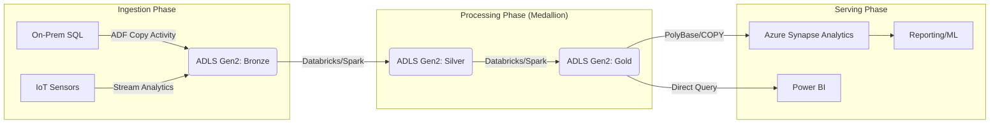

## Exam Readiness: Final Review and Practice Scenarios

### Section at a Glance
**What you'll learn:**
- How to synthesize distributed data services into a cohesive end-to-end architecture.
- Strategies for analyzing complex, multi-part exam scenarios to identify the "most efficient" solution.
- Techniques for mapping business requirements (latency, cost, scale) to specific Azure Data tools.
- Best practices for auditing and monitoring data pipelines for production-grade reliability.
- Critical review of the DP-203 exam domains and high-weightage topics.

**Key terms:** `Medallion Architecture` · `Partition Pruning` · `Idempotency` · `Schema Drift` · `PolyBase` · `Change Data Capture (CDC)`

**TL;DR:** This final section moves you from knowing "how tools work" to knowing "which tool to use." It prepares you to tackle the decision-based logic of the DP-203 exam by simulating real-world architectural trade-offs.

---

### Overview
The DP-203 exam is not a vocabulary test; it is a decision-making exam. Microsoft does not simply ask "What is Azure Data Factory?"; they ask "Which integration pattern minimizes cost while meeting a 5-minute latency requirement for a highly partitioned dataset?" 

For the practicing engineer, this reflects the real-world pressure of "Architecture Fatigue"—the struggle to choose between seemingly equal options (like Databricks vs. Synapse Spark) when faced with budget constraints and SLA requirements. To pass this exam and succeed in the field, you must transition from a developer mindset to an architect mindset.

This section serves as your final synthesis. We will revisit the pillars of the data estate—Storage, Compute, Security, and Orchestration—and view them through the lens of "Scenario Analysis." We will bridge the gap between technical mechanics and the business outcomes (cost, performance, and compliance) that drive every architectural decision in a modern enterprise.

---

### Core Concepts

#### 1. The Medallion Architecture (Data Refinement)
The cornerstone of modern Azure data engineering is the multi-stage data refinement pattern.
*   **Bronze (Raw):** The landing zone. Data is ingested in its native format. 
    *   📌 **Must Know:** Data in Bronze should be immutable. You never overwrite Bronze; you only append.
*   **Silver (Validated):** Data is cleaned, filtered, and joined. This is where **Schema Enforcement** and **Schema Evolution** are managed.
*   **Gold (Enriched):** Business-level aggregates. Data is structured for consumption by Power BI or ML models.

#### 2. Compute Strategy: Batch vs. Stream
The exam heavily tests your ability to distinguish between these two processing modes.
*   **Batch Processing:** (Azure Data Factory, Synapse Pipelines, Databrks Jobs). Best for high-volume, non-time-sensitive data where cost-optimization is prioritized over latency.
*   **Stream Processing:** (Azure Stream Analytics, Spark Structured Streaming). Necessary when the business value of data decays rapidly with time (e.g., fraud detection).
    *   ⚠️ **Warning:** Do not recommend Stream Analytics for complex, multi-step transformations involving massive historical lookups; it is optimized for windowed, high-throughput, low-latency logic.

#### 3. Data Partitioning and File Formats
Efficiently querying large datasets depends on how data is physically laid out on disk.
*   **Parquet/Avro:** Use Parquet for analytical workloads (columnar storage) and Avro for write-heavy ingestion (row-based).
*   **Partition Pruning:** The ability of the engine to skip reading files that don't match the query filter.
    *   💡 **Tip:** Always partition by a high-cardinality column that is frequently used in `WHERE` clauses, such as `Date` or `Region`.

#### 4. Identity and Access Management (IAM)
*   **Managed Identities:** The gold standard for service-to-service authentication. It eliminates the need for managing credentials in code.
*   **RBAC vs. ACLs:** Use Azure RBAC for control-plane access (who can delete the storage account) and POSIX-style ACLs for data-plane access (who can read a specific folder in ADLS Gen2).

---

### Architecture / How It Works

The following diagram illustrates a standard, production-grade Azure Data Pipeline using the Medallion pattern.



1.  **ADF/Stream Analytics:** Acts as the ingestion engine, moving data from disparate sources into the landing zone.
2.  **ADLS Gen2 (Bronze):** Serves as the immutable "Source of Truth" for all raw data.
3.  **Databricks/Spark:** Provides the heavy-duty compute required to transform, clean, and aggregate data.
4.  **ADLS Gen2 (Silver/Gold):** Stores the refined, high-performance datasets in optimized columnar formats.
5.  **Azure Synapse/Power BI:** The consumption layer where data is modeled for end-user business intelligence.

---

### Comparison: When to Use What

| Option | Best For | Trade-offs | Approx. Cost Signal |
| :--- | :--- | :--- | :--- |
| **Azure Data Factory** | Orchestration & Data Movement | Not a transformation engine; relies on external compute for complex logic. | Low (Pay per activity) |
| **Azure Databricks** | Complex ETL, ML, & Data Science | Requires cluster management and configuration tuning. | High (VM + DBU costs) |
| **Azure Stream Analytics**| Real-time, simple windowed logic | Limited support for complex joins or non-temporal logic. | Medium (Streaming Units) |
| **Azure Synapse (SQL Pool)**| Enterprise Data Warehousing | Higher cost for dedicated resources; requires structured modeling. | High (DWU-based) |

**How to choose:** Start with the **latency requirement**. If latency is < 1 minute, look at Stream Analytics. If latency is > 1 hour, look at ADF/Databrical. If the complexity involves heavy Python/ML, prioritize Databricks.

---

### Cost Cheat Sheet

| Scenario | Recommended Option | Key Cost Driver | Watch Out For |
| :--- | :--- | :--- | :--- |
| **Daily Batch Ingestion** | ADF + ADLS Gen2 | Number of Pipeline Runs & Data Volume | 💰 **Cost Note:** Excessive "Lookup" activities in ADF can spike costs in large loops. |
| **Real-time IoT Telemetry** | Stream Analytics | Streaming Units (SU) & Throughty | High input throughput increases SU requirements. |

| **Complex Data Science/ML**| Azure Databricks | Cluster Up-time & Instance Type | ⚠️ **Warning:** Leaving clusters running idle (Auto-termination not set) is the #1 budget killer. |
| **Large-scale Data Warehouse**| Synapse Dedicated SQL Pool| DWU (Data Warehouse Units) | 💰 **Cost Note:** Scaling up DWU during peak hours and scaling down at night is essential for ROI. |

---

### Service & Tool Integrations

1.  **The Orchestration Pattern:**
    *   ADF triggers a Databricks Notebook.
    *   Databricks processes data from Bronze to Silver.
    *   ADF then triggers a Synapse stored procedure to load Gold data into a SQL Pool.
2.  **The Security Pattern:**
    *   ADF uses a **Managed Identity** to authenticate to ADLS Gen2.
    *   Azure Key Vault stores the connection strings for any legacy SQL sources.
    *   All access is logged via Azure Monitor/Log Analytics.

---

### Security Considerations

| Control | Default State | How to Enable / Strengthen |
| :--- | :--- | :--- |
| **Data Encryption** | Enabled (Service Managed) | Use Customer-Managed Keys (CMK) via Azure Key Vault for higher compliance. |
| **Network Isolation** | Public Endpoint Access | Use **Private Endpoints** and VNet Integration to disable public internet access. |
| **Authentication** | Shared Keys / Account Key | Transition to **Azure AD (Entra ID) Authentication** and Managed Identities. |
| **Audit Logging** | Basic (Storage Logs) | Enable **Diagnostic Settings** to stream logs to a Log Analytics Workspace. |

---

### Performance & Cost

**The "Small File Problem":**
A common performance bottleneck in Spark/Databricks is having millions of 1KB files. This causes massive overhead in metadata operations (the "Listing" phase). 
*   **The Fix:** Use `coalesce()` or `repartition()` to combine small files into larger, optimal chunks (typically 128MB–1GB).

**Example Cost Scenario:**
*   **Scenario:** You are processing 1TB of data daily.
*   **Inefficient Way:** Using a single-node, high-spec VM. It takes 20 hours to finish, meaning you pay for 20 hours of a premium instance.
*   **Efficient Way:** Using a 10-node Databricks cluster. It finishes in 1 hour. Even though the hourly rate is higher, the total "Compute-Hour" cost is significantly lower because the task duration dropped by 95%.

---

### Hands-On: Key Operations

**Step 1: Implementing Schema Enforcement in PySpark**
This code ensures that if the incoming data structure changes, the pipeline fails rather than corrupting the Silver layer.

```python
# Read incoming data from Bronze
df = spark.read.format("parquet").load("/mnt/bronze/orders/")

# Define the expected schema
from pyspark.sql.types import StructType, StructField, StringType, IntegerType
expected_schema = StructType([
    StructField("order_id", IntegerType(), False),
   StructField("customer_id", StringType(), False),
    StructField("amount", IntegerType(), False)
])

# Apply schema enforcement
try:
    df.select("order_id", "customer_id", "amount").write.mode("append").save("/mnt/silver/orders/")
    print("Write successful.")
except Exception as e:
    print(f"Schema mismatch detected: {e}")
```
💡 **Tip:** In production, always use a `try-except` block or a schema validation library to trigger an alert in Azure Monitor when a mismatch occurs.

---

### Customer Conversation Angles

**Q: We have a very tight budget. Can we just use Azure Functions for all our ETL?**
**A:** While Functions are great for lightweight, event-driven tasks, they lack the built-in orchestration and distributed processing power needed for high-volume ETL; I'd recommend ADF for orchestration and Databrical/Synapse for the heavy lifting.

**Q: How do we ensure our data engineers can't accidentally delete our production raw data?**
**A:** We implement a multi-layered approach using Azure RBAC to restrict "Delete" permissions and enable "Soft Delete" and "Immutable Storage" policies on your ADLS Gen2 account.

**Q: Our stakeholders need reports updated every 15 minutes. Is that possible with our current setup?**
**A:** Yes, but we would need to move from a Batch-oriented ADF pattern to a micro-batching pattern using Azure Stream Analytics or Databricks Structured Streaming to meet that latency requirement.

**Q: We are moving from On-Prem SQL. How much work is it to migrate the security model?**
**A:** It's an opportunity to modernize; we can replace complex SQL logins with Azure Managed Identities, which are much more secure and easier to manage at scale.

**Q: Will using Spark for everything drive our costs too high?**
**A:** It can if not managed correctly, so we will implement Auto-Termination on all clusters and use Spot Instances for non-critical workloads to optimize spend.

---

### Common FAQs and Misconceptions

**Q: Does Azure Data Factory replace Spark?**
**A:** No. ADF is the "orchestrator" (the conductor), while Spark is the "engine" (the musicians). ADF tells the engine when to start and stop.

**Q: Can I use Synapse SQL to query data directly in my Data Lake?**
**A:** Yes, using "Serverless SQL Pools," you can use T-SQL to query Parquet/CSV files directly without moving them into a database.

**Q: Is it better to partition by `UserID`?**
⚠️ **Warning:** Never partition by a column with too much uniqueness (high cardinality). Partitioning by `UserID` would create millions of tiny folders, destroying performance. Partition by `Date` or `Region` instead.

**Q: Does "Encryption at Rest" mean I don't need to worry about security?**
**A:** No. Encryption at rest protects against physical disk theft, but it does *not* protect against unauthorized users with valid credentials. You still need RBAC and Network Security.

**Q: Is Azure Cosmos DB a replacement for Azure SQL Database?**
**A:** Not exactly. Cosmos DB is designed for non-relational, globally distributed, low-latency workloads, whereas Azure SQL is better for relational, ACID-compliant, complex querying.

---

### Exam & Certification Focus

*   **Design Implementations (Domain 1):** Focus on choosing between ADLS Gen2 vs. Cosmos DB based on the data model (Relational vs. NoSQL). 📌 **Must Know:** Partitioning strategies.
*   **Data Processing (Domain 2):** Focus on the choice of compute (Databricks vs. Synapse vs. Stream Analytics) based on latency and complexity.
*   **Data Security (Domain 3):** Focus on Managed Identities and Network Isolation (Private Endpoints). 📌 **Must Know:** RBAC vs. ACLs.
*   **Monitoring & Orchestration (Domain 4):** Focus on ADF pipeline error handling and using Azure Monitor to track pipeline health.

---

### Quick Recap
- **Medallion Architecture** is the industry standard for structured, multi-stage data refinement.
- **Compute selection** must be driven by the business requirement for latency (Batch vs. Stream).
- **Cost optimization** relies on effective partitioning and managing cluster lifecycles.
- **Security** should leverage Managed Identities and Network Isolation to minimize the attack surface.
- **The Exam** tests your ability to make the *most efficient* choice, not just the *technically possible* one.

---

### Further Reading
**Microsoft Learn** — Detailed breakdown of the DP-203 exam syllabus and official study guide.
**Azure Architecture Center** — Reference architectures for modern data warehousing and IoT ingestion.
**Azure Data Factory Documentation** — Deep dive into activity types, triggers, and integration runtimes.
**Azure Databricks Documentation** — Best practices for Spark performance tuning and Delta Lake implementation.
**Azure Synapse Analytics Docs** — Guides on managing Dedicated and Serverless SQL pools.