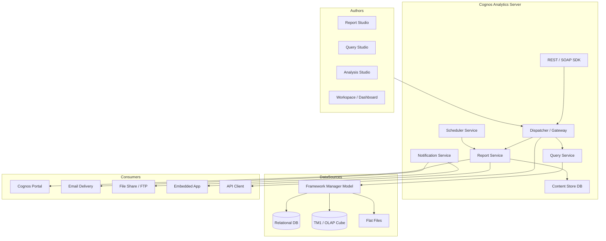
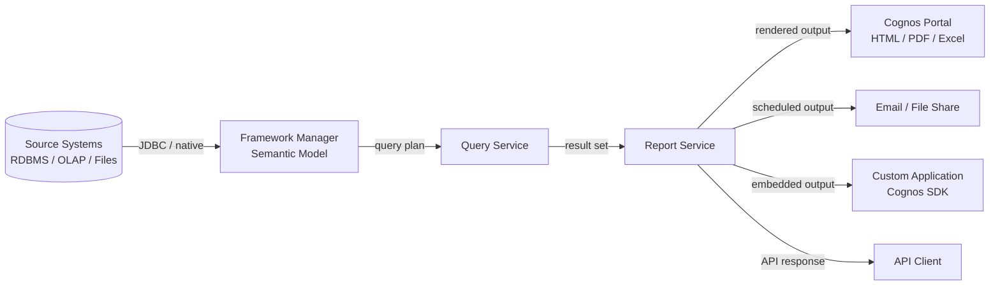

# IBM Cognos — SA Migration Guide

> This guide is written for Solution Architects assessing a customer's IBM Cognos estate and mapping it to a modern analytics platform on Databricks. It is not a developer or administrator how-to — focus is on understanding, scoping, and mapping.

---

## Platform Architecture



---

## Data Flow



---

## 1. Ecosystem Overview

### What IBM Cognos Is

IBM Cognos Analytics is IBM's enterprise BI and analytics platform. It sits in the traditional enterprise reporting segment alongside SAP BusinessObjects, MicroStrategy, and (historically) Oracle OBIEE. It is part of IBM's broader data and AI portfolio (which includes Watson, Planning Analytics / TM1, and IBM DataStage).

Cognos has been the operational reporting backbone for large enterprises — especially in financial services, government, healthcare, and manufacturing — for over two decades. Many customers running Cognos today inherited it from acquisitions or long-term IBM relationships, and the platform is deeply embedded in scheduled delivery workflows and OLAP-heavy reporting.

### Product Variants and Editions

| Variant | Description |
|---------|-------------|
| Cognos Analytics (on-prem) | The flagship server product; most enterprise customers run this. Current version is 12.x. |
| IBM Cognos Analytics on Cloud | SaaS-hosted version of Cognos Analytics, IBM-managed infrastructure |
| IBM Planning Analytics (TM1) | Separate product for financial planning and OLAP; often coexists with Cognos for reporting against TM1 cubes |
| Cognos Controller | Financial consolidation; not a BI tool per se but surfaces reports through Cognos |
| Embedded Analytics (Cognos Embedded) | SDK/API-based embedding of Cognos reports inside custom applications |

> **SA Tip:** Most customers saying "we use Cognos" mean the on-prem Cognos Analytics server. Ask specifically whether they also use Planning Analytics (TM1) — cube-based reports are a materially different migration challenge than SQL-based ones.

### Primary Use Cases

- **Operational reporting** — scheduled pixel-perfect reports for finance, HR, operations
- **Self-service analytics** — Query Studio and Workspace/Dashboard for business users
- **OLAP / cube-based analysis** — Analysis Studio against TM1 or other OLAP sources
- **Scheduled delivery** — burst reports sent to hundreds of recipients via email or file drop
- **Embedded BI** — Cognos reports embedded inside ERP, CRM, or custom portal applications via SDK

### Key Discovery Questions

| Question | Why It Matters |
|----------|---------------|
| How many reports/dashboards exist? How many are actively used (accessed in last 90 days)? | Active report count drives migration scope; most estates have 40–70% unused reports |
| How are reports consumed — portal, embedded in apps, scheduled delivery, API? | Embedded and scheduled delivery are the highest-effort migration targets |
| What data sources are connected — relational DBs, TM1/OLAP cubes, flat files, cloud? | OLAP/cube sources require semantic layer redesign, not just query repointing |
| What version/edition is the customer running? | Older versions (10.x, 11.x) may lack REST API access — limits inventory options |
| Are any reports embedded in custom applications? | Cognos SDK embedding has no direct equivalent; requires re-architecture |
| Is scheduled delivery (email/file drop) business-critical? | Burst delivery with dynamic recipient lists is the hardest capability to replace |
| How is row-level security and access enforced? | Cognos security can be model-layer (Framework Manager) or server-layer (data module filters) |
| Is Framework Manager in use, or are reports querying sources directly? | FM-based estates require semantic layer migration planning, not just report migration |

---

## 2. Component Architecture

| Component | Role | What breaks if gone | Migration Equivalent | SA Note |
|-----------|------|---------------------|----------------------|---------|
| **Dispatcher / Gateway** | Entry point for all HTTP requests; routes to appropriate service | All access to Cognos fails | API Gateway / load balancer | Stateless router — not a migration risk itself |
| **Report Service** | Executes report specifications, fetches data, renders output | All reports fail to render | Databricks SQL + Lakeview / partner BI render engine | Core migration target |
| **Query Service** | Translates semantic model queries into data source queries | Data retrieval fails | Databricks SQL warehouse / Unity Catalog | Must map FM packages to SQL queries |
| **Content Store DB** | Relational database (DB2 or Oracle) storing all report definitions, schedules, security, and metadata | All content lost; no reports, schedules, or users | Databricks workspace catalog / partner BI content store | Most critical inventory source; query it directly |
| **Framework Manager (FM)** | Desktop tool that defines semantic model packages (business layer over data sources) | Reports using FM packages lose their data layer | dbt models / Unity Catalog views / partner BI semantic layer | FM packages are not migrated — they must be redesigned |
| **Scheduler Service** | Triggers report execution on schedule; manages burst delivery | Scheduled and burst delivery stops | Databricks Workflows / partner BI native scheduling | Burst logic (dynamic recipients, parameter injection) often has no direct equivalent |
| **Notification / Delivery Service** | Sends email, writes to file share / FTP | Email and file-drop delivery stops | Databricks Workflows + SMTP step / partner BI subscriptions | Dynamic recipient lists (burst) require custom logic |
| **Cognos Connection / Portal** | Web UI for browsing, running, and managing reports | Users lose self-service access | Databricks SQL workspace / Power BI service / Tableau Cloud | Portal folder structure maps loosely to workspace folders |
| **REST API / SOAP API** | Programmatic access to run reports, manage content, extract metadata | Automated pipelines and embedded apps break | Databricks REST API / partner BI API | Version 11.1+ has REST; older versions SOAP-only |
| **Cognos SDK (Embedded)** | JavaScript/Java SDK for embedding Cognos reports in custom apps | Embedded app BI breaks entirely | Power BI Embedded / Tableau Embedded | No direct equivalent; requires re-architecture |
| **Data Modules** | Browser-based data modeling (lighter-weight alternative to FM) | Self-service data blending breaks | Databricks SQL queries / Unity Catalog views | Newer feature — check if in use |

> **SA Tip:** The Content Store DB is your most valuable discovery asset. It contains the full inventory of reports, schedules, security assignments, and access history. Get direct DB access (read-only) early — it unlocks inventory queries that the Cognos UI cannot provide at scale.

---

## 3. Artifact Lifecycle

| Stage | What Happens | Where (Server/Client) | Artifact Involved | Migration Risk |
|-------|-------------|----------------------|-------------------|----------------|
| **Author** | Developer opens Report Studio (or Query Studio / Analysis Studio) and builds a report specification | Client (desktop app or browser) | Report specification (XML) | Tool replacement needed — no Report Studio equivalent |
| **Save / Publish** | Report spec is saved to Content Store DB via Content Manager API | Server (Content Store DB) | `.report` blob in CM_REPORTSPEC table | Content can be exported as XML; structure is Cognos-proprietary |
| **Compile** | At render time, Report Service compiles the report spec against the FM package or data module to resolve queries | Server | Compiled query plan (internal, ephemeral) | No pre-compilation — every run re-compiles; impacts performance analysis |
| **Execute** | Query Service generates and sends SQL (or MDX for OLAP) to the data source; result set returned to Report Service | Server (query runs on data source) | Result set (in-memory) | SQL can be captured; MDX requires OLAP source migration |
| **Render** | Report Service renders output to HTML, PDF, Excel, CSV, XML | Server-side rendering | Rendered output stream | PDF/pixel-perfect fidelity is hard to replicate in Lakeview |
| **Deliver** | Output sent to portal (HTML), email (PDF/Excel), file share, or embedded app | Server → client / external | Rendered file or HTML payload | Scheduled / burst delivery requires orchestration redesign |

> **SA Tip:** Cognos is fully server-side — no client-side query execution. This simplifies data security analysis (all queries run on the server under a service account or user impersonation) but means the server is a single point of control for all access.

---

## 4. Data Sources and Dataset Model

### How Connections Are Managed

Cognos separates data source connections into two layers:

1. **Framework Manager Package** — A semantic model built in the FM desktop tool that defines joins, calculations, filters, and business naming on top of raw data sources. Reports query the FM package, not the data source directly.
2. **Data Source Connection** — The physical connection (JDBC, native driver) registered in the Cognos administration console. FM packages reference these connections.

This two-layer model means migrating a Cognos report is not just repointing a query — the semantic layer must be rebuilt (typically as dbt models, Unity Catalog views, or a partner BI semantic layer).

### Data Source Types

| Data Source Type | Frequency in Customer Estates | Migration Path | Risk |
|-----------------|------------------------------|----------------|------|
| Relational (SQL Server, Oracle, DB2, Teradata) | Very high | Databricks SQL warehouse; repoint queries | Low–Medium — SQL is portable but FM abstractions must be rebuilt |
| TM1 / Cognos Planning Analytics (OLAP cube) | High in finance/planning-heavy customers | Redesign as Databricks SQL + aggregation views; no MDX | High — MDX queries and cube hierarchies have no direct equivalent |
| Generic OLAP / XMLA sources | Medium | Depends on source; may require ETL-first | High |
| Flat files (CSV, Excel uploads) | Medium | Ingest to Delta Lake; expose via Unity Catalog | Low–Medium |
| SAP BW / BEx | Low–Medium in SAP shops | SAP connector or extract-and-load pattern | High |
| Cloud sources (Salesforce, REST APIs) | Low–Medium | Databricks partner connectors or ingestion pipeline | Medium |
| IBM Db2 (native) | High in IBM-centric customers | JDBC to Databricks or migrate data first | Medium |

### Parameters and Filters

Cognos supports prompt pages (parameter prompts presented to users before report execution) and cascading prompts (the value of one prompt filters the options in the next). Parameter values are passed at execution time — they are not stored as dataset-level filters.

> **SA Tip:** Cascading prompts are common in operational reports and require explicit handling in the migration. In Databricks SQL / Lakeview, parameters are dashboard-level filters — cascading logic must be rebuilt. In Power BI, this maps to cascading slicers. Ask the customer how many reports use cascading prompts.

---

## 5. Rendering and Delivery Model

### Rendering Modes

| Mode | How It Works | Typical Use |
|------|-------------|------------|
| On-demand (interactive) | Report executes at the moment the user opens it; fresh data | Self-service portal users |
| Cached / saved output | Previous run output stored in Content Store; served without re-querying | High-traffic reports; reduces DB load |
| Snapshot / burst output | Scheduled run produces output files stored for specific recipients | Burst delivery; personalized outputs |

### Delivery Modes

| Delivery Mode | How It Works | Business Use Case | Migration Equivalent | Risk |
|--------------|-------------|-------------------|----------------------|------|
| Cognos Connection Portal | Interactive HTML in browser | Self-service, ad hoc | Databricks SQL / Power BI / Tableau workspace | Low |
| Direct URL | Parameterized URL to run a specific report | Bookmarked reports, simple embedding | Partner BI report URL | Low |
| Email subscription | Scheduled run emails PDF/Excel to a recipient list | Finance reports, operational alerts | Databricks Workflows + SMTP / partner BI subscriptions | Medium |
| Burst delivery | One schedule generates personalized outputs for many recipients based on a data-driven recipient list | Finance: per-region P&L to 200 regional managers | Custom Databricks Workflow + partner BI API | High — no direct equivalent |
| File share / FTP drop | Scheduled run writes output to a shared drive or FTP location | Downstream systems consuming reports as files | Databricks Workflows writing to ADLS / S3 | Medium |
| Embedded via SDK | Cognos JavaScript or Java SDK embeds report inside a custom app | ERP portals, custom internal tools | Power BI Embedded / Tableau Embedded | High — full re-architecture |
| REST API / SOAP API | Programmatic report execution; output returned via API | ETL pipeline triggers, app integration | Partner BI API | Medium |

> **SA Tip:** Burst delivery is the highest-risk Cognos capability. It uses a "data item" (a query result) to dynamically determine who gets which version of a report — essentially a data-driven distribution list with per-recipient parameter injection. There is no native equivalent in Lakeview or standard partner BI scheduling. Flag this as a custom engineering workstream if the customer relies on it.

---

## 6. Project Structure and Version Control

### Server Organization

Cognos organizes content in a **folder hierarchy** stored in the Content Store DB. The hierarchy mirrors a file system with folders, subfolders, and individual report objects. Key system folders include:

- **My Folders** — per-user private content
- **Public Folders** — shared content visible to all (subject to permissions)
- **Packages** — FM packages (semantic models) deployed to the server

There is no concept of a "project file" on disk that contains a report — all content lives in the Content Store DB as blobs.

### Version Control

Cognos has no native version control. It has a basic version history feature (stores previous saved versions of a report spec) but this is not a VCS substitute. Most customers do not maintain source-controlled copies of their Cognos report XML — the Content Store is the source of truth.

> **SA Tip:** This is a common gap. Ask the customer directly: "Do you have report definitions checked into a version control system, or is the Cognos server your only copy?" For most customers, the answer is the server — meaning a Content Store export is the only way to recover report definitions.

### Environment Promotion

Cognos uses **Deployment Archives** (`.zip` packages containing selected content) to move artifacts between Dev, QA, and Prod environments. The Cognos Administration console manages deployments. There is also a command-line tool (`cognosconfig`, `cmrestore`) for export/import.

### CLI and Scripting Tools

| Tool | Purpose |
|------|---------|
| `cognosconfig` | Server configuration management |
| Deployment Manager (admin console) | Export/import content between environments |
| Cognos SDK / REST API | Programmatic content export and management |
| `cmrestore` / `cmexport` | Content Store backup/restore |
| IBM Lifecycle Manager | Third-party-style promotion tool (limited adoption) |

---

## 7. Orchestration and Scheduling

### Built-in Scheduler

Cognos has a native scheduler integrated into the server. Schedules are stored in the Content Store DB and managed through the Cognos portal or administration console. Reports can be scheduled to run:

- On a fixed time/recurrence
- Triggered by an event (another report completing, a file appearing)
- Via external trigger through the REST/SOAP API

### Subscriptions and Burst Delivery

**Subscriptions** allow individual users to schedule their own personal delivery of a report (email, save to My Folders). **Burst delivery** is a server-side feature where a single schedule run generates personalized output versions for multiple recipients, driven by a query that returns a recipient list with per-recipient parameter values.

> **SA Tip:** Burst delivery is often invisible in the report count — one report with a burst schedule might deliver to 500 recipients. Ask "are there any reports that generate hundreds of individual outputs per run?" before sizing the migration effort.

### External Triggers

Cognos reports can be triggered via the REST API (v11.1+) or SOAP API. This is used in ETL pipelines that refresh data and then trigger a Cognos report to run or a cache to refresh.

### Migration Targets

| Cognos Scheduling Feature | Migration Target |
|--------------------------|-----------------|
| Fixed-schedule reports | Databricks Workflows / Power BI scheduled refresh / Tableau extract refresh |
| Event-triggered reports | Databricks Workflows with dependency chains |
| Subscriptions (user-managed) | Power BI subscriptions / Tableau subscriptions |
| Burst delivery | Custom Databricks Workflow + partner BI API (engineering effort required) |
| API-triggered report runs | Databricks Workflows API / partner BI API |

---

## 8. Metadata, Lineage, and Impact Analysis

### Where Metadata Lives

All metadata lives in the **Content Store DB** — a relational database (DB2 or Oracle) managed by Cognos. IBM provides documentation on the schema but does not officially support direct querying. In practice, direct SQL queries against the Content Store are the fastest way to inventory a large Cognos estate.

### Key Tables and Queries

The Content Store schema is not fully documented publicly, but the following tables are commonly used for inventory:

| Table | Contents |
|-------|----------|
| `CMOBJPROPS7` | Core object properties: name, type, path, timestamps |
| `CMOBJECTS` | Object hierarchy (parent/child relationships) |
| `CMOBJPROPS14` | Schedule definitions |
| `CMCLASSES` | Object type definitions (report, dashboard, package, etc.) |
| `CMOBJPROPS1` | Owner and permission assignments |
| `COGIPF_RUNHISTORY` | Execution history / audit log (if enabled) |

> **SA Tip:** The audit log (`COGIPF_RUNHISTORY` or the Cognos Audit database, if configured separately) is the single most valuable artifact for scoping a migration. It shows which reports have actually been run, by whom, and how often — letting you immediately separate the active 30% from the dormant 70%. Ask early whether audit logging is enabled and where the audit DB is.

### Sample Inventory Queries

**Count reports by type:**
```sql
SELECT c.CMOBJCLASS, COUNT(*) AS cnt
FROM CMOBJECTS o
JOIN CMCLASSES c ON o.CMCLASS = c.CMCLASSID
WHERE c.CMOBJCLASS IN ('report', 'reportView', 'query', 'analysis', 'dashboard')
GROUP BY c.CMOBJCLASS;
```

**Identify unused reports (not run in 90 days, if audit DB exists):**
```sql
SELECT p.CMNAME, p.CMREFPATH, MAX(r.RUNTIMESTAMP) AS last_run
FROM CMOBJPROPS7 p
LEFT JOIN COGIPF_RUNHISTORY r ON p.CMID = r.REPORTID
GROUP BY p.CMNAME, p.CMREFPATH
HAVING MAX(r.RUNTIMESTAMP) < CURRENT_DATE - 90
   OR MAX(r.RUNTIMESTAMP) IS NULL;
```

**List data source connections:**
```sql
SELECT p.CMNAME, p.CMREFPATH, ds.DATASOURCETYPE
FROM CMOBJPROPS7 p
JOIN CMOBJDATASOURCES ds ON p.CMID = ds.CMID;
```

**List scheduled reports:**
```sql
SELECT p.CMNAME, p.CMREFPATH, s.SCHEDRECURRENCE
FROM CMOBJPROPS7 p
JOIN CMOBJPROPS14 s ON p.CMID = s.CMID;
```

### Lineage

Cognos has no native lineage. Lineage must be inferred by parsing the XML report specification to extract referenced FM packages, FM query subjects, and ultimately the underlying data source tables. This is a manual or scripted process.

---

## 9. Data Quality and Governance

### Row-Level Security

Cognos implements row-level security in two places:

1. **Framework Manager model layer** — Filters defined in the FM package restrict data at query generation time based on the user's Cognos group/role membership. This is the most common pattern.
2. **Data Module / dynamic filters** — Newer mechanism using session parameters and user profile attributes to inject filter conditions.
3. **Database-level security** — Some customers enforce RLS at the database view level and rely on service account impersonation or per-user DB credentials.

> **SA Tip:** FM-layer RLS is invisible to the report — the filter is baked into the query plan by the Query Service. Migrating this to Unity Catalog row filters requires understanding the FM model, not just reading the report XML.

### Column-Level Security

Cognos does not have native column-level security on the BI layer. Column access is controlled by omitting columns from FM query subjects or by database-level permissions. Migration target is Unity Catalog column masks.

### Data Freshness and Caching

Cognos supports output caching (storing rendered report output) and data caching (caching intermediate result sets). Cache policies are set per report or per schedule. This is used heavily in operational reporting environments to reduce database load.

### Custom Code and Scripting

| Custom Code Type | Where It Appears | Migration Risk |
|-----------------|-----------------|----------------|
| Report expressions (conditional formatting, calculations) | Report XML | Medium — must be rebuilt in target BI tool |
| FM calculations and filters | FM package | High — FM layer disappears; logic must move to dbt/SQL |
| Custom HTML / JavaScript in report bodies | Report XML (HTML item) | High — no equivalent in Lakeview; limited in Power BI |
| Cognos SDK JavaScript embedding | Custom application code | High — full re-architecture required |
| Macro/prompt expressions | Report prompt pages | Medium — must be rebuilt as dashboard filters |

---

## 10. File Formats and Artifact Reference

### Report Specification (`.report` / XML blob)

**What it is:** The definition of a Cognos report — layout, data items, queries, parameters, conditional formatting, and FM package reference. Stored as an XML blob in the Content Store DB; can be exported as an XML file.

| Property | Value |
|----------|-------|
| Created by | Report Studio, Query Studio, Analysis Studio |
| Stored in | Content Store DB (binary/XML blob) |
| Contains | Report layout, query definitions, parameter prompts, formatting |
| Human-readable | Yes (XML), but complex and proprietary schema |
| Migration target | Rebuild in Lakeview / Power BI / Tableau |

**Example snippet:**
```xml
<report xmlns="http://developer.cognos.com/schemas/report/14.1/" ...>
  <modelPath>//content/package[@name='Sales FM Package']</modelPath>
  <queries>
    <query name="Query1">
      <source><model/></source>
      <selection>
        <dataItem name="Revenue" aggregate="total">
          <expression>[Sales].[Revenue]</expression>
        </dataItem>
      </selection>
    </query>
  </queries>
</report>
```

> **SA Tip:** The `<modelPath>` element tells you which FM package the report depends on. Parsing this across all exported report XMLs gives you the FM package dependency map — critical for sequencing the migration (migrate the package/semantic layer before the reports that depend on it).

---

### Framework Manager Package (`.cpf` project / deployed package)

**What it is:** The semantic model project file. The `.cpf` file is the FM desktop project (a folder containing XML files). When published to the server, the package is stored in the Content Store as a deployable object.

| Property | Value |
|----------|-------|
| Created by | Framework Manager (desktop tool) |
| Stored in | FM project: local filesystem (`.cpf` folder); deployed: Content Store DB |
| Contains | Data source references, query subjects, joins, calculations, security filters, namespaces |
| Human-readable | Yes (XML within the `.cpf` folder) |
| Migration target | dbt models + Unity Catalog views, or partner BI semantic layer (Power BI dataset, Tableau data source) |

> **SA Tip:** Most customers do not have FM projects checked into source control — the deployed package in the Content Store is the only copy. Exporting the FM package XML from the Content Store and parsing it is the best way to understand the semantic layer structure without needing access to the FM desktop tool.

---

### Deployment Archive (`.zip`)

**What it is:** A deployment package used to move content between Cognos environments. Created via the Administration console or SDK. Contains selected reports, packages, and security objects.

| Property | Value |
|----------|-------|
| Created by | Cognos Administration console / SDK |
| Stored in | Filesystem (Cognos server export directory) |
| Contains | Selected Content Store objects in a structured ZIP |
| Human-readable | Partially — ZIP containing XML files |
| Migration target | Source material for bulk report export; not a migration artifact itself |

> **SA Tip:** Use Deployment Archives to bulk-export all reports from the Content Store into portable XML. This is the starting point for any automated migration tooling.

---

### Data Source Connection (Content Store object)

**What it is:** A registered data source connection stored in the Content Store, referenced by FM packages. Analogous to a DSN or connection string registry.

| Property | Value |
|----------|-------|
| Created by | Cognos Administration console |
| Stored in | Content Store DB |
| Contains | Connection type, JDBC URL, authentication method, connection pool settings |
| Human-readable | Queryable via Content Store DB |
| Migration target | Databricks SQL warehouse connection / Unity Catalog external location |

---

### Schedule / Subscription Definition (Content Store object)

**What it is:** A schedule or user subscription stored as a Content Store object associated with a report.

| Property | Value |
|----------|-------|
| Created by | Cognos portal (users/admins) |
| Stored in | Content Store DB (`CMOBJPROPS14`) |
| Contains | Recurrence, delivery options, recipient list, parameter values |
| Human-readable | Queryable via Content Store DB |
| Migration target | Databricks Workflows / partner BI subscriptions |

---

### Artifact Summary Table

| Artifact | Extension / Location | Human-Readable | Where Stored | Migration Target | Risk |
|----------|----------------------|----------------|--------------|-----------------|------|
| Report specification | XML blob / `.xml` export | Yes | Content Store DB | Rebuild in target BI tool | High |
| FM package (project) | `.cpf` folder (local) | Yes | Local filesystem + Content Store (deployed) | dbt + Unity Catalog views | High |
| Deployment Archive | `.zip` | Partially | Cognos server filesystem | Source material for export | Low |
| Data source connection | Content Store object | Via DB query | Content Store DB | Databricks SQL warehouse | Low–Medium |
| Schedule / subscription | Content Store object | Via DB query | Content Store DB | Databricks Workflows / partner BI | Medium–High |
| Burst definition | Content Store object | Via DB query | Content Store DB | Custom workflow engineering | Critical |
| Output cache / snapshot | Content Store / filesystem | No | Content Store DB + filesystem | Not migrated (re-generate) | Low |

---

## 11. Migration Assessment and Artifact Inventory

### How to Inventory the Estate

**Preferred method:** Direct SQL queries against the Content Store DB (read-only access). This is faster, more complete, and more reliable than the Cognos UI or API for large estates.

**Why not the UI:** The portal only shows content in the folder hierarchy; it does not expose system-generated objects, burst output archives, or orphaned objects. Counts from the UI are consistently lower than the actual Content Store count.

**Alternative:** Cognos REST API (v11.1+) — `/api/v1/reports`, `/api/v1/datasources`, `/api/v1/schedules`. Use if direct DB access is not available, but rate-limit and pagination handling is required.

### Complexity Scoring

| Dimension | Low | Medium | High | Critical |
|-----------|-----|--------|------|----------|
| Data source type | Single relational SQL | Multiple relational sources | OLAP/TM1 cubes + relational | MDX-heavy + multiple OLAPs |
| Query / dataset complexity | Simple SELECT from FM subject | Joins, calculations, FM filters | Stored procs, complex FM models | MDX, multi-cube calculations |
| Parameter complexity | None or simple static | Single-level prompts | Cascading prompts | Data-driven / dynamic prompts |
| Custom code | No expressions | Report-level expressions | FM calculations + HTML items | SDK extensions + custom JavaScript |
| Subreport / drill-through nesting | None | 1 level | 2–3 levels | Deep nesting + cross-package drill |
| Delivery complexity | Portal only | Email subscriptions | File share + subscriptions | Burst delivery + embedded app |
| Security model | Public / role-based folder | Simple FM-layer row filters | Dynamic user-attribute filters | Multi-tenant burst with per-user RLS |

### Top Migration Risks to Flag Early

1. **TM1 / OLAP cube dependencies** — MDX queries and cube hierarchies have no equivalent in Databricks SQL. These reports require the most redesign effort.
2. **Burst delivery** — Data-driven personalized distribution to many recipients is not available out of the box in any common Databricks migration target.
3. **Framework Manager as the semantic layer** — The FM model disappears in the migration; all business logic embedded there must be identified and rebuilt before reports can be migrated.
4. **Embedded Cognos SDK** — Any custom application using the Cognos JavaScript or Java SDK to embed reports requires full re-architecture using Power BI Embedded or Tableau Embedded.
5. **Audit logging not enabled** — Without the audit DB, there is no reliable usage data. Migration scope cannot be right-sized; all reports are equally "in scope" by default.
6. **Content Store is the only source of truth** — No version control means the export process is one-shot. Any failure to export cleanly loses the report definition.

### Sample Inventory Query

```sql
SELECT
    p.CMNAME                          AS report_name,
    p.CMREFPATH                       AS report_path,
    c.CMOBJCLASS                      AS report_type,
    MAX(r.RUNTIMESTAMP)               AS last_run_date,
    COUNT(r.RUNID)                    AS run_count_90d,
    ds.DATASOURCETYPE                 AS data_source_type,
    CASE WHEN pr.CMID IS NOT NULL THEN 'Y' ELSE 'N' END AS has_parameters,
    CASE WHEN sc.CMID IS NOT NULL THEN 'Y' ELSE 'N' END AS has_schedule
FROM CMOBJPROPS7 p
JOIN CMCLASSES c ON p.CMCLASS = c.CMCLASSID
LEFT JOIN COGIPF_RUNHISTORY r
    ON p.CMID = r.REPORTID
    AND r.RUNTIMESTAMP >= CURRENT_DATE - 90
LEFT JOIN CMOBJDATASOURCES ds ON p.CMID = ds.CMID
LEFT JOIN CMOBJPROMPTS pr ON p.CMID = pr.CMID
LEFT JOIN CMOBJPROPS14 sc ON p.CMID = sc.CMID
WHERE c.CMOBJCLASS IN ('report', 'reportView', 'query', 'analysis', 'dashboard')
GROUP BY p.CMNAME, p.CMREFPATH, c.CMOBJCLASS, ds.DATASOURCETYPE, pr.CMID, sc.CMID
ORDER BY run_count_90d DESC;
```

---

## 12. Migration Mapping to Databricks

### Core Concept Mapping

| Cognos Concept | Databricks / Partner BI Equivalent | Notes |
|---------------|-----------------------------------|-------|
| Report Studio report | Lakeview dashboard / Power BI report / Tableau workbook | Layout fidelity varies; pixel-perfect PDF reports are hardest |
| Query Studio ad hoc query | Databricks SQL query editor / Power BI Q&A | Self-service replace |
| Analysis Studio OLAP analysis | Power BI matrix / Tableau cross-tab (against Databricks SQL) | Requires OLAP source to be flattened into Delta tables first |
| Cognos Dashboard / Workspace | Lakeview dashboard / Power BI dashboard | Closest functional match |
| FM package (semantic model) | dbt models + Unity Catalog views / Power BI dataset / Tableau published data source | Must be rebuilt; not migrated |
| Data source connection | Databricks SQL warehouse + Unity Catalog external catalog | Configure once; shared across reports |
| Dataset / query subject | Databricks SQL query / dbt model | Rewrite in SQL against Delta tables |
| Row-level security (FM layer) | Unity Catalog row filters | Rebuild filter logic in UC; apply to underlying tables |
| Column-level security | Unity Catalog column masks | Set at table/view level in UC |
| Cognos portal (folder hierarchy) | Databricks SQL workspace folders / Power BI workspaces / Tableau projects | Rough structural match |
| Scheduled report | Databricks Workflows / Power BI scheduled refresh / Tableau extract refresh | Standard scheduling maps well |
| Email subscription | Databricks Workflows + SMTP / Power BI subscriptions | Maps with moderate effort |
| Burst delivery | Custom Databricks Workflow + partner BI API | Engineering required; no native equivalent |
| File share / FTP delivery | Databricks Workflows writing to ADLS / S3 | Standard workflow pattern |
| Cognos SDK embedding | Power BI Embedded / Tableau Embedded | Re-architecture required |
| Deployment Archive (promotion) | Databricks workspace import/export / partner BI deployment pipelines | Standard DevOps tooling |
| Content Store (catalog) | Databricks workspace + Unity Catalog | Distributed across UC and workspace |

### What Doesn't Map Cleanly

| Cognos Capability | Why It Doesn't Map | SA Recommendation |
|------------------|-------------------|-------------------|
| **Burst delivery** | No BI tool natively replicates data-driven personalized distribution to a dynamic recipient list with per-recipient parameter injection | Design as a Databricks Workflow: loop over recipients, call Power BI or Tableau API per recipient, send email via SMTP or notification service |
| **Framework Manager semantic model** | FM packages define business logic, joins, security filters, and naming in a proprietary model that is not exported as SQL | Rebuild as dbt models (transformation layer) + Unity Catalog views (semantic layer); treat this as a separate workstream from report migration |
| **Pixel-perfect PDF reports** | Lakeview and most modern BI tools are not layout-precise; pixel-perfect output for print/regulatory documents requires a dedicated tool | Consider SSRS, paginated Power BI reports, or a document generation service for reports that must match a regulatory or print format exactly |
| **OLAP / MDX analysis (TM1)** | Databricks SQL is not an OLAP engine; MDX has no equivalent | Flatten cubes to Delta tables via ETL; redesign MDX calculations as SQL aggregations or dbt models — significant effort |
| **Custom HTML / JavaScript in report bodies** | Cognos allows HTML items with embedded JS in report layouts; no equivalent in Lakeview, limited in Power BI | Rebuild as standard BI visuals; for complex interactivity, consider custom Power BI visuals or a separate web application |
| **Cognos event-based scheduling triggers** | Cognos can trigger report execution when another report completes or a file appears | Use Databricks Workflows dependencies or file-arrival triggers in cloud storage (S3/ADLS event notifications) |

---

## 13. Quick-Reference Cheat Sheet

| Topic | Key Fact | SA Question to Ask |
|-------|----------|--------------------|
| Report count heuristic | Expect 40–70% of reports to be unused; active count is typically 30–60% of total inventory | "Has anyone done a usage review recently — do you know which reports are actually being used?" |
| Usage data location | Content Store DB audit tables (`COGIPF_RUNHISTORY`) or separate Cognos Audit DB | "Is Cognos audit logging enabled? Where is the audit database?" |
| Source of truth | Content Store DB is the only copy of report definitions for most customers | "Do you have report XML checked into source control, or is the Cognos server the only copy?" |
| Top migration risk #1 | TM1/OLAP cube reports — MDX has no Databricks equivalent | "How many of your reports query TM1 or OLAP cubes vs. relational databases?" |
| Top migration risk #2 | Burst delivery — no native equivalent in any common migration target | "Are there any reports that send personalized outputs to hundreds of recipients in a single scheduled run?" |
| Top migration risk #3 | FM semantic model — must be rebuilt before reports can be migrated | "Is Framework Manager in use? Do you have the FM project files, or only the deployed packages on the server?" |
| Embedded app reports | Cognos SDK embedding requires full re-architecture | "Are any Cognos reports embedded inside custom applications using the Cognos SDK or API?" |
| Inventory blocker | Audit logging may be disabled — no usage data without it | "Can you give us read-only access to the Content Store DB and the Cognos Audit DB?" |
| Version impact | Cognos 10.x/11.0 lacks REST API — inventory via direct DB query only | "What version of Cognos are you running?" |
| Security model | RLS is typically in the FM layer — invisible at the report level | "Where is row-level security defined — in Framework Manager, in the database, or in both?" |
