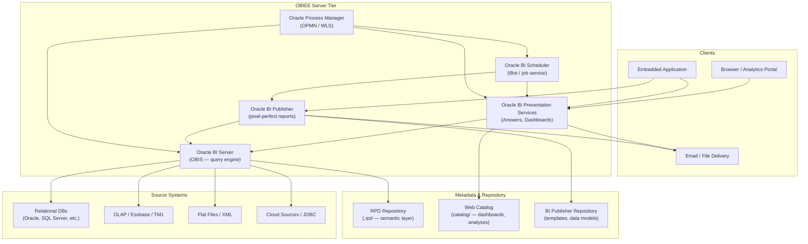
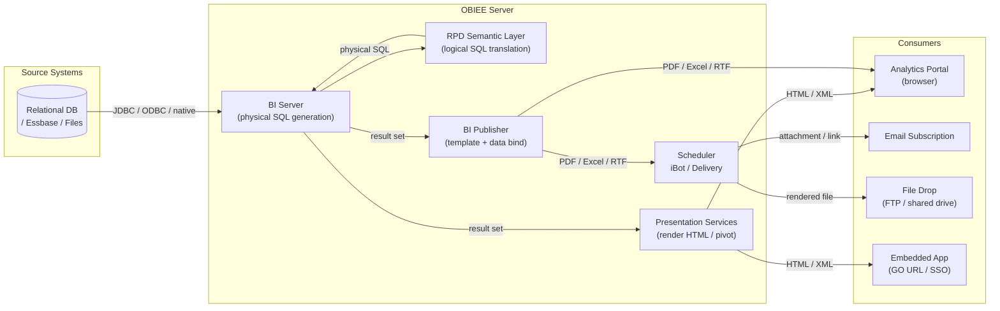

# Oracle Business Intelligence Enterprise Edition (OBIEE)

A migration reference for Solution Architects assessing a customer's OBIEE estate and mapping it to Databricks SQL, Lakeview dashboards, or a connected BI layer (Power BI, Tableau).

---

## Platform Architecture



## Data Flow



---

## 1. Ecosystem Overview

Oracle Business Intelligence Enterprise Edition (OBIEE) is Oracle's on-premises enterprise BI platform, built around a **semantic layer** that abstracts physical data sources into a logical business model. First released as Siebel Analytics, it became the dominant Oracle BI platform for over two decades. Its current Oracle-maintained successor is **Oracle Analytics Server (OAS)** for on-premises, and **Oracle Analytics Cloud (OAC)** for SaaS — both use the same core RPD-based architecture.

**Where it fits:** OBIEE sits in the *enterprise reporting and governed analytics* segment — competing historically with SAP BusinessObjects, IBM Cognos, and MicroStrategy. It is common in Oracle-heavy shops (EBS, Siebel, PeopleSoft, Fusion) because Oracle ships pre-built RPDs and content for its own applications.

**Product variants:**

| Variant | Delivery model | Key difference |
|---------|---------------|----------------|
| OBIEE 11g | On-premises | WebLogic-based; most common legacy version |
| OBIEE 12c | On-premises | Updated UI (BICS-style), same RPD model |
| Oracle Analytics Server (OAS) | On-premises | Current Oracle-supported successor to 12c |
| Oracle Analytics Cloud (OAC) | SaaS (OCI) | Managed; same RPD + adds ML/augmented analytics |
| Oracle BI Applications (OBIA) | On-premises add-on | Pre-built content for Oracle ERP/CRM |

**Why customers use it:**

- Governed, semantic-layer-driven reporting in Oracle ERP environments
- Pixel-perfect operational reports via BI Publisher (invoices, financial statements)
- Ad-hoc analysis via Answers with the RPD hiding database complexity
- Scheduled delivery of reports to hundreds of recipients via iBots
- Dashboard portal for executives and operations teams

**Key discovery questions to ask:**

- How many analyses, dashboards, and BI Publisher reports exist? How many are actively used?
- How are reports consumed — Analytics Portal, scheduled email, file drops, embedded in Oracle EBS/Fusion?
- What data sources are connected — Oracle DB, SQL Server, Essbase, flat files, cloud?
- What version is running — OBIEE 11g, 12c, OAS, or OAC?
- Are any reports embedded in custom applications via GO URL or SSO tokens?
- Is scheduled delivery (iBots) business-critical? Who owns the distribution lists?
- How is row-level security enforced — RPD session variables, VPD, or BI Server security filters?
- Is there a pre-built Oracle application content pack (OBIA) deployed?

---

## 2. Component Architecture

| Component | Role | Migration Equivalent | SA Note |
|-----------|------|---------------------|---------|
| **Oracle BI Server (OBIS)** | Core query engine; translates logical SQL from the RPD into physical SQL against source DBs | Databricks SQL Warehouse | The semantic layer lives here — migrating it means rebuilding logical models in dbt, Databricks SQL, or a partner BI semantic layer |
| **Oracle BI Presentation Services** | Web application layer; serves the Analytics Portal (Answers + Dashboards) to browsers | Databricks SQL / Lakeview / Power BI Service | Hosts all interactive dashboards and ad-hoc analyses; stores artifacts in the Web Catalog |
| **Oracle BI Publisher (BIP)** | Separate pixel-perfect reporting engine; template-driven, output-format-agnostic | SSRS / Power BI paginated reports / custom ETL output | Often used for operational documents (invoices, GL reports) — these are a separate migration stream from dashboard content |
| **BI Scheduler (iBot service)** | Manages scheduled delivery: runs jobs, evaluates conditions, sends emails, drops files | Databricks Workflows + partner BI native scheduling | iBots can embed business logic (conditional delivery, dynamic recipient lists) — not just a cron job |
| **RPD Repository (.rpd)** | Binary file containing the entire semantic/metadata layer: physical, business, and presentation layers | Unity Catalog + dbt semantic layer / partner BI semantic model | The most migration-critical artifact — all logical column names, joins, hierarchies, and security filters live here |
| **Web Catalog (`catalog/`)** | File-system directory storing all analyses, dashboards, KPIs, prompts, and saved filters | Partner BI content store | Can be exported as a directory tree or via catalog manager — source of truth for all interactive content |
| **BI Publisher Repository** | File-system directory storing report templates (RTF, XSL), data models (.xdm), and layout files | Depends on target; SSRS for paginated, custom for documents | Separate from the Web Catalog; often overlooked in migrations |
| **Oracle Process Manager (OPMN/WLS)** | Process supervision and clustering — starts/stops BI components, manages WebLogic instances | Platform ops layer (not migrated; managed by Databricks/cloud) | Failure here takes down the entire stack; customers with manual OPMN restarts are a reliability risk |

---

## 3. Artifact Lifecycle

| Stage | What happens | Where | Artifact involved | Migration risk |
|-------|-------------|-------|-------------------|---------------|
| **Author** | Developer builds logical model in BI Administration Tool (RPD editor); analyst builds analysis in Answers or creates Publisher report | Client (RPD tool) / Browser (Answers) / Desktop (BIP Layout Editor) | `.rpd` file; web catalog XML entries; Publisher template (RTF/XSL) + data model (.xdm) | High — RPD semantic layer has no direct equivalent; must be rebuilt |
| **Deploy / Publish** | RPD uploaded to BI Server via Admin Tool or WLST script; Analyses/Dashboards saved directly to Web Catalog on server; Publisher content deployed to BIP repository | Server-side upload; Web Catalog written directly | `.rpd` binary; catalog directory structure; BIP repo files | Medium — catalog can be exported/imported; RPD requires manual offline merge |
| **Compile** | BI Server reads RPD at startup and caches the logical-to-physical mapping in memory; no separate compile step for analyses | Server (BI Server startup) | In-memory RPD cache | Low — compile is implicit; risk is that RPD changes require BI Server restart |
| **Execute** | User opens dashboard → Presentation Services generates Logical SQL → BI Server translates to Physical SQL using RPD → executes against source DB → returns result set | Server (OBIS + source DB) | Logical SQL / Physical SQL | High — RPD join trees and aggregate navigation rules are implicit; must be made explicit in target |
| **Render** | Result set returned to Presentation Services → rendered as HTML pivot/chart in browser, or fed to BI Publisher → rendered as PDF/Excel/HTML | Server-side (Presentation Services / BIP) → streamed to client | HTML, PDF, Excel, RTF, CSV, XML | Medium — pixel-perfect Publisher output has no clean Databricks equivalent |
| **Deliver** | Portal: browser renders inline. Subscription: Scheduler (iBot) re-runs report on schedule, emails output or drops file. Embedded: GO URL used for app integration | Server (Scheduler) → Email server / file share; Browser (portal) | Email attachment / file on shared drive / inline HTML | High — iBot conditional delivery logic must be reengineered; GO URL embedding must be replaced |

> **SA Tip:** Ask the customer whether their iBot subscriptions send a snapshot (cached output) or a fresh execution each time. Fresh-execution iBots at scale can hammer the source DB — and that load pattern must be replicated in the migration target or customers will notice.

---

## 4. Data Sources and Dataset Model

OBIEE manages data source connections **centrally in the RPD**. Physical connection pools are defined in the Physical layer, and all queries flow through the BI Server — analysts never write SQL directly against sources.

**How connections work:**
- Connection pools are defined once in the RPD Physical layer (hostname, driver, credentials)
- The Presentation layer exposes logical columns to analysts — no raw SQL visibility
- Query generation happens inside OBIS: logical SQL → physical SQL per connection
- BI Publisher has its own separate data model layer (.xdm) with independent JDBC connections

**Dataset / query model:**
- Analyses are built by dragging logical columns from Subject Areas (Presentation layer) — no dataset concept; every analysis re-queries at render time
- BI Publisher data models define named queries (SQL, stored procedures, web services) reused across templates
- No shared "dataset" tier analogous to Power BI datasets or Tableau data sources

| Data Source Type | Frequency in customer estates | Migration Path | Risk |
|-----------------|------------------------------|----------------|------|
| Oracle Database (EBS, Fusion, PeopleSoft) | Very high | Databricks SQL Warehouse with Unity Catalog tables federated from Oracle or replicated via ETL | High — stored procedure calls and Oracle-specific SQL functions require rewrite |
| Oracle Essbase / Hyperion | High (finance/planning shops) | Databricks Lakehouse + dbt models; no native Essbase support in Databricks | Critical — MDX queries and Essbase outline navigation must be rebuilt as dimensional models |
| SQL Server / DB2 / Teradata | Medium | Databricks SQL Warehouse (direct query or ETL-replicated) | Medium — standard SQL with some dialect differences |
| Flat Files / XML | Medium | Ingest to Delta Lake via ETL; Unity Catalog external tables | Low-Medium — file location stability is a risk |
| JDBC / ODBC generic | Low | Depends on source | Medium |

> **SA Tip:** Essbase connections in the RPD are a critical blocker. OBIEE's MDX-to-Essbase integration is deeply native. If the customer uses Essbase for planning or consolidation, that is a separate migration workstream (Essbase → Databricks Lakehouse) that must be scoped independently.

**Parameters and filters:**
- Presentation Variables and Session Variables in RPD drive cascading filters and row-level security
- Dashboard Prompts pass values via Presentation Variables to filter columns in analyses
- Session variables (e.g. `USER`, `GROUP`) are set at login and used in security filters — these are the RLS mechanism
- Cascading prompts (parent prompt filters child prompt values) are common in financial dashboards — medium migration complexity in Power BI/Tableau, higher in Lakeview

---

## 5. Rendering and Delivery Model

| Delivery Mode | How it works | Business use case | Migration equivalent | Risk |
|--------------|-------------|-------------------|---------------------|------|
| **Interactive Portal (Answers + Dashboards)** | Browser loads HTML; prompts refresh via HTTP calls to Presentation Services | Ad-hoc analysis, executive dashboards | Databricks SQL dashboards / Lakeview / Power BI Service | Low-Medium |
| **BI Publisher Portal** | Publisher renders template against data model on demand; output streamed to browser | Operational documents: invoices, GL statements, payroll | Power BI Paginated Reports / SSRS / custom generation | High — pixel-perfect layout must be rebuilt in a template engine |
| **iBot (Scheduled Delivery)** | Scheduler re-runs analysis or Publisher report on cron schedule; emails output or writes to file share | Ops reports, exception alerting, daily snapshots | Databricks Workflows + partner BI native scheduling | Medium-High |
| **Conditional iBot** | iBot evaluates a "condition analysis" (row count > 0) before triggering delivery — sends only when data meets criteria | Exception-based alerting (e.g. "send only if overdue orders exist") | Databricks Workflows with conditional task logic | High — business logic embedded in delivery; must be re-expressed |
| **Data-driven iBot (Bursting)** | iBot iterates over a result set, sends personalized report version to each recipient with dynamic filters | Personalized regional/product reports to 100s of managers | Power BI data-driven subscriptions / custom orchestration | Critical — no direct Databricks-native equivalent; requires custom Workflows |
| **GO URL (Embedded)** | URL-based embedding with SSO token passes filters and renders report inside host application iFrame | Embedded reporting in Oracle EBS or custom portals | Power BI Embedded / Tableau Embedded / Databricks iFrame | High — GO URL parameter passing must be remapped to partner BI embed API |
| **Agent / RSS Feed** | Personalized alerts via RSS or portal inbox | Exception notification | Partner BI alerts / email | Low |

> **SA Tip:** Data-driven iBot bursting is OBIEE's most-used enterprise delivery feature and has no clean single-step equivalent in Databricks. It requires either a Workflows loop or Power BI's data-driven subscription feature. Identify this early — it is often on the critical path for go-live sign-off.

---

## 6. Project Structure and Version Control

**How artifacts are organized:**

- **RPD:** A single binary file. All metadata for all subject areas lives in one file. Branching/merging requires the offline RPD merge tool (three-way merge). There is no Git-native workflow.
- **Web Catalog:** A directory tree under `$ORACLE_INSTANCE/bifoundation/OracleBIPresentationServicesComponent/coreapplication_obips1/catalog/`. Folders map 1:1 to the portal folder hierarchy. Files are XML with `.xanalytics`, `.xdash`, `.xprompt` extensions.
- **BI Publisher:** A separate directory tree under the BIP repository folder. Templates are RTF/XSL files; data models are `.xdm` XML files.

**Version control:**

- OBIEE has **no native version control**. The RPD Admin Tool has a check-in/check-out model for multi-developer teams but stores history in Oracle MDS (metadata store DB) — not Git.
- Most customers version-control the RPD by periodically exporting and committing the `.rpd` binary — not diffable.
- Web Catalog items are occasionally exported via Catalog Manager and stored as XML zip archives.

**Environment promotion:**

- RPD is promoted manually: export from Dev, import to QA/Prod via Admin Tool or WLST script (`uploadRPD`)
- Web Catalog is promoted via `CatalogManager` CLI tool (archive/unarchive) or by copying the catalog directory
- No built-in pipeline; most shops have a manual checklist or a shell script wrapper

**Key discovery question:** Does the customer maintain source-controlled RPD files, or is the Production RPD the only copy? Many customers have no Dev/QA RPD — the production RPD is the source of truth.

> **SA Tip:** If the customer's only complete RPD is in production, the migration inventory must start with an offline export. Treat the RPD as a database backup — get a copy before any discovery work begins.

---

## 7. Orchestration and Scheduling

**Built-in scheduler (iBot / Oracle BI Scheduler):**
- Cron-like scheduling with minute/hour/day/week/month triggers
- Jobs defined in the portal UI or via the iBot API
- Jobs can chain: one iBot can trigger another or depend on a preceding execution
- Scheduler service (`coreapplication_obisch`) must be running; failure silently drops jobs

**Bursting (data-driven distribution):**
- A single job iterates over a query result set
- For each row, it generates a personalized report version with filtered parameters
- Delivers to each recipient's email from a dynamic list in the data
- Business-critical in finance, retail, and distribution industries

**External triggers:**
- Oracle BI Scheduler exposes a SOAP-based Job Manager API — can trigger jobs externally from ETL pipelines or cron
- No REST API in OBIEE 11g/12c; OAC adds a REST API for job management

**Migration target:**

| OBIEE scheduling concept | Migration target |
|--------------------------|-----------------|
| Simple scheduled analysis | Databricks Workflows (trigger partner BI refresh) / Power BI native schedule |
| Conditional iBot (run if condition met) | Databricks Workflows with conditional task + partner BI API |
| Bursting iBot | Databricks Workflows loop over result set + Power BI data-driven subscriptions |
| External SOAP trigger | Databricks Workflows REST API trigger / partner BI API |

> **SA Tip:** Ask the DBA or platform team how many active iBot jobs exist and whether any run during business hours. OBIEE iBots that execute complex reports concurrently can cause significant load spikes — understanding this shapes the Databricks SQL warehouse sizing conversation.

---

## 8. Metadata, Lineage, and Impact Analysis

**Where the catalog lives:**
- **RPD contents:** accessible only via BI Admin Tool (GUI) or via offline XML export (`bi-init.cmd` + `runcat.cmd` on Windows, or `biacm.sh` on Linux). No queryable SQL table in standard installs.
- **Web Catalog:** File system directory — analyzable via Catalog Manager CLI or by parsing XML files
- **Usage / audit:** Oracle BI Server query log (`nqquery.log`) and usage tracking tables (if enabled)

**Usage tracking (critical for inventory):**

OBIEE has an opt-in **Usage Tracking** feature that writes every query execution to a relational database table. If enabled, this is the most valuable single artifact for scoping a migration.

```sql
-- Usage tracking table: S_NQ_ACCT (if usage tracking is enabled in RPD)
-- Count analyses by access in last 90 days
SELECT
    SAW_SRC_PATH          AS report_path,
    COUNT(*)              AS executions_90d,
    MAX(START_DT)         AS last_executed,
    USER_NAME
FROM S_NQ_ACCT
WHERE START_DT >= SYSDATE - 90
GROUP BY SAW_SRC_PATH, USER_NAME
ORDER BY executions_90d DESC;

-- Identify reports not accessed in 90 days (candidates for decommission)
SELECT DISTINCT SAW_SRC_PATH
FROM S_NQ_ACCT
WHERE SAW_SRC_PATH NOT IN (
    SELECT SAW_SRC_PATH FROM S_NQ_ACCT WHERE START_DT >= SYSDATE - 90
);

-- Data sources in use (physical table hits)
SELECT
    QUERY_TEXT,
    SAW_SRC_PATH,
    PHYSICAL_QUERY_TEXT   -- shows actual SQL sent to source DB
FROM S_NQ_ACCT
WHERE START_DT >= SYSDATE - 90
ORDER BY START_DT DESC;
```

**iBot / schedule inventory:**

```sql
-- Scheduler jobs (Oracle BI Scheduler tables — schema varies by install)
SELECT
    JOB_ID,
    JOB_NAME,
    USER_NAME,
    STATUS,
    LAST_RUN_DATE,
    NEXT_RUN_DATE,
    DELIVERY_TYPE   -- EMAIL, FILE, PRINTER
FROM S_NQ_JOB
ORDER BY NEXT_RUN_DATE;
```

**Lineage:**
- OBIEE has **no built-in lineage UI** in 11g/12c. OAC adds limited impact analysis.
- Lineage must be inferred by: (a) parsing the RPD Physical layer for source table references, (b) cross-referencing Web Catalog XML for subject area usage, (c) parsing `PHYSICAL_QUERY_TEXT` in usage tracking logs.

> **SA Tip:** The single most valuable ask during discovery is "is usage tracking enabled and can we get a 90-day export from S_NQ_ACCT?" If yes, the entire migration scope — active vs. inactive reports, top users, data sources — falls out of a handful of SQL queries. If no, inventory must be done the hard way via catalog file parsing.

---

## 9. Data Quality and Governance

**Row-level security (RLS):**
OBIEE's RLS is implemented via **RPD security filters** — logical filters applied in the Business Model layer that reference Session Variables. For example:
- Session variable `USER` is set at login from a security initialization block (a SQL query run at login that loads variables from a DB table)
- A security filter in the RPD says: `Region = VALUEOF(NQ_SESSION.USER_REGION)`
- The BI Server appends this filter to every physical query — invisible to analysts

This is **query-level filtering**, not declarative RLS. Migration to Unity Catalog row filters requires externalizing this logic from the RPD and re-expressing it as `ALTER TABLE ... SET ROW FILTER`.

**Column-level security:**
- Controlled in the Presentation layer of the RPD: columns can be hidden or made inaccessible per group
- Not equivalent to true column masking — it's UI-level suppression, not query-level enforcement
- Migration target: Unity Catalog column masks for true enforcement

**Data freshness and caching:**
- **Query cache:** OBIEE BI Server has a built-in result set cache (configurable TTL). Queries hitting cache return instantly without touching the source DB.
- **Agent/iBot snapshots:** iBots can store rendered report output — consumers see a snapshot, not a live query
- **No semantic-layer materialization:** OBIEE doesn't pre-aggregate; it relies on aggregate tables in the source DB, navigated by aggregate navigation rules in the RPD

**Custom code / scripting risks:**
- **Initialization blocks:** SQL queries run at login to populate session variables — these are source-DB-specific and must be reproduced in the target's session/auth layer
- **Evaluate() functions:** OBIEE's escape hatch — embeds raw database-native SQL inside a logical expression (e.g. `EVALUATE('NVL(%1,%2)', col1, col2)`). These are **non-portable** and require rewrite.
- **Write-back tables:** Some OBIEE deployments enable write-back (analysts write values back to DB via the portal) — this is a non-standard pattern with no Databricks equivalent.

> **SA Tip:** Ask specifically about `EVALUATE()` usage in the RPD. It is common in Oracle EBS-based deployments where Oracle-specific functions are embedded. Every `EVALUATE()` call is a migration blockers requiring manual SQL rewrite.

---

## 10. File Formats and Artifact Reference

### RPD File (`.rpd`)

**What it is:** The Oracle BI Repository — a binary file containing the entire semantic layer: Physical layer (connections, tables), Business Model layer (joins, logical columns, metrics, hierarchies), and Presentation layer (subject areas, folders, columns visible to analysts).

| Property | Value |
|----------|-------|
| Created by | BI Administration Tool (desktop GUI) |
| Stored in | BI Server filesystem; uploaded to MDS/WLS on deployment |
| Contains | All metadata: connections, logical model, security filters, init blocks, variables |
| Human-readable | No (binary) — can be exported to XML with `biacm` CLI |
| Migration target | dbt semantic layer + Unity Catalog / Power BI semantic model / Tableau data source |

**SA Tip:** The RPD is the migration crown jewel. Treat it like a database schema export — get a copy on day one. Everything else in the estate is derived from it.

---

### Web Catalog Artifacts

**What they are:** XML files stored in the catalog directory tree, each representing a single BI object.

| Extension | Artifact | Contains |
|-----------|----------|----------|
| `.xanalytics` | Analysis (report) | Column references, filters, table/chart layout |
| `.xdash` | Dashboard | Page layout, embedded analyses, prompts |
| `.xprompt` | Dashboard Prompt | Filter definitions, cascading dependencies |
| `.xscope` | Scope object | Saved filter set |
| `.xdashboardpages` | Dashboard page | Sub-page layout within a dashboard |

| Property | Value |
|----------|-------|
| Created by | Answers / Dashboard editor (browser) |
| Stored in | Catalog directory on Presentation Services server |
| Contains | Report layout, column bindings, filter/prompt definitions |
| Human-readable | Yes (XML) |
| Migration target | Power BI reports / Tableau workbooks / Lakeview dashboards |

**SA Tip:** Web Catalog files are human-readable XML — you can `grep` for data source names, column references, and filter logic without a running OBIEE instance. Useful for scoping even when the server is unavailable.

---

### BI Publisher Data Model (`.xdm`)

**What it is:** XML file defining the data sources, queries, and parameters for a BI Publisher report.

| Property | Value |
|----------|-------|
| Created by | BI Publisher Data Model Editor (browser) |
| Stored in | BI Publisher repository (separate from Web Catalog) |
| Contains | JDBC data source ref, SQL query or stored procedure, parameters, bursting definitions |
| Human-readable | Yes (XML) |
| Migration target | Power BI Paginated data source / SSRS dataset / dbt model |

**SA Tip:** BIP data models often contain stored procedure calls or Oracle-specific SQL. These are the highest-rewrite-risk items in the Publisher migration stream.

---

### BI Publisher Template (RTF / XSL-FO)

**What it is:** A Microsoft Word RTF file (or XSL-FO) used as a layout template for pixel-perfect report output.

| Property | Value |
|----------|-------|
| Created by | Template Builder for Word (Word add-in) / XSL editor |
| Stored in | BI Publisher repository alongside .xdm files |
| Contains | Page layout, field bindings (via BIP tags), conditional formatting |
| Human-readable | Yes (RTF/XSL text) |
| Migration target | Power BI Paginated Reports (.rdl) / SSRS / custom PDF generation |

**SA Tip:** RTF templates have no automated migration path. Each template must be manually recreated in the target tool. Count BIP templates separately from web catalog analyses — they are a distinct effort stream.

---

### iBot / Agent Definition

**What it is:** A portal-stored object defining a scheduled delivery job (schedule, conditions, recipients, delivery format, content).

| Property | Value |
|----------|-------|
| Created by | Oracle BI Scheduler / Delivers UI |
| Stored in | Web Catalog (`.xagent` files) and Scheduler DB tables |
| Contains | Schedule (cron), condition analysis ref, recipient list, delivery profile (email/file), bursting query |
| Human-readable | Yes (XML in catalog) |
| Migration target | Databricks Workflows + partner BI native scheduling / Power BI data-driven subscriptions |

---

### Quick Reference Summary

| Artifact | Extension / Location | Human-readable | Where stored | Migration target | Risk |
|----------|---------------------|----------------|--------------|-----------------|------|
| BI Repository | `.rpd` | No (binary) | BI Server filesystem / MDS | dbt + Unity Catalog / partner BI semantic model | Critical |
| Analysis | `.xanalytics` in catalog/ | Yes (XML) | Web Catalog directory | Power BI report / Tableau workbook / Lakeview | Medium |
| Dashboard | `.xdash` in catalog/ | Yes (XML) | Web Catalog directory | Power BI dashboard / Tableau | Medium |
| Dashboard Prompt | `.xprompt` in catalog/ | Yes (XML) | Web Catalog directory | Power BI slicer / Tableau filter | Low |
| iBot / Agent | `.xagent` in catalog/ + Scheduler DB | Yes (XML) | Web Catalog + Scheduler | Databricks Workflows + partner BI | High |
| BIP Data Model | `.xdm` | Yes (XML) | BIP repository | Power BI Paginated dataset / SSRS | High |
| BIP Template | `.rtf` / `.xsl` | Yes | BIP repository | Power BI Paginated (.rdl) / SSRS | Critical |
| Usage Tracking | `S_NQ_ACCT` DB table | Yes (SQL) | Configured relational DB | Reference only — inventory source | N/A |

---

## 11. Migration Assessment and Artifact Inventory

**Preferred inventory method:** Usage tracking DB (`S_NQ_ACCT`) + Web Catalog CLI export.

**Why not the UI:** The Analytics Portal shows only items the logged-in user has permission to see. System folders, shared content owned by service accounts, and inactive content in deep folder trees are easily missed. Always use CatalogManager CLI or direct file system enumeration.

**Catalog Manager CLI inventory:**

```bash
# Export full catalog to a local directory (run on BI server)
catalogmanager.sh -cmd export \
  -catalog /oracle/biee/user_projects/domains/bifoundation_domain/servers/bi_server1/tmp/catalog \
  -outputPath /tmp/catalog_export

# Count analyses by type
find /tmp/catalog_export -name "*.xanalytics" | wc -l
find /tmp/catalog_export -name "*.xdash" | wc -l
find /tmp/catalog_export -name "*.xagent" | wc -l
```

**Complexity scoring:**

| Dimension | Low | Medium | High | Critical |
|-----------|-----|--------|------|---------|
| Data source type | Single relational DB (Oracle, SQL Server) | Multiple relational sources | Essbase / MDX / stored procedures | Essbase + Oracle DB mixed joins in RPD |
| Query / dataset complexity | Simple subject area drag-drop | Custom SQL in analysis | Stored procedure calls via BIP | Essbase MDX hierarchies + RPD aggregate navigation |
| Parameter complexity | Static filters | Dashboard prompts with Presentation Variables | Cascading prompts | Data-driven bursting with dynamic recipient list |
| Custom code / scripting | None | Simple EVALUATE() | Multiple EVALUATE() with Oracle-specific functions | Write-back tables + EVALUATE() + custom auth |
| Nesting / drill-through | Flat dashboard | One level of drill-through | Multi-level drill + linked reports | BIP sub-templates + nested analyses + drills |
| Delivery complexity | Portal only | Scheduled email | Conditional iBots | Data-driven bursting to dynamic recipient list |
| Security model | Simple group-based access | Session variable RLS | Initialization blocks from DB | Multi-tenancy via VPD + custom init blocks |

**Top 6 OBIEE-specific migration risks:**

1. **Essbase / MDX dependency:** RPD Physical layer connecting to Essbase is not replicated by any Databricks-native connector. Essbase must be decommissioned or bridged to a dimensional model first.
2. **RPD aggregate navigation:** OBIEE automatically routes queries to pre-built aggregate tables based on the grain of the query. This optimization is implicit — it must be re-expressed explicitly (e.g. dbt materializations, Databricks SQL cached views).
3. **Data-driven iBot bursting:** No single-step equivalent in Databricks or any standard BI tool. Requires custom orchestration.
4. **EVALUATE() and Oracle-specific SQL:** Any `EVALUATE()` call is a DB-native function embedded in the semantic layer — not portable. Must be identified and rewritten.
5. **Session variable initialization blocks:** RLS depends on DB queries run at login. These must be reproduced in the target's authentication/authorization layer (Unity Catalog row filters, Power BI RLS rules, etc.).
6. **BI Publisher pixel-perfect templates:** No automated migration. Each RTF/XSL template must be manually rebuilt in the target tool. These are often the longest-tail items in the project.

**Sample inventory query:**

```sql
-- Master inventory from usage tracking + iBot table
-- Produces: path, type, last access, 90d executions, data source, has parameters, has subscriptions
SELECT
    a.SAW_SRC_PATH                          AS report_path,
    'Analysis'                              AS artifact_type,
    MAX(a.START_DT)                         AS last_accessed,
    COUNT(*)                                AS executions_90d,
    a.DATA_SOURCE_INFO                      AS data_source,
    CASE WHEN a.QUERY_TEXT LIKE '%NQ_SESSION%' THEN 'Y' ELSE 'N' END AS has_rls,
    j.JOB_NAME                             AS schedule_name
FROM S_NQ_ACCT a
LEFT JOIN S_NQ_JOB j ON j.REPORT_PATH = a.SAW_SRC_PATH
WHERE a.START_DT >= SYSDATE - 90
GROUP BY a.SAW_SRC_PATH, a.DATA_SOURCE_INFO, a.QUERY_TEXT, j.JOB_NAME
ORDER BY executions_90d DESC;
```

---

## 12. Migration Mapping to Databricks

### Core Concept Mapping

| OBIEE concept | Databricks / partner BI equivalent |
|--------------|-----------------------------------|
| RPD Physical layer | Unity Catalog external tables / Delta Lake tables (ETL-replicated) |
| RPD Business Model layer | dbt semantic layer / Power BI semantic model / Tableau data source |
| RPD Presentation layer (Subject Areas) | Power BI datasets / Tableau data sources published to server |
| Analysis (Answers report) | Databricks SQL dashboard / Lakeview dashboard / Power BI report |
| Dashboard | Power BI dashboard / Tableau dashboard / Databricks SQL dashboard |
| Dashboard Prompt (Presentation Variable) | Power BI slicer + field parameter / Tableau filter action |
| BI Publisher report | Power BI Paginated Reports / SSRS / custom PDF generation |
| BIP data model (.xdm) | Power BI Paginated dataset / Databricks SQL query / dbt model |
| iBot (simple schedule) | Databricks Workflows + Power BI native schedule |
| iBot (conditional) | Databricks Workflows conditional task |
| iBot (data-driven bursting) | Databricks Workflows loop + Power BI data-driven subscriptions |
| GO URL embedding | Power BI Embedded / Tableau Embedded / Databricks iFrame |
| Session variable RLS | Unity Catalog row filters + Power BI RLS / Tableau data source filters |
| Column-level suppression | Unity Catalog column masks |
| Aggregate navigation | dbt materializations / Databricks SQL cached queries |
| Query result cache | Databricks SQL result cache / partner BI import mode |
| Initialization blocks | Unity Catalog dynamic views + Power BI row-level security rules |

### Data Sources → Databricks

| OBIEE source | Databricks migration path |
|-------------|--------------------------|
| Oracle DB (EBS, Fusion) | ETL replication to Delta Lake (Fivetran / Airbyte) → Unity Catalog |
| Oracle Essbase | Dedicated Essbase-to-Lakehouse migration workstream; export to flat files → Delta Lake |
| SQL Server | ETL replication or Databricks SQL Federation |
| Flat files / XML | Ingest to Delta Lake via Auto Loader / COPY INTO |
| JDBC generic | Databricks SQL Federation or ETL replication |

### Security Mapping

| OBIEE mechanism | Databricks + partner BI equivalent |
|----------------|-----------------------------------|
| RPD security filter (session variable) | Unity Catalog `ROW FILTER` using `CURRENT_USER()` or group membership |
| Presentation layer column suppression | Unity Catalog column mask |
| Initialization block (DB-driven auth) | Unity Catalog dynamic view with group-based predicate |
| Application role → permission mapping | Databricks workspace groups + Unity Catalog grants |

### Scheduling / Delivery Mapping

| OBIEE delivery | Migration target |
|---------------|-----------------|
| Simple scheduled report (email PDF) | Power BI subscription / Tableau extract schedule + email |
| Conditional iBot | Databricks Workflows: task A checks condition → conditionally runs task B (trigger BI API) |
| Data-driven bursting | Databricks Workflows `ForEach` loop over result set → Power BI data-driven subscription |
| File drop (FTP / shared drive) | Databricks Workflows → write to ADLS / S3 / SFTP |

### What Doesn't Map Cleanly

| OBIEE capability | Why it doesn't map | SA recommendation |
|-----------------|-------------------|-------------------|
| **RPD semantic layer (three-tier)** | Power BI has a single semantic model; Tableau has a data source layer; neither has OBIEE's three-tier Physical/Business/Presentation architecture. The Business Model layer's implicit join pruning and aggregate navigation have no equivalent. | Rebuild as dbt semantic layer + partner BI certified dataset. Plan 3-6 months for RPD migration on large estates. |
| **Data-driven iBot bursting** | No modern BI tool has a single-click equivalent that matches OBIEE's bursting: iterate a query, personalize each output, deliver to a dynamic recipient list. Power BI data-driven subscriptions come closest but require Premium license and are paginated-report-only. | Design a Databricks Workflows loop that calls the partner BI API per recipient. Set expectations early — this is bespoke orchestration. |
| **BI Publisher pixel-perfect layout** | RTF template binding to XML data is a specialized output engine. No modern cloud BI tool offers equivalent word-processor-level layout control. | For truly pixel-perfect documents (invoices, regulatory reports), retain SSRS or move to a document generation tool (e.g. OpenText, Logi). Treat this as a separate migration track. |
| **EVALUATE() / database-native SQL passthrough** | `EVALUATE()` embeds raw database function calls in the semantic layer. There is no equivalent passthrough in dbt, Power BI DAX, or Tableau calc syntax. | Identify every `EVALUATE()` in the RPD at discovery. Rewrite as standard SQL functions in dbt or native BI calc language. Each occurrence is a manual rewrite. |
| **Write-back to source DB** | OBIEE write-back allows analysts to enter values in the portal that are persisted to source tables. No standard BI tool supports this pattern. | Recommend a dedicated planning tool (Anaplan, Adaptive Insights) or a custom form layer backed by Databricks Delta. |
| **Aggregate navigation** | OBIEE's BI Server automatically routes queries to the correct aggregate table based on query grain using the RPD logical model. This is transparent to analysts. | Replicate with dbt materializations at multiple grains + Databricks SQL query routing logic. Requires explicit modeling work. |

---

## 13. Quick-Reference Cheat Sheet

| Topic | Key fact | SA question to ask |
|-------|----------|--------------------|
| **Report count heuristic** | Large OBIEE estates: 500–5,000+ catalog items; typical active set is 20–40% of total | "Can we get a 90-day export from S_NQ_ACCT usage tracking?" |
| **Where usage data lives** | `S_NQ_ACCT` table in the usage tracking DB (if enabled); if not enabled, catalog file timestamps are the fallback | "Is usage tracking enabled? What DB is it writing to?" |
| **RPD access** | Binary file — requires BI Admin Tool to open; exportable to XML via `biacm` CLI without a running server | "Can we get an offline copy of the RPD for analysis?" |
| **Top migration risk #1** | Essbase/MDX connections in the RPD have no Databricks native equivalent — separate workstream required | "Are any Subject Areas sourced from Essbase or Hyperion?" |
| **Top migration risk #2** | Data-driven iBot bursting requires custom orchestration — no single-tool equivalent | "Which iBots use bursting with a dynamic recipient list?" |
| **Top migration risk #3** | `EVALUATE()` calls in RPD = Oracle-specific SQL passthrough — each is a manual rewrite | "Can the RPD admin search for EVALUATE() usage in the Business Model layer?" |
| **Source control gap** | Most OBIEE shops have no Git-based version control; Prod RPD is often the only copy | "Is there a Dev RPD? Where are RPD backups stored?" |
| **BI Publisher scope** | BIP reports are a separate migration track from Answers/Dashboards — count them separately | "How many BI Publisher reports exist vs. Answers analyses?" |
| **Security blocker** | Session variable initialization blocks are often the RLS mechanism — DB queries must be reproducible | "Can you share the initialization block SQL from the RPD?" |
| **Encryption / access** | RPD files can be password-protected; requires password to open offline | "Is the RPD password-protected? Who holds the password?" |
