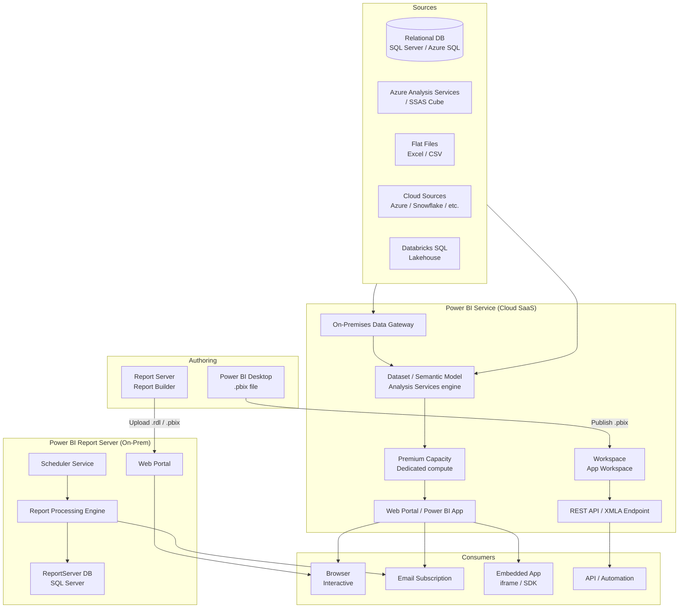
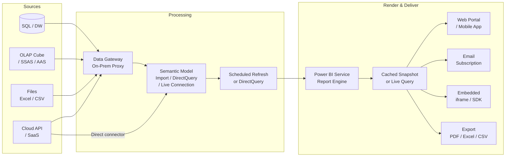

# Power BI — SA Migration Guide

> This page is designed for Solution Architects assessing a customer's Power BI estate and planning a migration or modernization toward Databricks. It is not a developer or admin guide.

---

## Platform Architecture



---

## Data Flow



---

## 1. Ecosystem Overview

Power BI is Microsoft's flagship self-service and enterprise BI platform. It covers the full analytics lifecycle — from desktop data modeling to cloud-hosted interactive dashboards, paginated reports, and embedded analytics. Microsoft positions Power BI as the BI layer of the Microsoft Fabric platform and it competes directly with Tableau, Qlik, and Looker in enterprise deals.

### Product Variants and Editions

| Variant | Deployment | Key Characteristics |
|---------|-----------|---------------------|
| **Power BI Desktop** | Local authoring tool (Windows) | Free, used to create .pbix files; not a server product |
| **Power BI Service** | SaaS (app.powerbi.com) | Cloud-hosted workspace, sharing, collaboration, scheduled refresh |
| **Power BI Report Server** | On-premises | Self-managed server, ships with SQL Server or Power BI Premium; hosts .pbix and paginated .rdl reports |
| **Power BI Embedded** | Azure PaaS (A-SKU) | Embed Power BI reports in custom apps; billed per capacity, not per user |
| **Power BI Premium** | Add-on to Service (P-SKU / EM-SKU) | Dedicated capacity, paginated reports, XMLA read/write, deployment pipelines |
| **Microsoft Fabric** | Unified SaaS platform | Power BI is the BI and reporting workload inside Fabric; shares the same Semantic Model (Analysis Services) engine |

### Why Customers Use It

- **Self-service analytics** — business users build and share dashboards without IT
- **Executive and operational dashboards** — KPI monitoring connected to SQL Server, Azure SQL, or Azure Synapse
- **Paginated reporting** — pixel-perfect, print-ready reports replacing SSRS (Power BI Premium or Report Server)
- **Embedded analytics** — reports embedded in ISV products, customer portals, or internal apps via Power BI Embedded
- **Microsoft stack consolidation** — natural choice when the customer is already on Azure, Teams, SharePoint, or Dynamics

### Key Discovery Questions

- How many reports and dashboards exist in the workspace(s)? How many were accessed in the last 90 days?
- Is the customer on **Power BI Service** (cloud), **Power BI Report Server** (on-prem), or both?
- Which license tier — Free, Pro, Premium Per User (PPU), Premium capacity (P-SKU), or Fabric?
- Are paginated reports (.rdl) in use? These are a separate migration workstream from .pbix reports.
- How are reports consumed — interactive portal, Teams/SharePoint embed, embedded in a custom app, email subscription, scheduled PDF/Excel export?
- What data sources are connected — SQL Server, Azure SQL, SSAS/AAS cubes, Excel files, cloud SaaS connectors?
- Are datasets (semantic models) shared across multiple reports, or is each report self-contained?
- Is DirectQuery or Live Connection in use? (Significant latency and governance implications)
- Is row-level security enforced? Is it static (fixed roles) or dynamic (username-based)?
- Are Power BI Apps used to package and distribute content to large audiences?
- Are Dataflows (Power Query / ETL inside Power BI) in use as a data prep layer?
- Is Power BI Embedded used — and if so, what application owns the embed tokens?

---

## 2. Component Architecture

| Component | Role | Migration Equivalent | SA Note |
|-----------|------|----------------------|---------|
| **Power BI Desktop** | Windows authoring tool; creates .pbix files containing data model, DAX measures, and report layouts | Power BI Desktop (retained) or Databricks SQL dashboard authoring | Not a server component — lives on developer laptops. Source control gap is common. |
| **Power BI Service** | Cloud SaaS host for workspaces, datasets, reports, dashboards; manages refresh schedules and sharing | Databricks SQL workspace + Unity Catalog + partner BI service | The cloud tenant is the authoritative catalog; REST API is the inventory tool. |
| **Power BI Report Server** | On-prem server; hosts .pbix and paginated .rdl reports with a web portal and scheduler | Databricks SQL + Power BI Service (cloud migration) or SSRS replacement path | On-prem installs are common in regulated industries; XMLA and REST API both available. |
| **Semantic Model (Dataset)** | In-memory Analysis Services engine (VertiPaq for Import, DirectQuery for pass-through); stores DAX measures and relationships | Databricks SQL Serverless + Unity Catalog semantic layer; or keep Power BI as BI layer over Databricks | The most complex migration artifact. DAX logic often duplicates transformation logic that belongs in dbt or Databricks SQL. |
| **Data Gateway** | On-prem agent that proxies queries from Power BI Service to on-premises data sources | Databricks workspace with VPC/VNet peering or Private Link to on-prem sources | Gateway is often a shared, unmonitored service. Single point of failure for all cloud-refreshed on-prem data. |
| **Power BI REST API** | Programmatic access to workspace metadata, report exports, refresh triggers | Databricks REST API + Unity Catalog APIs | Critical for inventory. Use Admin API (tenant-wide) not workspace API for full estate scan. |
| **XMLA Endpoint** | Analysis Services protocol endpoint for Premium/PPU; allows third-party tools to read/write the semantic model | Databricks SQL endpoint (JDBC/ODBC) | Enables ALM Toolkit, Tabular Editor, and external BI tools to connect directly to semantic models. |
| **Deployment Pipelines** | Premium/Fabric feature for Dev → Test → Prod promotion of workspaces | Databricks Repos + CI/CD pipelines | Three-stage pipeline is built-in to Premium. Not available in Pro license. |
| **Dataflows (Gen1/Gen2)** | Power Query-based ETL inside Power BI Service; produces reusable datasets stored in Azure Data Lake | Databricks ETL pipelines / Delta Live Tables / dbt | Dataflows are a hidden data engineering layer inside BI. Often overlooked in migration scoping. |

---

## 3. Artifact Lifecycle

| Stage | What Happens | Where (Server/Client) | Artifact Involved | Migration Risk |
|-------|-------------|----------------------|-------------------|----------------|
| **Author** | Developer opens Power BI Desktop, imports or connects to data, builds data model, writes DAX, designs report visuals | Client (Windows app) | `.pbix` file (local) | No native source control in Desktop; teams use Git manually or via Fabric Git integration. Stale local files are common. |
| **Deploy/Publish** | Developer clicks Publish in Desktop (or CI/CD pipeline uploads via API); .pbix is uploaded to a Service workspace | Client → Server | `.pbix` uploaded to Power BI Service REST API | Workspace may have no deployment pipeline — manual publish to prod is common. No rollback without backup. |
| **Compile / Model Load** | Service loads the semantic model into VertiPaq (columnar in-memory engine) for Import mode; no compile step for DirectQuery | Server | In-memory VertiPaq columnar store | Import model size limits (1 GB for Pro, configurable for Premium). Large models may fail to load. |
| **Refresh (Import mode)** | Scheduled or on-demand refresh; gateway fetches data from source, re-loads VertiPaq cache | Server (gateway agent on-prem, processing in cloud) | Refreshed dataset in Service | Refresh failures are silent unless monitored. Large tables with no incremental refresh re-load fully each run. |
| **Execute / Query** | User opens report → DAX queries sent to semantic model engine → VertiPaq returns aggregates (Import) or passes SQL to source (DirectQuery) | Server | DAX query against in-memory model or source DB | DAX complexity and cardinality drive query time. DirectQuery under heavy load stresses the source system. |
| **Render** | Report visuals rendered in browser as interactive SVG/HTML; paginated reports rendered server-side as PDF/HTML/Excel | Client (interactive reports), Server (paginated reports) | Rendered report page or exported file | Paginated reports (.rdl) render server-side and are a separate migration workstream. |
| **Deliver** | User accesses portal, receives email subscription snapshot, opens Teams tab, views embedded iframe, or calls Export API | Server (email/export), Client (portal/embed) | PNG snapshot, PDF, Excel, or live interactive report | Email subscriptions deliver static snapshots — not live data. Embedded apps use embed tokens with expiry. |

> **SA Tip:** The Publish step is where most customers have a governance gap. Without deployment pipelines, developers publish directly to production workspaces. Ask whether the customer has a Dev/Test/Prod separation — if not, the migration is also a governance improvement project.

---

## 4. Data Sources and Dataset Model

Power BI supports two connection modes that have very different migration implications:

- **Import** — data is loaded into VertiPaq in-memory cache; fast queries, but refresh latency and size limits apply
- **DirectQuery** — queries pass through to the source system in real time; no data stored in Power BI; source system bears all query load
- **Live Connection** — read-only connection to an existing SSAS or AAS semantic model; Power BI is purely a rendering layer
- **Composite models** — mix of Import and DirectQuery tables in a single model; complex to migrate

### Data Source Types

| Data Source Type | Frequency in Customer Estates | Migration Path | Risk |
|-----------------|-------------------------------|----------------|------|
| SQL Server / Azure SQL (Import) | Very high | Databricks SQL warehouse or Unity Catalog table; repoint connector | Low — standard SQL, easy to repoint |
| SQL Server / Azure SQL (DirectQuery) | High | Databricks SQL Serverless (DirectQuery equivalent via partner BI) | Medium — query patterns must perform on Databricks SQL |
| Azure Synapse Analytics | Medium | Databricks SQL (natural peer); repoint connector | Low |
| SSAS / Analysis Services Live Connection | High | Keep AAS or migrate model to Databricks + partner BI semantic layer | High — entire semantic layer abstraction must be preserved or rebuilt |
| Azure Analysis Services | Medium | Databricks + Power BI Premium composite or migrate DAX to Databricks SQL | High — DAX measures must be rewritten or kept in Power BI |
| Excel / flat files | High | Delta tables in Unity Catalog; autoloader ingestion | Medium — often ad-hoc; ownership unclear |
| SharePoint Lists | Medium | Databricks ingestion via API or ADF | Medium — refresh frequency and schema drift |
| Salesforce / SaaS connectors | Medium | Databricks partner connectors (Fivetran, Airbyte) → Delta tables | Medium — connector semantics differ |
| Power BI Dataflows | Medium | Replace with dbt / Delta Live Tables | Medium — hidden ETL logic must be extracted |
| Databricks (existing) | Low-growing | Direct connector; minimal migration | Low |

### Parameters and Filters

Power BI supports report-level filters, visual-level filters, page filters, and DAX-based dynamic measures. Dynamic M Query parameters (used to filter data at source query time) are a common pattern for large tables — they pass values from report slicers into the source query. This is a migration risk: it encodes business logic in the M query layer that may not survive a connector swap.

> **SA Tip:** Ask whether the customer uses **dynamic M parameters** or **query folding** optimizations. These are often invisible in the UI but break when the data source changes.

---

## 5. Rendering and Delivery Model

| Delivery Mode | How It Works | Business Use Case | Migration Equivalent | Risk |
|--------------|-------------|-------------------|----------------------|------|
| **Interactive portal (powerbi.com)** | User opens report in browser; live DAX queries against model | Self-service analytics, dashboards | Databricks SQL dashboard or partner BI workspace | Low — standard portal pattern |
| **Power BI App** | Packaged workspace content distributed to large audiences without workspace access | Governed report distribution to many consumers | Databricks SQL workspace + access control | Medium — App packaging and audience management must be replanned |
| **Teams / SharePoint embed** | Tab in Teams channel or SharePoint page embedding a report via iframe | Collaboration, intranet dashboards | Teams tab with Databricks SQL or partner BI | Medium — requires re-embed in new surface |
| **Email subscription (snapshot)** | Scheduled static PNG/PDF snapshot sent to a distribution list | Executive reports, operational alerts | Partner BI native email subscription or Databricks Workflows + export API | Medium — snapshot delivery often has informal recipient lists |
| **Data-driven subscriptions (Premium)** | Subscription list driven by a dataset column — personalized reports sent to each recipient | Bursting / personalized delivery to many users | Custom Databricks Workflow + Export API + email service | High — encodes business logic; no direct equivalent in most partner BI |
| **Power BI Embedded (A-SKU)** | Reports embedded in custom web/mobile app using embed tokens; app manages auth | ISV product, customer-facing portal | Power BI Embedded (retained) or Tableau Embedded or custom Databricks SQL embed | High — embed token lifecycle, app code changes, capacity model all change |
| **Export API (PDF/Excel/PNG)** | REST API call triggers server-side render and returns file | Automated report generation, downstream file consumers | Partner BI export API or Databricks SQL query export | Medium — API contract changes between platforms |
| **Paginated report (RDL) delivery** | Pixel-perfect report rendered server-side; delivered as PDF, Word, Excel, or via Report Server web portal | Finance, compliance, invoices, regulated outputs | SSRS (retained) or Power BI Premium paginated reports (retained) or migrate .rdl to new platform | High — paginated reports are a separate product with different migration path |

> **SA Tip:** **Data-driven subscriptions** (Premium feature) are the single highest-risk delivery pattern. They deliver personalized report snapshots to a list of recipients driven by a dataset — essentially a bursting engine. There is no native equivalent in Databricks or most partner BI tools. Flag this early and plan a custom workflow replacement.

---

## 6. Project Structure and Version Control

Power BI workspaces are the primary organizational unit in the Service. A workspace contains datasets (semantic models), reports, dashboards, dataflows, and paginated reports. Workspaces can be packaged into **Apps** for read-only distribution to consumers.

### Folder / Workspace Structure

- **Personal workspace** — each user has a private workspace; content here is invisible to admins unless audit logs are checked
- **Shared workspaces** — team workspaces with role-based access (Admin, Member, Contributor, Viewer)
- **Deployment pipeline stages** — Premium feature maps workspaces to Dev / Test / Prod stages
- **Fabric workspace** — unified workspace for Fabric items (Lakehouses, Notebooks, semantic models, reports)

### Version Control

Power BI has historically had no native version control. The .pbix file is binary (ZIP-based) and does not diff cleanly. Options customers use:

| Approach | How It Works | Limitation |
|----------|-------------|------------|
| **No version control** | Most common; developers keep local copies | No audit trail; accidental overwrites are a real risk |
| **SharePoint / OneDrive** | .pbix files saved to SharePoint for informal versioning | No branching; no meaningful diff |
| **Git via Power BI Desktop Projects (.pbip)** | Newer format that serializes the model as JSON/TMDL files for Git | Requires opt-in; not widely adopted yet |
| **Fabric Git Integration** | Fabric workspaces can be connected to Azure DevOps or GitHub repos | Only for Fabric workspaces; new feature, limited adoption |
| **ALM Toolkit / Tabular Editor** | External tools that extract and diff the semantic model via XMLA endpoint | Premium/PPU required; developer toolchain adoption varies |

> **SA Tip:** Ask directly: "Is the workspace the source of truth, or do developers have source-controlled project files?" In most Power BI estates, the Service workspace is the only copy. This makes pre-migration backup and export critical before any destructive changes.

### Environment Promotion

Without deployment pipelines, promotion is manual publish. With deployment pipelines (Premium), workspaces are promoted stage-by-stage with optional parameter overrides per stage (e.g., data source pointing to prod vs. dev database).

---

## 7. Orchestration and Scheduling

### Dataset Refresh Scheduling

Import-mode datasets must be refreshed on a schedule to keep data current. Refresh is configured per-dataset in the Service:

- Up to 8 refreshes/day (Pro), 48 refreshes/day (Premium)
- Requires a gateway if source is on-premises
- Incremental refresh (Premium/PPU) can partition large tables and refresh only recent partitions
- Refresh failures send email to dataset owner (if configured)

### External Trigger via API

Dataset refresh can be triggered via the Power BI REST API (`POST /datasets/{id}/refreshes`). This is commonly used to chain Power BI refresh after an ETL pipeline completes. The XMLA endpoint also supports TMSL refresh commands from external tools.

### Subscriptions and Scheduled Delivery

| Delivery Type | Trigger | Recipients | Parameters |
|--------------|---------|------------|------------|
| Report subscription | Scheduled (cron-like) | Fixed list of Power BI Pro/PPU users | Optional: report page filter state at time of snapshot |
| Dashboard subscription | Scheduled | Fixed list | None (dashboard tile snapshot) |
| Paginated report subscription | Scheduled | Fixed list or SharePoint folder | Can pass report parameters per schedule |
| Data-driven subscription (Premium) | Scheduled | Dynamic list from dataset column | Parameter values from dataset per recipient |

### Migration Target

| Current Pattern | Migration Target |
|----------------|-----------------|
| Dataset refresh on schedule | Databricks Workflows job → refresh partner BI dataset via API |
| Report subscription (email) | Partner BI native email subscription |
| Data-driven subscription | Databricks Workflow + Export API + SendGrid/Outlook |
| API-triggered refresh | Databricks Workflows webhook trigger → partner BI API |

---

## 8. Metadata, Lineage, and Impact Analysis

### Where the Catalog Lives

The authoritative catalog is the **Power BI Service REST API** (tenant-scoped Admin API). For on-prem Power BI Report Server, the catalog is the **ReportServer SQL Server database**.

### Key API Endpoints (Power BI Service)

```
# List all workspaces (Admin)
GET https://api.powerbi.com/v1.0/myorg/admin/groups?$top=5000

# List all reports in a workspace
GET https://api.powerbi.com/v1.0/myorg/admin/groups/{groupId}/reports

# List all datasets (semantic models) in tenant
GET https://api.powerbi.com/v1.0/myorg/admin/datasets?$top=5000

# Get dataset datasources (what data sources does this model connect to?)
GET https://api.powerbi.com/v1.0/myorg/admin/datasets/{datasetId}/datasources

# Get activity log (who accessed what, when)
GET https://api.powerbi.com/v1.0/myorg/admin/activityevents?startDateTime=...&endDateTime=...

# Get refresh history for a dataset
GET https://api.powerbi.com/v1.0/myorg/datasets/{datasetId}/refreshes
```

### Key Report Server DB Queries (On-Prem)

```sql
-- Count all reports by type
SELECT Type, COUNT(*) AS report_count
FROM ReportServer.dbo.Catalog
WHERE Type IN (2, 5)  -- 2 = RDL report, 5 = .pbix report
GROUP BY Type;

-- Reports not accessed in 90 days
SELECT Name, Path, CreationDate, ModifiedDate, ExecutionTime
FROM ReportServer.dbo.Catalog c
LEFT JOIN ReportServer.dbo.ExecutionLogStorage e
    ON c.ItemID = e.ReportID
    AND e.TimeStart > DATEADD(day, -90, GETDATE())
WHERE c.Type = 2
  AND e.ReportID IS NULL;

-- List all subscriptions with schedule
SELECT c.Name, c.Path, s.Description, sc.NextRunTime, s.LastStatus
FROM ReportServer.dbo.Subscriptions s
JOIN ReportServer.dbo.Catalog c ON s.Report_OID = c.ItemID
JOIN ReportServer.dbo.ReportSchedule rs ON s.SubscriptionID = rs.SubscriptionID
JOIN ReportServer.dbo.Schedule sc ON rs.ScheduleID = sc.ScheduleID;

-- Data source connections per report
SELECT c.Name, c.Path, ds.Name AS datasource_name, ds.Extension, ds.ConnectionString
FROM ReportServer.dbo.Catalog c
JOIN ReportServer.dbo.DataSource ds ON c.ItemID = ds.ItemID;
```

### Lineage

Power BI Service has built-in **data lineage view** in Premium/PPU workspaces — it shows the chain from data source → dataflow → dataset → report → dashboard. For Pro license, lineage must be inferred by joining dataset-to-report relationships from the Admin API.

> **SA Tip:** The most valuable single artifact for scoping is the **Activity Log** (Power BI Service) or the **ExecutionLogStorage table** (Report Server). Pull 90 days of activity. You will typically find that 60–70% of reports have had zero views — these are safe candidates for decommission rather than migration.

---

## 9. Data Quality and Governance

### Row-Level Security (RLS)

Power BI RLS is defined in the semantic model (dataset) as DAX filter expressions applied to table rows based on the authenticated user's role membership.

| RLS Pattern | How It Works | Migration Complexity |
|------------|-------------|----------------------|
| **Static RLS** | Fixed roles with hardcoded DAX filters (e.g., `[Region] = "West"`) | Low — translate to Unity Catalog row filters |
| **Dynamic RLS** | DAX filter uses `USERPRINCIPALNAME()` to look up current user in a security table | Medium — Unity Catalog row filters with current_user() function |
| **Object-level security (OLS)** | Hides entire tables or columns from specific roles in the semantic model | Medium — Unity Catalog column masks + workspace permissions |
| **Report-level RLS via Power BI Embedded** | Embed token encodes effective username; RLS evaluated in the model | High — embed token logic must be replicated in new embed architecture |

### Column-Level Security

Power BI handles column-level security via **Object Level Security (OLS)** in the semantic model — roles can be denied access to specific columns or entire tables. This is Premium/PPU only. Migration target is Unity Catalog column masks.

### Data Freshness and Caching

- **Import mode** — data freshness is determined by refresh schedule; stale data risk between refreshes
- **DirectQuery** — always live; no caching at model level (tile-level dashboard cache is separate)
- **Query caching** (Premium) — frequently used query results cached for dashboard tiles

### Custom Code and Scripting

| Custom Code Type | Where It Lives | Migration Risk |
|-----------------|---------------|----------------|
| **DAX measures** | Inside the semantic model | Medium — must be rewritten or kept in Power BI over Databricks |
| **M (Power Query) transformations** | Inside dataset or Dataflow | Medium — replace with dbt/Databricks ETL |
| **R and Python visuals** | Inside .pbix report | High — requires R/Python runtime on Report Server; not supported in all embed scenarios |
| **Custom visuals (.pbiviz)** | Third-party or custom-built visual components | High — licensing, security review, and availability in new platform |
| **Paginated report expressions (VB.NET)** | Inside .rdl files | High — identical to SSRS migration; expression language is VB.NET |

> **SA Tip:** Ask specifically about **R/Python visuals** and **custom visuals from AppSource**. Both require additional runtime dependencies and security approvals. Custom visuals in particular have ISV licensing attached and may not transfer to a new platform.

---

## 10. File Formats and Artifact Reference

### `.pbix` — Power BI Desktop File

**What it is:** The primary authoring artifact. A ZIP-compressed binary file containing the semantic model, report layout, data model metadata, and (for Import mode) a compressed snapshot of the imported data.

| Property | Value |
|----------|-------|
| Created by | Power BI Desktop |
| Stored in | Developer local disk; published to Power BI Service or Report Server |
| Contains | Semantic model (VertiPaq/TMDL), DAX measures, relationships, report pages, visual configs, M queries, embedded data snapshot (Import mode) |
| Human-readable | No (binary ZIP; internal files partially readable) |
| Migration target | Keep Power BI over Databricks SQL; or extract semantic model and rebuild in Databricks |

> **SA Tip:** A .pbix published to a Premium workspace can be downloaded back from the Service via the portal or API — but only if the dataset was originally uploaded (not created in-service). Always verify download availability before migration; some premium datasets cannot be exported.

---

### `.pbip` — Power BI Desktop Project (newer format)

**What it is:** A folder-based project format that serializes the semantic model as TMDL (Tabular Model Definition Language) JSON files and the report layout as JSON — enabling Git-based version control.

| Property | Value |
|----------|-------|
| Created by | Power BI Desktop (opt-in preview / GA in 2024) |
| Stored in | Git repository or local file system |
| Contains | `/Model/` TMDL files, `/Report/` JSON layout files, `pbip` manifest |
| Human-readable | Yes (JSON/TMDL) |
| Migration target | TMDL model can be imported via Tabular Editor or ALM Toolkit |

> **SA Tip:** Most customers are still on .pbix. .pbip adoption is growing but limited to teams that have explicitly opted in. Don't assume the customer has .pbip files without asking.

---

### `.rdl` — Report Definition Language (Paginated Reports)

**What it is:** XML-based paginated report definition, identical to SSRS .rdl format. Used in Power BI Report Server and Power BI Premium paginated reports.

| Property | Value |
|----------|-------|
| Created by | Power BI Report Builder, Visual Studio (SSDT), SSRS Report Designer |
| Stored in | Report Server catalog (ReportServer DB) or Service (paginated reports workspace) |
| Contains | Data source refs, datasets (SQL/MDX queries), parameters, layout definitions, expressions (VB.NET) |
| Human-readable | Yes (XML) |
| Migration target | Power BI Premium paginated reports (Service), SSRS, or rebuild as Databricks SQL + partner BI |

> **SA Tip:** .rdl in Power BI Report Server is identical to SSRS .rdl. If the customer has both Power BI .pbix and .rdl reports on Report Server, treat the .rdl workstream as an SSRS migration.

---

### `.rds` — Shared Data Source

**What it is:** Reusable XML data source definition stored on the Report Server — used by .rdl paginated reports.

| Property | Value |
|----------|-------|
| Created by | Report Builder, SSDT, Report Manager |
| Stored in | ReportServer DB catalog |
| Contains | Connection string, authentication method, credential storage |
| Human-readable | Yes (XML) |
| Migration target | Databricks SQL warehouse connection string in Unity Catalog or partner BI data source |

---

### `.rsd` — Shared Dataset

**What it is:** A reusable query definition (SQL or MDX) stored on the Report Server, shared across multiple .rdl reports.

| Property | Value |
|----------|-------|
| Created by | Report Builder, SSDT |
| Stored in | ReportServer DB catalog |
| Contains | Data source reference, query, parameters, field list |
| Human-readable | Yes (XML) |
| Migration target | Databricks SQL query / dbt model |

---

### Power BI Dataflow (`.json` manifest + Parquet in ADLS)

**What it is:** Power Query-based ETL pipeline defined inside Power BI Service; output stored as Parquet files in Azure Data Lake Storage Gen2.

| Property | Value |
|----------|-------|
| Created by | Power BI Service Dataflows editor |
| Stored in | Azure Data Lake Storage Gen2 (customer's storage account) + Service metadata |
| Contains | M query transformations, entity definitions, incremental refresh config, CDM schema |
| Human-readable | JSON manifest readable; M queries are text |
| Migration target | Delta Live Tables, dbt, or Databricks ETL notebook |

> **SA Tip:** Dataflows are the most overlooked artifact in Power BI migrations. Customers often don't think of them as "data engineering" — but they are. Pull the list of dataflows from the Admin API and treat each one as a separate ETL migration item.

---

### Power BI Dataset / Semantic Model (Service artifact)

**What it is:** The in-service representation of a published .pbix semantic model, hosted as an Analysis Services instance.

| Property | Value |
|----------|-------|
| Created by | Published from Desktop (.pbix) or created via XMLA push |
| Stored in | Power BI Service capacity (in-memory VertiPaq) |
| Contains | Tabular model, DAX measures, relationships, row-level security roles, refresh schedule |
| Human-readable | Accessible via XMLA endpoint (Tabular Editor, SSMS) if Premium/PPU |
| Migration target | Keep Power BI semantic layer over Databricks SQL; or rebuild metrics in Unity Catalog |

---

### Artifact Quick Reference

| Artifact | Extension / Location | Human-Readable | Where Stored | Migration Target | Risk Level |
|----------|---------------------|----------------|-------------|-----------------|------------|
| Power BI Desktop file | `.pbix` | No (binary ZIP) | Local disk / Service workspace | Keep Power BI over Databricks or rebuild | Medium |
| Power BI Desktop Project | `.pbip` (folder) | Yes (JSON/TMDL) | Git / local disk | TMDL import via ALM Toolkit | Low |
| Paginated report | `.rdl` | Yes (XML) | Report Server DB / Service | Power BI Premium paginated or SSRS path | High |
| Shared data source | `.rds` | Yes (XML) | Report Server DB | Databricks SQL warehouse connection | Low |
| Shared dataset | `.rsd` | Yes (XML) | Report Server DB | Databricks SQL query / dbt model | Medium |
| Dataflow | JSON manifest + Parquet | Partial | ADLS Gen2 + Service metadata | Delta Live Tables / dbt | Medium–High |
| Semantic model (in-service) | Service API artifact | Partial (XMLA) | Service capacity | Keep Power BI or rebuild DAX in SQL | High |
| Custom visual | `.pbiviz` | No | .pbix file | Evaluate per ISV; no general path | High |

---

## 11. Migration Assessment and Artifact Inventory

### How to Inventory the Estate

| Method | When to Use | Coverage |
|--------|-------------|----------|
| **Power BI Admin REST API** | Primary method for Service (cloud) | Full tenant; includes personal workspaces with Admin scope |
| **Activity Log API** | Usage data (90-day rolling window) | All content access events; required for identifying unused reports |
| **Report Server DB queries** | On-prem Report Server | Full catalog, subscriptions, data sources, execution log |
| **Scanner API (Fabric)** | Premium/Fabric tenants; richer metadata | Dataset tables, measures, data source details, sensitivity labels |
| **Power BI REST API (workspace-scoped)** | Non-admin access | Only content the caller has access to; misses personal workspaces |

> **SA Tip:** Do not rely on the Power BI portal UI for counting. Personal workspaces are excluded from workspace views, and system-created datasets (auto-generated for Excel uploads, streaming datasets) inflate counts. Use the Admin API.

### Complexity Scoring

| Dimension | Low | Medium | High | Critical |
|-----------|-----|--------|------|----------|
| **Data source type** | SQL Server / Azure SQL (Import) | DirectQuery relational; Dataflows | SSAS / AAS Live Connection; composite models | Custom connector; on-prem cube + DirectQuery composite |
| **Query / dataset complexity** | Simple SELECT queries | Stored procedures; multi-table joins with M transforms | Complex M (Power Query) with dynamic parameters | OLAP/MDX queries; dynamic query folding |
| **Parameter complexity** | No parameters or simple text/date | Static dropdown parameters | Cascading parameters; dynamic M Query parameters | Data-driven parameters with external lookup tables |
| **Custom code** | No custom code | Basic DAX measures | Complex DAX time-intelligence; R/Python visuals | Custom .pbiviz visuals with ISV licensing |
| **Report nesting / drill-through** | Flat single-page report | Drill-through between reports; tooltips | Cross-report drill-through; subreports in RDL | Deep nested subreports + cross-workspace drill-through |
| **Delivery complexity** | Portal only | Email subscription (fixed list) | Data-driven subscription; Power BI App | Embedded in custom app with embed token logic |
| **Security complexity** | No RLS | Static RLS roles | Dynamic RLS with user lookup table | OLS + dynamic RLS + embed token effective identity |

### Common Migration Blockers (Power BI–Specific)

1. **DAX semantic layer not portable** — The semantic model's DAX measures and relationships are Analysis Services–native. There is no automated conversion to SQL or dbt. If the customer uses Power BI as both the ETL and semantic layer, the migration scope doubles.
2. **SSAS / AAS Live Connection** — Reports using Live Connection have no embedded model; they rely entirely on the SSAS/AAS instance. Migrating these reports requires migrating the entire Analysis Services model first.
3. **Data-driven subscriptions** — Premium-only bursting feature with no equivalent in Databricks or standard partner BI. Each use case requires a custom workflow replacement.
4. **Power BI Embedded embed tokens** — Custom applications managing embed tokens must be re-architected. Embed token generation, token expiry handling, and effective identity mapping are application-layer concerns, not just BI-layer concerns.
5. **Personal workspace content** — Reports and datasets in personal workspaces are invisible without Admin API access. Customers are often surprised by how much content lives in personal workspaces and is effectively unmanaged.
6. **Dataflows as hidden ETL** — Customers frequently don't disclose dataflows during initial scoping because they don't think of them as "data pipelines." Always explicitly ask and scan for dataflows.

### Sample Inventory Query (Power BI Service — PowerShell / REST)

```powershell
# Requires Power BI Management module and Admin rights
# Install-Module -Name MicrosoftPowerBIMgmt

Connect-PowerBIServiceAccount

# Get all workspaces
$workspaces = Get-PowerBIWorkspace -Scope Organization -All

# Get all reports across all workspaces
$allReports = @()
foreach ($ws in $workspaces) {
    $reports = Get-PowerBIReport -WorkspaceId $ws.Id -Scope Organization
    foreach ($r in $reports) {
        $allReports += [PSCustomObject]@{
            WorkspaceName = $ws.Name
            WorkspaceId   = $ws.Id
            ReportName    = $r.Name
            ReportId      = $r.Id
            WebUrl        = $r.WebUrl
            DatasetId     = $r.DatasetId
        }
    }
}

$allReports | Export-Csv -Path "pbi_report_inventory.csv" -NoTypeInformation
```

```sql
-- Report Server: full inventory with usage, subscriptions, data source type
SELECT
    c.Name                  AS report_name,
    c.Path                  AS report_path,
    c.Type                  AS report_type,  -- 2=RDL, 5=pbix
    c.CreationDate,
    c.ModifiedDate,
    MAX(e.TimeStart)        AS last_accessed,
    COUNT(e.InstanceName)   AS access_count_90d,
    MIN(ds.Extension)       AS datasource_type,
    CASE WHEN s.SubscriptionID IS NOT NULL THEN 'Y' ELSE 'N' END AS has_subscription
FROM ReportServer.dbo.Catalog c
LEFT JOIN ReportServer.dbo.ExecutionLogStorage e
    ON c.ItemID = e.ReportID
    AND e.TimeStart > DATEADD(day, -90, GETDATE())
LEFT JOIN ReportServer.dbo.DataSource ds
    ON c.ItemID = ds.ItemID
LEFT JOIN ReportServer.dbo.Subscriptions s
    ON c.ItemID = s.Report_OID
WHERE c.Type IN (2, 5)
GROUP BY c.Name, c.Path, c.Type, c.CreationDate, c.ModifiedDate, s.SubscriptionID
ORDER BY last_accessed DESC;
```

---

## 12. Migration Mapping to Databricks

### Report Types

| Power BI Report Type | Databricks / Target |
|---------------------|---------------------|
| Interactive .pbix report (Import / DirectQuery) | Keep Power BI as BI layer over Databricks SQL; or rebuild key reports as Databricks SQL dashboards / Lakeview |
| Paginated .rdl report (pixel-perfect) | Power BI Premium paginated reports (retained) or migrate to SSRS equivalent |
| Dashboard (tiles) | Databricks SQL dashboard or Lakeview |
| Power BI App (packaged workspace) | Databricks SQL workspace + governed sharing |
| Streaming dataset report | Databricks Structured Streaming + partner BI live connection |

### Data Sources

| Power BI Data Source | Databricks Target |
|---------------------|-------------------|
| SQL Server / Azure SQL (Import) | Databricks SQL warehouse; Delta table in Unity Catalog |
| SQL Server / Azure SQL (DirectQuery) | Databricks SQL Serverless (partner BI DirectQuery connector) |
| Azure Synapse Analytics | Databricks SQL (peer platform; migrate workloads) |
| SSAS / AAS Live Connection | Databricks SQL + Power BI semantic model over Databricks (composite or Direct Lake) |
| Flat files / Excel | Delta table via Autoloader; Unity Catalog external table |
| Power BI Dataflow | Delta Live Tables / dbt model |
| Salesforce / SaaS | Fivetran / Airbyte → Delta table in Unity Catalog |

### Dataset and Semantic Layer

| Power BI Concept | Databricks Target |
|-----------------|-------------------|
| Dataset / semantic model (DAX) | Keep Power BI semantic layer over Databricks SQL Direct Lake mode |
| DAX measures (simple aggregations) | Databricks SQL queries or dbt metrics |
| DAX time-intelligence measures | dbt date spine + Databricks SQL window functions |
| Power Query (M) transformations | dbt models / Delta Live Tables |
| Dataflows (reusable ETL) | Delta Live Tables or dbt pipelines |

### Security

| Power BI Security | Databricks Target |
|------------------|-------------------|
| Static RLS roles | Unity Catalog row filters (static predicates) |
| Dynamic RLS (`USERPRINCIPALNAME()`) | Unity Catalog row filters with `current_user()` |
| Object Level Security (OLS) — columns | Unity Catalog column masks |
| Object Level Security (OLS) — tables | Unity Catalog table-level permissions |
| Workspace roles (Admin/Member/Contributor/Viewer) | Databricks workspace groups + Unity Catalog privileges |
| Power BI Embedded effective identity | Databricks SQL service principal + row filter per identity |

### Scheduling and Delivery

| Power BI Pattern | Databricks Target |
|-----------------|-------------------|
| Dataset scheduled refresh | Databricks Workflows job → partner BI REST API refresh |
| Report email subscription (fixed list) | Partner BI native email subscription |
| Data-driven subscription (bursting) | Databricks Workflow + Export API + email service (custom build) |
| API-triggered refresh | Databricks Workflows webhook → partner BI REST API |
| Incremental refresh | Delta table Z-order + Databricks DLT incremental pipelines |

### Portal and Governance

| Power BI Concept | Databricks Target |
|-----------------|-------------------|
| Workspace portal | Databricks SQL workspace |
| Power BI App distribution | Databricks workspace groups + governed catalog |
| Deployment pipelines (Dev/Test/Prod) | Databricks Repos + CI/CD (GitHub Actions / Azure DevOps) |
| Sensitivity labels (Microsoft Purview) | Unity Catalog tags + Databricks data classification |
| Audit logs (Activity Log API) | Databricks audit logs + Unity Catalog system tables |

### Embedded App Integration

| Power BI Embed Pattern | Databricks Target |
|----------------------|-------------------|
| Power BI Embedded (A-SKU, embed token) | Retain Power BI Embedded over Databricks Direct Lake; or migrate to Tableau Embedded |
| iFrame embed in Teams / SharePoint | Teams tab with Databricks SQL or partner BI |
| Embed in custom web app (JavaScript SDK) | Power BI JavaScript SDK (retained) or partner BI embed SDK |

### What Doesn't Map Cleanly

| Power BI Capability | Why It Doesn't Map | SA Recommendation |
|--------------------|-------------------|-------------------|
| **DAX semantic model (complex measures)** | DAX is an Analysis Services–native calculation language. Databricks SQL uses ANSI SQL + window functions. Complex time-intelligence DAX (SAMEPERIODLASTYEAR, TOTALYTD, etc.) has no direct SQL equivalent without significant rewrite. | Keep Power BI semantic layer over Databricks SQL via Direct Lake mode. Migrate DAX only if customer wants to consolidate to a single SQL layer. |
| **Direct Lake mode (Fabric)** | Direct Lake is a Fabric-specific connection mode where Power BI reads directly from OneLake Delta tables without import or DirectQuery. It only exists in Microsoft Fabric; there is no equivalent in standalone Databricks. | Position Direct Lake as the target architecture for Microsoft-stack customers migrating to Databricks + Fabric co-existence, not as a general migration path. |
| **Data-driven subscriptions (bursting)** | Personalized report delivery to a dynamic recipient list driven by a dataset column. No native equivalent in Databricks, Tableau, or Looker. | Design a custom Databricks Workflow that exports parameterized reports via the partner BI Export API and sends via SendGrid or Microsoft Graph email API. Scope as custom development. |
| **Power BI Embedded embed token lifecycle** | Embed tokens are Azure AD–based short-lived tokens generated by a backend service principal. The token embeds effective identity for RLS. No other BI platform has an equivalent token model. | Retain Power BI Embedded as the embed layer with Databricks as the data backend (Direct Lake or DirectQuery). Full re-platform requires rewriting the application's auth and embed layer. |
| **Custom visuals (.pbiviz, AppSource)** | Third-party or ISV-built visual components with their own licensing, security review requirements, and update cadence. Visuals are not portable to other BI platforms. | Inventory all custom visuals and identify ISV-sourced ones. For each, evaluate whether a native visual in the target platform meets the requirement, or whether the ISV has a version for the target tool. |
| **Power BI Goals / Scorecards** | OKR-style scorecards natively embedded in the Power BI Service. No equivalent in Databricks or standard BI tools. | Replicate as a standard dashboard with status indicators, or use a dedicated OKR tool (e.g., Viva Goals). Flag as out of scope for BI migration. |

---

## 13. Quick-Reference Cheat Sheet

| Topic | Key Fact | SA Question to Ask |
|-------|---------|-------------------|
| **Report count heuristic** | Expect 60–70% of reports to be unused (zero access in 90 days). Personal workspaces often hold 20–30% of total content. | "Can we pull the Activity Log or ExecutionLog for the last 90 days to identify active vs. unused content?" |
| **Where usage data lives** | Power BI Service: Activity Log API (90-day rolling, Admin scope required). Report Server: `ReportServer.dbo.ExecutionLogStorage` table. | "Do you have an Admin account we can use to pull the tenant-wide Activity Log, or is access restricted?" |
| **Top migration risk #1** | DAX semantic models are not portable to SQL. Complex DAX = keep Power BI as the semantic layer over Databricks. | "Are the DAX measures in your datasets simple aggregations, or do they use complex time-intelligence or many-to-many relationships?" |
| **Top migration risk #2** | Data-driven subscriptions (bursting) have no native equivalent. Each use case is a custom build. | "Do you use data-driven subscriptions in Power BI Premium to send personalized reports to different recipients from a dataset?" |
| **Top migration risk #3** | Power BI Embedded applications require re-architecting the embed token logic — not just the report content. | "Which applications embed Power BI reports, and does your dev team own the embed token generation code?" |
| **Source control gap** | Most customers have no version control for .pbix files. The Service workspace is the only copy. | "If we needed to roll back a report to last week's version, could you do that today?" |
| **License tier matters** | Paginated reports, data-driven subscriptions, XMLA endpoint, deployment pipelines — all require Premium or PPU. Features available depend on SKU. | "What Power BI license tier are you on — Pro, Premium Per User, or Premium capacity?" |
| **Dataflows are hidden ETL** | Dataflows are often not disclosed in initial scoping. Each dataflow is a separate ETL migration item. | "Do you use Power BI Dataflows as a data preparation layer feeding your datasets?" |
| **Personal workspaces** | Content in personal workspaces is invisible without Admin API access. Often 20–30% of total estate. | "Has anyone inventoried personal workspace content, or should we include that in scope?" |
| **On-prem gateway dependency** | A single gateway failure blocks all cloud-refreshed on-prem datasets. Often unmonitored and unmaintained. | "How many gateways do you have, and when was the last time the gateway software was updated?" |
