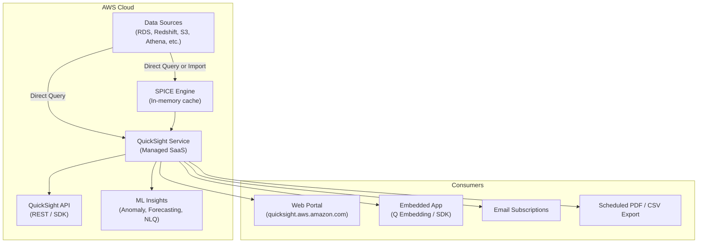
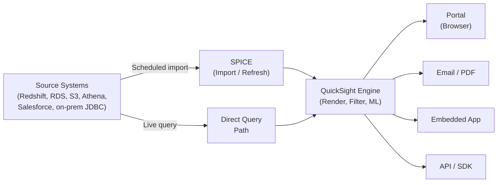

# Amazon QuickSight — SA Migration Guide

> This guide is for Solution Architects assessing a customer's QuickSight estate and mapping it to Databricks (Databricks SQL, Lakeview dashboards, or a connected BI layer like Power BI or Tableau).

---

## Platform Architecture



---

## Data Flow Diagram



---

## 1. Ecosystem Overview

**Amazon QuickSight** is AWS's fully managed, serverless cloud BI service. It sits in the AWS analytics product suite alongside Redshift (warehouse), Athena (serverless SQL), and Lake Formation (governance). Unlike traditional BI platforms (SSRS, Cognos, Business Objects), QuickSight has no on-premises option — it is exclusively cloud-native SaaS hosted by AWS.

### Product Variants and Editions

| Edition | Description | Typical Buyer |
|---------|-------------|---------------|
| Standard | Per-user SaaS, basic dashboards, SPICE, limited embedding | Small teams, AWS-native startups |
| Enterprise | RLS, private VPC, AD integration, paginated reports, Q NLQ | Enterprise customers |
| Enterprise + Q | Adds QuickSight Q (natural language queries) | Analytics self-service at scale |
| Embedded (Anonymous) | Session-capacity pricing, no IAM user per viewer | ISVs, customer-facing portals |

> **SA Tip:** Most enterprise migrations involve the **Enterprise** edition. Always confirm the edition — the security model (RLS, AD integration) and embedding approach vary significantly.

### Why Customers Use QuickSight

- **AWS-native BI:** Zero infrastructure to manage; auto-scales with SPICE.
- **Cost model appeal:** Capacity pricing (pay per session, not per user) is attractive for large organizations with many read-only consumers.
- **Embedded analytics:** QuickSight Embedding SDK lets ISVs embed dashboards in SaaS apps without standing up a BI server.
- **Self-service analytics:** Business users author analyses directly via the web interface.
- **ML Insights:** Built-in anomaly detection, forecasting, and natural language querying without separate tooling.

### Key Discovery Questions

- How many dashboards and analyses exist? How many have been accessed in the last 90 days?
- How are dashboards consumed — QuickSight portal, embedded in an application, or scheduled email/PDF?
- What data sources are connected — Redshift, Athena, RDS, S3, Salesforce, on-prem JDBC?
- Are customers using SPICE (imported data) or direct query mode?
- Are any dashboards embedded in custom applications using the QuickSight Embedding SDK?
- Is scheduled email delivery of snapshots business-critical?
- How is row-level security implemented — QuickSight RLS rules, column-level security, or tag-based RLS?
- Is QuickSight Q (natural language queries) in use?
- Are paginated reports (PixelPerfect) used for operational reporting?

---

## 2. Component Architecture

| Component | Role | What Breaks Without It | Migration Equivalent | SA Note |
|-----------|------|------------------------|----------------------|---------|
| **QuickSight Service (SaaS)** | Managed backend: auth, rendering, API, asset storage | Everything | Databricks SQL / partner BI service | Fully managed; no server to migrate |
| **SPICE Engine** | In-memory columnar store; caches imported datasets | Dashboards using SPICE lose data freshness; slow or fail | Databricks SQL warehouse (compute layer) | SPICE refresh schedules = migration dependency |
| **Direct Query Path** | Live SQL pass-through to source (Redshift, Athena, etc.) | Dashboards go stale | Databricks SQL warehouse direct query | Simplest migration path |
| **Web Portal** | Browser-based UI for authoring and consumption | No user-facing access | Databricks SQL / Lakeview / Power BI workspace | Portal experience is tenant-scoped URL |
| **QuickSight API / SDK** | REST API for asset CRUD, embedding, user management | Embedded apps break; automation breaks | Databricks REST API / partner BI API | Embedding contract is a migration blocker |
| **Embedding SDK** | JS SDK for embedding dashboards in custom apps | Customer-facing embedded analytics breaks | Power BI Embedded / Tableau Embedded | Highest-risk integration to assess early |
| **QuickSight Q** | NLQ layer over datasets | Self-service NLQ queries unavailable | Databricks AI/BI Genie (natural language) | Genie is not GA equivalent — flag to customer |
| **ML Insights** | Anomaly, forecasting, narrative auto-insights | Automatic insights disappear | Custom notebooks / Databricks AutoML | No direct equivalent in standard BI tools |
| **Asset Bundle** | Packaged export of dashboards/datasets for deploy | No programmatic deployment | Version control + Terraform / partner BI CI/CD | Asset bundles = CI/CD artifact |

---

## 3. Artifact Lifecycle

| Stage | What Happens | Where (Server/Client) | Artifact Involved | Migration Risk |
|-------|-------------|----------------------|-------------------|----------------|
| **Author** | User creates Analysis in web UI; drags visuals, sets filters, writes calculated fields | Client (browser) + Server (save) | Analysis (JSON in QuickSight service) | All authoring is web-only; no desktop file |
| **Publish** | Analysis is published as a Dashboard (snapshot of the analysis at publish time) | Server | Dashboard object (immutable snapshot) | Analyses and dashboards are separate objects — inventory both |
| **Dataset Define** | User or admin defines dataset: connects data source, applies transforms, enables SPICE or direct query | Server | Dataset (JSON definition + SPICE data) | SPICE datasets have refresh schedules |
| **Compile (SPICE)** | SPICE imports and compresses source data on schedule or manual trigger | Server (AWS-managed) | SPICE dataset (in-memory store) | Refresh failures are silent to end users |
| **Execute** | On dashboard open, QuickSight queries SPICE or passes SQL to data source; applies RLS filters | Server | Query + RLS rule evaluation | RLS tag-based rules are complex to replicate |
| **Render** | Visuals rendered server-side; interactive controls handled in browser | Server (initial) + Client (interactivity) | HTML/JS dashboard view | Embedded dashboards use iFrame + JWT |
| **Deliver** | Portal access, embedded iFrame, scheduled email (PDF/CSV snapshot), API | Server → Client | PDF snapshot, email, embedded iFrame | Email snapshots encode point-in-time state |

> **SA Tip:** QuickSight has a hard separation between **Analysis** (mutable, author-only) and **Dashboard** (shared, read-only snapshot). Customers often don't realize their shared dashboards are snapshots of a specific Analysis version. Inventory both.

---

## 4. Data Sources and Dataset Model

QuickSight separates **data sources** (connection credentials) from **datasets** (query logic, transforms, field definitions). A single data source can back multiple datasets. Datasets can be shared across multiple analyses and dashboards.

**SPICE vs. Direct Query:** The most operationally significant decision in any QuickSight dataset. SPICE imports data on a schedule (up to every 15 minutes); direct query hits the source live on each dashboard load. Most customers mix both.

| Data Source Type | Frequency in Customer Estates | Migration Path | Risk |
|-----------------|-------------------------------|----------------|------|
| Amazon Redshift | Very High | Databricks SQL warehouse (replace Redshift) | Low — SQL-compatible |
| Amazon Athena (S3) | High | Databricks SQL on Delta Lake / Unity Catalog | Low — similar query model |
| Amazon RDS (MySQL/PostgreSQL) | Medium | JDBC connection to Databricks SQL | Medium — may need replication |
| Amazon S3 (CSV/Parquet direct) | Medium | Delta Lake tables on Databricks | Low — re-ingest to Delta |
| Salesforce | Medium | Databricks Salesforce connector / CRM Analytics | Medium — no native QuickSight-style connector |
| On-premises JDBC (via VPC) | Low-Medium | Databricks partner connect / network config | High — VPC peering / PrivateLink required |
| OpenSearch / Elasticsearch | Low | No direct Databricks equivalent | High — NLQ use case, unclear target |
| SPICE (imported) | Universal | Re-ingest source to Delta Lake; set Databricks SQL refresh | Medium — refresh schedule mapping required |

**Parameters and Filters:** QuickSight supports parameters that drive filter controls, calculated fields, and URL actions. Cascading filters are implemented via filter groups — the dependency chain must be re-modeled in the target BI tool.

> **SA Tip:** Ask the customer how many datasets use **SPICE vs. direct query**. SPICE-heavy estates require re-modeling the refresh pipeline in Databricks (Delta Live Tables or scheduled Databricks SQL refresh jobs).

---

## 5. Rendering and Delivery Model

**Rendering Modes:**

| Mode | How It Works | Customer Use |
|------|-------------|--------------|
| SPICE-cached | Dashboard renders from in-memory SPICE cache — fast, bounded freshness | Dashboards where sub-hour freshness is acceptable |
| Direct Query | SQL sent live to source on each render | Real-time operational dashboards |
| Snapshot (scheduled) | PDF/CSV generated on schedule; stored and emailed | Regulatory, scheduled report consumers |

**Delivery Modes:**

| Delivery Mode | How It Works | Business Use Case | Migration Equivalent | Risk |
|--------------|-------------|-------------------|----------------------|------|
| QuickSight Portal | Users access dashboards at `quicksight.aws.amazon.com` or custom domain | Self-service BI consumption | Databricks SQL / Power BI workspace | Low |
| Embedded (registered user) | iFrame embed via JWT; viewer must have QuickSight IAM identity | Internal app dashboards | Power BI Embedded / Tableau Embedded | High — app rework required |
| Embedded (anonymous/capacity) | Session-capacity pricing; no per-user identity | Customer-facing SaaS portals | Power BI Embedded (per-session) | High — pricing model change |
| Email subscription (PDF/CSV) | Scheduled snapshot emailed to a list | Executive summaries, compliance | Databricks Workflows + partner BI email | Medium — recipient list migration |
| API access | REST API to describe/get assets, embed URLs | Automation, programmatic embedding | Databricks REST API / partner BI API | Medium |
| QuickSight Q (NLQ) | Natural language query via browser or embedded | Self-service exploration | Databricks AI/BI Genie | High — functionality gap |

> **SA Tip:** **Anonymous embedding with capacity pricing** is QuickSight's biggest commercial differentiator for ISVs. If the customer has a customer-facing portal, understand whether they're paying capacity pricing — migrating away changes their cost model significantly.

---

## 6. Project Structure and Version Control

**QuickSight has no native version control.** Assets (analyses, dashboards, datasets, data sources) live entirely within the QuickSight service. There is no project file on disk; no Git-native workflow exists out of the box.

**Folder structure:** QuickSight supports shared folders within a tenant (namespace). Assets are organized into folders accessible via the console. Naming conventions vary by customer.

**Namespaces:** Enterprise accounts can create multiple namespaces for multi-tenant isolation (common in ISV patterns). Each namespace is logically isolated.

**Environment promotion:** Customers use one of:
- **Asset Bundle API** — export a bundle (ZIP containing JSON definitions of dashboards, datasets, data sources) and import to another account or namespace. This is the closest thing to a deployment artifact.
- **CloudFormation / CDK** — some customers generate QuickSight assets from IaC templates.
- **Manual copy** — most small customers just recreate in QA/Prod manually.

**CLI / scripting tools:**
- `aws quicksight` CLI — create, describe, list, delete, export/import asset bundles
- QuickSight SDK (Python `boto3`, Java, etc.) — full API access
- Asset Bundle Export: `aws quicksight start-asset-bundle-export-job`

> **SA Tip:** Ask the customer: *"Is the QuickSight console the source of truth, or do you have asset bundles or IaC templates checked into Git?"* Most enterprise customers have no source control for QuickSight assets — the console IS the source of truth. This is a gap compared to code-first BI tools.

---

## 7. Orchestration and Scheduling

**Built-in scheduling:**
- **SPICE dataset refresh** — configurable on each dataset (hourly, daily, weekly, or on-demand via API)
- **Dashboard email subscriptions** — schedule PDF/CSV snapshots to a list of recipients
- No native complex workflow scheduler; no dependency chaining between reports

**External trigger via API:**
- `create-ingestion` API call triggers a SPICE refresh on demand
- Used by customers to chain SPICE refresh after an ETL job completes (e.g., after Glue job, trigger QuickSight refresh)

**Subscriptions (email delivery):**
- Per-dashboard, per-schedule; recipients are QuickSight users or email addresses
- No "bursting" concept (personalized report per recipient) — email subscriptions deliver the same snapshot to all recipients

**Hidden dependencies:**
- SPICE refresh must complete before a scheduled email delivers fresh data — if refresh and email schedule are misaligned, recipients get stale data
- VPC-connected data sources require the QuickSight VPC connection to be active

**Migration target:**

| Current QuickSight Behavior | Databricks Migration Target |
|----------------------------|-----------------------------|
| SPICE refresh schedule | Databricks Workflow (DLT pipeline or SQL task) |
| Email subscription (PDF) | Databricks Workflow + partner BI email delivery |
| API-triggered SPICE refresh | Databricks Workflow API trigger |
| On-demand refresh | Databricks SQL warehouse auto-stop + query trigger |

---

## 8. Metadata, Lineage, and Impact Analysis

**Where the catalog lives:** Entirely within the QuickSight service. No external content store database to query directly. All inventory must be done via the QuickSight REST API or AWS CLI.

**Key API endpoints for inventory:**

| What to Query | API Call | Notes |
|--------------|----------|-------|
| List all dashboards | `list-dashboards` | Returns dashboard ID, name, created/updated time |
| List all analyses | `list-analyses` | Analyses are separate from dashboards |
| List all datasets | `list-data-sets` | Includes SPICE vs. direct query flag |
| List all data sources | `list-data-sources` | Connection type, ARN |
| Dashboard usage / access | CloudWatch + QuickSight CloudTrail events | No native "last accessed" field in list APIs |
| Dataset refresh history | `list-ingestions` | SPICE refresh history per dataset |
| User list | `list-users` | Per namespace |
| Group membership | `list-groups`, `list-group-memberships` | For RLS analysis |

> **SA Tip:** QuickSight has **no native usage frequency field** in its list APIs. The only way to identify unused dashboards is to parse **CloudTrail logs** for `GetDashboardEmbedUrl` and `GetDashboard` events. Ask the customer if CloudTrail is enabled and retained for 90+ days before scoping the inventory.

**Lineage:** QuickSight has no built-in lineage visualization. Lineage must be inferred by:
1. Listing datasets and their source data source ARNs
2. Listing analyses/dashboards and their dataset references
3. Reconstructing: Data source → Dataset → Analysis → Dashboard

**Most valuable single artifact for scoping:** CloudTrail logs filtered for QuickSight API calls — specifically `GetDashboard`, `GetDashboardEmbedUrl`, `ListDashboards`. This reveals actual usage frequency.

**Sample inventory script (boto3 / AWS CLI):**

```python
import boto3
qs = boto3.client('quicksight', region_name='us-east-1')
account_id = boto3.client('sts').get_caller_identity()['Account']

# List all dashboards
dashboards = qs.list_dashboards(AwsAccountId=account_id)['DashboardSummaryList']

# List all datasets
datasets = qs.list_data_sets(AwsAccountId=account_id)['DataSetSummaries']

# List all data sources
sources = qs.list_data_sources(AwsAccountId=account_id)['DataSources']

# For SPICE refresh history per dataset
for ds in datasets:
    if ds.get('ImportMode') == 'SPICE':
        ingestions = qs.list_ingestions(
            DataSetId=ds['DataSetId'], AwsAccountId=account_id
        )['Ingestions']
```

```bash
# AWS CLI equivalents
aws quicksight list-dashboards --aws-account-id 123456789012
aws quicksight list-analyses --aws-account-id 123456789012
aws quicksight list-data-sets --aws-account-id 123456789012
aws quicksight list-data-sources --aws-account-id 123456789012
```

---

## 9. Data Quality and Governance

**Row-Level Security (RLS):**

QuickSight supports three RLS approaches:

| Approach | How It Works | Migration Complexity |
|----------|-------------|----------------------|
| **RLS Dataset Rules** | A rules dataset maps users/groups to allowed values for a column | Medium — replicate with Unity Catalog row filters |
| **Tag-Based RLS** | Principal tags (IAM/IAM Identity Center) are matched to column values at query time | High — tag propagation logic has no direct Unity Catalog equivalent |
| **Column-Level Security** | Restrict specific columns per user/group via dataset field settings | Medium — Unity Catalog column masks |

> **SA Tip:** **Tag-based RLS** is the hardest to migrate. It relies on IAM identity attributes being passed through to QuickSight at session time. In Databricks, the equivalent requires Unity Catalog dynamic views or row filters driven by `current_user()` — the mapping requires understanding what IAM tags encode.

**Column-Level Security:** Applied at the dataset level — specific fields can be hidden from specific users/groups. Maps to Unity Catalog column masks, but the mapping is user/group-to-column, not policy-as-code.

**Data freshness:** Controlled per dataset (SPICE refresh schedule or direct query). No global cache invalidation. Dashboard consumers may not know when data was last refreshed unless the author embeds a "last refresh" calculated field.

**Custom code / expressions:** QuickSight uses a proprietary **calculated field expression language** (similar to SQL but QuickSight-specific). Complex calculated fields with window functions, period-over-period calculations, and LAG/LEAD equivalents are common migration risks — they do not map 1:1 to SQL or DAX.

---

## 10. File Formats and Artifact Reference

### Analysis

**What it is:** The mutable authoring object in QuickSight. Contains visual definitions, filter configurations, calculated fields, and dataset references. Only the owner and shared editors can see/edit an Analysis.

| Property | Value |
|----------|-------|
| Created by | QuickSight web UI (browser) |
| Stored in | QuickSight service (API-accessible JSON) |
| Contains | Visuals, filters, calculated fields, dataset references, parameters |
| Human-readable | Yes (JSON via DescribeAnalysisDefinition API) |
| Migration target | Power BI report / Tableau workbook / Lakeview dashboard |

> **SA Tip:** Export analysis definitions via `describe-analysis-definition` API to inspect calculated fields and understand complexity before estimating migration effort.

---

### Dashboard

**What it is:** A published, read-only snapshot of an Analysis. Shared with viewers. Versioned — each publish creates a new version.

| Property | Value |
|----------|-------|
| Created by | QuickSight UI (Publish from Analysis) |
| Stored in | QuickSight service (API-accessible) |
| Contains | Immutable snapshot of visual definitions at publish time |
| Human-readable | Yes (JSON via DescribeDashboardDefinition API) |
| Migration target | Power BI report / Lakeview dashboard |

> **SA Tip:** Dashboard versions accumulate silently. `list-dashboard-versions` can reveal how frequently a dashboard is updated — a proxy for how actively maintained it is.

---

### Dataset

**What it is:** Defines the query logic, field transforms, joins, calculated fields, and SPICE vs. direct query mode for a data connection.

| Property | Value |
|----------|-------|
| Created by | QuickSight UI / API |
| Stored in | QuickSight service |
| Contains | SQL/SPICE import logic, field renames, calculated fields, RLS rules reference, join config |
| Human-readable | Yes (JSON via DescribeDataSet API) |
| Migration target | Databricks SQL query / dbt model / Delta table |

---

### Data Source

**What it is:** Stores connection credentials and endpoint for a source system. Shared across datasets.

| Property | Value |
|----------|-------|
| Created by | QuickSight admin / API |
| Stored in | QuickSight service (credentials in AWS Secrets Manager optionally) |
| Contains | Connection type, endpoint, port, credentials reference, VPC config |
| Human-readable | Yes (JSON via DescribeDataSource API) |
| Migration target | Databricks SQL connection / Unity Catalog external location |

---

### Asset Bundle (Export)

**What it is:** A ZIP export of one or more QuickSight assets (dashboards, analyses, datasets, data sources, themes). Used for cross-account or cross-namespace deployment.

| Property | Value |
|----------|-------|
| Created by | `start-asset-bundle-export-job` API |
| Stored in | S3 (customer-specified bucket) |
| Contains | JSON definitions of selected assets, dependency map |
| Human-readable | Yes (JSON within ZIP) |
| Migration target | Source-controlled JSON → import to partner BI tool via API |

> **SA Tip:** Asset bundles are the closest QuickSight has to a deployment artifact. If the customer uses them, treat the S3 bucket as the authoritative inventory source — it may be more complete than what the console shows.

---

### Theme

**What it is:** A reusable visual styling definition (colors, typography, borders) applied across dashboards.

| Property | Value |
|----------|-------|
| Created by | QuickSight admin UI / API |
| Stored in | QuickSight service |
| Contains | Color palette, font config, border/margin settings |
| Human-readable | Yes (JSON) |
| Migration target | Power BI theme / Tableau workbook formatting |

---

### Quick-Reference Summary Table

| Artifact | Extension / Location | Human-Readable | Where Stored | Migration Target | Risk Level |
|----------|---------------------|---------------|--------------|-----------------|------------|
| Analysis | API object | Yes (JSON) | QuickSight service | Power BI / Lakeview | Medium |
| Dashboard | API object | Yes (JSON) | QuickSight service | Power BI / Lakeview | Medium |
| Dataset | API object | Yes (JSON) | QuickSight service | Databricks SQL / dbt | Medium |
| Data Source | API object | Yes (JSON) | QuickSight service | Databricks SQL connection | Low–Medium |
| Asset Bundle | `.qs` ZIP in S3 | Yes (JSON) | Customer S3 bucket | CI/CD target | Low |
| Theme | API object | Yes (JSON) | QuickSight service | Partner BI theme | Low |
| SPICE data | Managed storage | No (binary) | AWS-managed | Delta Lake | Medium |
| RLS Rules Dataset | QuickSight dataset | Yes (JSON) | QuickSight service | Unity Catalog row filter | High (tag-based) |

---

## 11. Migration Assessment and Artifact Inventory

### Preferred Inventory Method

Use the **QuickSight REST API / AWS CLI** — the console is unreliable for full inventory because it:
- Does not show system-generated or API-created assets
- Does not expose usage frequency
- Paginates without a reliable total count
- Does not surface orphaned datasets (no dashboard reference)

**Order of operations:**
1. Export full asset bundle to S3 — captures all assets programmatically
2. Query CloudTrail for usage frequency (90-day window)
3. Cross-reference: which dashboards have zero CloudTrail hits → candidates for decommission

### Complexity Scoring

| Dimension | Low | Medium | High | Critical |
|-----------|-----|--------|------|----------|
| Data source type | Redshift, Athena, S3 | RDS, JDBC (VPC) | On-premises JDBC, OpenSearch | Custom connector / private API |
| Query/dataset complexity | Simple SQL, no joins | Multi-table joins, calculated fields | Stored procedures, complex window functions | MDX-style OLAP (not applicable in QuickSight) |
| Parameter complexity | Simple filter controls | Multi-level cascading filters | URL parameter actions, dynamic filter targets | |
| Custom code (calculated fields) | Basic arithmetic, simple IF | Window functions, period-over-period, LAG/LEAD | Cross-dataset calculated fields | |
| Embedding integration | Portal only | Registered user embedding | Anonymous/capacity embedding in customer apps | App contract change required |
| Delivery complexity | Portal access only | Email subscriptions (PDF/CSV) | Embedded + email + API combination | |
| Security model | IAM user access only | RLS dataset rules | Tag-based RLS | Dynamic multi-tenant namespace RLS |

### Top Migration Risk Areas

1. **Tag-based RLS** — relies on IAM identity attributes; no Unity Catalog equivalent without significant redesign
2. **Anonymous embedding (capacity pricing)** — moving to Power BI Embedded or Tableau Embedded changes the commercial model and requires app-layer rework
3. **SPICE refresh alignment with ETL** — customers chain SPICE refresh to ETL completion via API; this orchestration logic must be re-built in Databricks Workflows
4. **Calculated field expression language** — QuickSight's proprietary expression syntax (especially window functions) does not map 1:1 to SQL, DAX, or Tableau calculated fields
5. **QuickSight Q (NLQ)** — no commercially equivalent feature in standard Databricks or Power BI as of 2026; Databricks AI/BI Genie is closest but not feature-parity
6. **No source control** — most customers have zero Git history for QuickSight assets; the service IS the source of truth, making rollback and audit difficult

### Sample Inventory Query (boto3)

```python
import boto3, json
from datetime import datetime, timedelta

qs = boto3.client('quicksight', region_name='us-east-1')
ct = boto3.client('cloudtrail', region_name='us-east-1')
account_id = boto3.client('sts').get_caller_identity()['Account']

# Full dashboard inventory
dashboards = qs.list_dashboards(AwsAccountId=account_id)['DashboardSummaryList']

# Usage from CloudTrail (90 days)
end = datetime.utcnow()
start = end - timedelta(days=90)
events = ct.lookup_events(
    LookupAttributes=[{'AttributeKey': 'EventSource', 'AttributeValue': 'quicksight.amazonaws.com'}],
    StartTime=start, EndTime=end
)['Events']

usage_counts = {}
for e in events:
    if e['EventName'] in ('GetDashboard', 'GetDashboardEmbedUrl'):
        detail = json.loads(e.get('CloudTrailEvent', '{}'))
        did = detail.get('requestParameters', {}).get('dashboardId')
        if did:
            usage_counts[did] = usage_counts.get(did, 0) + 1

# Output inventory
for d in dashboards:
    print({
        'name': d['Name'],
        'id': d['DashboardId'],
        'last_updated': str(d.get('LastUpdatedTime', '')),
        'access_90d': usage_counts.get(d['DashboardId'], 0)
    })
```

---

## 12. Migration Mapping to Databricks

### Concept Mapping

| QuickSight Concept | Databricks / Partner BI Equivalent |
|-------------------|-------------------------------------|
| Dashboard (read-only) | Databricks SQL Lakeview dashboard / Power BI report / Tableau view |
| Analysis (authoring) | Power BI Desktop / Tableau Desktop / Databricks SQL editor |
| Dataset (SPICE) | Delta Lake table + Databricks SQL query / dbt model |
| Dataset (direct query) | Databricks SQL warehouse direct query |
| Data source connection | Databricks SQL connection / Unity Catalog external location |
| Calculated field | Databricks SQL computed column / dbt metric / DAX measure |
| RLS (dataset rules) | Unity Catalog row filter (`CREATE ROW FILTER`) |
| RLS (tag-based) | Unity Catalog dynamic view with `current_user()` + group lookup |
| Column-level security | Unity Catalog column mask (`CREATE COLUMN MASK`) |
| SPICE refresh schedule | Databricks Workflow (Delta Live Tables pipeline / SQL refresh task) |
| Email subscription (PDF) | Databricks Workflow + partner BI email delivery |
| Portal (browsing) | Databricks SQL workspace / Power BI workspace / Tableau Cloud |
| Embedded (registered user) | Power BI Embedded / Tableau Embedded |
| Embedded (anonymous) | Power BI Embedded (per-session capacity) |
| Asset bundle (deploy) | Git + Databricks Terraform provider / partner BI REST API |
| Namespace (multi-tenant) | Databricks workspace per tenant / Unity Catalog catalog per tenant |
| QuickSight Q (NLQ) | Databricks AI/BI Genie (closest equivalent) |
| ML Insights (anomaly/forecast) | Databricks AutoML / MLflow / custom notebooks |
| Theme | Power BI theme JSON / Tableau workbook formatting |

### What Doesn't Map Cleanly

| QuickSight Capability | Why It Doesn't Map | SA Recommendation |
|----------------------|-------------------|-------------------|
| **Anonymous/capacity embedding** | QuickSight's per-session capacity model has no direct equivalent in Power BI/Tableau at the same price point | Evaluate Power BI Embedded A-SKU or Tableau Embedded; model cost uplift for customer |
| **Tag-based RLS** | Relies on IAM principal tags propagated at session time — no Unity Catalog equivalent | Re-implement as Unity Catalog row filters with `current_user()` + user attribute table; requires data model change |
| **QuickSight Q (NLQ)** | Natural language querying against structured datasets — Genie is early-stage and not domain-tuned | Position Databricks AI/BI Genie as roadmap; set expectations with customer |
| **ML Insights (built-in anomaly/forecast)** | Deeply integrated auto-insights with no configuration — no equivalent in standard BI tools | Recommend Databricks AutoML or custom MLflow models surfaced via Lakeview; more engineering required |
| **Paginated reports (PixelPerfect)** | Pixel-perfect paginated output — relatively new in QuickSight; maps to SSRS-style reports | Power BI Paginated Reports (Power BI Report Server / Premium) is the closest target |
| **Multi-namespace ISV isolation** | QuickSight namespaces provide logical tenant isolation within one AWS account | Databricks requires separate workspaces or catalog isolation; architecture change required |

---

## 13. Quick-Reference Cheat Sheet

| Topic | Key Fact | SA Question to Ask |
|-------|----------|-------------------|
| **Report count heuristic** | Count both analyses AND dashboards — they are separate objects; a single analysis can have multiple published dashboards | "How many analyses and how many dashboards do you have? Are you tracking both?" |
| **Usage data location** | No native usage field in list APIs — usage only available via CloudTrail event logs | "Is CloudTrail enabled and retained for at least 90 days?" |
| **SPICE vs. direct query split** | SPICE = migration dependency on refresh pipeline; direct query = simpler migration | "What percentage of your datasets use SPICE vs. live query?" |
| **Top migration risk #1** | Tag-based RLS has no direct Unity Catalog equivalent | "How is row-level security implemented — RLS dataset rules or IAM tag-based?" |
| **Top migration risk #2** | Anonymous embedding (capacity pricing) changes the commercial model significantly | "Are any dashboards embedded in customer-facing applications? What pricing model?" |
| **Top migration risk #3** | Calculated field expression language is proprietary — complex window functions require rewrite | "How heavily do your datasets use calculated fields with window or period-over-period functions?" |
| **Source control gap** | QuickSight has no native Git integration; most customers have no version history | "Do you use asset bundles or IaC to deploy dashboards, or is the console your source of truth?" |
| **Inventory access blocker** | Inventory requires AWS account access with QuickSight read permissions + CloudTrail read | "Can you grant read-only AWS access for QuickSight and CloudTrail to scope the estate?" |
| **NLQ / AI features** | QuickSight Q is a differentiated feature with no direct Databricks/Power BI equivalent today | "Is QuickSight Q in active use? Who uses it and for what workflows?" |
| **Multi-tenant / ISV pattern** | Namespace-based isolation is architecturally different from Databricks workspace isolation | "Are you using QuickSight namespaces for tenant isolation? How many tenants?" |
