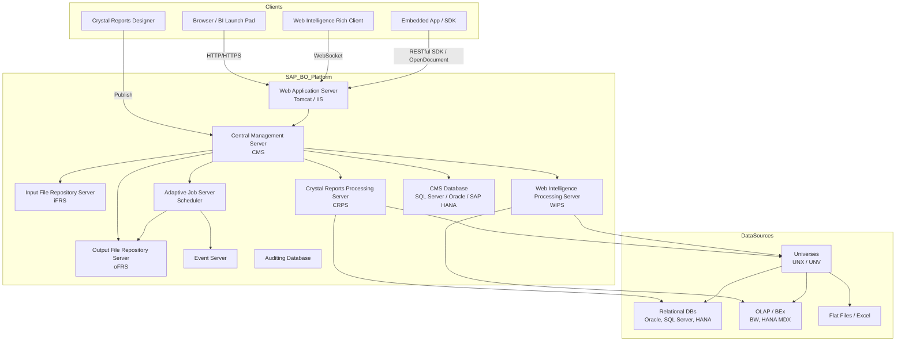
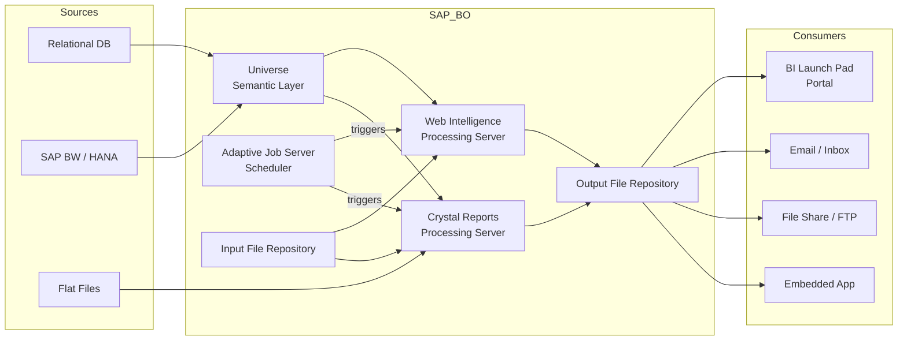

# SAP BusinessObjects (SAP BO) — SA Migration Guide

> This guide is written for Solution Architects scoping a migration from SAP BusinessObjects to a Databricks-centric analytics platform. It covers ecosystem overview, component architecture, artifact lifecycle, data sources, delivery model, governance, and full Databricks mapping — not hands-on configuration.

---

## Platform Architecture



---

## Data Flow



---

## 1. Ecosystem Overview

SAP BusinessObjects (SAP BO) is SAP's enterprise BI platform, covering pixel-perfect operational reporting, ad-hoc query and analysis, dashboards, and scheduled delivery. It sits within SAP's broader analytics portfolio alongside SAP Analytics Cloud (SAC), SAP HANA, and the BW/4HANA data warehouse. SAP acquired the BusinessObjects product line from Business Objects S.A. in 2008, and the platform retains strong adoption at large enterprises — particularly those already running SAP ERP, BW, or HANA.

**Product variants and editions:**

| Edition | Description |
|---|---|
| SAP BO Enterprise (on-prem) | Full server stack — CMS, processing servers, schedulers, file repositories. Most common in existing estates. |
| SAP BO Edge | Scaled-down on-prem version for mid-market. Fewer server tiers. |
| SAP Analytics Cloud (SAC) | SAP's SaaS successor. Separate product; not a drop-in replacement for BO. |
| SAP Crystal Reports (standalone) | Desktop-only pixel-perfect reporting tool; can publish to BO server or run standalone. |
| Embedded / OEM | BusinessObjects SDK used to embed reports in custom SAP or third-party apps. |

**Primary use cases customers rely on:**

- Operational reporting (Crystal Reports) — pixel-perfect, print-ready output consumed by finance, logistics, and HR teams
- Self-service ad-hoc analysis (Web Intelligence / Webi) — business users building their own queries on top of Universes
- Scheduled batch delivery — reports emailed or dropped to file shares on a nightly or weekly cadence
- Dashboards (Lumira / Xcelsius legacy) — summarized KPI views, often embedded in SAP portals
- Embedded BI — reports hosted inside custom applications via the BI Platform SDK or OpenDocument URL API

**Key discovery questions:**

- How many reports/dashboards exist in the CMS? How many have been accessed in the last 90 days?
- How are reports consumed — BI Launch Pad portal, embedded in SAP Fiori / custom apps, scheduled email, file drop?
- What data sources are connected — SAP BW/HANA BEx queries, relational DBs, Universes, flat files?
- What version of SAP BO is running? (4.x release — 4.2, 4.3 — matters for available APIs and export tools)
- Are Crystal Reports embedded in custom applications via the SAP Crystal Reports runtime or SDK?
- Is scheduled delivery (email / file share) business-critical? Who owns the recipient lists?
- How is security enforced — CMS groups, row-level security via Universe filters, or custom authentication?
- Is there a separate SAP BW or HANA system the Universes connect to? Is that system also being migrated?

---

## 2. Component Architecture

| Component | Role | What breaks without it | Migration Equivalent | SA Note |
|---|---|---|---|---|
| Central Management Server (CMS) | Master controller — manages users, groups, security, content catalog, server topology, and licenses | Everything. No reports can be scheduled, accessed, or published without CMS. | Databricks workspace + Unity Catalog (permissions) + partner BI workspace | The CMS database is the most valuable artifact for migration scoping — it holds the full inventory. |
| Web Application Server (Tomcat/IIS) | Hosts BI Launch Pad (portal) and RESTful SDK endpoints; proxies requests to processing servers | Portal access and API access lost; embedded apps break | Databricks SQL workspace / Power BI Service / Tableau Server | Customers often run this on a separate tier from processing servers. |
| Web Intelligence Processing Server (WIPS) | Executes Webi report queries, applies Universe logic, returns result sets | All Webi (ad-hoc) reports fail | Databricks SQL + Lakeview dashboards / Power BI / Tableau | WIPS is the heavy compute tier for self-service; most query load lives here. |
| Crystal Reports Processing Server (CRPS) | Renders Crystal Reports (.rpt) — executes embedded SQL/stored procedures, formats pixel-perfect output | All Crystal Reports fail | Databricks SQL + Power BI paginated reports / SSRS | Crystal Reports have no direct equivalent in modern cloud BI — this is the hardest migration class. |
| Adaptive Job Server (AJS) | Built-in scheduler — manages report schedules, bursting, and delivery (email, file, FTP) | All scheduled delivery stops | Databricks Workflows / partner BI native scheduling | AJS schedules and bursting rules encode significant business logic; inventory these early. |
| Input File Repository Server (iFRS) | Stores report definition files (.rpt, .wid) after publishing | Reports cannot be opened or executed | Version-controlled artifact store (Git + CI/CD) | iFRS is a file-system tier, not a database — files can be extracted directly. |
| Output File Repository Server (oFRS) | Stores cached/rendered output instances | Scheduled output history and cached results lost | Object storage (S3/ADLS) + delivery pipeline | Output instances are often large — assess whether history must be migrated. |
| Event Server | Triggers schedule execution based on file or API events | Event-triggered schedules stop firing | Databricks Workflows event triggers / partner orchestration | Often overlooked in scoping; ask if any schedules are event-triggered. |
| CMS Database (SQL Server / Oracle / HANA) | Relational store behind CMS — holds all metadata: users, groups, schedules, content catalog | CMS cannot start | Unity Catalog + metadata store | Querying the CMS DB directly is the fastest way to inventory the estate. |
| Auditing Database | Stores access and execution logs | Audit history and usage data lost | Databricks system tables / partner BI audit logs | Usage data from the audit DB is critical for identifying active vs. inactive reports. |
| Universe Design Tool / Information Design Tool (IDT) | Authoring tool for Universes (.unv / .unx semantic layer) | Not a runtime component — authoring only | dbt models + Unity Catalog semantic layer | Universes encode business logic (joins, calculated objects, filters) — these must be re-expressed. |

---

## 3. Artifact Lifecycle

| Stage | What happens | Where (server/client) | Artifact involved | Migration risk |
|---|---|---|---|---|
| **Author** | Developer builds Crystal Report in Crystal Reports Designer or Webi document in Web Intelligence rich client / thin client | Client (designer tool) or browser (thin client) | `.rpt` file (Crystal) / `.wid` file (Webi) | Crystal `.rpt` files contain embedded SQL, subreports, and formatting logic in a proprietary binary format |
| **Deploy / Publish** | Report is published to CMS via designer or BI Launch Pad. File is stored in iFRS; metadata (name, folder, security) is written to CMS DB | Server (CMS + iFRS) | `.rpt` / `.wid` stored in iFRS; CMS DB record | Publishing is not version-controlled natively — last published version wins |
| **Compile** | SAP BO does not pre-compile reports at publish time. Crystal Reports are partially parsed on first open; Webi documents compile the Universe query at execution time | Server, at execution time | In-memory query plan; Universe SQL | No intermediate compiled artifact persists — compilation is per-execution |
| **Execute** | Processing server (CRPS or WIPS) connects to data source, runs query, fetches result set. For Universe-based reports, the Universe translates the business query into SQL/MDX first | Server (CRPS / WIPS) | Result set (in-memory) | Stored procedures, MDX queries (BEx/HANA), and complex Universe filters are high-risk |
| **Render** | Processing server formats the result set into the requested output (HTML for portal, PDF/Excel for delivery). Crystal Reports rendering is fully server-side. Webi can render partly client-side in browser | Server (primary); browser (Webi interactive) | HTML stream / PDF / Excel / CSV file | Pixel-perfect Crystal Reports layouts use proprietary positioning logic — no direct cloud equivalent |
| **Deliver** | Rendered output is stored in oFRS and delivered via: portal view, email (AJS), file-share drop (AJS), or returned via OpenDocument URL | Server (AJS for scheduled delivery) | Output instance file in oFRS | Bursting (personalized multi-recipient delivery) encodes recipient and parameter logic in the schedule definition |

> **SA Tip:** The split between Crystal Reports (CRPS, pixel-perfect, batch-heavy) and Webi (WIPS, self-service, interactive) means these are two separate migration workstreams with different target tools. Establish this split early in scoping.

---

## 4. Data Sources and Dataset Model

SAP BO uses the **Universe** as its primary semantic layer — a metadata model that maps business-friendly objects (dimensions, measures, filters) onto underlying SQL or MDX. Crystal Reports bypass the Universe entirely and embed SQL or stored-procedure calls directly in the `.rpt` file.

**Data source connections:**

- **Universe (UNX/UNV):** Centrally defined; shared across multiple Webi reports. Encodes joins, calculated objects, and predefined filters. Connection to relational DB or OLAP is defined in the Universe, not the report.
- **Crystal Reports direct connection:** Each `.rpt` file embeds its own data source connection (DSN or JDBC string) and SQL/stored procedure. No shared semantic layer.
- **OLAP / BEx queries (SAP BW):** Webi can connect directly to BW BEx queries via BICS (BI Consumer Services) without a Universe. These generate MDX at runtime.
- **HANA views:** Webi and Crystal can connect to SAP HANA calculation views and attribute views directly.
- **Flat files / Excel:** Supported in Crystal Reports; less common in Webi.

| Data Source Type | Frequency in customer estates | Migration Path | Risk |
|---|---|---|---|
| Universe on relational DB (Oracle, SQL Server, HANA) | Very high — most Webi reports | Rebuild semantic layer as dbt models + Unity Catalog; re-express calculated objects as SQL | Medium — logic is documented in UNX but must be manually translated |
| SAP BW BEx queries (BICS/MDX) | High at SAP shops | Migrate BW data to Databricks lakehouse; replace BEx queries with Databricks SQL | High — BEx queries and hierarchies have no direct SQL equivalent; data migration is a dependency |
| Crystal Reports direct SQL / stored procedures | High for operational reports | Migrate SQL to Databricks SQL; replace stored procedure logic with dbt or notebooks | Medium-High — stored procedures may contain complex DML; Crystal rendering has no equivalent |
| SAP HANA calculation views | Medium | Expose HANA views via Databricks external data or migrate to Unity Catalog tables | Medium — depends on whether HANA is being decommissioned |
| Flat files / Excel | Low | Ingest to Databricks with Auto Loader or landing zone pipeline | Low |
| Multidimensional (OLAP cubes, MDX) | Medium at large enterprises | Replace with Databricks SQL aggregations or partner BI semantic layer | High — MDX hierarchies and named sets require redesign |

**Parameters and filters:**

Universes support predefined filters (static) and prompted filters (user-supplied at runtime). Cascading prompts (where the value of one prompt constrains the next) are common in Webi and encode business logic in the Universe definition. Crystal Reports use parameter fields, which can also cascade via sub-reports. Both types must be inventoried and re-expressed in the target tool.

> **SA Tip:** Cascading prompts and dynamic filters are among the most frequently underestimated migration items. Ask the customer to demo their 10 most-used reports — if cascading prompts appear, flag this as Medium risk minimum.

---

## 5. Rendering and Delivery Model

| Delivery Mode | How it works | Business use case | Migration equivalent | Risk |
|---|---|---|---|---|
| BI Launch Pad portal | User logs in, navigates folder tree, opens report on-demand or views cached instance | Daily operational review, ad-hoc exploration | Databricks SQL workspace / Power BI Service / Tableau Server | Low — portal navigation maps to any modern BI workspace |
| OpenDocument URL | Direct URL with embedded parameters — links to a specific report with pre-filled prompts | Embedded links in emails, SAP portals, custom apps | Power BI URL filters / Tableau URL parameters / Databricks SQL parameterized queries | Medium — URL parameter encoding is BO-specific; consumers must update links |
| Scheduled email (AJS) | AJS runs report on schedule, renders to PDF/Excel/CSV, emails output to recipient list | Finance/operations reports delivered to inboxes | Power BI subscriptions / Tableau subscriptions / Databricks Workflows + email step | Medium — recipient lists and format options must be re-created |
| Bursting (data-driven distribution) | AJS generates personalized versions of a report per recipient, filtered by their identity or a data-driven recipient list | Individualized sales reports, regional P&L | Power BI data-driven subscriptions / custom Databricks Workflow with per-user parameter loop | High — bursting logic encodes row-level filtering and recipient mapping; no direct equivalent in most tools |
| File share / FTP drop (AJS) | AJS renders and writes output to a network share or FTP location | Downstream system feeds, archiving, compliance | Databricks Workflows writing to ADLS/S3; partner BI file export step | Medium — file path and naming conventions must be replicated |
| Embedded app (SDK / OpenDocument) | Custom application renders BO reports inline using the BI Platform SDK or an iframe with OpenDocument URLs | SAP Fiori apps, custom portals, legacy intranet tools | Power BI Embedded / Tableau Embedded / Databricks SQL embedded endpoint | High — SDK integration is tightly coupled to BO runtime; full re-implementation required |

> **SA Tip:** Ask the customer specifically about bursting. It is commonly used in finance and HR for distributing personalized reports (e.g., one report per cost center manager) and has no single-step equivalent in any modern cloud BI tool. If bursting is present, add it to the risk register immediately.

---

## 6. Project Structure and Version Control

**Folder and catalog structure:**

SAP BO organizes content in a folder hierarchy stored in the CMS. Folders are security boundaries as well as organizational units — CMS rights can be applied at the folder level and inherited downward. There is no concept of a "project file" on the server; the CMS DB is the authoritative content store.

**Native version control:** SAP BO has no built-in version control. The last published version of a report is the live version. Some customers use the Lifecycle Manager (LCM) tool to promote content between Dev/QA/Prod environments, but this is not the same as Git-style branching.

**Environment promotion:**

- **Lifecycle Manager (LCM):** SAP's built-in promotion tool. Exports a bundle (BIAR file) containing selected reports, Universes, users, and security settings. Used to promote Dev → QA → Prod. Promotion is a manual or scripted process.
- **BIAR files:** Binary bundle format used by LCM for transport. Contains all selected CMS objects. Can be generated and consumed via the LCM command-line tool.

**Command-line / scripting tools:**

| Tool | Purpose |
|---|---|
| LCM (Lifecycle Manager) | Promote content bundles between environments |
| RESTful SDK (BI Platform) | Query CMS metadata, export/import objects, manage schedules via REST API |
| Query Builder (CMS query language) | SQL-like interface to query the CMS DB directly from the BI Launch Pad admin console |
| `lcm_cmd` CLI | Command-line interface to LCM for scripting promotions |

> **SA Tip:** Ask the customer whether they have source-controlled `.rpt` or `.unx` project files outside the CMS, or whether the CMS is the only copy. Most customers treat the CMS as the source of truth, with no external version control — this is a migration risk if the CMS DB is corrupted or inaccessible.

---

## 7. Orchestration and Scheduling

**Built-in scheduler (Adaptive Job Server):**

The Adaptive Job Server (AJS) is the native scheduler. It supports:
- Time-based schedules (once, hourly, daily, weekly, monthly, calendar-based)
- Event-based triggers (file arrival, API event)
- Recurring or one-time execution
- Bursting (personalized multi-recipient delivery from a single schedule definition)
- Multiple output formats and destinations per schedule

**Subscriptions:** BI Launch Pad users can create their own subscriptions to receive report instances via email or BI inbox. These are stored as schedule objects in the CMS.

**External triggering:** The REST API can trigger a report schedule programmatically. ETL pipelines can call the BI Platform REST API to kick off report execution after a data load completes — a pattern common in SAP BW shops.

**External scheduler dependency:** Some customers augment AJS with an enterprise scheduler (Control-M, Autosys) that calls the BO REST API or wraps `lcm_cmd`. Ask if there are any schedules managed outside of SAP BO.

**Migration target:**

| SAP BO scheduling capability | Migration target |
|---|---|
| Time-based AJS schedules | Databricks Workflows (cron triggers) / Power BI subscriptions / Tableau subscriptions |
| Event-triggered schedules (file arrival) | Databricks Workflows (file arrival trigger) / cloud event grid |
| Bursting / data-driven distribution | Custom Databricks Workflow with parameterized notebook loop; Power BI data-driven subscriptions |
| ETL pipeline → BO REST API trigger | Databricks Workflows task dependency (run after ETL job) |
| Enterprise scheduler (Control-M) wrapping BO | Keep external scheduler; replace BO API calls with Databricks REST API or partner BI API calls |

---

## 8. Metadata, Lineage, and Impact Analysis

**Where the catalog lives:**

All content metadata lives in the **CMS database** (SQL Server, Oracle, or SAP HANA). The schema is accessible and queryable. Key tables and views:

| Table / View | What it contains |
|---|---|
| `CMS_InfoObjects` / `SI_*` views | All CMS objects (reports, folders, Universes, users, schedules) with properties |
| `SI_SCHEDULEINFO` | Schedule definitions — frequency, destination, parameters |
| `SI_SECURITY_INFO` | Security assignments per object |
| Auditing DB: `ADS_EVENT` | Access and execution events with timestamps and user info |
| Auditing DB: `ADS_OBJECT` | Object metadata cross-reference for audit events |

**Built-in lineage:** SAP BO has no native end-to-end data lineage. Universe-to-report linkage can be inferred from CMS metadata. Report-to-table lineage requires parsing the Universe `.unx` or the embedded SQL in `.rpt` files.

> **SA Tip:** The auditing database is the single most valuable artifact for scoping. Query `ADS_EVENT` for the last 90 days to identify which reports are actively used and which are dead weight. Customers are often surprised to find 40–60% of their catalog has zero usage.

**Useful CMS queries (via Query Builder or direct DB query):**

```sql
-- Count total reports by type
SELECT SI_KIND, COUNT(*) AS report_count
FROM CMS_InfoObjects
WHERE SI_KIND IN ('CrystalReport', 'Webi', 'Lumira')
GROUP BY SI_KIND;

-- Identify unused reports (no access in 90 days)
SELECT o.SI_NAME, o.SI_PATH, o.SI_KIND, MAX(e.EVENT_TIMESTAMP) AS last_accessed
FROM ADS_OBJECT o
LEFT JOIN ADS_EVENT e ON o.OBJECT_ID = e.OBJECT_ID
  AND e.EVENT_TIMESTAMP >= DATEADD(day, -90, GETDATE())
GROUP BY o.SI_NAME, o.SI_PATH, o.SI_KIND
HAVING MAX(e.EVENT_TIMESTAMP) IS NULL;

-- List data sources (Universe connections)
SELECT SI_NAME, SI_UNIVERSE_CONNECTION, SI_PATH
FROM CMS_InfoObjects
WHERE SI_KIND = 'Universe';

-- List schedules and their destinations
SELECT SI_NAME, SI_SCHEDULEINFO, SI_DESTINATION_TYPE, SI_CUID
FROM CMS_InfoObjects
WHERE SI_SCHEDULEINFO IS NOT NULL;
```

*(Exact column names vary by BO version and CMS DB platform — validate against your customer's schema.)*

---

## 9. Data Quality and Governance

**Row-level security:**

SAP BO implements row-level security primarily through **Universe-level security** (Data Security Profiles in IDT): SQL WHERE clause fragments are applied based on the user's CMS group membership. When a user runs a Webi report, the Universe appends the appropriate filter to the generated SQL before it reaches the database.

Crystal Reports implement row-level access either through parameterized SQL in the `.rpt` file or by relying on the database-level security of the underlying data source.

**Column-level security:**

Universes support **Business Security Profiles** that can restrict which objects (columns/measures) are visible to specific user groups. This is not enforced at the database level — it is enforced by the Universe engine at query time.

**Data freshness and caching:**

- Report instances (scheduled outputs) are snapshots stored in oFRS — they do not update unless the schedule runs again.
- On-demand reports can be set to use a cached instance (if one exists within a freshness window) or to always refresh.
- Universes can cache query results at the WIPS tier.

**Custom code and scripting:**

| Custom code type | Where it appears | Migration risk |
|---|---|---|
| Universe calculated objects (SQL expressions) | UNX/UNV Universe definition | Medium — must be manually translated to SQL / dbt metrics |
| Universe custom SQL WHERE filters (security) | Universe Data Security Profiles | Medium — must be re-expressed as Unity Catalog row filters |
| Crystal Reports formula language (Business Objects formula syntax) | `.rpt` report fields and sections | High — proprietary formula language with no direct equivalent |
| Crystal Reports sub-reports | Nested `.rpt` calls within a parent report | High — no equivalent in cloud BI; must be redesigned as joined queries or separate reports |
| Webi variables and custom formulas | Webi document variable panel | Medium — some map to DAX/LOD; complex custom aggregations require redesign |
| SDK extensions / Java/.NET custom data providers | CMS server extensions, custom report plugins | Critical — requires full re-implementation |

**Migration target:** Unity Catalog row filters and column masks replace Universe security profiles. Workspace-level permissions in Databricks SQL / partner BI replace CMS group-level access rights.

---

## 10. File Formats and Artifact Reference

### Crystal Reports File (`.rpt`)

**What it is:** Binary report definition file. Contains the report layout, embedded SQL or stored procedure calls, formula logic, sub-report references, parameter definitions, and data source connection string.

| Property | Value |
|---|---|
| Created by | SAP Crystal Reports Designer (desktop tool) |
| Stored in | iFRS (server) or local filesystem (standalone) |
| Contains | Layout, SQL/stored procedures, formulas, parameters, connection string |
| Human-readable | No — binary format |
| Migration target | Power BI paginated reports (.rdl) / SSRS / redesign as Databricks SQL + Lakeview |

> **SA Tip:** There is no automated `.rpt` → modern BI converter. Each Crystal Report must be assessed and re-built. Prioritize by usage frequency from the audit DB.

---

### Web Intelligence Document (`.wid`)

**What it is:** Binary Webi report document. Contains the Universe connection reference, query specification (business objects, filters, prompts), report tabs, charts, and formatting.

| Property | Value |
|---|---|
| Created by | Web Intelligence thin client (browser) or rich client desktop tool |
| Stored in | iFRS (server) |
| Contains | Universe reference, query definition, report layout, variables |
| Human-readable | No — binary format |
| Migration target | Power BI / Tableau / Lakeview dashboards connected to Unity Catalog |

> **SA Tip:** Webi documents are more tractable than Crystal Reports because their data logic lives primarily in the Universe (which can be inspected). The report layout must still be rebuilt, but query logic is more portable.

---

### Universe File (`.unx` / `.unv`)

**What it is:** Semantic layer definition file. `.unv` is the legacy format (Universe Designer); `.unx` is the current format (Information Design Tool / IDT). Contains data foundation (tables, joins), business layer (dimensions, measures, calculated objects, filters), and security profiles.

| Property | Value |
|---|---|
| Created by | Universe Designer (legacy) / Information Design Tool (IDT) |
| Stored in | iFRS (server) or exported as `.unx`/`.unv` file |
| Contains | Connection, joins, calculated objects, security profiles, prompts |
| Human-readable | `.unx` is XML-based (zipped); `.unv` is binary |
| Migration target | dbt models + Unity Catalog semantic layer / Power BI semantic model / Tableau data model |

> **SA Tip:** Exporting `.unx` files and parsing the XML is the fastest way to inventory Universe objects, calculated measures, and security profiles without querying the CMS DB.

---

### BIAR File (`.biar`)

**What it is:** Binary transport bundle produced by Lifecycle Manager. Contains a selected set of CMS objects (reports, Universes, users, schedules, security) for environment promotion or backup.

| Property | Value |
|---|---|
| Created by | SAP Lifecycle Manager (LCM) / `lcm_cmd` CLI |
| Stored in | Local filesystem / archive |
| Contains | Multiple CMS objects — reports, Universes, users, schedules |
| Human-readable | No — proprietary binary bundle |
| Migration target | Not applicable — used as export mechanism for migration; contents must be individually assessed |

> **SA Tip:** If the customer has BIAR files used for environment promotion, these are evidence of a deployment process — not source control. The actual report `.rpt`/`.wid` files inside the BIAR are the artifacts of interest.

---

### Connection File (`.cns`)

**What it is:** Shared data source connection definition stored in the CMS. Referenced by Universes to establish database connections.

| Property | Value |
|---|---|
| Created by | Information Design Tool / Central Management Console |
| Stored in | CMS DB (as a managed object) |
| Contains | JDBC/ODBC connection parameters, credentials reference |
| Human-readable | Partially — visible in IDT |
| Migration target | Databricks SQL warehouse connection / Unity Catalog data source |

---

### Schedule / Subscription Object (CMS DB record)

**What it is:** A CMS metadata object representing a schedule rule or user subscription. Stored as a record in the CMS DB, not as a file. Contains execution frequency, output format, destination (email / file share / BI inbox), and parameter values (including bursting recipient lists).

| Property | Value |
|---|---|
| Created by | BI Launch Pad (admin or user) / REST API |
| Stored in | CMS database |
| Contains | Schedule frequency, destination, parameters, bursting rules |
| Human-readable | Via Query Builder / CMS DB query |
| Migration target | Databricks Workflows / Power BI subscriptions / Tableau subscriptions |

---

### Artifact Quick-Reference Summary

| Artifact | Extension / Location | Human-readable | Where stored | Migration target | Risk level |
|---|---|---|---|---|---|
| Crystal Report | `.rpt` | No (binary) | iFRS | Power BI paginated / redesign | High |
| Webi document | `.wid` | No (binary) | iFRS | Power BI / Tableau / Lakeview | Medium |
| Universe (current) | `.unx` | Yes (zipped XML) | iFRS | dbt + Unity Catalog / BI semantic model | Medium |
| Universe (legacy) | `.unv` | No (binary) | iFRS | dbt + Unity Catalog / BI semantic model | Medium |
| BIAR bundle | `.biar` | No (binary) | Local FS / archive | Extract contents individually | N/A |
| Connection file | `.cns` | Partial | CMS DB | Databricks SQL warehouse connection | Low |
| Schedule/subscription | CMS DB record | Via Query Builder | CMS DB | Databricks Workflows / BI subscriptions | Medium–High |
| Lumira dashboard | `.lumx` / CMS | No | CMS DB / iFRS | Lakeview / Power BI | Medium |

---

## 11. Migration Assessment and Artifact Inventory

**Preferred inventory method:** Query the CMS database directly or use the BI Platform REST API. The Query Builder tool in the admin console is useful for one-off queries but slow for bulk exports.

> Do NOT rely on the BI Launch Pad UI for counting. The UI hides system folders, personal folders, and inbox items. The CMS DB gives the true count.

**Complexity scoring dimensions:**

| Dimension | Low | Medium | High | Critical |
|---|---|---|---|---|
| Data source type | Relational SQL (single DB) | Multiple relational DBs; HANA views | SAP BW BEx / OLAP MDX | BEx + complex hierarchies + custom MDX |
| Query / dataset complexity | Simple SELECT; Universe with flat objects | Multi-join Universe; moderate SQL | Stored procedures; complex Universe with @functions | Recursive CTEs; BEx calculated key figures; custom SQL functions |
| Parameter complexity | No parameters; static filters | Simple prompted filters | Cascading prompts; multi-value LOVs | Data-driven / dynamic parameters; bursting recipient lists |
| Custom code | No formulas | Universe calculated objects; simple Webi variables | Crystal formula language; Webi complex variables | Sub-reports; SDK extensions; custom data providers |
| Sub-report / drill-through depth | None | One level drill-through | Nested sub-reports (2 levels) | 3+ levels of nested sub-reports |
| Delivery complexity | Portal on-demand only | Scheduled email; file drop | Bursting to multiple recipients | Embedded app via SDK; data-driven bursting with dynamic recipients |
| Security model complexity | Simple folder-level CMS rights | Universe-level row security (Data Security Profiles) | Dynamic row security based on user attributes | Custom authentication; external LDAP; cascading security across Universe and DB |

**Top migration risks to flag early:**

1. **Crystal Reports with sub-reports** — Nested sub-reports are common in operational reporting and have no equivalent in modern cloud BI tools. Each requires a redesign, not a conversion.
2. **SAP BW BEx query dependency** — If the customer's Universes or direct Webi connections point to BW BEx queries, the data migration (BW → Databricks) is a hard dependency that must be scoped separately and typically precedes BI migration.
3. **Bursting schedules with data-driven recipient lists** — No modern cloud BI tool has a direct equivalent. This requires custom orchestration logic and is often underestimated.
4. **Embedded BO via SDK in custom applications** — Applications using the BI Platform Java/.NET SDK to render reports inline require a full re-implementation against a new embedded BI API. Timeline and effort are often 2–3x larger than standalone report migration.
5. **Crystal Reports formula language** — The Crystal formula language (Basic syntax and Crystal syntax variants) is proprietary and has no automated conversion path. Complex formulas in widely-used operational reports are a significant manual effort.
6. **Universe security profiles used as the primary RLS mechanism** — If row-level security is entirely encoded in Universe Data Security Profiles (not the underlying DB), migrating those rules to Unity Catalog row filters requires a full audit of the security model.

**Sample inventory query:**

```sql
-- Comprehensive report inventory with usage, data source, and schedule info
SELECT
    o.SI_NAME                          AS report_name,
    o.SI_PATH                          AS folder_path,
    o.SI_KIND                          AS report_type,
    o.SI_CREATION_TIME                 AS created_date,
    MAX(e.EVENT_TIMESTAMP)             AS last_accessed,
    COUNT(e.EVENT_ID)                  AS access_count_90d,
    o.SI_UNIVERSE_CONNECTION           AS universe_or_datasource,
    CASE WHEN o.SI_HAS_PROMPTS = 1 THEN 'Yes' ELSE 'No' END AS has_parameters,
    CASE WHEN sched.SI_CUID IS NOT NULL THEN 'Yes' ELSE 'No' END AS has_schedule
FROM CMS_InfoObjects o
LEFT JOIN ADS_OBJECT ao ON o.SI_CUID = ao.OBJECT_CUID
LEFT JOIN ADS_EVENT e
    ON ao.OBJECT_ID = e.OBJECT_ID
    AND e.EVENT_TIMESTAMP >= DATEADD(day, -90, GETDATE())
LEFT JOIN CMS_InfoObjects sched
    ON sched.SI_PARENTID = o.SI_ID
    AND sched.SI_KIND = 'ScheduleObject'
WHERE o.SI_KIND IN ('CrystalReport', 'Webi', 'Lumira', 'Dashboard')
  AND o.SI_PATH NOT LIKE '%/System Folders/%'
GROUP BY
    o.SI_NAME, o.SI_PATH, o.SI_KIND,
    o.SI_CREATION_TIME, o.SI_UNIVERSE_CONNECTION,
    o.SI_HAS_PROMPTS, sched.SI_CUID
ORDER BY access_count_90d DESC;
```

*(Column names are illustrative — validate against actual CMS schema version.)*

---

## 12. Migration Mapping to Databricks

### Report Types

| SAP BO artifact | Databricks / partner BI target | Notes |
|---|---|---|
| Webi (self-service, interactive) | Power BI / Tableau / Lakeview dashboards | Closest match — rebuild queries on Databricks SQL warehouse |
| Crystal Reports (pixel-perfect, operational) | Power BI paginated reports / SSRS on Azure | No automated conversion; manual rebuild required |
| Lumira / Xcelsius dashboards | Lakeview dashboards / Power BI dashboards | KPI/summary dashboards are straightforward; complex Lumira models less so |
| BI Launch Pad portal | Databricks SQL workspace / Power BI workspace / Tableau Server | Navigation and folder structure maps to workspace folders |

### Data Sources

| SAP BO data source | Databricks target |
|---|---|
| Universe on relational DB | Databricks SQL warehouse; recreate semantic logic as dbt models or Unity Catalog |
| SAP BW BEx queries | Migrate BW data to Databricks; replace BEx with Databricks SQL |
| SAP HANA views | Expose via Databricks external catalog or migrate to Unity Catalog tables |
| Direct SQL / stored procedures | Databricks SQL; migrate stored procedure logic to dbt or notebooks |
| Flat files | Ingest to Delta Lake via Auto Loader |

### Security

| SAP BO mechanism | Databricks / Unity Catalog target |
|---|---|
| Universe Data Security Profiles (row filter) | Unity Catalog row filters on Delta tables |
| Universe Business Security Profiles (column visibility) | Unity Catalog column masks |
| CMS folder-level access rights | Databricks workspace folder permissions / Unity Catalog grants |
| CMS group-based access | Unity Catalog data access grants mapped to Azure AD / Okta groups |
| SAP authentication (LDAP / SAP SSO) | Databricks SSO via SAML/OIDC; partner BI SSO |

### Scheduling and Delivery

| SAP BO capability | Migration target |
|---|---|
| AJS time-based schedule | Databricks Workflows cron task / Power BI subscriptions / Tableau subscriptions |
| AJS event-triggered schedule | Databricks Workflows file arrival / event trigger |
| Bursting (data-driven, multi-recipient) | Custom Databricks Workflow with parameterized loop; Power BI data-driven subscriptions (Premium) |
| Email delivery | Databricks Workflows email step; partner BI email subscriptions |
| File share / FTP drop | Databricks Workflows writing to ADLS/S3; Azure Data Factory copy activity |

### Governance and Lineage

| SAP BO capability | Migration target |
|---|---|
| CMS catalog / folder browser | Databricks Unity Catalog Explorer / partner BI workspace |
| CMS security model | Unity Catalog grants + workspace permissions |
| Audit database (access logs) | Databricks system tables (`system.access.audit`) |
| Universe object lineage (inferred) | Unity Catalog lineage (table/column level) |

### Embedded BI

| SAP BO capability | Migration target |
|---|---|
| BI Platform SDK (Java/.NET) | Power BI Embedded (Azure) / Tableau Embedded / Databricks SQL embedded endpoint |
| OpenDocument URL (parameterized link) | Power BI URL filters / Tableau URL parameters / Databricks SQL share URL |
| SAP Fiori BO integration | Power BI + Fiori launchpad tile / rebuild in SAP Analytics Cloud |

---

### What Doesn't Map Cleanly

| SAP BO capability | Why it doesn't map | SA recommendation |
|---|---|---|
| Crystal Reports sub-reports | Sub-reports are a pixel-perfect layout concept — a report nested inside another with independent queries. No cloud BI tool has this construct. | Redesign as a single flattened query with joins, or split into separate linked reports with drill-through. |
| Universe BEx BICS connectivity (MDX/BW hierarchies) | BEx queries return hierarchical result sets with ragged hierarchies and calculated key figures that don't translate to flat SQL. The BICS protocol is proprietary. | Migrate BW data to Databricks (Parquet/Delta) first; flatten hierarchies; rebuild metrics as dbt models. |
| Data-driven bursting with dynamic recipient lists | AJS can execute a query to determine recipients and their parameter values at runtime, then generate hundreds of personalized report versions. No single modern BI tool replicates this natively. | Build a Databricks Workflow that queries the recipient list, loops over recipients, and calls the partner BI API (Power BI / Tableau) per recipient. |
| Crystal Reports formula language (conditional formatting, complex cross-tabs) | The Crystal formula language supports conditional formatting, running totals, and cross-tab pivoting that are layout-bound concepts — not query concepts. | Accept as manual rebuild effort; use Power BI paginated reports for layout-sensitive output and accept some formatting loss. |
| CMS security inheritance (folder → object hierarchy) | BO security is a multi-level inheritance model (group → folder → object → field) with override rules. Unity Catalog uses table/column/row grants, not a folder inheritance model. | Map CMS groups to Azure AD / Okta groups; re-express folder security as Unity Catalog grants; document any override exceptions. |
| BO Inbox (internal report distribution) | The BI Launch Pad has a built-in inbox for routing reports between users — a lightweight internal messaging system. No modern cloud BI platform has this. | Replace with email subscription delivery or Teams/Slack notification from Databricks Workflows. |

---

## 13. Quick-Reference Cheat Sheet

| Topic | Key fact | SA question to ask |
|---|---|---|
| Report count heuristic | Large SAP BO estates typically have 2,000–10,000+ CMS objects; 40–60% are typically unused | Query ADS_EVENT for 90-day access count before estimating migration scope |
| Crystal vs. Webi split | Crystal Reports = operational, pixel-perfect, embedded SQL; Webi = self-service, Universe-based. These are two separate migration workstreams. | What percentage of your reports are Crystal vs. Webi? |
| Where usage data lives | Auditing database (ADS_EVENT table) — separate DB from the CMS; must be enabled by the customer | Is the auditing database enabled and populated? How far back does it go? |
| Top migration risk #1 | Crystal Reports sub-reports have no cloud BI equivalent — manual rebuild required | Do any of your top-used Crystal Reports contain nested sub-reports? |
| Top migration risk #2 | SAP BW BEx query dependency — BI migration cannot complete until BW data is in Databricks | Is BW/4HANA being migrated to Databricks? What is the timeline? |
| Top migration risk #3 | Bursting schedules with dynamic recipient lists — no direct cloud equivalent | Do you use data-driven bursting to distribute personalized reports? How many schedule rules? |
| Source control gap | SAP BO has no native version control. CMS is the source of truth. Report files are not in Git. | Do you maintain `.rpt` or `.unx` files outside the CMS in any version control system? |
| Embedded app risk | Applications using the BI Platform SDK require full re-implementation — not a configuration change | Are any BO reports rendered inside custom applications via the SDK? Which applications? |
| Universe = semantic layer | Universes encode joins, calculated measures, and row security. Migrating Universes is the equivalent of migrating a semantic model. | How many Universes are in use? Who owns them — IT or a central BI team? |
| CMS DB access | Direct CMS DB access is the fastest path to full inventory. Requires DBA cooperation. | Can your DBA provide read access to the CMS database and the auditing database for scoping? |
