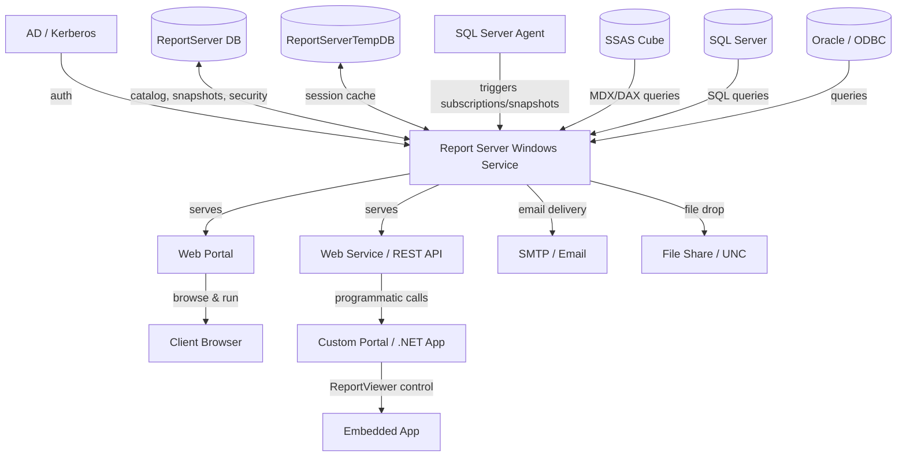
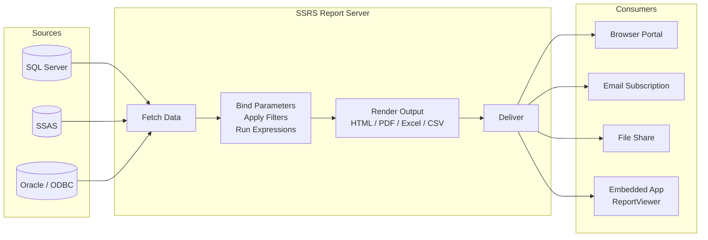

# SSRS Migration Guide for Solution Architects

> This guide is for SAs analyzing a customer's SSRS estate and mapping it to Databricks (with Databricks SQL, Lakeview, Power BI, or Tableau). It is not a developer lab — focus is on understanding, discovery, and migration mapping.

---

## Platform Architecture



## Data Flow



---

## 1. Ecosystem Overview

SQL Server Reporting Services (SSRS) is Microsoft's server-based reporting platform, shipped as part of SQL Server since 2000. It lives in the **Microsoft BI stack** alongside:

| Product | Role |
|---|---|
| SSRS | Paginated, pixel-perfect operational reports — the focus of this guide |
| SSAS | Analytical engine (OLAP cubes via MDX, tabular models via DAX) |
| SSIS | ETL/data movement tool (pipelines, not reports) |
| Power BI | Self-service and interactive dashboards — the modern Microsoft BI platform |

### Product Variants

| Variant | Where it runs | Key difference |
|---|---|---|
| SSRS (classic) | On-premises Windows Server | The baseline; ships with SQL Server |
| Power BI Report Server | On-premises | A fork of SSRS that also renders Power BI Desktop (.pbix) files; requires Power BI Premium licensing |
| Azure Paginated Reports (Power BI Premium) | Azure / cloud | SSRS-compatible cloud service; accepts RDL files directly |

### Why Customers Use It

- **Operational reporting** — scheduled reports delivered to inboxes or file shares daily/weekly
- **Pixel-perfect output** — fixed-layout reports for invoices, statements, regulatory filings where exact formatting matters
- **Embedded reports** — rendered inside custom .NET applications via the ReportViewer control
- **Enterprise delivery** — data-driven subscriptions that distribute personalized report slices to thousands of recipients from a database-driven recipient list

### Key Discovery Questions

- How many reports are in the catalog? How many have been executed in the last 90 days? (Query `ExecutionLogStorage` — most estates have 60–80% unused)
- Are reports embedded in applications via ReportViewer, or accessed via the portal or direct URL?
- What data sources are in use — SQL Server only, or SSAS, Oracle, flat files?
- Is this plain SSRS or Power BI Report Server?
- Are email or file-share subscriptions business-critical? Are any data-driven subscriptions in use?
- Is Kerberos constrained delegation configured for data source connections?
- Are there external .NET assemblies (`.dll` files) deployed to the Report Server?

---

## 2. Component Architecture

| Component | Role | What breaks if it's gone | Migration Equivalent |
|---|---|---|---|
| **Report Server Windows Service** | Core processing engine — handles rendering, scheduling, delivery, and snapshot generation | Everything stops; no reports execute, no deliveries fire | No direct equivalent in cloud BI — this is the hardest component to replace |
| **Web Portal** | Browser UI for browsing, running, managing, and uploading reports | Users lose self-service access; admins can't manage via UI | Databricks SQL workspace, Power BI Service workspace, Tableau Server |
| **Web Service / REST API** | SOAP (legacy) and REST endpoints for programmatic report execution, parameter passing, and subscription management | Custom portals and integrations that call the API break | Partner BI REST APIs (Power BI REST API, Tableau REST API); Databricks SQL API |
| **ReportServer DB** | SQL Server database storing the entire catalog: RDL blobs, datasets, data sources, snapshots, subscriptions, security assignments, execution history | Complete loss of all report definitions and metadata — this IS the source of truth | No equivalent as a single artifact; content must be extracted before decommission |
| **ReportServerTempDB** | Temporary session data, cached report output, execution snapshots | Active sessions break; cached reports clear | Not a migration target |
| **ExecutionLogStorage view** | Usage telemetry: who ran what, when, in what format | Not a runtime dependency — but losing this data before migration means losing the scoping baseline | Databricks audit logs / partner BI usage analytics |
| **SQL Server Agent** | Backs SSRS's built-in scheduler — subscriptions and snapshot schedules won't fire without it | No scheduled reports or deliveries — customers sometimes don't know this dependency | Databricks Workflows, Azure Data Factory, Power BI Premium scheduled refresh |

> **SA Tip:** The Report Server Windows Service is the component with no cloud equivalent. When a customer says "we're moving to Azure," they need to understand that SSRS itself isn't moving — its reports move to Power BI paginated reports or another platform, and the delivery automation must be rebuilt.

---

## 3. Artifact Lifecycle

| Stage | What Happens | Where (Server / Client) | Artifact Involved | Migration Risk |
|---|---|---|---|---|
| **Author** | Developer writes report in SSDT/Visual Studio or Report Builder | Client | `.rdl` file (XML) | Low — RDL is portable; risk is in the content (MDX, VB.NET code) |
| **Deploy** | RDL is uploaded to Report Server via Web Portal, SSDT Publish, or `rs.exe`; stored as binary blob in `Catalog` table | Server | RDL XML blob in `ReportServer.dbo.Catalog` | Medium — if customer has no SSDT project in source control, the catalog IS the source of truth |
| **Compile** | At first render (or snapshot time), Report Server parses RDL XML and compiles into an in-memory intermediate format; embedded VB.NET expressions are compiled here | Server | In-memory intermediate representation | High for custom code — VB.NET expressions and code blocks have no direct migration path |
| **Execute** | Report Server fetches data from configured sources, binds parameters, applies filters, runs all expressions — entirely server-side | Server | Query results, parameter values | Medium — data source connectivity and query compatibility must be validated |
| **Render** | Output generated server-side in requested format: HTML5, PDF, Excel, Word, CSV, XML | Server | Rendered output (HTML, PDF, etc.) | Medium for pixel-perfect layouts — Databricks SQL / Lakeview don't replicate fixed-layout rendering |
| **Deliver** | Output reaches consumer via portal, URL, email subscription, file share, or ReportViewer | Server → Client | Rendered output | High for data-driven subscriptions and ReportViewer integrations |

> **SA Tip:** Everything in SSRS is server-side. The client browser or embedded app never touches the underlying data. This is a key selling point for security-conscious customers — and a key constraint to explain when proposing self-service alternatives.

---

## 4. Data Sources and Dataset Model

### Data Sources

| Type | Description | Migration Path | Risk |
|---|---|---|---|
| **Shared Data Source (.rds)** | Centrally defined connection reused across reports; stored in catalog | Replace with Databricks SQL warehouse connection or Unity Catalog external location | Low — one change propagates to all reports using it |
| **Embedded Data Source** | Connection string baked into a single report's RDL | Must be found by parsing RDL XML — not visible in the portal | Medium — no central inventory; requires XML parsing at scale |

### Datasets

| Type | Description | Migration Path | Risk |
|---|---|---|---|
| **Shared Dataset (.rsd)** | Reusable SQL or MDX query with parameters; stored separately in catalog | Migrate to Databricks SQL named queries or dbt models | Low-Medium |
| **Embedded Dataset** | Query defined inside the report RDL — most common pattern | Extract and migrate per-report | Medium at scale |

### Data Source Types

| Data Source Type | Frequency | Migration Path | Risk |
|---|---|---|---|
| SQL Server | Very high | Databricks SQL warehouse (JDBC/ODBC) | Low |
| SSAS MDX (cubes) | High in older estates | Flatten cube logic to SQL; rebuild in Databricks AI/BI semantic layer or Unity Catalog | High — MDX measures, hierarchies, and calculated members don't translate to flat SQL |
| SSAS DAX (tabular) | Power BI Report Server only | Power BI semantic model (natural fit) | Medium |
| Oracle / ODBC | Medium | Databricks SQL with appropriate JDBC driver | Medium — connection migration + query dialect adjustments |
| SharePoint lists | Low | Rebuild as ingested tables in Unity Catalog | High — rarely maintained, often orphaned |
| Flat files (CSV, Excel) | Low | Ingest to Unity Catalog | Medium |

### Parameter Model

SSRS parameters are defined per-report. They can be **cascading** — one parameter's available values are populated by a query that uses a prior parameter's selected value. Cascading parameters are a complexity signal: they encode data model assumptions (hierarchical relationships) that must be rebuilt in the target BI tool.

> **SA Tip:** Ask specifically about cascading parameters and data-driven subscriptions. These two patterns are the most common sources of "this will take longer than expected" surprises in SSRS migrations.

---

## 5. Rendering and Delivery Model

### Rendering Modes

| Mode | How It Works | Migration Consideration |
|---|---|---|
| **On-demand** | Report executed at request time against live data source | Standard; maps to interactive query in Databricks SQL |
| **Cached** | Output stored for N minutes after first execution; subsequent requests get the cached copy | Replace with BI tool's own caching / materialized views |
| **Snapshot** | Report executed on a schedule; output stored permanently; users always see snapshot data | Requires equivalent scheduled refresh or pre-computation in Databricks Workflows |

### Delivery Modes

| Delivery Mode | How It Works | Business Use Case | Migration Equivalent | Risk |
|---|---|---|---|---|
| **Portal (interactive)** | User navigates Web Portal, clicks report, sees HTML5 output | Ad-hoc and self-service consumption | Databricks SQL / partner BI workspace | Low |
| **URL access** | Direct URL with parameters embedded (`?rs:Command=Render&rp:Year=2024`) | Bookmarked links, dashboard deep links, app integrations | Partner BI share links or Databricks SQL embed URLs | Low-Medium |
| **Standard subscription** | Fixed schedule, fixed recipient list, email or file share delivery | Recurring operational reports to known recipients | Partner BI scheduled delivery, Databricks Workflow + email step | Medium |
| **Data-driven subscription** | Schedule + recipient list and parameter values come from a database query; each recipient gets a personalized slice | High-volume personalized distribution (e.g., regional managers each get their region) | No native equivalent — must rebuild as Workflow that queries recipient DB and loops | High |
| **ReportViewer control** | .NET WinForms or WebForms control renders SSRS report inside a custom application via HTTP to Report Server Web Service | Reports embedded in LOB applications | Power BI Embedded, Tableau Embedded, or custom app rebuild | High — requires both report migration and application re-architecture |

> **SA Tip:** Data-driven subscriptions are invisible to portal users and often invisible to IT — they're set up by analysts years ago and just run. Ask whether any business process depends on "the system just emails me my numbers every Monday" — that's a data-driven subscription waiting to be discovered.

---

## 6. Project Structure and Version Control

SSRS has **no native version control**. The Report Server stores one live version per item — redeploy overwrites silently.

**SSDT Report Project (`.rptproj`):** A Visual Studio project containing `.rdl`, `.rds`, and `.rsd` files with a deployment configuration pointing at a Report Server URL. These projects *can* be in Git but frequently aren't in older estates.

**Multi-environment promotion:** Entirely manual — deploy the same SSDT project to Dev, QA, and Prod Report Servers with different data source connection strings configured per environment. No built-in promotion pipeline or change tracking.

**`rs.exe` scripting tool:** Command-line utility for scripted deployment and catalog content migration. Key tool for extracting artifacts from a live server when no SSDT project exists.

> **SA Tip:** One of the most important discovery questions is: "Is your SSDT project in source control, or is the Report Server catalog your source of truth?" In most organizations, the answer is the Report Server. This means you must extract all content from a live running server before decommissioning — and you need DBA access to do it.

---

## 7. Orchestration and Scheduling

SSRS's built-in scheduler is backed by **SQL Server Agent** on the same SQL Server instance that hosts the ReportServer database. If SQL Agent is stopped, no subscriptions fire and no snapshots generate — customers often don't know this dependency exists until it becomes an incident.

| Trigger | Mechanism | Migration Target |
|---|---|---|
| Standard subscription | SQL Server Agent job fires on schedule; Report Server generates and delivers output | Databricks Workflows scheduled job, partner BI native scheduling |
| Snapshot schedule | SQL Server Agent job fires; Report Server executes report and stores output | Databricks Workflows + pre-computed table refresh |
| Data-driven subscription | SQL Server Agent job fires; Report Server queries recipient DB, loops, and delivers | Databricks Workflows (loop over recipient query, call BI API or generate files) |
| External API trigger | External system calls SSRS REST/SOAP API to execute a report on demand | Partner BI REST API call from ADF pipeline, Databricks Workflow, or application code |

> **SA Tip:** Ask whether report generation is wired into ETL or application workflows via the SSRS REST/SOAP API. This pattern is common in custom portals and finance applications — migrating the report isn't enough; the calling application also needs to be updated.

---

## 8. Metadata, Lineage, and Impact Analysis

The **ReportServer database** is the authoritative inventory. Query it directly — don't rely on the Web Portal, which hides system reports and dataset items.

### Key Tables and Views

| Object | What It Contains | SA Use |
|---|---|---|
| `dbo.Catalog` | Every item: reports, folders, data sources, datasets — Name, Path, Type, CreatedBy, ModifiedDate, and `Content` column (RDL XML as a blob) | Primary inventory source; parse `Content` XML to extract queries and data source references |
| `dbo.ExecutionLogStorage` | One row per execution: ReportPath, UserName, TimeStart, TimeEnd, Status, Format, Parameters | Scope the migration — identify unused reports and heavy users |
| `dbo.Subscriptions` + `dbo.ReportSchedule` | All scheduled subscriptions with delivery settings and schedules | Identify delivery automation that must be rebuilt |
| `dbo.DataSource` | All data source definitions with (encrypted) connection strings | Inventory all source systems |
| `dbo.Users` + `dbo.Policies` | Security assignments — who can see/run what folders and reports | Map to target platform permissions |

### Lineage

SSRS has **no built-in lineage**. Lineage must be inferred by parsing the `Content` XML column in `dbo.Catalog` to extract dataset queries and data source references using SQL XML functions.

> **SA Tip:** The ExecutionLog is the single most valuable artifact for scoping a migration. Pull 90-day usage data before counting reports — most estates have 60–80% of catalog items with zero recent executions. Presenting this to a customer is often the moment they realize the migration is smaller (and more achievable) than they feared.

### Sample SQL Queries

```sql
-- Count reports by type
SELECT Type,
       CASE Type WHEN 2 THEN 'Report' WHEN 5 THEN 'Data Source'
                 WHEN 7 THEN 'Report Part' WHEN 8 THEN 'Shared Dataset'
                 ELSE CAST(Type AS VARCHAR) END AS TypeName,
       COUNT(*) AS ItemCount
FROM ReportServer.dbo.Catalog
GROUP BY Type ORDER BY ItemCount DESC;

-- Reports with zero executions in last 90 days
SELECT c.Path, c.Name, c.CreatedByID, c.ModifiedDate
FROM ReportServer.dbo.Catalog c
WHERE c.Type = 2
  AND c.Path NOT LIKE '/%DataSources%'
  AND NOT EXISTS (
    SELECT 1 FROM ReportServer.dbo.ExecutionLogStorage e
    WHERE e.ReportPath = c.Path
      AND e.TimeStart >= DATEADD(DAY, -90, GETDATE())
  );

-- All data sources in use
SELECT Name, Path,
       CAST(CAST(Content AS VARBINARY(MAX)) AS XML)
           .value('(/DataSourceDefinition/ConnectString)[1]', 'NVARCHAR(1000)') AS ConnectString
FROM ReportServer.dbo.Catalog
WHERE Type = 5;

-- All active subscriptions
SELECT c.Path AS ReportPath, s.Description, s.DeliveryExtension,
       s.LastStatus, s.LastRunTime, rs.ScheduleID
FROM ReportServer.dbo.Subscriptions s
JOIN ReportServer.dbo.Catalog c ON s.Report_OID = c.ItemID
LEFT JOIN ReportServer.dbo.ReportSchedule rs ON s.SubscriptionID = rs.SubscriptionID;
```

---

## 9. Data Quality and Governance

### Row-Level Security

SSRS implements RLS via **dataset query parameters** — the built-in field `=User!UserID` (the authenticated Windows username) is passed into a SQL `WHERE` clause or stored procedure parameter. There is no declarative RLS layer — it's invisible in the report UI and must be found by reading dataset query definitions inside the RDL XML.

**Migration target:** Unity Catalog row filters replace embedded RLS logic. The username-based filter becomes a row filter function on the Unity Catalog table.

### Column-Level Security

Not natively supported. Achieved by simply excluding columns from dataset queries — must be inferred from RDL parsing, not from any SSRS security configuration.

**Migration target:** Unity Catalog column masks.

### Data Freshness

Controlled by snapshot schedule or subscription schedule — no SLA enforcement, just configuration. Consumers often don't know whether they're viewing live or cached/snapshot data.

### Custom Code

| Custom Code Type | Risk Level | Migration Path |
|---|---|---|
| Standard VB.NET expressions in RDL (`=Fields!Name.Value`, `=IIF(...)`) | Low-Medium | Rewrite as SQL expressions or BI tool calculated fields |
| Embedded VB.NET code blocks in RDL (`<Code>` section) | High | Rewrite as SQL UDFs in Unity Catalog or Python UDFs |
| External .NET assembly (`.dll` deployed to Report Server) | Critical | No direct migration path — must be rewritten as UDFs or pipeline logic |

> **SA Tip:** Ask the customer whether their Report Server has any custom assemblies. This is a showstopper discovery: you need to find out what those assemblies do (often encryption, formatting, or business logic) and redesign the solution from scratch. The RDL XML's `<CodeModules>` element references any assemblies used.

---

## 10. File Formats and Artifact Reference

### RDL (Report Definition Language)

| Property | Value |
|---|---|
| Created by | Report Builder (self-service), SSDT/Visual Studio (developer) |
| Stored in | `ReportServer.dbo.Catalog.Content` column (XML blob); `.rdl` file on disk in SSDT projects |
| Contains | Layout, data sources, datasets, parameters, expressions, embedded code, subreport references |
| Human-readable | Yes — it's XML, but verbose |
| Migration target | Power BI paginated reports (direct RDL lift for simple reports); Databricks SQL / Lakeview / Tableau for interactive reports |

**Example snippet:**
```xml
<DataSets>
  <DataSet Name="SalesData">
    <Query>
      <DataSourceName>SharedSalesDB</DataSourceName>
      <CommandText>SELECT Region, SUM(Revenue) FROM Sales WHERE SalesRep = @UserID GROUP BY Region</CommandText>
    </Query>
  </DataSet>
</DataSets>
<Code>
  Public Function FormatCurrency(val As Decimal) As String
    Return String.Format("{0:C}", val)
  End Function
</Code>
```

> **SA Tip:** The `<Code>` block and `<CodeModules>` elements in RDL are the first things to scan when assessing migration complexity. A report with neither is far simpler to migrate than one with embedded VB.NET logic.

---

### RSDL (Report Definition Language for Mobile)

| Property | Value |
|---|---|
| Created by | SQL Server Mobile Report Publisher |
| Stored in | Report Server catalog |
| Contains | Mobile-optimized report layout |
| Human-readable | Yes (XML) |
| Migration target | Effectively deprecated — migrate to Power BI or Databricks SQL dashboards |

> **SA Tip:** If the customer has RSDL reports, treat them as low-hanging fruit — they're almost certainly unused given that Mobile Report Publisher was deprecated in 2024.

---

### RSD (Shared Dataset Definition)

| Property | Value |
|---|---|
| Created by | Report Builder, SSDT |
| Stored in | `ReportServer.dbo.Catalog` (Type = 8); `.rsd` file on disk |
| Contains | SQL or MDX query, parameters, field list |
| Human-readable | Yes (XML) |
| Migration target | Databricks SQL named queries, dbt models |

---

### RDS (Shared Data Source)

| Property | Value |
|---|---|
| Created by | Report Builder, SSDT, Web Portal |
| Stored in | `ReportServer.dbo.Catalog` (Type = 5); `.rds` file on disk |
| Contains | Connection string, data source type, credentials type |
| Human-readable | Yes (XML) |
| Migration target | Databricks SQL warehouse connection, Unity Catalog external location |

> **SA Tip:** Connection strings in the live ReportServer DB (`dbo.DataSource`) are encrypted. Extracting them requires DBA access and the Report Server encryption key. Plan for this access in the discovery phase.

---

### RPTPROJ (SSDT Report Project)

| Property | Value |
|---|---|
| Created by | SQL Server Data Tools / Visual Studio |
| Stored in | Source control (if the customer is disciplined) or developer workstations |
| Contains | Collection of `.rdl`, `.rds`, `.rsd` files + deployment configuration (target server URL, folder, data source overrides per environment) |
| Human-readable | Yes (XML project file) |
| Migration target | Not directly — contents (RDL/RSD/RDS) migrate; the project structure is build tooling |

---

### ReportServer DB Catalog Table

| Property | Value |
|---|---|
| Created by | SSRS deployment process |
| Stored in | `ReportServer` SQL Server database, `dbo.Catalog` table |
| Contains | All deployed artifacts as binary/XML blobs; full metadata (path, owner, dates, permissions) |
| Human-readable | Queryable via SQL; Content column is XML |
| Migration target | This IS the source of truth — extract all content before decommissioning the server |

---

### ExecutionLogStorage View

| Property | Value |
|---|---|
| Created by | SSRS runtime (auto-populated on every execution) |
| Stored in | `ReportServer.dbo.ExecutionLogStorage` view (backed by `ExecutionLog3` table) |
| Contains | ReportPath, UserName, TimeStart, TimeEnd, RowCount, ByteCount, Format, Parameters, Status |
| Human-readable | Queryable via SQL |
| Migration target | Not a migration target — a discovery tool |

---

### Custom Assembly (.dll)

| Property | Value |
|---|---|
| Created by | .NET developer |
| Stored in | Report Server file system (`ReportServer\bin\` folder) + referenced in RDL `<CodeModules>` |
| Contains | Custom .NET business logic, formatting functions, encryption/decryption routines |
| Human-readable | No — compiled binary |
| Migration target | No direct equivalent; must be rewritten as SQL UDFs, Python UDFs in Unity Catalog, or logic moved into data pipelines |

---

### Artifact Quick-Reference Summary

| Artifact | Extension | Human-readable | Where Stored | Migration Target | Risk Level |
|---|---|---|---|---|---|
| Report Definition | `.rdl` | Yes (XML) | ReportServer DB + disk (SSDT) | Power BI paginated / Databricks SQL / Tableau | Medium |
| Mobile Report | `.rsdl` | Yes (XML) | ReportServer DB | Deprecate → Power BI / Databricks SQL | Low |
| Shared Dataset | `.rsd` | Yes (XML) | ReportServer DB + disk | Databricks SQL queries / dbt | Low-Medium |
| Shared Data Source | `.rds` | Yes (XML) | ReportServer DB + disk | Databricks SQL warehouse | Low |
| SSDT Project | `.rptproj` | Yes (XML) | Source control / developer workstation | Not directly — extract contents | Low |
| Catalog table | — | Queryable SQL | ReportServer DB | Extract before decommission | Critical |
| Execution log | — | Queryable SQL | ReportServer DB | Discovery tool only | N/A |
| Custom assembly | `.dll` | No (binary) | Report Server `bin/` folder | Rewrite as UDF / pipeline logic | Critical |

---

## 11. Migration Assessment and Artifact Inventory

### Inventory Approach

Query `ReportServer.dbo.Catalog` directly — do not use the Web Portal to count reports. The portal hides:
- System-level items (data sources, datasets stored as catalog items)
- Reports in hidden folders
- Items the current user doesn't have permission to see

Preferred: connect directly to the ReportServer SQL database with DBA credentials and run inventory queries.
Alternative: use `rs.exe` to script and export catalog contents to the file system.

### Complexity Scoring

| Dimension | Low | Medium | High | Critical |
|---|---|---|---|---|
| Data source type | SQL Server | Oracle / ODBC | SSAS MDX, SharePoint | — |
| Dataset type | Simple SQL SELECT | Stored procedures with logic | MDX queries | — |
| Parameter complexity | None / simple | Cascading parameters | Data-driven subscription parameters | — |
| Custom code | None | Standard VB.NET expressions | Embedded code blocks (`<Code>`) | External `.dll` assemblies |
| Subreports | None | 1–2 subreports | Deeply nested subreports | — |
| Delivery | Portal only | Email subscription | Data-driven subscription | ReportViewer embedded |
| Row-level security | None | Username parameter filtering | Assembly-based RLS | — |

### Key Risk Areas

| Risk | Why It's Hard | What to Do |
|---|---|---|
| External .NET assemblies | No migration path — compiled business logic | Inventory via `<CodeModules>` in RDL XML; scope rewrite effort as separate workstream |
| SSAS MDX datasets | Cube semantics don't translate to flat SQL | Identify all MDX datasets; plan semantic layer redesign |
| Data-driven subscriptions | Distribution logic encoded in DB queries; no native Databricks equivalent | Inventory all subscriptions; map each to a Workflow pattern |
| ReportViewer embedded controls | Requires application re-architecture, not just report migration | Identify all applications calling SSRS Web Service; scope app changes separately |
| No source control | Report Server catalog IS source of truth | Extract full catalog before any decommission activity |
| Encrypted connection strings | DBA access and encryption key required to read DataSource table | Confirm DBA access early; include in discovery prerequisites |

### Sample Inventory Query

```sql
SELECT
    c.Path                          AS ReportPath,
    c.Name                          AS ReportName,
    CASE c.Type WHEN 2 THEN 'Report' WHEN 5 THEN 'DataSource'
                WHEN 8 THEN 'SharedDataset' ELSE CAST(c.Type AS VARCHAR) END AS ReportType,
    c.ModifiedDate,
    MAX(e.TimeStart)                AS LastExecuted,
    COUNT(e.TimeStart)              AS ExecutionCount90d,
    -- Data source type from embedded DataSource element in RDL
    CAST(CAST(c.Content AS VARBINARY(MAX)) AS XML)
        .value('(/*[local-name()="Report"]/*[local-name()="DataSources"]
                  /*[local-name()="DataSource"]/*[local-name()="ConnectionProperties"]
                  /*[local-name()="DataProvider"])[1]', 'NVARCHAR(100)')
                                    AS DataSourceType,
    -- Has parameters?
    CASE WHEN CAST(CAST(c.Content AS VARBINARY(MAX)) AS XML)
                 .exist('(/*[local-name()="Report"]/*[local-name()="ReportParameters"]
                           /*[local-name()="ReportParameter"])') = 1
         THEN 'Yes' ELSE 'No' END  AS HasParameters,
    -- Has subscriptions?
    CASE WHEN EXISTS (SELECT 1 FROM ReportServer.dbo.Subscriptions s
                      WHERE s.Report_OID = c.ItemID) THEN 'Yes' ELSE 'No' END
                                    AS HasSubscription,
    -- Has custom code blocks?
    CASE WHEN CAST(CAST(c.Content AS VARBINARY(MAX)) AS XML)
                 .exist('(/*[local-name()="Report"]/*[local-name()="Code"])') = 1
         THEN 'Yes' ELSE 'No' END  AS HasCustomCode
FROM ReportServer.dbo.Catalog c
LEFT JOIN ReportServer.dbo.ExecutionLogStorage e
    ON e.ReportPath = c.Path
    AND e.TimeStart >= DATEADD(DAY, -90, GETDATE())
WHERE c.Type IN (2, 5, 8)   -- Reports, Data Sources, Shared Datasets
GROUP BY c.Path, c.Name, c.Type, c.ModifiedDate, c.Content, c.ItemID
ORDER BY ExecutionCount90d DESC;
```

---

## 12. Migration Mapping to Databricks

### Core Mapping

| SSRS Concept | Databricks / Modern Equivalent |
|---|---|
| Paginated report (RDL, pixel-perfect) | **Power BI paginated reports** (same RDL format — direct lift for simple reports); Azure Paginated Reports (Power BI Premium) |
| Interactive/operational report | Databricks SQL dashboard, Lakeview dashboard, Power BI Desktop report, Tableau workbook |
| Shared Data Source (.rds) | Databricks SQL warehouse (JDBC/ODBC); Unity Catalog external location |
| Embedded data source | Per-report connection in target BI tool |
| Shared Dataset (.rsd) | Databricks SQL named query, dbt model, Unity Catalog view |
| Embedded dataset SQL | Databricks SQL query in dashboard tile or BI tool dataset |
| RLS (username parameter filtering) | Unity Catalog row filter function; partner BI row-level security |
| Column exclusion security | Unity Catalog column mask |
| Standard subscription (email/file) | Partner BI scheduled delivery; Databricks Workflow + notification step |
| Data-driven subscription | Databricks Workflow (query recipient DB → loop → call BI API or generate files) |
| Web Portal | Databricks SQL workspace; Power BI Service workspace; Tableau Server |
| URL access with parameters | Databricks SQL share URL; Power BI embed URL with filters |
| ReportViewer embedded control | Power BI Embedded; Tableau Embedded; custom app with partner BI SDK |
| SSRS folder security (AD groups) | Databricks workspace groups + Unity Catalog grants |
| SQL Server Agent scheduling | Databricks Workflows |
| Snapshot reports | Databricks Workflow → pre-computed table → BI dashboard on top |
| Execution log | Databricks audit logs; partner BI usage analytics |

### What Doesn't Map Cleanly

| SSRS Capability | Why It Doesn't Map | Recommended Path |
|---|---|---|
| **Pixel-perfect paginated output** | Databricks SQL and Lakeview are interactive BI tools, not paginated report engines — they don't support fixed-layout, print-ready formatting | Migrate to Power BI paginated reports (direct RDL lift for most reports) or Azure Paginated Reports; keep pixel-perfect reports in the Microsoft stack |
| **External .NET assemblies** | Compiled business logic with no cloud BI equivalent | Rewrite as SQL UDFs or Python UDFs in Unity Catalog; or move logic upstream into the data pipeline (dbt, Spark) |
| **SSAS MDX datasets** | MDX measures, hierarchies, and calculated members don't translate to flat SQL | Redesign using Databricks AI/BI semantic layer or a Unity Catalog-backed semantic model; this is a data model redesign project, not a migration |
| **Data-driven subscriptions** | No native equivalent in any modern BI platform | Rebuild as Databricks Workflow: query recipient DB → generate personalized output → deliver via email/API step |
| **ReportViewer embedded control** | Requires application-level re-architecture — both the report and the application integration point must change | Replace with Power BI Embedded or Tableau Embedded; requires app development work, not just report migration |
| **SSRS folder security mapped to AD groups** | The SSRS permission model (folder-level, inherited, AD group-based) doesn't lift-and-shift to Databricks | Re-map security to Databricks workspace groups and Unity Catalog grants; this requires intentional design, not automation |

> **SA Tip:** The cleanest migration path for pixel-perfect paginated reports is Power BI paginated reports — both use RDL, so simple reports can sometimes be directly imported. But "simple" is the key word. Any report with embedded VB.NET code, MDX data sources, or external assemblies still requires significant rework.

---

## 13. Quick-Reference Cheat Sheet

| Topic | Key Fact | SA Question to Ask |
|---|---|---|
| **Report count heuristic** | 60–80% of SSRS catalogs have reports with zero executions in the past 90 days — don't scope on total catalog size | "Can you give me 90-day execution data from ExecutionLogStorage before we count reports?" |
| **Usage data location** | `ReportServer.dbo.ExecutionLogStorage` — query directly; portal won't show you this | "Do you have DBA access to the ReportServer database?" |
| **Custom code risk** | Embedded VB.NET code blocks and external `.dll` assemblies are the highest-risk artifacts — no direct migration path | "Have you checked RDL files for `<Code>` blocks or `<CodeModules>` references to external assemblies?" |
| **MDX risk** | SSAS MDX datasets require a full semantic model redesign — they don't translate to SQL | "Which reports pull from SSAS cubes? How many use MDX vs. DAX?" |
| **ReportViewer risk** | ReportViewer is an application integration, not just a report — migration requires app re-architecture | "Are any reports embedded in .NET applications via ReportViewer? Who owns those apps?" |
| **Data-driven subscription risk** | No native equivalent anywhere — must be rebuilt as an orchestration workflow; often encodes critical business distribution logic | "Do you have data-driven subscriptions? Who gets what data, and does that logic live in a database query?" |
| **Source control gap** | SSRS has no version control — the live Report Server catalog IS the source of truth | "Is your SSDT project in Git, or do we need to extract everything from the live server?" |
| **Encryption blocker** | Connection strings in `ReportServer.dbo.DataSource` are encrypted — DBA access + encryption key required to read them | "Do you have the Report Server encryption key, and can we get DBA access to the ReportServer database before the discovery phase?" |
