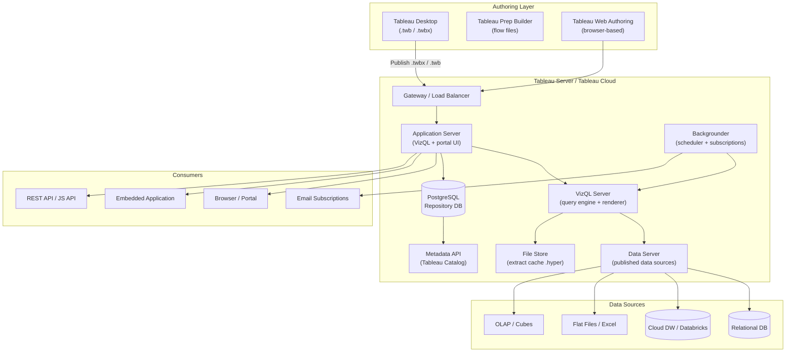
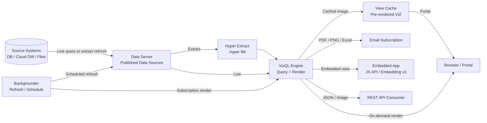

# Tableau — SA Migration Guide

## Platform Architecture



## Data Flow



---

## 1. Ecosystem Overview

Tableau is a visual analytics platform owned by Salesforce. It sits at the self-service end of the BI spectrum — designed so business analysts can build and explore dashboards without writing SQL. It competes directly with Power BI and Looker, and is often found in organizations that have a strong culture of data exploration rather than centralized IT-published reports.

**Product variants:**

| Variant | Description | Common in customer estates |
|---|---|---|
| Tableau Desktop | Windows/Mac authoring tool — creates .twb/.twbx files | Always present where Tableau is used |
| Tableau Server | On-premises server deployment | Large enterprises, regulated industries |
| Tableau Cloud (formerly Online) | SaaS-hosted version of Tableau Server | Mid-market, modern data teams |
| Tableau Prep Builder | ETL/data prep tool, separate from core Tableau | Present in ~30% of estates |
| Tableau Public | Free public-facing publishing — not used in enterprise | Ignore for migration scoping |
| Tableau Embedded Analytics | Tableau views embedded in custom apps via JS API | High migration risk when present |
| Tableau CRM (formerly Einstein Analytics) | Salesforce-native analytics product — separate product | Different migration path entirely |

**Why customers use it:**

- **Self-service analytics:** Business users build their own dashboards without IT involvement
- **Visual exploration:** Drag-and-drop interface with instant visual feedback
- **Embedded analytics:** White-labeled Tableau views inside custom applications
- **Executive dashboards:** Live-connected or extract-based summary dashboards
- **Ad hoc analysis:** Analysts exploring data without a pre-defined report structure

**Key discovery questions:**

- How many workbooks are published to the server? How many have been accessed in the last 90 days?
- Are users on Tableau Server (on-prem) or Tableau Cloud (SaaS)?
- What version of Tableau Server is running? (Older versions may lack API coverage)
- What data sources are live connections vs. extracts (.hyper files)?
- Are any workbooks embedded in customer-facing or internal applications using the JS API or Embedding API v3?
- Is Tableau Prep being used for data preparation, and are those flows published to the server?
- How are subscriptions and alerts configured — who owns the recipient lists?
- Is Tableau Catalog (the governance/lineage add-on) licensed and in use?
- How is row-level security enforced — username() functions, entitlement tables, or data source filters?

---

## 2. Component Architecture

| Component | Role | Migration Equivalent | SA Note |
|---|---|---|---|
| **Tableau Desktop** | Windows/Mac authoring tool — creates .twb and .twbx workbook files | Databricks SQL notebook / Lakeview dashboard editor / Power BI Desktop | Authors must adopt a new tool; no automated conversion of .twbx to target format |
| **Tableau Server / Cloud** | Hosts, renders, and serves published workbooks and data sources | Databricks SQL workspace / Power BI Service / Looker instance | The "server" is the migration target, not just a deployment mechanism |
| **VizQL Server** | Query engine that translates Tableau's visual grammar into SQL/MDX, executes against the data source, and renders the visualization | Databricks SQL compute / partner BI rendering engine | VizQL is proprietary — no open equivalent. Migrating a viz means rebuilding it, not porting VizQL logic |
| **Backgrounder** | Executes scheduled extract refreshes, subscriptions, alerts, and Prep flows | Databricks Workflows / partner BI native scheduling | If extracts are business-critical, the refresh cadence must be replicated in Databricks Workflows |
| **Data Server** | Manages published data sources — centralized, reusable connections with embedded credentials | Unity Catalog + Databricks SQL warehouses | Published data sources are the closest analog to Unity Catalog assets; this is the most valuable migration parallel |
| **File Store** | Stores .hyper extract files and cached rendered views | Delta tables on Databricks / partner BI import cache | .hyper files are proprietary binary format — data must be re-ingested to Delta, not migrated as-is |
| **PostgreSQL Repository** | Internal content store — stores metadata about workbooks, users, groups, permissions, subscriptions, and usage history | No direct equivalent — mine this DB for inventory data | This is the most valuable single artifact for migration scoping. Query it directly for usage, ownership, and lineage data |
| **Metadata API (Catalog)** | GraphQL API over Tableau Catalog — provides lineage, column-level metadata, and data quality warnings | Unity Catalog lineage | Only available if Tableau Catalog (Data Management add-on) is licensed |
| **Gateway / Load Balancer** | Routes requests across a multi-node Tableau Server cluster | Handled by target platform | Only relevant for large on-prem deployments with multiple nodes |
| **Tableau Prep** | Browser/desktop ETL tool for data preparation flows | Databricks notebooks / dbt / Delta Live Tables | Prep flows (.tflx) are separate artifacts with a separate migration path |

---

## 3. Artifact Lifecycle

| Stage | What happens | Where (server/client) | Artifact involved | Migration risk |
|---|---|---|---|---|
| **Author** | Analyst uses Tableau Desktop (or web authoring) to drag dimensions/measures onto a canvas. The workbook stores both the viz definition and optionally an embedded data extract | Client (Desktop) or Server (web authoring) | .twb (XML, no data) or .twbx (zip with embedded .hyper extract) | High — vizzes are defined in Tableau's proprietary VizQL grammar, not SQL. No automated export to standard format |
| **Publish** | Author publishes the workbook to Tableau Server/Cloud via Desktop or REST API. The workbook file is stored in the PostgreSQL repository as a blob | Server (published via client connection) | .twb or .twbx blob stored in repository DB | Medium — publishing can be scripted via Tableau Server Client (TSC) library or REST API |
| **Compile** | No pre-compilation step. Tableau translates visual specs to queries at render time using VizQL | Server (at query time) | VizQL query plan (internal, not inspectable) | High — VizQL query generation is opaque; understanding what SQL is being issued requires query logs or Performance Recorder |
| **Execute** | VizQL generates SQL (or MDX for OLAP sources) and sends it to the data source. For extracts, VizQL queries the local .hyper file instead | Server | SQL sent to data source / query against .hyper file | Medium — live queries will naturally migrate to Databricks SQL; extract-backed workbooks require a Delta table ingestion strategy |
| **Render** | VizQL renders the result as SVG/HTML in the browser or as a rasterized image (PNG/PDF) for subscriptions and snapshots | Server (image generation) + Client (interactive SVG) | Rendered view (cached in File Store), subscription output (PDF/PNG/CSV) | Low — rendering is handled by the target platform after migration |
| **Deliver** | Consumer accesses via browser portal, REST API, embedded JS API, or receives scheduled subscription via email | Server (portal) / Client (browser renders interactive SVG) | Rendered HTML/SVG (interactive), PDF/PNG (subscription), JSON (REST API) | High for embedded — Tableau JS Embedding API v3 has no standard replacement; embedded workloads need a redesign decision |

---

## 4. Data Sources and Dataset Model

Tableau separates data connectivity into two layers:

- **Published Data Sources (.tds/.tdsx):** Centralized, server-hosted connections that multiple workbooks can share. The closest analog to a governed dataset in Unity Catalog.
- **Embedded Data Sources:** Connection info baked into a single workbook — common in analyst-built content, harder to govern.

**Live vs. Extract:**

- **Live connection:** Every render triggers a query against the upstream source. Latency depends on source system performance.
- **Extract (.hyper file):** A snapshot of data stored in Tableau's columnar format. Fast query performance, stale by design. Requires scheduled refresh via Backgrounder.

> **SA Tip:** Customers often don't know which workbooks use live vs. extract. This matters because extract-backed workbooks require a data ingestion strategy into Delta, not just a query redirection.

**Parameters and filters:**

Tableau supports user-facing parameters (typed inputs) and filters (dimension/measure selections). Parameters can be static or dynamic (Tableau 2020.1+). Dynamic parameters pull their allowable values from a query — these require rebuild in the target platform.

**Cascading filters** (where selecting one filter narrows another) are common in self-service content and require careful review — the dependency logic is embedded in the workbook and must be rebuilt.

| Data Source Type | Frequency in customer estates | Migration Path | Risk |
|---|---|---|---|
| Tableau Hyper Extract (.hyper) | Very High | Re-ingest source data into Delta; do not attempt to migrate .hyper files | High — .hyper is proprietary binary; source system must be re-tapped |
| Direct SQL (Redshift, Snowflake, SQL Server, Postgres) | High | Redirect connection to Databricks SQL warehouse | Low — Tableau supports Databricks native connector |
| Google BigQuery | Medium | Redirect to Databricks SQL warehouse | Low |
| Databricks (already connected) | Medium (growing) | Retain or migrate viz layer only | Low |
| Salesforce / CRM data | Medium | Establish Databricks ingestion pipeline first | Medium |
| Excel / CSV flat files | Medium | Migrate to Delta tables; remove file dependency | Medium — files often live on individual laptops |
| SAP BW / OLAP cubes | Low | No native equivalent in Databricks SQL — must flatten or model in dbt | High — MDX queries must be rewritten as SQL |
| Google Sheets | Low | Migrate to Delta tables | Low |
| JSON / REST API (Web Data Connector) | Low | Build ingestion pipeline in Databricks | High — Web Data Connectors are deprecated in Tableau Cloud |

---

## 5. Rendering and Delivery Model

**Rendering modes:**

| Mode | How it works | Common usage |
|---|---|---|
| On-demand (Live) | VizQL queries source and renders on each page load | Executive dashboards, frequently updated data |
| Extract-backed | VizQL queries .hyper file; refreshed on schedule | Self-service analytics where query speed matters |
| Cached view | Previously rendered view served from cache if data hasn't changed | Portal browsing, high-concurrency dashboards |
| Subscription snapshot | Backgrounder renders at scheduled time; output is PDF/PNG/CSV sent by email | Operational reporting, scheduled email delivery |

**Delivery modes:**

| Delivery Mode | How it works | Business use case | Migration equivalent | Risk |
|---|---|---|---|---|
| Browser portal | User navigates Tableau Server/Cloud portal | Self-service analytics | Databricks SQL portal / Power BI Service / Tableau Cloud retained | Low |
| Direct URL | Shareable URL to a specific view with optional filter parameters in URL | Ad hoc sharing | Partner BI native share links | Low |
| Email subscription | Backgrounder renders a snapshot (PDF/PNG/CSV) and emails it on schedule | Operational delivery, executive digest | Databricks Workflows + email / partner BI subscription | Medium |
| Subscription with custom views | User saves a filtered state; subscription delivers their personal view | Personalized distribution | Partner BI data-driven subscriptions or separate delivery logic | High |
| Embedded via JS API / Embedding v3 | Tableau viz rendered inside a custom web app using Tableau's JavaScript SDK | Customer-facing portals, internal apps | Power BI Embedded / Looker Embedded / Databricks SQL REST API | High — requires application redesign |
| REST API image/PDF export | Programmatic image export via REST API (/views/{id}/image) | Automated report generation | Partner BI REST export API | Medium |
| Data alerts | User sets a threshold; Tableau sends an email when data crosses it | Operational monitoring | Databricks SQL alerts / partner BI native alerts | Low |
| Ask Data / Tableau Pulse (NL query) | Natural language querying of published data sources | Self-service discovery | Databricks Genie / partner NL analytics | Medium — feature parity varies by target |

> **SA Tip:** Embedded deployments are the highest-risk delivery mode. Ask early: "Are any Tableau views embedded in internal or customer-facing applications?" If yes, that workload needs an application-level redesign decision before migration starts.

---

## 6. Project Structure and Version Control

**Server-side organization:**

Tableau Server organizes content into **Projects** (top-level containers) with nested sub-projects. Workbooks, data sources, and flows live inside projects. Projects map loosely to business domains or teams.

Tableau does not have native Git integration. Version history is minimal — Tableau Server keeps a limited revision history (configurable, default 25 revisions), accessible via the REST API.

**Environment promotion:**

There is no built-in Dev/QA/Prod lifecycle in Tableau Server. Common approaches customers use:

- Separate Tableau Server instances per environment
- Separate Projects on the same server (Dev / Staging / Prod projects)
- Manual promotion via Tableau Desktop publish or REST API scripts

> **SA Tip:** Ask the customer: "Is the server the source of truth, or do analysts have local .twbx files on their laptops?" In many Tableau estates, the authoritative version of a workbook is on someone's laptop, not the server. This directly affects how you scope the inventory.

**Command-line / scripting tools:**

| Tool | Purpose | SA relevance |
|---|---|---|
| `tabcmd` | CLI for common server admin tasks — publish, export, create sites | Useful for bulk export during migration scoping |
| Tableau Server Client (TSC) | Python library wrapping the REST API — workbook/datasource CRUD, permissions, schedules | Primary scripting tool for migration automation |
| REST API | Full CRUD over workbooks, data sources, projects, users, schedules, subscriptions | Best source for programmatic inventory |
| Tableau Content Migration Tool (CMT) | GUI/CLI tool for moving content between sites or servers | Useful for Tableau-to-Tableau migration, not cross-platform |

---

## 7. Orchestration and Scheduling

**Built-in scheduler:**

Tableau Server's **Backgrounder** service handles all scheduled work: extract refreshes, subscriptions, and Prep flow runs. Schedules are defined in the Tableau Server admin UI or via REST API.

**Schedule types:**

- **Extract refresh schedules:** Refresh a published data source or embedded extract on a time interval
- **Subscription schedules:** Render and email a workbook view on a schedule
- **Flow schedules (Prep):** Run a Prep flow to output data to a published data source or file

**External trigger via API:**

Schedules can be triggered on-demand via the REST API (`POST /api/{version}/tasks/extractRefreshes/{task-id}/runNow`). This is commonly used when an ETL pipeline completes and needs to trigger a downstream Tableau refresh.

> **SA Tip:** Customers often have a hidden dependency here — their ETL job triggers a Tableau extract refresh via API after loading data. If that ETL migrates to Databricks, the trigger mechanism must move too. Look for Tableau REST API calls in their pipeline code.

**Migration target:**

| Tableau scheduling function | Migration target |
|---|---|
| Extract refresh schedule | Databricks Workflows (trigger SQL warehouse query or dbt job) |
| Subscription (email delivery) | Partner BI native subscriptions / Databricks Workflows + notification |
| API-triggered refresh | Databricks Workflows triggered by pipeline completion |
| Prep flow schedule | Databricks notebook / Delta Live Tables pipeline |

---

## 8. Metadata, Lineage, and Impact Analysis

**Where inventory data lives:**

The **PostgreSQL Repository** (internal Tableau DB) is the most valuable single artifact for migration scoping. It contains usage events, workbook metadata, data source connections, schedules, and permissions.

> **SA Tip:** On Tableau Server, the repository is directly queryable if the customer enables the `readonly` user. On Tableau Cloud, the REST API and Metadata API are the only access paths.

**Key tables in the PostgreSQL Repository:**

| Table | What it contains |
|---|---|
| `workbooks` | All published workbooks — name, project, owner, site |
| `views` | Individual sheets/dashboards within workbooks |
| `hist_views` (via `_views_stats`) | View-level access history — use for 90-day usage analysis |
| `datasources` | Published data sources — type, connection string |
| `subscriptions` | Subscription definitions — owner, schedule, workbook |
| `users`, `groups` | User/group assignments |
| `permissions` | Project and workbook-level permissions |

**REST API endpoints for inventory:**

```
GET /api/{version}/sites/{site-id}/workbooks          # list all workbooks
GET /api/{version}/sites/{site-id}/datasources         # list all published data sources
GET /api/{version}/sites/{site-id}/tasks/extractRefreshes  # list refresh schedules
GET /api/{version}/sites/{site-id}/views               # list all views with usage stats
```

**Lineage:**

Tableau Catalog (Data Management add-on) provides column-level lineage via the Metadata GraphQL API. Without Catalog, lineage must be inferred by parsing workbook XML (field references in .twb files point back to data source columns).

**Sample inventory queries (PostgreSQL Repository):**

```sql
-- Count workbooks by project
SELECT p.name AS project, COUNT(*) AS workbook_count
FROM workbooks w
JOIN projects p ON w.project_id = p.id
GROUP BY p.name ORDER BY workbook_count DESC;

-- Identify unused workbooks (no views in 90 days)
SELECT w.name, w.project_id, MAX(hv.time) AS last_viewed
FROM workbooks w
LEFT JOIN hist_views hv ON hv.workbook_id = w.id
  AND hv.time > NOW() - INTERVAL '90 days'
GROUP BY w.id, w.name, w.project_id
HAVING MAX(hv.time) IS NULL;

-- List data sources and their types
SELECT name, datasource_type, db_name, table_name
FROM datasources
ORDER BY datasource_type;

-- List subscriptions with workbook and owner
SELECT s.id, s.subject, u.friendly_name AS owner, w.name AS workbook, sch.name AS schedule
FROM subscriptions s
JOIN users u ON s.user_id = u.id
JOIN views v ON s.view_id = v.id
JOIN workbooks w ON v.workbook_id = w.id
JOIN schedules sch ON s.schedule_id = sch.id;
```

---

## 9. Data Quality and Governance

**Row-Level Security (RLS):**

Tableau implements RLS primarily through **User Filters** — calculated fields that use Tableau's `USERNAME()` or `USERDOMAIN()` functions to filter data to the current viewer. There are several common patterns:

| RLS Pattern | How it works | Migration complexity |
|---|---|---|
| `USERNAME()` filter | Calculated field checks if a column equals `USERNAME()` | Medium — logic must move to Unity Catalog row filters |
| Entitlement table join | Workbook joins to a separate permission table keyed on username | High — entitlement table and join logic must be migrated |
| Data source filter (published DS) | Filter applied at the published data source level — all workbooks using the DS inherit it | Medium — maps to Unity Catalog row filter on the underlying table |
| Row-level security via groups | Tableau groups mapped to data segments | High — custom logic in workbook |

**Column-level security:**

Tableau does not have native column-level security. Columns are hidden by excluding them from the published data source or by using calculated fields that return null for unauthorized users. This is fragile and should be replaced with Unity Catalog column masks.

**Caching and freshness:**

- Extract refresh frequency is the primary freshness control for extract-backed workbooks
- Live-connected workbooks are always current but impose load on the source
- Tableau Server's view cache can serve stale renders if data hasn't changed — customers may not realize their "live" dashboard is cached

**Custom code / scripting:**

| Type | Description | Migration risk |
|---|---|---|
| Calculated fields | Tableau formula language (similar to Excel) — used for derived metrics | Medium — must be rebuilt in SQL or dbt models |
| Table calculations | Post-aggregation calculations (running totals, rank, window functions) — run in VizQL, not in SQL | High — no direct SQL equivalent for some patterns; must be modeled in Databricks SQL |
| Level of Detail (LOD) expressions | `FIXED`, `INCLUDE`, `EXCLUDE` — compute aggregates at a different granularity than the view | High — powerful but proprietary; must be rewritten as SQL window functions or subqueries |
| Parameters | User-controlled inputs used in calculations and filters | Medium — must be rebuilt in target BI tool |
| Extensions (Analytics Extensions) | Tableau can call Python/R models via TabPy or Rserve | High — extensions are custom integrations requiring redesign |
| Web Data Connectors (WDC) | Custom JavaScript connectors to REST APIs | High — deprecated in Tableau Cloud; must be replaced with ingestion pipelines |

> **SA Tip:** LOD expressions are the single most common migration blocker in Tableau estates. Ask the customer: "Do your analysts use FIXED LOD expressions?" If yes, budget significant rebuild time — these must become SQL subqueries or dbt models, and the logic is often tribal knowledge in the workbook.

---

## 10. File Formats and Artifact Reference

### .twb (Tableau Workbook)

**What it is:** XML file describing the workbook — data connections, calculated fields, parameters, vizzes, dashboards, and filters. Contains no data.

| Property | Value |
|---|---|
| Created by | Tableau Desktop, Tableau Web Authoring |
| Stored in | PostgreSQL repository (as blob) + optional local copy |
| Contains | Viz definitions, connection metadata, calculations, parameters, layouts |
| Human-readable | Yes — XML, but verbose and complex |
| Migration target | Rebuild in target BI tool (Databricks SQL / Power BI / Looker) |

> **SA Tip:** .twb files can be parsed with any XML parser to extract data source connection strings, calculated field definitions, and parameter lists — valuable for automated inventory.

---

### .twbx (Tableau Packaged Workbook)

**What it is:** ZIP archive containing a .twb file plus any embedded extract data (.hyper) and image resources.

| Property | Value |
|---|---|
| Created by | Tableau Desktop (File → Export Packaged Workbook) |
| Stored in | Local filesystem or uploaded to server |
| Contains | .twb + .hyper extract + background images + custom fonts |
| Human-readable | No (ZIP) — but unzip to access .twb |
| Migration target | Unpack, migrate .twb XML to target BI; re-ingest .hyper data from source system |

---

### .tds (Tableau Data Source)

**What it is:** XML file defining a connection to a data source — connection parameters, field aliases, calculated fields, filters applied at the connection level.

| Property | Value |
|---|---|
| Created by | Tableau Desktop, published from Tableau Server |
| Stored in | PostgreSQL repository (as blob) or local file |
| Contains | Connection string, credentials reference, field metadata, RLS filters |
| Human-readable | Yes — XML |
| Migration target | Unity Catalog data source / Databricks SQL warehouse connection |

---

### .tdsx (Tableau Packaged Data Source)

**What it is:** ZIP archive containing a .tds plus an embedded .hyper extract.

| Property | Value |
|---|---|
| Created by | Tableau Desktop |
| Stored in | Local filesystem or uploaded to server |
| Contains | .tds + .hyper extract data |
| Human-readable | No (ZIP) |
| Migration target | Re-ingest source data to Delta; rebuild .tds in target |

---

### .hyper (Tableau Extract)

**What it is:** Tableau's proprietary columnar data store. A snapshot of source data optimized for VizQL queries.

| Property | Value |
|---|---|
| Created by | Tableau Desktop / Backgrounder (on refresh) |
| Stored in | File Store on Tableau Server / local filesystem |
| Contains | Column-oriented data snapshot — proprietary binary format |
| Human-readable | No |
| Migration target | Delta table on Databricks (data must be re-ingested from source) |

> **SA Tip:** There is a Hyper API (Python/C++) from Tableau that can read .hyper files. In a pinch, this can extract data for migration, but the preferred path is always to re-tap the original source system and write to Delta.

---

### .tflx (Tableau Prep Flow)

**What it is:** Tableau Prep Builder flow definition — a JSON-based pipeline describing data preparation steps.

| Property | Value |
|---|---|
| Created by | Tableau Prep Builder |
| Stored in | PostgreSQL repository (if published) or local file |
| Contains | Flow steps, transformations, output destinations |
| Human-readable | Yes — JSON |
| Migration target | Databricks notebook / Delta Live Tables / dbt |

---

### PostgreSQL Repository Tables (Content Store)

**What it is:** Tableau Server's internal database — the definitive record of all server content, usage, permissions, and schedules.

| Property | Value |
|---|---|
| Created by | Tableau Server (auto-managed) |
| Stored in | PostgreSQL on the Tableau Server node |
| Contains | Workbooks, views, users, groups, permissions, subscriptions, usage events |
| Human-readable | Yes — relational tables |
| Migration target | Mine for inventory; no migration target needed |

---

### Quick-Reference Summary

| Artifact | Extension or location | Human-readable | Where stored | Migration target | Risk level |
|---|---|---|---|---|---|
| Tableau Workbook | .twb | Yes (XML) | PostgreSQL repo blob / local | Rebuild in target BI | High |
| Packaged Workbook | .twbx | No (ZIP) | Local / uploaded | Unpack + rebuild | High |
| Published Data Source | .tds | Yes (XML) | PostgreSQL repo blob | Unity Catalog + Databricks SQL | Medium |
| Packaged Data Source | .tdsx | No (ZIP) | Local / uploaded | Re-ingest + rebuild | High |
| Hyper Extract | .hyper | No (binary) | File Store on server | Re-ingest to Delta | High |
| Prep Flow | .tflx | Yes (JSON) | PostgreSQL repo / local | Databricks / dbt | Medium |
| PostgreSQL Repository | Internal DB tables | Yes (SQL) | Tableau Server node | Mine for inventory | N/A |

---

## 11. Migration Assessment and Artifact Inventory

**Preferred inventory method:**

Query the **PostgreSQL Repository** directly (requires `readonly` user access on Tableau Server). This is faster and more complete than the REST API for large estates, and avoids UI pagination limits.

For Tableau Cloud estates, use the **REST API** (no direct DB access) or the **Metadata GraphQL API** if Catalog is licensed.

> **SA Tip:** Never scope a Tableau migration by counting workbooks in the portal UI. The UI hides system workbooks, shows content from all projects including archived ones, and gives no usage context. Always query the repository or REST API.

**Complexity scoring:**

| Dimension | Low | Medium | High | Critical |
|---|---|---|---|---|
| Data source type | Direct SQL to cloud DW | Relational DB requiring credential migration | Flat files / Excel on user machines | OLAP/SAP BW — MDX must be rewritten |
| Query/dataset complexity | Simple SQL select | Stored procedures, multi-table joins | LOD expressions, table calculations | TabPy/R extensions calling ML models |
| Parameter complexity | Static parameters | Dynamic parameters (2020.1+) | Cascading filters with data-driven values | Parameters driving RLS logic |
| Custom code | None | Calculated fields only | LOD expressions, table calcs | Web Data Connectors, Analytics Extensions |
| Dashboard nesting | Single-level | Multiple sheets with actions | Embedded dashboards, URL actions | Embedded in external apps via JS API |
| Delivery complexity | Portal browsing only | Email subscriptions | Subscription with custom views / bursting | Embedded JS API in custom applications |
| Security model | No RLS | USERNAME() filter on single table | Entitlement table join | Multi-table dynamic RLS + group-based filters |

**Top migration risks for Tableau:**

1. **LOD expressions** — `FIXED`, `INCLUDE`, `EXCLUDE` logic must be rewritten as SQL. No tooling automates this.
2. **Embedded deployments** — Tableau JS Embedding API v3 has no plug-in replacement. Applications must be refactored.
3. **Web Data Connectors** — Deprecated in Tableau Cloud. Any WDC-based data source needs a new ingestion pipeline before the BI layer can migrate.
4. **Hyper extracts as the "source of truth"** — Some customers have lost access to the original source system. The .hyper file is the only copy of the data. These cases require Hyper API extraction before migration.
5. **Tribal knowledge in workbooks** — Tableau's drag-and-drop model means business logic (LOD expressions, complex filters, calculated fields) lives in workbooks rather than in a governed semantic layer. It must be documented and rebuilt.
6. **TabPy / Analytics Extensions** — Workbooks that call Python or R for in-visualization ML scoring require both the model and the integration to be migrated to Databricks ML endpoints.

**Sample inventory query:**

```sql
-- Comprehensive workbook inventory for migration scoping
SELECT
    p.name                          AS project,
    w.name                          AS workbook_name,
    w.id                            AS workbook_id,
    u.friendly_name                 AS owner,
    w.created_at,
    w.updated_at,
    MAX(hv.time)                    AS last_viewed,
    COUNT(DISTINCT hv.user_id)      AS unique_viewers_90d,
    COUNT(DISTINCT hv.id)           AS view_events_90d,
    COUNT(DISTINCT ds.id)           AS datasource_count,
    STRING_AGG(DISTINCT ds.datasource_type, ', ') AS datasource_types,
    (SELECT COUNT(*) FROM subscriptions s
     JOIN views v2 ON s.view_id = v2.id
     WHERE v2.workbook_id = w.id)   AS subscription_count
FROM workbooks w
JOIN projects p    ON w.project_id = p.id
JOIN users u       ON w.owner_id = u.id
LEFT JOIN hist_views hv
    ON hv.workbook_id = w.id
    AND hv.time > NOW() - INTERVAL '90 days'
LEFT JOIN workbook_datasource_connections wdc ON wdc.workbook_id = w.id
LEFT JOIN datasources ds ON ds.id = wdc.datasource_id
GROUP BY p.name, w.id, w.name, u.friendly_name, w.created_at, w.updated_at
ORDER BY view_events_90d DESC NULLS LAST;
```

---

## 12. Migration Mapping to Databricks

### Core Mapping Tables

**Report types:**

| Tableau artifact | Databricks / partner BI equivalent |
|---|---|
| Dashboard (multiple sheets) | Databricks SQL dashboard / Lakeview dashboard / Power BI report / Tableau Cloud (retain) |
| Single sheet / viz | Databricks SQL visualization / Lakeview chart |
| Story (guided analytics) | Databricks SQL dashboard with narrative text / Power BI report |
| Tableau Pulse (NL query) | Databricks Genie |
| Prep flow output | Delta Live Tables pipeline / dbt model |

**Data sources:**

| Tableau data source | Databricks equivalent |
|---|---|
| Published data source (.tds) | Unity Catalog table / view with Databricks SQL warehouse connection |
| Embedded extract (.hyper) | Delta table (data re-ingested from original source) |
| Live connection to Databricks | Retain — redirect to Databricks SQL warehouse |
| Live connection to other SQL | Redirect to Databricks SQL warehouse after data migration |
| Web Data Connector | Databricks ingestion pipeline (Autoloader / partner ETL) |

**Dataset queries:**

| Tableau pattern | Databricks equivalent |
|---|---|
| Simple SELECT from table | Databricks SQL query / Unity Catalog view |
| Custom SQL in data source | Databricks SQL view or dbt model |
| Calculated field | SQL column expression / dbt metric |
| LOD expression (FIXED) | SQL subquery / window function in dbt |
| Table calculation | Databricks SQL window function |
| Stored procedure call | Databricks SQL stored procedure / dbt macro |

**Security:**

| Tableau security | Databricks equivalent |
|---|---|
| USERNAME() row filter | Unity Catalog row filter (`current_user()` predicate) |
| Entitlement table join | Unity Catalog row filter with entitlement table in catalog |
| Published data source filter | Unity Catalog row filter on underlying table |
| Hidden columns (no native CLS) | Unity Catalog column masks |
| Project-level permissions | Databricks SQL workspace permissions + UC catalog/schema grants |
| Group-based content access | Databricks groups + Unity Catalog grants |

**Scheduling:**

| Tableau scheduling | Databricks / partner BI equivalent |
|---|---|
| Extract refresh schedule | Databricks Workflows (trigger SQL or dbt job) |
| Subscription (email delivery) | Partner BI native subscription / Databricks notification |
| API-triggered refresh | Databricks Workflows REST API trigger |
| Prep flow schedule | Databricks Workflows + DLT pipeline |

**Portal and browsing:**

| Tableau | Databricks / partner BI equivalent |
|---|---|
| Tableau Server / Cloud portal | Databricks SQL workspace / Power BI workspace / Tableau Cloud |
| Tableau Projects (content folders) | Databricks SQL folders / Power BI workspaces |
| Tableau favorites | Partner BI native bookmark/favorite |

**Embedded integration:**

| Tableau | Databricks / partner BI equivalent |
|---|---|
| Tableau JS Embedding API v3 | Power BI Embedded / Looker Embed / Databricks SQL REST API + custom UI | 
| Tableau Connected Apps (auth) | Power BI service principal / Looker API token | 
| Tableau REST API image export | Partner BI REST API / Databricks SQL REST API |

**Governance:**

| Tableau | Databricks equivalent |
|---|---|
| Tableau Catalog lineage | Unity Catalog lineage |
| Tableau data quality warnings | Unity Catalog data quality tags |
| Tableau site admin permissions | Databricks workspace admin |
| Tableau row-level security | Unity Catalog row filters |

---

### What Doesn't Map Cleanly

| Tableau capability | Why it doesn't map | SA recommendation |
|---|---|---|
| **LOD Expressions (FIXED / INCLUDE / EXCLUDE)** | These compute aggregations at a granularity independent of the viz. There is no equivalent construct in any BI tool — the logic must become SQL window functions or subqueries. | Treat LOD-heavy workbooks as full rebuilds, not migrations. Budget analyst time to reconstruct the intent in dbt or Databricks SQL. |
| **Tableau JS Embedding API v3** | Tableau's embedding API is proprietary and tightly coupled to Tableau Server/Cloud authentication. There is no drop-in SDK replacement. | Make an explicit embed strategy decision (Power BI Embedded, Looker Embed, or custom UI on Databricks SQL REST API) before starting the migration. |
| **Analytics Extensions (TabPy / Rserve)** | These execute Python or R inside a Tableau viz at render time — a tight coupling between viz rendering and model scoring that no other BI tool replicates. | Decouple the ML scoring: run models in Databricks ML Feature Serving, write scores to a Delta table, and consume results as a regular column in the target BI tool. |
| **Web Data Connectors (WDC)** | Custom JavaScript connectors that pull from REST APIs at viz load time. Deprecated in Tableau Cloud and has no equivalent in Databricks SQL or most partner BI tools. | Build proper ingestion pipelines in Databricks (Autoloader, partner ETL) before migrating the BI layer. WDC workbooks cannot be migrated until the data source is replaced. |
| **Tableau Stories** | A guided, slide-based narrative format that sequences vizzes with annotations. No equivalent format exists in Databricks SQL, Power BI, or Looker. | Rebuild as a dashboard with text objects and navigation actions, or accept that the narrative format is lost and deliver a standard dashboard. |
| **Data-driven subscriptions with custom views** | Users can save personal filtered views and receive subscriptions scoped to their saved view. This combines personalization + delivery in a way that partner BI tools handle inconsistently. | Map to Power BI data-driven subscriptions (if target is Power BI) or accept a simplified subscription model and communicate the gap to stakeholders early. |

---

## 13. Quick-Reference Cheat Sheet

| Topic | Key fact | SA question to ask |
|---|---|---|
| **Report count heuristic** | Tableau estates typically have 3–5x more workbooks than actively used ones — 90-day usage filter is essential | "Can we get readonly access to the PostgreSQL repository, or will you run an inventory query for us?" |
| **Where usage data lives** | PostgreSQL Repository (`hist_views` table) on Tableau Server; REST API `/views` endpoint for Tableau Cloud | "Is the Tableau Server repository accessible to your DBA for a query?" |
| **Biggest migration risk** | LOD expressions (FIXED/INCLUDE/EXCLUDE) — must be rewritten as SQL, no automation | "Do your analysts use LOD expressions in their workbooks?" |
| **Second biggest risk** | Embedded deployments via Tableau JS Embedding API — requires application redesign | "Are any Tableau views embedded in internal or customer-facing apps?" |
| **Hyper extract trap** | Some customers have no access to original source system — .hyper file is the only data copy | "For extract-backed workbooks, can you confirm the source system is still accessible?" |
| **Source control gap** | Tableau has no native Git integration — the server may not have the latest version of a workbook | "Do analysts publish directly from Desktop, or is there a source-controlled project structure?" |
| **TabPy / Analytics Extensions** | Any workbook calling TabPy/Rserve couples ML scoring to viz rendering — must be decoupled | "Do any workbooks use Analytics Extensions (TabPy, Rserve)?" |
| **Web Data Connectors** | WDC data sources are deprecated in Tableau Cloud — blockers if customer is mid-cloud-migration | "Are any data sources built on Web Data Connectors?" |
| **RLS approach** | Most commonly USERNAME() filter or entitlement table join — both require rebuild as Unity Catalog row filters | "How is row-level security enforced — username functions in workbooks, or at the data source level?" |
| **Tableau Catalog / lineage** | Only available with Data Management add-on license — many customers don't have it | "Is Tableau Catalog licensed? If not, lineage will need to be inferred from workbook XML parsing." |
