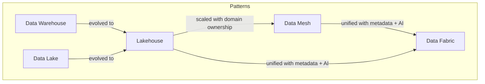
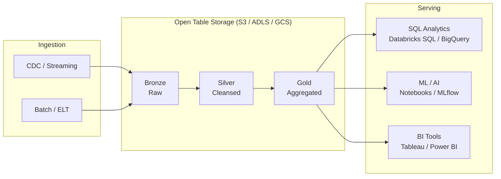

# Data Architecture Patterns

> A SA reference for understanding and positioning the major data platform architectural patterns. Focus is on helping customers choose the right pattern for their maturity level and workload mix — not on implementation details.

---

## The Landscape at a Glance

---

## Data Warehouse

### What It Is
A structured, schema-on-write repository purpose-built for SQL analytics. Data is cleaned, modeled (star/snowflake schema), and stored in a columnar format optimized for aggregation queries.

**Key players:** Snowflake, Google BigQuery, Amazon Redshift, Azure Synapse Analytics, Teradata

### Why Customers Use It
- Predictable query performance with low operational overhead
- Mature BI tooling integration (Tableau, Power BI, etc.)
- Strong governance and access control primitives
- ACID compliance out of the box

### Limitations
- Poor fit for unstructured data (logs, images, documents)
- Schema changes are expensive and slow
- ML/AI workloads require data to be copied out to separate systems
- Storage and compute costs scale together (less flexible)

### SA Talking Points
- Best for customers with **mature, stable data models** and heavy SQL BI workloads
- Ask: "How much of your data is structured vs. semi-structured?" — high unstructured volume is a red flag for pure warehouse
- "What happens when your data scientist needs the raw data?" — siloed raw stores signal warehouse limitations

---

## Data Lake

### What It Is
A centralized repository that stores data in its raw, native format (files on object storage — S3, ADLS, GCS). Schema is applied at read time (schema-on-read), enabling flexibility at ingestion but complexity at consumption.

**Key players:** AWS S3 + Glue, Azure Data Lake Storage, Google Cloud Storage, Hadoop HDFS (legacy)

### Why Customers Build It
- Cheap, elastic storage for all data types
- Raw data retained for reprocessing as needs evolve
- Single source of truth for data science and ML workloads

### Limitations
- "Data swamp" problem — without governance, becomes unusable
- No ACID transactions — data consistency is the consumer's problem
- Poor BI performance without a serving layer on top
- Maintenance burden: small files problem, compaction, schema drift

### SA Talking Points
- Most customers have a data lake whether they planned one or not (S3/ADLS buckets accumulating data)
- The question is not "should we build a lake" but "how do we make what we have usable"
- A lake without a catalog is just a file system with a cloud bill

---

## Lakehouse

### What It Is
An architecture that combines the low-cost, flexible storage of a data lake with the ACID transactions, schema enforcement, and performance optimizations of a data warehouse — typically built on open table formats (Delta Lake, Apache Iceberg, Apache Hudi) sitting on top of object storage.

**Key players:** Databricks (Delta Lake), Apache Iceberg on any cloud, Snowflake (Iceberg external tables)

### Architecture

### Why It Matters
- **Single copy of data** — no need to ETL data out to a separate warehouse for BI and a separate data lake for ML
- **Open formats** — data is not locked to a vendor; multiple engines can read the same table
- **ACID on object storage** — time travel, schema evolution, and concurrent writes without the warehouse price tag

### SA Talking Points
- Position as "the warehouse and the lake, unified" — resonates with customers tired of managing two systems
- Open formats (Delta/Iceberg) are the key differentiator vs. proprietary warehouses — data is always accessible
- Ask: "Do your data scientists work on the same data your BI team uses, or do they have their own copy?" — two copies = lakehouse conversation

---

## Data Mesh

### What It Is
A **sociotechnical architecture** — not a technology — that decentralizes data ownership to domain teams. Each domain (e.g. Sales, Finance, Logistics) owns, produces, and publishes its data as a product. A central platform team provides the infrastructure (the "data platform as a product").

**Four principles (Zhamak Dehghani):**
1. Domain-oriented ownership
2. Data as a product
3. Self-serve data infrastructure
4. Federated computational governance

### When It Makes Sense
- Large organizations with many distinct business domains
- Central data team is a bottleneck — SLAs are broken, backlogs are months long
- Domains have the engineering capacity to own their data pipelines

### Limitations
- High organizational maturity required — fails without domain buy-in
- Governance is hard: federated means different teams define quality differently
- Not a technology you buy — it is an operating model change

### SA Talking Points
- Data mesh is often misunderstood as a product — it is an **org model**
- Ask: "Is your central data team a bottleneck?" — if yes, explore mesh principles even if a full mesh isn't the answer
- Databricks Unity Catalog enables federated governance, which is the technical foundation for mesh — but the culture has to come first

---

## Data Fabric

### What It Is
A design concept where **metadata, AI, and automation** are used to create a unified, intelligent data management layer across disparate systems — regardless of where data lives. Think of it as a mesh of existing systems connected by an active metadata graph.

**Key players:** Informatica, IBM, Talend, Microsoft Fabric

### How It Differs from Data Mesh
| | Data Mesh | Data Fabric |
|---|---|---|
| Focus | Organizational/social | Technology/automation |
| Ownership | Decentralized to domains | Varies — often centralized |
| Glue | Operating model | Active metadata + AI |
| Buy vs. build | Mostly build | Often buy (platform vendors) |

### SA Talking Points
- Fabric is appealing to customers who want governance and discoverability **without** reorganizing teams
- Often positioned by incumbent vendors (IBM, Informatica) as an upgrade path
- Watch for vendor-specific "data fabric" definitions — it is a marketing term as much as an architecture term

---

## Choosing the Right Pattern

| Customer Signal | Likely Pattern |
|----------------|---------------|
| Heavy SQL BI, stable schema, limited ML | Data Warehouse |
| Lots of raw/unstructured data, ML-first | Data Lake |
| Mix of BI + ML, cloud-native, cost-conscious | Lakehouse |
| Large org, central team is a bottleneck, domain autonomy needed | Data Mesh |
| Heterogeneous environments, existing systems to connect, metadata-driven | Data Fabric |

---

> **SA Rule of Thumb:** Start with the lakehouse — it covers 80% of enterprise use cases. Only introduce mesh or fabric when the organizational or integration complexity clearly demands it.
