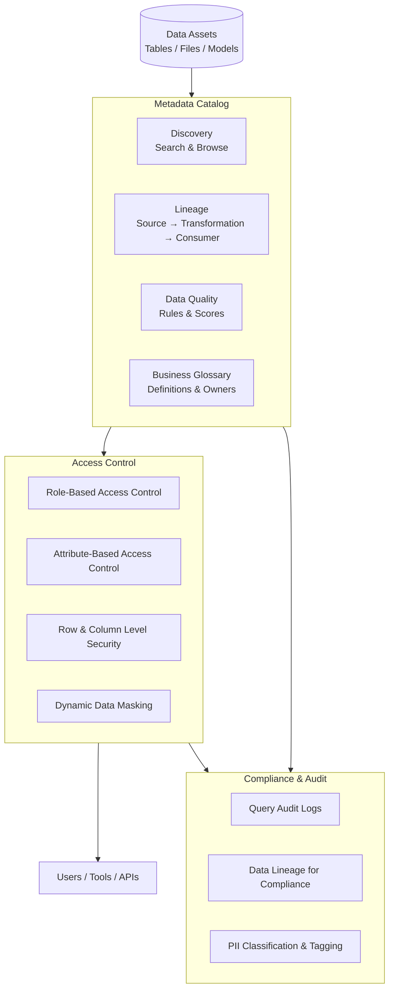

# Data Governance & Cataloging

> Reference for SAs discussing data governance, metadata management, and access control with customers. Focuses on the "why it matters" and how to position governance as a business enabler, not a compliance checkbox.

---

## Why Governance Matters (The SA Pitch)

Without governance, data platforms fail in predictable ways:
- Analysts can't find data — they don't know what exists or if it's trustworthy
- Security teams can't audit access — who can see PII and who actually did
- Compliance teams can't demonstrate lineage — where did this number come from?
- Platform costs balloon — duplicate datasets because teams don't know what already exists

**The business impact:** Governance is not about restricting data — it is about making data *usable* at scale. The larger the organization, the more critical this becomes.

---

## Governance Architecture



---

## Unity Catalog (Databricks)

### What It Is
Databricks' unified governance layer for data and AI assets. Provides a single control plane for access control, auditing, lineage, and discovery across all Databricks workspaces.

### Three-Level Namespace
```
catalog.schema.table
   │        │      └── Table, view, or volume
   │        └── Schema (database equivalent)
   └── Catalog (top-level container — often one per environment or business unit)
```

### Key Capabilities

| Capability | What It Does |
|-----------|-------------|
| Unified access control | One policy for tables, views, files (volumes), models, and functions |
| Column-level security | Grant/revoke access to specific columns |
| Row filters | Apply SQL predicates to limit visible rows per user/group |
| Dynamic data masking | Mask PII values (e.g., show `***-**-1234` for SSN) for non-privileged users |
| Automated lineage | Tracks column-level lineage across notebooks, workflows, and SQL queries without instrumentation |
| Data discovery | Search across all catalogs by name, tag, or business glossary term |
| Audit logs | Full query and access audit log delivered to cloud storage |
| Delta Sharing | Securely share live Delta tables across organizations without data movement |

### SA Talking Points
- Unity Catalog replaces the legacy per-workspace Hive Metastore — one catalog for all workspaces is the key message
- "How do you currently control who can see PII data?" — the answer reveals governance maturity
- Automated lineage without any code changes is a strong differentiator — most competitors require manual lineage instrumentation
- Delta Sharing enables B2B data sharing without building custom APIs or copying files

---

## Data Cataloging

### What a Catalog Does
A data catalog is the **search engine and encyclopedia** of your data platform. It makes data findable, understandable, and trustworthy.

### Core Catalog Features

| Feature | Purpose |
|---------|---------|
| Search & Discovery | Find tables, files, dashboards by keyword or tag |
| Technical Metadata | Schema, data types, row count, size, last updated |
| Business Metadata | Descriptions, owners, data domain, sensitivity tags |
| Business Glossary | Canonical definitions of business terms (what is "active customer"?) |
| Data Lineage | Where did this table come from? What consumes it? |
| Data Quality | Quality scores, freshness metrics, rule violations |
| Collaboration | Comments, questions, ratings on data assets |

### Key Catalog Tools

| Tool | Notes |
|------|-------|
| Unity Catalog (Databricks) | Integrated with Databricks platform |
| Microsoft Purview | Azure-native, integrates across Azure services + Power BI |
| Google Dataplex | GCP-native, integrates with BigQuery |
| AWS Glue Data Catalog | AWS-native, used by Athena, EMR, Glue |
| Alation | Best-of-breed third-party, heavy on collaboration features |
| Collibra | Enterprise governance platform, strong in regulated industries |
| Apache Atlas | Open-source, common in Hadoop/Cloudera environments |

### SA Talking Points
- "Can any analyst in your company find the data they need without emailing someone?" — if no, a catalog is the answer
- The business glossary is often more valuable than the technical catalog — defining "revenue" consistently across Finance and Sales is a governance problem, not a technology problem
- Platform-native catalogs (Purview, Dataplex, Unity) reduce integration friction; third-party tools (Alation, Collibra) offer richer features at the cost of complexity

---

## Data Lineage

### What It Is
A record of how data flows from its source through transformations to its consumers — showing upstream dependencies and downstream impact for every column, table, and report.

### Why It Matters

**For compliance:** "Show me where this customer's personal data comes from and who has accessed it" — lineage answers this.

**For impact analysis:** "If I change this source table, what dashboards will break?" — lineage answers this.

**For trust:** "Why does this number differ from last month's report?" — lineage shows which transformation caused it.

### Lineage Levels

| Level | What It Shows | Example |
|-------|--------------|---------|
| Table lineage | Which tables feed which tables | `orders` → `daily_sales_summary` |
| Column lineage | Which source columns feed which target columns | `orders.amount` → `sales_summary.total_revenue` |
| Report lineage | Which tables feed which BI reports | `daily_sales_summary` → Tableau dashboard |

### SA Talking Points
- Lineage is almost always a compliance request first ("our auditors need to see data flows") but becomes a productivity tool once teams use it
- Column-level lineage is much harder to implement than table lineage — Unity Catalog provides it automatically for Databricks SQL and notebooks
- Ask: "What happens when a source system changes a column name?" — if the answer is "we find out when dashboards break," lineage is a gap

---

## Access Control Patterns

### Role-Based Access Control (RBAC)
Users are assigned to roles, and permissions are granted to roles. Simple, manageable at scale.

```
SA_Team Role → READ access on sales.gold.*
Finance Role → READ access on finance.gold.*, WRITE access on finance.silver.*
Data Engineer Role → WRITE access on *.bronze.*, *.silver.*
```

### Attribute-Based Access Control (ABAC)
Access is granted based on attributes of the user and the data asset — more flexible but more complex.

```
Users with attribute country=US can see US rows
Users with attribute clearance=PII can see unmasked SSN column
```

### Row-Level Security (RLS)
A SQL predicate filters visible rows based on the current user's identity or group membership.

```sql
-- Only show rows matching the user's region
CREATE ROW FILTER region_filter ON sales.orders
    AS (region = current_user_region());
```

### Dynamic Data Masking
Sensitive columns are masked at query time based on the user's privileges — the underlying data is unchanged.

```
Admin user sees:    123-45-6789
Analyst user sees:  ***-**-6789
```

### SA Talking Points
- RBAC is the right starting point — ABAC adds complexity that most organizations aren't ready for
- RLS and masking are the most common PII governance requests — Unity Catalog implements both without application changes
- "Do your contractors and full-time employees see the same data?" — if yes when it shouldn't be, RLS is the fix

---

## Data Quality

### Key Dimensions of Data Quality

| Dimension | Question It Answers |
|-----------|-------------------|
| Completeness | Are required fields populated? |
| Accuracy | Does the data match the real-world truth? |
| Consistency | Does the same fact have the same value across systems? |
| Timeliness | Is the data fresh enough for its use case? |
| Uniqueness | Are there duplicate records? |
| Validity | Do values conform to expected formats and ranges? |

### Data Quality Tools

| Tool | Notes |
|------|-------|
| Databricks Expectations (DLT) | Native quality constraints in Delta Live Tables pipelines |
| Great Expectations | Open-source, widely used, generates quality reports |
| dbt Tests | SQL-based quality tests for dbt transformation models |
| Monte Carlo | Observability platform — detects anomalies automatically |
| Soda | Cloud-based quality monitoring, integrates with Slack/PD alerting |

### SA Talking Points
- Data quality problems cost organizations millions in bad decisions — frame quality as a business risk, not a technical nicety
- "How do you know when data quality degrades?" — if the answer is "when someone complains," monitoring is missing
- Start with the most business-critical tables (Gold layer) and work backwards — don't try to quality-gate everything at once

---

> **SA Rule of Thumb:** Governance wins are often organizational, not technical — the hardest part is getting agreement on who owns a definition, not implementing the policy. Start there.
