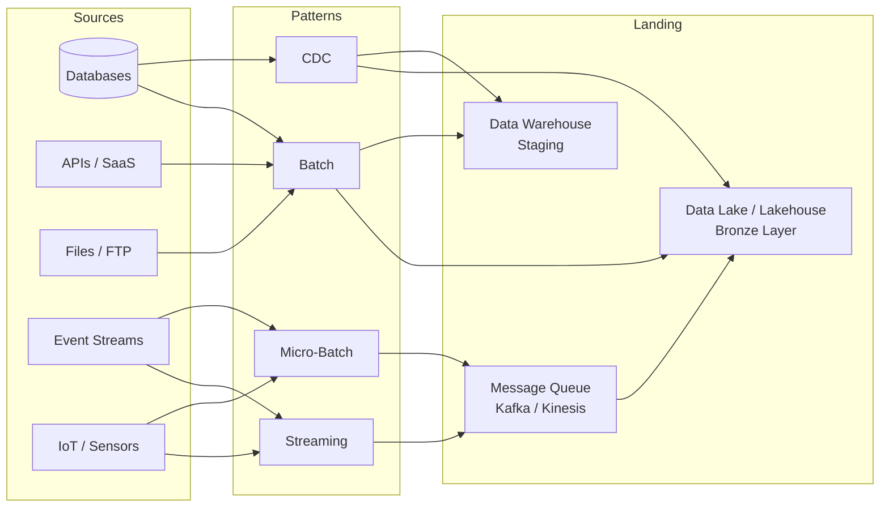
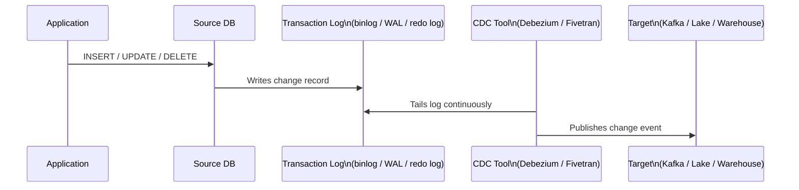
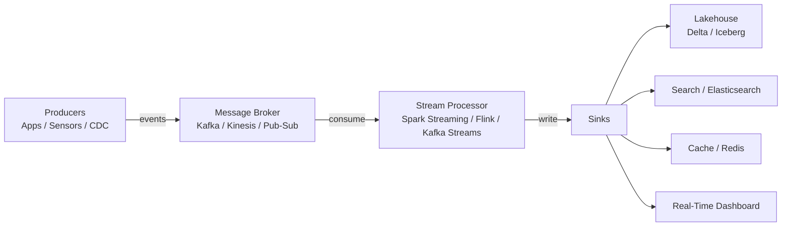

# Data Ingestion & Pipelines

> Reference for SAs discussing data movement strategies with customers. Covers ingestion patterns, ETL vs. ELT, CDC, and the tooling landscape — with the emphasis on helping customers understand what they have and what it maps to in a modern stack.

---

## Ingestion Pattern Overview

---

## Batch Ingestion

### What It Is
Data is collected and moved in discrete chunks on a schedule — nightly, hourly, or triggered by an upstream event. The workhorse of traditional enterprise data pipelines.

### When It Works
- Source systems don't support real-time extraction (legacy ERP, mainframes)
- Downstream consumers only need fresh data daily (monthly finance reports)
- Volume is too large to process continuously but manageable in windows

### Common Tools
| Tool | Notes |
|------|-------|
| Azure Data Factory | Managed, GUI-driven, native Azure integration |
| AWS Glue | Serverless Spark-based ETL on AWS |
| Apache Airflow | Open-source orchestrator, highly flexible |
| dbt | SQL-based transformation layer, not a full ETL tool |
| Informatica | Enterprise-grade, often found in regulated industries |
| Talend | Open-core, common in mid-market |

### SA Talking Points
- Batch is not "legacy" — it is still the right choice for many workloads
- The customer question is: "What is the acceptable data freshness for this use case?" — if daily is fine, batch is fine
- Batch orchestration (Airflow, ADF) is often where migration complexity hides: complex DAGs, retry logic, SLA alerting

---

## ETL vs. ELT

### Traditional ETL (Extract → Transform → Load)
Data is extracted from the source, transformed in a middle processing layer (the ETL server), then loaded into the destination in a clean, ready-to-use form.

**Characteristics:**
- Transformation happens before the data reaches the destination
- Heavy reliance on middleware (Informatica, SSIS, DataStage)
- Source data is often not retained in raw form
- Compute lives in the ETL server, not the destination

### Modern ELT (Extract → Load → Transform)
Data is extracted and loaded raw into the destination first (data lake or warehouse), then transformed using the destination's own compute.

**Characteristics:**
- Raw data is preserved — reprocessing is always possible
- Transformation uses SQL or Spark inside the target platform
- Enabled by cheap cloud storage and elastic compute (BigQuery, Databricks, Snowflake)
- dbt is the dominant SQL transformation layer in ELT stacks

### Comparison

| | ETL | ELT |
|---|---|---|
| Raw data retained | Rarely | Always |
| Compute location | Middleware server | Target platform |
| Flexibility | Lower — transform design upfront | Higher — re-transform as needed |
| Typical tools | Informatica, SSIS, DataStage | dbt, Spark, BigQuery, Databricks |
| Best for | Legacy systems, regulated data masking | Cloud-native, lakehouse, agile teams |

### SA Talking Points
- Most modernization conversations are ETL → ELT migrations
- "What happens when business rules change?" — in ETL, you re-engineer the pipeline; in ELT, you update a SQL model
- Legacy ETL tools (Informatica, DataStage) are often the largest migration risk — logic buried in proprietary GUIs

---

## Change Data Capture (CDC)

### What It Is
A technique that captures only the rows that have **changed** in a source database (inserts, updates, deletes) rather than reloading the entire table. Enables near-real-time replication with minimal source system load.

### How It Works (Database Log-Based CDC)

### CDC Approaches

| Approach | Mechanism | Pros | Cons |
|----------|-----------|------|------|
| Log-based | Reads DB transaction log | Low source impact, captures deletes | Requires DB-level access |
| Trigger-based | DB triggers write to audit table | No special permissions | High source DB overhead |
| Timestamp-based | Polls for rows updated after last run | Simple to implement | Misses hard deletes |
| Full table diff | Compares snapshot to previous | Catches everything | Expensive at scale |

### Common CDC Tools
| Tool | Notes |
|------|-------|
| Debezium | Open-source, Kafka-native, wide DB support |
| Fivetran / Airbyte | Managed connectors, easy setup, less flexibility |
| AWS DMS | Managed CDC for AWS targets |
| Oracle GoldenGate | Enterprise, complex, expensive — common in regulated industries |
| Qlik Replicate (Attunity) | Often found in SAP / Oracle environments |

### SA Talking Points
- CDC is how customers get from "nightly batch" to "data available within minutes"
- The hard part is not the technology — it is **schema evolution**: what happens when the source table changes?
- CDC is also how you replicate SAP, Oracle, and mainframe data without impacting the source system

---

## Streaming Ingestion

### What It Is
Data is produced, captured, and processed **continuously** as events occur — no scheduled batch window. Events flow through a message broker (Kafka, Kinesis) and are consumed by stream processors.

### Architecture

### When Streaming Is the Right Answer
- Fraud detection — decisions must be made in milliseconds
- IoT / operational monitoring — sensor data needs immediate alerting
- Customer-facing features — real-time personalization, live inventory
- Operational analytics — operational teams need current-hour data, not yesterday's

### When Streaming Is Overkill
- Finance / compliance reporting — daily is sufficient, streaming adds cost and complexity
- Large historical backfills — batch is more efficient
- Sources that don't change frequently (reference data, product catalogs)

### SA Talking Points
- Streaming is expensive to build and operate — push back on "we need real-time" without a clear use case
- Ask: "What decision changes if the data is 5 minutes old vs. 5 hours old?" — if the answer is "nothing," batch is sufficient
- Kafka is often already in the environment (event bus for microservices) — the question is whether to tap it for analytics

---

## Pipeline Orchestration

### What It Is
The scheduling, dependency management, monitoring, and retry logic that coordinates all pipeline steps — the "control plane" of a data platform.

### Key Players

| Tool | Model | Best For |
|------|-------|---------|
| Apache Airflow | Python DAGs, self-hosted or managed | Complex dependencies, multi-system workflows |
| Databricks Workflows | Native to Databricks, Jobs API | Databricks-centric pipelines |
| Azure Data Factory | GUI + ARM, managed | Azure-native, less Python-savvy teams |
| AWS Step Functions | Serverless, event-driven | AWS-native, event-triggered workflows |
| Prefect / Dagster | Modern Python orchestrators | Data engineering teams, strong observability |
| dbt Cloud | SQL transformation scheduling | Analytics engineering, BI-focused teams |

### SA Talking Points
- Orchestration is often where the real migration complexity lives — Airflow DAGs can have hundreds of tasks with subtle dependencies
- "What happens when a pipeline fails at 2am?" — if the answer is unclear, observability and alerting is a gap
- Databricks Workflows + Delta Live Tables reduces orchestration overhead for lakehouse-native pipelines

---

> **SA Rule of Thumb:** Most enterprises need batch + CDC to cover 90% of use cases. Streaming is a deliberate choice for specific latency-sensitive use cases — not a default.
