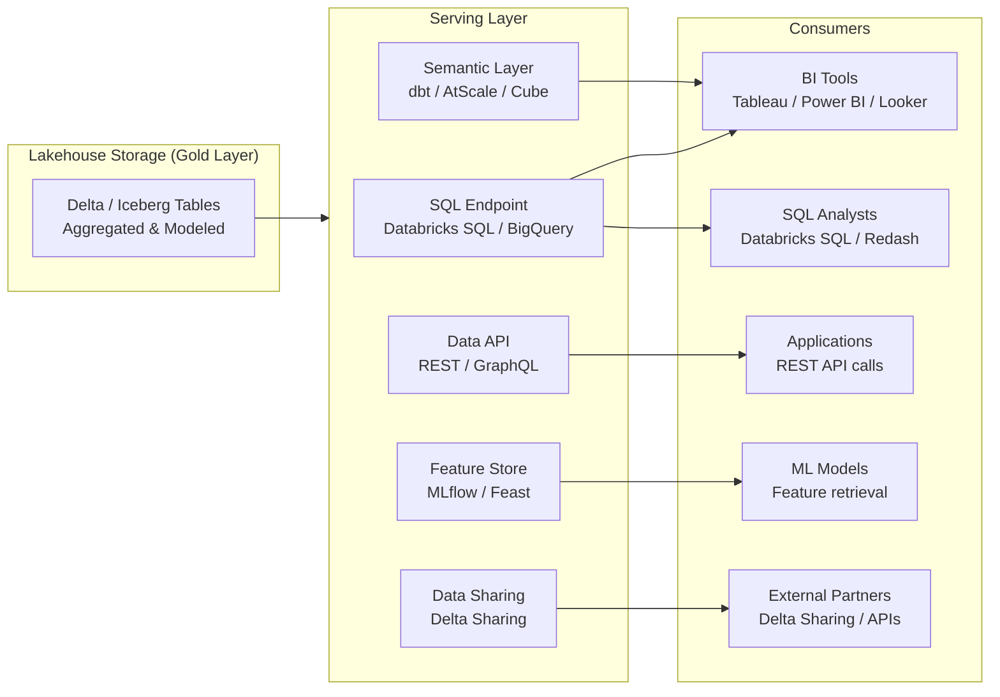
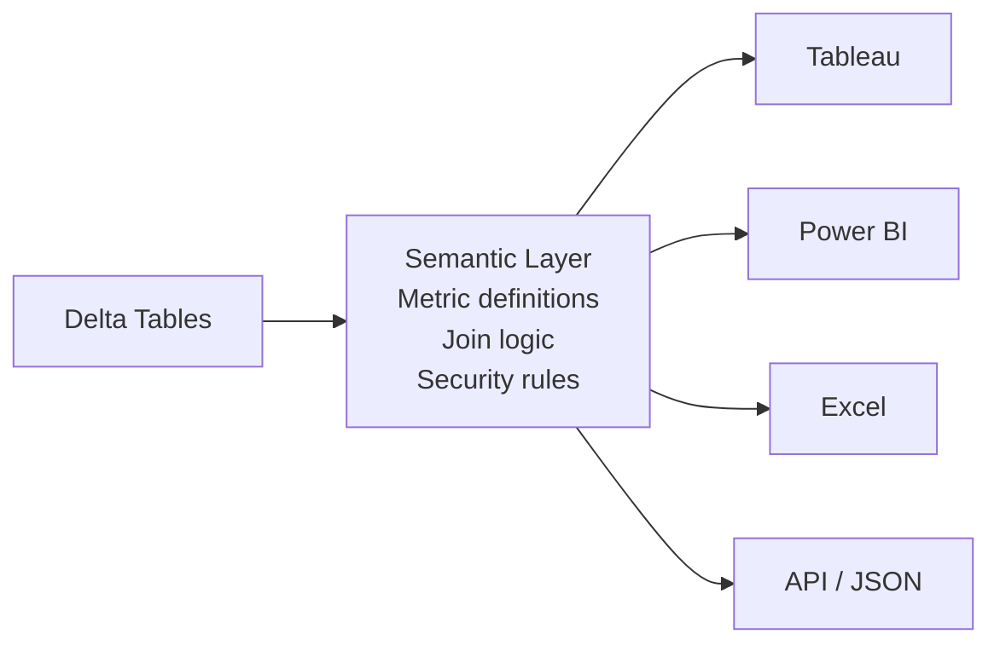
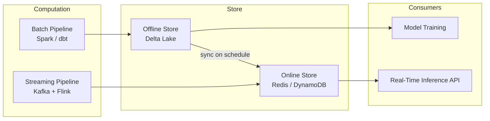
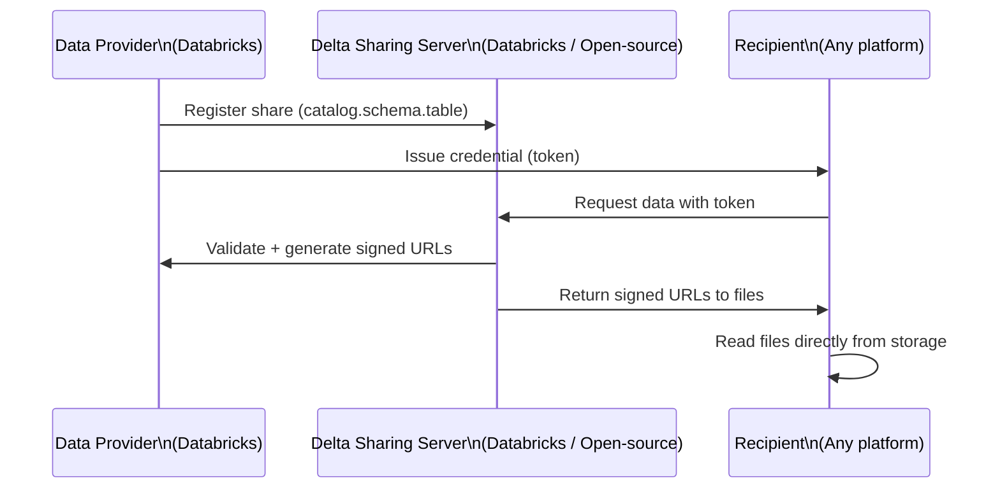
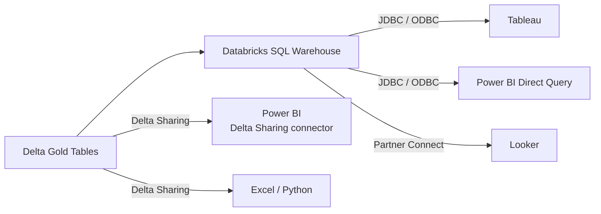

# Data Serving & Consumption

> Reference for SAs discussing how processed data gets into the hands of analysts, BI tools, applications, and ML systems. The serving layer is often where value is finally realized — and where performance problems are most visible to the business.

---

## The Serving Layer in Context



---

## SQL Endpoints / Warehouses

### What They Are
SQL-optimized compute clusters that expose lakehouse tables via standard JDBC/ODBC connectors. BI tools connect as if to a conventional database — no Spark knowledge required.

### Databricks SQL Warehouses

| Type | Characteristics | Best For |
|------|----------------|---------|
| Serverless | Instant startup, fully managed, per-second billing | Ad hoc queries, variable workloads |
| Pro | Faster than classic, photon-enabled, persistent cluster | Interactive BI dashboards |
| Classic | Original type, self-managed sizing | Predictable, steady workloads |

**Photon Engine:** Databricks' native vectorized query engine — significant performance uplift on SQL queries over vanilla Spark. Key differentiator vs. running notebooks for BI workloads.

**Key metrics to discuss with customers:**
- **Query concurrency** — how many simultaneous users?
- **P90 query latency** — what's acceptable for dashboard loads?
- **Warehouse auto-stop** — balancing availability with cost

### Other SQL Endpoints
| Platform | SQL Endpoint |
|----------|-------------|
| Snowflake | Virtual Warehouses |
| BigQuery | Serverless (built-in) |
| Redshift | Cluster or Redshift Serverless |
| Azure Synapse | Dedicated or Serverless SQL Pool |

### SA Talking Points
- "What BI tools do your analysts use today?" — anything with JDBC/ODBC connects to Databricks SQL without changes
- Serverless warehouses eliminate the "cluster startup time" objection — sub-second startup for interactive dashboards
- The right warehouse size is a conversation, not a guess — start small and scale based on p90 query latency

---

## Semantic Layers

### What a Semantic Layer Does
Sits between the physical data tables and BI tools. Defines business metrics, dimensions, and calculations in one place — so "revenue" means the same thing in every tool that connects through it.



### Why It Matters
Without a semantic layer, every BI tool redefines metrics independently:
- Tableau calculates "revenue" one way
- Power BI calculates it another way
- Excel spreadsheets have a third version
- Business users argue about which number is right

A semantic layer enforces a single definition across all tools.

### Key Semantic Layer Tools

| Tool | Notes |
|------|-------|
| dbt (Semantic Layer / MetricFlow) | SQL-based, open-source core, widely adopted by analytics engineers |
| AtScale | Universal Semantic Layer connecting to any cloud warehouse/lakehouse |
| Cube | Open-source semantic and API layer, strong developer experience |
| Looker (LookML) | Google-native semantic layer, embedded in Looker/Looker Studio |
| Power BI Semantic Model | Microsoft's model — SSAS tabular in the cloud |

### SA Talking Points
- "Do you ever have arguments about which number is the correct one?" — that's a semantic layer problem
- dbt is the de facto standard for analytics engineering teams; AtScale and Cube are the answer when you need multi-tool consistency without locking into one BI platform
- The semantic layer is often where "metric governance" conversations land — who is responsible for the definition of KPIs?

---

## Data APIs

### When You Need an API (Not a BI Tool)
Some consumers are applications, not analysts. Applications need data programmatically — product recommendations, risk scores, eligibility checks, search results.

### Patterns for Data APIs

**Pattern 1: Materialized Query + REST API**
Pre-compute the result set in a Gold table, expose it via a lightweight REST API backed by the database.

```
Gold Table (pre-aggregated) → REST API (FastAPI / Lambda / Cloud Run) → Application
```

**Pattern 2: On-Demand Query via SQL Endpoint**
Application queries the SQL warehouse directly via JDBC or the Databricks Statement Execution API.

```
Application → Databricks Statement Execution API → SQL Warehouse → Result
```

**Pattern 3: Feature Store (for ML)**
Pre-computed features stored in a feature store, served via a low-latency API for real-time model inference.

```
Feature Pipeline → Feature Store (online + offline) → Model Inference API
```

### SA Talking Points
- "Who are the consumers of this data?" — applications need APIs, analysts need SQL, both need the data to be governed
- Latency requirements drive the pattern: <10ms needs a cache (Redis, DynamoDB); <1s can query a SQL endpoint; >1s can afford a full query

---

## Feature Stores (for ML)

### What a Feature Store Does
A system for storing, versioning, and serving **ML features** — the transformed, aggregated attributes used to train and serve machine learning models.

**Core problem it solves:** Features are often computed differently for training (batch, historical) vs. inference (real-time, current). Feature stores provide a consistent view for both.

### Two Modes of Serving

| Mode | Storage | Latency | Use Case |
|------|---------|---------|---------|
| Offline | Delta Lake / Data Warehouse | Seconds | Model training, backtesting |
| Online | Redis / DynamoDB / Cassandra | Milliseconds | Real-time model inference |

### Feature Store Architecture



### Key Feature Store Tools

| Tool | Notes |
|------|-------|
| MLflow Feature Store (Databricks) | Native to Databricks, integrates with Unity Catalog |
| Feast | Open-source, cloud-agnostic, widely used |
| Tecton | Managed feature platform, strong real-time support |
| AWS SageMaker Feature Store | AWS-native |
| Vertex AI Feature Store | GCP-native |

### SA Talking Points
- Feature stores matter when a customer has multiple models that could share the same features — without one, each team recomputes the same attributes differently
- The offline-online consistency problem is real — customers often discover their model performs differently in production because training features don't match serving features
- "How do you share features between data science teams?" — if the answer is "we don't" or "we email notebooks," a feature store is the gap

---

## Delta Sharing

### What It Is
An open protocol for securely sharing live Delta Lake (and now Iceberg) tables with external recipients — without copying or moving data. Recipients can read the data with any compatible tool regardless of their cloud or platform.

### How It Works



### Use Cases

| Scenario | How Delta Sharing Helps |
|----------|------------------------|
| B2B data sharing | Share live data with partners without ETL or file transfers |
| Cross-cloud collaboration | Provider on Azure, recipient on GCP — works transparently |
| Data monetization | Sell access to live datasets as a product |
| Internal cross-team sharing | Share data between business units without copying to a common warehouse |

### SA Talking Points
- "How do you share data with partners today?" — file drops and SFTP are common; Delta Sharing is the modern answer
- Recipients don't need Databricks — they can use Python, Tableau, Power BI, Spark, Pandas, or any compatible tool
- No data movement = no data duplication cost and always-fresh data

---

## BI Connectivity Patterns

### Direct Query vs. Import Mode

| | Direct Query / Live Connection | Import / Extract |
|---|---|---|
| Data freshness | Real-time (as fresh as source) | Point-in-time snapshot |
| Query performance | Depends on source performance | Fast (in-memory / local) |
| Data volume limit | None (queries are pushed down) | Limited by memory |
| Source load | Yes — every user interaction queries source | No — queries hit the local extract |
| Best for | Dashboards needing current data | Ad hoc analysis with large datasets |

### Typical BI Connection Architecture



### SA Talking Points
- Partner Connect in Databricks provides one-click connector setup for Tableau, Power BI, Looker, and others — reduces BI team friction
- Direct Query on Databricks SQL is viable for dashboards now that serverless warehouses eliminate startup latency
- Power BI Import mode (scheduled refresh from Databricks SQL) is still the most common pattern for larger report datasets — DirectQuery for small, latency-sensitive dashboards

---

> **SA Rule of Thumb:** Serving layer decisions are driven by **who consumes the data and what latency they need**. Map consumer types first (BI, analysts, applications, ML) — then choose the serving pattern, not the other way around.
