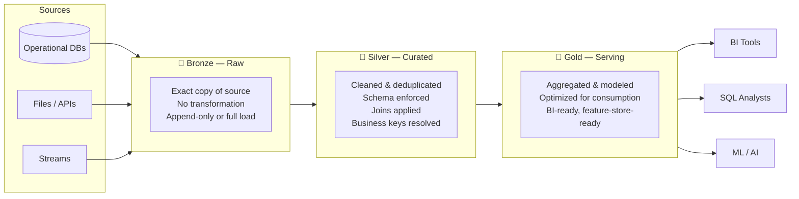

# Data Storage Layers

> Reference for SAs discussing data organization, open table formats, and the medallion architecture with customers. Covers what lives where, why, and how to talk about it without getting lost in file format details.

---

## The Medallion Architecture

The most common organizational pattern for lakehouse storage. Data flows through three progressively refined layers:

---

## Bronze Layer — Raw Zone

### Purpose
Land data exactly as received from the source. No transformations, no business logic.

### Characteristics
- Schema-on-read or schema-as-arrived — raw JSON, CSV, or database snapshots
- Append-only or full table dumps retained with ingestion timestamps
- The "time machine" — allows reprocessing from scratch if downstream logic changes
- Typically not exposed to business users

### What Goes Here
- Raw CDC event streams
- API response payloads (JSON/XML)
- File drops (CSV, XML, Excel)
- Database table snapshots

### SA Talking Points
- "Do you ever need to reprocess historical data when business rules change?" — if yes, bronze is essential
- The cost of bronze storage is low (object storage); the cost of not having it is high (re-extraction from source)
- Compliance use case: bronze is the audit trail — raw data is immutable evidence

---

## Silver Layer — Curated Zone

### Purpose
Cleaned, validated, and joined data. Represents trusted business entities — customers, orders, products — not raw source artifacts.

### Characteristics
- Schema enforced, data types validated
- Deduplication and null handling applied
- Business keys resolved (e.g., customer_id standardized across sources)
- Slowly Changing Dimensions (SCD) logic often lives here
- Read by data engineers, data scientists, and advanced analysts

### What Goes Here
- Cleansed dimension tables (dim_customer, dim_product)
- Fact tables with business keys joined in
- Unified customer/product views merged from multiple source systems

### SA Talking Points
- Silver is where "data quality" lives — this is the layer that needs the most governance investment
- Ask: "Who is responsible for the definition of a 'customer' in your organization?" — that answer defines who owns silver

---

## Gold Layer — Serving Zone

### Purpose
Aggregated, pre-computed, business-domain-specific datasets optimized for query performance and consumption.

### Characteristics
- Star or snowflake schemas for BI tools
- Pre-aggregated metrics and KPIs
- Feature tables for ML models
- Optimized with Z-ordering, clustering, or partitioning for fast query access
- Exposed to business users, BI tools, dashboards

### What Goes Here
- Sales summary tables (daily/weekly/monthly aggregates)
- Marketing attribution models
- Finance period-end snapshots
- ML feature store tables

### SA Talking Points
- Gold is what BI tools and business users actually query — performance here directly impacts analyst satisfaction
- "How many aggregation tables do you have?" — sprawl here usually means governance hasn't caught up with demand
- Gold tables in Delta/Iceberg are functionally equivalent to materialized views in a warehouse

---

## Open Table Formats

Open table formats bring warehouse-grade features (ACID, schema evolution, time travel) to files stored in object storage. They are the technical foundation of the lakehouse.

### Delta Lake

Developed by Databricks, now open-source under the Linux Foundation.

| Feature | What It Does |
|---------|-------------|
| ACID Transactions | Concurrent reads/writes without corruption |
| Time Travel | Query any prior version via `VERSION AS OF` or `TIMESTAMP AS OF` |
| Schema Evolution | Add/rename columns without rewriting the table |
| Schema Enforcement | Rejects writes that don't match the schema |
| Z-Order Clustering | Co-locates related data in files for faster filtering |
| Auto Optimize | Automatically compacts small files |
| Change Data Feed | Exposes row-level changes — useful for CDC and streaming |

**Best for:** Databricks-native workloads, streaming + batch unified pipelines

### Apache Iceberg

Originated at Netflix, now an Apache top-level project. Widely supported across engines.

| Feature | What It Does |
|---------|-------------|
| ACID Transactions | Full read/write isolation |
| Hidden Partitioning | Partition evolution without rewriting data |
| Row-level Deletes | Efficient deletes without full file rewrites |
| Multi-engine | Spark, Flink, Trino, Snowflake, BigQuery all read Iceberg natively |
| Time Travel | Snapshot-based versioning |

**Best for:** Multi-engine environments, customers using Snowflake + Spark + Trino together

### Apache Hudi

Originated at Uber, optimized for record-level upserts.

| Feature | What It Does |
|---------|-------------|
| Upsert Performance | Optimized for high-frequency record-level updates (CDC) |
| Incremental Queries | Efficiently read only changed records since last query |
| ACID | Full transaction support |

**Best for:** High-volume CDC use cases, AWS-centric environments (DeltaStreamer on EMR)

### Format Comparison

| | Delta Lake | Iceberg | Hudi |
|---|---|---|---|
| Best engine | Databricks / Spark | Any engine | Spark + CDC |
| Multi-engine support | Growing (via Delta Kernel) | Excellent | Moderate |
| Streaming support | Excellent | Good | Good |
| Upsert performance | Good | Good | Excellent |
| Community | Large (Databricks-backed) | Large (Apache) | Moderate |

### SA Talking Points
- Customers don't usually pick a format — they inherit one from their platform choice (Databricks → Delta, Snowflake → Iceberg preferred)
- The important message is **open vs. proprietary** — all three formats let customers move to a different compute engine without re-ingesting data
- Delta-Iceberg interoperability is improving (UniForm) — less of a "pick one forever" decision than it used to be

---

## Partitioning and Clustering

### Why It Matters
Large tables need physical organization to avoid full table scans. The wrong strategy can make queries 10–100x slower.

### Partitioning
Divides a table into sub-directories by a column value (e.g., `year/month/day`). Queries that filter on the partition column skip entire partitions.

- **Good partition columns:** Date/time, region, business unit — low-to-medium cardinality, commonly filtered
- **Bad partition columns:** User ID, transaction ID — too many partitions, small files problem

### Z-Ordering (Delta) / Sorting (Iceberg)
Co-locates rows with similar values in the same files. Enables efficient skipping within a partition when filtering on non-partition columns.

- Best for high-cardinality filter columns (customer_id, product_id)
- Complements partitioning — partition by date, Z-order by customer_id

### SA Talking Points
- "What columns does your team filter on most?" — that answer drives the partitioning and clustering strategy
- Small files are the most common performance problem in production lakehouses — auto-compaction (Delta) or scheduled compaction (Iceberg) is essential

---

> **SA Rule of Thumb:** Medallion + Delta Lake covers the vast majority of Databricks-centric architectures. Iceberg is the answer when customers need true multi-engine access or are standardizing on Snowflake as a co-platform.
