# Real-Time & Streaming Data

> Reference for SAs discussing streaming architectures with customers. Covers the core concepts, major platforms, architectural patterns, and — critically — when streaming is and isn't the right answer.

---

## The Streaming Landscape

```mermaid
flowchart LR
    subgraph Producers
        APP[Applications]
        IOT[IoT / Sensors]
        CDC[CDC / DB Changes]
        CLICK[Clickstream]
    end
    subgraph Brokers["Message Brokers / Event Streaming Platforms"]
        KAFKA[Apache Kafka]
        KINESIS[AWS Kinesis]
        PUBSUB[Google Pub/Sub]
        EVENTHUB[Azure Event Hubs]
        SERVICEBUS[Azure Service Bus]
    end
    subgraph Processors["Stream Processors"]
        SPARK[Spark Structured Streaming]
        FLINK[Apache Flink]
        KSTREAMS[Kafka Streams / ksqlDB]
        DATAFLOW[Google Dataflow]
    end
    subgraph Sinks
        LAKE[Lakehouse\nDelta / Iceberg]
        SEARCH[Search\nElasticsearch]
        CACHE[Cache / Redis]
        REALTIME[Real-Time Dashboard]
        ALERT[Alerting System]
    end
    Producers --> Brokers --> Processors --> Sinks
```



---

## Core Concepts

### Events vs. Messages
- **Event:** An immutable record that something happened — "Order #123 was placed at 14:32:07"
- **Message:** A command or request to do something — "Process payment for Order #123"

Both flow through brokers, but the semantics differ. Analytics workloads deal with events; microservices deal with messages.

### Topics and Partitions (Kafka Model)
- **Topic:** A named stream of events (e.g., `orders`, `page_views`, `sensor_readings`)
- **Partition:** A topic is divided into partitions for parallel consumption. Events within a partition are ordered; across partitions they are not.
- **Consumer Group:** Multiple consumers reading the same topic in parallel, each partition assigned to one consumer

```
Topic: orders
├── Partition 0: [event1, event4, event7, ...]
├── Partition 1: [event2, event5, event8, ...]
└── Partition 2: [event3, event6, event9, ...]

Consumer Group A (BI pipeline): reads all partitions
Consumer Group B (Fraud service): reads all partitions independently
```

### Delivery Guarantees
| Guarantee | Meaning | Use Case |
|-----------|---------|---------|
| At-most-once | May lose events, never duplicates | Non-critical metrics |
| At-least-once | Never loses events, may duplicate | Most analytics workloads |
| Exactly-once | No loss, no duplicates | Financial transactions |

### Windowing (for Aggregations)
| Window Type | Definition | Example |
|------------|------------|---------|
| Tumbling | Fixed, non-overlapping time windows | Count orders every 5 minutes |
| Sliding | Fixed duration, moves continuously | Rolling 1-hour average, updated every 1 minute |
| Session | Dynamic, gap-based (ends after inactivity) | User session duration |

---

## Message Brokers

### Apache Kafka

The dominant open-source event streaming platform. Designed for high-throughput, durable, replicated event logs.

**Key characteristics:**
- Events are retained on disk (configurable retention — days, weeks, or infinite)
- Pull-based consumption — consumers control their read position (offset)
- Partitioned for horizontal scalability
- Replication across brokers for fault tolerance

**Managed offerings:** Confluent Cloud, AWS MSK, Azure Event Hubs (Kafka-compatible), Aiven

**When to use Kafka:**
- High-throughput event streams (millions of events/second)
- Events need to be replayed — multiple consumer groups reading the same topic independently
- You need durable event log semantics (not fire-and-forget)

### AWS Kinesis Data Streams

AWS-native, fully managed event streaming. Kafka-compatible at a conceptual level but different API.

**Key characteristics:**
- Shard-based (equivalent to partitions) — throughput scales by adding shards
- Retention up to 365 days (default 24 hours)
- Tight integration with AWS Lambda, Firehose, and Glue

**When to use Kinesis:** AWS-native architectures, teams that don't want to manage Kafka

### Azure Event Hubs

Azure's managed event streaming service. Offers a Kafka-compatible endpoint — existing Kafka producers/consumers work without code changes.

**When to use Event Hubs:** Azure-native architectures, teams already using Kafka that want a managed alternative

### Google Pub/Sub

GCP's managed messaging service. Designed for global fan-out at massive scale.

**Key difference from Kafka:** Pub/Sub is push-based (or pull) and does not retain events in the same ordered, offset-based way. Less suitable for replay use cases.

**When to use Pub/Sub:** GCP-native, event fan-out to many subscribers, integration with Dataflow

---

## Stream Processing Engines

### Spark Structured Streaming

Extends Apache Spark's DataFrame API to streaming. Processes data as micro-batches (or in continuous mode) and integrates natively with Delta Lake.

**Best for:**
- Teams already using Spark/Databricks for batch — same code patterns
- Writing to Delta Lake (native integration, ACID guarantees)
- Unified batch + streaming pipelines

**Latency:** Seconds to sub-second (micro-batch); not suitable for millisecond requirements

### Apache Flink

True streaming engine (event-by-event processing). The gold standard for low-latency, stateful stream processing.

**Best for:**
- Millisecond latency requirements (fraud detection, trading systems)
- Complex stateful operations (joins across streams, sessionization)
- High-throughput exactly-once processing

**Managed offerings:** AWS Kinesis Data Analytics (Flink), Azure HDInsight (Flink), Confluent Cloud (Flink)

### Kafka Streams / ksqlDB

Stream processing **inside** the Kafka ecosystem. No separate cluster needed — processing runs in the Kafka client.

**Best for:**
- Simple transformations, filtering, enrichment within Kafka
- Teams that don't want to manage a separate processing cluster
- SQL-based stream processing (ksqlDB)

### Comparison

| | Spark Streaming | Apache Flink | Kafka Streams |
|---|---|---|---|
| Latency | Seconds (micro-batch) | Milliseconds (true streaming) | Milliseconds |
| State management | Good | Excellent | Good |
| Exactly-once | Yes (with Delta) | Yes | Yes |
| Learning curve | Low (if using Spark already) | High | Medium |
| Best for | Lakehouse pipelines | Low-latency, complex state | Kafka-native transforms |

---

## Lambda vs. Kappa Architecture

### Lambda Architecture (Batch + Streaming)
Maintains two parallel pipelines: a **batch layer** for accurate historical processing and a **speed layer** for real-time approximation. Results are merged at query time.

```
Sources → Batch Layer (Spark batch)   → Batch Views  ↘
       → Speed Layer (Spark Streaming) → Realtime Views → Serving Layer → User
```

**Problem:** Two codebases to maintain, two sets of bugs, results can diverge.

### Kappa Architecture (Streaming Only)
Processes everything as a stream. Historical reprocessing is done by replaying the event log from the broker.

```
Sources → Streaming Layer (Flink / Spark Streaming) → Serving Layer → User
```

**Problem:** Requires durable event storage (Kafka with long retention), reprocessing can be slow for years of history.

### Modern Lakehouse Approach (Unified)
Spark Structured Streaming + Delta Lake effectively collapses batch and streaming into one pipeline — the same code runs in batch or streaming mode. This is the practical answer for most Databricks customers.

---

## Common Streaming Architecture Patterns

### Pattern 1: Real-Time Ingestion to Lakehouse
Most common pattern — streaming data lands in Delta Lake bronze, then processes through silver/gold on a micro-batch cadence.

```
Kafka → Spark Structured Streaming → Delta Lake Bronze → DLT Pipeline → Silver / Gold
```

**Latency:** 30 seconds to 5 minutes end-to-end (sufficient for most BI use cases)

### Pattern 2: Real-Time Alerts & Dashboards
Events processed in-stream and pushed to alerting or real-time visualization tools.

```
Kafka → Flink → Alert Engine (PagerDuty / Slack)
              → Real-Time Dashboard (Grafana / Kibana)
```

**Latency:** Milliseconds to seconds

### Pattern 3: Stream Enrichment (Join with Reference Data)
Incoming events enriched with reference data (e.g., joining clickstream events with customer profile data).

```
Clickstream (Kafka) ──────────────────→ Flink Join → Enriched Stream
Customer Profiles (DB / Delta Table) ──┘
```

---

## When to Use Streaming (and When Not To)

### Use Streaming When:
| Use Case | Why Streaming |
|----------|--------------|
| Fraud detection | Decision must be made before transaction completes |
| IoT / operational monitoring | Alert on anomaly as it happens |
| Real-time personalization | Recommend based on current session behavior |
| Financial market data | Prices change by the millisecond |
| Operational dashboards | Operations teams need current-hour visibility |

### Don't Use Streaming When:
| Scenario | Better Approach |
|----------|----------------|
| Daily/weekly reports | Batch — cheaper and simpler |
| Historical analysis | Batch — process at rest |
| Reference data updates | Hourly batch or polling |
| Low-volume, low-frequency sources | Batch — streaming overhead not justified |

### SA Talking Point — The "Real-Time Tax"
Streaming architectures are significantly more expensive and complex to operate than batch:
- More moving parts (brokers, processors, state stores)
- More failure modes (consumer lag, exactly-once failures, schema mismatches)
- Higher operational burden (on-call for broker outages, consumer group drift)

Ask: **"What business decision changes if you see this data 15 minutes later?"** If the answer is "nothing significant," batch or micro-batch is the right answer.

---

> **SA Rule of Thumb:** Most "we need real-time" requests are actually "we need fresher data" — hourly micro-batch satisfies 80% of them. Reserve true streaming for latency-sensitive, revenue-impacting use cases.
