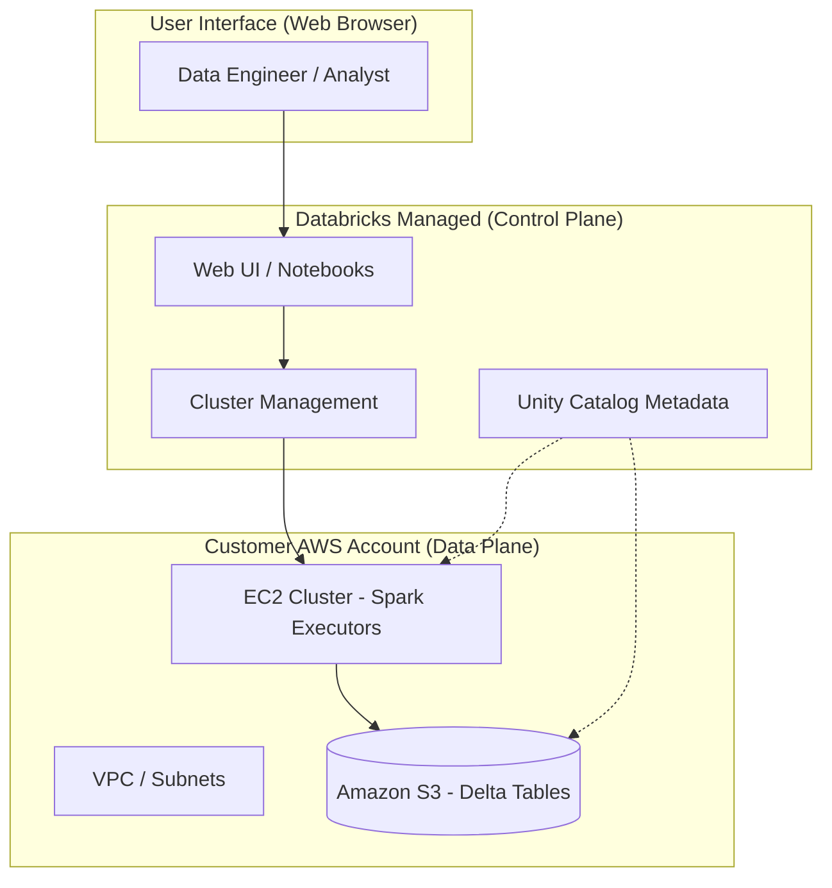

## Introduction to Databricks Architecture on AWS

### Section at a Glance
**What you'll learn:**
- The fundamental separation of the Databricks Control Plane and Data Plane.
- How Databricks leverages AWS native services (S3, EC2, IAM) to provide a Lakehouse architecture.
- The role of Unity Catalog in unified governance across a distributed environment.
- The distinction between All-Purpose, Job, and SQL warehouses in terms of compute and cost.
- The security implications of the Databrability Shared Responsibility Model on AWS.

**Key terms:** `Control Plane` · `Data Plane` · `Unity Catalog` · `Delta Lake` · `Lakehouse` · `Compute/Storage Separation`

**TL;DR:** Databricks on AWS is a multi-layered architecture that separates management (Control Plane) from processing (Data Plane), allowing you to run high-performance Spark workloads directly on your AWS S3 data without moving it out of your VPC.

---

### Overview
In the modern enterprise, the "Data Warehouse vs. Data Lake" debate has historically created a massive architectural tax. Organizations often find themselves maintaining a high-performance, structured warehouse (like Amazon Redshift) for BI, alongside a low-cost, unstructured data lake (like S3) for Machine Learning. This duplication leads to fragmented "silos of truth," inconsistent security models, and significant data egress costs.

The Databricks architecture on AWS solves this by introducing the **Lakehouse architecture**. It provides the performance and ACID transactions of a data warehouse directly on top of your low-cost S3 data lake. For the Data Engineer, this means you no longer need to build complex ETL pipelines just to move data from a "landing" zone to a "reporting" zone; the architecture allows you to treat S3 as your single, authoritative source of truth.

As you transition from AWS Glue or EMR, the most critical shift is understanding that while Databricks manages the "brains" (the orchestration and UI), the "muscle" (the EC2 instances and the S3 data) resides within your AWS ecosystem. This ensures that your data remains under your company's sovereign control and network perimeter.

---

### Core Concepts

#### 1. The Control Plane vs. The Data Plane
The most vital concept for both architects and engineers is the functional split between these two planes.

*   **The Control Plane:** This is the Databricks-managed environment. It hosts the Web UI, the Notebook interface, the cluster management logic, and the metadata for job orchestration. 
    *   📌 **Must Know:** The Control Plane does *not* store your actual business data; it only stores metadata and instructions on how to process it.
*   **The Data Plane:** This is located within **your** AWS account. When you spin up a cluster, Databricks triggers the launch of EC2 instances in your VPC. This is where the Spark executors live and where the actual reading/writing to S3 occurs.
    *   ⚠️ **Warning:** Developers often mistakenly believe that "Databricks manages the data." While they manage the *service*, the actual data resides in your S3 buckets. If your S3 permissions are misconfigured, you may inadvertently expose data or break your pipelines.

#### 2. Unified Governance with Unity Catalog
Unity Catalog is the industry's first unified governance solution for the Lakehouse. It provides a single place to manage access controls, lineage, and auditing across all your workspaces.
*   It moves governance from "folder-level" S3 permissions to "object-level" SQL permissions (e.g., `GRANT SELECT ON TABLE customers TO engineering_group`).

#### 3. The Storage Layer: Delta Lake on S3
The "engine" of the architecture is Delta Lake, an open-source storage layer. It brings reliability to S3 by providing features like:
*   **ACID Transactions:** Prevents partial data writes from corrupting tables.
*   **Time Travel:** The ability to query previous versions of data for auditing or rollbacks.
*   **Schema Enforcement:** Ensures that "bad data" doesn't break your downstream production tables.

---

### Architecture / How It Works



1.  **User Interface:** The engineer interacts with the Databricks UI via a browser.
2.  **Control Plane:** Databricks receives the instruction (e.g., "Run this Spark job") and manages the lifecycle of the compute.
3.  **Cluster Management:** The Control Plane sends commands to your AWS account to spin up or scale EC2 instances.
4.  **Data Plane (EC2):** The Spark engines execute the code, pulling data from S3 and performing transformations.
5.  **Amazon S3:** The persistent storage layer where the actual Delta/Parquet files reside.
6.  **Unity Catalog:** Acts as the "cross-plane" layer, managing permissions that apply to both the metadata and the physical data.

---

 
### Comparison: When to Use What

| Compute Option | Best For | Trade-offs | Approx. Cost Signal |
| :--- | :--- | :--- | :--- |
| **All-Purpose Clusters** | Interactive development, Ad-hoc analysis, Notebook experimentation. | Expensive; designed for "always-on" or manual start/stop. | 💰 High (Premium) |
| **Job Clusters** | Automated production pipelines (Workflows), ETL, Batch processing. | Cannot be used interactively; higher latency for startup. | 💡 Low (Optimized) |
| **SQL Warehouses** | BI Tools (Tableau, PowerBI), SQL-only users, high-concurrency querying. | Specialized for SQL; less flexible for Python/Scala heavy lifting. | 📊 Medium (Usage-based) |

**How to choose:** Use All-Purpose clusters for writing code, but **always** transition that code to a Job Cluster for production to minimize costs.

---

### Cost Cheat Sheet

| Scenario | Recommended Option | Key Cost Driver | Watch Out For |
| :--- | :--- | :--- | :--- |
| **Production ETL** | Job Clusters | EC2 Instance Type (vCPU/RAM) | Forgetting to set an "Auto-Termination" policy on manual clusters. |
| **Ad-hoc Exploration** | All-Purpose Clusters | Cluster Uptime | Leaving clusters running overnight with no active users. |
 
| **Business Intelligence** | SQL Warehouses | Databricks Units (DBUs) per hour | Over-provisioning warehouse size (e.g., using "Large" when "Small" suffices). |
| **Data Ingestion**| Auto Loader (Streaming) | S3 API Calls (LIST/GET) | Massive amounts of small files causing high S3 request costs. |

> 💰 **Cost Note:** The single biggest cost driver in Databricks is **Idle Compute**. A cluster running 24/7 without a single active query will quickly drain your budget. Always implement auto-termination (e.g., 20 minutes of inactivity).

---

### Service & Tool Integrations

1.  **AWS IAM & S3:** The foundation of security. Databricks uses IAM Roles (via Instance Profiles or Unity Catalog) to assume permissions to read/write to your S3 buckets.
2.  **AWS Glue Catalog:** Databricks can sync with the AWS Glue Data Catalog, allowing you to bridge the gap between legacy Glue jobs and new Databricks workloads.
3.  **Amazon Athena:** You can use Athena to query the same Delta tables sitting in S3 that Databricks is processing, providing a "serverless" alternative for simple queries.
4.  **AWS Lambda:** Often used to trigger Databricks Workflows via API when a new file lands in an S3 landing zone.

---

### Security Considerations

Databricks operates on a **Shared Responsibility Model**. Databricks secures the Control Plane; you secure the Data Plane and your AWS infrastructure.

| Control | Default State | How to Enable / Strengthen |
| :--- | :--- | :--- |
| **Data Encryption** | Encrypted at rest (S3-SSE) | Use AWS KMS with Customer Managed Keys (CMK) for full control. |
| **Network Isolation** | Public Access possible | Deploy Databricks in your own **VPC/VNet** using "Customer-Managed VPC." |

| **Access Control** | IAM-based | Implement **Unity Catalog** for fine-grained SQL-level permissions. |
| **Audit Logging** | Basic Logs | Enable **AWS CloudTrail** and Databricks Audit Logs to a centralized S3 bucket. |

---

### Performance & Cost

To achieve maximum performance while maintaining a lean budget, you must master **Instance Selection** and **Scaling**.

**The Performance/Cost Trade-off Example:**
Imagine a daily ETL job that processes 1TB of data.
*   **Scenario A (Suboptimal):** Using a large `m5.4xlarge` All-Purpose cluster, running 24/7.
    *   *Estimated Cost:* ~$10/hour $\times$ 24 hours = **$240/day**.
*   **Scenario B (Optimized):** Using a `m5.xlarge` Job Cluster, set to auto-terminate, running for exactly 1 hour.
    *   *Estimated Cost:* ~$2/hour $\times$ 1 hour = **$2/day**.

**Key Tuning Guidance:**
1.  **Use Spot Instances:** For non-critical, fault-tolerant ETL, use AWS Spot instances for your worker nodes to save up to 70-90% on EC2 costs.
2.  **Enable Auto-scaling:** Let the cluster grow during heavy shuffles and shrink during light periods.
3.  **Optimize File Sizes:** Avoid the "Small File Problem." Use the `OPTIMIZE` command in Delta Lake to compact small files into larger, more efficient ones.

---

### Hands-On: Key Operations

**Step 1: Creating an S3 Bucket for the Lakehouse**
First, we need a landing zone in AWS.
```bash
# Using AWS CLI to create a bucket for our Databricks data
aws s3 mb s3://my-databricks-lakehouse-data-001 --region us-east-1
```
> 💡 **Tip:** Always use a unique name and follow a naming convention that includes your environment (e.g., `-dev`, `-prod`).

**Step 2: Defining an IAM Policy for Databricks Access**
This policy allows the Databr icks cluster to read and write to our new bucket.
```json
{
    "Version": "2012-10-17",
    "Statement": [
        {
            "Effect": "Allow",
            "Action": ["s3:GetObject", "s3:PutObject", "s3:DeleteObject", "s3:ListBucket"],
            "Resource": [
                "arn:aws:s3:::my-databricks-lakehouse-data-001",
                "arn:aws:s3:::my-databricks-lakehouse-data-001/*"
            ]
        }
    ]
}
```

**Step 3: Creating a Table in Databrck (SQL)**
Once the cluster is running, we use SQL to define our structure.
```sql
-- Create a managed table in the Unity Catalog
CREATE TABLE main.default.sales_data (
  order_id INT,
  customer_id STRING,
  amount DOUBLE,
  order_date DATE
) USING DELTA;
```
> 💡 **Tip:** Using `USING DELTA` is the default in modern Databricks, but explicitly stating it ensures you are utilizing the Lakehouse features like Time Travel.

---

### Customer Conversation Angles

**Q: "Where is my data actually stored? In Databricks' account or mine?"**
**A:** Your data stays in your AWS account, specifically in your S3 buckets. Databricks only manages the compute that processes it, ensuring you maintain ownership and sovereignty.

**Q: "We already use AWS Glue. Why should we move to Databricks?"**
**A:** While Glue is excellent for serverless ETL, Databricks provides a unified "Lakehouse" environment that supports high-performance SQL, advanced Machine Learning, and much faster interactive development within a single interface.

**Q: "How do I know if my developers are overspending on clusters?"**
**A:** You can use Datbrticks System Tables to monitor DBU (Databricks Unit) consumption and set up automated alerts via Amazon CloudWatch or Databricks SQL dashboards.

**Q: "Is it possible to run Databricks without the internet? We have strict VPC requirements."**
**A:** Yes, by using a "Customer-Managed VPC" deployment, you can ensure all traffic stays within your private network, using AWS PrivateLink to communicate with the Databricks Control Plane.

**Q: "If I delete my Databricks workspace, is my data gone?"**
**A:** No. Since the data resides in your S3 buckets, deleting the Databricks workspace only deletes the management layer. Your underlying data remains safe in S3.

---

### Common FAQs and Misconceptions

**Q: "Is Databricks just a managed version of Apache Spark?"**
**A:** Not exactly. While it uses Spark, it adds a critical governance layer (Unity Catalog), a specialized storage layer (Delta Lake), and optimized compute engines (Photon) that far outperform standard open-source Spark.

**Q: "Do I need to pay for both AWS EC2 and Databricks?"**
**A:** Yes. You pay AWS for the underlying infrastructure (EC2, S3, EBS) and you pay Databricks for the software usage (DBUs).

**Q: "Can I use Databricks with my existing Redshift data?"**
**A:** Absolutely. You can use the Redshift connector to ingest data from Redshift into your Databricks Lakehouse for advanced analytics.

**Q: "Does the Control Plane see my sensitive data?"**
**A:** ⚠️ **Warning:** No. The Control Plane handles metadata (table names, schema) and instructions, but the actual data processing happens in your Data Plane (EC2/S3), meaning your raw data values never enter the Databrical-managed environment.

**Q: "Is Delta Lake a proprietary format?"**
**A:** No, it is an open-source format. This prevents vendor lock-in, as you can read the same Delta files using other tools like Apache Spark or Presto.

---

### Exam & Certification Focus

*   **Domain: Architecture (High Priority)**
    *   Distinguishing between Control Plane and Data Plane. 📌
    *   Understanding the role of S3 in the Lakehouse.
    *   Identifying the components of Unity Catalog.
*   **Domain: Data Engineering (Medium Priority)**
    *   The impact of Delta Lake features (ACID, Time Travel) on data pipelines.
    *   Using Auto Loader for efficient S3 ingestion.
*   **Domain: Security (Medium Priority)**
    *   Implementing the Principle of Least Privilege using IAM and Unity Catalog.
    *   Understanding Network Isolation (VPC deployment).

---

### Quick Recap
- Databricks on AWS separates **Management (Control Plane)** from **Compute (Data Plane)**.
- Your data stays in **your S3 buckets**, ensuring security and ownership.
- **Unity Catalog** is the central nervous system for all governance and metadata.
- **Job Clusters** are significantly more cost-effective than **All-Purpose Clusters** for production.
- The **Lakehouse** architecture eliminates data silos by bringing Warehouse-like features to your S3 Data Lake.

---

### Further Reading
**[Databricks Documentation]** — The definitive source for all feature updates and configuration guides.
**[AWS Whitepaper: Lake House Architecture]** — Deep dive into building modern data architectures on AWS.
**[Databricks Architecture Guide]** — Detailed technical breakdown of the Control/Data plane split.
**[Delta Lake Documentation]** — Everything you need to know about ACID transactions and storage optimization.
**[AWS Security Best Practices for Databricks]** — Essential reading for configuring VPCs, IAM, and KMS.