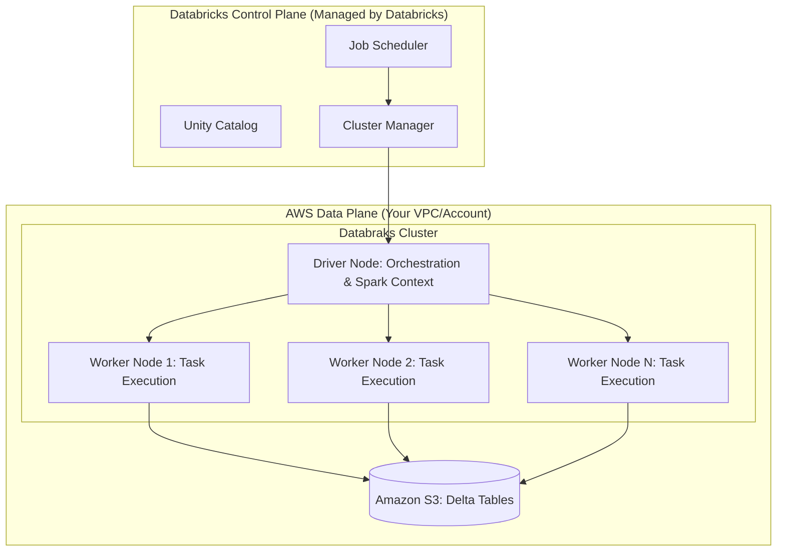

## Databricks Compute and Cluster Configuration

### Section at a Glance
**What you'll learn:**
- The architectural distinction between All-Purpose, Job, and SQL Warehouses.
- How to configure worker nodes, driver nodes, and scaling policies (Autoscaling).
- Managing Spot vs. On-Demand instances for cost-performance optimization.
- Optimizing cluster configurations for different workload types (ETL vs. Ad-hoc).
- Understanding the impact of cluster lifecycle management on operational overhead.

**Key terms:** `All-PG Compute` · `Job Compute` · `Serverless SQL` · `Autoscaling` · `Spot Instances` · `Driver Node`

**TL;DR:** Compute in Databricks is the engine of your data pipeline; choosing the right cluster type (All-Purpose, Job, or SQL Warehouse) is the single most important decision for balancing processing speed with cloud expenditure.

---

### Overview
In a modern data estate, the primary business pain point isn't "how do we process data," but "how do we process data without breaking the budget?" For organizations migrating from legacy Hadoop environments or AWS Glue, the complexity of managing compute resources can lead to "cloud sprawl"—where idle clusters and over-provisioned nodes create massive, unallocated costs.

Databricks solves this by decoupling compute from storage. While your data lives in S3, your compute (clusters) is transient. This section addresses the fundamental challenge of resource orchestration: how to provide enough horsepower for heavy-duty Bronze-to-Silver ETL pipelines while ensuring that interactive analysts have responsive, low-latency environments for SQL querying.

Properly configuring compute allows a Data Engineer to transition from being a "server administrator" to a "resource orchestrator." You will learn to design configurations that automatically scale up during peak ingestion windows and shut down during periods of inactivity, ensuring that the business only pays for the exact compute seconds utilized.

---

### Core Concepts

#### 1. Cluster Types
Databricks provides three primary flavors of compute, each optimized for a specific persona and cost profile.

*   **All-Purpose Compute:** Used for interactive analysis, notebook development, and ad-hoc debugging. 
    *   ⚠️ **Warning:** These clusters are the most expensive because they are designed for high availability and "always-on" interactivity. Leaving an All-Purpose cluster running overnight is a common cause of budget overruns.
*   **Job Compute:** Dedicated solely to running automated workflows (Databricks Jobs).
    *   📌 **Must Know:** Job clusters are significantly cheaper (often ~50% less) than All-Purpose clusters. For the exam, remember: **Always use Job clusters for production ETL pipelines.**
*   **SQL Warehouses (Classic, Pro, Serverless):** Optimized for SQL workloads and BI tools (like Tableau or Power BI).
    *   **Serverless SQL** is the modern standard, providing near-instant startup times by removing the need to manage underlying EC2 instances.

#### 2. The Cluster Anatomy
*   **Driver Node:** The "brain" of the cluster. It coordinates tasks, manages the Spark Context, and tracks the lineage of the DAG (Directed Acyclic Graph).
    *   💡 **Tip:** If you are performing heavy `collect()` operations or working with massive metadata, increase the Driver size to prevent Out-of-Memory (OOM) errors.
*   **Worker Nodes:** The "muscle" of the cluster. These nodes execute the actual partitions of data.
*   **Autoscaling:** Allows the cluster to dynamically add or remove workers based on the backlog of pending tasks.

#### 3. Instance Types & Purchasing Models
*   **On-Demand Instances:** Guaranteed availability. The node will not be reclaimed by AWS.
*   **Spot Instances:** Use spare AWS capacity at a massive discount (up to 90%).
    *   ⚠️ **Warning:** AWS can reclaim Spot instances at any time with very little notice. 
    *   📌 **Must Know:** Use Spot instances for **Worker nodes** in fault-tolerant Spark jobs, but **never** use Spot for the **Driver node**. If the Driver is lost, the entire job fails.

---

### Architecture / How It Works



1.  **Cluster Manager:** Receives instructions from the Control Plane to provision EC2 instances in your AWS account.
2.  **Driver Node:** Receives the Spark plan and divides the workload into tasks.
3.  **Worker Nodes:** Pull data from S3, perform transformations, and write results back to S3.
4.  **Amazon S3:** Acts as the persistent storage layer, decoupled from the transient compute.

---

### Comparison: When to Use What

| Option | Best For | Trade-offs | Approx. Cost Signal |
| :--- | :--- | :--- | :--- |
| **All-Purpose Cluster** | Data Science, Ad-hoc EDA, Debugging | High cost; lacks automation efficiency | 💰💰💰 (Highest) |
| **Job Cluster** | Production ETL, Scheduled Pipelines | No interactivity; must wait for start-up | 💰 (Lowest) |
| **SQL Warehouse** | BI Reporting, SQL Analysts, Dashboards | Specific to SQL; not for Python/Scala logic | 💰💰 (Medium/High) |
| **Serverless SQL** | Rapid scaling, zero management overhead | Less control over underlying VM types | 💰💰 (Pay-per-use) |

**Decision Logic:** If you are writing code, use **All-Purpose**. If that code is running on a schedule, use **Job**. If you are querying a dashboard, use **SQL Warehouse**.

---

### Cost Cheat Sheet

| Scenario | Recommended Option | Key Cost Driver | Watch Out For |
| :--- | :--- | :--- | :--- |
| **Production ETL (Daily)** | Job Cluster + Spot Workers | Number of Worker Nodes | Driver node size (don't undersize) |
| **Data Science Exploration** | All-Purpose + On-Demand | Cluster Uptime (Auto-termination) | Leaving clusters idle overnight |
 $\text{Ad-hoc SQL Querying}$ | SQL Warehouse (Serverless) | Compute Seconds / SQL Units | Aggressive scaling settings |
| **Large-scale Batch Processing** | Job Cluster + Large Instances | Data Shuffle Volume | Disk spill to EBS (Slows down jobs) |

💰 **Cost Note:** The single biggest cost mistake in Databricks is failing to configure **Auto-Termination** on All-Purpose clusters. A cluster left running over a long weekend can cost hundreds of dollars for zero value.

---

### Service & Tool Integrations

1.  **AWS Glue/EMR Integration:**
    *   Use Databricks clusters to read from Glue Data Catalogs to maintain a single source of truth for metadata.
2.  **Amazon S3 (The Backbone):**
    *   Compute nodes use IAM Roles (Instance Profiles) to gain permission to read/write S3 buckets.
3.  **Unity Catalog:**
    *   Provides a centralized governance layer that manages permissions across all compute types (All-Purpose, Job, and SQL).
4.  **Databricks Workflows:**
    *   The orchestrator that triggers Job Clusters based on schedules, file arrival (S3 Events), or upstream task completion.

---

    ### Security Considerations

| Control | Default State | How to Enable / Strengthen |
| :--- | :--- | :--- |
| **Network Isolation** | Public Internet Access (via Databricks) | Deploy in **Customer-Managed VPC** with Private Link. |
| **Data Access Control** | IAM Role-based (S3) | Implement **Unity Catalog** for fine-grained (Row/Column) security. |
| **Encryption (At Rest)** | AWS Managed Keys (KMS) | Use **Customer-Managed Keys (CMK)** for higher compliance. |
| **Audit Logging**| Standard CloudTrail | Enable **Databricks Audit Logs** to track cluster creation/deletion. |

---

### Performance & Cost

**Tuning Strategy: The "Right-Sizing" Framework**
To optimize, you must balance **Compute Power** against **Data Shuffle**. 
*   **Small Clusters:** Low cost, but high "Shuffle" overhead. If workers are constantly swapping data to disk, your cost per row increases.
*   **Large Clusters:** High cost, but faster completion.

**Example Cost Scenario:**
*   **Scenario A (Under-provisioned):** 2 nodes, 4 hours to run. Cost: $2.00/hr * 4 = **$8.00**. (High risk of failure/OOM).
*   **Scenario B (Optimized):** 8 nodes (using Spot), 30 minutes to run. Cost: $8.00/hr * 0.5 = **$4.00**.
*   **Conclusion:** In many cases, increasing the number of nodes (scaling out) actually *redu/ces* total cost by reducing the total "wall clock" time the cluster is active.

---

### Hands-On: Key Operations

**Step 1: Setting up Auto-Termination (Python/REST API)**
This script (conceptually) ensures that a cluster shuts down after 20 minutes of inactivity to prevent cost leakage.
```python
# This represents the configuration payload for a cluster creation API call
cluster_config = {
    "cluster_name": "Production_ETL_Cluster",
    "autotermination_minutes": 20, # Crucial for cost control
    "node_type_id": "i3.xlarge",
    "driver_node_type_id": "i3.xlarge",
    "spark_version": "13.3.x-scala2.12"
}
```
> 💡 **Tip:** Always set `autotermination_minutes` to the lowest acceptable value for your team's workflow.

**Step 2: Using Spot Instances for Workers**
When defining your cluster via Terraform or API, you specify the use of Spot instances for the worker pool.
```hcl
# Terraform snippet for a Databricks Cluster with Spot Workers
resource "databricks_cluster" "spot_cluster" {
  cluster_name            = "Cost_Optimized_Worker_Pool"
  spark_version           = "13.3.x-scala2.12"
  node_type_id            = "m5.large"
  autotermination_minutes = 30

  autoscale {
    min_workers = 2
    max_workers = 8
  }

  # Enabling Spot for workers (Requires specific provider logic)
  # Note: In Databricks UI, this is a checkbox in the 'Instances' tab.
}
```

---

### Customer Conversation Angles

**Q: We already use AWS Glue. Why should we pay for extra Databricks compute?**
**A:** While Glue is excellent for serverless ETL, Databricks provides a much higher performance tier for complex transformations via the Photon engine and offers a superior environment for collaborative Data Science and SQL analytics in a single platform.

**Q: How do we prevent developers from leaving expensive clusters running 24/7?**
**A:** We implement mandatory Auto-Termination policies and use Tagging to attribute costs to specific departments, making "idle" compute visible to management.

**Q: Can we use Spot instances for our mission-critical production pipelines?**
**A:** Yes, but we use a "Hybrid" approach: we use On-Demand instances for the Driver node to ensure stability, and Spot instances for the Worker nodes to drive down the total cost of the job.

**Q: Is Databricks SQL Warehouse more expensive than standard clusters?**
**A:** It is priced differently—you pay for "SQL Units"—but because it features much faster scaling and "instant-on" capabilities, you typically avoid paying for the idle time common in standard clusters.

**Q: How do we ensure our data doesn't leave our AWS VPC?**
**A:** We can deploy Databricks in your own AWS VPC using Private Link, ensuring all traffic between the Control Plane and your Data Plane stays within the AWS network backbone.

---

### Common FAQs and Misconceptions

**Q: Does a larger Driver node make my Spark jobs faster?**
**A:** Not necessarily. The Driver manages orchestration. A larger driver helps with heavy metadata or large `collect()` calls, but it won't speed up the parallel processing of data on the workers.

**Q: If I use Spot instances, will my job fail if an instance is reclaimed?**
**A:** Spark is designed to handle node loss. The Driver will simply re-schedule the tasks that were on the lost worker onto the remaining nodes.
⚠️ **Warning:** This only works if your **Driver** is on an On-Demand instance.

**Q: Is "Serverless" compute more expensive than "Classic" compute?**
**A:** It depends on usage. For intermittent queries, Serverless is cheaper because there is zero "idle" cost. For constant, 24/7 heavy workloads, Classic might offer more granular cost control.

**Q: Can I use the same cluster for both Python ETL and SQL Dashboarding?**
**A:** You *can*, but you *shouldn't*. Mixing workloads leads to "resource contention," where a heavy ETL job slows down the dashboard for your executives.

**Q: Does increasing the number of workers always reduce the runtime?**
**A:** No. There is a point of diminishing returns known as "too much overhead," where the time spent coordinating tasks outweighs the benefits of extra parallelization.

---

### Exam & Certification Focus
*   **Cluster Types (High Frequency):** Identifying which cluster type to use for a specific persona (Job vs. All-Purpose). 📌
*   **Cost Optimization (High Frequency):** Understanding the cost implications of Spot vs. On-Demand and the importance of Auto-Termination.
*   **Scaling (Medium Frequency):** The difference between manual scaling and Autoscaling.
*   **Architecture (Medium Frequency):** The role of the Driver vs. Worker nodes in the Spark ecosystem.

---

### Quick Recap
- **All-Purpose** is for people; **Job** is for processes; **SQL Warehouse** is for dashboards.
- **Job Clusters** are the gold standard for cost-effective production ETL.
- **Spot Instances** are great for workers but dangerous for drivers.
- **Autotermination** is your primary defense against unexpected cloud bills.
- **Scaling Out** (more nodes) can often be cheaper than **Scaling Up** (bigger nodes) due to reduced execution time.

---

### Further Reading
**[Databricks Documentation]** — Official guide to Cluster Types and configuration.
**[AWS Whitepaper: Cost Optimization for Databricks]** — Best practices for managing AWS spend.
**[Databricks Engineering Blog]** — Deep dives into the Photon engine and compute performance.
**[Databricks Academy]** — Structured learning paths for the Data Engineer Associate exam.
**[AWS Architecture Center]** — Reference architectures for Databricks on AWS.