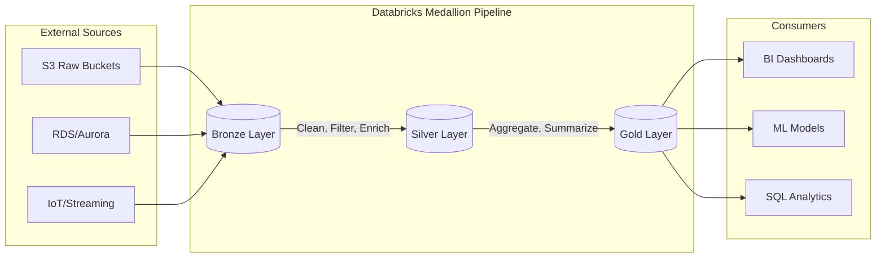

## Implementing Medallion Architecture: Bronze, Silver, and Gold Layers

### Section at a Glance
**What you'll learn:**
- The architectural purpose and business value of the Medallion pattern.
- Detailed implementation strategies for Bronze, Silver, and Gold layers.
- Data lineage and schema evolution strategies across the pipeline.
- How to optimize Delta Lake features (Upserts, Compaction) at each layer.
- Governance and security boundaries between different data quality tiers.

**Key terms:** `Delta Lake` · `Schema Enforcement` · `Data Lineage` · `ACID Transactions` · `Watermarking` · `Data Quality`

**TL;CR:** The Medallion architecture is a multi-hop data processing pattern that progressively improves data quality and structure, transforming raw, messy data into high-value, business-ready insights through structured refinement.

---

### Overview
In the modern enterprise, the primary driver of data engineering failure is not a lack of data, but a lack of *trust*. Organizations often struggle with "Data Swamps," where massive amounts of raw data are ingested into S3, but no one knows which files are complete, which columns are reliable, or which aggregates are current. This creates a massive business bottleneck: data scientists spend 80% of their time cleaning data rather than building models, and executives make decisions based on stale, inconsistent reports.

The Medallion Architecture solves this by introducing a structured, multi-stage refinement process using Delta Lake. Instead of a single, monolithic ETL job that attempts to clean and aggregate all at once, the workload is broken into discrete "hops." This separation of concerns allows for better error handling, easier debugging, and incremental processing.

For a Data Engineer on AWS, implementing this means moving from a "batch-and-forget" mindset to a "continuous refinement" mindset. You aren't just moving bytes from point A to point B; you are managing a state machine of data quality. This section explores how to leverage Databricks and Delta Lake to implement these layers to ensure that by the time data reaches the "Gold" layer, it is a single source of truth that the business can rely on for automated decision-making.

---

### Core Concepts

#### 1. The Bronze Layer (The Raw Landing Zone)
The Bronze layer is the entry point for all ingested data. Its primary purpose is to provide a permanent, immutable record of the source data.
*   **Structure:** Often mirrors the source system (JSON, CSV, Parquet). It is "schema-on-read" friendly but uses Delta Lake to provide ACID guarantees.
*   **State:** Raw, unvalidated, and potentially "dirty."
*   **Strategy:** Append-only. You rarely update Bronze; you only add new data. 
📌 **Must Know:** In a production environment, the Bronze layer should include metadata columns such as `_input_file_name`, `_processing_timestamp`, and `_source_system` to ensure full auditability.

#### 2. The Silver Layer (The Cleansed/Augmented Zone)
This is where the heavy lifting of data engineering happens. The Silver layer represents the "Single Version of the Truth."
*   **Structure:** Highly structured, often normalized or semi-normalized.
*   **Operations:** This layer involves **Schema Enforcement**, filtering out corrupt records, handling null values, and performing joins to enrich data (e.g., joining a raw transaction with a customer dimension).
*   **Data Quality:** This is where you apply "Expectations" or data quality constraints.
⚠️ **Warning:** Avoid performing complex business aggregations in Silver. If you start calculating "Monthly Active Users" in the Silver layer, you lose the ability to re-calculate that metric if the business logic changes. Keep Silver focused on *cleaning* and *joining*, not *summarizing*.

#### 3. The Gold Layer (The Curated/Aggregate Zone)
The Gold layer is the "Presentation Layer" optimized for consumption by BI tools (QuickSight, Tableau) and ML models.
*   **Structure:** De-normalized, highly aggregated, and organized into star schemas or feature stores.
*   **Use Case:** Business-level metrics (e.g., `daily_revenue_by_region`).
💡 **Tip:** The Gold layer should be read-optimized. Use Z-Ordering or Liquid Clustering on columns frequently used in `WHERE` clauses of BI dashboard filters to accelerate query performance.

---

### Architecture / How It Works



1.  **External Sources:** The origin of data, ranging from unstructured S3 files to structured AWS RDS instances.
2.  **Bronze Layer:** Receives raw ingestion via Auto Loader or Spark Streaming, preserving the original state.
3.  **Silver Layer:** Executes transformations, schema validation, and enrichment to create a reliable foundation.
4.  **Gold Layer:** Produces highly aggregated, business-ready datasets optimized for specific use cases.
5.  **Consumers:** The end-users (Analysts, Data Scientists) who interact with the refined Gold data.

---

### Comparison: When to Use What

| Feature | Bronze | Silver | Gold |
| :--- | :--- | :--- | :--- |
| **Data Quality** | Low (Raw) | High (Validated) | Highest (Aggregated) |
| **Schema** | Flexible/Raw | Strict/Enforced | Highly Structured |
| **Primary Users** | Data Engineers | Data Engineers / Scientists | Data Analysts / BI |
| **Storage Pattern** | Append-only | Upserts (Merge/Delta) | Overwrite or Append |
| **Approx. Cost Signal** | Low (Storage heavy) | Medium (Compute heavy) | High (Compute/Optimization) |

**How to choose:** Use Bronze for recovery/reprocessing, Silver for cross-functional data sharing, and Gold for specific departmental reporting needs.

---

### Cost Cheat Sheet

| Scenario | Recommended Option | Key Cost Driver | Watch Out For |
| :--- | :--- | :--- | :--- |
| **High-Volume IoT Ingestion** | Auto Loader to Bronze | S3 API Calls (LIST/GET) | Large numbers of tiny files |
| **Complex Data Cleaning** | Spark Structured Streaming | DBU (Databr_Units) for Compute | Long-running, unoptimized clusters |
| **Large Scale Historical Re-processing** | Bronze-to-Silver Batch | I/O and Shuffle | Not using Delta `VACUUM` |
| **Real-time BI Dashboards** | Gold Layer Materialized Views | Compute (Always-on clusters) | Unoptimized Z-Ordering |

💰 **Cost Note:** The single biggest cost mistake is failing to use **Auto Loader** for Bronze ingestion. Using standard `spark.read.format("csv").load()` on an S3 bucket with millions of files will cause the Spark Driver to crash or incur massive S3 LIST costs. Auto Loader uses file notification services to incrementally process only new files, significantly reducing compute and I/O costs.

---

### Service & Tool Integrations

1.  **AWS S3 & Auto Loader:**
    *   Acts as the physical storage layer.
    *   Auto Loader uses S3 Event Notifications to detect new files, providing an efficient "incremental" ingestion pattern into Bronze.
2.  **AWS Glue Data Catalog:**
    *   Provides a unified metadata layer.
    *   While Databricks has its own Unity Catalog, integrating with Glue allows other AWS services (like Athena) to query the Silver/Gold layers.
3.   **Unity Catalog (Databricks):**
    *   Provides centralized governance, lineage, and fine-grained access control across all three layers.

---

### Security Considerations

| Control | Default State | How to Enable / Strengthen |
| :--- | :--- | :--- |
| **Data Encryption** | Encrypted at rest (SSE-S3) | Use AWS KMS with Customer Managed Keys (CMK) for sensitive Gold data. |
| **Access Control** | S3 Bucket Permissions | Use **Unity Catalog** to manage row-level and column-level security. |
| **Network Isolation** | Public Internet Access | Deploy Databricks in a **VPC** with private endpoints (AWS PrivateLink). |
| **Audit Logging** | CloudTrail/S3 Logs | Enable **Databricks Audit Logs** to track who accessed which Gold table. |

---

### Performance & Cost

To optimize the Medallion architecture, you must balance the "cost of compute" against the "cost of storage and latency."

*   **The Bottleneck:** The Silver layer is often the most expensive because it involves `MERGE` operations (upserts). If your Silver layer is constantly rewriting large amounts of data, your DBU consumption will spike.
*   **The Optimization:** Use **Z-Ordering** on high-cardinally columns (like `customer_id`) in the Silver layer. This physically clusters related data together, reducing the amount of data scanned during joins.

**Example Cost Scenario:**
Imagine an ingestion pipeline processing 1TB of data daily.
*   **Inefficient Approach:** Using standard Spark batch jobs that rewrite the entire Silver table every day. **Estimated Cost: \$500/day** (due to massive I/O and compute).
*   **Optimized Approach:** Using Delta `MERGE` with Auto Loader and Z-Ordering. Only the new 1TB of data is processed and merged. **Estimated Cost: \$120/day**.

---

### Hands-On: Key Operations

First, we use Auto Loader to ingest raw JSON from S3 into our Bronze Delta table.
```python
# Incremental ingestion from S3 to Bronze using Auto Loader
(spark.readStream
  .format("cloudFiles")
  .option("cloudFiles.format", "json")
  .option("cloudFiles.schemaLocation", "s3://my-bucket/checkpoints/bronze_schema")
  .load("s3://my-bucket/raw_landing_zone/")
  .writeStream
  .format("delta")
  .option("checkpointLocation", "s3://my-bucket/checkpoints/bronze_table")
  .outputMode("append")
  .start("s3://my-bucket/bronze_table"))
```
💡 **Tip:** Always specify a `schemaLocation` when using Auto Loader; this allows Databricks to handle schema evolution (adding new columns) automatically without breaking your pipeline.

Next, we transform Bronze to Silver by filtering nulls and enforcing a schema.
```sql
-- Transforming Bronze to Silver: Cleaning and Filtering
CREATE OR REPLACE TABLE silver_sales AS
SELECT 
  transaction_id,
  CAST(customer_id AS STRING),
  CAST(amount AS DOUBLE),
  to_timestamp(transaction_time) as event_timestamp
FROM bronze_sales
WHERE transaction_id IS NOT NULL 
  AND amount > 0;
```

Finally, we create a Gold aggregate for the business.
```sql
-- Creating a Gold Table for Daily Revenue Reporting
CREATE OR REPLACE TABLE gold_daily_revenue AS
SELECT 
  date_trunc('day', event_timestamp) as sale_date,
  sum(amount) as total_revenue,
  count(transaction_id) as transaction_count
FROM silver_sales
GROUP BY 1;
```

---

### Customer Conversation Angles

**Q: Why should we pay for the extra compute to have a Silver layer instead of just querying the Raw data directly?**
**A:** While you *can* query raw data, the Silver layer acts as a "governed" layer. It removes errors, standardizes formats, and ensures that every analyst is using the same cleaned version of the truth, preventing conflicting reports.

**Q: If we are already using AWS Glue, do we really need the Medallion architecture in Databricks?**
**A:** The Medallion architecture is a design pattern, not a tool. You can implement it in Glue, but doing it in Databricks with Delta Lake allows you to use much more powerful features like ACID transactions, time travel, and much faster `MERGE` capabilities.

**$Q: Won't having three layers of data significantly increase our S3 storage costs?**
**A:** While storage volume increases slightly, the cost is offset by the massive reduction in compute costs. Because the layers are incremental, you aren't re-processing everything; you're only processing the delta, which is much more efficient.

**Q: How do we handle a situation where we discover a bug in our Silver layer logic?**
**A:** This is the beauty of the architecture. Since your Bronze layer is immutable, you can simply fix the logic in your Silver pipeline and re-run the processing from Bronze to Silver to "correct" the history.

**Q: Is the Gold layer safe for direct access by our BI tools like QuickSight?**
**A:** Absolutely. In fact, that is its intended purpose. The Gold layer is optimized for high-performance, low-latency queries for your end users.

---

### Common FAQs and Misconceptions

**Q: Can I skip the Bronze layer and go straight from Raw to Silver?**
**A:** You *can*, but it's risky. ⚠️ **Warning:** Without a Bronze layer, if your Silver transformation logic fails or you discover a bug, you have no "immutable" source to replay the data from. You'd have to go back to the original source system, which might not have the historical data available.

**Q: Does every single table in my lake need to be in all three layers?**
**A:** No. Only data that requires transformation, cleaning, or aggregation needs to move through the layers. Some simple lookup tables might go straight from Bronze to Gold.

**Q: Is the Medallion architecture only for streaming data?**
**A:** No. It works perfectly for both batch and streaming workloads. The "pattern" is about data quality evolution, not the ingestion frequency.

**Q: Does Delta Lake handle the movement between layers automatically?**
**A:** No, you must design the Spark/Databricks pipelines (using Auto Loader or Delta Live Tables) to move the data through these stages.

**Q: Is the Gold layer always de-normalized?**
**A:** Generally, yes. To maximize performance for BI tools, you want to minimize the number of joins required at query time.

---

### Exam & Certification Focus
*   **Data Engineering Associate Exam (Domain: Data Processing):**
    *   Identifying which layer (Bronze, Silver, or Gold) a specific transformation (e.g., aggregation, cleaning, or ingestion) belongs to. 📌 **Must Know**
    *   Understanding the use of `Auto Loader` for Bronze ingestion.
    *   Recognizing the role of `Delta Lake` in maintaining ACID properties across the layers.
    *   Implementing `Schema Enforcement` vs. `Schema Evolution` within the Silver layer.

---

### Quick Recap
- **Bronze:** Immutable, raw, and serves as the "system of record" for recovery.
- **Silver:** The "Single Version of Truth" where cleaning, filtering, and enrichment occur.
- **Gold:** The "Presentation Layer" optimized for BI and high-level business aggregates.
- **Efficiency:** Use Auto Loader for Bronze and Z-Ordering for Silver/Gold to manage costs.
- **Reliability:** The multi-hop approach allows for error isolation and data replayability.

---

### Further Reading
**Databricks Whitepaper** — The Definical guide to the Medallion Architecture.
**Delta Lake Documentation** — Deep dive into ACID transactions and Schema Enforcement.
**AWS Architecture Center** — Reference architectures for Data Lakes on AWS.
**Databricks Auto Loader Guide** — Best practices for incremental file ingestion.
**Delta Live Tables (DLT) Documentation** — How to automate the Medallion pipeline using declarative SQL/Python.