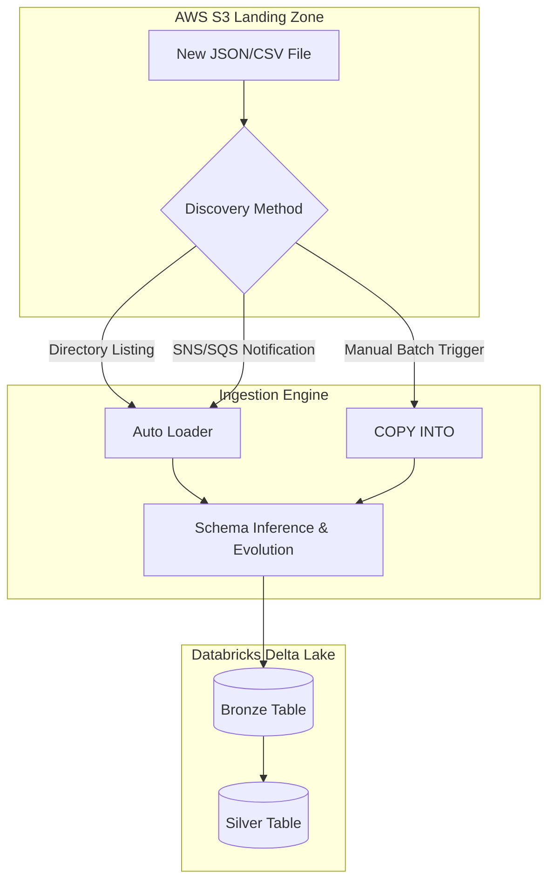

## Efficient Data Ingestion with Auto Loader and COPY INTO

### Section at a Glance
**What you'll learn:**
- Distinguishing between stream-based ingestion (Auto Loader) and batch-based ingestion (COPY INTO).
- Implementing Schema Evolution and Schema Inference to handle changing source data.
- Optimizing S3-to-Delta ingestion for high-frequency, small-file scenarios.
- Architecting scalable Bronze-layer ingestion pipelines on AWS.
- Managing cost and performance trade-offs in large-scale data movement.

**Key terms:** `Auto Loader` · `COPY INTO` · `Schema Evolution` · `Cloud Files` · `Checkpointing` · `Idempotency`

**TL;DR:** Master the two primary Databricks methods for moving data from AWS S3 into Delta Lake, choosing between the continuous, schema-aware intelligence of Auto Loader and the simplified, SQL-centric batch processing of COPY INTO.

---

### Overview
In the modern data estate, the "Ingestion Gap" is a primary driver of technical debt. Organizations often struggle with the "small file problem" or the "schema drift nightmare," where upstream changes in S3-based landing zones break downstream ETL pipelines, causing operational outages and costly manual interventions. For a Data Engineer, the challenge isn't just moving bytes; it is moving bytes *reliably* without knowing exactly what the next file will look like.

This section focuses on the two Databricks-native solutions designed to bridge this gap: **Auto Loader** and **COPY INTO**. Auto Loader is built for the "always-on" mindset, providing a scalable, stream-based approach to ingesting files as they arrive in S3. Conversely, `COPY INTO` offers a declarative, SQL-friendly way to perform periodic batch loads.

Understanding when to leverage the continuous intelligence of Auto Loader versus the administrative simplicity of `COPY INTO` is critical for building a Medallion Architecture that is both cost-effective and resilient. We will move beyond simple "how-to" and look at the architectural implications of each choice on your AWS bill and your team's on-call rotation.

---

### Core Concepts

#### 1. Auto Loader (`cloudFiles`)
Auto Loader is a feature of Structured Streaming that incrementally processes new data files as they arrive in S3.
*   **Schema Inference & Evolution:** Auto Loader can automatically detect the schema of incoming files. 
    > 📌 **Must Know:** When a new column appears in an S3 file, Auto Loader can update the schema of your Delta table without crashing the pipeline, provided you enable `mergeSchema`.
*   **File Discovery Modes:**
    *   **Directory Listing:** Scans the S3 bucket. Efficient for smaller datasets.
    *    **File Notification:** Uses AWS SNS/SQS to notify Databricks of new files. This is the gold standard for high-scale, high-velocity ingestion.
    > ⚠️ **Warning:** Relying on Directory Listing for buckets with millions of files can lead to significant latency and increased S3 `LIST` request costs.
*   **Checkpointing:** Maintains state in a persistent directory (S3). This ensures **idempotency**—if a cluster restarts, it knows exactly where it left off.

#### 2. COPY INTO
`COPY INTO` is a SQL command used for idempotent, batch-based ingestion from S3 into Delta tables.
*   **Idempotency:** It tracks which files have already been processed using a built-in metadata log.
*   **Simplicity:** It requires no streaming infrastructure or complex Spark configurations; it is a single SQL statement.
*   **Statelessness:** Unlike Auto Loader, it does not require a checkpoint directory, making it easier to manage via standard SQL orchestration tools (like dbt or Airflow).

#### 3. Schema Drift Management
Schema drift occurs when the source data structure changes. 
*   **Auto Loader** handles this via `cloudFiles.schemaEvolutionMode`.
*   **COPY INTO** requires more manual intervention or a pre-defined schema, though it can handle some basic evolution if the target is Delta.

---

### Architecture / How It Segment Works



1.  **AWS S3 Landing Zone:** The source of truth where raw, unstructured, or semi-structured files arrive.
2.  **Discovery Method:** The mechanism (polling vs. notifications) used to identify new data.
3.  **Ingestion Engine:** The compute layer (Spark) that parses the raw bytes, applies schema logic, and handles the transformation.
4.  **Bronze Table:** The destination Delta table acting as the permanent, immutable record of the raw data.

---

### Comparison: When to Use What

| Option | Best For | Trade-offs | Approx. Cost Signal |
| :--- | :--- | :--- | :--- |
| **Auto Loader** | High-frequency, continuous, or unpredictable file arrivals. | Requires a running cluster/job (Streaming). | Higher (Compute uptime). |
/ **COPY INTO** | Scheduled, batch-driven workloads (e.g., nightly ETL). | Not "real-time"; requires manual triggers. | Lower (Compute on-demand). |
| **Standard Spark `read`** | One-time migrations or static datasets. | No built-in tracking; will re-process everything every time. | High (Wasteful re-computation). |

**How to choose:** If your business requirement is "near real-time" (seconds to minutes), use **Auto Loader**. If your requirement is "the dashboard must be ready by 8 AM," use **COPY INTO**.

---

### Cost Cheat Sheet

| Scenario | Recommended Option | Key Cost Driver | Watch Out For |
| :--- | :--- | :--- | :--- |
| **Massive S3 Buckets (>1M files)** | Auto Loader (File Notification) | AWS SNS/SQS & S3 Event costs. | 💰 **The "List" Tax:** Avoid Directory Listing on huge buckets. |
| **Low Volume, Periodic Data** | COPY INTO | Cluster start/stop duration. | Using a heavy cluster for a small SQL task. |
  **Extreme Schema Volatility** | Auto Loader | Schema evolution processing overhead. | Massive number of small columns. |
| **High Velocity (Thousands of files/min)** | Auto Loader (Streaming) | Continuous compute (DBU) consumption. | Unbounded streaming with no backpressure management. |

> 💰 **Cost Note:** The single biggest cost mistake is running a continuous Auto Loader cluster 24/7 for a data source that only arrives once an hour. Use `Trigger.AvailableNow` in Auto Loader to get streaming benefits with batch-like cost profiles.

---

### Service & Tool Integrations

1.  **AWS SNS/SQS + Auto Loader:**
    *   Configure S3 Event Notifications to push to an SQS queue.
    *   Configure Auto Loader to use `cloudFiles.useNotifications = true`.
    *   Result: Zero-latency discovery without scanning the whole bucket.
2.  **AWS Glue/Lambda + COPY INTO:**
    *   Use a Lambda function to trigger a Databricks SQL Warehouse task once an ETL process completes.
    *   Result: Orchestrated, event-driven batch pipelines.
3.  **dbt (data build tool) + COPY INTO:**
    *   Wrap `COPY INTO` statements within dbt models to maintain lineage and testing.

---

### Security Considerations

| Control | Default State | How to Enable / Strengthen |
| :--- | :--- | :--- |
| **IAM Authentication** | Identity-based | Use **Instance Profiles** or **Unity Catalog** credential Passthrough to limit S3 access. |
| **Encryption at Rest** | S3-Managed (SSE-S3) | Use **AWS KMS** (SSE-KMS) for customer-managed keys (CMK) to satisfy compliance. |

| **Data Isolation** | Shared Access | Use **Unity Catalog** to enforce fine-grained access control on the Bronze tables. |

---

### Performance & Cost

**Tuning Guidance:**
*   **File Size:** Aim for files in the 128MB–1GB range. If your source generates millions of 1KB files, use Auto Loader to "compact" them during the move to Bronze.
*   **The `AvailableNow` Pattern:** This is the "holy grail" for cost. It processes all new data since the last run and then shuts down the cluster.

**Cost Scenario Example:**
*   **Scenario:** A 24/7 Streaming Cluster for 10 files/day.
*   **Cost:** ~$30/day in DBUs (assuming small cluster).
*   **Alternative:** An `AvailableNow` job running 3 times a day.
*   **Cost:** ~$2/day in DBUs.
*   **Impact:** 93% reduction in compute cost with minimal latency impact.

---

### Hands-On: Key Operations

**Setting up Auto Loader with Schema Inference (Python):**
This script initializes an Auto Loader stream that automatically detects the schema of incoming JSON files.
```python
df = (spark.readStream
  .format("cloudFiles")
  .option("cloudFiles.format", "json")
  .option("cloudFiles.schemaLocation", "s3://my-bucket/checkpoints/schema")
  .load("s3://my-bucket/raw-data/"))

(df.writeStream
  .option("checkpointLocation", "s3://my-bucket/checkpoints/data")
  .trigger(availableNow=True) # Use AvailableNow for cost efficiency
  .toTable("bronze_table"))
```
> 💡 **Tip:** Always point `schemaLocation` to a persistent S3 path. If you lose this, Auto Loader loses its "memory" of the schema.

**Executing a Batch Load with COPY INTO (SQL):**
This SQL command incrementally loads data from a specific S3 folder into a Delta table.
```sql
COPY INTO bronze_table
FROM 's3://my-schema-bucket/landing-zone/'
FILEFORMAT = CSV
FORMAT_OPTIONS ('header' = 'true', 'inferSchema' = 'true')
COPY_OPTIONS ('mergeSchema' = 'true');
```
> 💡 **Tip:** `COPY INTO` is much easier to use for analysts who are comfortable with SQL but not Python/Scala.

---

### Customer Conversation Angles

**Q: We have millions of files arriving in S3 every hour. Won't scanning the bucket every time break the bank?**
**A:** Not if we use Auto Loader with File Notifications. By integrating S3 with AWS SNS/SQS, we only process files as they are explicitly announced, avoiding expensive and slow bucket listings.

**Q: Our upstream team keeps adding columns to their JSON files without telling us. How do we stop our pipelines from crashing?**
**A:** We should implement Auto Loader with Schema Evolution enabled. It will automatically detect the new columns and update our Bronze table schema without manual intervention.

**Q: Can we use `COPY INTO` for real-time streaming?**
**A:** No, `COPY INTO` is designed for batch workloads. For real-time or near-real-time needs, Auto Loader is the correct architectural choice.

**Q: How do I ensure that if a job fails halfway through, we don't get duplicate data?**
**A:** Both Auto Loader and `COPY INTO` are inherently idempotent. They use metadata logs and checkpoints to track which files have already been processed, so a retry will only pick up the "new" or "missing" files.

**Q: Is Auto Loader more expensive than `COPY INTO`?**
**A:** It depends on your frequency. For 24/7 streaming, yes, because you are paying for continuous compute. However, by using the `AvailableNow` trigger, we can get the intelligence of Auto Loader with the cost profile of a batch job.

---

### Common FAQs and Misconceptions

**Q: Does Auto Loader work with all file formats?**
**A:** It supports all major formats: JSON, CSV, Parquet, Avro, ORC, and Text.
> ⚠️ **Warning:** It does *not* support proprietary or highly complex formats like Excel or encrypted binary blobs without custom logic.

**Q: If I delete the checkpoint folder, will it re-process all data?**
**A:** Yes. The checkpoint is the "memory" of the stream. Deleting it makes the stream think it is starting from scratch.

**Q: Is `COPY INTO` basically just a wrapper for `spark.read`?**
**A:** No. Unlike `spark.read`, `COPY INTO` has built-in state management to track which files have already been loaded, preventing duplicates.

**Q: Can Auto Loader handle schema changes if I'm using `AvailableNow`?**
**A:** Absolutely. `AvailableNow` is simply a trigger mode; the underlying engine still utilizes all the schema-handling capabilities of Auto Loader.

**Q: Do I need to manage an SQS queue myself for Auto Loader notifications?**
**A:** You need to *configure* the S3-to-SQS notification, but Databricks handles the heavy lifting of consuming those messages.

---

### Exam & Certification Focus
*   **Domain: Data Processing (Data Engineering Associate)**
    *   Identify the difference between `cloudFiles` (Auto Loader) and `COPY INTO` (Domain: Ingestion).
    *   Understand **Schema Evolution** vs. **Schema Enforcement** (Domain: Data Integrity).
    *   Know the mechanism for **File Discovery** (Directory Listing vs. Notifications) (Domain: Performance Optimization).
    *   📌 **High Frequency:** Using `trigger(availableNow=True)` to balance cost and functionality.

---

### Quick Recap
- **Auto Loader** is for continuous or frequent, intelligent, schema-aware ingestion.
- **COPY INTO** is for simple, declarative, SQL-based batch loading.
- **File Notifications** are essential for high-scale S3 ingestion to avoid `LIST` costs and latency.
- **Idempotency** is a native feature of both tools, preventing duplicate data on retries.
- **Schema Evolution** is the key to building resilient, "self-healing" data pipelines.

---

### Further Reading
**Databricks Documentation** — Deep dive into Auto Loader configuration and options.
**AWS Documentation** — Understanding S3 Event Notifications for high-scale architecture.
**Delta Lake Whitepaper** — Understanding the underlying transaction log that enables `COPY INTO` idempotency.
**Databricks Academy** — Hands-on labs for building Medallion Architecture pipelines.
**Databricks Blog** — Case studies on optimizing cost with `AvailableNow` patterns.