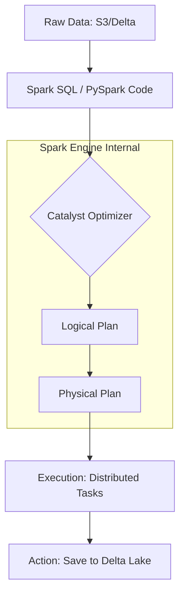

## Data Transformation with Spark SQL and PySpark

### Section at a Glance
**What you'll learn:**
- The fundamental difference between Transformations and Actions in the Spark lifecycle.
- How to leverage the Spark SQL engine and the PySpark DataFrame API for complex ETL.
- Implementing advanced analytical patterns using Window functions and Aggregations.
- Identifying and mitigating "The Shuffle"—the primary driver of distributed computing costs.
- Optimizing performance by replacing Python UDFs with native Spark functions.

**Key terms:** `DataFrame` · `Lazy Evaluation` · `Catalyst Optimizer` · `Shuffle` · `Window Function` · `Action`

**TL;DR:** Data transformation is the process of converting raw, unstructured data into business-ready insights using Spark's distributed engine; success depends on understanding how to write code that minimizes data movement (shuffling) across the cluster.

---

### Overview
In modern data engineering, the "Data Swamp" problem is a significant business risk. Companies ingest massive amounts of data from AWS S3, but without a robust transformation layer, this data remains "dark"—unusable for BI, Machine Learning, or regulatory reporting. The transformation layer (typically the Silver and Gold layers of a Medallance Architecture) is where raw noise is converted into signal.

The challenge for the enterprise is scale. Traditional ETL tools often fail when data volume exceeds a single machine's memory. Spark SQL and PySpark solve this by distributing the workload across a cluster of AWS EC2 instances. This allows engineers to perform complex joins, aggregations, and filters on petabytes of data by breaking the work into small, manageable tasks.

For a Data Engineer, mastering these transformation techniques is not just about writing syntax; it is about managing computational complexity. A poorly written transformation can lead to "out of memory" (OOM) errors or astronomical AWS bills due to excessive network I/O. This section provides the technical depth required to build pipelines that are both performant and cost-effective.

---

### Core Concepts

#### 1. The Execution Model: Transformations vs. Actions
Spark operates on a principle of **Lazy Evaluation**. When you write a transformation (e.g., `.filter()`, `.select()`, `.join()`), Spark does not execute it immediately. Instead, it builds a **Logical Plan**.

*   **Transformations:** Operations that create a new DataFrame from an existing one. They are "lazy" because they only record the instructions.
*   **Actions:** Operations that trigger the actual computation and return a result to the driver or write data to storage (e.g., `.count()`, `.collect()`, `.save()`).

> ⚠️ **Warning:** A common mistake is performing an `.collect()` on a large dataset. This pulls all distributed data into the memory of the single Driver node, almost certainly leading to an Out-of-Memory error and pipeline failure.

#### 2. The Catalyst Optimizer
When an **Action** is called, Spark passes your code through the **Catalyst Optimizer**. This engine performs rule-based and cost-based optimizations, such as **Predicate Pushdown** (filtering data at the source before reading it into memory) and **Column Pruning** (reading only the columns needed).

📌 **Must Know:** The efficiency of your Spark SQL or PyFX code is often determined by how much work the Catalyst Optimizer can do to "prune" the workload before execution begins.

#### 3. Data Shuffling: The Performance Killer
**Shuffling** occurs when data needs to be redistributed across the cluster to perform operations like `groupBy` or `join`. This involves writing data to disk and moving it over the network.

> 💰 **Cost Note:** Excessive shuffling is the #1 driver of high Databricks costs. High network I/O increases the duration of your cluster's uptime, directly inflating your AWS instance spend.

#### 4. Window Functions
Window functions allow you to perform calculations across a set of rows that are related to the current row (e.g., calculating a running total or a 7-day moving average) without collapsing the rows into a single output, unlike a standard `groupBy`.

#### 5. User Defined Functions (UDFs)
A UDF allows you to write custom Python logic to transform data. 
> ⚠️ **Warning:** Standard Python UDFs are a "black box" to the Catalyst Optimizer. Spark cannot see inside the Python code, meaning it cannot optimize it, and it often requires expensive data serialization between the JVM and the Python runtime.

---

/

/

1.  **Raw Data:** The input source, typically stored in AWS S3 in Parquet or Delta format.
2.  **Spark Code:** The developer's instructions written in PySpark or SQL.
3.  **Catalyst Optimizer:** The brain of Spark that optimizes the execution path.
4.  **Logical Plan:** An abstract representation of *what* needs to be done.
5.  **Physical Plan:** The actual, optimized strategy of *how* to do it (e.le., which join algorithm to use).
6.  **Execution:** The distributed task execution across the worker nodes.
7.  **Action:** The final step that writes the result back to permanent storage.

---

### Comparison: When to Use What

| Option | Best For | Trade-offs | Approx. Cost Signal |
| :--- | :--- | :--- | :--- |
| **Spark SQL** | Analysts & Standard ETL | Highly optimized; easy to read/audit. | Low (Most efficient) |
/
| **PySpark (Native API)** | Complex, Programmatic ETL | Best for dynamic logic and iterative loops. | Low |
| **Python UDFs** | Extremely niche/complex logic | **High overhead**; breaks optimization. | High (Compute intensive) |
| **Pandas UDFs (Vectorized)** | Applying ML/Complex Math | Faster than standard UDFs; uses Arrow. | Medium |

**Decision Framework:** Always start with **Spark SQL** or the **Native PySpark API**. Only move to **Pandas UDFs** if a native function doesn't exist, and avoid standard **Python UDFs** unless there is no other mathematical possibility.

---

### Cost Cheat Sheet

| Scenario | Recommended Option | Key Cost Driver | Watch Out For |
| :--- | :--- | :--- | :--- |
| **Large-scale Joins** | Broadcast Join (if one table is small) | Network Shuffle | Data Skew (one node doing all the work) |
| **Aggregating Logs** | Predicate Pushdown (Filter early) | S3 Data Scanning | Reading unnecessary columns/rows |
| **Complex Math/ML** | Pandas UDF (Vectorized) | CPU/Memory overhead | Large-scale serialization |
| **Incremental Updates** | Delta Lake `MERGE` | Disk I/O and rewriting | Frequent small commits (small file problem) |

> 💰 **Cost Note:** The single biggest cost mistake is **Data Skew**. If 90% of your data belongs to one "Key" (e.g., a single large customer ID), one worker node will work significantly longer than the others, keeping your entire cluster active and billing while that one node struggles.

---

### Service & Tool Integrations

1.  **AWS Glue Data Catalog:** Acts as the central metadata repository. Spark SQL uses this catalog to resolve table names to S3 paths.
2.  **Delta Lake:** The storage layer that provides ACID transactions. Transformation logic (like `MERGE`) relies on Delta's transaction log.

3.  **Unity Catalog:** Provides fine-grained access control. Transformations must be performed within the context of a secured catalog to ensure data governance.
4.  **Amazon S3:** The underlying object store. Efficient transformations utilize S3's high throughput via partitioned data structures.

---

### Security Considerations

| Control | Default State | How to Enable / Strengthen |
| :--- | :--- | :--- |
| **Data Encryption (At Rest)** | Encrypted via S3-KMS | Ensure Databricks clusters use customer-managed keys (CMK). |
| **Data Access (RBAC)** | Broad access within workspace | Use **Unity Catalog** to implement row/column level security. |
| **Network Isolation** | Public/Private access depends on VPC | Deploy Databricks in a **Customer-managed VPC** with no public IP. |
| **Audit Logging** | Standard workspace logs | Enable **AWS CloudTrail** and Databricks Audit Logs for all transformations. |

---

### Performance & Cost

**The "Expensive Join" Example:**
Imagine a join between a `Sales` table (10 TB) and a `Products` table (100 MB).

*   **Scenario A (Standard Join):** Spark performs a "Sort-Merge Join." Both tables are shuffled across the network.
    *   *Cost Impact:* High. Massive network egress/ingress and high disk I/O.
*   **Scenario B (Broadcast Join):** You hint to Spark to `broadcast(products)`. The 100 MB table is sent to *every* worker node.
    *   *Cost Impact:* Low. No shuffling of the 10 TB table. The transformation completes in minutes instead of hours.

**Tuning Guidance:**
*   **Partitioning:** Ensure your data is partitioned by a high-cardinality key (e.g., `date` or `region`) to allow Spark to skip unnecessary files.
*   **Caching:** Use `.cache()` only for DataFrames that are reused multiple times in the *same* action pipeline. Over-caching consumes executor memory and triggers disk spilling.

---

### Hands-On: Key Operations

**1. Filtering and Selecting (The "Pruning" Step)**
This reduces the volume of data being processed early in the pipeline.
```python
# Filter for high-value orders and select only necessary columns
df_filtered = df.filter(df.order_value > 1000) \
                .select("order_id", "customer_id", "order_date")
```
> 💡 **Tip:** Always place `.filter()` as early as possible in your code to reduce the data volume being passed to subsequent transformations.

**2. Performing a Broadcast Join**
This avoids the expensive shuffle of the large dataset.
```python
from pyspark.sql.functions import broadcast

# Assuming 'large_sales_df' is 1TB and 'small_dim_df' is 50MB
enriched_df = large_saled_df.join(broadcast(small_dim_df), "product_id")
```

**3. Using Window Functions for Analytics**
This calculates a running total without losing individual row granularity.
```python
from pyspark.sql.window import Window
from pyspark.sql.functions import sum as _sum

# Define window: partition by customer, order by date
window_spec = Window.partitionBy("customer_id").orderBy("order_date")

# Calculate cumulative spend per customer
df_running_total = df.withColumn("cumulative_spend", _sum("order_value").over(window_spec))
```

---

### Customer Conversation Angles

**Q: "We have a lot of Python logic in our current Glue jobs. Will moving to Databricks be a performance hit?"**
**A:** Not necessarily. If your logic uses Python UDFs, moving to Databricks actually gives you a massive opportunity to optimize by rewriting those UDFs into native Spark SQL, which can result in 10x performance gains.

**Q: "How can we control the monthly AWS spend on our Databricks transformation pipelines?"**
**A:** We focus on two areas: implementing Broadcast Joins to eliminate network shuffling and utilizing Delta Lake's features to avoid full table rewrites, which reduces both compute time and S3 I/O costs.

**Q: "Is it better to use PySpark or Spark SQL for our data engineering team?"**
**A:** It's not an 'either/or.' Use Spark SQL for standard, readable ETL logic that analysts can audit, and use PySpark when you need to build dynamic, programmatic pipelines that require complex control flow.

**Q: "Can Databricks handle our data privacy requirements (GDPR/CCPA) during transformations?"**
**A:** Yes. By using Unity Catalog, we can apply fine-grained access control and masking directly within your transformation logic, ensuring sensitive data is never visible to unauthorized users.

---

### Common FAQs and Misconceptions

**Q: Does Spark execute transformations as soon as I write the code?**
**A:** No. Spark uses lazy evaluation; it only builds a plan. Execution only happens when an **Action** is called.
> ⚠️ **Warning:** If you don't see any errors in your code but the data isn't appearing in your destination, check if you actually called an Action (like `.write()`).

**Q: Is a Python UDF as fast as a native Spark function?**
**A:** No. Python UDFs are significantly slower because data must be moved between the Spark JVM and the Python process.

**Q: Does more RAM always mean faster Spark jobs?**
**A:** Not always. If your problem is "Data Skew" or "Network Shuffle," adding RAM won't help; you need to optimize your join strategies or partitioning.

**Q: Can I use Pandas code directly on a large Spark DataFrame?**
**A:** You cannot run standard Pandas on a distributed DataFrame without bringing it all to the driver (which causes OOM). You must use **Pandas UDFs (Vectorized UDFs)** which use Apache Arrow to process data in chunks.

---

### Exam & Certification Focus
*   **Domain: Data Processing**
    *   Distinguishing between Transformations and Actions. 📌
    *   Identifying the impact of Shuffling on cluster performance. 📌
    *   Selecting the correct Join strategy (Broadcast vs. Sort-Merge).
    *   Recognizing the benefits of Predicate Pushdown and Column Pruning.
    *   Applying Window functions for analytical transformations.

---

### Quick Recap
- **Lazy Evaluation** means Spark optimizes the entire pipeline before running a single task.
- **Shuffling** is the most expensive operation in a distributed cluster; minimize it at all costs.
- **The Catalyst Optimizer** is your best friend for making declarative SQL code performant.
- **Native Spark functions** should always be preferred over **Python UDFs** to avoid serialization overhead.
- **Effective Partitioning** and **Broadcasting** are the primary levers for controlling AWS costs in Databricks.

---

### Further Reading
**[Databricks Documentation]** — Detailed API reference for PySpark DataFrame operations.
**[Apache Spark Guide]** — Deep dive into the internals of the Catalyst Optimizer and Tungsten engine.
**[Delta Lake Documentation]** — Best practices for ACID transactions and the `MERGE` command.
**[AWS Whitepaper: Data Lakes on AWS]** — Architectural patterns for building scalable ETL pipelines.
**[Databricks Best Practices]** — Industry-standard patterns for performance tuning and cost management.