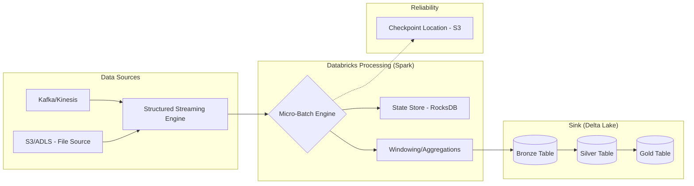

## Stream Processing with Structured Streaming

### Section at a Glance
**What you'll learn:**
- The fundamental difference between batch and stream processing in the Delta Lake ecosystem.
- How to implement the "Medallion Architecture" using continuous streaming.
- Managing stateful vs. stateless transformations in Spark.
- Handling late-arriving data using Watermarking.
- Implementing exactly-once processing guarantees for mission-critical pipelines.

**Key terms:** `Micro-batching` · `Watermarking` · `Checkpointing` · `Trigger Interval` · `Windowing` · `Delta Live Tables (DLT)`

**TL;DR:** Structured Streaming treats a live stream as an unbounded table, allowing you to use the same SQL and DataFrame APIs for both real-time and batch workloads to achieve low-latency data pipelines.

---

### Overview
In the modern enterprise, the value of data decays rapidly. A fraud detection system cannot wait for a nightly batch job; a logistics dashboard cannot wait for an hourly refresh. The business pain is "latency-induced blindness"—making decisions based on what happened an hour ago rather than what is happening *now*.

Historically, organizations had to maintain two separate codebases: one for high-speed streaming (e.MM., Apache Flink or Storm) and one for batch processing (e.MM., Spark or Glue). This "Lambda Architecture" created massive operational overhead, as logic had to be written, tested, and debugged twice.

Structured Streaming on Databricks solves this by providing a unified API. It treats the stream as a continuously growing table. This allows data engineers to apply the same business logic, transformations, and quality checks to both historical data and real-time feeds. By integrating this with Delta Lake, we achieve a "Kappa Architecture," where a single pipeline handles all data velocity needs, significantly reducing the Total Cost of Ownership (TCO) and engineering complexity.

---

### Core Concepts

**1. The Unbounded Table Model**
Structured Streaming views a stream as an unbounded table that is being appended to continuously. When you run a query, you are essentially performing an incremental computation on the new rows arriving in the table.

**2. Micro-batching vs. Continuous Processing**
*   **Micro-batching (Default):** Spark processes data in small, discrete chunks (batches) at a set interval. This provides high throughput and robust fault tolerance.
*   **Continuous Processing:** A low-latency mode designed for sub-millably latency, though it offers fewer supported operations. 
> ⚠️ **Warning:** Do not assume "Continuous Processing" is always better. It significantly limits the types of complex transformations (like certain aggregations) you can perform compared to micro-batching.

**3. Checkpointing and Fault Tolerance**
Checkpointing is the mechanism that allows a stream to recover after a failure. It saves the progress (the "offset") of the stream to a reliable storage location (S3).
📌 **Must Know:** If you lose your checkpoint directory, your stream will treat the entire history of the stream as "new" data, leading to massive duplicates in your target Delta table.

**4. Watermarking (Handling Late Data)**
In real-world IoT or mobile app scenarios, data often arrives out of order due to network latency. **Watermarking** tells the engine how long to wait for late data before discarding it from the state.
> 💡 **Tip:** Setting a watermark too low results in data loss (late data is dropped); setting it too high causes "state explosion," where the engine keeps too much data in memory, leading to OOM (Out of Memory) errors.

**5. Windowing**
Windowing allows you to group data into time-based buckets (e.g., "every 5 minutes"). This is essential for calculating moving averages or detecting spikes in real-time.

---

### Architecture / How It Works



1.  **Data Sources:** The entry point where unstructured or semi-structured data (events, logs, sensor readings) originates.
2.  **Micro-Batch Engine:** The orchestration layer that triggers a new Spark job for every interval.
3.  **State Store:** A specialized storage layer (often using RocksDB) that tracks information across batches, such as running totals or windowed counts.
4.  **Checkpoint Location:** The "brain" of the stream, stored in S3, which records the exact offset of the last processed record to ensure exactly-once semantics.
5.  **Delta Lake Sinks:** The destination where the processed data is written as a permanent, versioned, and ACID-compliant table.

---

### Comparison: When to Use What

| Option | Best For | Trade-offs | Approx. Cost Signal |
| :--- | :--- | :--- | :--- |
| **Micro-batching** | Most ETL, aggregations, and standard business logic. | Higher latency (seconds to minutes). | Moderate (standard cluster usage). |

| **Continuous Processing** | Ultra-low latency-sensitive alerts (sub-second). | Limited SQL operations; lower throughput. | High (requires "always-on" compute). |

**How to choose:** Use **Micro-batching** as your default. Only move to **Continuous Processing** if your business use case (e.g., high-frequency trading or real-time security blocking) explicitly demands sub-second latency and you can handle the reduced transformation complexity.

---

### Cost Cheat Sheet

| Scenario | Recommended Option | Key Cost Driver | Watch Out For |
| :--- | :--- | :--- | :--- |
| **High Volume IoT** | Micro-batching with Auto Loader | Number of files/records processed. | Excessive small files (use `cloudFiles.maxFilesPerTrigger`). |
| **Real-time Dashboard** | Continuous Processing | Cluster uptime (24/7 compute). | Costly if the data volume is low/intermittent. |
| **Periodic Aggregates** | Trigger Once / AvailableNow | Compute duration per run. | Not "real-time"; data lags. |
| **Complex Windowing** | Micro-batching + RocksDB | State Store size/Disk I/O. | Memory pressure on the driver node. |

> 💰 **Cost Note:** The single biggest cost mistake in streaming is failing to use **Trigger.AvailableNow**. Using a continuous stream for data that only arrives in bursts keeps a cluster running 24/7, charging you for idle time. Use `AvailableNow` to process all available data and then shut down the cluster.

---

### Service & Tool Integrations

1.  **AWS Kinesis / Confluent Kafka:** Acting as the "Source," these services provide the durable buffer for high-velocity event streams.
2.  **Databricks Auto Loader:** A specialized feature of Structured Streaming that incrementally processes new files in S3 without manual directory listing.

3.  **Delta Live Tables (DLT):** An orchestration layer that wraps Structured Streaming with built-in monitoring, data quality (Expectations), and automated infrastructure management.
4.  **Amazon S3:** Serves as both the source for file-based streams and the permanent storage for both the Delta tables and the Stream Checkpoints.

---

### Security Considerations

| Control | Default State | How to Enable / Strengthen |
| :--- | :--- | :--- |
| **Data Encryption** | Encrypted at rest (S3-SSE). | Use AWS KMS with Customer Managed Keys (CMK) for granular control. |
| **Access Control** | IAM Roles/Unity Catalog. | Implement Unity Catalog to manage fine-grained permissions on streaming tables. |
| **Network Isolation** | Public Internet (unless configured). | Deploy Databricks in a private VPC with no public IP; use VPC Endpoints for S3. |
| **Audit Logging** | Enabled via CloudTrail. | Enable Databricks Audit Logs to track who accessed/modified the stream. |

---

### Performance & Cost

To optimize performance, you must manage the **Micro-batch duration**. 
*   **Too Short:** You spend more time on "overhead" (scheduling tasks) than doing actual work.
*   **Too Long:** Your data latency increases, and you risk "backpressure" where the stream cannot keep up with the incoming rate.

**Example Cost/Performance Scenario:**
Imagine an IoT stream producing 1GB of data per hour.
*   **Scenario A (Continuous):** You run a 4-node cluster 24/7. Cost: ~$15/hour * 24 = **$360/day**.
*   **Scenario B (Trigger.AvailableNow):** You run a 4-node cluster for 15 minutes every hour. Cost: ~$15/hour * (0.25 * 24) = **$90/day**.
*   **Result:** A **75% cost reduction** with an acceptable latency trade-off for most business use cases.

---

### Hands-On: Key Operations

**1. Setting up an Auto Loader stream to ingest JSON from S3.**
This code uses `cloudFiles` to incrementally ingest data as it arrives in S3.
```python
df = (spark.readStream
  .format("cloudFiles")
  .option("cloudFiles.format", "json")
  .option("cloudFiles.schemaLocation", "/mnt/checkpoints/schema")
  .load("/mnt/raw-data/incoming/"))

(df.writeStream
  .format("delta")
  .option("checkpointLocation", "/mnt/checkpoints/bronze_table")
  .trigger(availableNow=True)
  .start("/mnt/delta/bronze_table"))
```
> 💡 **Tip:** Always use `schemaLocation` with Auto Loader. It enables **Schema Evolution**, allowing your pipeline to adapt when new columns are added to your JSON files without crashing.

**2. Implementing a Windowed Aggregation with Watermarking.**
This code calculates the count of events per 10-minute window, allowing data to be up to 2 hours late.
```python
from pyspark.sql.functions import window, col

windowedCounts = (df.withWatermark("event_timestamp", "2 hours")
  .groupBy(
    window(col("event_timestamp"), "10 minutes"),
    col("device_id"))
  .count())

(windowedCounts.writeStream
  .outputMode("append")
  .format("delta")
  .option("checkpointLocation", "/mnt/checkpoints/windowed_counts")
  .start("/mnt/delta/windowed_counts_table"))
```
> ⚠️ **Warning:** When using `window`, you must use `.outputMode("append")` or `"complete"`. Using `"append"` with watermarking is highly efficient because Spark can drop old state once the watermark passes the window end.

---

### Customer Conversation Angles

**Q: We currently have a Batch pipeline and a Streaming pipeline for the same data. Can we merge them?**
**A:** Absolutely. By using Structured Streaming, you can use the exact same code for both. You simply change the "Trigger" interval, which reduces your maintenance burden and ensures logic consistency.

**Q: How do I know if my stream is falling behind (backpressure)?**
**A:** You should monitor the `inputRate` vs. `processRate` metrics in the Spark UI or via Databrics SQL. If `inputRate` consistently exceeds `processRate`, you need to scale your cluster or optimize your transformations.

**Q: What happens if the cluster restarts in the middle of a stream?**
**A:** As long as you have configured a `checkpointLocation` on S3, the new cluster will read the offset from the checkpoint and resume exactly where the previous one left off, ensuring no data is lost or duplicated.

**Q: Can we use Structured Streaming to feed our PowerBI dashboards?**
**A:** Yes. By writing the stream to a Delta table, PowerBI can query that table. For "near real-time" feel, you can set the dashboard to refresh at intervals matching your stream's micro-batch frequency.

**Q: Is it expensive to run a stream 24/7?**
**A:** It can be. If your data volume is low, I recommend using `Trigger.AvailableNow` to run the stream on a schedule. This gives you the benefits of streaming (schema evolution, incremental processing) without the cost of 24/7 compute.

---

### Common FAQs and Misconceptions

**Q: Does Structured Streaming guarantee that every record is processed exactly once?**
**A:** It guarantees **exactly-once semantics** *end-to-end*, provided that your source is replayable (like Kafka or S3) and your sink is an ACID-compliant store like Delta Lake.
> ⚠️ **Warning:** If you are writing to a non-transactional sink (like a plain CSV file), you may experience "at-least-once" delivery, leading to duplicates during failures.

** 
**Q: Does Watermarking delete data from my Delta table?**
**A:** No. Watermarking only instructs the streaming engine when it can safely "forget" the data from its **internal state (RAM/Disk)**. The data remains in your Delta table.

**Q: Can I use `GroupByKey` in a stream?**
**A:** You can, but it is extremely dangerous for streaming. `GroupByKey` without a window or watermark creates an unbounded state, which will eventually crash your cluster via Out-of-Memory errors.

**Q: Is the `append` mode the only mode available?**
**A:** No, there are also `complete` (re-writes the entire result table) and `update` (only writes changed rows), but the available modes depend on whether you are performing aggregations.

**Q: Can I use standard SQL to query a stream?**
**A:** Yes. You can use `readStream` in Python/Scala or `STREAM()` in SQL to treat a live stream as a queryable table.

---

### Exam & Certification Focus
*   **Data Engineering Associate Exam:**
    *   **[Domain: Data Processing]** Understand the difference between `Append`, `Complete`, and `Update` output modes. 📌 **Highly Tested.**
    *   **[Domain: Data Processing]** Identify the purpose of `checkpointLocation` for fault tolerance. 📌 **Critical.**
    *   **[Domain: Data Processing]** Understand how `Watermarking` manages late-arriving data and state size.
    *   **[Domain: Data Engineering]** Know how to use **Auto Loader** (`cloudFiles`) for incremental file ingestion.
    *   **[Domain: Data Engineering]** Ability to distinguish between Micro-batching and Continuous processing modes.

---

### Quick Recap
- **Unified API:** Use the same code for Batch and Stream.
- **Reliability:** Checkpointing is mandatory for fault tolerance and exactly-once processing.
- **Late Data:** Watermarking is the key to handling out-of-order events without crashing the cluster.
- **Cost Efficiency:** Use `Trigger.AvailableNow` to process bursty data without paying for idle compute.
- **Architecture:** The "Medallion Architecture" is best implemented via continuous/incremental streaming into Delta Lake.

---

### Further Reading
**[Databricks Documentation]** — Structured Streaming Programming Guide (The definitive reference for API usage).
**[Databricks Documentation]** — Delta Lake Guide (Essential for understanding how sinks handle streaming data).
**[Databricks Documentation]** — Auto Loader (Deep dive into efficient S3 file ingestion).
**[Databricks Documentation]** — Delta Live Tables (Overview of the managed streaming framework).
**[AWS Whitepaper]** — Streaming Data Processing on AWS (Architectural patterns for Kinesis and Spark).