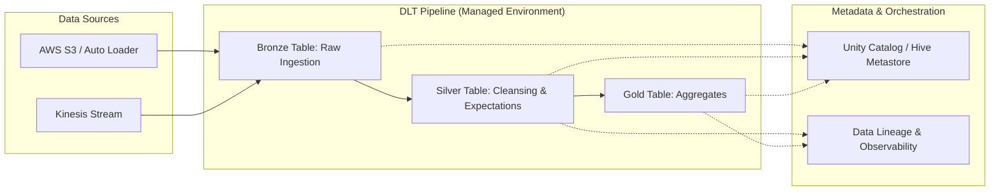

## Building Declarative Pipelines with Delta Live Tables (DLT)

### Section at a Glance
**What you'll learn:**
- The shift from imperative (how) to declarative (what) data engineering.
- How to implement Medallion Architecture using DLT pipelines.
- Managing data quality using Expectations (Expectations/Constraints).
- Implementing continuous vs. triggered execution modes.
- Orchestrating complex dependencies and lineage within a single pipeline.

**Key terms:** `Declarative` · `Medallion Architecture` · `Expectations` · `Streaming Live Table` · `Materialized View` · `Incremental Processing`

**TL;TR:** Delta Live Tables (DLT) is a framework for building reliable, maintainable, and testable data pipelines that automatically manage infrastructure, orchestration, and data quality, allowing engineers to focus on logic rather than plumbing.

---

### Overview
In traditional data engineering, particularly with Spark or AWS Glue, engineers spend a disproportionate amount of time writing "plumbing" code: managing checkpoint locations, handling manual triggers, ensuring table dependencies are met in the right order, and implementing complex error-handling logic for bad data. This imperative approach is brittle; if a task fails or a schema changes, the entire orchestration-layer logic (like Airflow or Step Functions) must be manually updated.

For a business, this creates "Data Engineering Debt." The cost of maintaining these pipelines scales linearly with the number of pipelines, leading to high operational overhead and slow time-to-market for new insights.

Delta Live Tables (DLT) solves this by introducing a **declarative** paradigm. Instead of writing code that says, *"First, read from S3, then transform, then write to Parquet, then update the catalog,"* you write code that says, *"This table is the result of this transformation."* DLT handles the underlying Spark clusters, the orchestration of the DAG (Directed Acyclic Graph), the state management, and the retries. It transforms the role of the data engineer from a "pluggable component builder" to a "data flow architect," significantly reducing the Total Cost of Ownership (TCO) for data platforms.

---

### Core Concepts

**1. Declarative Programming vs. Imperative Logic**
In an imperative system (standard Spark), you define the *steps*. In DLT, you define the *desired end state*. You specify the source and the transformation, and DLT determines the most efficient way to compute the result.

**2. The Medallion Architecture**
DLT is designed to natively support the Medallance pattern:
*   **Bronze (Raw):** Ingests raw data from sources (S3, Kinesis) with minimal changes.
*   **Silver (Cleansed):** Applies transformations, joins, and filters. This is where "Expectations" are most critical.
*   **Gold (Aggregated):
    ** Business-level aggregates ready for BI tools.

**3. Live Tables vs. Streaming Live Tables**
*   **Streaming Live Tables (`STREAMING LIVE TABLE`):** Use this when you want incremental processing. DLT uses Spark Structured Streaming under the hood to process only new data since the last update. 📌 **Must Know:** This is essential for low-latency requirements and minimizing compute costs by avoiding full re-scans.
*   **Live Tables (`LIVE TABLE`):** These represent materialized views. They are computed based on the current state of the source. Use these for complex aggregations where you need the "final truth" rather than just the delta.

**4. Data Quality with Expectations**
DLT introduces **Expectations**, a powerful way to enforce data quality directly in the pipeline code.
*   **`CONSTRAINT ... ON VIOLATION DROP ROW`:** Silently cleans data by removing records that fail the check.
able
*   **`CONSTRAINT ... ON VIOLATION FAIL UPDATE`:** Stops the pipeline entirely if a condition isn't met. ⚠️ **Warning:** Use `FAIL UPDATE` sparingly in production pipelines; a single malformed record in a high-volume stream can cause significant downtime and downstream data freshness issues.
*   **`CONSTRAINT ... ON VIOLATION QUARANTINE`:** (Pattern-based) Allows you to flag data for manual review.

> 💡 **Tip:** Use `DROP ROW` for non-critical schema drifts or minor formatting errors to maintain pipeline availability, but use `FAIL UPDATE` for critical business logic errors (e.g., a null `customer_id`) where downstream reports would be fundamentally wrong.

---

### Architecture / How It Works



1.  **Data Sources:** The entry point where raw files or streams are ingested, often using Databricks Auto Loader.
2.  **Bronze Table:** The landing zone where data is persisted in Delta format with minimal transformation.
3.  **Silver Table:** The processing engine where complex logic and Expectations are applied to clean and enrich data.
4.  **Gold Table:** The final consumption layer where data is aggregated for business users.
    5.  **DLT Engine:** The managed service that handles cluster provisioning, task scheduling, and dependency management.
    6.  **Unity Catalog:** Provides the centralized governance, security, and lineage tracking for all tables produced.

---

### Comparison: When to Use What

| Option | Best For | Trade-offs | Approx. Cost Signal |
| :--- | :--- | :--- | :--- |
| **Standard Spark (Notebooks)** | Ad-hoc analysis, one-off ETL, experimentation. | High manual effort for orchestration and error handling. | Low (Pay only for cluster use) |
| **DLT (Triggered Mode)** | Batch processing, daily/hourly updates, cost-sensitive workloads. | Not real-time; data latency is tied to pipeline frequency. | Moderate (Efficient, no "always on" cost) |
| **DLT (Continuous Mode)** | Low-latency streaming, real-time dashboards, fraud detection. | Requires always-on clusters; higher cost. | High (Cluster runs 24/7) |
| **AWS Glue (Spark)** | Legacy ETL patterns, integration with AWS-native ecosystem. | Requires managing Glue Jobs and manual orchestration (Step Functions). | Variable (DPU based) |

**How to choose:** If your workload requires managing complex dependencies and data quality constraints, DLT is the superior choice. If you are performing a simple, one-time data migration, a standard Spark job is more cost-effective.

---

### Cost Cheat Sheet

| Scenario | Recommended Option | Key Cost Driver | Watch Out For |
| :--- | :--- | :--- | :--- |
| **High-Volume Batch** | DLT (Triggered) | Cluster size and duration of the "run". | Over-provisioning vCPUs for simple transformations. |
| **Real-time Streaming** | DLT (Continuous) | 24/7 Compute uptime. | Not turning off pipelines when not needed; using too many worker nodes. |
| **Small, Frequent Files** | DLT + Auto Loader | Number of file metadata operations. | "Small File Problem" causing excessive compute overhead. |
| **Complex Data Cleaning** | DLT (with Expectations) | Complexity of Python/SQL logic + compute time. | Using `FAIL UPDATE` on high-volume streams, causing expensive retries. |

> 💰 **Cost Note:** The single biggest cost mistake in DLT is running a pipeline in **Continuous Mode** for a workload that only needs to be updated once an hour. Always default to **Triggered Mode** unless your business KPI explicitly demands sub-minute latency.

---

  ### Service & Tool Integrations

1.  **AWS S3 & Auto Loader:** DLT integrates seamlessly with S3. Using Auto Loader within DLT allows for efficient, incremental file ingestion without manual state tracking.
2.  **Unity Catalog:** DLT populates Unity Catalog, enabling centralized access control, auditing, and end-to-end lineage.
3.  **Amazon Kinesis:** For streaming workloads, DLT can ingest data directly from Kinesis streams, making it a natural choice for AWS-centric architectures.
4.  **Databricks SQL:** The output of DLT (Gold tables) is directly queryable via Databricks SQL warehouses for BI tools like Tableau or PowerBI.

---

### Security Considerations

DLT leverages the underlying Databricks and AWS security models.

| Control | Default State | How to Enable / Strengthen |
| :--- | :--- | :--- |
| **Data Access (RBAC)** | Controlled by Workspace/Unity Catalog permissions. | Use **Unity Catalog** to define fine-grained access at the table/column level. |
| **Encryption (At Rest)** | AWS KMS managed encryption on S3. | Use **Customer Managed Keys (CMK)** via AWS KMS for stricter compliance. |
| **Network Isolation** | Public access via Databricks workspace. | Deploy Databricks in a **Private VPC** with no public internet egress. |
| **Audit Logging**| Databricks Audit Logs. | Enable **AWS CloudTrail** and Databricks System Tables to track all DLT modifications. |

---

### Performance & Cost

To optimize DLT, you must balance **compute density** with **data volume**. 

*   **Tuning Strategy:** For `Streaming Live Tables`, ensure you are using **Auto Loader**. It minimizes the cost of "listing" files in S3, which becomes expensive as S3 buckets grow to millions of objects.
*   **The Bottleneck:** The most common bottleneck is **shuffling** during large joins in the Silver layer. 
*   **Cost Scenario Example:**
    *   *Scenario:* A pipeline processes 1TB of data daily.
    *   *Approach A (Imperative Spark):* A cluster runs for 4 hours, heavily over-provisioned to handle the peak load. Cost: ~$50/day.
    *   *Approach B (DLT Triggered):* A smaller, right-sized cluster runs for 1 hour, utilizing incremental processing to only touch the 10GB of new data. Cost: ~$8/day.
    *   **Outcome:** DLT's ability to handle incremental state management results in an ~84% cost reduction in this scenario.

---

### Hands-On: Key Operations

**Defining a Bronze Table with Auto Loader (SQL)**
This code block defines the initial ingestion point from an S3 bucket.
```sql
CREATE OR REFRESH STREAMING LIVE TABLE bronze_orders
AS SELECT * FROM cloud_files("/mnt/raw_data/orders", "json");
```
> 💡 **Tip:** Always use `cloud_files` (Auto Loader) for Bronze tables to ensure you only process new files and avoid expensive S3 list operations.

**Applying Expectations for Data Quality (Python)**
This snippet demonstrates how to drop malformed records during the transition from Bronze to Silver.
```python
import dlt
from pyspark.sql.functions import col

@dlt.table(name="silver_orders")
@dlt.expect_or_drop("valid_order_id", "order_id IS NOT NULL")
def silver_orders():
    return dlt.read_stream("bronne_orders")
```
> ⚠️ **Warning:** If you use `expect_or_fail`, a single null `order_id` will crash your entire production pipeline and stop all downstream updates.

---

### Customer Conversation Angles

**Q: We already use Airflow to orchestrate our Spark jobs. Why should we switch to DLT?**
**A:** Airflow is a great general-purpose orchestrator, but it doesn't "see" the data inside your tasks. DLT understands the data lineage and dependencies, meaning it handles retries, incremental state, and data quality automatically without you needing to write complex Airflow DAG logic.

**Q: How much more expensive is DLT compared to running standard Databricks Jobs?**
**A:** While the compute cost is similar, the "hidden" cost of manual engineering—maintenance, fixing broken pipelines, and managing checkpoints—is significantly lower with DLT, leading to a lower Total Cost of Ownership.

**Q: Can DLT handle schema evolution if my source S3 files change?**
**A:** Yes, when used with Auto Loader within a DLT pipeline, it can automatically detect and evolve the schema, reducing the manual intervention required when upstream systems change.

**Q: If I use DLT, do I lose control over my Spark configurations?**
**A:** You lose control over the "plumbing" (like checkpointing), but you retain control over the "logic" and can still pass specific Spark configurations through the DLT pipeline settings.

**Q: Does DLT work with Unity Catalog?**
**A:** Absolutely; in fact, it is designed to be the primary way to populate Unity Catalog with governed, lineage-tracked data.

---

### Common FAQs and Misconceptions

**Q: Does DLT replace Spark?**
**A:** No, DLT is a high-level abstraction built *on top* of Spark. It uses Spark to execute the workloads.

**Q: Can I use DLT for ad-hoc SQL queries?**
**A:** No, DLT is for building pipelines. For ad-hoc queries, you should use Databricks SQL Warehouses.

**Q: Is DLT a "black box" where I can't see what's happening?**
**A:** Not at all. You can view the full DAG, inspect the lineage, and check the logs for every expectation violation.

**Q: Can I run DLT in a serverless way?**
**A:** Yes, Databricks is increasingly moving toward serverless compute for DLT, which further reduces management overhead.

**Q: Is DLT only for streaming data?**
**A:** No, as discussed, it supports both "Streaming" (incremental) and "Live" (materialized view/batch) modes. ⚠️ **Warning:** Do not assume "Live Table" means "Real-time"; it depends on your trigger frequency.

---

### Exam & Certification Focus

*   **Medallion Architecture (Domain: Data Engineering Patterns):** Understand the specific roles of Bronze, Silver, and Gold layers.
*   **Expectations (Domain: Data Quality):** Know the difference between `DROP ROW`, `FAIL UPDATE`, and no action. 📌 **Must Know: This is a high-frequency exam topic.**
*   **Streaming vs. Live Tables (Domain: Data Processing):** Be able to identify when to use incremental processing (`STREAMING`) vs. full refreshes (`LIVE`).
*   **Auto Loader Integration (Domain: Ingestion):** Understand how `cloud_files` simplifies ingestion and reduces cost.

---

### Quick Recap
- DLT is **declarative**, focusing on the "what" rather than the "how."
- It natively implements the **Medallion Architecture** for structured data flows.
- **Expectations** are the primary mechanism for enforcing data quality and governance.
- Use **Streaming Live Tables** for incremental, cost-efficient updates.
- DLT significantly reduces **operational overhead** and **engineering debt** by managing orchestration and state.

---

### Further Reading
**Databricks Documentation** — Deep dive into DLT syntax and configuration.
**Delta Lake Whitepaper** — Understanding the underlying storage layer that makes DLT possible.
**AWS Architecture Center** — Reference architectures for building data lakes on AWS using Databricks.
**Databricks Academy** — Hands-on labs for practicing pipeline creation.
**Unity Catalog Guide** — How to govern the tables produced by your DLT pipelines.