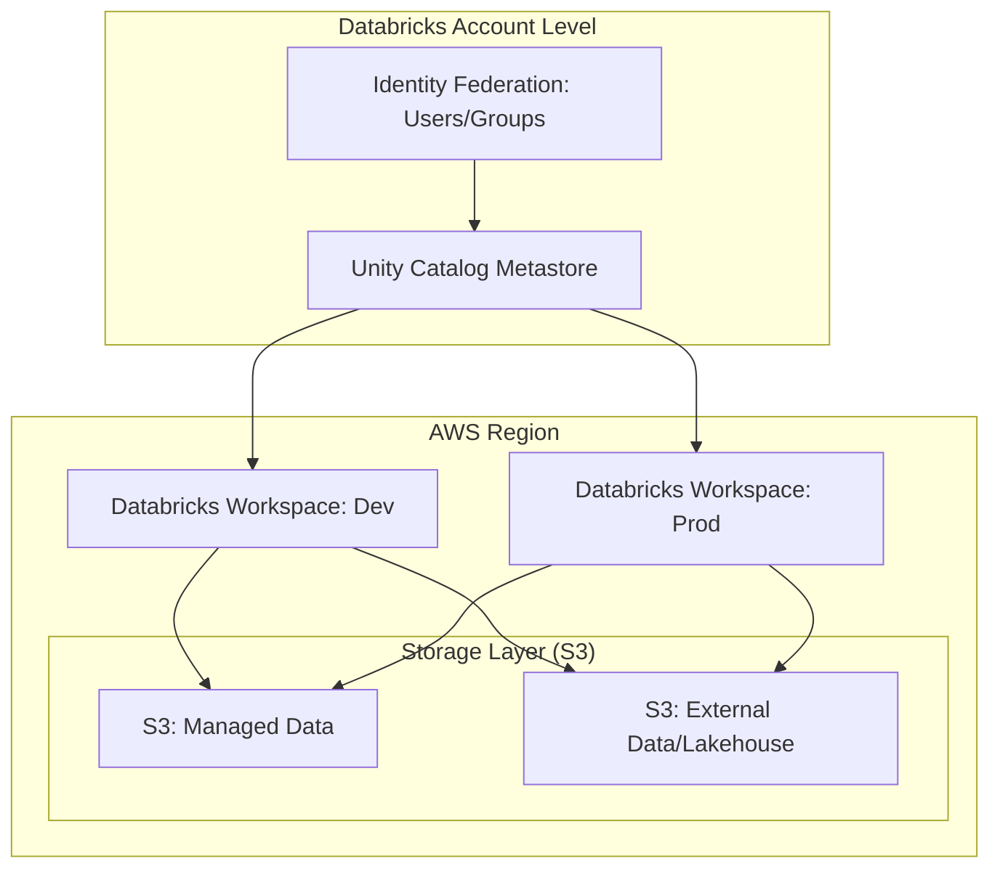

## Data Governance and Security with Unity Catalog

### Section at a Glance
**What you'll learn:**
- The architectural shift from the legacy Hive Metastore to the Unity Catalog (UC) model.
- How to implement the three-tier namespace (`catalog.schema.table`) for structured data governance.
- Implementing fine-grained access control, including row-level and column-level security.
- Managing data lifecycle through the distinction between Managed and External tables.
- Utilizing lineage and audit logs for enterprise-grade compliance and data lineage.

**Key terms:** `Metastore` · `Identity Federation` · `Three-tier Namespace` · `Managed Table` · `External Location` · `Lineage`

**TL;DR:** Unity Catalog is Databricks' unified governance layer that provides a single, centralized point to manage access, lineage, and auditing across all workspaces and data assets in your AWS environment.

---

### Overview
In the legacy Databricks architecture, security was often fragmented. If you had multiple workspaces in AWS, you often had to manage permissions separately in each, leading to "security silos." For a data engineer, this meant reconciling AWS IAM roles with Hive Metastore ACLs—a manual, error-prone process that creates significant compliance risks.

Unity Catalog solves the "fragmented truth" problem. It moves the source of authority from the individual workspace to the **Account level**. This allows organizations to define a security policy once (e.g., "The Finance Group can see the `revenue` column") and have that policy enforced regardless of which workspace or cluster a user is using to query the data.

From a business perspective, Unity Catalog transforms data from a liability into an asset. By providing automated lineage and centralized auditing, it reduces the "audit tax"—the massive amount of engineering time spent proving to regulators where data came far and how it was transformed. This section covers how to move from simple data movement to professional-grade data stewardship.

---

### Core Concepts

#### 1. The Three-Tier Namespace
Unity Catalog introduces a structured hierarchy that replaces the two-tier `schema.table` model found in the legacy Hive Metastore.
*   **Catalog:** The top-level container (e.g., `production`, `dev`, `staging`).
*   **Schema (Database):** The logical grouping within a catalog (e.g., `sales`, `marketing`).
*   **Table/View/Volume:** The actual data object.

📌 **Must Know:** On the certification exam, you must understand that Unity Catalog uses this **three-tier namespace**. When querying, you refer to data as `catalog_name.schema_name.table_name`.

#### 2. Identity Federation
Unlike the legacy model where users were local to a workspace, UC uses **Identity Federation**. Users and groups are created at the Databricks Account level.
*   **Impact:** A user added to the "Data Scientists" group in the Account console automatically inherits the correct permissions across all attached workspaces.

#### 3. Managed vs. External Tables
Understanding the difference in data ownership is critical for cost and lifecycle management.
*   **Managed Tables:** Databricks manages both the metadata and the physical data in S3. 
    ⚠️ **Warning:** If you run a `DROP TABLE` command on a **managed** table, Databricks deletes both the metadata *and* the underlying files in S3. This is permanent and cannot be undone via SQL.
*   **External Tables:** You provide the S3 path. Databricks only manages the metadata.
    💡 **Tip:** Use External Tables for "Gold" layer data that needs to be shared with other tools (like Amazon Athena or Snowflake) that reside outside of the Databricks ecosystem.

#### 4. Fine-Grained Access Control (FGAC)
UC allows you to move beyond "all or nothing" access.
*   **Column-level security:** Using masking functions to hide PII (e.g., masking everything except the last 4 digits of a SSN).
*   **Row-level security:** Using filtering predicates to ensure a regional manager can only see rows where `region = 'EMEA'`.

---

### Architecture / How It Works



1.  **Unity Catalog Metastore:** The central metadata repository that holds the global state of all objects.
2.  **Identity Federation:** The centralized registry of users and groups managed at the account level.
3.  **Databricks Workspaces:** The compute environments where engineers run SQL/Python; they all point to the same Metastore.
4.  **S3 Managed/External:** The physical storage layer where the actual Parquet/Delta files reside.

---

### Comparison: When to Use What

| Option | Best For | Trade-offs | Approx. Cost Signal |
| :--- | :--- | :--- | :--- |
| **Managed Tables** | Internal ETL/Bronze/Silver layers | Databricks controls lifecycle; less flexibility for external tools. | Lowest management overhead. |
  | **External Tables** | Data sharing with external tools (Athena/Redshift) | Requires manual management of S3 lifecycle/cleanup. | Higher operational "cleanup" cost. |
| **Unity Catalog Volumes**| Unstructured data (PDFs, Images, CSVs) | Easier than managing raw S3 paths; integrates with SQL. | Minimal overhead. |
| **Legacy Hive Metastore**| Legacy workloads (Migration phase only) | No centralized governance; high security fragmentation. | High "hidden" human/audit cost. |

**How to choose:** Use **Managed Tables** for your primary internal Lakehouse architecture to simplify deletions and cleanup. Use **External Tables** only when the data must persist independently of the Databricks lifecycle or be accessed by non-Databricks services.

---

### Cost Cheat Sheet

| Scenario | Recommended Option | Key Cost Driver | Watch Out For |
| :--- | :--- | :--- | :--- |
| **High-volume PII masking** | Dynamic View with Masking | Compute (CPU) for runtime evaluation. | Complex regex masks can slow down queries. |
| **Large-scale Data Ingestion** | Managed Tables | S3 API calls & Storage growth. | `DROP TABLE` doesn't clean up external paths. |
  | **Cross-Workspace Analytics**| Unity Catalog Metastore | No direct cost, but requires Account-level setup. | Misconfigured IAM roles causing 403 errors. |
| **Regulatory Auditing** | UC Audit Logs | Storage of logs in S3. | Log volume explosion in highly active clusters. |

💰 **Cost Note:** The biggest cost mistake is failing to use **Managed Tables** for transient staging data. This leads to "orphaned" files in S3—data that is no longer in your catalog but is still costing you storage and potentially violating GDPR/CCPR deletion requests.

---

### Service & Integrations

1.  **AWS IAM & Storage Credentials:**
    *   UC uses **Storage Credentials** (mapping to an IAM Role) and **External Locations** (the S3 path) to bridge the gap between the Catalog and S3.
2.  **AWS Glue:**
    *   While Glue is excellent for ETL, UC provides superior lineage. Many architectures use Glue for discovery but UC as the "Single Source of Truth" for governance.
3.    **MLflow:**
    *   UC allows you to register models within the same three-tier namespace as your data, enabling "Model Lineage" (knowing exactly which version of a table trained which version of a model).

---

### Security Considerations

| Control | Default State | How to Enable / Strengthen |
| :--- | :--- | :--- |
| **Authentication** | Identity Federation (Account Level) | Use SSO (SAML/Okta) integrated with Databricks Account. |
| **Authorization** | `USAGE` on Catalog/Schema required | Use SQL `GRANT` and `REVOKE` statements. |
| **Data Encryption** | AWS S3 Managed (SSE-S3) | Use AWS KMS with Customer Managed Keys (CMK) for higher control. |
| **Audit Logging** | Enabled in UC | Configure log delivery to a dedicated S3 bucket for long-term retention. |

---

### Performance & Cost

**Tuning Guidance:**
While Unity Catalog introduces a metadata layer, the performance impact on query execution is negligible because the metadata is cached. However, **complex Row-Level Security (RLS)** can introduce latency. If a view uses a heavy `JOIN` to check user permissions for every row, your query speed will drop.

**Example Cost Scenario:**
Imagine a `sales_transactions` table with 1 billion rows.
*   **Scenario A (No Security):** Querying the table is a simple scan. Cost: $1.00 (Compute).
*   **Scenario B (Complex RLS):** Every query performs a `JOIN` against a `user_permissions` table. If the permission table is large and unoptimized, the query might take 2x longer. Cost: $2.00 (Compute).
*   **Strategy:** Always ensure your "Permission Mapping" tables are small, cached, or materialized to minimize the compute tax of security.

---

### Hands-On: Key Operations

**1. Creating a new Catalog for a specific business unit:**
```sql
CREATE CATALOG IF NOT EXISTS finance_catalog;
```
💡 **Tip:** Creating catalogs per department (Finance, HR, Ops) is a best practice for strict isolation.

**2. Granting read access to a specific group:**
```sql
GRANT USAGE ON CATALOG finance_catalog TO `finance_group`;
GRANT SELECT ON SCHEMA finance_catalog.revenue_data TO `finance_group`;
```

**3. Implementing Column-Level Masking for PII:**
First, create a masking function:
```sql
CREATE FUNCTION finance_catalog.mask_ssn(ssn STRING)
RETURN CASE WHEN is_account_group_member('admin') THEN ssn ELSE '***-**-****' END;
```
Then, apply it to a column in a view:
```sql
CREATE VIEW finance_catalog.revenue_data.secure_customers AS
SELECT customer_id, finance_catalog.mask_ssn(ssn) AS ssn
FROM finance_catalog.revenue_data.raw_customers;
```
💡 **Tip:** Always grant `USAGE` on the function itself to the users who need to run the view.

---

### Customer Conversation Angles

**Q: We already use AWS IAM roles to secure our S3 buckets. Why do we need Unity Catalog?**
**A:** IAM is great for infrastructure security, but it's "all or nothing." Unity Catalog allows you to grant access to specific rows or columns within a file, which IAM cannot do, and it centralizes that management so you don't have to manage hundreds of complex IAM policies.

**Q: Will moving to Unity Catalog require us to rewrite all our ETL pipelines?**
**A:** Not necessarily. Most Spark code remains the same; you are simply updating the reference from `database.table` to `catalog.database.table`.

**Q: If I delete a table in Unity Catalog, is my data gone forever?**
**A:** It depends. If it's a **Managed Table**, yes, the data is deleted from S3. If it's an **External Table**, only the metadata is removed; the files stay in your S3 bucket.

**Q: How does this help with GDPR compliance?**
**A:** UC provides built-in data lineage. You can trace a piece of PII from its ingestion in the Bronze layer all the way to the final reporting dashboard, making it much easier to prove compliance during an audit.

**Q: Does Unity Catalog add latency to my Spark queries?**
**A:** The metadata lookup happens at the start of the query. While there is a microscopic overhead for permission checking, the primary impact is the compute cost of complex logic like row-level filtering.

---

### Common FAQs and Misconceptions

**Q: Can I use Unity Catalog with the legacy Hive Metastore?**
**A:** You can have both running in the same account, but they are separate. You cannot "partially" migrate a single table into UC without defining it as a Catalog object.

**Q: Does Unity Catalog replace AWS Glue Data Catalog?**
**A:** Not strictly. They can coexist, but UC is designed to be the authoritative governance layer for Databricks workloads. ⚠️ **Warning:** Attempting to use Glue as the primary metadata source for Databricks workloads often leads to "split-brain" security where permissions are inconsistent.

**Q: Is the three-tier namespace a limitation?**
**A:** No, it's a feature. It allows for much better organization of large-scale data estates.

**Q: Can I use Unity Catalog to govern data that isn't in S3?**
**A:** Yes, via "Lakehouse Federation," you can govern external databases like PostgreSQL or Snowflake through the Unity Catalog interface.

**Q: Does Unity Catalog work with all Databricks cluster types?**
**A:** It requires "Access Mode" compatibility (Shared or Single User). ⚠️ **Warning:** Legacy "Standard" clusters that do not support Unity Catalog cannot use the new security features like dynamic masking.

---

### Exam & Certification Focus

*   **Domain: Data Engineering (Governance & Security)**
    *   Identify the difference between **Managed** and **External** tables (High Frequency). 📌
    *   Understand the **Three-Tier Namespace** structure (`catalog.schema.table`). 📌
    *   Distinguish between **Identity Federation** (Account level) and **Workspace-local** users.
    *   Explain the mechanism of **Row-Level Security** using SQL functions.
    *   Understand the impact of `DROP TABLE` on different table types.

---

### Quick Recap
- Unity Catalog provides a **centralized, account-level** governance model.
- The **three-tier namespace** (`catalog.schema.table`) is the foundation of UC.
- **Managed Tables** allow Databricks to control the physical data lifecycle.
- **Identity Federation** allows for seamless user management across multiple workspaces.
- **Fine-grained access control** enables secure, compliant data sharing via masking and filtering.

---

### Further Reading
**Databricks Documentation** — Official guide to Unity Catalog setup and administration.
**Databricks Whitepaper: Data Governance** — Deep dive into the architecture of the Lakehouse.
**AWS Architecture Center** — Best practices for building secure Data Lakes on AWS.
**Databrks Academy** — Hands-on labs for implementing Unity Catalog security.
**Delta Lake Documentation** — Understanding how transaction logs enable versioning and auditability.