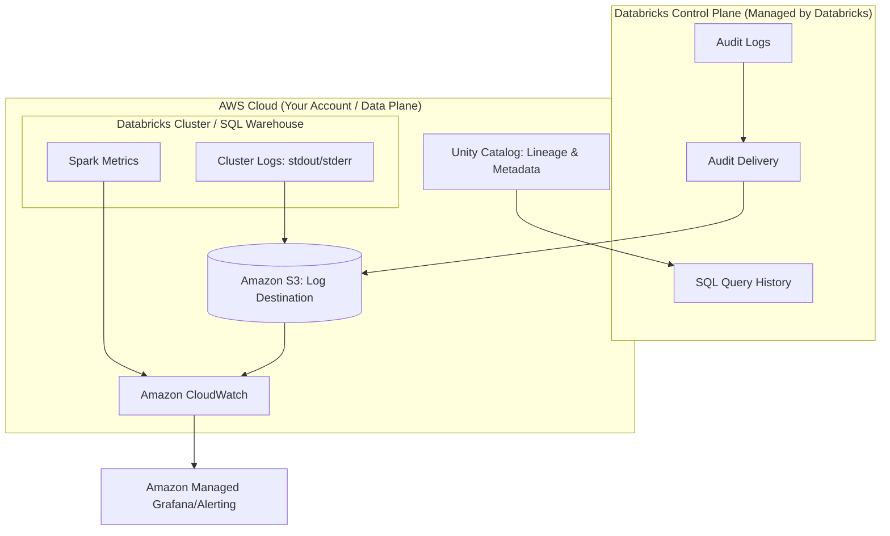

## Monitoring, Logging, and Observability in Databricks

### Section at a Glance
**What you'll learn:**
- Distinguishing between Monitoring, Logging, and Observability in a Lakehouse context.
- Implementing and managing Cluster Logs and Audit Logs on AWS S3.
- Utilizing the Databricks SQL Query History and Spark UI for performance troubleshooting.
- Integrating Databrical telemetry with AWS CloudWatch and Amazon Managed Grafana.
- Setting up proactive alerting for pipeline failures and cost anomalies.

**Key terms:** `Control Plane` · `Data Plane` · `Audit Logs` · `Telemetry` · `Lineage` · `Log Delivery`

**TL;DR:** Monitoring ensures your Databricks workloads are running; logging tells you what happened when they failed; observability allows you to understand *why* a performance bottleneck occurred by analyzing the relationships between logs, metrics, and traces.

---

### Overview
In a production-grade Data Engineering ecosystem, "it's running" is never a sufficient answer. For a business, a pipeline that completes successfully but produces duplicate data is just as catastrophic as a pipeline that fails entirely. The cost of data downtime—the period when data is missing, inaccurate, or late—can reach millions of dollars in lost operational efficiency and eroded customer trust.

This section addresses the critical need for visibility. We move beyond simple "up/down" monitoring into the realm of observability. We will explore how to instrument your Databrability environment so that when a job slows down or a Spark partition skews, you aren't just notified of a failure, but you are provided with the "breadcrumbs" (logs and traces) necessary to perform a root-cause analysis (RCA) without manually re-running the job.

Within the context of this course, we view monitoring not as an afterthought, but as a core component of the Data Engineering Lifecycle. You will learn how to leverage the separation of the Databricks **Control Plane** (managed by Databricks) and the **Data Plane** (your AWS VPC) to ensure that telemetry is captured, aggregated, and actionable.

---

### Core Concepts

#### 1. The Three Pillars of Observability in Databricks
To achieve true observability, you must implement three distinct types of telemetry:
*   **Logs:** The immutable record of events (e.g., "User X started Cluster Y", "Task Z failed with OutOfMemoryError").
*   **Metrics:** Numerical representations of state over time (e.g., CPU utilization, Spark executor memory usage, number of records processed per second).
*   **Traces:** The journey of a single request or data packet through various distributed components (e.g., the path a specific Delta Table update takes from a Notebook through a DLT pipeline).

#### 2. Log Types and Scopes
*   **Cluster Logs:** These reside in your **Data Plane**. They include `stdout` and `stderr` from the Spark executors and driver. 
    ⚠️ **Warning:** Cluster logs are **not** automatically persisted to S3. You must explicitly configure an S3 bucket in the cluster configuration for log delivery, otherwise, logs are lost when the cluster terminates.
*   **Audit Logs:** These reside in the **Control Plane**. They record all actions taken in the Databricks workspace (e.g., identity changes, notebook edits, cluster creations). 
    📌 **Must Know:** For compliance-heavy industries (Finance, Healthcare), Audit Logs are the primary mechanism for satisfying SOC2 or HIPAA requirements regarding data access tracking.
*   **Unity Catalog Lineage:** This is the "modern observability." It provides a visual trace of how data moves from raw bronze to refined gold layers.

#### 3. Spark UI vs. Databricks SQL Query History
*   **Spark UI:** Deep, low-level technical details (DAGs, shuffle reads, spill to disk). Best for debugging hardware-level issues or complex join inefficiencies.
*   **SQL Query History:** High-level, user-friendly interface for SQL Warehouse performance. Shows execution time, bytes scanned, and query plan.
    💡 **Tip:** Use Query History first for SQL-based workloads; only dive into the Spark UI if the Query History reveals massive "Spill to Disk" metrics.

---

### Architecture / How It Works



1.  **Control Plane:** Databricks captures user activity and SQL execution metadata.
2.  **Data Plane:** Your compute resources generate raw system and application logs.
3.  **S3 Destination:** The central repository where both Audit Logs and Cluster Logs are persisted for long-term storage and analysis.
4.  **CloudWatch:** Acts as the ingestion engine for metrics and log patterns to trigger alarms.
5.  **Unity Catalog:** Provides the structural observability layer, linking data movement to metadata.
6.  **Observability Layer:** Tools like Grafana or CloudWatch Dashboards aggregate this data for human consumption.

---

### Comparison: When to Use What

| Option | Best For | Trade-offs | Approx. Cost Signal |
| :--- | :--- | :--- | :--- |
| **Spark UI** | Deep-dive debugging of executor memory, shuffle, or skew. | Only available while the cluster is running. | Free (Compute cost only) |
| **Databricks SQL History** | Analyzing SQL Warehouse performance and query optimization. | Limited to SQL-based workloads. | Free (Included in SQL Warehouse) |
| **CloudWatch Logs/Metrics** | High-level infrastructure alerting (e.g., Cluster failure). | Requires setup of log delivery to S3/CloudWatch. | Moderate (Ingestion/Storage) |
| **Unity Catalog Lineage** | Understanding data impact and downstream dependencies. | Requires Unity Catalog to be enabled. | Low (Metadata overhead) |

**How to choose:** Start with **Unity Catalog Lineage** to see *what* changed, move to **SQL History/Spark UI** to see *how* it performed, and use **CloudWatch/Audit Logs** to see *who* or *what* triggered the event.

---

### Cost Cheat Sheet

| Scenario | Recommended Option | Key Cost Driver | Watch Out For |
| :--- | :--- | :--- | :--- |
| **Long-term Compliance** | S3 Glacier (via Audit Logs) | Storage volume & Retrieval | ⚠️ High cost to re-index massive log archives. |
| **Real-time Alerting** | CloudWatch Alarms | Metric frequency (Resolution) | 💰 High-resolution metrics (1-sec) increase costs significantly. |

| **Performance Debugging**| Spark UI / SQL History | Cluster uptime | ⚠️ Logs disappear if the cluster is terminated and not configured to S3. |
| **Data Governance Audit** | Unity Catalog Lineage | Number of lineage edges | Over-instrumenting every tiny transformation can create metadata bloat. |

> 💰 **Cost Note:** The single biggest cost mistake in observability is **Log Over-Ingestion**. Sending every single `DEBUG` level log from a high-frequency Spark job into CloudWatch can result in an AWS bill that exceeds your actual Databrks compute spend. Always filter for `ERROR` or `WARN` levels for real-time ingestion.

---

### Service & Integrations

#### 1. AWS CloudWatch Integration
1.  Configure Databricks to write Cluster Logs to a specific S3 bucket.
2.  Set up an **Amazon CloudWatch Agent** or an **S3 Event Notification** to trigger a Lambda function.
3.  The Lambda function parses the logs and pushes custom metrics to CloudWatch.
4.ly 4. Create CloudWatch Alarms based on these metrics.

#### 2. Unity Catalog & Data Lineage
1.  Enable Unity Catalog on your Databricks Metastore.
2.  As Spark jobs run, Unity Catalog automatically captures the relationship between source and target tables.
3.  Use the Catalog Explorer to visualize the "upstream" and "downstream" impact of a table change.

---

### Security Considerations

| Control | Default State | How to Enable / Strengthen |
| :--- | :--- | :--- |
| **Audit Log Access** | Restricted to Workspace Admins | Use IAM roles to grant specific Data Engineers "Read" access to the S3 log bucket. |
| **Log Encryption** | Encrypted at rest (S3 default) | Use **AWS KMS** with customer-managed keys (CMK) for higher compliance. |
| **Network Isolation** | Logs move via AWS backbone | Ensure all log-delivery S3 buckets are accessed via **VPC Endpoints** to avoid the public internet. |

---

### Performance & Cost
When tuning observability, you are balancing **Visibility** vs. **Latency** vs. **Cost**. 

**Example Scenario:**
An engineer is debugging a job that fails 10% of the time. 
- **Approach A (Cheap):** Only monitor `ERROR` logs in CloudWatch. *Result:* You know it failed, but you don't know if it was due to a memory spike or a network timeout.
- **Approach B (Expensive):** Stream all `INFO` and `DEBUG` logs to CloudWatch at 1-second resolution. *Result:* You have total visibility, but your CloudWatch ingestion costs are $500/month for a job that only costs $100/month to run.

**The Golden Rule:** Use **S3** as your "Source of Truth" for all logs (cheap storage) and use **CloudWatch/Datadog/Grafana** only for "Aggregated Summaries" (expensive, real-time ingestion).

---

### Hands-On: Key Operations

**Querying SQL Warehouse Performance using SQL:**
Run this in a Databricks SQL Editor to identify the longest-running queries in your warehouse.
```sql
SELECT 
  query_id, 
  query_text, 
  total_duration / 1000 AS duration_seconds,
  user_name
FROM system.query_history
ORDER BY total_duration DESC
LIMIT 10;
```
> 💡 **Tip:** The `system` catalog is a specialized area of Unity Catalog that allows you to query operational metadata using standard SQL.

**Configuring Cluster Log Delivery (Python/API Concept):**
While usually done via the UI, this represents the logic needed for IaC (Terraform).
```python
# Concept: Defining cluster log destination in a JSON cluster config
cluster_config = {
    "cluster_name": "Production_ETL_Cluster",
    "spark_conf": {
        "spark.databricks.clusterLogs.destination": "s3://my-company-logs/cluster-logs/"
    }
}
# 💡 Note: Ensure the Databricks Instance Profile has 's3:PutObject' permissions on this bucket.
```

---

### Customer Conversation Angles

**Q: "How will I know if my production pipeline fails at 2:00 AM?"**
**A:** We implement a multi-layered alerting strategy using CloudWatch Alarms tied to your S3 log stream, ensuring you receive notifications via PagerDuty or Email the moment a failure is logged.

**Q: "Can we use our existing Datadog/Grafana dashboards for Databricks?"**
**A:** Absolutely. By configuring Databricks to land logs in S3, we can use standard AWS integration patterns to pull that telemetry into your existing enterprise observability tools.

**Q: "Is the cost of monitoring going to significantly impact our Databricks spend?"**
**A:** Not if implemented correctly. We follow a 'Store in S3, Alert in CloudWatch' pattern, which keeps storage costs extremely low and only incurs high costs for the specific metrics we need for alerting.

**Q: "How do we prove to auditors who accessed our sensitive PII data?"**
**A:** We leverage Unity Catalog Audit Logs, which provide an immutable, unchangeable record of every identity that queried or modified specific tables.

**Q: "If a cluster is terminated, do we lose the logs?"**
**A:** Not if we have configured the 'Log Delivery' feature to an S3 bucket, which persists the logs independently of the cluster lifecycle.

---

### Common FAQs and Misconceptions

**Q: Are Databricks Audit Logs and Spark Logs the same thing?**
**A:** No. Audit Logs track *user actions* in the workspace; Spark Logs track *code execution* within the cluster.

**Q: Can I use the Spark UI to debug a job that finished yesterday?**
**A:** ⚠️ **Warning:** No. The Spark UI is ephemeral. Once the cluster is terminated, the UI is gone. You must have configured Cluster Log delivery to S3 to see historical execution details.

**Q: Does enabling Unity Catalog lineage impact our job performance?**
**A:** The overhead is minimal and is considered a best practice for maintaining data integrity and observability.

**Q: Does CloudWatch capture everything happening inside my Spark executors?**
**A:** Not automatically. CloudWatch captures what you explicitly send to it via log agents or S3 triggers.

**Q: Is the 'System' catalog available in all Databricks workspaces?**
**A:** No, it requires Unity Catalog to be enabled and specifically configured.

**Q: Can I monitor costs within Databricks itself?**
**A:** Yes, using the `system.billing` schema in Unity Catalog, you can run SQL queries to track compute usage and costs.

---

### Exam & Certification Focus
*   **Domain: Data Engineering with Databricks**
    *   Understand the difference between **Control Plane** and **Data Plane** telemetry. 📌
    *   Identify the requirement for **S3 bucket configuration** for persistent cluster logs. 📌
    *   Knowledge of **Unity Catalog** as the source for lineage and auditability.
    *   Ability to distinguish between **Monitoring** (status) and **Observability** (root cause).

---

### Quick Recap
- **Monitoring** is for availability; **Observability** is for understanding complexity.
- **Cluster Logs** must be directed to **S3** to survive cluster termination.
- **Audit Logs** are essential for security, compliance, and tracking user activity.
- **CloudWatch** is great for alerting, but **S3** is the cost-effective home for raw logs.
- **Unity Catalog** provides the most powerful layer of observability through automated **Lineage**.

---

### Further Reading
**Databricks Documentation** — Detailed guide on configuring cluster log delivery to S3.
**AWS CloudWatch User Guide** — Understanding how to ingest and alert on log patterns.
**Unity Catalog Whitepaper** — Deep dive into data governance and lineage capabilities.
**Databricks System Tables Guide** — How to query billing, lineage, and audit data using SQL.
**AWS Well-Architected Framework (Observability Pillar)** — Best practices for building resilient, visible systems.