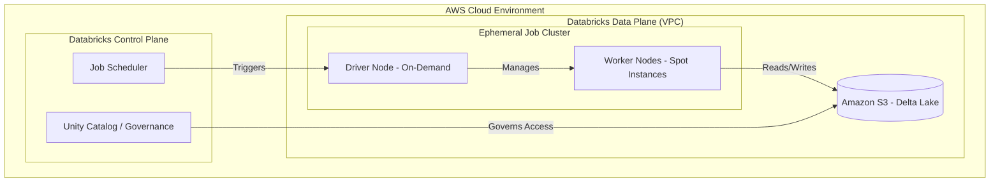

## Cost Management and AWS Resource Optimization

### Section at a Glance
**What you'll learn:**
- Distinguishing between All-purpose and Job clusters to minimize compute spend.
- Leveraging AWS Spot Instances for non-critical Spark workloads.
- Implementing Delta Lake maintenance (`OPTIMIZE`, `ZORDER`, `VACUUM`) for storage and performance efficiency.
- Configuring Auto-scaling and Auto-termination to prevent "zombie" cluster costs.
- Utilizing AWS Cost Allocation Tags and Unity Catalog for granular cost attribution.

**Key terms:** `All-purpose Clusters` · `Job Clusters` · `Spot Instances` · `Delta Lake Vacuum` · `Auto-scaling` · `Cost Allocation Tags`

**TL;DR:** Efficient Databricks engineering on AWS requires a dual focus on compute lifecycle management (using Job clusters and Spot instances) and storage hygiene (using Delta Lake maintenance) to ensure performance does not outpace budget.

---

### Overview
In a modern data estate, the greatest risk to a Data Engineering project is not technical failure, but "unbounded cost." Unlike traditional on-premises environments where capacity is a sunk cost, AWS-based Databricks environments operate on a consumption-based model. This creates a direct, real-time correlation between code efficiency and the monthly cloud bill.

For the Data Engineer, cost management is a core part of the "Definition of Done." A pipeline that delivers 100% accuracy but costs more than the business value it generates is a failed pipeline. This section addresses the fundamental tension between performance (speed/throughput) and economy (resource utilization).

We will explore how to move from expensive, interactive "Always-on" patterns to efficient, ephemeral "Run-to-completion" patterns. We will also look at how the underlying AWS infrastructure—specifically EC2 and S3—can be tuned via Databricks-specific configurations to optimize the Total Cost of Ownership (TCO).

---

### Core Concepts

#### 1. Compute Architecture: All-purpose vs. Job Clusters
The most significant cost lever in Databricks is the choice of cluster type.
*   **All-purpose Clusters:** These are interactive clusters used for manual development, notebooks, and ad-hoc querying. They support multi-user concurrency but carry a significantly higher DBU (Databricks Unit) rate.
*   **Job Clusters:** These are ephemeral clusters created specifically to run a single workload (a job). They are terminated automatically once the task completes. 📌 **Must Know:** Job clusters are priced at a much lower DBU rate than All-purpose clusters.

#### 2. EC2 Instance Strategies
Databricks runs on AWS EC2. How you choose these instances impacts both cost and stability.
*   **On-Demand Instances:** Guaranteed availability. Best for mission-critical, time-sensitive ETL.
*   **Spot Instances:** Uses spare AWS capacity at a massive discount (up to 90%). ⚠️ **Warning:** Spot instances can be reclaimed by AWS with very little notice. If your driver node is on a Spot instance and it is reclaimed, the entire cluster fails. Always use On-Demand for the **Driver** and Spot for **Workers**.

#### 3. Delta Lake Storage Optimization
Cost isn't just compute; it's also the S3 storage footprint.
*   **`OPTIMIZE`:** Compacts small files into larger, more efficient Parquet files. This reduces S3 metadata overhead and improves read performance.
*   **`ZORDER`:** A technique to colocate related information in the same files, drastically reducing the amount of data scanned.
*   **`VACUUM`:** Removes old data files that are no longer needed by the current state of the table. 💰 **Cost Note:** While `VACUUM` saves S3 storage costs, setting the retention period too low can break "Time Travel" capabilities.

#### 4. Cluster Lifecycle Management
*   **Auto-scaling:** Automatically adds or removes workers based on the workload's Spark executor demand.
*   **Auto-termination:** A setting that shuts down an All-purpose cluster after a period of inactivity (e.g., 20 minutes). 💡 **Tip:** Always set a strict auto-termination limit for development clusters to prevent accidental overnight spend.

---

### Architecture / How It Works



1.  **Job Scheduler:** Orchestrates the start and end of the cluster lifecycle.
2.  **Driver Node:** The "brain" of the cluster, handling task orchestration and metadata; must be On-Demand for stability.
3.  **Worker Nodes:** The "muscle" performing the actual data processing; ideally composed of Spot instances for cost savings.
4.  **Amazon S3:** The persistent storage layer where the Delta Lake transaction logs and Parquet data reside.
*   **Unity Catalog:** Provides the centralized governance layer to track which users/jobs are accessing which data, enabling cost attribution.

---

### Comparison: When to Use What

| Option | Best For | Trade-offs | Approx. Cost Signal |
| :--- | :--- | :--- | :--- |
| **All-purpose Cluster** | Exploratory Data Analysis (EDA), Debugging, Prototyping. | Highest DBU cost; risk of leaving "zombie" clusters running. | High (Premium) |
| **Job Cluster** | Production ETL, Scheduled Pipelines, Model Training. | Cannot be used interactively; requires a defined entry point. | Low (Discounted) |
| **Spot Instances** | Non-critical workloads, batch processing, data shuffling. | Risk of node preemption (interruption) leading to job retries. | Very Low |
| **On-Demand Instances** | Critical production jobs, Driver nodes, Streaming. | No risk of interruption, but higher-priced. | Standard |

**Decision Logic:** Use All-purpose clusters only while you are actively typing in a notebook. For anything that runs on a schedule or via an orchestration tool (like Airflow or Databrics Workflows), **always** use a Job Cluster.

---

### Cost Cheat Sheet

| Scenario | Recommended Option | Key Cost Driver | Watch Out For |
| :--- | :--- | :--- | :--- |
| **Daily Batch ETL** | Job Cluster + Spot Workers | DBU rate & Instance count | Driver node being on Spot |
| **Ad-hoc SQL Querying** | All-purpose Cluster | Auto-termination timeout | Forgetting to turn off the cluster |
| **Heavy Data Science/ML**| All-purpose + High Memory | Instance Type (r-series vs m-series) | Over-provisioning RAM |
| **Long-term Data Archiving**| S3 Lifecycle Policies | S3 API requests & Storage volume | Deleting files needed for Time Travel |

> 💰 **Cost Note:** The single biggest mistake in Databricks cost management is using All-purpose clusters for production pipelines. This mistake can easily triple your compute spend without providing any functional benefit.

---

### Service & Integrations

1.  **AWS Cost Explorer & Tags:**
    *   Apply `Project`, `Environment`, and `Owner` tags to your Databricks clusters.
    *   Use these tags in AWS Cost Explorer to generate granular reports showing exactly which pipeline is driving the bill.
2.  **AWS Glue Integration:**
    *   When migrating from Glue to Databricks, compare the "DPU" (Glue) vs "DBU" (Databricks) costs.
    *   Databricks often provides better performance for complex joins (lower duration), which can offset the higher per-unit cost.
3.  **Amazon S3 Lifecycle Management:**
    *   Automate the transition of older, unneeded Delta logs or raw data from S3 Standard to S3 Intelligent-Tiering or Glacier to reduce long-term storage costs.

---

### Security Considerations

Cost management and security intersect heavily in **Identity and Access Management (IAM)** and **Governance**.

| Control | Default State | How to Enable / Strengthen |
| :--- | :--- | :--- |
| **Cost Attribution** | Unstructured/Generic | Use **Unity Catalog** and Cluster Tags to map compute to specific business units. |
| **Network Isolation** | Public/Internal VPC | Deploy Databricks in a **Customer-managed VPC** with no public IP for compute nodes. |
| **Data Encryption** | Encrypted at Rest (AWS) | Use **AWS KMS** with customer-managed keys (CMK) for even stricter control. |
| **Audit Logging** | Basic CloudTrail | Enable **Databricks Audit Logs** to track who started/stopped clusters and the cost impact. |

---

### Performance & Cost

Optimization is a balancing act. Increasing performance often increases cost, but **inefficient** performance is a pure loss.

**Example Scenario: The "Small File Problem"**
Imagine a pipeline that writes data every 5 minutes. After 24 hours, you have 288 tiny files.
*   **The Cost:** Every time a downstream job reads this table, it must perform 288 separate S3 `GET` requests and metadata lookups. This increases both **S3 API costs** and **Databricks compute time** (due to overhead).
*   **The Fix:** Run an `OPTIMIZE` command daily.
*   **The ROI:** While `OPTIMIZE` costs a few cents in compute, it might reduce the downstream job duration from 10 minutes to 2 minutes, saving significant DBU spend over the month.

---

### Hands-On: Key Operations

**Step 1: Compacting small files to improve read performance.**
Run this on a table that undergoes frequent, small writes.
```sql
-- This compacts small files into larger, more efficient blocks.
OPTIMIZE silver_sales_data;
```
> 💡 **Tip:** You can combine this with `ZORDER` on columns frequently used in `WHERE` clauses to maximize the benefit.

**Step 2: Reorganizing data for high-performance filtering.**
```sql
-- This colocates related data in the same files, reducing data scanning.
OPTIMIZE silver_sales_data ZORDER BY (customer_id, transaction_date);
```

**Step 3: Cleaning up old data to manage S3 storage costs.**
Run this to remove files no longer needed by the current version of the table.
```python
# Python/PySpark way to vacuum a table
from delta.tables import DeltaTable

deltaTable = DeltaTable.forPath(spark, "/mnt/data/silver_sales_data")
# Removes files older than the default 7-day retention period
deltaTable.vacuum(retentionHours=168) 
```
⚠️ **Warning:** Never set `retentionHours` to a value lower than the time it takes for your longest-running concurrent job to complete, or you may delete files that a running job still needs to read.

---

### Customer Conversation Angles

**Q: "Why is our Databricks bill higher than our previous AWS Glue bill?"**
**A:** "While the per-unit DBU cost might be higher, Databricks' ability to process much larger volumes of data more quickly via the Photon engine often results in a lower *total* cost for the same workload."

**Q: "How can we prevent developers from accidentally running up huge bills?"**
**A:** "We implement strict Auto-termination policies for all interactive clusters and use AWS Cost Allocation Tags to ensure every cluster is tied to a specific budget and owner."

**Q: "Can we use Spot instances for everything to save money?"**
**A:** "We recommend Spot instances for your worker nodes to capture the 90% discount, but we must keep the Driver node on On-Demand to ensure the job doesn't fail if a worker is reclaimed."

**Q: "How much will `OPTIMIZE` cost us in compute?"**
**A:** "The cost is usually negligible compared to the savings gained from reduced S3 API calls and faster downstream execution; it's a high-ROI maintenance task."

**Q: "How do we know which department is responsible for which part of the bill?"**
**A:** "By utilizing Unity Catalog and enforcing Cluster Tags, we can integrate Databricks usage directly with AWS Cost Explorer for department-level chargebacks."

---

### Common FAQs and Misconceptions

**Q: Does Auto-scaling always save money?**
**A:** Not necessarily. Auto-scaling saves money by removing idle workers, but if your workload is constantly high, it might simply scale *up* to a larger, more expensive cluster. ⚠️ **Warning:** Auto-scaling manages capacity, not budget.

**Q: If I use `VACUUM`, will I lose my ability to use `DESCRIBE HISTORY`?**
**A:** No, you can still see the history, but you will lose the ability to "Time Travel" back to any version of the data that relied on the files you just deleted.

**Q: Is a larger cluster always faster?**
**A:** No. If your data volume is small, a massive cluster will spend more time on "network shuffle" and orchestration overhead than actual processing. This is a waste of money.

**Q: Does `ZORDER` work on every column?**
**A:** No. You should only `ZORDER` columns that are used frequently in filters. Over-using `ZORDER` on too many columns can actually degrade performance.

**Q: Are All-purpose clusters cheaper if I use them for scheduled tasks?**
**A:** No, they are actually more expensive. Always use Job Clusters for scheduled tasks to take advantage of the lower DBU rate.

---

### Exam & Certification Focus

*   **Cluster Types (Domain: Databricks Infrastructure):** Distinguishing between All-purpose and Job clusters and their respective pricing models. 📌 **High Frequency**
*   **Compute Optimization (Domain: Data Engineering Workflows):** Implementing Auto-termination and understanding the impact of Spot Instances.
*   **Storage Management (Domain: Data Lakehouse Architecture):** Understanding the mechanics and purpose of `OPTIMIZE`, `ZORDER`, and `VACUUM`.
*   **Governance & Cost (Domain: Data Governance):** Using Tags and Unity Catalog for cost attribution and auditing.

---

### Quick Recap
- **Use Job Clusters** for all production workloads to minimize DBU spend.
- **Leverage Spot Instances** for worker nodes to drastically reduce EC2 costs.
- **Always configure Auto-termination** on interactive clusters to prevent zombie costs.
- **Maintain Delta Tables** with `OPTIMIZE` and `VACUUM` to balance performance and S3 storage costs.
- **Enforce Tagging** to ensure cost transparency and accountability across the organization.

---

### Further Reading
**Databricks Documentation** — Detailed guide on Cluster Types and DBU pricing.
**AWS Whitepaper: Cost Optimization for AWS** — General principles for managing cloud spend.
**Delta Lake Documentation** — Deep dive into the mechanics of `OPTIMIZE` and `VACUUM`.
**AWS Cost Management Workshop** — Hands-on patterns for using Cost Explorer and Tags.
**Databricks Best Practices for Databricks SQL** — Specifically focused on warehouse cost management.