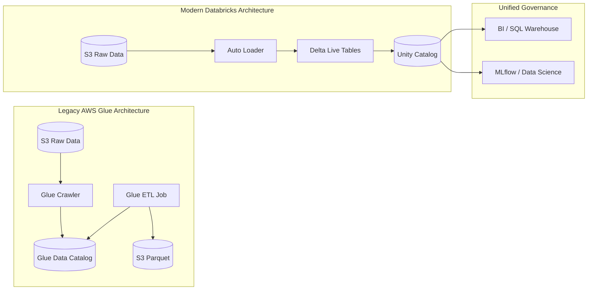

## Migration Strategies: Transitioning from AWS Glue to Databricks

### Section at a Glance
**What you'll learn:**
- Evaluating migration patterns: Lift-and-Shift vs. Re-platforming vs. Refactoring.
- Translating AWS Glue-specific PySpark (`glueContext`) to standard Spark and Delta Lake.
- Migrating metadata from the AWS Glue Data Catalog to Databrical Unity Catalog.
- Transitioning from AWS Glue Crawlers to Databricks Auto Loader and Delta Live Tables (DLT).
- Architecting a continuous migration path that minimizes downtime and data inconsistency.

**Key terms:** `Lift-and-Shift` · `Refactoring` · `Unity Catalog` · `Auto Loader` · `Delta Lake` · `Metadata Parity`

**TL;DR:** Migrating from AWS Glue to Databricks is less about moving data and more about moving *logic and governance*; while your data stays in S3, your compute logic must evolve from Glue-specific APIs to standardized Spark/Delta patterns to unlock the Lakehouse's full value.

---

### Overview
For many enterprises, AWS Glue has served as the reliable, serverless engine for ETL for years. However, as data complexity grows, organizations often encounter "The Glue Wall"—a point where the lack of interactive debugging, the limitations of the Glue Data Catalog's governance, and the difficulty of managing complex dependencies create significant engineering friction.

The business driver for migrating to Databrical is rarely "cheaper compute" and almost always "higher engineering velocity." Customers migrate when they need to move from simple batch ETL to real-time streaming, unified governance (Unity Catalog), and a collaborative environment where Data Scientists and Engineers work on the same compute.

This section covers how to navigate this transition. We will look at how to treat your existing S3 data as the "Single Source of Truth" while fundamentally upgrading the "Brain" of your operations from the Glue Catalog and Jobs to the Databricks Lakehouse.

---

### Core Concepts

#### 1. Migration Archetypes
When approaching a migration, you must choose a strategy based on your budget and desired end-state:
*   **Lift-and-Shift (Re-hosting):** Taking existing PySpark code and running it on Databricks clusters with minimal changes. 
    > ⚠️ **Warning:** Simply running Glue PySpark scripts on Databricks will fail if they rely on `awsglue` libraries or `glueContext`. You must strip out Glue-specific wrappers.
*   **Re-platforming (Re-architecting):** Moving from Glue Jobs to Databricks Workflows and replacing Glue Crawlers with Auto Loader. This is the "sweet spot" for most organizations.
*   **Refactoring:** Re-writing logic to leverage Delta Lake features like `MERGE`, `Z-ORDER`, and Delta Live Tables (DLT). This provides the highest ROI but requires the most engineering effort.

#### 2. Metadata Transition: Glue Catalog to Unity Catalog
The most critical part of the migration is the metadata layer. AWS Glue relies on the Glue Data Catalog, which is often a fragmented collection of tables. Databricks uses **Unity Catalog (UC)** to provide a unified namespace.
*   **Direct Mapping:** You can mount the Glue Catalog to Databr::s, but for a true migration, you must migrate metadata to UC to enable fine-grained access control and lineage.
*   **Consistency:** 📌 **Must Know:** A successful migration ensures that the S3 path remains the same, but the *definition* of the table moves from a Glue Database to a Unity Catalog Schema.

#### 3. The Compute Shift: From Crawlers to Auto Loader
In Glue, you likely use **Crawlers** to infer schema. In Databricks, Crawlers are considered an anti-pattern for high-frequency ingestion.
*   **Auto Loader** uses cloud-native file notification (SNS/SQS) to detect new files in S3 automatically.
*   **Benefit:** This reduces the "metadata latency" (the time between a file landing in S3 and it being queryable).

---

### Architecture / How It Works

The following diagram illustrates the transition from a legacy Glue-centric architecture to a modern Databricks Lakehouse architecture.



1.  **S3 Raw Data:** The persistent storage layer that remains unchanged during migration.
2.  **Auto Loader:** Replaces Glue Crawlers by incrementally processing new files in S3.
3.  **Delta Live Tables (DLT):** Replaces Glue ETL jobs with a declarative framework for managing data pipelines.
4.  **Unity Catalog:** The centralized governance layer replacing the Glue Data Catalog.
5.  **SQL/ML Layers:** The downstream consumers that benefit from the unified metadata.

---

### Comparison: When to Use What

| Strategy | Best For | Trade-offs | Approx. Cost Signal |
| :--- | :--- | :--- | :--- |
| **Lift-and-Shift** | Immediate migration with zero downtime. | Low innovation; inherits technical debt; potential runtime errors. | 🟢 Low initial effort; 🔴 High long-term maintenance. |
| **Re-platform** | Organizations wanting to modernize ETL pipelines. | Moderate effort; requires updating job orchestration. | 🟡 Balanced; replaces Glue DPUs with Databricks DBUs. |
| **Refactor (DLT)** | High-scale, mission-critical production pipelines. | High upfront engineering cost; requires deep Spark/Delta expertise. | 🔴 High upfront cost; 🟢 Lowest operational cost at scale. |

**How to choose:** Start with a **Re-platform** approach for your most stable pipelines to ensure stability, and reserve **Refactoring** for your most expensive, high-growth data streams where the performance gains of DLT will justify the engineering spend.

---

### Cost Cheat Sheet

| Scenario | Recommended Option | Key Cost Driver | Watch Out For |
| :--- | :--- | :--- | :--- |
| **Batch Processing (Nightly)** | Databricks Workflows | Cluster uptime (DBUs) | Leaving clusters running after job completion. |
| **Continuous Ingestion** | Auto Loader + DLT | Cloud Files/File Discovery | High-frequency small file arrivals causing "Small File Problem." |
| **Ad-hoc Data Science** | All-Purpose Compute | Interactive Session duration | Users forgetting to terminate interactive notebooks. |
| **Standard BI/SQL** | SQL Warehouse (Serverless) | SQL Warehouse compute (DBUs) | Over-provisioning warehouse size for simple queries. |

> 💰 **Cost Note:** The single biggest cost mistake in migration is treating Databricks clusters like Glue jobs—not managing the lifecycle of the cluster. Unlike Glue, which is "pay-per-job," Databricks clusters incur costs as long as they are "Running," even if no code is executing.

---

### Service & Integration

#### 1. AWS Glue Catalog Integration
You can allow Databricks to read directly from the AWS Glue Catalog during the transition phase.
1. Configure an External Location in Unity Catalog pointing to the Glue-managed S3 paths.
2. Use the `glue_catalog` integration in Databrities to federate queries.
3. Gradually migrate metadata to Unity Catalog.

#### 2. AWS IAM & Security
1. Use **IAM Roles for Service Accounts (IRSA)** or Instance Profiles to grant Databricks access to S3.
2. Map AWS IAM identities to **Unity Catalog Identities** to maintain a single source of truth for permissions.

---

### Security Considerations

| Control | Default State | How to Enable / Strengthen |
| :--- | :--- | :--- |
| **Data Encryption** | Encrypted at rest (S3) | Use AWS KMS with Customer Managed Keys (CMK). |
| **Access Control** | IAM-based (S3 Bucket Policies) | Implement **Unity Catalog** for fine-grained (Row/Column) security. |
| **Network Isolation** | Public Internet Access | Deploy Databricks in a **Private VPC** with no IGW. |
| **Audit Logging**| CloudTrail | Enable **Databricks Audit Logs** and stream to an S3/Log Analytics bucket. |

---

### Performance & Cost: The Migration ROI

When migrating, you must present a case based on **Compute Efficiency**. 

**Example Scenario:**
You have a Glue job running 10 DPUs (Data Processing Units) for 4 hours every night to process 1TB of data.
*   **Glue Cost:** ~$25/hour $\times$ 4 hours = **$100/night**.
*   **Databricks Cost (Refactored with DLT):** Using a smaller, optimized cluster with Auto Loader, the job completes in 1.5 hours. Even if the DBU rate is higher (e.g., $0.40/DBU), the total cost might drop to **$60/night**.

> 💡 **Tip:** The real savings come from **Incremental Processing**. In Glue, you often re-process entire partitions. In Databricks, using Delta Lake's `MERGE` and Auto Loader means you only process *new* data, drastically reducing the compute window.

---

### Hands-On: Key Operations

#### 1. Refactoring Glue PySpark to Standard Spark
This script converts a Glue-specific `DynamicFrame` read to a standard Spark `DataFrame` read using Delta Lake.

```python
# --- OLD GLUE CODE ---
# from awsglue.context import GlueContext
# glueContext = GlueContext(SparkContext.getOrCreate())
# dyf = glueContext.create_dynamic_frame.from_catalog(database="db", table_name="tbl")

# --- NEW DATABRICKS CODE ---
from pyspark.sql import SparkSession

# Initialize standard Spark session
spark = SparkSession.builder.getOrCreate()

# Read from S3 using the standard Spark/Delta approach
# This is more portable and much faster for schema evolution
df = spark.read.format("delta").load("s3://my-bucket/silver/my_table")

# Perform transformations...
df_transformed = df.filter(df.status == "active")

# Write back as Delta (The modern standard)
df_transformed.write.format("delta").mode("overwrite").save("s3://my-bucket/gold/my_table")
```
> 💡 **Tip:** Notice the removal of `glueContext`. By using `spark.read`, you are now using standard Spark, making your code compatible with any Spark environment, not just AWS.

---

### Customer Conversation Angles

**Q: We already have 500 Glue jobs. Are you saying we have to rewrite all of them?**
**A:** Not necessarily. We can start with a "Lift-and-Shift" to get your workloads running on Databricks immediately, then incrementally refactor the most critical or expensive jobs to take advantage of Delta Lake and DLT.

**Q: Will our data need to be moved out of S3?**
**A:** No. Your data stays exactly where it is in S3. We are simply changing the compute engine and the metadata layer that manages that data.

**Q: How will our existing IAM permissions work with Databricks?**
**A:** We will bridge the two. We can use your existing AWS IAM roles to allow Databricks to access S3, and then layer Unity Catalog on top to provide even more granular, SQL-based permissions for your users.

**Q: Is Databricks more expensive than Glue because of the DBU pricing?**
**A:** While the unit price might look higher, the "Total Cost of Ownership" is often lower because Databricks handles incremental processing much more efficiently, reducing the total compute hours required.

**Q: How do we handle the "Schema Drift" problem we have in Glue?**
**A:** Databricks uses Auto Loader and Delta Lake, which are designed specifically to handle schema evolution automatically without breaking your downstream pipelines.

---

### Common FAQs and Misconceptions

**Q: Can I use the AWS Glue Data Catalog directly in Databricks?**
**A:** Yes, but it is a temporary measure. 
> ⚠️ **Warning:** Relying solely on the Glue Catalog prevents you from using the most powerful features of Unity Catalog, such as fine-grained access control and data lineage.

**Q: Does Databricks replace AWS Glue entirely?**
**A:** Not necessarily. Glue can still be used for very simple, lightweight serverless triggers, but Databricks becomes the primary engine for all complex ETL, streaming, and analytics.

**Q: Does migrating to Databricks require a change in our S3 folder structure?**
**A:** No, but we recommend evolving from a "folder-per-date" structure to a "Delta Lake" format to unlock better performance.

**Q: Is Databricks a managed service or do I have to manage servers?**
**A:** It is a managed service. With "Serverless" options, Databricks manages the compute scaling and infrastructure for you, much like Glue.

---

### Exam & Certification Focus
*   **Domain: Data Transformation (Refactoring):** Understand the difference between `DynamicFrames` and `DataFrames`.
*   **Domain: Data Governance (Metadata):** Be able to explain how Unity Catalog replaces/augments the Glue Data Catalog.
*   **Domain: Data Ingestion (Architecture):** Know when to use Auto Loader vs. traditional batch processing. 📌 **Must Know:** Auto Loader is the preferred way to ingest files from S3 into a Lakehouse.

---

### Quick Recap
- **Data stays in S3;** only the compute and metadata layers change.
- **Avoid `glueContext`** in your new Databricks notebooks to ensure portability and performance.
- **Use Auto Loader** to replace Glue Crawlers for more efficient, event-driven ingestion.
- **Unity Catalog** is the cornerstone of modern Databricks governance, replacing Glue Catalog.
- **Refactoring to Delta Lake** provides the highest ROI through incremental processing and ACID transactions.

---

### Further Reading
**Databricks Documentation** — Comprehensive guide on Auto Loader and DLT.
**AWS Whitepaper: Lake House Architecture** — How to build modern data platforms on AWS.
**Unity Catalog Fundamentals** — Deep dive into governance and metadata migration.
**Delta Lake Official Docs** — Understanding ACID transactions and schema evolution.
**AWS Glue Documentation** — Reference for understanding your legacy source logic.