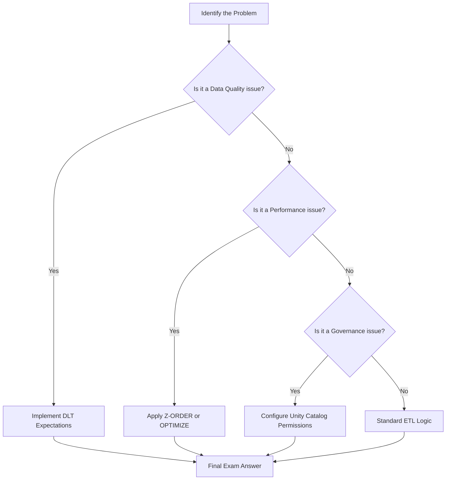

## Exam Readiness and Final Review

### Section at a Glance
**What you'll learn:**
- How to map technical Databricks features to specific exam domains.
- Strategies for decoding complex, multi-part exam questions.
- A final gap analysis of the Medallion Architecture, Delta Lake, and Unity Catalog.
- How to approach "best practice" questions regarding cost and performance.
- Final preparation for the transition from AWS Glue/EMR workflows to Databricks-native orchestration.

**Key terms:** `Exam Domains` · `Medallion Architecture` · `Delta Lake Optimization` · `Unity Catalog` · `Structured Streaming` · `Data Pipeline Orchestration`

**TL;DR:** This final section provides a strategic blueprint for passing the Databricks Certified Data Engineer Associate exam by synthesizing the course's technical pillars into a cohesive, exam-ready mental model.

---

### Overview
Passing a professional-level certification is not merely about memorizing syntax; it is about demonstrating architectural judgment. For a Data Engineer transitioning from AWS Glue or EMR, the challenge often lies in moving from "how to write a script" to "how to design a robust, governed, and cost-effective Lakehouse."

The Databricks Certified Data Engineer Associate exam tests your ability to navigate the **Data Engineering Lifecycle**. The business value of this certification lies in your ability to reduce "technical debt" and "operational toil." When a customer asks, "How do we ensure our pipelines don't break when the schema changes?" or "How do we prevent our S3 costs from spiraling due to small files?", they are looking for the exact architectural patterns covered in this course.

This section serves as your final audit. We will move away from the "how-to" of individual functions and move toward the "why" of architectural decisions, ensuring you are prepared for the situational questions that define the difficulty of this exam.

---

### Core Concepts

To succeed, you must master the four pillars of the exam syllabus.

#### 1. Data Processing (The Engine)
You must understand how **Delta Lake** provides ACID transactions on top of S3. 
*   **Schema Enforcement vs. Evolution:** Know when a write will fail (Enforcement) and how to permit changes (Evolution).
*   **Optimization:** Understand the mechanics of `OPTIMIZE` (compaction) and `Z-ORDER` (multi-dimensional clustering). 
📌 **Must Know:** The exam frequently tests the difference between `VACUUM` (removing old files) and `OPTIMIZE` (compacting current files). ⚠️ **Warning:** Running `VACUUM` with a retention period shorter than your Delta Log history can lead to data loss and broken transactions.

#### 2. Data Modeling (The Structure)
The **Medallion Architecture** is the heart of the exam.
*   **Bronze:** Raw ingestion, often containing duplicates or unstructured data.
*   **Silver:** Filtered, cleaned, and augmented data. The "source of truth."
*   **Gold:** Aggregated, business-level tables ready for BI.

#### 3. Data Orchestration (The Workflow)
You must distinguish between **Standard Jobs** and **Delta Live Tables (DLT)**.
*   **DLT:** Declarative pipelines that handle infrastructure, dependencies, and quality constraints (Expectations) automatically.
*   **Workflows:** Task orchestration, retries, and dependency management.

#### 4. Data Security (The Governance)
With the shift to **Unity Catalog**, focus on:
*   **Identity Management:** Users, Groups, and Service Principals.
*   **Access Control:** `GRANT` and `REVOKE` on catalogs, schemas, and tables.
*   **Lineage:** The ability to trace data from Bronze to Gold.

---

### Architecture / How It Works

The following diagram illustrates the "Exam Decision Logic"—the mental process you should use when presented with a scenario-based question.



1.  **Identify the Problem:** Read the scenario to determine if the pain point is latency, cost, reliability, or security.
2.  **Identify the Layer:** Determine which Medallion layer (Bronze, Silver, or Gold) is being discussed.
3.  **Select the Feature:** Choose the Databricks-native feature (e.g., DLT, Unity Catalog, Delta Lake) that solves the specific problem.
4.  **Validate Constraints:** Ensure your choice adheres to the constraints mentioned (e._g., "must be low cost" or "must be near real-time").

---

### Comparison: When to Use What

| Feature | Best For | Trade-offs | Approx. Cost Signal |
| :--- | :--- | :--- | :--- |
| **Standard Spark Jobs** | Simple, one-off ETL or complex custom logic. | Requires manual management of dependencies and retries. | Moderate (Compute-heavy) |
| **Delta Live Tables (DLT)** | Production-grade, declarative, self-healing pipelines. | Higher abstraction; less "low-level" control over Spark tuning. | Higher (Managed overhead) |
| **Structured Streaming** | Low-latency, near real-time data ingestion. | Requires "checkpointing" and managing state/watermarks. | High (Requires 24/7 clusters) |
| **Auto Loader** | Ingesting files from S3 as they arrive. | Optimized for cloud storage; reduces manual file listing. | Low (Efficiently scales) |

**How to choose:** If the requirement emphasizes **reliability and automation**, choose DLT. If the requirement emphasizes **cost-efficiency for batch processing**, choose Standard Jobs with Auto Loader.

---

### Cost Cheat Sheet

| Scenario | Recommended Option | Key Cost Driver | Watch Out For |
| :--- | :--- | :--- | :--- |
| Frequent small file arrivals | **Auto Loader** | Cloud Object Store API calls | Not using `cloudFiles` format |
| High-frequency dashboard updates | **Gold Layer (Aggregated)** | Compute uptime (Always-on clusters) | Querying Bronze/Silver directly |
| Large-scale historical re-processing | **Serverless SQL Warehouses** | Query execution time | Over-provisioning warehouse size |
| Long-term data retention | **Delta Lake + VACUUM** | S3 Storage (Versioning) | Setting `VACUEM` retention too high |

💰 **Cost Note:** The single biggest cost mistake in Databricks on AWS is leaving **All-Purpose Compute** clusters running for automated production workloads. Always use **Job Clusters** for production ETL; they are significantly cheaper per DBU (Databricks Unit).

---

### Service & Integrations

1.  **AWS S3 & Databricks:** The foundational integration. S3 acts as the physical storage layer (the "Data Lake"), while Databricks provides the "Lakehouse" management layer.
2.  **AWS IAM & Unity Catalog:** Security integration. Use IAM roles to grant Databricks access to S3, but use Unity Catalog to manage fine-grained access to the data *inside* those S3 buckets.
3.  **AWS Glue Catalog & Unity Catalog:** Migration pattern. Use the Glue Catalog connector to allow Databricks to read existing metadata, then gradually migrate metadata into Unity Catalog for centralized governance.

---

### Security Considerations

| Control | Default State | How to Enable / Strengthen |
| :--- | :--- | :--- |
| **Data Encryption** | Encrypted at rest (S3-SSE) | Use AWS KMS for customer-managed keys (CMK). |
| **Network Isolation** | Accessible via Databricks UI | Deploy Databricks in your VPC using Private Link. |

| **Fine-grained Access** | All or nothing (at S3 level) | Use **Unity Catalog** to grant access to specific rows/columns. |
| **Audit Logging** | Standard CloudTrail logs | Enable **Databricks Audit Logs** to track workspace activity. |

---

### Performance & Cost

**The "Small File Problem" Scenario:**
Imagine a pipeline ingesting 1,000 small JSON files every hour into a Bronze table. 
*   **Impact:** Over time, the metadata overhead of reading 1,000 files per hour creates massive latency and increases S3 `LIST` request costs.
*   **Solution:** Implement `OPTIMIZE` on a schedule.
*   **Cost Example:** If a job takes 10 minutes to run but spends 8 minutes just "discovering" files, you are paying for 8 minutes of idle compute. By compacting these into larger files, the job might drop to 2 minutes, reducing compute costs by ~80% for that task.

---

### Hands-On: Key Operations

**1. Implementing Data Quality with DLT (Expectations)**
Use this to prevent "garbage in, garbage out" by dropping records that fail validation.
```sql
-- This DLT snippet defines a constraint that drops records with null IDs
CREATE OR REPLACE LIVE TABLE silver_users
(
  CONSTRAINT valid_user_id EXPECT (user_id IS NOT NULL) ON VIOLATION DROP ROW
)
AS SELECT * FROM LIVE.bronze_users;
```
💡 **Tip:** Use `ON VIOLATION FAIL UPDATE` if the data quality is mission-critical and the pipeline must stop on error.

**2. Optimizing a Table**
Run this to compact small files and improve query performance.
```sql
-- Compacting files and re-organizing data by a specific column
OPTIMIZE sales_data
ZORDER BY (transaction_date, store_id);
```

**3. Cleaning up old data**
Use this to manage storage costs by removing files no longer needed by the Delta Log.
```sql
-- Remove files no longer in the current state of the transaction log
VACUUM sales_data RETAIN 168 HOURS; 
```
⚠️ **Warning:** Do not run `VACUUM` with a retention period of 0 unless you are certain you don't need to "Time Travel" back to previous versions.

---

### Customer Conversation Angles

**Q: We already use AWS Glue for our ETL. Why should we move to Databricks?**
**A:** While Glue is excellent for serverless Spark, Databricks offers a unified "Lakehouse" approach, providing much deeper support for Delta Lake optimizations, superior governance via Unity Catalog, and significantly faster performance for complex workloads.

**Y: How do we ensure our data scientists aren't seeing sensitive PII data?**
**A:** We implement Unity Catalog, which allows us to define column-level security and row-level filtering, ensuring users only see the data they are explicitly authorized to see.

**Q: Will moving to Databricks increase our AWS S3 costs?**
**A:** Not necessarily. In fact, by using features like Auto Loader and Delta Lake's `OPTIMIZE`, we can reduce the number of expensive S3 API calls and improve data efficiency, which often offsets the cost of the Databrrics compute.

**Q: How can we trust the quality of the data in our Gold tables?**
**A:** We use Delta Live Tables (DLT) with "Expectations," which allows us to programmatically define data quality rules that automatically quarantine or drop invalid data before it reaches downstream users.

**Q: Can we keep our existing data in S3 as-is?**
**A:** Absolutely. Databricks is designed to work directly on top of your existing S3 data lake, allowing for an incremental migration rather than a "rip and replace" approach.

---

### Common FAQs and Misconceptions

**Q: Is Databricks just a managed version of Spark?**
**A:** No. While it uses Spark, it is a complete Data Intelligence Platform that includes Delta Lake, Unity Catalog, and specialized engines for SQL and Streaming.

**Q: Does `VACUUM` delete my data forever?**
**A:** It deletes files that are no longer referenced in the current Delta Log. ⚠️ **Warning:** Once `VACUUM` removes a file, you can no longer use "Time Travel" to see the table as it existed before that file was deleted.

**Q: Is Delta Lake a separate database we have to install?**
**A:** No, Delta Lake is an open-source storage layer that sits on top of your existing S3 files.

**Q: Can I use Databricks with my existing AWS IAM roles?**
**A:** Yes, Databricks integrates deeply with AWS IAM, allowing you to use instance profiles or Unity Catalog storage credentials to manage access.

**Q: Does DLT replace Spark?**
**A:** No, DLT is a high-level orchestration framework that *uses* Spark under the hood to execute your pipelines.

---

### Exam & Certification Focus

*   **Data Processing (30%):** Focus on Delta Lake features (Time Travel, ACID, Schema Evolution) and Spark Structured Streaming (Watermarking, Checkpointing). 📌 **High Frequency: Z-ORDER and OPTIMIZE.**
*   **Data Modeling (25%):** Focus on the purpose of each Medallion layer and the characteristics of Bronze vs. Silver vs. Gold.
*   **Data Orchestration (25%):** Focus on DLT (Expectations, Pipelines) and Databricks Workflows (Task dependencies, Retries).
*   **Data Security (20%):** Focus on Unity Catalog (Privileges, Catalogs, Schemas) and secure data ingestion. 📌 **High Frequency: Identity management and Grant/Revoke syntax.**

---

### Quick Recap
- **Medallion Architecture** is the standard for organizing data quality layers.
- **Delta Lake** provides the essential ACID and performance features (Optimize/Z-Order).
- **Unity Catalog** is the centralized governance engine for all data and identity.
- **DLT** simplifies complex, production-grade ETL with built-in quality checks.
- **Cost Efficiency** is achieved by using Job Clusters and optimizing file sizes.

---

### Further Reading
**Databricks Documentation** — The definitive source for syntax, API references, and feature updates.
**Delta Lake Documentation** — Deep dive into storage internals, ACID, and transaction logs.
**Databricks Academy** — Official training modules and practice exams for certification prep.
**AWS Whitepapers (Data Lake on S3)** — Context on how Databricks sits within the broader AWS ecosystem.
**Unity Catalog Guide** — Detailed tutorials on implementing fine-grained access control and lineage.