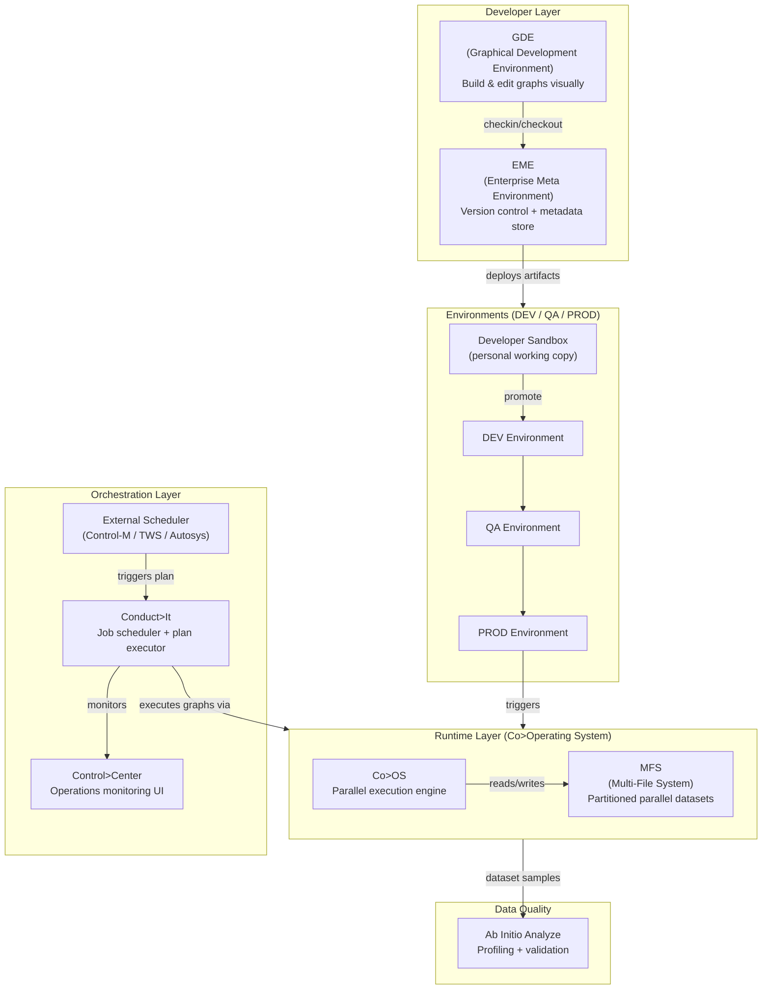

# Ab Initio — SA Migration Guide

**Purpose:** Give a Solution Architect enough depth to assess an Ab Initio estate, understand its moving parts, and map a migration path to Databricks.

This is not a developer guide. You won't be building Ab Initio graphs. You will be walking customer sites, reviewing architecture diagrams, asking the right questions, and scoping what it takes to move to a modern lakehouse platform.

---

## Architecture Diagrams

### Ab Initio Platform Architecture

How the Ab Initio product suite fits together — from developer tooling through runtime execution to operations.



---

### Ab Initio as ETL — Data Flow Between Systems

How Ab Initio sits between source systems and targets in a typical enterprise data pipeline.

```mermaid
flowchart LR
    subgraph SOURCES["Source Systems"]
        DB[("Relational DB\nOracle / DB2 / SQL Server")]
        MF["Mainframe\nVSAM / Flat files"]
        FILES["Flat Files\nFixed-width / Delimited"]
        API["Upstream Apps\nvia file drop or DB write"]
    end

    subgraph ABINIT["Ab Initio ETL Layer"]
        direction TB
        INGEST["Input Components\n(Read from DB, Input File)"]
        TRANSFORM["Transformation Graphs\nReformat · Join · Rollup · Filter\nDedup · Normalize · Validate"]
        MFS_INT[("MFS Intermediate\nPartitioned parallel datasets\nbetween pipeline stages")]
        OUTPUT["Output Components\n(Write to DB, Output File)"]

        INGEST --> TRANSFORM
        TRANSFORM -- intermediate storage --> MFS_INT
        MFS_INT --> TRANSFORM
        TRANSFORM --> OUTPUT
    end

    subgraph TARGETS["Target Systems"]
        DW[("Data Warehouse\nTeradata / Netezza / Redshift")]
        DATALAKE["Data Lake\nHDFS / S3 / ADLS"]
        RPTDB[("Reporting DB\nSQL Server / Oracle")]
        DOWNSTREAM["Downstream Apps\nvia file or DB"]
    end

    subgraph ORCH["Orchestration"]
        PLAN["Conduct>It Plan\nSequences graphs\nacross the pipeline"]
    end

    SOURCES --> INGEST
    OUTPUT --> TARGETS
    PLAN -. schedules .-> ABINIT
```



---

## Sections

1. [Ecosystem Overview](#1-ecosystem-overview)
2. [Graphs and Components — The Core Building Block](#2-graphs-and-components--the-core-building-block)
3. [Data Formats and DML](#3-data-formats-and-dml)
4. [Parallelism and Layouts](#4-parallelism-and-layouts)
5. [Project Structure and EME](#5-project-structure-and-eme)
6. [Orchestration: Conduct>It and Control>Center](#6-orchestration-conductit-and-controlcenter)
7. [Metadata, Lineage, and Impact Analysis](#7-metadata-lineage-and-impact-analysis)
8. [Data Quality with Analyze](#8-data-quality-with-analyze)
9. [Ab Initio File Formats Reference](#9-ab-initio-file-formats-reference)
10. [Migration Assessment and Artifact Inventory](#10-migration-assessment-and-artifact-inventory)
11. [Migration Mapping to Databricks](#11-migration-mapping-to-databricks)

---

## 1. Ecosystem Overview

### What Is Ab Initio?

Ab Initio is an enterprise-grade data integration and ETL platform built for **high-volume, high-performance parallel processing**. It has been a dominant player in large financial institutions, insurance companies, telecoms, and government agencies since the 1990s. Customers choose it because it can process billions of records reliably — and for decades, it was one of the few tools that could do so at scale.

Unlike cloud-native ETL tools, Ab Initio is:

- **Closed source and proprietary** — no community edition, no public pricing, documentation is behind a customer portal
- **License-gated and expensive** — typically one of the largest line items in an enterprise data platform budget
- **On-premises first** — increasingly run on cloud VMs, but not built for cloud-native deployment
- **Talent-scarce** — Ab Initio developers are rare and expensive, which is often the real driver behind migration

### The Ab Initio Product Suite

Ab Initio is a suite of products. Knowing which ones a customer uses determines migration scope.

| Product | What It Does | Migration Relevance |
|---------|-------------|---------------------|
| **GDE** (Graphical Development Environment) | The IDE where developers build ETL graphs visually | High — all transformation logic lives here |
| **Co>Operating System (Co>OS)** | The runtime engine that executes graphs in parallel | High — the parallelism model must be replicated |
| **EME** (Enterprise Meta Environment) | Metadata repository — stores graph definitions, versions, lineage | High — source of truth for estate inventory |
| **Conduct>It** | Job scheduler and orchestration engine | High — all pipeline scheduling lives here |
| **Control>Center** | Operations monitoring and job management UI | Medium — maps to Databricks Workflows UI |
| **Data Profiler / Analyze** | Data quality and profiling tool | Medium — maps to Databricks expectations or DQE |
| **Metadata Hub** | Enterprise lineage and data catalog integration | Medium — maps to Unity Catalog lineage |

> **SA Tip:** Ask which products are actively used day-to-day. Many customers have the full suite licensed but only use GDE, Co>OS, Conduct>It, and EME. The rest is often shelf-ware.

### Why Customers Want to Migrate

| Driver | What It Means for the Engagement |
|--------|----------------------------------|
| **Cost** | License fees are the primary stated target — migration must reduce TCO |
| **Talent** | Ab Initio developers are scarce — customers want a platform where more people can contribute |
| **Cloud strategy** | Board-level mandate to move off on-prem |
| **Speed of delivery** | Ab Initio development cycles are slow — customers want git-native, agile pipelines |
| **Vendor lock-in** | Single vendor, no open ecosystem, no portability |

> **SA Tip:** "Cost" is almost always present, but it's often a proxy for "we can't find people who know this tool." Frame Databricks as a platform developers already know — Python, SQL, Spark — that's often the most compelling pitch.

### Key Discovery Questions

Before scoping a migration, ask:

1. How many graphs are in **active production** use? (vs. total graphs in EME — there will be a lot of dead code)
2. What is the average and maximum **record volume** processed per day?
3. What are the **source and target systems**? (databases, flat files, mainframe, cloud storage)
4. How is orchestration done — Conduct>It plans, external scheduler (Control-M, TWS), or both?
5. Are there **custom components** — transforms written in C or PDL?
6. What does the **promotion process** look like? (dev → QA → prod)
7. Is EME metadata **current and trusted**, or has it drifted from what's actually running?
8. What are the **SLAs** for critical pipelines?

---

## 2. Graphs and Components — The Core Building Block

### The Graph

In Ab Initio, the **graph** is the fundamental unit of work — equivalent to a pipeline or job in modern ETL tools. A graph is a directed acyclic dataflow: data enters from sources, passes through a series of transformation components, and exits to targets.

Visually, a graph looks like a flowchart of boxes (components) connected by arrows (flows). Developers build graphs in the GDE by dragging and dropping components onto a canvas and wiring them together.

A single Ab Initio estate can have **thousands of graphs** — many of them legacy, unused, or duplicated across environments.

### Components

A **component** is a single processing step inside a graph. Ab Initio ships with a large library of built-in components, and customers can write custom ones. Components are the Ab Initio equivalent of Spark transformations.

**Core component categories:**

| Category | Examples | What They Do |
|----------|----------|--------------|
| **Input/Output** | `Input File`, `Output File`, `Read from DB`, `Write to DB` | Source and sink connectors |
| **Transform** | `Reformat`, `Normalize`, `Denormalize` | Field-level transformations, schema reshaping |
| **Filter & Route** | `Filter`, `Route` | Conditional row filtering and splitting |
| **Join & Lookup** | `Join`, `Lookup File`, `Lookup` | Merging datasets, enrichment |
| **Aggregate** | `Rollup`, `Scan`, `Running Total` | Group-by aggregations, running calculations |
| **Sort** | `Sort`, `Merge` | Ordering and merging sorted streams |
| **Deduplicate** | `Dedup Sorted`, `Dedup Unsorted` | Removing duplicate records |
| **Generate** | `Create Data`, `Generate Records` | Synthetic or sequence data generation |
| **Control** | `Run Graph`, `Run Program` | Calling sub-graphs or shell scripts |

### Ports and Flows

Each component has **input ports** and **output ports** — typed connection points that define what data enters and exits. A **flow** is a connection between an output port of one component and an input port of another. Flows carry records from component to component.

- **Out port** — data leaving a component after processing
- **Error port** — records that failed processing (bad records, type mismatches)
- **Reject port** — records intentionally excluded by business logic (e.g., failed validation)

> **Migration relevance:** Error and reject port handling is often where business-critical logic hides. When inventorying graphs, always document what happens to error and reject flows — they frequently feed downstream exception-handling pipelines that get missed in migrations.

### Sub-graphs and Reusability

Ab Initio supports **wrapped graphs** — a graph can call another graph as a component. This is the primary reuse mechanism. A large pipeline might consist of a master graph that orchestrates dozens of wrapped sub-graphs.

When you see a customer's graph count, understand that the **effective complexity** is in the dependency chain — one graph might invoke 20 others. This is what you need to map before scoping.

---

## 3. Data Formats and DML

### Ab Initio DML (Data Manipulation Language)

DML is Ab Initio's proprietary schema definition language. It describes the **structure of records** flowing between components — field names, data types, lengths, and nested structures. Think of it as a strongly typed schema file that Ab Initio uses at runtime to parse, validate, and process data.

Every dataset that flows through an Ab Initio graph has a DML definition attached to it. DML files (`.dml`) are stored in the project directory and referenced by graphs and components.

**A simple DML example:**

```
record
  integer(4)  customer_id;
  string(50)  customer_name;
  decimal(10,2) account_balance;
  date("%Y-%m-%d") open_date;
end
```

**Key DML concepts for migration:**

| Concept | Description | Databricks Equivalent |
|---------|-------------|----------------------|
| `record` | Defines a flat record structure | DataFrame schema / StructType |
| `integer(n)` | Fixed-length integer, n bytes | IntegerType / LongType |
| `string(n)` | Fixed-length or variable string | StringType |
| `decimal(p,s)` | Precision-scale decimal | DecimalType(p,s) |
| `date(format)` | Date with format string | DateType + format hint |
| `subrec` | Nested record (struct) | StructType nested field |
| `vector[]` | Repeating group (array) | ArrayType |

> **Migration relevance:** DML files are the schema contract between stages. A customer with complex DML (nested subrecs, vectors, custom types) will require more schema mapping effort during migration. Collect all `.dml` files from EME as part of the artifact inventory.

### Dataset Types

Ab Initio uses several dataset formats depending on the processing model:

| Dataset Type | Description | Migration Note |
|-------------|-------------|----------------|
| **Multi-File System (MFS)** | Partitioned parallel dataset — the default for large-volume processing | Must be fully read before migrating; maps to partitioned Delta tables |
| **Flat file** | Standard delimited or fixed-width file | Directly readable in Databricks |
| **Ab Initio serial file** | Proprietary binary serial format | Requires conversion — not directly readable outside Ab Initio |
| **Database table** | Direct JDBC read/write | Straightforward migration |
| **Tape/VSAM** | Mainframe-origin formats (common in banks) | Requires mainframe offload step before Databricks ingestion |

> **SA Tip:** The presence of Ab Initio serial files or MFS datasets in the middle of a pipeline is a red flag — those intermediate stores are invisible to anything outside Ab Initio. Document them carefully; migrating them means changing intermediate storage to Delta or Parquet.

---

## 4. Parallelism and Layouts

### Why Parallelism Matters for Migration

Ab Initio's primary differentiator has always been **native parallel processing**. Understanding how it achieves parallelism is essential for scoping a migration — because replicating that behavior in Databricks requires understanding what the customer built and why.

### The Multi-File System (MFS)

The **Multi-File System** is Ab Initio's parallel file system. It partitions a large dataset across multiple physical files — one per partition — and processes all partitions simultaneously using multiple CPU cores or nodes.

When you open a graph and see an input dataset, it almost certainly points to an MFS directory containing many partition files (e.g., `data.0`, `data.1`, ... `data.N`). The degree of parallelism is set by how many partitions exist.

### Layout Files

A **layout** defines the physical mapping of parallelism — how many partitions, on which machines, in which directories. Layouts are stored as `.lay` files and are environment-specific (dev has a different layout from prod, usually because prod has more servers).

```
# Example layout concept
partition 0: /data/abinit/mfs/customer/part0
partition 1: /data/abinit/mfs/customer/part1
partition 2: /data/abinit/mfs/customer/part2
partition 3: /data/abinit/mfs/customer/part3
```

> **Migration relevance:** Layouts are environment configuration, not logic. When migrating to Databricks, the concept disappears — Spark handles partitioning automatically. But you need to know the **degree of parallelism** the customer is running (e.g., 32 partitions) to right-size the Databricks cluster.

### Partition Strategies

When data moves between components, Ab Initio must decide how to **re-partition** it — which records go to which partition. This is equivalent to Spark's shuffle.

| Ab Initio Partition By | What It Does | Databricks Equivalent |
|------------------------|-------------|----------------------|
| `Round Robin` | Distributes records evenly across partitions | `repartition(n)` |
| `Hash` | Routes matching keys to the same partition | `repartition(col)` |
| `Key Range` | Splits records by value range | Range partitioning |
| `Broadcast` | Copies all data to every partition | `broadcast()` hint |
| `Concatenate` | Merges all partitions into one | `coalesce(1)` |

> **SA Tip:** A graph with many `Hash` partition-bys followed by `Sort` and `Join` is doing the equivalent of a Spark hash join with shuffle. This is usually the most expensive part of an Ab Initio pipeline — and it maps cleanly to Spark. Identify these patterns during the inventory phase.

---

## 5. Project Structure and EME

### The EME (Enterprise Meta Environment)

The **EME** is Ab Initio's central metadata repository. It stores every graph, DML file, parameter file, and configuration object — versioned, with history. Think of it as a combination of Git and a data catalog rolled into one proprietary system.

The EME is your **best friend during migration assessment**. It is the authoritative inventory of everything that has ever been built in the Ab Initio environment.

### Project Structure

Within the EME, artifacts are organized into **projects** and **sandboxes**:

```
EME
 └── Project: Finance_ETL
       ├── Sandbox: dev_john          ← developer working copy
       ├── Sandbox: dev_sarah
       ├── Environment: DEV           ← shared dev environment
       ├── Environment: QA
       └── Environment: PROD          ← what's actually running
```

| Concept | What It Is | Equivalent |
|---------|-----------|------------|
| **Project** | Top-level grouping of related graphs and artifacts | Git repository / Databricks workspace folder |
| **Sandbox** | A developer's personal working copy of a project | Git feature branch |
| **Environment** | A deployed, shared instance (DEV, QA, PROD) | Databricks environment (dev/staging/prod) |
| **Checkin/Checkout** | Version control operations on artifacts | `git commit` / `git checkout` |

### Key Artifact Types in EME

When inventorying an Ab Initio estate, these are the artifact types to catalog:

| Artifact | File Extension | What It Contains |
|----------|---------------|-----------------|
| **Graph** | `.mp` | The ETL pipeline logic — the primary migration target |
| **DML** | `.dml` | Record/schema definitions |
| **Parameter file** | `.dml` (typed), `.prm` | Runtime parameters (dates, paths, DB connections) |
| **Layout** | `.lay` | Parallelism configuration |
| **Script** | `.ksh`, `.sh`, `.bat` | Shell scripts invoked by graphs |
| **Plan** | `.pln` | Conduct>It orchestration plan (job dependency graph) |
| **Transform** | `.xfr` | Reusable transform expressions (like UDFs) |

> **Migration relevance:** The `.mp` graph files and `.dml` schema files are the core migration payload. The `.pln` plan files tell you the orchestration. Everything else is supporting configuration.

### Promotion Workflow

Code moves through environments via a formal **promotion process**:

```
Developer Sandbox → DEV environment → QA environment → PROD environment
```

This promotion is managed through the EME and typically requires approvals. It is the Ab Initio equivalent of a CI/CD pipeline — but manual and GUI-driven. When migrating, this process gets replaced by Databricks Asset Bundles or a proper CI/CD pipeline with Git.

---

## 6. Orchestration: Conduct>It and Control>Center

### Conduct>It — The Orchestration Engine

**Conduct>It** is Ab Initio's built-in job scheduler. It defines **plans** — a dependency graph of jobs (graph executions) that run in a specific order, with conditions, retries, and branching logic.

A Conduct>It plan is the Ab Initio equivalent of a Databricks Workflow or an Apache Airflow DAG.

**Key plan concepts:**

| Concept | Description | Databricks Equivalent |
|---------|-------------|----------------------|
| **Plan** | A named orchestration workflow containing steps | Databricks Workflow / DAG |
| **Step** | A single job execution within a plan (runs a graph) | Databricks Workflow Task |
| **Dependency** | A step that must complete before another starts | Task dependency in Workflow |
| **Condition** | A success/failure branch — different steps run depending on outcome | `if_else` in Workflow |
| **Pset (Parameter Set)** | A named set of runtime parameters passed to a graph | Job parameters / widget defaults |
| **Start Event** | The trigger for a plan — time-based, file-arrival, or upstream plan completion | Workflow schedule / file trigger |

### Plan Structure Example

A typical Ab Initio plan for a nightly batch load might look like:

```
Plan: NIGHTLY_CUSTOMER_LOAD
  Step 1: Extract_Customer_Source       (no dependency — runs first)
  Step 2: Validate_Customer_Records     (depends on Step 1 success)
  Step 3: Load_Customer_Warehouse       (depends on Step 2 success)
  Step 4: Update_Audit_Log              (depends on Step 3 success)
  Step 5: Send_Failure_Alert            (runs only if Step 2 or Step 3 fails)
```

This maps directly to a Databricks Workflow with task dependencies and `on_failure` tasks.

### Control>Center — Operations and Monitoring

**Control>Center** is the operations UI — it shows running jobs, historical run logs, success/failure status, and allows operators to rerun failed steps.

| Control>Center Feature | Databricks Equivalent |
|-----------------------|----------------------|
| Job run history | Workflow run history |
| Real-time job status | Workflow run monitoring |
| Manual step rerun | Task repair run |
| Alerting on failure | Workflow notification |
| Audit log | Databricks audit logs / Unity Catalog |

### External Schedulers

Many enterprise Ab Initio environments don't use Conduct>It alone — they use an **external enterprise scheduler** (IBM Workload Scheduler / TWS, BMC Control-M, CA7, Autosys) to trigger Ab Initio plans. In this case:

- The external scheduler handles **timing and cross-system dependencies** (e.g., "wait for the mainframe file to arrive")
- Conduct>It handles **intra-Ab Initio dependencies** (step ordering within the plan)

> **Migration relevance:** If the customer uses an external scheduler, the migration involves two layers: replacing Conduct>It plans with Databricks Workflows, AND replacing or integrating with the external scheduler. This is often underestimated in migration scoping.

---

## 7. Metadata, Lineage, and Impact Analysis

### What EME Tracks

The EME doesn't just store artifacts — it tracks **relationships** between them. This metadata is the foundation for impact analysis: understanding what breaks when you change something.

| Relationship Type | Example |
|-------------------|---------|
| Graph uses DML | `customer_load.mp` reads `customer_record.dml` |
| Graph reads dataset | `customer_load.mp` reads `/data/mfs/customers` |
| Graph calls sub-graph | `master_load.mp` invokes `customer_load.mp` |
| Plan runs graph | `NIGHTLY_LOAD.pln` executes `customer_load.mp` |
| Transform used by graph | `format_date.xfr` used in `customer_load.mp` |

### Impact Analysis

Before changing or removing any artifact, Ab Initio developers run an **impact analysis** — a query against the EME that shows everything that depends on the artifact being changed.

This is critical for migration planning. When you're migrating a shared DML schema or a reused transform, you need to know every graph that references it.

> **Migration relevance:** Use EME impact analysis queries during inventory to identify **high-fan-out artifacts** — DML files or transforms used by many graphs. These are migration dependencies: you can't migrate graph A until you've also migrated the DML and transforms it shares with graphs B, C, and D.

### Data Lineage

EME can trace data lineage at the field level — which source field flows through which components to produce which target field. This is the most valuable metadata for migration, and also the most commonly incomplete.

**Common lineage gaps to watch for:**

- Graphs that read from shell scripts (lineage breaks at the script boundary)
- Datasets written by external processes and read by Ab Initio (lineage starts mid-chain)
- Parameter-driven paths where the actual dataset location is only known at runtime

> **SA Tip:** Don't over-rely on EME lineage being complete or current. Always validate with the actual developers who run the pipelines day-to-day. EME is a starting point, not the final word.

---

## 8. Data Quality with Analyze

### What Ab Initio Analyze Does

**Ab Initio Analyze** (also called Data Profiler) is a profiling and data quality tool that examines datasets and produces statistics — value distributions, null rates, pattern matching, referential integrity checks.

In a migration context, Analyze outputs help you understand:
- What the data actually looks like (vs. what the DML says it should look like)
- Where quality issues already exist that will carry over into the migrated environment
- Which fields are candidates for data quality rules post-migration

### Analyze Components in Graphs

Data quality checks in Ab Initio are often embedded directly inside ETL graphs as **Analyze components**:

| Component | What It Does | Databricks Equivalent |
|-----------|-------------|----------------------|
| `Validate` | Checks records against rules, routes invalid records to reject port | Delta Live Tables `expect()` / Great Expectations |
| `Reformat` (with validation) | Transforms and validates field values simultaneously | UDF with validation logic in DLT |
| `Scan` | Passes records through while computing running statistics | Streaming aggregation / DQE |
| `Check` | Compares actual vs. expected counts or values | Delta Live Tables quarantine pattern |

> **Migration relevance:** Embedded quality checks in graphs are business logic — they must be migrated, not skipped. Document every `Validate` and `Check` component and its ruleset during inventory. These map to DLT expectations or Great Expectations in Databricks.

### Quality Reports

Analyze produces HTML or flat-file quality reports that summarize dataset health. Customers who run these regularly have a baseline for post-migration validation — use them to define your **data reconciliation criteria** after the Databricks pipeline goes live.

---

## 9. Ab Initio File Formats Reference

When you walk into a customer's Ab Initio environment, you will encounter a specific set of file types in every project directory. Knowing what each file is, what it contains, and what it means for migration is essential for artifact inventory.

---

### `.mp` — Graph (Main Program)

The `.mp` file is the **core artifact** — it defines a single ETL graph. It is a binary or XML-encoded file that GDE reads and renders as the visual dataflow canvas. Every component on the canvas, every connection between them, every expression and parameter reference is stored in this file.

| Property | Detail |
|----------|--------|
| **Created by** | GDE — developers build and save graphs visually |
| **Stored in** | EME (versioned) and deployed to environment directories |
| **Contains** | Component definitions, port connections, layout references, DML references, parameter references |
| **Human-readable?** | Partially — newer versions are XML-based but verbose and not meant to be edited by hand |
| **Migration target** | Each `.mp` is a migration unit — maps to a Databricks notebook, Python script, or DLT pipeline |

> **SA Tip:** The count of `.mp` files in active production is your primary migration scope number. Always filter by last-run date — large estates commonly have 30–40% dead graphs that were never cleaned up.

---

### `.dml` — Data Manipulation Language (Schema Definition)

The `.dml` file defines the **record structure** of a dataset — field names, types, lengths, and nested structures. Every input, output, and intermediate dataset in Ab Initio has a DML file associated with it. Components reference DML files to know how to parse and emit records.

| Property | Detail |
|----------|--------|
| **Created by** | Developers manually, or auto-generated from database introspection |
| **Stored in** | EME project directory, typically under a `dml/` or `schema/` subfolder |
| **Contains** | Field definitions (`integer`, `string`, `decimal`, `date`), nested `subrec` blocks, `vector[]` arrays, computed fields |
| **Human-readable?** | Yes — plain text, similar to a struct definition |
| **Migration target** | Maps to a Delta table schema / PySpark `StructType` definition |

**Example DML:**
```
record
  integer(4)    customer_id;
  string(100)   customer_name;
  decimal(15,2) balance;
  date("%Y-%m-%d") open_date;
  subrec address
    string(100) street;
    string(50)  city;
    string(2)   state;
  end
end
```

> **SA Tip:** DML files with `subrec` (nested structs) or `vector[]` (arrays) signal schema complexity — these require explicit mapping to PySpark `StructType` and `ArrayType`. Count how many DML files have nested structures during inventory; it directly impacts migration effort.

---

### `.xfr` — Transform (Reusable Expression / UDF)

The `.xfr` file defines a **reusable transform function** — a named expression or computation that can be called from within graph components. Think of it as Ab Initio's equivalent of a SQL UDF or a Python helper function.

| Property | Detail |
|----------|--------|
| **Created by** | Developers — extracted from graph logic when reuse is needed |
| **Stored in** | EME project directory, typically under a `transforms/` subfolder |
| **Contains** | Named functions written in Ab Initio's expression language (Ab Initio PDL) — string manipulation, date arithmetic, conditional logic, type casting |
| **Human-readable?** | Yes — text-based PDL syntax |
| **Migration target** | Maps to a PySpark UDF, a SQL function registered in Unity Catalog, or an inline `withColumn` expression |

> **SA Tip:** Run an EME impact analysis on each `.xfr` to find out how many graphs use it. A transform used by 50+ graphs is a shared dependency — it must be migrated before any of those graphs, and the Databricks equivalent must be registered in Unity Catalog so all migrated pipelines can reference it the same way.

---

### `.pln` — Plan (Conduct>It Orchestration Plan)

The `.pln` file defines a **Conduct>It orchestration plan** — the job dependency graph that controls the sequence, conditions, and parameters under which graphs are executed. It is the Ab Initio equivalent of an Airflow DAG or a Databricks Workflow definition.

| Property | Detail |
|----------|--------|
| **Created by** | Developers / pipeline engineers in the Conduct>It UI or GDE |
| **Stored in** | EME, typically under a `plans/` subfolder |
| **Contains** | Steps (each step runs a graph), step dependencies, success/failure conditions, parameter set references, start events (time trigger or upstream plan completion) |
| **Human-readable?** | Partially — XML or proprietary format depending on version |
| **Migration target** | Maps 1:1 to a Databricks Workflow — steps become tasks, dependencies become task dependencies |

**Typical plan structure:**
```
Plan: NIGHTLY_ACCOUNT_LOAD
  Step 1: extract_accounts        → runs extract_accounts.mp
  Step 2: validate_accounts       → runs validate_accounts.mp  (depends on Step 1)
  Step 3: load_warehouse          → runs load_warehouse.mp     (depends on Step 2)
  Step 4: notify_failure          → runs alert.mp              (on Step 2 or Step 3 failure)
```

> **SA Tip:** The number of `.pln` files tells you how many Databricks Workflows you'll be creating. More importantly, look at inter-plan dependencies — plans that trigger other plans. These chains become multi-workflow dependencies in Databricks and need careful sequencing design.

---

### `.pset` — Parameter Set (Runtime Configuration)

The `.pset` file (also called a **Pset**) defines a **named collection of runtime parameters** passed to a graph or plan at execution time. Parameters control things like date ranges, file paths, database connection strings, environment flags, and record limits — without hardcoding them into graph logic.

| Property | Detail |
|----------|--------|
| **Created by** | Developers — one Pset per environment or per run scenario |
| **Stored in** | EME, referenced by plans and graphs |
| **Contains** | Key-value pairs: `AI_MFS_DEPTH`, `AI_MFS_SIZE`, `START_DATE`, `END_DATE`, `DB_HOST`, `OUTPUT_DIR`, etc. |
| **Human-readable?** | Yes — plain text key=value format |
| **Migration target** | Maps to Databricks Job parameters, Widgets, environment-specific YAML configs, or Databricks Secrets for credentials |

**Example Pset content:**
```
START_DATE=2024-01-01
END_DATE=2024-01-31
OUTPUT_DIR=/data/output/accounts
DB_HOST=prod-oracle-01
MAX_RECORDS=0
AI_MFS_DEPTH=4
AI_MFS_SIZE=262144
```

> **SA Tip:** `AI_MFS_DEPTH` and `AI_MFS_SIZE` are parallelism parameters — they control how many partitions and how large each partition is. When you see these in Psets, note the values; they tell you how much parallelism the customer is running and help right-size the Databricks cluster. These parameters disappear in Databricks — Spark handles partitioning automatically.

---

### `.ksh` / `.sh` — Shell Scripts

Shell scripts (Korn shell `.ksh` or bash `.sh`) are **external programs invoked by graph components** — typically via a `Run Program` or `Run Shell` component inside a graph. They handle tasks that Ab Initio components don't do natively: file movement, FTP/SFTP transfers, email notifications, archive operations, database stored procedure calls, or pre/post-processing steps.

| Property | Detail |
|----------|--------|
| **Created by** | Developers / operations engineers |
| **Stored in** | Project directory or a shared scripts library; referenced by path in graph components |
| **Contains** | Shell commands — file ops, network calls, DB calls, environment setup, logging |
| **Human-readable?** | Yes — standard shell script |
| **Migration target** | Maps to Databricks notebook shell cells (`%sh`), Python `subprocess` calls, or dedicated workflow tasks |

> **SA Tip:** Shell scripts are the most common source of **lineage breaks** in Ab Initio estates. If a script moves a file to a new path or writes to a database, the EME has no visibility into it. Always review scripts manually — they often contain undocumented business logic (date manipulation, record counts, file naming conventions) that must be preserved in the migration.

---

### `.lay` — Layout File

The `.lay` file defines the **physical parallelism configuration** for an environment — how many partitions exist, on which servers, and in which directories. Every MFS dataset reference in a graph points to a layout that tells Co>OS where to find or write the partitioned data.

| Property | Detail |
|----------|--------|
| **Created by** | System administrators / infrastructure team |
| **Stored in** | Environment-specific config directory; referenced by graphs and Psets |
| **Contains** | Partition count, server hostnames, directory paths per partition |
| **Human-readable?** | Yes — plain text |
| **Migration target** | Does not migrate — eliminated entirely. Spark handles partitioning automatically. The partition count informs cluster sizing only. |

---

### Quick Reference — File Type Summary

| Extension | What It Is | Migration Action |
|-----------|-----------|-----------------|
| `.mp` | Graph — the ETL pipeline logic | Translate to PySpark notebook / DLT pipeline |
| `.dml` | Schema definition for a dataset | Translate to Delta table schema / StructType |
| `.xfr` | Reusable transform function (UDF) | Rewrite as Unity Catalog SQL/Python function |
| `.pln` | Orchestration plan (job DAG) | Recreate as Databricks Workflow |
| `.pset` | Runtime parameter set | Replace with Databricks Job parameters / Secrets |
| `.ksh` / `.sh` | Shell script invoked by graphs | Port to notebook `%sh` cells or Python tasks |
| `.lay` | Parallelism / partition layout | Discard — inform cluster sizing only |

---

## 10. Migration Assessment and Artifact Inventory

### The Goal of the Assessment

Before a single line of Databricks code is written, you need a **migration inventory** — a structured catalog of everything in the Ab Initio estate, scored by complexity and priority.

A good inventory answers:
- How many artifacts need to be migrated?
- Which ones are complex and which are straightforward?
- What are the dependencies and what order must they be migrated in?
- What are the risks?

### Step 1: Extract the Artifact List from EME

Start with the EME. Pull a full list of all artifacts in production projects:

```
For each EME Project:
  - List all graphs (.mp) with last-run date and owner
  - List all DML files (.dml) with usage count
  - List all plans (.pln) with step count
  - List all transforms (.xfr) with usage count
  - List all parameter files (.prm)
  - List all scripts (.ksh, .sh)
```

**Filter immediately:** Graphs that have not run in 12+ months are likely dead code. Focus the migration on what is actually in active production use.

### Step 2: Score Complexity

For each graph, score its complexity. A simple scoring model:

| Factor | Low (1) | Medium (2) | High (3) |
|--------|---------|-----------|---------|
| Component count | < 10 | 10–30 | > 30 |
| Custom transforms | None | 1–3 | > 3 |
| External system calls | None | 1 (DB) | Multiple / mainframe |
| Sub-graph dependencies | None | 1–3 | > 3 |
| DML complexity | Flat records | Nested subrecs | Vectors + custom types |
| Partition strategy | Round robin | Hash by key | Custom range / multi-level |

Sum the scores: Low (6–8) = lift-and-shift candidate. High (14–18) = re-engineering required.

### Step 3: Map Dependencies

Build a dependency graph:
- Which graphs call other graphs?
- Which graphs share DML schemas?
- Which graphs share transforms?
- Which plans orchestrate which graphs?

This gives you the **migration waves** — you can't migrate a child graph until its parent or sibling dependencies are also migrated. Groups of tightly coupled graphs should be migrated together.

### Step 4: Identify Risk Areas

| Risk | Indicator | Mitigation |
|------|-----------|-----------|
| Custom C/PDL components | `.xfr` or `.so` files with non-standard logic | Rewrite as PySpark UDFs — highest effort |
| MFS intermediate datasets | Data written and read back within Ab Initio only | Replace with Delta tables |
| Ab Initio serial files | Proprietary binary format | Convert to Parquet/Delta during migration |
| External scheduler dependency | TWS/Control-M triggers Conduct>It | Scope scheduler migration separately |
| Mainframe feeds | VSAM or tape input sources | Requires mainframe offload strategy |
| Undocumented runtime parameters | Parameters resolved at runtime from DB tables | Audit all parameter sources |

### Step 5: Define Migration Waves

Organize graphs into waves based on dependency order and complexity:

- **Wave 1:** Simple, standalone graphs with no sub-graph dependencies and flat DML — quick wins that prove the pattern
- **Wave 2:** Mid-complexity graphs with shared DML and standard partition strategies
- **Wave 3:** Complex orchestrated plans with sub-graphs, custom transforms, and external dependencies
- **Wave 4 (if applicable):** Custom C components, mainframe feeds, or real-time streams

---

## 11. Migration Mapping to Databricks

### The Core Principle

Ab Initio was built for batch parallel processing on fixed hardware. Databricks is built for distributed computing on elastic cloud infrastructure. The concepts translate well — but the *operational model* is fundamentally different. Help customers understand: they are not just moving pipelines, they are adopting a new way of building and running data products.

### Building Block Mapping

| Ab Initio Concept | Databricks Equivalent | Notes |
|-------------------|----------------------|-------|
| **Graph (.mp)** | Notebook / Python script / DLT pipeline | One graph ≈ one Databricks task or DLT pipeline |
| **Component** | PySpark transformation / SQL transform | Most built-in components map to native Spark operations |
| **DML schema** | Delta table schema / StructType | Define in Python or SQL; enforce via Delta constraints |
| **MFS dataset** | Delta table (partitioned) | Replace intermediate MFS with Delta for reliability + ACID |
| **Flat file (input/output)** | ADLS/S3 file read/write via Spark | Direct replacement — use `spark.read.csv` / `parquet` |
| **Ab Initio serial file** | Parquet / Delta | Convert during migration; no direct reader in Spark |
| **Wrapped sub-graph** | Reusable notebook / Python module / DLT dataset | Modularize with `%run`, imports, or DLT named tables |
| **Transform (.xfr)** | PySpark UDF / SQL function | Register as named function in Unity Catalog |
| **Parameter file (.prm)** | Databricks Job parameter / Widget / YAML config | Replace with job-level parameters or config files |
| **Layout file (.lay)** | Spark `repartition()` / cluster auto-scaling | Eliminate — Spark manages partitioning automatically |

### Component-Level Mapping

| Ab Initio Component | PySpark / SQL Equivalent |
|--------------------|--------------------------|
| `Reformat` | `select()` with column expressions |
| `Filter` | `filter()` / `where()` |
| `Route` | `filter()` into multiple DataFrames |
| `Join` | `join()` |
| `Lookup` | Broadcast `join()` or cached lookup table |
| `Rollup` | `groupBy().agg()` |
| `Scan` | `groupBy().agg()` with window functions |
| `Running Total` | `Window` function with `rowsBetween` |
| `Sort` | `orderBy()` |
| `Dedup Sorted` | `dropDuplicates()` after sort |
| `Normalize` | `explode()` |
| `Denormalize` | `groupBy().collect_list()` or `pivot()` |
| `Input File` | `spark.read.format(...).load(path)` |
| `Output File` | `df.write.format(...).save(path)` |
| `Read from DB` | `spark.read.jdbc(...)` |
| `Write to DB` | `df.write.jdbc(...)` |
| `Run Graph` | Databricks Workflow task dependency |
| `Validate` | Delta Live Tables `expect()` / `expect_or_drop()` |

### Orchestration Mapping

| Ab Initio Concept | Databricks Equivalent |
|-------------------|----------------------|
| **Conduct>It Plan** | Databricks Workflow |
| **Plan Step** | Workflow Task (Notebook / DLT pipeline / Python) |
| **Step dependency** | Task dependency in Workflow |
| **Pset (Parameter Set)** | Workflow Job parameters |
| **Success/failure branch** | `if_else_condition` task or `on_failure` task |
| **Time-based trigger** | Workflow scheduled trigger (cron) |
| **File-arrival trigger** | Databricks file arrival trigger / Auto Loader |
| **Control-M / TWS** | Databricks Workflow + external trigger API, or keep external scheduler calling Databricks Jobs API |

### Metadata and Governance Mapping

| Ab Initio Concept | Databricks Equivalent |
|-------------------|----------------------|
| **EME** | Unity Catalog + Git (for code versioning) |
| **EME Project** | Unity Catalog namespace + Git repo |
| **Sandbox** | Git feature branch + dev workspace |
| **Checkin/Checkout** | Git commit / pull request |
| **Impact analysis** | Unity Catalog lineage graph |
| **DML file** | Delta table schema + Unity Catalog table metadata |
| **Field-level lineage** | Unity Catalog column lineage (auto-captured for DLT) |

### Data Quality Mapping

| Ab Initio Concept | Databricks Equivalent |
|-------------------|----------------------|
| **Validate component** | Delta Live Tables `expect()` constraints |
| **Reject port** | DLT quarantine table (`expect_or_drop`) |
| **Error port** | DLT dead letter table |
| **Analyze / Data Profiler** | Databricks Data Quality / Lakehouse Monitoring |
| **Quality report** | Lakehouse Monitoring dashboard |

### What Doesn't Map Cleanly

These Ab Initio capabilities require deliberate re-engineering — not just translation:

| Challenge | Why It's Hard | Approach |
|-----------|--------------|---------|
| **Custom C/PDL components** | No direct Spark equivalent — logic must be understood and rewritten | Reverse-engineer logic, rewrite as PySpark UDF or Scala |
| **MFS intermediate files** | Tied to Ab Initio runtime — invisible to external tools | Replace with Delta tables; adds ACID and time-travel as bonus |
| **Fixed-partition parallelism** | Ab Initio parallelism is explicit; Spark is dynamic | Let Spark auto-partition; validate output record counts match |
| **Mainframe / VSAM sources** | Not natively readable by Spark | Requires mainframe offload (to S3/ADLS) before Databricks reads |
| **Real-time / event-driven plans** | Ab Initio is batch-first; event triggers are bolted on | Redesign as Structured Streaming + Auto Loader |

