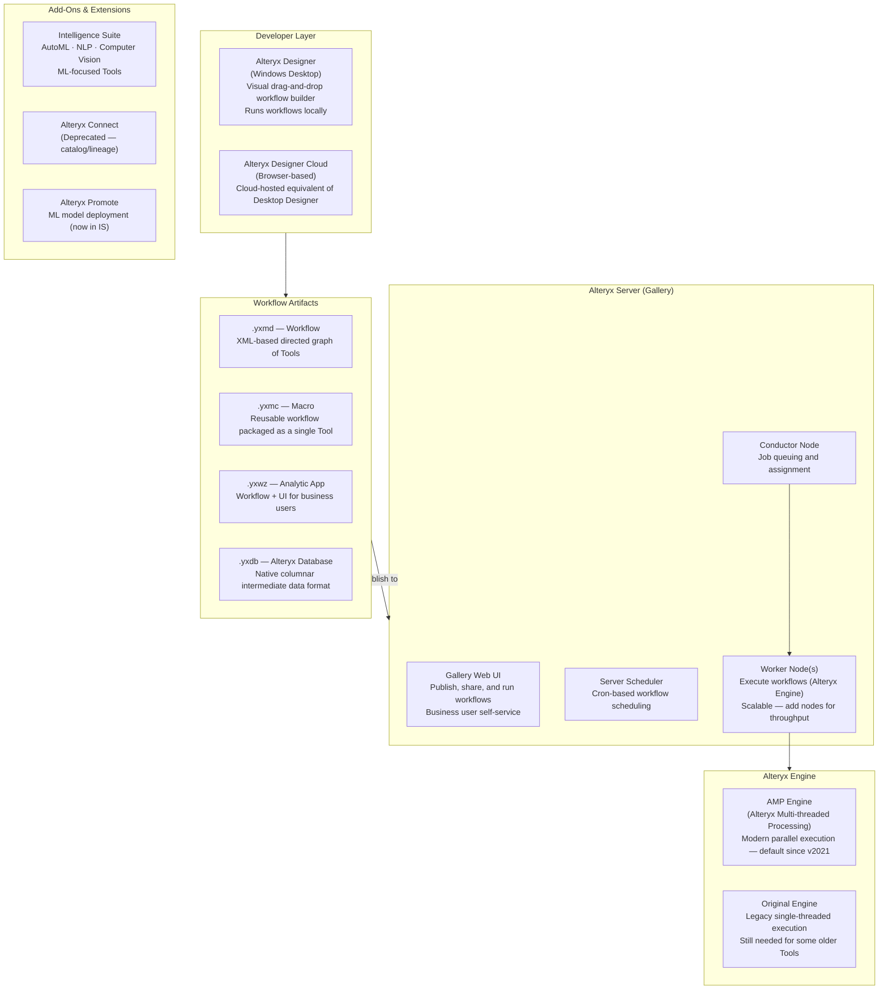
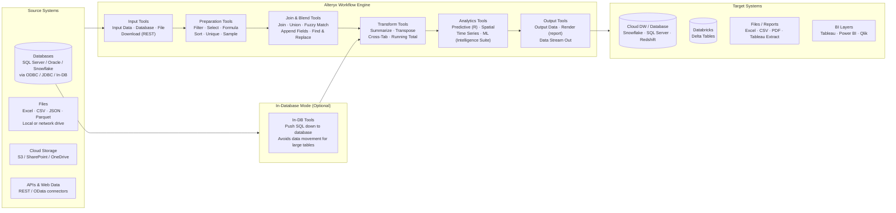

# Alteryx — SA Migration Guide

**Purpose:** Give a Solution Architect enough depth to assess an Alteryx estate, understand its moving parts, and map a migration path to Databricks.

This is not a developer guide. You won't be building Alteryx workflows. You will be walking customer sites, reviewing workflow catalogs, asking the right questions, and scoping what it takes to move to a modern lakehouse platform.

---

## Architecture Diagrams

### Alteryx Platform Architecture

How the Alteryx platform fits together — from the desktop authoring tool through server execution to governance and scheduling.

<div class="zd-wrapper" id="alx-arch-zoom" style="position:relative; border:1px solid #ddd; border-radius:6px; overflow:hidden; background:#fafafa;">
<div style="position:absolute; top:8px; right:10px; z-index:10; display:flex; align-items:center; gap:8px; font-size:0.78rem; color:#666;">
  <span>Scroll to zoom · Drag to pan</span>
  <button onclick="zdReset('alx-arch-zoom')" style="padding:2px 8px; font-size:0.75rem; border:1px solid #ccc; border-radius:4px; background:#fff; cursor:pointer;">Reset</button>
</div>
<div class="zd-canvas" style="cursor:grab; user-select:none;">



</div>
</div>

---

### Alteryx as ETL — Data Flow Between Systems

How Alteryx sits between source systems and outputs in a typical data preparation or analytics pipeline.

<div class="zd-wrapper" id="alx-flow-zoom" style="position:relative; border:1px solid #ddd; border-radius:6px; overflow:hidden; background:#fafafa;">
<div style="position:absolute; top:8px; right:10px; z-index:10; display:flex; align-items:center; gap:8px; font-size:0.78rem; color:#666;">
  <span>Scroll to zoom · Drag to pan</span>
  <button onclick="zdReset('alx-flow-zoom')" style="padding:2px 8px; font-size:0.75rem; border:1px solid #ccc; border-radius:4px; background:#fff; cursor:pointer;">Reset</button>
</div>
<div class="zd-canvas" style="cursor:grab; user-select:none;">



</div>
</div>

<script>
(function(){
  window.zdReset=window.zdReset||function(id){var w=document.getElementById(id);if(!w)return;var c=w.querySelector('.zd-canvas');if(c){c._s=1;c._tx=0;c._ty=0;}var s=w.querySelector('svg');if(s){s.style.transform='translate(0,0) scale(1)';s.style.transformOrigin='0 0';}};
  function initC(c){if(c._zdInit)return;c._zdInit=true;c._s=1;c._tx=0;c._ty=0;var dr=false,sx,sy,stx,sty;function ap(sv){sv.style.transform='translate('+c._tx+'px,'+c._ty+'px) scale('+c._s+')';sv.style.transformOrigin='0 0';sv.style.display='block';}c.addEventListener('wheel',function(e){var sv=c.querySelector('svg');if(!sv)return;e.preventDefault();var r=c.getBoundingClientRect(),mx=e.clientX-r.left,my=e.clientY-r.top,d=e.deltaY<0?1.12:1/1.12,ns=Math.min(5,Math.max(0.4,c._s*d));c._tx=mx-(mx-c._tx)*(ns/c._s);c._ty=my-(my-c._ty)*(ns/c._s);c._s=ns;ap(sv);},{passive:false});c.addEventListener('mousedown',function(e){if(e.button)return;dr=true;sx=e.clientX;sy=e.clientY;stx=c._tx;sty=c._ty;c.style.cursor='grabbing';e.preventDefault();});window.addEventListener('mousemove',function(e){if(!dr)return;c._tx=stx+(e.clientX-sx);c._ty=sty+(e.clientY-sy);var sv=c.querySelector('svg');if(sv)ap(sv);});window.addEventListener('mouseup',function(){if(dr){dr=false;c.style.cursor='grab';}});c.addEventListener('touchstart',function(e){if(e.touches.length===1){dr=true;sx=e.touches[0].clientX;sy=e.touches[0].clientY;stx=c._tx;sty=c._ty;}},{passive:true});c.addEventListener('touchmove',function(e){if(dr&&e.touches.length===1){c._tx=stx+(e.touches[0].clientX-sx);c._ty=sty+(e.touches[0].clientY-sy);var sv=c.querySelector('svg');if(sv)ap(sv);}},{passive:true});c.addEventListener('touchend',function(){dr=false;});}
  function tryW(w){var c=w.querySelector('.zd-canvas');if(!c)return;var sv=c.querySelector('svg');if(!sv){setTimeout(function(){tryW(w);},200);return;}initC(c);}
  function initAll(){document.querySelectorAll('.zd-wrapper').forEach(function(w){tryW(w);});}
  if(document.readyState==='loading'){document.addEventListener('DOMContentLoaded',function(){setTimeout(initAll,600);});}else{setTimeout(initAll,600);}
})();
</script>

---

## Sections

1. [Ecosystem Overview](#1-ecosystem-overview)
2. [Workflows and Tools — The Core Building Blocks](#2-workflows-and-tools--the-core-building-blocks)
3. [Data Formats and Schema](#3-data-formats-and-schema)
4. [Parallelism and Scaling Model](#4-parallelism-and-scaling-model)
5. [Project Structure and Version Control](#5-project-structure-and-version-control)
6. [Orchestration](#6-orchestration)
7. [Metadata, Lineage, and Impact Analysis](#7-metadata-lineage-and-impact-analysis)
8. [Data Quality](#8-data-quality)
9. [Alteryx File Formats Reference](#9-alteryx-file-formats-reference)
10. [Migration Assessment and Artifact Inventory](#10-migration-assessment-and-artifact-inventory)
11. [Migration Mapping to Databricks](#11-migration-mapping-to-databricks)

---

## 1. Ecosystem Overview

### What Is Alteryx?

Alteryx is a **self-service analytics automation** platform that allows business analysts and data engineers to build drag-and-drop data preparation, blending, and analytics workflows without writing code. Its core product is **Alteryx Designer** — a Windows desktop application where users build visual workflows by chaining together pre-built Tools.

Unlike traditional ETL tools (Informatica, Ab Initio) designed for IT-owned batch pipelines, Alteryx targets **business analysts and power users** who need to prepare and analyze data themselves. This distinction shapes the migration challenge: Alteryx estates often contain hundreds of analyst-authored workflows that are business-critical but lack formal version control, documentation, or engineering oversight.

Key differentiators:
- **Desktop-first** — Alteryx Designer runs on Windows; workflows are built and tested locally before publishing to Server
- **Business-user audience** — non-programmers build complex data transformations visually; the barrier to workflow creation is low, creating large, sprawling estates
- **Proprietary engine** — Alteryx processes data through its own in-memory engine; unlike Matillion (push-down SQL) or SnapLogic (Snaplex JVM), Alteryx pulls data into its engine and processes it row-by-row or in parallel via AMP
- **Rich analytics** — built-in spatial analysis, predictive analytics (R-based), and ML tools (Intelligence Suite) are part of the platform
- **In-Database mode** — optional push-down SQL execution mode for large-volume tables, bypassing the Alteryx engine

### The Alteryx Product Suite

| Product | What It Is | Notes |
|---------|-----------|-------|
| **Alteryx Designer** (Desktop) | Windows desktop IDE — the primary workflow authoring tool | Where all workflow development happens; local execution |
| **Alteryx Designer Cloud** | Browser-based equivalent of Desktop Designer | Newer; feature parity with desktop is incomplete |
| **Alteryx Server** | Enterprise platform — publishes, schedules, and runs workflows; web Gallery UI | Required for automated/scheduled execution and sharing |
| **Alteryx Analytics Cloud (AAC)** | Unified cloud platform combining Designer Cloud, Machine Learning, and Auto Insights | Alteryx's strategic cloud direction; replaces some on-prem products |
| **Intelligence Suite** | Add-on Tools for ML, NLP, computer vision, AutoML | Requires separate license; builds on R/Python internally |
| **Alteryx Auto Insights** | Automated natural-language insights on data | Analytics consumption layer; separate from ETL workflows |
| **Alteryx Connect** | Data catalog and lineage product | Largely deprecated; most customers don't use it |

> **SA Tip:** Ask which version of Alteryx the customer is running — **Desktop only**, **Desktop + Server**, or **Analytics Cloud**. Desktop-only customers have no centralized inventory; their workflows live on individual user laptops. Desktop + Server customers have a central Gallery; workflows published there can be inventoried via the Server API. Analytics Cloud customers are already in Alteryx's SaaS direction, so the migration conversation is different.

### Why Customers Want to Migrate

| Driver | What It Means for the Engagement |
|--------|----------------------------------|
| **Scalability limits** | Alteryx Designer runs on a single Windows machine; large datasets cause out-of-memory failures; Databricks scales elastically |
| **Cost** | Alteryx Designer licenses are expensive per seat; Server adds infrastructure cost; Databricks can be lower TCO for large teams |
| **Code-first preference** | Engineering teams want Python/SQL, not a drag-and-drop GUI; Databricks notebooks are more comfortable |
| **Cloud migration** | Customers moving from on-prem to cloud want to eliminate Windows-based desktop tooling |
| **Governance and auditability** | Analyst-authored Alteryx workflows lack version control, lineage, and access governance; Databricks with Unity Catalog addresses this |
| **Performance** | Alteryx engine hits limits on large datasets; Databricks Spark handles multi-TB datasets natively |
| **Vendor uncertainty** | Alteryx was acquired by Clearlake Capital (2023); some customers are hedging by moving to open platforms |

> **SA Tip:** Alteryx migrations are often driven by **analyst empowerment**, not just IT cost reduction. The business users who built the Alteryx workflows are often the hardest stakeholders to win over — they built something that works and don't want to learn Python. Position Databricks AI/BI and notebooks as the destination, not just the migration target. Showing analysts how Databricks notebooks + AI Assistant lower the learning curve is often more persuasive than TCO math.

### Key Discovery Questions

Before scoping a migration, ask:

1. Are they using **Designer Desktop only**, **Designer + Server**, or **Alteryx Analytics Cloud**?
2. How many **workflows** are in active production use (run on Server) vs. living on individual user laptops?
3. How many **unique users** author workflows — is this analyst-led (hundreds of casual users) or IT-led (small team of power users)?
4. Are there workflows using **R or Python Tools** (Intelligence Suite, Custom R/Python Tools)? These are the most code-intensive migration items.
5. Are there **Macros** (`.yxmc`) — reusable workflows used as building blocks across many other workflows?
6. Are there **Analytic Apps** (`.yxwz`) — workflows with business-user UIs that non-technical users run interactively?
7. Does the customer use **In-Database Tools**? These push SQL to databases; migration is more straightforward for these than engine-processed workflows.
8. How is **version control** managed — Git, shared network drive, or no version control at all?

---

## 2. Workflows and Tools — The Core Building Blocks

### The Workflow

A **Workflow** (`.yxmd`) is the primary artifact in Alteryx — an XML-encoded directed acyclic graph of **Tools** connected by data streams. Workflows define the sequence of data transformations from input to output. A workflow is to Alteryx what a mapping is to Informatica, a graph is to Ab Initio, or a pipeline is to Matillion.

Workflows run on either:
- **Alteryx Designer** — local desktop execution; user triggers the run manually or via command line
- **Alteryx Server** — centralized execution; workflows are scheduled or run by users through the Gallery web UI

### Tools

A **Tool** is an individual processing step in the workflow — Alteryx ships 250+ built-in Tools. Every Tool has typed input and output anchors that connect to adjacent Tools via **data streams**.

**Core Tool categories:**

| Category | Examples | What They Do |
|----------|----------|--------------|
| **Input** | `Input Data`, `Directory`, `Connect In-DB`, `Download` | Read data from files, databases, S3, APIs |
| **Preparation** | `Filter`, `Select`, `Formula`, `Sort`, `Sample`, `Unique`, `Data Cleansing` | Clean, reshape, and filter data |
| **Join** | `Join`, `Union`, `Append Fields`, `Find & Replace`, `Fuzzy Match` | Combine datasets |
| **Transform** | `Summarize`, `Transpose`, `Cross-Tab`, `Running Total`, `Multi-Row Formula` | Aggregate, pivot, and reshape |
| **Spatial** | `Spatial Match`, `Trade Area`, `Distance`, `Map Input` | Geographic analysis |
| **Predictive** | `Linear Regression`, `Decision Tree`, `Random Forest`, `Score` (R-based) | Statistical and ML modeling |
| **Developer** | `Formula`, `Multi-Row Formula`, `Python Tool`, `R Tool`, `Run Command` | Custom code execution |
| **Output** | `Output Data`, `Render`, `Data Stream Out` | Write to files, databases, reports |
| **In-Database** | `Connect In-DB`, `Filter In-DB`, `Join In-DB`, `Data Stream In/Out` | Push-down SQL execution in the source database |

> **SA Tip:** The **R Tool** and **Python Tool** are the highest-migration-effort items in Alteryx. These run arbitrary R or Python code inside the workflow — not as a black box, but as fully custom logic that may include ML models, complex statistical calculations, or API calls. Inventory all R and Python Tools during assessment; each is a custom code port, not a Tool-to-Tool mapping.

### Macros

A **Macro** (`.yxmc`) is a workflow packaged as a reusable Tool — it appears on the canvas as a single Tool but contains its own workflow logic internally. Macros are the abstraction mechanism in Alteryx.

| Macro Type | Description | Notes |
|-----------|-------------|-------|
| **Standard Macro** | Reusable workflow called as a Tool | Most common; equivalent to Informatica reusable mapplet |
| **Batch Macro** | Loops over input data, running the macro logic once per record or group | Used for parameterized iteration — similar to Matillion's Iterator |
| **Iterative Macro** | Loops until a condition is met | Used for recursive logic — similar to a `while` loop |
| **Location Optimizer Macro** | Spatial optimization; specialized use case | Niche; primarily in retail/logistics use cases |

> **SA Tip:** Macros are dependency anchors — a Macro used by 50 workflows must be migrated before any of its callers. Inventory all Macros and build a dependency graph: which Macros are used by which workflows. The most-referenced Macros should be migrated first, as reusable functions or dbt macros.

### Analytic Apps

An **Analytic App** (`.yxwz`) is an Alteryx workflow wrapped with a user interface (text inputs, dropdowns, file browsers) so that business users can run parameterized analyses without using Designer. The UI is configured in Designer but presented to end users through the Alteryx Server Gallery.

> **SA Tip:** Analytic Apps represent **self-service analytics functionality** — not just ETL pipelines. When a customer says they need to "migrate their Alteryx Apps," they mean they need to replace the combination of workflow logic + user-facing UI. In Databricks, this translates to a combination of notebooks (logic) + Databricks AI/BI dashboards or a simple Streamlit/Gradio app (UI layer). Apps are often higher business-visibility than batch workflows and require stakeholder buy-in before migration.

---

## 3. Data Formats and Schema

### How Alteryx Represents Data

Alteryx processes data through its proprietary in-memory engine as **record streams** — rows of typed fields flowing between Tools. Unlike SQL-based tools, Alteryx does not use a SQL schema language or push SQL to a database (unless In-Database Tools are used).

**Alteryx field types:**

| Alteryx Type | Description | Databricks Equivalent |
|-------------|-------------|----------------------|
| `String` | Fixed-length string | `STRING` |
| `WString` | Wide (Unicode) string | `STRING` |
| `V_String` | Variable-length string | `STRING` |
| `Int16`, `Int32`, `Int64` | Integer types | `SMALLINT`, `INT`, `BIGINT` |
| `Float`, `Double` | Floating-point numeric | `FLOAT`, `DOUBLE` |
| `Fixed Decimal` | Precision decimal | `DECIMAL(p, s)` |
| `Date`, `Time`, `DateTime` | Date/time types | `DATE`, `TIMESTAMP` |
| `Bool` | Boolean | `BOOLEAN` |
| `Blob`, `SpatialObj` | Binary and spatial objects | `BINARY` / custom geometry type |

> **SA Tip:** Alteryx's `Fixed Decimal` type is often used for financial calculations requiring exact precision. When migrating to Databricks, ensure these fields are mapped to `DECIMAL(p, s)` with matching precision and scale — a silent conversion to `DOUBLE` will introduce floating-point rounding errors that may not surface until reconciliation.

### The Alteryx Database (.yxdb)

The **Alteryx Database** format (`.yxdb`) is Alteryx's proprietary columnar file format used for intermediate data storage and caching. It is significantly faster to read and write than CSV or Excel, and supports Alteryx's full field type set including spatial objects.

`.yxdb` files appear in Alteryx estates as:
- **Intermediate caches** — saved between workflow runs to avoid re-reading slow sources
- **Input data files** — pre-prepared datasets published to Server for workflows to read
- **Output files** — when a workflow saves results for consumption by another workflow

> **SA Tip:** `.yxdb` files are not readable by any tool outside Alteryx. If a customer's workflows chain together via `.yxdb` intermediate files, those files must be replaced with a shared Delta table or cloud storage format (Parquet, CSV) in the migrated architecture. Identify `.yxdb` handoffs between workflows during assessment — these represent cross-workflow data dependencies that must be redesigned.

### In-Database Mode

**In-Database (In-DB) Tools** are a special category that push transformation logic down to the source database as SQL, bypassing the Alteryx engine. Workflows using In-DB Tools connect to a database (Snowflake, SQL Server, Redshift), build a SQL query via visual tools, and run it in the database.

In-DB workflows are much closer to SQL than to standard Alteryx engine workflows:

| Aspect | In-DB Tools | Standard Engine Tools |
|--------|------------|----------------------|
| Where logic runs | Source database (SQL) | Alteryx engine (in-memory) |
| Scale | Bounded by database | Bounded by Designer machine RAM |
| Migration path | Extract SQL, run in Databricks | Rewrite logic as PySpark / dbt |

> **SA Tip:** In-DB workflows are the **easiest Alteryx workflows to migrate** — the logic is already SQL. Ask customers to export the generated SQL from their In-DB workflows (Alteryx Designer shows the SQL it generates). That SQL can often be run directly in Databricks SQL or dbt with minor dialect adjustments.

---

## 4. Parallelism and Scaling Model

### The Alteryx Engine

Alteryx Designer runs on a **single Windows machine**. The Alteryx engine processes data in-memory — Tools receive record streams, apply logic, and pass results to the next Tool. This is the fundamental scaling limit: everything fits in RAM on one machine.

Alteryx has two engine modes:

| Engine | Description | Notes |
|--------|-------------|-------|
| **AMP (Alteryx Multi-threaded Processing)** | Modern parallel engine — distributes Tool execution across CPU cores; default since v2021.4 | Faster for most workflows; some older Tools not AMP-compatible |
| **Original Engine** | Legacy single-threaded engine | Still required for Tools incompatible with AMP; used as fallback |

### Scaling on Alteryx Server

Alteryx Server scales throughput by adding **Worker nodes** — each Worker is a machine that runs the Alteryx engine. Multiple workflows can run in parallel across Workers, but each individual workflow still runs on a single Worker node. A single Alteryx workflow cannot span multiple Worker nodes.

| Pattern | How It Works | Notes |
|---------|-------------|-------|
| **Multiple Worker nodes** | Server distributes queued workflow jobs to available Workers | Horizontal throughput scaling — more workflows in parallel, not faster single workflows |
| **AMP within a single Worker** | AMP uses all CPU cores on the Worker node | Vertical scaling per workflow |
| **Chained workflows** | One workflow writes output; another reads it | Sequential, not parallel; total runtime is additive |

> **SA Tip:** When a customer says "our Alteryx workflow is slow," the root cause is almost always **dataset size exceeding Worker node RAM**. Workflows that work fine on small samples fail or thrash on full production volumes. Ask: "What is the typical record count for this workflow, and how much RAM does the Worker node have?" — this determines whether the migration to Databricks Spark is primarily a scale fix or a code migration.

### The Fundamental Architecture Difference

This is the most important concept for SAs to understand in Alteryx migrations:

| Alteryx | Databricks |
|---------|-----------|
| Processes data **through its own engine** — pulls data to the machine | Processes data **in place** on distributed Spark cluster |
| Single-machine execution (per workflow) | Distributed execution across many nodes |
| Logic expressed as **visual Tool chains** | Logic expressed as **PySpark / SQL** |
| Schema is **inferred at runtime** from source | Schema is **declared** in Delta table definition |
| Scales by buying bigger machines or more Server nodes | Scales by adding Spark worker nodes dynamically |

There is **no automated translation** from Alteryx Tool chains to PySpark or SQL — each workflow must be analyzed and rewritten. This is the core effort driver in Alteryx migrations.

---

## 5. Project Structure and Version Control

### Where Workflows Live

| Location | Who Owns It | How to Inventory |
|----------|------------|-----------------|
| **Designer Desktop (local)** | Individual users — analyst-owned workflows on laptops | No central inventory; must survey users |
| **Alteryx Server Gallery** | Published workflows — shared and scheduled | Server API — enumerate all published workflows |
| **Network file share** | Common in enterprise environments — shared `.yxmd` files on a drive | Scan the file share; count `.yxmd`, `.yxmc`, `.yxwz` files |
| **Git repository** | Uncommon; some IT-managed customers have Git for workflows | If Git is used, clone and count files by type |

> **SA Tip:** The biggest discovery challenge in Alteryx migrations is **hidden inventory**. Analyst-authored workflows on personal laptops are business-critical but invisible to IT. Ask: "Are there workflows that only live on specific users' machines that would break the business if that person left?" — this is almost always yes, and surfacing this is often the most valuable thing you do in the assessment.

### Version Control

Alteryx has **no native version control**. Workflows are XML files — they can be stored in Git, but this requires discipline from users. Most Alteryx estates have little or no version history.

| Pattern | Prevalence | Migration Note |
|---------|-----------|----------------|
| **Git integration (manual)** | Rare — IT-managed workflows only | Clone repo; version history available |
| **File share / network drive** | Common | No version history; current files only |
| **Local desktop only** | Very common for analyst workflows | Must survey users to build inventory |
| **Server as archive** | Moderate — published workflows versioned in Server | Server API can retrieve last-published version |

### Dependency Across Workflows

Workflows can depend on each other via:
- **`.yxdb` intermediate files** — Workflow A writes a `.yxdb`; Workflow B reads it as input
- **Batch Macros** — reusable logic called from multiple parent workflows
- **Chained scheduling** — Workflow B is scheduled to run after Workflow A completes

> **SA Tip:** `.yxdb` inter-workflow dependencies are invisible in the Server Gallery — the dependency only becomes apparent when you read the Input Tool configuration inside the workflow XML. Always open and parse the XML of workflows that read `.yxdb` files to identify their upstream producer. This is a common source of migration scope surprises.

---

## 6. Orchestration

### Scheduling on Alteryx Server

Alteryx Server provides a **built-in cron-based scheduler** accessible through the Gallery web UI. Admins and users with scheduling permissions can set a workflow to run on a time-based schedule.

| Feature | Description | Databricks Equivalent |
|---------|-------------|----------------------|
| **Scheduled workflow** | Cron-based trigger on Alteryx Server | Databricks Workflow (scheduled) |
| **Priority queuing** | Workflows assigned priority levels for the Worker queue | Databricks cluster priority / job queue settings |
| **Concurrent run limit** | Limit concurrent instances of the same workflow | Databricks Workflow max concurrent runs setting |
| **Run on demand (Gallery)** | Business users trigger workflow manually from Gallery UI | Databricks Workflow REST API trigger / Databricks Apps |

### External Schedulers

Many enterprise Alteryx customers trigger workflows from external schedulers rather than using the built-in scheduler:

| Scheduler | Integration Method | Migration Note |
|-----------|------------------|----------------|
| **Built-in Alteryx Scheduler** | Native — configured in Gallery UI | Replace with Databricks Workflow schedule |
| **Control-M / TWS** | `AlteryxEngineCmd.exe` command-line trigger or REST API | Replace with Databricks Workflow REST API call |
| **Windows Task Scheduler** | `AlteryxEngineCmd.exe` scheduled task | Replace with Databricks Workflow schedule or REST trigger |
| **Apache Airflow** | `BashOperator` calling `AlteryxEngineCmd.exe` or REST API | Replace with `DatabricksRunNowOperator` |
| **PowerShell / batch scripts** | Command-line invocation of Alteryx Engine | Replace with Databricks CLI or REST API call |

### Orchestration Patterns

Alteryx has no native multi-workflow orchestration construct. Complex pipelines are orchestrated through:

| Pattern | How It Works | Databricks Equivalent |
|---------|-------------|----------------------|
| **Chained scheduling** | Workflow B scheduled to start 30 min after Workflow A | Databricks Workflow with task dependency |
| **`.yxdb` handoff** | Workflow A writes a `.yxdb`; Workflow B reads it on next run | Databricks Workflow — Task A writes Delta table; Task B reads it |
| **`Run Command` Tool** | Workflow A calls a command that triggers Workflow B | Databricks Workflow task with `DatabricksRunNowOperator` or REST call |
| **Batch Macro iteration** | Single workflow iterates over a dataset via Batch Macro | Databricks Workflow `foreach` task / `for` loop in notebook |
| **Iterative Macro loop** | Workflow loops until convergence condition | Recursive notebook call or Airflow sensor |

> **SA Tip:** Alteryx orchestration is often **informal and implicit** — time-offset scheduling ("Workflow B runs 30 minutes after Workflow A") rather than formal dependency tracking. When migrating, this is an opportunity to make dependencies explicit: build a Databricks Workflow that chains these jobs with true task dependencies, eliminating the fragile time-offset pattern. Customers are usually receptive once you show them that time-offset scheduling is the root cause of their occasional "Workflow B ran before Workflow A finished" failures.

---

## 7. Metadata, Lineage, and Impact Analysis

### What Alteryx Tracks

Alteryx has weak native metadata and lineage capabilities. Alteryx Connect (the catalog product) is largely deprecated. Most lineage analysis must be done by parsing workflow XML files directly.

| Metadata Type | Where It Lives | How to Access |
|--------------|---------------|---------------|
| Workflow definitions | `.yxmd` XML files on disk/Server | Parse XML directly or via Server API |
| Run history and logs | Alteryx Server database | Server API — `GET /jobs` and `GET /workflow/<id>/jobs` |
| Macro definitions | `.yxmc` XML files | Same as workflow XML |
| Published workflow list | Alteryx Server Gallery | Server API — `GET /workflows` |
| User-workflow access | Alteryx Server Gallery | Server API — permissions model |

### Dependency Mapping

Since Alteryx has no built-in impact analysis, dependency mapping requires parsing workflow XML:

| Analysis Needed | How to Get It |
|----------------|---------------|
| What inputs a workflow reads | Parse `<Node>` elements with `ToolId="InputData"` in workflow XML — extract `File` attribute |
| What outputs a workflow writes | Parse `<Node>` elements with `ToolId="OutputData"` — extract `File` or connection string |
| Which workflows use a given Macro | Grep all `.yxmd` XML for the Macro filename |
| `.yxdb` inter-workflow dependencies | Find all Input Tools reading `.yxdb` files; match to Output Tools writing same filename |
| Database connections used | Extract `<Connection>` blocks from Input/Output Tool XML |
| R Tool and Python Tool presence | Grep XML for `ToolId="RScript"` and `ToolId="Python"` |

> **SA Tip:** Write a simple Python or PowerShell script to parse all `.yxmd` files in the Server export and build a dependency matrix. The XML structure is well-documented and consistent. This script is your most valuable assessment tool — it gives you: (1) total workflow count, (2) active vs. stale (cross-reference with Server run history API), (3) Tool type inventory, (4) Macro dependency graph, (5) database connection map. Build this in the first week of the engagement.

### Lineage Gaps

| Gap | Why It Exists | Mitigation |
|-----|--------------|------------|
| **Laptop-resident workflows** | No visibility into workflows that were never published to Server | User survey + file share scan |
| **R Tool / Python Tool contents** | Custom code in these Tools is opaque — Alteryx cannot analyze it | Manual code review of each R/Python Tool block |
| **External file dependencies** | Workflows reading Excel/CSV from network shares have implicit dependencies | Extract file paths from Input Tool configs during XML parse |
| **`.yxdb` chain breaks** | If the producing workflow fails, consuming workflows silently read stale data | Map `.yxdb` chains explicitly; replace with Delta tables + freshness checks |

---

## 8. Data Quality

### Data Quality in Alteryx

Alteryx does not have a dedicated data quality product (Alteryx Connect had some DQ features but is deprecated). Data quality is implemented inside workflows using standard Tools.

**Common patterns:**

| Pattern | How It's Implemented | Databricks Equivalent |
|---------|---------------------|----------------------|
| **Row count validation** | `Summarize` Tool counting rows → `Filter` Tool checking against threshold → `Message` Tool on failure | DLT `expect_or_fail()` / Great Expectations |
| **Null / blank checks** | `Filter` Tool routing null-field records to a separate output or error file | DLT `expect()` with quarantine pattern |
| **Duplicate detection** | `Unique` Tool separating unique and duplicate records | Delta `MERGE INTO` dedup / DLT expectation |
| **Data profiling** | `Field Summary` Tool generating column statistics | Databricks Lakehouse Monitoring / `dbutils.data.summarize()` |
| **Custom business rules** | `Formula` Tool with conditional expressions; `Filter` Tool routing failures | dbt test / custom DLT expectation |
| **Referential integrity** | `Join` Tool with Unmatched Left/Right outputs routing unmatched records | DLT expectation or Delta `CHECK` constraint |
| **Data Cleansing** | `Data Cleansing` Tool standardizing nulls, trimming whitespace, fixing case | PySpark `withColumn()` / SQL `CASE` / dbt model transform |

> **SA Tip:** Alteryx's **error branching** model — where Tools have separate output anchors for passing and failing records — is similar to SnapLogic's error views. Ask customers: "Where do the failing records go?" Often the answer is "an error file on a network share that nobody looks at." This is a governance gap worth flagging — migrating to Databricks with DLT expectations and proper quarantine tables is a quality improvement, not just a technical migration.

### Analytic App Data Validation

**Analytic Apps** often include user-input validation logic built into the app interface (required fields, value ranges). This validation logic lives in the App configuration XML and must be replicated in the replacement UI layer (Databricks Apps, Streamlit, or a custom web form).

---

## 9. Alteryx File Formats Reference

### `.yxmd` — Workflow Definition

The primary artifact in Alteryx is the **Workflow** file, stored as XML with a `.yxmd` extension.

| Property | Detail |
|----------|--------|
| **Created by** | Alteryx Designer — saved from the canvas |
| **Stored in** | Local disk, network file share, or published to Alteryx Server Gallery |
| **Contains** | Tool list with configuration, connection (wire) definitions between Tools, workflow metadata (engine mode, canvas zoom), macro references |
| **Human-readable?** | Yes — standard XML; verbose but parseable |
| **Migration target** | Databricks notebook (PySpark or SQL) / dbt model set; Tool-by-Tool analysis required |

**Example snippet (Filter Tool in workflow XML):**
```xml
<Node ToolID="5">
  <GuiSettings Plugin="AlteryxBasePluginsGui.Filter.Filter">
    <Position x="258" y="102"/>
  </GuiSettings>
  <Properties>
    <Configuration>
      <Expression>
        [Status] = "ACTIVE" AND [Balance] &gt; 0
      </Expression>
    </Configuration>
  </Properties>
</Node>
```

> **SA Tip:** Parse workflow XML with a standard XML library (Python `ElementTree`, PowerShell `[xml]`). The `ToolID` attribute in each `<Node>` element identifies the Tool type; the `<Configuration>` child contains the Tool-specific settings. Write a parser that extracts: Tool types and counts, `<Connection>` strings in Input/Output Tools, `<Expression>` content in Formula Tools, and file path references in Input Data Tools. This gives you 80% of the migration scope picture without opening Designer.

---

### `.yxmc` — Macro Definition

A **Macro** file has the same XML structure as a workflow, with additional interface Tool definitions for inputs/outputs.

| Property | Detail |
|----------|--------|
| **Created by** | Alteryx Designer — same as workflow but saved as `.yxmc` |
| **Stored in** | Same locations as workflows; often in a shared `Macros` directory |
| **Contains** | All workflow XML content + `MacroInput`/`MacroOutput` Tool definitions; `Interface Designer` controls for Batch/Iterative Macros |
| **Human-readable?** | Yes — same XML format as `.yxmd` |
| **Migration target** | Reusable dbt macro / PySpark function / utility notebook; depends on complexity |

---

### `.yxwz` — Analytic App

An **Analytic App** wraps a workflow with a user interface for business users.

| Property | Detail |
|----------|--------|
| **Created by** | Alteryx Designer — "Convert to App" option on a workflow |
| **Stored in** | Same as workflows; published to Server Gallery for user access |
| **Contains** | Workflow XML + Interface Tool definitions (text inputs, dropdowns, file browsers, checkboxes) |
| **Human-readable?** | Yes — same XML format; Interface Tools describe the UI layer |
| **Migration target** | Two-part: workflow logic → Databricks notebook / dbt model; UI layer → Databricks Apps / Streamlit / Gradio |

> **SA Tip:** Analytic Apps require a **two-layer migration** — the data logic and the user interface must both be replaced. Don't underestimate the UI layer; apps are often customer-facing or exec-facing tools with specific UX expectations. Scope the App migration separately from batch workflow migration — it often requires UI/UX effort beyond data engineering.

---

### `.yxdb` — Alteryx Database (Intermediate Format)

The **Alteryx Database** is a proprietary columnar binary format used for intermediate caching and data handoffs.

| Property | Detail |
|----------|--------|
| **Created by** | Alteryx workflows via `Output Data` Tool writing to `.yxdb` |
| **Stored in** | Local disk, network file share, or Server file store |
| **Contains** | Typed columnar record data in Alteryx's native format; supports all Alteryx field types including Spatial |
| **Human-readable?** | No — binary proprietary format; only Alteryx can read it natively |
| **Migration target** | Delta table (for inter-workflow data sharing) or Parquet/CSV (for file-based handoffs) |

> **SA Tip:** `.yxdb` files cannot be read by any external tool. If a customer needs to inspect or migrate the data in a `.yxdb` file, they must open it in Alteryx Designer and export it to CSV/Parquet. During migration, replace all `.yxdb` inter-workflow handoffs with **Delta table writes and reads** — this is the primary architectural change in Alteryx migrations.

---

### `.yxzp` — Packaged Workflow

A **Packaged Workflow** bundles a workflow with its data inputs into a single portable ZIP archive.

| Property | Detail |
|----------|--------|
| **Created by** | Alteryx Designer — "Save as Packaged Workflow" |
| **Stored in** | Filesystem; used for sharing self-contained examples |
| **Contains** | `.yxmd` workflow XML + embedded input data files (CSV, Excel, `.yxdb`) |
| **Human-readable?** | After unzipping — workflow XML is readable; embedded data depends on format |
| **Migration target** | Analysis source — unzip to extract workflow XML and input data |

---

### File Formats Quick Reference

| Format | Extension | Primary Content | Human-Readable? | Migration Target |
|--------|-----------|----------------|-----------------|-----------------|
| Workflow | `.yxmd` | Workflow XML — Tools + connections | Yes (verbose) | Databricks notebook / dbt model |
| Macro | `.yxmc` | Reusable workflow XML + interface | Yes | dbt macro / PySpark utility function |
| Analytic App | `.yxwz` | Workflow XML + UI interface | Yes | Notebook logic + Streamlit/Databricks Apps UI |
| Alteryx Database | `.yxdb` | Proprietary columnar binary | No | Delta table / Parquet |
| Packaged Workflow | `.yxzp` | ZIP of workflow + embedded data | After unzip | Analysis source |

---

## 10. Migration Assessment and Artifact Inventory

### Inventory Approach

1. **Server Gallery** — use the Alteryx Server REST API to list all published workflows, their last run dates, and run history. This is the authoritative inventory for scheduled/shared workflows.
2. **File share scan** — scan shared network drives for `.yxmd`, `.yxmc`, `.yxwz` files. These are workflows that were never published to Server.
3. **User survey** — identify power users who have critical workflows on their laptops. This is unavoidably manual; ask IT who the top Alteryx users are.
4. **XML parse** — parse all collected `.yxmd` files to extract: Tool type inventory, Input/Output connection strings, Formula expressions, Macro references, R/Python Tool presence.
5. **`.yxdb` dependency map** — identify all workflows that read `.yxdb` files and trace them back to the producing workflows.
6. **Run history cross-reference** — use Server API run history to flag stale workflows (not run in 90+ days); exclude these from active migration scope.

### Complexity Scoring

| Dimension | Low (1) | Medium (2) | High (3) |
|-----------|---------|-----------|---------|
| **Tool types** | Preparation + Join only | Adds Transform + Spatial | R Tool / Python Tool / Iterative Macro |
| **Formula complexity** | Simple field selection | Date math, string functions, conditionals | Complex multi-field expressions, regex |
| **Data volume** | < 500K rows / run | 500K–50M rows | 50M+ rows or `.yxdb` caching needed for scale |
| **In-Database usage** | None (all engine) | Mix of engine + In-DB | Primarily In-DB (closer to SQL migration) |
| **Macro dependencies** | No macros used | References 1–3 shared macros | References 4+ macros; Iterative/Batch Macros |
| **App / UI layer** | No Analytic App | Simple App with parameters | Complex App with user management and validation |
| **Orchestration** | Standalone scheduled workflow | 2–3 chained workflows | External scheduler + complex `.yxdb` chain |

### Risk Areas Specific to Alteryx

| Risk Area | Why It's Risky | Mitigation |
|-----------|--------------|------------|
| **R Tool and Python Tool** | Arbitrary code — may include statistical libraries, ML models, or API calls with no standard mapping | Inventory all R/Python Tools; treat each as a custom code audit and port |
| **Laptop-resident critical workflows** | No central inventory; critical business logic lives on individual user machines | User survey + file share scan; identify single points of failure immediately |
| **`.yxdb` intermediate files** | Proprietary binary format; inter-workflow dependencies invisible until XML parsed | Map all `.yxdb` chains; replace with Delta tables in migrated architecture |
| **Iterative Macro loops** | Recursive logic that loops until convergence; no direct Databricks Workflows equivalent | Identify early; implement as Python while loop in notebook or Airflow sensor |
| **Analytic App UI** | Business-user-facing UI must be rebuilt, not just the data logic | Scope App UI replacement separately; engage UI/UX and business stakeholders |
| **AMP vs. Original Engine split** | Some Tools only run on Original Engine; migrating to AMP-compatible logic may change behavior | Identify Original-Engine-only Tools during XML parse; test behavior differences |
| **Spatial Tools** | Alteryx spatial analysis uses proprietary SpatialObj type and GIS operations | Assess whether spatial logic can be replicated in Databricks with H3 indexing or Python geopandas |
| **Stale workflows re-activated** | Unused workflows that are discovered and "just in case" migrated can double migration scope | Use run history to define strict "active" criteria; exclude stale workflows unless business confirms they're needed |

---

## 11. Migration Mapping to Databricks

### Building Blocks

| Alteryx Concept | Databricks Equivalent |
|----------------|----------------------|
| Workflow (`.yxmd`) | Databricks notebook (PySpark or SQL) / dbt model set |
| Macro (`.yxmc`) | dbt macro / reusable PySpark utility function / shared notebook |
| Batch Macro (iteration) | Databricks Workflow `foreach` task / Python `for` loop in notebook |
| Iterative Macro (while loop) | Python `while` loop in notebook / Airflow sensor |
| Analytic App (`.yxwz`) | Databricks notebook (logic) + Databricks Apps / Streamlit (UI) |
| `.yxdb` intermediate file | Delta table (for cross-workflow sharing) |
| Packaged Workflow (`.yxzp`) | Databricks Repo (workflow code + sample data) |

### Tools

| Alteryx Tool | Databricks Equivalent |
|-------------|----------------------|
| `Input Data` (file) | `spark.read.csv / parquet / json / excel` / Auto Loader |
| `Input Data` (database) | `spark.read.jdbc()` / Delta table read |
| `Connect In-DB` | Databricks SQL notebook / `spark.sql()` |
| `Filter` | `filter()` / SQL `WHERE` |
| `Select` | `select()` / SQL `SELECT` column list |
| `Formula` | `withColumn()` / SQL `CASE / expression` |
| `Multi-Row Formula` | `Window` function / Spark `lag()` / `lead()` |
| `Sort` | `orderBy()` / SQL `ORDER BY` |
| `Sample` | `limit()` / `sample()` |
| `Unique` | `dropDuplicates()` / SQL `GROUP BY` dedup |
| `Data Cleansing` | PySpark string functions / SQL `TRIM`, `UPPER`, `COALESCE` |
| `Join` | `join()` / SQL `JOIN` |
| `Union` | `union()` / SQL `UNION ALL` |
| `Append Fields` | Cross-join or `crossJoin()` |
| `Fuzzy Match` | Databricks ML Fuzzy Match / `phonetics` library / custom UDF |
| `Summarize` | `groupBy().agg()` / SQL `GROUP BY` |
| `Transpose` | `melt()` (PySpark) / `UNPIVOT` (Spark SQL 3.4+) |
| `Cross-Tab` | `groupBy().pivot()` / SQL `PIVOT` |
| `Running Total` | `Window` function `SUM() OVER (... ROWS UNBOUNDED PRECEDING)` |
| `Find & Replace` | `join()` on lookup table + `coalesce()` |
| `R Tool` | Databricks notebook (R or Python with SparkR / rpy2) |
| `Python Tool` | Databricks notebook (Python) |
| `Run Command` | Databricks notebook `subprocess` / Databricks Task (Python file) |
| `Output Data` (file) | `spark.write.csv / parquet / delta` |
| `Output Data` (database) | Delta `CREATE OR REPLACE TABLE AS SELECT` / `MERGE INTO` |
| `Render` (report output) | Databricks AI/BI dashboard / Lakeview report |
| `Data Stream Out` | Delta table write (for downstream workflow reads) |
| `Field Summary` | `dbutils.data.summarize()` / Databricks Lakehouse Monitoring |

### Orchestration

| Alteryx Orchestration | Databricks Equivalent |
|----------------------|----------------------|
| Alteryx Server Scheduler (cron) | Databricks Workflow (scheduled with cron) |
| Gallery on-demand run | Databricks Workflow REST API trigger |
| Control-M → `AlteryxEngineCmd` | Control-M Databricks integration / REST API call |
| Windows Task Scheduler → `AlteryxEngineCmd` | Databricks Workflow schedule or REST trigger |
| Airflow → `BashOperator` (Alteryx CLI) | Airflow `DatabricksRunNowOperator` |
| Chained scheduling (time-offset) | Databricks Workflow task dependency (explicit DAG) |
| `.yxdb` handoff chain | Databricks Workflow — Task A writes Delta; Task B reads Delta |
| Batch Macro (per-row iteration) | Databricks Workflow `foreach` task |
| Iterative Macro (convergence loop) | Python `while` loop in notebook |

### Data Quality

| Alteryx DQ Pattern | Databricks Equivalent |
|-------------------|----------------------|
| `Filter` Tool to error output | DLT `expect()` with quarantine table |
| `Unique` Tool separating duplicates | Delta `MERGE INTO` dedup / DLT expectation |
| Row count check (Summarize → Filter) | DLT `expect_or_fail()` / Great Expectations |
| `Data Cleansing` Tool | dbt test / PySpark cleaning transforms |
| `Field Summary` profiling | Databricks Lakehouse Monitoring |
| No standalone DQ product | Databricks Lakehouse Monitoring / dbt tests / Great Expectations |

### What Doesn't Map Cleanly

| Alteryx Pattern | Why It's Hard | Recommended Approach |
|----------------|--------------|---------------------|
| **R Tool with custom statistical logic** | Arbitrary R code; may use CRAN packages not available in Spark; SparkR has limited parity with base R | Port to PySpark with equivalent Python libraries (scikit-learn, scipy, statsmodels); test numerical output parity |
| **Iterative Macro (convergence loop)** | Databricks Workflows has no native convergence-loop construct | Implement as Python `while` loop in a single notebook; for complex cases, use Airflow sensor |
| **Spatial Tools (SpatialObj, Trade Area)** | Proprietary spatial type and operations; no direct Spark equivalent | Evaluate H3 indexing in Databricks, Sedona (Apache Spark spatial), or geopandas in Python notebooks |
| **Analytic App UI** | Alteryx App UI (dropdowns, file pickers) has no Databricks native equivalent | Rebuild UI in Databricks Apps (Streamlit-based) or a lightweight web app; treat as a separate workstream |
| **`.yxdb` inter-workflow handoffs** | Proprietary binary format; data in transit between workflows is inaccessible to non-Alteryx tooling | Replace with Delta tables; update producing and consuming workflows in lockstep |
| **`Fuzzy Match` Tool** | Proprietary phonetic and edit-distance matching; no exact Spark equivalent | Implement custom UDF using Python `fuzzywuzzy`/`rapidfuzz`; validate match rates against Alteryx output |
| **`Render` Tool (PDF/Excel reports)** | Produces formatted reports — not tabular data; no Databricks native equivalent | Replace with Databricks AI/BI dashboard, scheduled PDF export, or a BI tool (Tableau, Power BI) |
| **Desktop-only analyst workflows** | No central inventory; migration requires user discovery and sign-off | Prioritize via business impact interview; don't attempt to migrate all analyst workflows — focus on scheduled/shared ones first |
